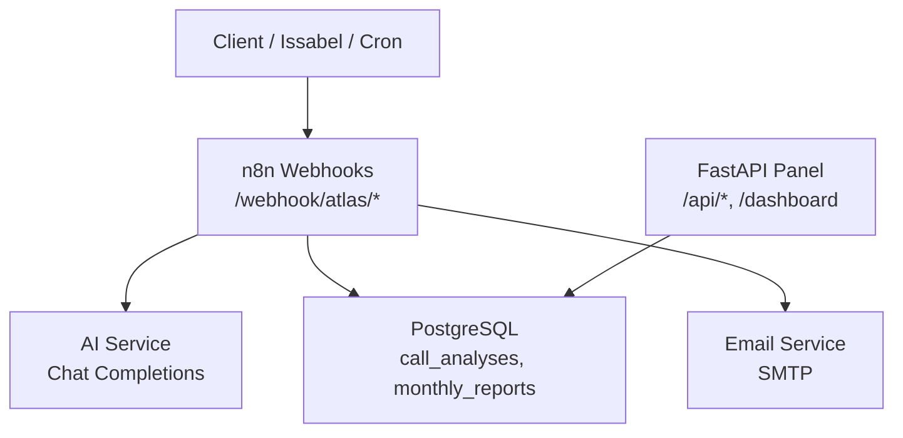
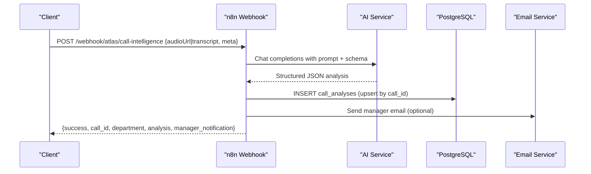
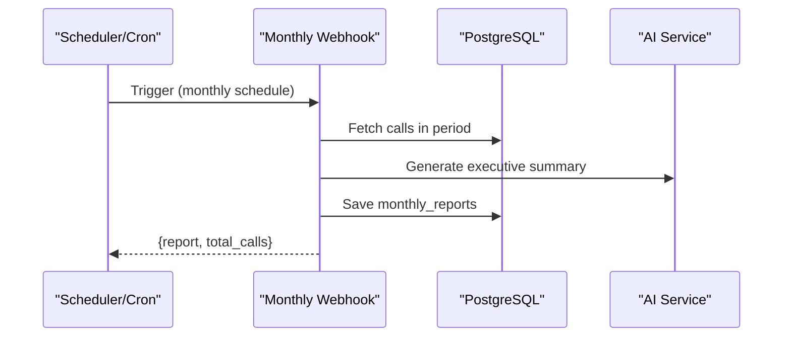
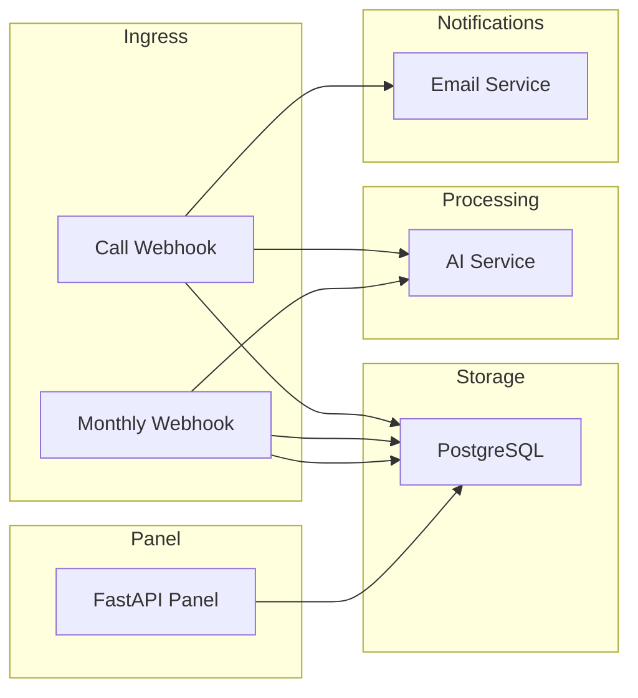

# API Reference

<cite>
**Referenced Files in This Document**
- [README.md](file://03_Products/Atlas Call Intelligence/V1/README.md)
- [schema.json](file://03_Products/Atlas Call Intelligence/V1/schema.json)
- [atlas-call-intelligence-v1.json](file://docker/n8n/workflows/atlas-call-intelligence-v1.json)
- [atlas-call-intelligence-monthly-report.json](file://docker/n8n/workflows/atlas-call-intelligence-monthly-report.json)
- [main.py](file://docker/panel/app/main.py)
- [config.py](file://docker/panel/app/config.py)
- [queries.py](file://docker/panel/app/queries.py)
- [001_call_intelligence.sql](file://docker/postgres/init/001_call_intelligence.sql)
- [send_email.py](file://docker/mailer/send_email.py)
- [docker-compose.yml](file://docker/docker-compose.yml)
</cite>

## Table of Contents
1. [Introduction](#introduction)
2. [Project Structure](#project-structure)
3. [Core Components](#core-components)
4. [Architecture Overview](#architecture-overview)
5. [Detailed Component Analysis](#detailed-component-analysis)
6. [Dependency Analysis](#dependency-analysis)
7. [Performance Considerations](#performance-considerations)
8. [Troubleshooting Guide](#troubleshooting-guide)
9. [Conclusion](#conclusion)
10. [Appendices](#appendices)

## Introduction
This document provides the API reference for the Atlas platform’s integration points, focusing on:
- Webhook endpoints for call analysis and monthly reporting
- REST APIs exposed by the Atlas Manager Panel
- Data schemas, authentication, error handling, and client implementation guidance

The system integrates telephony recordings or transcripts with AI-driven analysis, persists results to PostgreSQL, and optionally notifies managers via email.

## Project Structure
Key components involved in the API surface:
- n8n webhooks that receive call analysis requests and generate reports
- FastAPI-based Atlas Manager Panel exposing UI routes and a few JSON APIs
- PostgreSQL database storing call analyses and monthly reports
- Optional email service for manager notifications

**Diagram sources**
- [atlas-call-intelligence-v1.json:12-24](file://docker/n8n/workflows/atlas-call-intelligence-v1.json#L12-L24)
- [atlas-call-intelligence-monthly-report.json:12-38](file://docker/n8n/workflows/atlas-call-intelligence-monthly-report.json#L12-L38)
- [main.py:16-186](file://docker/panel/app/main.py#L16-L186)
- [001_call_intelligence.sql:4-44](file://docker/postgres/init/001_call_intelligence.sql#L4-L44)

**Section sources**
- [README.md:71-168](file://03_Products/Atlas Call Intelligence/V1/README.md#L71-L168)
- [docker-compose.yml:26-58](file://docker/docker-compose.yml#L26-L58)

## Core Components
- Call Analysis Webhook: Accepts audio URL or transcript, runs AI analysis, stores results, and sends manager notification.
- Monthly Report Webhook: Aggregates call data for a given month, generates executive summary, saves report, and optionally emails it.
- Panel REST APIs: Provide dashboard data and statistics (JSON) behind optional simple password protection.

Authentication and security:
- Panel uses an optional cookie-based middleware for login when PANEL_PASSWORD is set.
- No built-in API key validation on webhooks; secure deployment should restrict access at network level (firewall, reverse proxy).

Versioning:
- Workflow version embedded in responses as workflow_version "1.0.0".

Rate limiting:
- Not implemented in code; rely on infrastructure-level rate limiting if needed.

**Section sources**
- [main.py:40-65](file://docker/panel/app/main.py#L40-L65)
- [config.py:12-13](file://docker/panel/app/config.py#L12-L13)
- [atlas-call-intelligence-v1.json:12-24](file://docker/n8n/workflows/atlas-call-intelligence-v1.json#L12-L24)
- [atlas-call-intelligence-monthly-report.json:12-38](file://docker/n8n/workflows/atlas-call-intelligence-monthly-report.json#L12-L38)

## Architecture Overview
End-to-end flow for call analysis:

End-to-end flow for monthly report:

**Diagram sources**
- [atlas-call-intelligence-v1.json:26-154](file://docker/n8n/workflows/atlas-call-intelligence-v1.json#L26-L154)
- [atlas-call-intelligence-monthly-report.json:41-159](file://docker/n8n/workflows/atlas-call-intelligence-monthly-report.json#L41-L159)
- [001_call_intelligence.sql:4-44](file://docker/postgres/init/001_call_intelligence.sql#L4-L44)

## Detailed Component Analysis

### Webhook: Call Intelligence
- Endpoint: POST /webhook/atlas/call-intelligence
- Purpose: Submit audio URL or transcript for AI analysis; store results; notify manager.
- Request body fields (flexible keys accepted):
  - audioUrl/audio_url/fileUrl/file_url/url: string (one of audioUrl or transcript required)
  - transcript/text/transcript_text: string
  - call_id/callId: string
  - department/dept: string (sales/support/auto)
  - agent_name/agentName: string
  - agent_id/agentId: string
  - customer_phone/customerPhone: string
  - customer_name/customerName: string
  - call_direction/callDirection: string (inbound/outbound)
  - call_duration_seconds/callDuration: number
  - call_date/callDate: ISO8601 string
  - product_context/productContext: string
- Response fields:
  - success: boolean
  - call_id: string
  - department: string
  - email_sent: boolean (optional)
  - email_error: string|null (optional)
  - analysis: object conforming to schema.json
  - manager_notification: object with to, subject, body
- Error handling:
  - If neither transcript nor audioUrl provided, webhook raises an error.
  - Database and email steps are marked continue-on-fail; response still includes success flag and analysis if available.
- Security:
  - No request signature or API key in code; protect via network controls.
- Versioning:
  - workflow_version "1.0.0" included in analysis.meta.

Example request and response shapes are documented in the product README.

**Section sources**
- [README.md:71-142](file://03_Products/Atlas Call Intelligence/V1/README.md#L71-L142)
- [atlas-call-intelligence-v1.json:26-154](file://docker/n8n/workflows/atlas-call-intelligence-v1.json#L26-L154)
- [schema.json:1-153](file://03_Products/Atlas Call Intelligence/V1/schema.json#L1-L153)

### Webhook: Monthly Report
- Endpoint: POST /webhook/atlas/call-intelligence/monthly-report
- Purpose: Generate monthly aggregated report and executive summary.
- Request body (optional):
  - year: integer
  - month: integer
  - department: string (default "all")
- Behavior:
  - If no body, defaults to previous month.
  - Computes period start/end, fetches calls, aggregates stats, calls AI for executive summary, saves to monthly_reports.
- Response fields:
  - success: boolean
  - report: object with meta, department_stats, agent_rankings, top_performers, needs_coaching, executive
  - report_month: string
  - total_calls: integer
- Schedule:
  - Cron configured to run monthly (first day at 8 AM timezone Asia/Tehran).

**Section sources**
- [README.md:144-162](file://03_Products/Atlas Call Intelligence/V1/README.md#L144-L162)
- [atlas-call-intelligence-monthly-report.json:12-159](file://docker/n8n/workflows/atlas-call-intelligence-monthly-report.json#L12-L159)

### Panel REST APIs
Base path: http://localhost:5678 (or your panel host)

- Authentication middleware:
  - If PANEL_PASSWORD is set, all non-login and non-static paths require a cookie atlas_auth=1 obtained via POST /login with Form field password.
  - GET /login renders login page; POST /login validates password and sets cookie.
- Endpoints:
  - GET /api/stats → returns overview stats JSON
  - GET /api/ai-insights → returns { insights: text } generated from current context
  - GET /calls/{call_id} → HTML detail page (not JSON)
  - Other GET routes render HTML pages for dashboards and reports
- Notes:
  - These are primarily UI endpoints; only /api/* return JSON.
  - Use cookies for session after successful login.

**Section sources**
- [main.py:40-65](file://docker/panel/app/main.py#L40-L65)
- [main.py:166-186](file://docker/panel/app/main.py#L166-L186)
- [config.py:12-13](file://docker/panel/app/config.py#L12-L13)

### Data Model (for integrators)
- call_analyses table columns include call_id, analyzed_at, department, agent_id, agent_name, customer_phone, customer_name, call_date, call_direction, call_duration_seconds, audio_url, transcript_text, analysis_json (JSONB), purchase_intent_score, satisfaction_final_score, agent_quality_score, ticket_priority, needs_human_review, workflow_version.
- monthly_reports table columns include id, report_month, department, report_json (JSONB), total_calls, created_at.

Indexes exist for performance on analyzed_at, agent_id, department, call_date, and report_month.

**Section sources**
- [001_call_intelligence.sql:4-44](file://docker/postgres/init/001_call_intelligence.sql#L4-L44)

### Email Notifications
- The call analysis workflow attempts to send a manager email via an internal HTTP endpoint; failures do not block the response.
- A standalone script exists to send test emails using SMTP settings from environment variables.

**Section sources**
- [atlas-call-intelligence-v1.json:105-119](file://docker/n8n/workflows/atlas-call-intelligence-v1.json#L105-L119)
- [send_email.py:9-34](file://docker/mailer/send_email.py#L9-L34)

## Dependency Analysis
High-level dependencies between services:

**Diagram sources**
- [atlas-call-intelligence-v1.json:26-154](file://docker/n8n/workflows/atlas-call-intelligence-v1.json#L26-L154)
- [atlas-call-intelligence-monthly-report.json:41-159](file://docker/n8n/workflows/atlas-call-intelligence-monthly-report.json#L41-L159)
- [main.py:16-186](file://docker/panel/app/main.py#L16-L186)
- [001_call_intelligence.sql:4-44](file://docker/postgres/init/001_call_intelligence.sql#L4-L44)

**Section sources**
- [docker-compose.yml:26-58](file://docker/docker-compose.yml#L26-L58)

## Performance Considerations
- Concurrency: n8n handles webhook concurrency; ensure sufficient worker capacity.
- Database: Queries use indexes on analyzed_at, agent_id, department, call_date, and report_month for efficient reporting.
- AI latency: AI calls can be slow; consider timeouts and retries at the orchestration layer.
- Storage: analysis_json is stored as JSONB; keep payloads reasonable in size.

[No sources needed since this section provides general guidance]

## Troubleshooting Guide
Common issues and checks:
- Missing inputs: Ensure either transcript or audioUrl is provided; otherwise the webhook will raise an error.
- AI errors: If AI parsing fails, analysis may contain parse_error; check response.success and analysis.parse_error.
- Database write failures: The save step continues on failure; verify records exist in call_analyses.
- Email delivery: Email sending is best-effort; inspect email_sent and email_error in the response.
- Panel access: If PANEL_PASSWORD is set, log in via POST /login to obtain the cookie before accessing protected routes.

Operational tips:
- Validate payload against schema.json before sending.
- Log call_id across systems to trace requests end-to-end.
- Use the monthly report webhook to validate data availability and aggregation logic.

**Section sources**
- [atlas-call-intelligence-v1.json:26-154](file://docker/n8n/workflows/atlas-call-intelligence-v1.json#L26-L154)
- [atlas-call-intelligence-monthly-report.json:41-159](file://docker/n8n/workflows/atlas-call-intelligence-monthly-report.json#L41-L159)
- [main.py:40-65](file://docker/panel/app/main.py#L40-L65)

## Conclusion
The Atlas platform exposes two primary webhooks for call analysis and monthly reporting, plus a small set of JSON APIs in the panel. Integrations should submit structured payloads, handle both success and partial-success scenarios, and rely on infrastructure-level security and rate limiting. Use the provided schemas and endpoints to build robust integrations for call intelligence workflows.

[No sources needed since this section summarizes without analyzing specific files]

## Appendices

### API Catalog

- Call Analysis Webhook
  - Method: POST
  - Path: /webhook/atlas/call-intelligence
  - Auth: None in code; protect via network controls
  - Request: See “Webhook: Call Intelligence” above
  - Response: See “Webhook: Call Intelligence” above

- Monthly Report Webhook
  - Method: POST
  - Path: /webhook/atlas/call-intelligence/monthly-report
  - Auth: None in code; protect via network controls
  - Request: { year?, month?, department? }
  - Response: { success, report, report_month, total_calls }

- Panel Stats API
  - Method: GET
  - Path: /api/stats
  - Auth: Cookie-based if PANEL_PASSWORD is set
  - Response: Overview stats object

- Panel AI Insights API
  - Method: GET
  - Path: /api/ai-insights
  - Auth: Cookie-based if PANEL_PASSWORD is set
  - Response: { insights: string }

**Section sources**
- [README.md:71-162](file://03_Products/Atlas Call Intelligence/V1/README.md#L71-L162)
- [main.py:166-186](file://docker/panel/app/main.py#L166-L186)

### Schema Reference
- Output schema for call analysis is defined in schema.json and includes sections for meta, input, transcript, customer, agent_performance, sales_analysis, support_analysis, ticket, insights, and quality_control.

**Section sources**
- [schema.json:1-153](file://03_Products/Atlas Call Intelligence/V1/schema.json#L1-L153)

### Environment Variables
- n8n environment variables include API_URL, TRANSCRIPTION_API_URL, API_KEY, AI_MODEL, ATLAS_MANAGER_EMAIL, ATLAS_SMTP_FROM.
- Panel environment variables include DB_* and PANEL_PASSWORD.

**Section sources**
- [docker-compose.yml:34-53](file://docker/docker-compose.yml#L34-L53)
- [config.py:3-13](file://docker/panel/app/config.py#L3-L13)