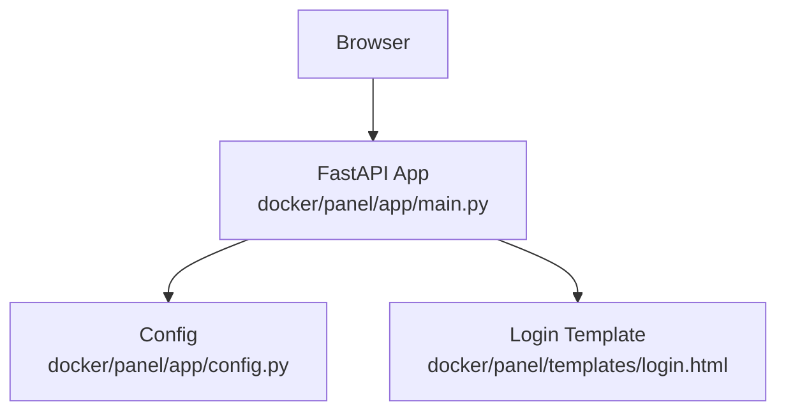
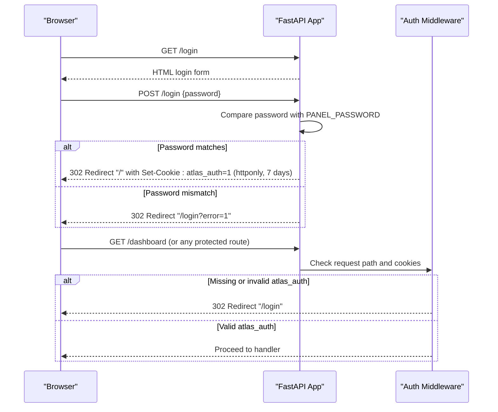
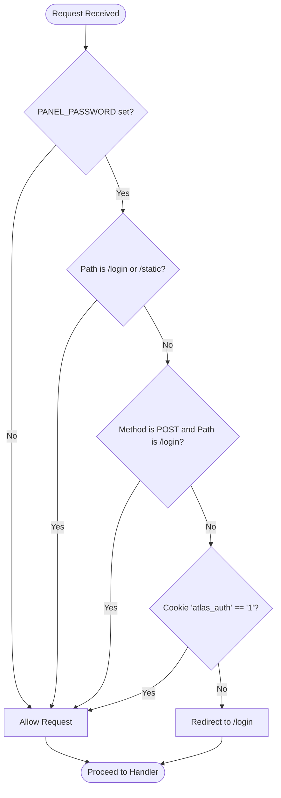
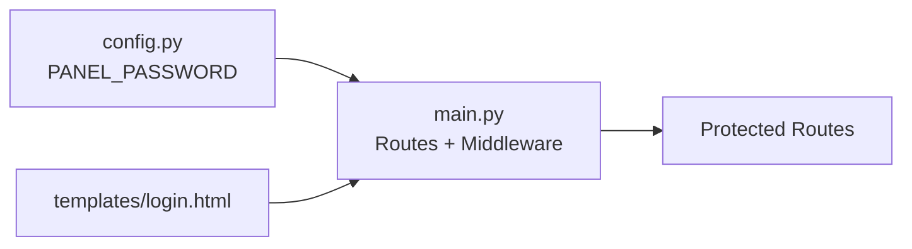

# Authentication

<cite>
**Referenced Files in This Document**
- [main.py](file://docker/panel/app/main.py)
- [config.py](file://docker/panel/app/config.py)
- [login.html](file://docker/panel/templates/login.html)
</cite>

## Table of Contents
1. [Introduction](#introduction)
2. [Project Structure](#project-structure)
3. [Core Components](#core-components)
4. [Architecture Overview](#architecture-overview)
5. [Detailed Component Analysis](#detailed-component-analysis)
6. [Dependency Analysis](#dependency-analysis)
7. [Performance Considerations](#performance-considerations)
8. [Troubleshooting Guide](#troubleshooting-guide)
9. [Conclusion](#conclusion)
10. [Appendices](#appendices)

## Introduction
This document explains the Atlas platform’s authentication for the management panel. It covers cookie-based session authentication, middleware protection, the login flow (including POST /login), password validation, session cookie behavior, and security considerations. It also provides examples of authenticated requests, error handling for failed logins, logout procedures, and environment variable configuration for PANEL_PASSWORD with best practices for production deployments.

## Project Structure
The authentication logic is implemented in the FastAPI application under the panel service:
- Application entrypoint and routes: main.py
- Configuration and secrets: config.py
- Login UI template: login.html

**Diagram sources**
- [main.py:1-187](file://docker/panel/app/main.py#L1-L187)
- [config.py:1-14](file://docker/panel/app/config.py#L1-L14)
- [login.html:1-18](file://docker/panel/templates/login.html#L1-L18)

**Section sources**
- [main.py:1-187](file://docker/panel/app/main.py#L1-L187)
- [config.py:1-14](file://docker/panel/app/config.py#L1-L14)
- [login.html:1-18](file://docker/panel/templates/login.html#L1-L18)

## Core Components
- Login page GET /login: Renders the login form when PANEL_PASSWORD is configured; otherwise redirects to dashboard.
- Login submission POST /login: Validates the submitted password against PANEL_PASSWORD. On success, sets a secure session cookie and redirects to /. On failure, redirects back to /login with an error flag.
- Authentication middleware: Protects all routes except /login and /static by requiring the atlas_auth cookie to be present and equal to "1". Allows POST /login without the cookie to process submissions.
- Configuration: PANEL_PASSWORD is read from environment variables. When empty, authentication is effectively disabled and users are redirected to the dashboard on GET /login.

Key behaviors:
- Cookie name: atlas_auth
- Cookie value: "1"
- Cookie attributes: httponly=True, max_age set to 7 days
- Middleware bypasses: /login and /static paths
- Error signaling: query parameter ?error=1 on redirect after failed login

**Section sources**
- [main.py:40-65](file://docker/panel/app/main.py#L40-L65)
- [config.py:12-13](file://docker/panel/app/config.py#L12-L13)
- [login.html:11-15](file://docker/panel/templates/login.html#L11-L15)

## Architecture Overview
The authentication flow uses a simple password check and a stateless HTTP-only cookie to maintain sessions across requests.

**Diagram sources**
- [main.py:40-65](file://docker/panel/app/main.py#L40-L65)

## Detailed Component Analysis

### Login Page (GET /login)
- Behavior: If PANEL_PASSWORD is not set, clients are redirected to the dashboard. Otherwise, the login template is rendered.
- Security note: Without PANEL_PASSWORD, no authentication is enforced.

**Section sources**
- [main.py:40-44](file://docker/panel/app/main.py#L40-L44)
- [config.py:12-13](file://docker/panel/app/config.py#L12-L13)

### Login Submission (POST /login)
- Validation: Compares the submitted password field with PANEL_PASSWORD.
- Success: Sets the atlas_auth cookie with httponly enabled and a 7-day lifetime, then redirects to the dashboard.
- Failure: Redirects back to /login with an error query parameter to signal failure.

**Section sources**
- [main.py:47-53](file://docker/panel/app/main.py#L47-L53)
- [login.html:11-15](file://docker/panel/templates/login.html#L11-L15)

### Authentication Middleware
- Scope: Applies to all HTTP requests.
- Protection rules:
  - If PANEL_PASSWORD is configured, any request to paths other than /login and /static must include atlas_auth=1.
  - POST /login is allowed without the cookie so that login submissions can be processed.
- Enforcement: Requests missing the required cookie are redirected to /login.

**Diagram sources**
- [main.py:56-65](file://docker/panel/app/main.py#L56-L65)

**Section sources**
- [main.py:56-65](file://docker/panel/app/main.py#L56-L65)

### Session Cookie Mechanism
- Name: atlas_auth
- Value: "1"
- Attributes:
  - httponly: True (prevents client-side script access)
  - max_age: 7 days (1 week)
- Behavior: Present on successful login; required for subsequent requests to protected routes.

Security considerations:
- The cookie is HttpOnly, reducing XSS-based theft risk.
- No explicit Secure flag is set; ensure HTTPS termination at the reverse proxy/load balancer so cookies are only sent over secure connections.
- No SameSite attribute is set; consider configuring SameSite=Lax or Strict at the proxy level if needed.
- The session is stateless and tied to a static password; there is no server-side session store or rotation.

**Section sources**
- [main.py:47-53](file://docker/panel/app/main.py#L47-L53)

### Environment Variables and Configuration
- PANEL_PASSWORD: Required to enable authentication. When empty, authentication is disabled and GET /login redirects to the dashboard.
- Other variables (DB_*, AI_*): Not directly related to authentication but part of the same configuration module.

Best practices:
- Always set PANEL_PASSWORD in production via secure secret management.
- Do not hardcode credentials in code or templates.
- Use HTTPS in front of the application to protect cookies in transit.
- Restrict network access to the panel to trusted networks or VPNs where possible.

**Section sources**
- [config.py:12-13](file://docker/panel/app/config.py#L12-L13)
- [main.py:40-44](file://docker/panel/app/main.py#L40-L44)

## Dependency Analysis
Authentication depends on:
- FastAPI routing and middleware
- Jinja2 templates for rendering the login page
- Environment configuration for PANEL_PASSWORD

**Diagram sources**
- [config.py:12-13](file://docker/panel/app/config.py#L12-L13)
- [main.py:40-65](file://docker/panel/app/main.py#L40-L65)
- [login.html:11-15](file://docker/panel/templates/login.html#L11-L15)

**Section sources**
- [main.py:40-65](file://docker/panel/app/main.py#L40-L65)
- [config.py:12-13](file://docker/panel/app/config.py#L12-L13)
- [login.html:11-15](file://docker/panel/templates/login.html#L11-L15)

## Performance Considerations
- Authentication is lightweight: a single string comparison and cookie read/write per request.
- No database or external calls are involved in auth flows.
- Ensure the reverse proxy terminates TLS to avoid exposing credentials and cookies in plaintext.

[No sources needed since this section provides general guidance]

## Troubleshooting Guide
Common issues and resolutions:
- Cannot access dashboard: Verify that atlas_auth=1 is present in cookies after a successful login. If missing, re-login.
- Repeated redirects to /login: Ensure PANEL_PASSWORD is set and matches the submitted password. Also confirm that your browser accepts cookies for the domain.
- Failed login loop: After a failed attempt, you will be redirected to /login?error=1. Clear any stale cookies and try again.
- Accessing API endpoints: All non-/login and non-/static routes require the atlas_auth cookie. Include it in requests or authenticate first via the web UI.

Logout procedure:
- There is no dedicated logout endpoint. To “log out,” clear the atlas_auth cookie in your browser settings or use private/incognito mode. Alternatively, configure your reverse proxy to drop or invalidate the cookie as needed.

Error handling details:
- POST /login with wrong password returns a 302 redirect to /login?error=1.
- Unauthenticated requests to protected routes return a 302 redirect to /login.

**Section sources**
- [main.py:47-65](file://docker/panel/app/main.py#L47-L65)

## Conclusion
Atlas’s panel uses a simple, stateless, cookie-based authentication model centered around a single PANEL_PASSWORD and the atlas_auth cookie. While straightforward and efficient, it lacks advanced features such as token rotation, multi-factor authentication, and centralized session stores. For production, enforce HTTPS, manage PANEL_PASSWORD securely, and consider adding additional protections at the reverse proxy layer.

[No sources needed since this section summarizes without analyzing specific files]

## Appendices

### Example Requests

- Successful login
  - POST /login with form field password matching PANEL_PASSWORD
  - Response: 302 Redirect to "/" with Set-Cookie: atlas_auth=1 (httponly, 7 days)

- Failed login
  - POST /login with incorrect password
  - Response: 302 Redirect to "/login?error=1"

- Accessing a protected route without authentication
  - GET /dashboard (or any protected path)
  - Response: 302 Redirect to "/login"

- Accessing a protected route with valid session
  - GET /dashboard with Cookie: atlas_auth=1
  - Response: 200 OK with dashboard content

[No sources needed since this section provides usage examples]

### Security Best Practices for Production
- Set PANEL_PASSWORD via secure secret management; never commit secrets to source control.
- Terminate TLS at the reverse proxy/load balancer to protect cookies in transit.
- Restrict access to the panel via IP allowlists or VPN where feasible.
- Monitor logs for repeated failed login attempts and consider rate limiting at the proxy layer.
- Consider adding SameSite and Secure cookie attributes at the proxy level if supported.

[No sources needed since this section provides general guidance]