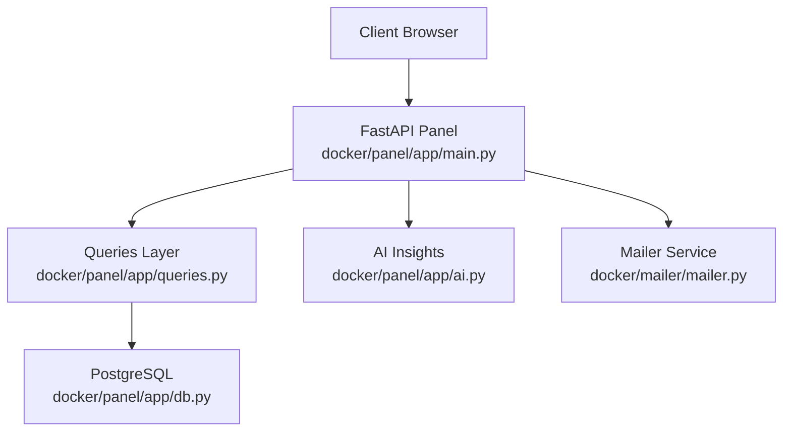
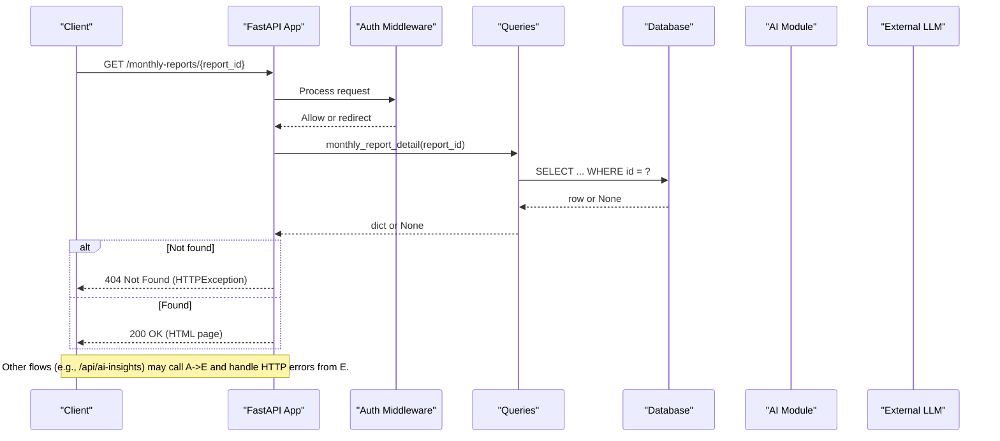
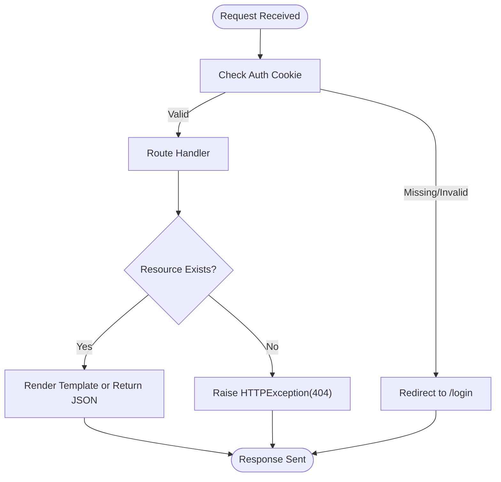
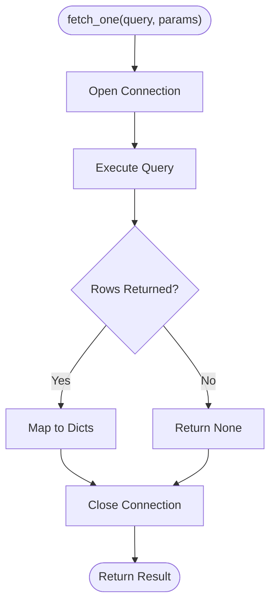
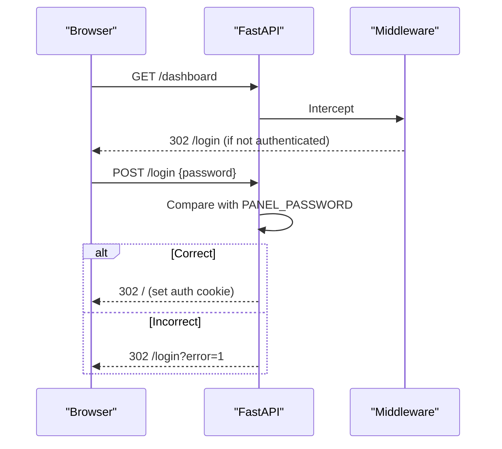
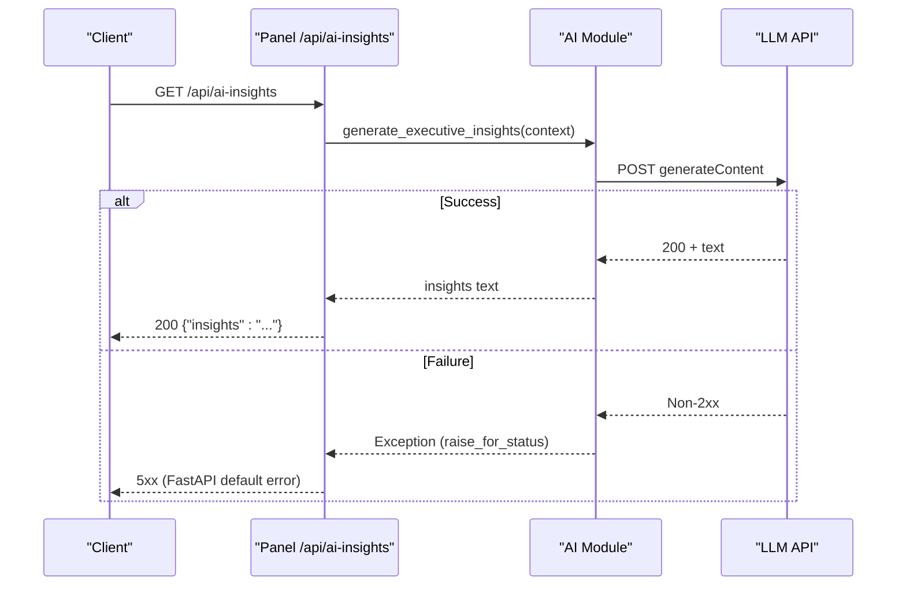
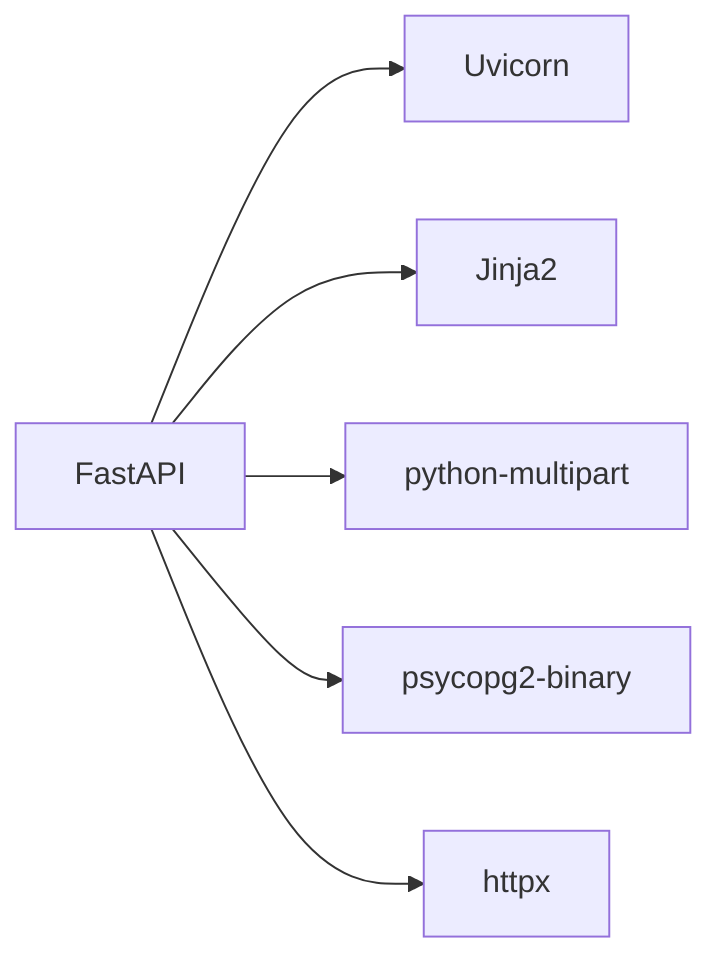

# Error Handling

<cite>
**Referenced Files in This Document**
- [main.py](file://docker/panel/app/main.py)
- [config.py](file://docker/panel/app/config.py)
- [db.py](file://docker/panel/app/db.py)
- [queries.py](file://docker/panel/app/queries.py)
- [ai.py](file://docker/panel/app/ai.py)
- [mailer.py](file://docker/mailer/mailer.py)
- [requirements.txt](file://docker/panel/requirements.txt)
- [Dockerfile](file://docker/panel/Dockerfile)
- [test-result.json](file://docker/scripts/test-result.json)
</cite>

## Table of Contents
1. [Introduction](#introduction)
2. [Project Structure](#project-structure)
3. [Core Components](#core-components)
4. [Architecture Overview](#architecture-overview)
5. [Detailed Component Analysis](#detailed-component-analysis)
6. [Dependency Analysis](#dependency-analysis)
7. [Performance Considerations](#performance-considerations)
8. [Troubleshooting Guide](#troubleshooting-guide)
9. [Conclusion](#conclusion)
10. [Appendices](#appendices)

## Introduction
This document explains how the Atlas platform handles errors across its FastAPI-based panel and supporting services. It covers HTTP status codes, error response formats, exception handling patterns (including FastAPI’s HTTPException), authentication-related redirects, validation failures, external service errors, logging strategies, and guidance for building robust client-side error handling.

## Project Structure
The Atlas panel is a FastAPI application that serves HTML pages and a few JSON APIs. It uses:
- FastAPI routes with Jinja2 templates for UI pages
- A simple cookie-based auth middleware
- PostgreSQL via psycopg2 for data access
- An optional AI insights endpoint calling an external LLM API
- A separate mailer microservice for sending notifications

**Diagram sources**
- [main.py:1-190](file://docker/panel/app/main.py#L1-L190)
- [db.py:1-31](file://docker/panel/app/db.py#L1-L31)
- [queries.py:1-260](file://docker/panel/app/queries.py#L1-L260)
- [ai.py:1-37](file://docker/panel/app/ai.py#L1-L37)
- [mailer.py:1-77](file://docker/mailer/mailer.py#L1-L77)

**Section sources**
- [main.py:1-190](file://docker/panel/app/main.py#L1-L190)
- [requirements.txt:1-6](file://docker/panel/requirements.txt#L1-L6)
- [Dockerfile:1-10](file://docker/panel/Dockerfile#L1-L10)

## Core Components
- FastAPI app and routes: define endpoints, template rendering, and redirects for authentication.
- Authentication middleware: enforces a simple password gate using cookies.
- Data layer: database connection management and query helpers.
- Query module: encapsulates SQL queries used by routes.
- AI module: calls an external LLM API to generate insights.
- Mailer service: standalone HTTP server that sends emails via SMTP and returns structured JSON responses.

Key error handling patterns observed:
- FastAPI HTTPException(404) for missing resources
- RedirectResponse for authentication failures
- httpx raise_for_status() for external API errors
- Mailer service returning explicit JSON with success/error fields and appropriate HTTP status codes

**Section sources**
- [main.py:43-68](file://docker/panel/app/main.py#L43-L68)
- [main.py:150-184](file://docker/panel/app/main.py#L150-L184)
- [ai.py:7-36](file://docker/panel/app/ai.py#L7-L36)
- [mailer.py:18-68](file://docker/mailer/mailer.py#L18-L68)

## Architecture Overview
The panel exposes both HTML views and minimal JSON endpoints. Errors can occur at multiple layers:
- Request routing and middleware (authentication)
- Route handlers (validation and business logic)
- Data access (database connectivity and query execution)
- External integrations (LLM API, SMTP mailer)

**Diagram sources**
- [main.py:150-184](file://docker/panel/app/main.py#L150-L184)
- [queries.py:207-211](file://docker/panel/app/queries.py#L207-L211)
- [db.py:21-30](file://docker/panel/app/db.py#L21-L30)
- [ai.py:7-36](file://docker/panel/app/ai.py#L7-L36)

## Detailed Component Analysis

### FastAPI Routes and HTTPException Usage
- Missing resource handling: When a requested report or call detail does not exist, the route raises HTTPException(404).
- Authentication: The middleware redirects unauthenticated users to /login; login failure redirects back with an error flag.
- Template rendering: Successful requests return HTML pages; JSON endpoints return plain JSON objects.

**Diagram sources**
- [main.py:59-68](file://docker/panel/app/main.py#L59-L68)
- [main.py:150-184](file://docker/panel/app/main.py#L150-L184)

**Section sources**
- [main.py:43-68](file://docker/panel/app/main.py#L43-L68)
- [main.py:150-184](file://docker/panel/app/main.py#L150-L184)

### Database Access and Error Propagation
- Connection context manager ensures connections are closed even on exceptions.
- fetch_one/fetch_all execute queries and return results; if no rows are found, functions return None or empty lists.
- Route handlers interpret None results as “not found” and raise 404.

**Diagram sources**
- [db.py:12-30](file://docker/panel/app/db.py#L12-L30)

**Section sources**
- [db.py:1-31](file://docker/panel/app/db.py#L1-L31)
- [queries.py:207-211](file://docker/panel/app/queries.py#L207-L211)
- [queries.py:228-232](file://docker/panel/app/queries.py#L228-L232)

### Authentication Flow and Validation Failures
- Simple password protection via environment variable PANEL_PASSWORD.
- If disabled, all requests bypass auth; if enabled, unauthenticated requests are redirected to /login.
- Login POST validates the submitted password; incorrect credentials redirect back with an error indicator.

**Diagram sources**
- [main.py:43-68](file://docker/panel/app/main.py#L43-L68)
- [config.py:12-13](file://docker/panel/app/config.py#L12-L13)

**Section sources**
- [main.py:43-68](file://docker/panel/app/main.py#L43-L68)
- [config.py:1-14](file://docker/panel/app/config.py#L1-L14)

### External Integrations: AI Insights and Mailer
- AI insights endpoint calls an external LLM API using httpx; non-2xx responses trigger an exception via raise_for_status().
- Mailer service returns structured JSON with success/error fields and sets appropriate HTTP status codes (200, 400, 404, 500).

**Diagram sources**
- [ai.py:7-36](file://docker/panel/app/ai.py#L7-L36)
- [main.py:169-173](file://docker/panel/app/main.py#L169-L173)

**Section sources**
- [ai.py:1-37](file://docker/panel/app/ai.py#L1-L37)
- [mailer.py:18-68](file://docker/mailer/mailer.py#L18-L68)

### Error Response Formats
- FastAPI 404 Not Found: For missing reports or call details, the route raises HTTPException(404). Clients should expect a 404 status code.
- Authentication redirects: Unauthenticated or invalid login attempts result in 302 redirects to /login or /login?error=1.
- Mailer service responses:
  - 404 for unknown paths
  - 400 for invalid JSON payloads
  - 200 for successful email send
  - 500 for configuration or runtime errors
  - Body includes success and error fields when applicable

Example structures (described):
- Mailer success: { "success": true, "method": "smtp", "to": "<email>", "subject": "<subject>" }
- Mailer failure: { "success": false, "error": "<message>" }
- Test result artifact shows nested error capture including message, name, code, and status fields for downstream error reporting.

**Section sources**
- [main.py:150-184](file://docker/panel/app/main.py#L150-L184)
- [mailer.py:36-68](file://docker/mailer/mailer.py#L36-L68)
- [test-result.json:1-19](file://docker/scripts/test-result.json#L1-L19)

## Dependency Analysis
- FastAPI and Uvicorn provide the web server and routing framework.
- psycopg2-binary connects to PostgreSQL for data retrieval.
- httpx is used for asynchronous HTTP calls to external APIs.
- Jinja2 renders HTML templates.
- python-multipart supports form parsing for login.

**Diagram sources**
- [requirements.txt:1-6](file://docker/panel/requirements.txt#L1-L6)

**Section sources**
- [requirements.txt:1-6](file://docker/panel/requirements.txt#L1-L6)

## Performance Considerations
- Database connections are opened per query via a context manager; ensure queries are efficient and avoid unnecessary round-trips.
- External API calls (AI insights) use timeouts; consider retry policies and circuit breakers in production.
- Template rendering is synchronous; keep templates lightweight to reduce latency.
- Static assets are served directly; ensure caching headers are configured at the reverse proxy level.

[No sources needed since this section provides general guidance]

## Troubleshooting Guide
Common issues and diagnostics:
- 404 Not Found: Occurs when requesting a non-existent report or call detail. Verify IDs and database contents.
- Authentication loops: If PANEL_PASSWORD is set but cookies are blocked or expired, clients will be redirected repeatedly to /login. Ensure cookies are allowed and session persists.
- Invalid JSON to mailer: Sending malformed JSON to the mailer returns 400 with an error message. Validate payloads before sending.
- External API failures: AI insights endpoint may fail due to network issues or invalid API keys. Inspect logs and environment variables (AI_API_KEY).
- SMTP misconfiguration: Mailer returns 500 with an error indicating missing SMTP_PASS or other SMTP issues.

Logging and debugging tips:
- Enable Uvicorn standard logging to capture request/response details.
- Add application-level logging around critical sections (DB calls, external API calls) to record inputs and outcomes.
- Use browser dev tools to inspect redirects and response bodies for JSON endpoints.
- Review test artifacts (e.g., test-result.json) to understand how downstream systems capture and propagate errors.

**Section sources**
- [main.py:59-68](file://docker/panel/app/main.py#L59-L68)
- [main.py:150-184](file://docker/panel/app/main.py#L150-L184)
- [mailer.py:36-68](file://docker/mailer/mailer.py#L36-L68)
- [ai.py:7-36](file://docker/panel/app/ai.py#L7-L36)
- [test-result.json:1-19](file://docker/scripts/test-result.json#L1-L19)

## Conclusion
Atlas’s error handling combines FastAPI’s built-in exception model with explicit checks for missing resources and simple authentication guards. External integrations surface errors through exceptions and structured JSON responses. By following the patterns documented here—using HTTPException for not-found cases, validating inputs, handling external service failures, and returning consistent JSON—you can build resilient clients that gracefully recover from errors and provide clear feedback to users.

[No sources needed since this section summarizes without analyzing specific files]

## Appendices

### Standard HTTP Status Codes Used
- 200 OK: Successful operations (JSON or HTML responses)
- 302 Found: Redirects for authentication flow
- 400 Bad Request: Invalid JSON payload to mailer
- 404 Not Found: Missing resources (reports, call details)
- 500 Internal Server Error: Configuration or runtime errors (e.g., SMTP misconfiguration)

**Section sources**
- [main.py:150-184](file://docker/panel/app/main.py#L150-L184)
- [mailer.py:36-68](file://docker/mailer/mailer.py#L36-L68)

### Client-Side Error Handling Best Practices
- Always check HTTP status codes before parsing response bodies.
- Handle 302 redirects by respecting Location headers or using a library that follows redirects automatically.
- For JSON endpoints, parse responses safely and display user-friendly messages based on error fields.
- Implement retries with exponential backoff for transient failures (network timeouts, 5xx).
- Log correlation IDs or request timestamps to aid debugging across services.

[No sources needed since this section provides general guidance]