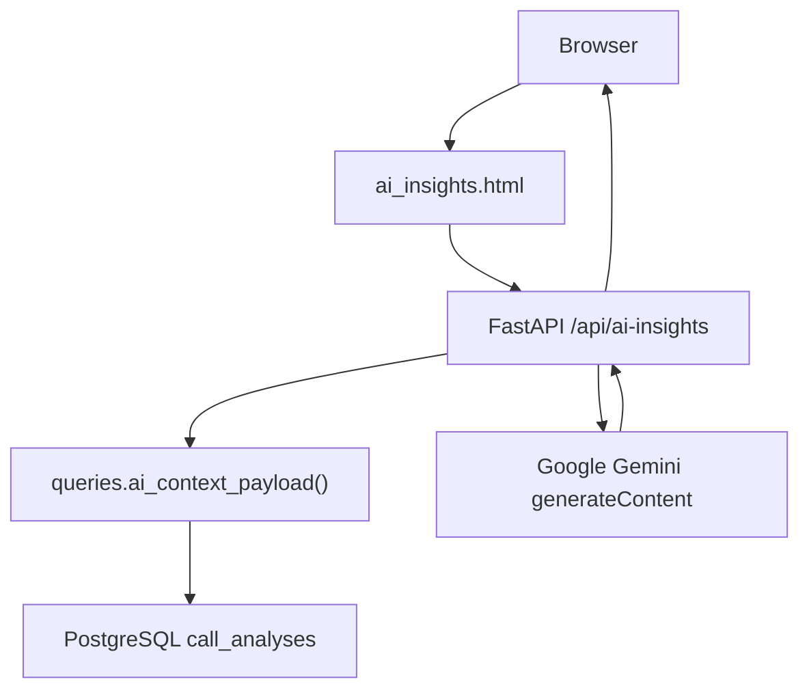
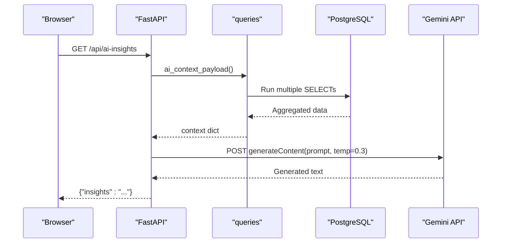
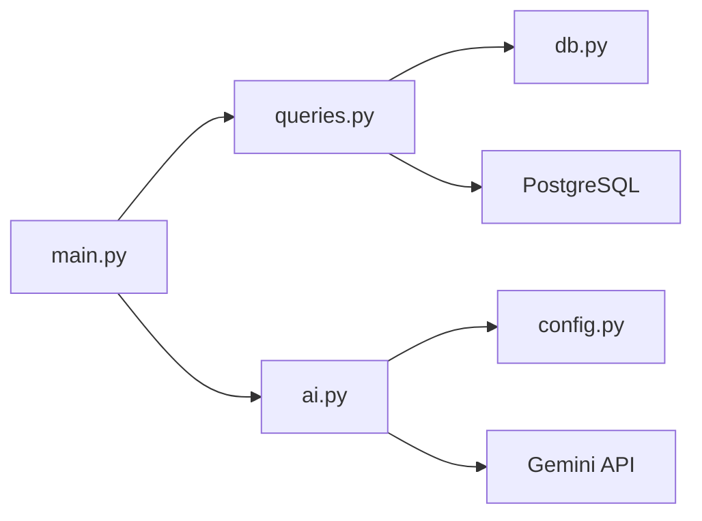

# AI Insights API

<cite>
**Referenced Files in This Document**
- [main.py](file://docker/panel/app/main.py)
- [ai.py](file://docker/panel/app/ai.py)
- [queries.py](file://docker/panel/app/queries.py)
- [config.py](file://docker/panel/app/config.py)
- [db.py](file://docker/panel/app/db.py)
- [ai_insights.html](file://docker/panel/templates/ai_insights.html)
- [001_call_intelligence.sql](file://docker/postgres/init/001_call_intelligence.sql)
</cite>

## Table of Contents
1. [Introduction](#introduction)
2. [Project Structure](#project-structure)
3. [Core Components](#core-components)
4. [Architecture Overview](#architecture-overview)
5. [Detailed Component Analysis](#detailed-component-analysis)
6. [Dependency Analysis](#dependency-analysis)
7. [Performance Considerations](#performance-considerations)
8. [Troubleshooting Guide](#troubleshooting-guide)
9. [Conclusion](#conclusion)
10. [Appendices](#appendices)

## Introduction
This document explains the /api/ai-insights endpoint that generates executive insights using AI processing. It covers the GET method, how internal context is assembled from PostgreSQL, how the AI model is invoked, the insight generation process, response format, configuration options, and operational considerations such as rate limiting and caching.

## Project Structure
The endpoint is implemented in a FastAPI application with clear separation:
- Routing and request handling in main.py
- Data aggregation via queries.py against PostgreSQL (schema defined in 001_call_intelligence.sql)
- AI integration in ai.py calling Google Gemini
- Configuration in config.py for database and AI settings
- Frontend template ai_insights.html triggers the API call from the browser

**Diagram sources**
- [main.py:183-187](file://docker/panel/app/main.py#L183-L187)
- [queries.py:250-259](file://docker/panel/app/queries.py#L250-L259)
- [ai.py:7-36](file://docker/panel/app/ai.py#L7-L36)
- [ai_insights.html:12-22](file://docker/panel/templates/ai_insights.html#L12-L22)
- [001_call_intelligence.sql:4-33](file://docker/postgres/init/001_call_intelligence.sql#L4-L33)

**Section sources**
- [main.py:183-187](file://docker/panel/app/main.py#L183-L187)
- [ai_insights.html:12-22](file://docker/panel/templates/ai_insights.html#L12-L22)

## Core Components
- Endpoint handler: GET /api/ai-insights returns JSON with an insights text field.
- Context builder: Aggregates key metrics and lists from PostgreSQL to form a rich prompt payload.
- AI integration: Sends a structured prompt to Google Gemini and extracts generated text.
- Configuration: Reads database credentials and AI provider settings from environment variables.

Key behaviors:
- The endpoint constructs a context object containing overview stats, top performers, ready-to-buy leads, unhappy customers, staff satisfaction, department breakdown, and recent calls.
- The AI module builds a Persian-language executive report prompt and calls Gemini with a low temperature for stable outputs.
- If no AI key is configured, the endpoint returns a localized message indicating missing configuration.

**Section sources**
- [main.py:183-187](file://docker/panel/app/main.py#L183-L187)
- [queries.py:250-259](file://docker/panel/app/queries.py#L250-L259)
- [ai.py:7-36](file://docker/panel/app/ai.py#L7-L36)
- [config.py:9-10](file://docker/panel/app/config.py#L9-L10)

## Architecture Overview
The request flow:
1. Browser loads the AI insights page and calls /api/ai-insights.
2. FastAPI handler gathers context from PostgreSQL via queries.
3. AI module composes a prompt and calls Google Gemini.
4. Response text is returned to the client as JSON.

**Diagram sources**
- [main.py:183-187](file://docker/panel/app/main.py#L183-L187)
- [queries.py:250-259](file://docker/panel/app/queries.py#L250-L259)
- [ai.py:7-36](file://docker/panel/app/ai.py#L7-L36)

## Detailed Component Analysis

### Endpoint Handler: GET /api/ai-insights
- Path: /api/ai-insights
- Method: GET
- Behavior:
  - Builds context by calling queries.ai_context_payload().
  - Calls generate_executive_insights(context).
  - Returns JSON: { "insights": "<AI-generated text>" }.
- Error behavior:
  - No explicit HTTP error handling; failures propagate as HTTP errors from downstream calls or exceptions.

Response schema:
- insights: string (AI-generated executive analysis in Persian).

Example response:
{
  "insights": "Executive summary and recommendations..."
}

**Section sources**
- [main.py:183-187](file://docker/panel/app/main.py#L183-L187)

### Context Payload Generation
- Function: queries.ai_context_payload()
- Composes:
  - overview_stats(): total calls, satisfaction, intent, quality, hot leads, unhappy counts, duration.
  - top_performers(limit=5): agent performance and success scores.
  - ready_to_buy(limit=10): high purchase intent leads with next steps and probabilities.
  - unhappy_customers(limit=10): low satisfaction or retention risk cases.
  - staff_satisfaction()[:10]: per-agent satisfaction metrics.
  - department_breakdown(): department-level aggregates.
  - recent_calls(limit=10): latest calls for recency context.
- Database access: Uses psycopg2 connections and RealDictCursor for dict rows.

Complexity notes:
- Each subquery runs once per request; overall cost scales with number of tables and result sizes.
- Limits are applied to keep payloads manageable for LLM prompts.

**Section sources**
- [queries.py:6-23](file://docker/panel/app/queries.py#L6-L23)
- [queries.py:26-49](file://docker/panel/app/queries.py#L26-L49)
- [queries.py:52-76](file://docker/panel/app/queries.py#L52-L76)
- [queries.py:79-106](file://docker/panel/app/queries.py#L79-L106)
- [queries.py:147-165](file://docker/panel/app/queries.py#L147-L165)
- [queries.py:235-247](file://docker/panel/app/queries.py#L235-L247)
- [queries.py:214-225](file://docker/panel/app/queries.py#L214-L225)
- [queries.py:250-259](file://docker/panel/app/queries.py#L250-L259)
- [db.py:21-30](file://docker/panel/app/db.py#L21-L30)
- [001_call_intelligence.sql:4-33](file://docker/postgres/init/001_call_intelligence.sql#L4-L33)

### AI Model Integration
- Function: generate_executive_insights(context)
- Prompt construction:
  - Role and task description for an executive advisor.
  - Structured sections requested: status summary, strengths, urgent issues, sales opportunities, actionable recommendations, next-week priorities.
  - Injects the context dictionary into the prompt.
- Model invocation:
  - Target: Google Gemini generateContent endpoint.
  - Parameters: model from config, temperature 0.3 for stability.
  - Timeout: 120 seconds for the HTTP client.
- Output extraction:
  - Returns the first candidate’s text content.
- Configuration:
  - AI_API_KEY and AI_MODEL read from environment variables.
  - If AI_API_KEY is missing, returns a localized message indicating the key is not set.

Error handling:
- Raises HTTP errors on non-2xx responses from the AI provider.
- Missing API key short-circuits with a descriptive message.

**Section sources**
- [ai.py:7-36](file://docker/panel/app/ai.py#L7-L36)
- [config.py:9-10](file://docker/panel/app/config.py#L9-L10)

### Frontend Interaction
- Template: ai_insights.html
- Behavior:
  - Displays a button to trigger insight generation.
  - On click, fetches /api/ai-insights and renders the insights text into the page.
  - Shows loading state while waiting for the response.

**Section sources**
- [ai_insights.html:12-22](file://docker/panel/templates/ai_insights.html#L12-L22)

## Dependency Analysis
High-level dependencies:
- main.py depends on queries and ai modules.
- queries.py depends on db.py and reads from PostgreSQL tables.
- ai.py depends on httpx and config for provider settings.
- Templates depend on the API for dynamic content.

**Diagram sources**
- [main.py:183-187](file://docker/panel/app/main.py#L183-L187)
- [queries.py:250-259](file://docker/panel/app/queries.py#L250-L259)
- [db.py:21-30](file://docker/panel/app/db.py#L21-L30)
- [ai.py:7-36](file://docker/panel/app/ai.py#L7-L36)
- [config.py:9-10](file://docker/panel/app/config.py#L9-L10)

**Section sources**
- [main.py:183-187](file://docker/panel/app/main.py#L183-L187)
- [queries.py:250-259](file://docker/panel/app/queries.py#L250-L259)
- [ai.py:7-36](file://docker/panel/app/ai.py#L7-L36)

## Performance Considerations
- Database load:
  - Each request executes multiple SELECT statements across call_analyses and monthly_reports. Consider connection pooling and query optimization if traffic increases.
- AI latency:
  - External call to Gemini with a 120-second timeout. Ensure upstream timeouts and retries are tuned.
- Caching strategy:
  - Not implemented in code. For production, consider:
    - Short-lived cache (e.g., Redis) keyed by time window (e.g., last 5 minutes) to avoid repeated AI calls.
    - Cache invalidation on new data writes or scheduled refresh.
- Rate limiting:
  - Not implemented in code. Add middleware or reverse proxy rules to limit requests per IP or user.
- Concurrency:
  - Async endpoint with async HTTP client; ensure worker processes scale appropriately under load.

[No sources needed since this section provides general guidance]

## Troubleshooting Guide
Common issues and resolutions:
- Missing AI key:
  - Symptom: Response contains a message indicating AI_API_KEY is not set.
  - Resolution: Set AI_API_KEY environment variable before starting the service.
- Database connectivity:
  - Symptom: Errors when fetching context.
  - Resolution: Verify DB_HOST, DB_PORT, DB_NAME, DB_USER, DB_PASSWORD environment variables and network reachability.
- AI provider errors:
  - Symptom: Non-2xx HTTP status from Gemini.
  - Resolution: Check API key validity, model name, and quota limits. Inspect logs for detailed error messages.
- Slow responses:
  - Cause: Large context or slow AI inference.
  - Mitigation: Reduce context size, enable caching, and adjust concurrency/timeouts.

**Section sources**
- [ai.py:7-10](file://docker/panel/app/ai.py#L7-L10)
- [config.py:3-10](file://docker/panel/app/config.py#L3-L10)

## Conclusion
The /api/ai-insights endpoint provides a concise way to obtain AI-generated executive insights based on real call analytics stored in PostgreSQL. It combines robust data aggregation with a stable AI prompt and response extraction. For production use, add caching, rate limiting, and monitoring to handle scale and reliability requirements.

[No sources needed since this section summarizes without analyzing specific files]

## Appendices

### Request and Response Specification
- Endpoint: GET /api/ai-insights
- Headers: None required
- Query parameters: None
- Response body:
  - insights: string — AI-generated executive analysis in Persian

Example:
{
  "insights": "Executive summary and recommendations..."
}

**Section sources**
- [main.py:183-187](file://docker/panel/app/main.py#L183-L187)

### Configuration Options
- Environment variables:
  - DB_HOST, DB_PORT, DB_NAME, DB_USER, DB_PASSWORD: PostgreSQL connection details.
  - AI_API_KEY: Required for Gemini access.
  - AI_MODEL: Model identifier used for Gemini (default provided).
  - PANEL_TITLE, PANEL_PASSWORD: Panel UI settings (not directly related to the API).

**Section sources**
- [config.py:3-13](file://docker/panel/app/config.py#L3-L13)

### Data Sources and Schema
- Primary table: call_analyses
  - Columns include call identifiers, timestamps, department, agent info, customer info, durations, transcripts, JSON analysis fields, scores, ticket priority, flags, and workflow version.
- Secondary table: monthly_reports
  - Used for historical reporting views.

**Section sources**
- [001_call_intelligence.sql:4-33](file://docker/postgres/init/001_call_intelligence.sql#L4-L33)