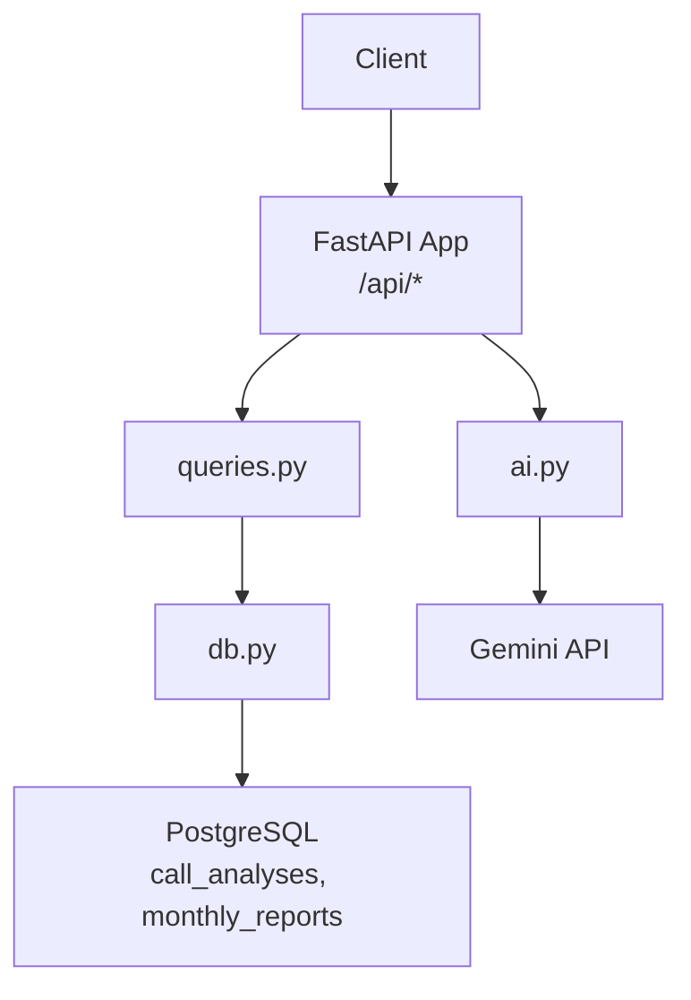
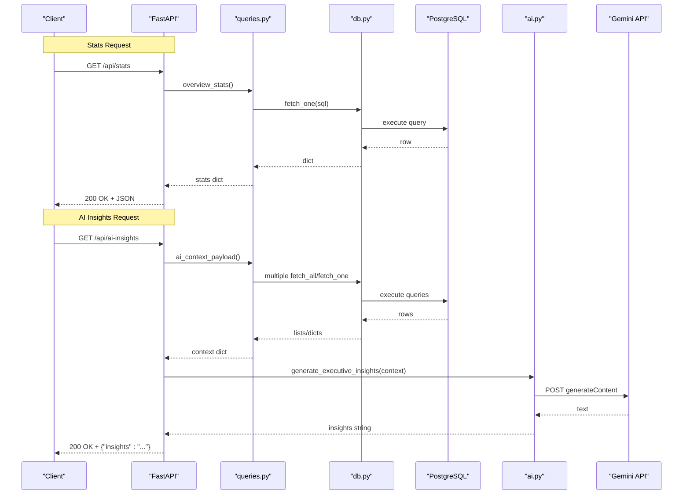
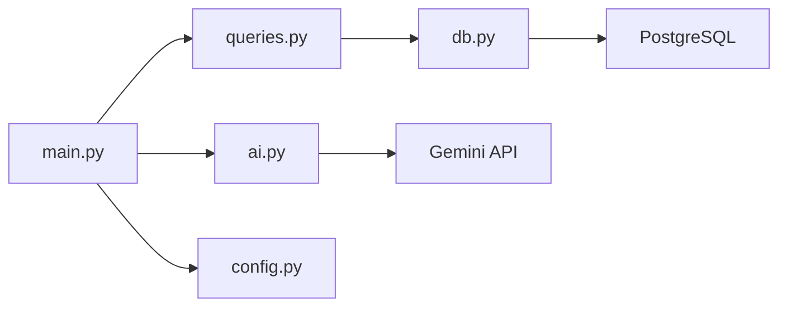

# REST API Calls

<cite>
**Referenced Files in This Document**
- [main.py](file://docker/panel/app/main.py)
- [queries.py](file://docker/panel/app/queries.py)
- [ai.py](file://docker/panel/app/ai.py)
- [config.py](file://docker/panel/app/config.py)
- [db.py](file://docker/panel/app/db.py)
- [001_call_intelligence.sql](file://docker/postgres/init/001_call_intelligence.sql)
</cite>

## Table of Contents
1. [Introduction](#introduction)
2. [Project Structure](#project-structure)
3. [Core Components](#core-components)
4. [Architecture Overview](#architecture-overview)
5. [Detailed Component Analysis](#detailed-component-analysis)
6. [Dependency Analysis](#dependency-analysis)
7. [Performance Considerations](#performance-considerations)
8. [Troubleshooting Guide](#troubleshooting-guide)
9. [Conclusion](#conclusion)
10. [Appendices](#appendices)

## Introduction
This document provides detailed REST API documentation for the Atlas platform’s programmatic interfaces exposed by the Manager Panel. It focuses on two public endpoints:
- GET /api/stats — returns aggregated call analytics statistics
- GET /api/ai-insights — returns AI-generated executive insights based on recent call data

The API is implemented with FastAPI and reads from a PostgreSQL database. Authentication is optional at the panel level; when enabled, it applies to HTML routes and static assets but not explicitly to these JSON endpoints.

## Project Structure
The API lives under the Dockerized Manager Panel application. Key files:
- Route definitions and app configuration are in main.py
- Data retrieval logic is in queries.py
- AI insight generation is in ai.py
- Database connection helpers are in db.py
- Configuration (DB and AI keys) is in config.py
- Database schema is defined in 001_call_intelligence.sql

**Diagram sources**
- [main.py:166-186](file://docker/panel/app/main.py#L166-L186)
- [queries.py:6-23](file://docker/panel/app/queries.py#L6-L23)
- [db.py:21-30](file://docker/panel/app/db.py#L21-L30)
- [ai.py:7-36](file://docker/panel/app/ai.py#L7-L36)
- [001_call_intelligence.sql:4-42](file://docker/postgres/init/001_call_intelligence.sql#L4-L42)

**Section sources**
- [main.py:1-186](file://docker/panel/app/main.py#L1-L186)
- [queries.py:1-260](file://docker/panel/app/queries.py#L1-L260)
- [ai.py:1-37](file://docker/panel/app/ai.py#L1-L37)
- [db.py:1-31](file://docker/panel/app/db.py#L1-L31)
- [config.py:1-14](file://docker/panel/app/config.py#L1-L14)
- [001_call_intelligence.sql:1-45](file://docker/postgres/init/001_call_intelligence.sql#L1-L45)

## Core Components
- Stats endpoint: GET /api/stats returns an overview of call metrics computed from the call_analyses table.
- AI Insights endpoint: GET /api/ai-insights builds a context payload from multiple queries and calls an external LLM to generate a narrative report.

Both endpoints return JSON responses. The stats endpoint is synchronous and database-backed. The AI insights endpoint is asynchronous and depends on an external AI service.

**Section sources**
- [main.py:166-186](file://docker/panel/app/main.py#L166-L186)
- [queries.py:6-23](file://docker/panel/app/queries.py#L6-L23)
- [ai.py:7-36](file://docker/panel/app/ai.py#L7-L36)

## Architecture Overview
The API follows a simple layered design:
- Routes: FastAPI handlers define HTTP endpoints
- Queries: SQL-based functions fetch and aggregate data from PostgreSQL
- AI: Optional integration with Gemini via httpx to produce natural language insights

**Diagram sources**
- [main.py:166-186](file://docker/panel/app/main.py#L166-L186)
- [queries.py:6-23](file://docker/panel/app/queries.py#L6-L23)
- [queries.py:250-259](file://docker/panel/app/queries.py#L250-L259)
- [db.py:21-30](file://docker/panel/app/db.py#L21-L30)
- [ai.py:7-36](file://docker/panel/app/ai.py#L7-L36)

## Detailed Component Analysis

### Endpoint: GET /api/stats
- Purpose: Retrieve aggregated call analytics for the entire dataset or current time window.
- Method: GET
- URL: /api/stats
- Query parameters: None
- Request headers: Content-Type not required for GET
- Response: JSON object with numeric fields summarizing call performance and quality metrics.

Response schema (derived from the underlying query):
- total_calls: integer
- sales_calls: integer
- support_calls: integer
- avg_satisfaction: number (rounded to 1 decimal)
- avg_purchase_intent: number (rounded to 1 decimal)
- avg_agent_quality: number (rounded to 1 decimal)
- needs_review: integer
- hot_leads: integer
- unhappy_count: integer
- total_talk_seconds: integer

Example request:
- GET https://your-domain/api/stats

Example response (illustrative):
{
  "total_calls": 1234,
  "sales_calls": 567,
  "support_calls": 667,
  "avg_satisfaction": 78.4,
  "avg_purchase_intent": 65.2,
  "avg_agent_quality": 72.1,
  "needs_review": 45,
  "hot_leads": 120,
  "unhappy_count": 30,
  "total_talk_seconds": 98765
}

Notes:
- No pagination or filtering is applied at the route level; aggregation covers all records in call_analyses.
- If no data exists, the handler returns an empty object.

**Section sources**
- [main.py:184-186](file://docker/panel/app/main.py#L184-L186)
- [queries.py:6-23](file://docker/panel/app/queries.py#L6-L23)
- [001_call_intelligence.sql:4-27](file://docker/postgres/init/001_call_intelligence.sql#L4-L27)

### Endpoint: GET /api/ai-insights
- Purpose: Generate an executive summary and recommendations based on recent call analytics using an AI model.
- Method: GET
- URL: /api/ai-insights
- Query parameters: None
- Request headers: Content-Type not required for GET
- Response: JSON object with a single field containing the generated insights text.

Response schema:
- insights: string (natural language report)

Example request:
- GET https://your-domain/api/ai-insights

Example response (illustrative):
{
  "insights": "خلاصه وضعیت تیم فروش و پشتیبانی در هفته گذشته نشان می‌دهد که رضایت مشتریان بهبود یافته است..."
}

Behavior details:
- Builds a context payload combining overview stats, top performers, ready-to-buy leads, unhappy customers, staff satisfaction, department breakdown, and recent calls.
- Sends the context to an external LLM (Gemini) to generate a Persian-language executive report.
- If the AI key is not configured, returns a message indicating that the AI key is missing.

Error handling:
- If the AI provider returns an error, the handler will raise an HTTP exception due to response.raise_for_status().

**Section sources**
- [main.py:166-170](file://docker/panel/app/main.py#L166-L170)
- [queries.py:250-259](file://docker/panel/app/queries.py#L250-L259)
- [ai.py:7-36](file://docker/panel/app/ai.py#L7-L36)
- [config.py:9-10](file://docker/panel/app/config.py#L9-L10)

### Data Model Reference
The stats endpoint aggregates data from the call_analyses table. Key fields used include:
- department: categorizes calls (e.g., sales, support)
- purchase_intent_score: indicates likelihood of purchase
- satisfaction_final_score: customer satisfaction metric
- agent_quality_score: quality rating of the agent
- needs_human_review: flag for manual review
- call_duration_seconds: duration of the call

Monthly reports are stored separately and not directly returned by these endpoints.

**Section sources**
- [001_call_intelligence.sql:4-42](file://docker/postgres/init/001_call_intelligence.sql#L4-L42)
- [queries.py:6-23](file://docker/panel/app/queries.py#L6-L23)

## Dependency Analysis
- main.py defines routes and delegates to queries.py and ai.py
- queries.py performs SQL operations via db.py
- db.py manages PostgreSQL connections and cursor execution
- ai.py integrates with Gemini via httpx
- config.py supplies environment-driven settings for DB and AI

**Diagram sources**
- [main.py:9-11](file://docker/panel/app/main.py#L9-L11)
- [queries.py:3](file://docker/panel/app/queries.py#L3)
- [db.py:5](file://docker/panel/app/db.py#L5)
- [ai.py:4](file://docker/panel/app/ai.py#L4)
- [config.py:1-14](file://docker/panel/app/config.py#L1-L14)

**Section sources**
- [main.py:1-186](file://docker/panel/app/main.py#L1-L186)
- [queries.py:1-260](file://docker/panel/app/queries.py#L1-L260)
- [db.py:1-31](file://docker/panel/app/db.py#L1-L31)
- [ai.py:1-37](file://docker/panel/app/ai.py#L1-L37)
- [config.py:1-14](file://docker/panel/app/config.py#L1-L14)

## Performance Considerations
- Stats endpoint executes a single aggregation query; performance depends on indexes on analyzed_at, agent_id, department, and call_date.
- AI insights endpoint involves multiple queries plus an external HTTP call to Gemini; consider caching results if frequent requests are expected.
- Ensure connection pooling or appropriate timeouts for PostgreSQL and AI services to avoid latency spikes.

[No sources needed since this section provides general guidance]

## Troubleshooting Guide
Common issues and resolutions:
- Missing AI key: The AI insights endpoint returns a message indicating that the AI_API_KEY is not set. Configure the environment variable accordingly.
- External AI errors: If the Gemini API responds with an error, the handler raises an HTTP exception. Check network connectivity, API key validity, and rate limits.
- Database connectivity: Ensure DB_HOST, DB_PORT, DB_NAME, DB_USER, and DB_PASSWORD are correctly configured in the environment.

**Section sources**
- [ai.py:7-10](file://docker/panel/app/ai.py#L7-L10)
- [config.py:1-14](file://docker/panel/app/config.py#L1-L14)

## Conclusion
The Atlas Manager Panel exposes two concise REST endpoints for programmatic access to call analytics and AI-generated insights. The stats endpoint provides a quick snapshot of performance metrics, while the AI insights endpoint synthesizes multiple data points into a narrative report. For production use, consider adding authentication, rate limiting, and caching strategies to enhance security and performance.

[No sources needed since this section summarizes without analyzing specific files]

## Appendices

### API Versioning Strategy and Deprecation Policy
Current implementation does not include explicit versioning or deprecation mechanisms. Recommended practices:
- Introduce a version prefix (e.g., /v1/api/stats) to enable backward-compatible evolution.
- Maintain a deprecation policy that announces end-of-life dates for older versions and provides migration guides.
- Use response headers to indicate versioning and deprecation status where applicable.

[No sources needed since this section provides general guidance]

### Client Implementation Examples
Below are example client calls for both endpoints. Replace placeholders with your actual domain and credentials if needed.

- cURL
  - Stats: curl -sS https://your-domain/api/stats
  - AI Insights: curl -sS https://your-domain/api/ai-insights

- Python (requests)
  - Stats: requests.get("https://your-domain/api/stats").json()
  - AI Insights: requests.get("https://your-domain/api/ai-insights").json()

- JavaScript (fetch)
  - Stats: fetch("/api/stats").then(r => r.json())
  - AI Insights: fetch("/api/ai-insights").then(r => r.json())

- Node.js (axios)
  - Stats: axios.get("/api/stats")
  - AI Insights: axios.get("/api/ai-insights")

[No sources needed since this section provides general guidance]