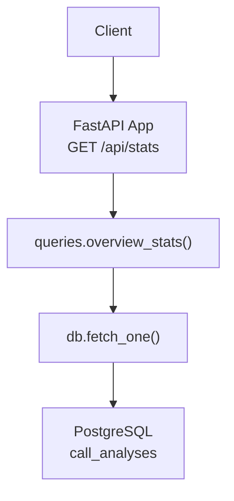
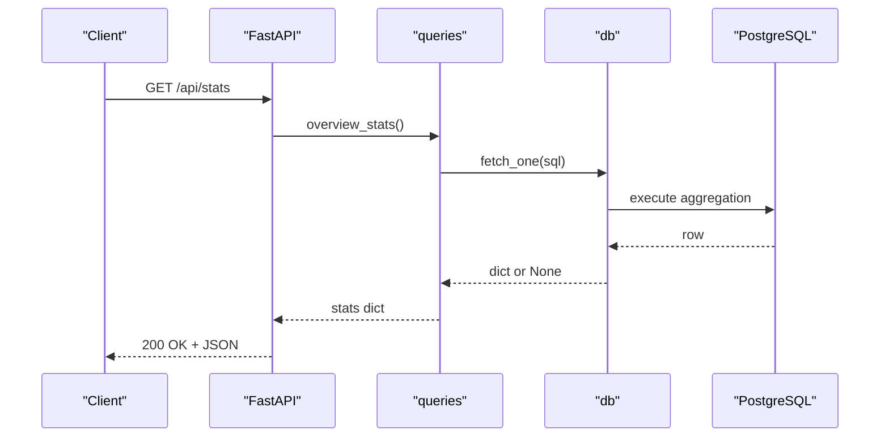
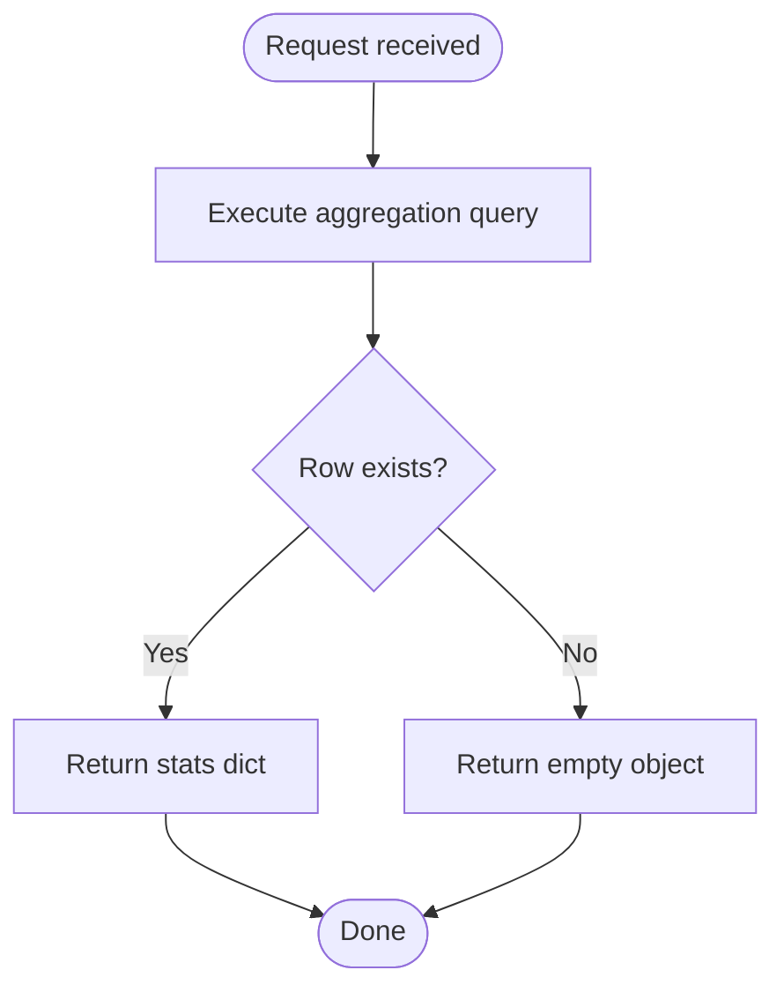
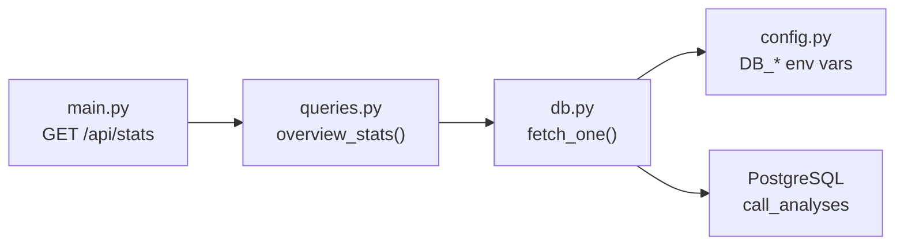

# Statistics API

<cite>
**Referenced Files in This Document**
- [main.py](file://docker/panel/app/main.py)
- [queries.py](file://docker/panel/app/queries.py)
- [db.py](file://docker/panel/app/db.py)
- [config.py](file://docker/panel/app/config.py)
- [001_call_intelligence.sql](file://docker/postgres/init/001_call_intelligence.sql)
</cite>

## Table of Contents
1. [Introduction](#introduction)
2. [Project Structure](#project-structure)
3. [Core Components](#core-components)
4. [Architecture Overview](#architecture-overview)
5. [Detailed Component Analysis](#detailed-component-analysis)
6. [Dependency Analysis](#dependency-analysis)
7. [Performance Considerations](#performance-considerations)
8. [Troubleshooting Guide](#troubleshooting-guide)
9. [Conclusion](#conclusion)
10. [Appendices](#appendices)

## Introduction
This document describes the /api/stats endpoint that provides an overview of call analytics for the Atlas platform. It returns aggregated metrics such as total calls, performance scores, satisfaction ratings, and department breakdowns to support dashboards and reporting tools.

## Project Structure
The endpoint is implemented in a FastAPI application within the panel service. The route handler delegates data retrieval to a queries module that executes SQL against a PostgreSQL database using a small DB helper.

**Diagram sources**
- [main.py:201-203](file://docker/panel/app/main.py#L201-L203)
- [queries.py:6-23](file://docker/panel/app/queries.py#L6-L23)
- [db.py:21-30](file://docker/panel/app/db.py#L21-L30)
- [001_call_intelligence.sql:4-32](file://docker/postgres/init/001_call_intelligence.sql#L4-L32)

**Section sources**
- [main.py:201-203](file://docker/panel/app/main.py#L201-L203)
- [queries.py:6-23](file://docker/panel/app/queries.py#L6-L23)
- [db.py:21-30](file://docker/panel/app/db.py#L21-L30)
- [001_call_intelligence.sql:4-32](file://docker/postgres/init/001_call_intelligence.sql#L4-L32)

## Core Components
- Endpoint: GET /api/stats
- Handler: Returns the result of queries.overview_stats()
- Data source: Aggregates from the call_analyses table (counts, averages, sums)
- Response: JSON object with key metrics used by dashboards and reports

Key responsibilities:
- Provide a single-call summary of overall call volume, quality, satisfaction, and operational indicators
- Support downstream dashboards without requiring multiple requests

**Section sources**
- [main.py:201-203](file://docker/panel/app/main.py#L201-L203)
- [queries.py:6-23](file://docker/panel/app/queries.py#L6-L23)

## Architecture Overview
The request flow is straightforward:
- A client issues a GET to /api/stats
- The FastAPI route invokes queries.overview_stats()
- The query function runs a single aggregation SELECT on call_analyses
- Results are returned as a JSON object

**Diagram sources**
- [main.py:201-203](file://docker/panel/app/main.py#L201-L203)
- [queries.py:6-23](file://docker/panel/app/queries.py#L6-L23)
- [db.py:21-30](file://docker/panel/app/db.py#L21-L30)

## Detailed Component Analysis

### Endpoint Definition
- Method: GET
- Path: /api/stats
- Query parameters: None
- Authentication: Not enforced at this route; if needed, apply middleware globally or per-route
- Response: JSON object containing overview metrics

Notes:
- The handler simply returns the dictionary produced by queries.overview_stats()
- No input validation or filtering is applied at the endpoint layer

**Section sources**
- [main.py:201-203](file://docker/panel/app/main.py#L201-L203)

### Data Aggregation Logic
The overview aggregates across all rows in call_analyses:
- total_calls: total number of analyzed calls
- sales_calls: count where department equals 'sales'
- support_calls: count where department equals 'support'
- avg_satisfaction: average of satisfaction_final_score
- avg_purchase_intent: average of purchase_intent_score
- avg_agent_quality: average of agent_quality_score
- needs_review: count where needs_human_review is true
- hot_leads: count where purchase_intent_score >= 70
- unhappy_count: count where satisfaction_final_score < 60
- total_talk_seconds: sum of call_duration_seconds (coalesced to 0 when null)

**Diagram sources**
- [queries.py:6-23](file://docker/panel/app/queries.py#L6-L23)

**Section sources**
- [queries.py:6-23](file://docker/panel/app/queries.py#L6-L23)

### Database Schema and Indexes
The endpoint reads from call_analyses. Relevant columns include:
- department, agent_id, agent_name, customer_phone, customer_name, call_date, call_direction, call_duration_seconds, analysis_json, purchase_intent_score, satisfaction_final_score, agent_quality_score, ticket_priority, needs_human_review, workflow_version, created_at

Indexes exist for analyzed_at, agent_id, department, and call_date to optimize common queries.

**Section sources**
- [001_call_intelligence.sql:4-32](file://docker/postgres/init/001_call_intelligence.sql#L4-L32)

### Response Schema
The response is a JSON object with the following fields:

- total_calls: integer — Total number of analyzed calls
- sales_calls: integer — Number of calls tagged as 'sales'
- support_calls: integer — Number of calls tagged as 'support'
- avg_satisfaction: number — Average satisfaction score (rounded to one decimal)
- avg_purchase_intent: number — Average purchase intent score (rounded to one decimal)
- avg_agent_quality: number — Average agent quality score (rounded to one decimal)
- needs_review: integer — Count of calls flagged for human review
- hot_leads: integer — Count of calls with purchase_intent_score >= 70
- unhappy_count: integer — Count of calls with satisfaction_final_score < 60
- total_talk_seconds: integer — Sum of call durations in seconds (0 if no duration)

Example response:
{
  "total_calls": 1234,
  "sales_calls": 560,
  "support_calls": 674,
  "avg_satisfaction": 78.4,
  "avg_purchase_intent": 65.2,
  "avg_agent_quality": 81.0,
  "needs_review": 42,
  "hot_leads": 110,
  "unhappy_count": 35,
  "total_talk_seconds": 45000
}

Field descriptions and types are derived from the aggregation logic and underlying schema.

**Section sources**
- [queries.py:6-23](file://docker/panel/app/queries.py#L6-L23)
- [001_call_intelligence.sql:4-32](file://docker/postgres/init/001_call_intelligence.sql#L4-L32)

### Query Parameters
There are no query parameters for this endpoint. If you need filtered views (e.g., by date range or department), extend the handler and query function accordingly.

**Section sources**
- [main.py:201-203](file://docker/panel/app/main.py#L201-L203)
- [queries.py:6-23](file://docker/panel/app/queries.py#L6-L23)

### Usage Examples

Dashboard integration
- Poll periodically (e.g., every 5–15 minutes) to refresh KPI tiles
- Use total_calls, avg_satisfaction, avg_agent_quality, and hot_leads for top-level metrics
- Use needs_review and unhappy_count to trigger alerts or highlight attention areas

Reporting tool integration
- Schedule daily or weekly jobs to fetch /api/stats and persist results for trend analysis
- Combine with other endpoints (e.g., department breakdown) to build comprehensive reports

cURL example:
curl https://your-domain/api/stats

JavaScript fetch example:
fetch("/api/stats")
  .then(r => r.json())
  .then(data => console.log(data));

Python requests example:
import requests
resp = requests.get("https://your-domain/api/stats")
print(resp.json())

[No sources needed since these are usage examples]

## Dependency Analysis
The endpoint depends on:
- FastAPI route registration
- queries.overview_stats() for business logic
- db.fetch_one() for database access
- PostgreSQL connection configured via environment variables

**Diagram sources**
- [main.py:201-203](file://docker/panel/app/main.py#L201-L203)
- [queries.py:6-23](file://docker/panel/app/queries.py#L6-L23)
- [db.py:21-30](file://docker/panel/app/db.py#L21-L30)
- [config.py:1-14](file://docker/panel/app/config.py#L1-L14)

**Section sources**
- [main.py:201-203](file://docker/panel/app/main.py#L201-L203)
- [queries.py:6-23](file://docker/panel/app/queries.py#L6-L23)
- [db.py:21-30](file://docker/panel/app/db.py#L21-L30)
- [config.py:1-14](file://docker/panel/app/config.py#L1-L14)

## Performance Considerations
- Single aggregation query minimizes round-trips and simplifies caching
- Ensure indexes on department, call_date, and analyzed_at are present to support future filtering
- For high-volume environments, consider:
  - Adding time-bounded filters (e.g., last 24 hours)
  - Materialized views or pre-aggregated tables for frequent reads
  - Application-level caching with short TTLs for dashboard refresh cycles

[No sources needed since this section provides general guidance]

## Troubleshooting Guide
Common issues and resolutions:
- Connection errors: Verify DB_HOST, DB_PORT, DB_NAME, DB_USER, DB_PASSWORD environment variables
- Empty response: Indicates no rows in call_analyses; check data ingestion pipelines
- Slow responses: Confirm indexes exist and consider adding time-based filters or caching

Relevant configuration and helpers:
- Database connection string built from environment variables
- fetch_one returns None when no rows are found; the query function handles this by returning an empty dict

**Section sources**
- [config.py:1-14](file://docker/panel/app/config.py#L1-L14)
- [db.py:21-30](file://docker/panel/app/db.py#L21-L30)
- [queries.py:6-23](file://docker/panel/app/queries.py#L6-L23)

## Conclusion
The /api/stats endpoint provides a concise, reliable overview of call analytics for dashboards and reporting. It returns standardized metrics derived from a single aggregation query, making it efficient and easy to integrate. Extend it with filters and caching as your scale and requirements evolve.

## Appendices

### Error Handling Notes
- The endpoint does not define explicit error handling; typical HTTP status codes will be 200 OK with either a stats object or an empty object when there is no data
- Database connectivity issues will surface as server errors; ensure robust monitoring and retries at the client level

[No sources needed since this section summarizes behavior]