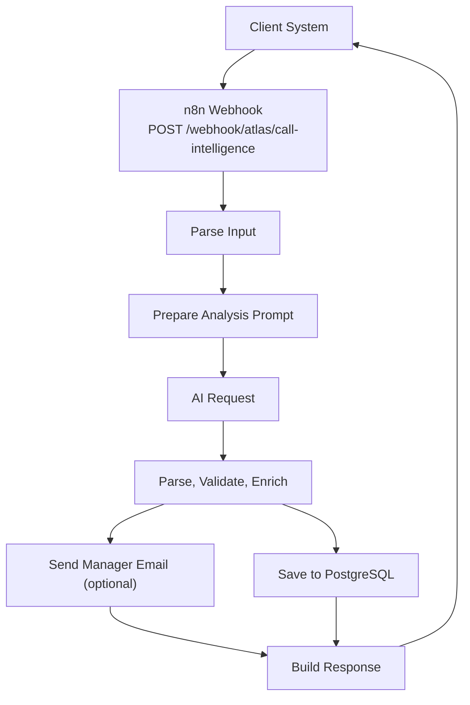
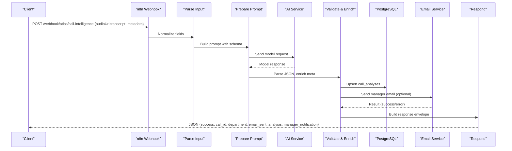
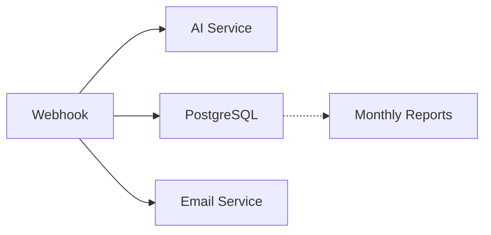

# Webhook Endpoints

<cite>
**Referenced Files in This Document**
- [README.md](file://03_Products/Atlas Call Intelligence/V1/README.md)
- [schema.json](file://03_Products/Atlas Call Intelligence/V1/schema.json)
- [atlas-call-intelligence-v1.json](file://docker/n8n/workflows/atlas-call-intelligence-v1.json)
- [atlas-call-intelligence-monthly-report.json](file://docker/n8n/workflows/atlas-call-intelligence-monthly-report.json)
- [001_call_intelligence.sql](file://docker/postgres/init/001_call_intelligence.sql)
- [send-real-call-analysis.py](file://docker/scripts/send-real-call-analysis.py)
- [test-result.json](file://docker/scripts/test-result.json)
</cite>

## Table of Contents
1. [Introduction](#introduction)
2. [Project Structure](#project-structure)
3. [Core Components](#core-components)
4. [Architecture Overview](#architecture-overview)
5. [Detailed Component Analysis](#detailed-component-analysis)
6. [Dependency Analysis](#dependency-analysis)
7. [Performance Considerations](#performance-considerations)
8. [Troubleshooting Guide](#troubleshooting-guide)
9. [Conclusion](#conclusion)

## Introduction
This document provides comprehensive webhook documentation for the Atlas platform’s call intelligence endpoints. It focuses on the primary endpoint used to submit calls for AI-powered analysis, including HTTP methods, request payload schemas, authentication expectations, response formats, error handling patterns, and operational considerations such as retries and rate limiting. It also documents the monthly reporting endpoint and outlines security best practices based on the repository’s implementation.

## Project Structure
The call intelligence feature is implemented as an n8n workflow that exposes a webhook endpoint, processes incoming payloads, performs transcription/AI analysis, persists results to PostgreSQL, optionally sends manager notifications via email, and returns a structured JSON response. A monthly report endpoint aggregates insights per month.

**Diagram sources**
- [atlas-call-intelligence-v1.json:11-24](file://docker/n8n/workflows/atlas-call-intelligence-v1.json#L11-L24)
- [atlas-call-intelligence-v1.json:25-46](file://docker/n8n/workflows/atlas-call-intelligence-v1.json#L25-L46)
- [atlas-call-intelligence-v1.json:47-61](file://docker/n8n/workflows/atlas-call-intelligence-v1.json#L47-L61)
- [atlas-call-intelligence-v1.json:62-93](file://docker/n8n/workflows/atlas-call-intelligence-v1.json#L62-L93)
- [atlas-call-intelligence-v1.json:105-143](file://docker/n8n/workflows/atlas-call-intelligence-v1.json#L105-L143)

**Section sources**
- [README.md:71-142](file://03_Products/Atlas Call Intelligence/V1/README.md#L71-L142)
- [atlas-call-intelligence-v1.json:11-159](file://docker/n8n/workflows/atlas-call-intelligence-v1.json#L11-L159)
- [atlas-call-intelligence-monthly-report.json:11-39](file://docker/n8n/workflows/atlas-call-intelligence-monthly-report.json#L11-L39)

## Core Components
- Webhook trigger: Accepts POST requests at path atlas/call-intelligence.
- Input parsing: Normalizes multiple field names for audio URL or transcript and metadata.
- Prompt preparation: Builds a structured prompt with context and schema constraints.
- AI request: Calls an external LLM endpoint using environment variables.
- Validation and enrichment: Parses AI output, enriches with metadata, and prepares notifications.
- Persistence: Inserts or upserts records into PostgreSQL.
- Notification: Optionally sends manager emails via an internal mailer service.
- Response builder: Returns a consistent JSON envelope indicating success, call ID, department, optional email status, analysis, and notification details.

Key behaviors observed:
- The workflow accepts either an audio URL or a transcript text; both are not required simultaneously.
- The response includes a success flag, call_id, department, email_sent/email_error, analysis object, and manager_notification fields.
- Database writes and email sending are configured with continue-on-fail behavior to avoid blocking the response.

**Section sources**
- [atlas-call-intelligence-v1.json:11-24](file://docker/n8n/workflows/atlas-call-intelligence-v1.json#L11-L24)
- [atlas-call-intelligence-v1.json:25-46](file://docker/n8n/workflows/atlas-call-intelligence-v1.json#L25-L46)
- [atlas-call-intelligence-v1.json:47-61](file://docker/n8n/workflows/atlas-call-intelligence-v1.json#L47-L61)
- [atlas-call-intelligence-v1.json:62-93](file://docker/n8n/workflows/atlas-call-intelligence-v1.json#L62-L93)
- [atlas-call-intelligence-v1.json:105-143](file://docker/n8n/workflows/atlas-call-intelligence-v1.json#L105-L143)

## Architecture Overview
The end-to-end flow for call analysis submissions:

**Diagram sources**
- [atlas-call-intelligence-v1.json:11-24](file://docker/n8n/workflows/atlas-call-intelligence-v1.json#L11-L24)
- [atlas-call-intelligence-v1.json:25-46](file://docker/n8n/workflows/atlas-call-intelligence-v1.json#L25-L46)
- [atlas-call-intelligence-v1.json:47-61](file://docker/n8n/workflows/atlas-call-intelligence-v1.json#L47-L61)
- [atlas-call-intelligence-v1.json:62-93](file://docker/n8n/workflows/atlas-call-intelligence-v1.json#L62-L93)
- [atlas-call-intelligence-v1.json:105-143](file://docker/n8n/workflows/atlas-call-intelligence-v1.json#L105-L143)

## Detailed Component Analysis

### Endpoint: POST /webhook/atlas/call-intelligence
- Method: POST
- Path: atlas/call-intelligence (full URL depends on n8n host; documented base: http://localhost:5678/webhook/atlas/call-intelligence)
- Content-Type: application/json
- Authentication: No explicit signature verification or auth headers are enforced by the webhook node in the workflow. Secure deployment should place this behind a reverse proxy or gateway that enforces IP allowlisting, TLS, and token-based access control.
- Rate limiting: Not implemented within the workflow. Apply at the gateway/proxy layer if needed.

Request payload schema (normalized by the workflow):
- One of the following must be provided:
  - audioUrl (string): URL to an audio file hosted by your telephony system or panel.
  - transcript (string): Pre-transcribed text when skipping transcription.
- Optional metadata:
  - call_id (string): Unique identifier for the call.
  - department (string): sales | support | auto (default).
  - agent_name (string): Agent name.
  - agent_id (string): Agent identifier.
  - customer_phone (string): Customer phone number.
  - customer_name (string): Customer name.
  - call_direction (string): inbound | outbound.
  - call_duration_seconds (number): Duration in seconds.
  - call_date (string): ISO8601 timestamp.
  - product_context (string): Business context string.

Response format:
- success (boolean): Indicates whether analysis was parsed successfully.
- call_id (string): Echoed call identifier.
- department (string): Detected or provided department.
- email_sent (boolean): Whether manager email was sent successfully.
- email_error (object|null): Error details if email sending failed.
- analysis (object): Full analysis result conforming to the schema defined below.
- manager_notification (object): Notification payload sent to the manager (to, subject, body).

Example successful response structure:
- See the response envelope built by the workflow nodes.

Error handling patterns:
- If input validation fails (e.g., missing audioUrl and transcript), the workflow throws an error early.
- If AI response parsing fails, the response still returns success=false with parse_error and raw_text included in analysis.
- Database insert/update failures are tolerated due to continue-on-fail configuration; success reflects analysis parsing rather than storage outcome.
- Email sending failures are captured and reported in email_error without failing the overall request.

Retry mechanisms:
- The workflow does not implement automatic retries for failed steps. Implement idempotency at the client side using call_id and handle transient errors with exponential backoff at the caller.

Status codes:
- The webhook responds with JSON envelopes. Typical HTTP status codes depend on n8n’s default behavior:
  - 200 OK for successful processing.
  - 4xx/5xx may be returned for malformed requests or internal errors. Inspect the response body for detailed error information.

Security considerations:
- No signature verification is present in the workflow. Protect the endpoint using:
  - HTTPS/TLS termination at the reverse proxy.
  - IP allowlisting or API key/token validation at the gateway.
  - Network isolation (e.g., private network or VPN) for n8n instances.

Operational notes:
- Environment variables drive the AI endpoint and model selection. Ensure these are securely configured.
- The workflow uses PostgreSQL credentials stored in n8n for persistence.

**Section sources**
- [README.md:71-142](file://03_Products/Atlas Call Intelligence/V1/README.md#L71-L142)
- [atlas-call-intelligence-v1.json:11-24](file://docker/n8n/workflows/atlas-call-intelligence-v1.json#L11-L24)
- [atlas-call-intelligence-v1.json:25-46](file://docker/n8n/workflows/atlas-call-intelligence-v1.json#L25-L46)
- [atlas-call-intelligence-v1.json:47-61](file://docker/n8n/workflows/atlas-call-intelligence-v1.json#L47-L61)
- [atlas-call-intelligence-v1.json:62-93](file://docker/n8n/workflows/atlas-call-intelligence-v1.json#L62-L93)
- [atlas-call-intelligence-v1.json:105-143](file://docker/n8n/workflows/atlas-call-intelligence-v1.json#L105-L143)
- [test-result.json:1-23](file://docker/scripts/test-result.json#L1-L23)

### Output Schema: Atlas Call Intelligence
The analysis object conforms to a strict JSON schema defining required sections and typed fields. Key sections include:
- meta: call_id, analyzed_at, department, language, workflow_version, confidence_overall
- input: audio_url, call_direction, call_duration_seconds, agent_name, agent_id, customer_phone, customer_name, call_date
- transcript: full_text, segments (speaker, text, start_sec, end_sec), word_count
- customer: request_summary, needs, pain_points, products_mentioned, sentiment (overall, score, voice_indicators), satisfaction (initial_score, final_score, delta, resolved)
- agent_performance: name, response_quality_score, communication_skills, product_knowledge, empathy_score, process_adherence, strengths, improvements, key_actions_taken
- sales_analysis: applicable, purchase_intent_score, purchase_stage, main_objections, price_sensitivity, estimated_discount_to_close_percent, estimated_close_probability_percent, recommended_next_step, competitor_mentions
- support_analysis: applicable, issue_category, issue_summary, resolution_status, first_call_resolution, process_management_score, customer_retention_risk
- ticket: title, priority, category, description, actionable, recommended_assignee, follow_up_required, follow_up_date, tags
- insights: key_takeaways, risks, opportunities, compliance_notes
- quality_control: transcript_quality, analysis_flags, needs_human_review, review_reason

This schema ensures consistent downstream processing and reporting.

**Section sources**
- [schema.json:1-153](file://03_Products/Atlas Call Intelligence/V1/schema.json#L1-L153)

### Monthly Report Endpoint: POST /webhook/atlas/call-intelligence/monthly-report
- Purpose: Generate and store monthly aggregated reports from call analyses.
- Trigger: Can be invoked manually via webhook or scheduled monthly.
- Behavior: Aggregates statistics, builds a report, saves it to PostgreSQL, and responds with the report payload.

**Section sources**
- [README.md:144-162](file://03_Products/Atlas Call Intelligence/V1/README.md#L144-L162)
- [atlas-call-intelligence-monthly-report.json:11-39](file://docker/n8n/workflows/atlas-call-intelligence-monthly-report.json#L11-L39)
- [atlas-call-intelligence-monthly-report.json:93-130](file://docker/n8n/workflows/atlas-call-intelligence-monthly-report.json#L93-L130)

### Data Storage: PostgreSQL
- Tables:
  - call_analyses: Stores per-call analysis data, including transcript text, JSON analysis, scores, and flags.
  - monthly_reports: Stores monthly aggregated reports with JSON payloads and totals.
- Indexes: Optimized for time-based queries and filtering by department, agent, and date.

**Section sources**
- [001_call_intelligence.sql:1-45](file://docker/postgres/init/001_call_intelligence.sql#L1-L45)

## Dependency Analysis
The webhook workflow depends on several external services and configurations:
- AI service: Configured via environment variables for model and endpoint.
- PostgreSQL: Credentials stored in n8n; used for persistence.
- Email service: Internal mailer endpoint used to send manager notifications.

**Diagram sources**
- [atlas-call-intelligence-v1.json:47-61](file://docker/n8n/workflows/atlas-call-intelligence-v1.json#L47-L61)
- [atlas-call-intelligence-v1.json:73-93](file://docker/n8n/workflows/atlas-call-intelligence-v1.json#L73-L93)
- [atlas-call-intelligence-v1.json:105-143](file://docker/n8n/workflows/atlas-call-intelligence-v1.json#L105-L143)
- [atlas-call-intelligence-monthly-report.json:93-130](file://docker/n8n/workflows/atlas-call-intelligence-monthly-report.json#L93-L130)

**Section sources**
- [atlas-call-intelligence-v1.json:47-61](file://docker/n8n/workflows/atlas-call-intelligence-v1.json#L47-L61)
- [atlas-call-intelligence-v1.json:73-93](file://docker/n8n/workflows/atlas-call-intelligence-v1.json#L73-L93)
- [atlas-call-intelligence-v1.json:105-143](file://docker/n8n/workflows/atlas-call-intelligence-v1.json#L105-L143)
- [atlas-call-intelligence-monthly-report.json:93-130](file://docker/n8n/workflows/atlas-call-intelligence-monthly-report.json#L93-L130)

## Performance Considerations
- Asynchronous side effects: Database writes and email sending are decoupled from the response path where possible; ensure timeouts are appropriate for external dependencies.
- Idempotency: Use call_id to deduplicate submissions at the client level.
- External service latency: AI and email services can introduce delays; consider circuit breakers or fallbacks at the gateway layer.
- Scaling: Place the webhook behind a load balancer and scale n8n workers if necessary.

[No sources needed since this section provides general guidance]

## Troubleshooting Guide
Common issues and debugging techniques:
- Missing input: Ensure either audioUrl or transcript is provided; otherwise, the workflow will throw an error during parsing.
- AI parsing failure: Check the analysis.parse_error and raw_text fields in the response to diagnose malformed AI outputs.
- Email delivery failures: Inspect email_error in the response; verify SMTP or mailer service configuration and connectivity.
- Database write failures: Although configured to continue on fail, check logs and database connectivity; confirm credentials and table schema.
- Network timeouts: Increase timeouts for external calls if needed; monitor for slow responses from AI or email services.

Useful references:
- Example error response demonstrating email_error and parse_error scenarios.
- Scripts that demonstrate calling the mailer and analyzing transcripts for testing.

**Section sources**
- [atlas-call-intelligence-v1.json:25-46](file://docker/n8n/workflows/atlas-call-intelligence-v1.json#L25-L46)
- [atlas-call-intelligence-v1.json:62-93](file://docker/n8n/workflows/atlas-call-intelligence-v1.json#L62-L93)
- [atlas-call-intelligence-v1.json:105-143](file://docker/n8n/workflows/atlas-call-intelligence-v1.json#L105-L143)
- [test-result.json:1-23](file://docker/scripts/test-result.json#L1-L23)
- [send-real-call-analysis.py:17-31](file://docker/scripts/send-real-call-analysis.py#L17-L31)
- [send-real-call-analysis.py:186-196](file://docker/scripts/send-real-call-analysis.py#L186-L196)

## Conclusion
The Atlas Call Intelligence webhook provides a robust, schema-driven pipeline for submitting call recordings or transcripts for AI analysis, persisting results, and optionally notifying managers. While the current implementation does not enforce signature verification or rate limiting within the workflow, these controls should be applied at the deployment boundary to secure and stabilize the endpoint. Clients should implement idempotent retries using call_id and handle partial failures indicated in the response envelope.

[No sources needed since this section summarizes without analyzing specific files]