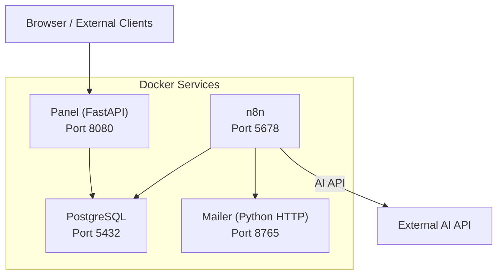
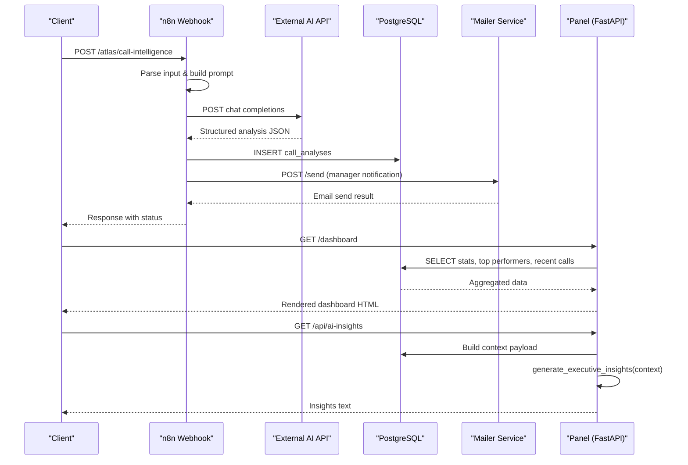
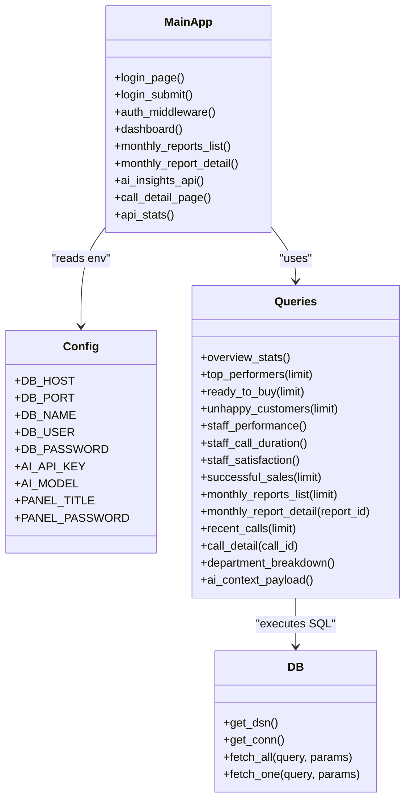
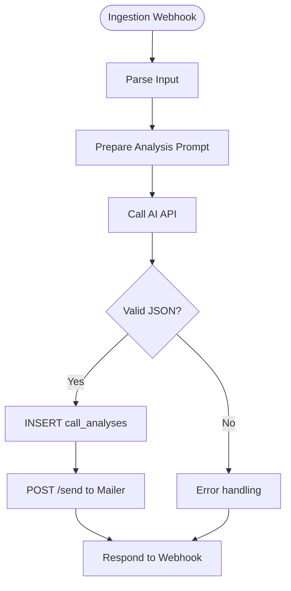
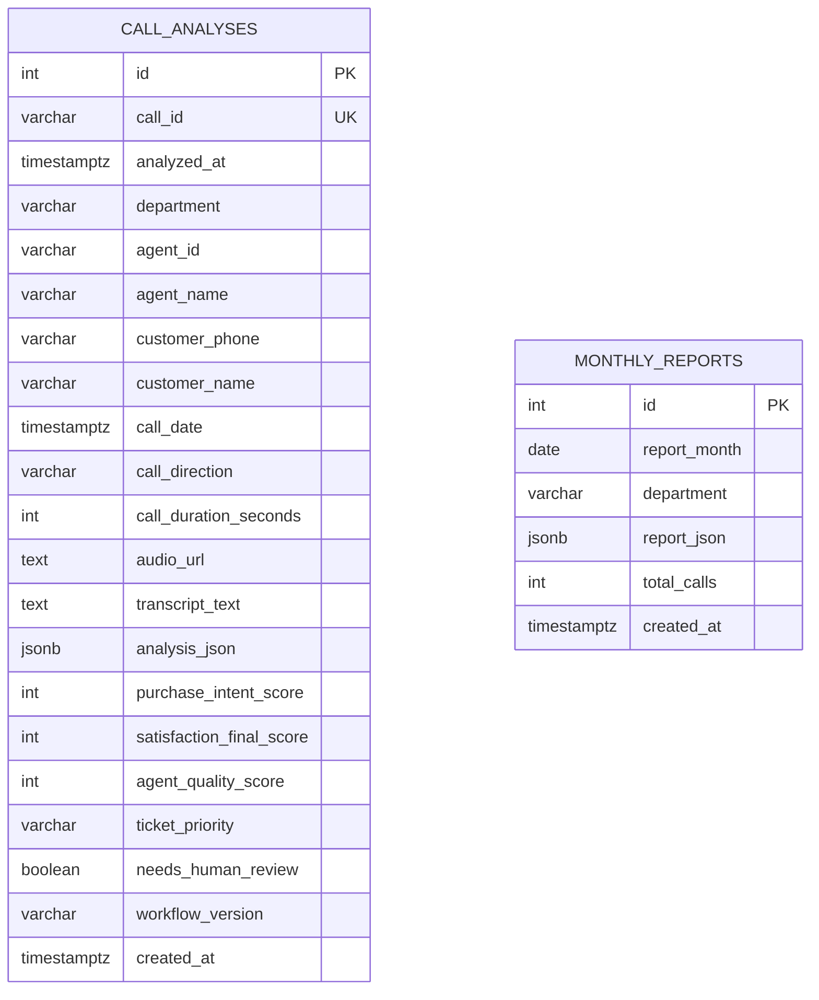
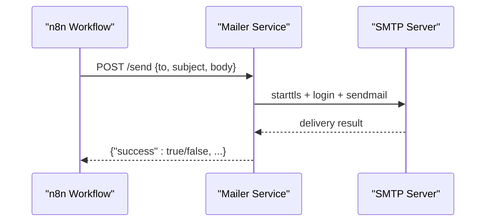
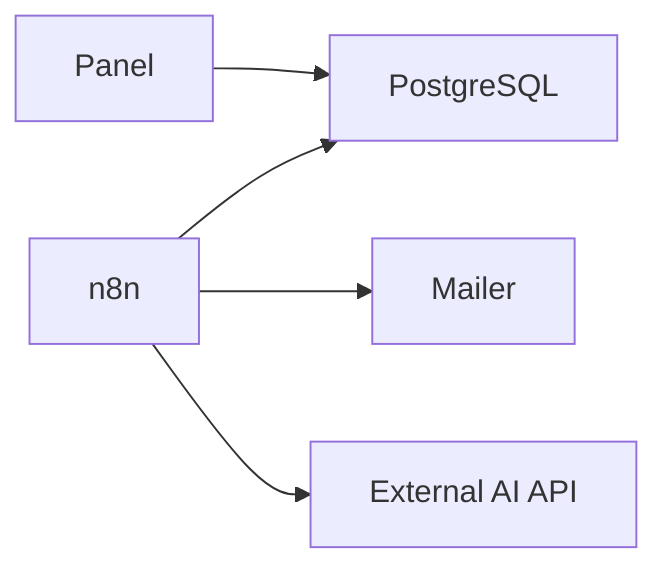

# Architecture Overview

<cite>
**Referenced Files in This Document**
- [docker-compose.yml](file://docker/docker-compose.yml)
- [main.py](file://docker/panel/app/main.py)
- [config.py](file://docker/panel/app/config.py)
- [db.py](file://docker/panel/app/db.py)
- [queries.py](file://docker/panel/app/queries.py)
- [mailer.py](file://docker/mailer/mailer.py)
- [001_call_intelligence.sql](file://docker/postgres/init/001_call_intelligence.sql)
- [atlas-call-intelligence-v1.json](file://docker/n8n/workflows/atlas-call-intelligence-v1.json)
- [audio-analysis-workflow.json](file://docker/n8n/workflows/audio-analysis-workflow.json)
- [atlas-call-intelligence-monthly-report.json](file://docker/n8n/workflows/atlas-call-intelligence-monthly-report.json)
</cite>

## Table of Contents
1. Introduction
2. Project Structure
3. Core Components
4. Architecture Overview
5. Detailed Component Analysis
6. Dependency Analysis
7. Performance Considerations
8. Troubleshooting Guide
9. Conclusion

## Introduction
This document describes the Atlas platform architecture as a containerized microservices system that ingests call data, performs AI-driven analysis via n8n workflows, persists results in PostgreSQL, and exposes reporting through a FastAPI panel. It also documents the mailer service for notifications and explains integration patterns such as webhooks, HTTP calls, and template rendering. The goal is to provide both high-level context and code-mapped details for developers and operators.

## Project Structure
Atlas is organized into four primary services orchestrated by Docker Compose:
- Panel (FastAPI): Web UI and API endpoints backed by Jinja2 templates and PostgreSQL queries.
- n8n: Workflow engine hosting ingestion, analysis, scheduling, and external integrations.
- PostgreSQL: Persistent storage for call analyses and monthly reports.
- Mailer: Lightweight Python HTTP server that sends emails via SMTP.

**Diagram sources**
- [docker-compose.yml:3-98](file://docker/docker-compose.yml#L3-L98)

**Section sources**
- [docker-compose.yml:3-98](file://docker/docker-compose.yml#L3-L98)

## Core Components
- Panel (FastAPI)
  - Serves HTML pages using Jinja2 templates and static assets.
  - Implements authentication middleware based on a configurable password and cookie.
  - Exposes endpoints for dashboards, call detail views, and an AI insights endpoint that aggregates database context and calls an AI function.
  - Reads configuration from environment variables and connects to PostgreSQL via psycopg2.

- n8n Workflows
  - Ingestion webhook parses incoming payloads, prepares prompts, calls an external AI API, saves structured analysis to PostgreSQL, and optionally notifies managers via email.
  - Monthly report workflow runs on a schedule or manual webhook, aggregates metrics, generates executive summaries with AI, and stores reports in PostgreSQL.

- PostgreSQL
  - Stores per-call analyses and monthly aggregated reports with indexes for efficient querying.

- Mailer Service
  - Simple HTTP server exposing POST endpoints to send emails via SMTP with JSON payloads.

**Section sources**
- [main.py:1-187](file://docker/panel/app/main.py#L1-L187)
- [config.py:1-14](file://docker/panel/app/config.py#L1-L14)
- [db.py:1-31](file://docker/panel/app/db.py#L1-L31)
- [queries.py:1-260](file://docker/panel/app/queries.py#L1-L260)
- [atlas-call-intelligence-v1.json:1-160](file://docker/n8n/workflows/atlas-call-intelligence-v1.json#L1-L160)
- [atlas-call-intelligence-monthly-report.json:1-172](file://docker/n8n/workflows/atlas-call-intelligence-monthly-report.json#L1-L172)
- [mailer.py:1-77](file://docker/mailer/mailer.py#L1-L77)
- [001_call_intelligence.sql:1-45](file://docker/postgres/init/001_call_intelligence.sql#L1-L45)

## Architecture Overview
The system follows a clear ingestion-to-analysis-to-reporting flow:
- Ingestion: External systems post call data to n8n’s webhook endpoint.
- Analysis: n8n constructs prompts, calls the configured AI API, validates responses, and persists results to PostgreSQL.
- Reporting: The Panel serves dashboards and detailed views by querying PostgreSQL; it can also request AI-generated insights by assembling a context payload.
- Notifications: n8n triggers the mailer service to send manager notifications after analysis.

**Diagram sources**
- [atlas-call-intelligence-v1.json:12-155](file://docker/n8n/workflows/atlas-call-intelligence-v1.json#L12-L155)
- [main.py:68-187](file://docker/panel/app/main.py#L68-L187)
- [queries.py:6-260](file://docker/panel/app/queries.py#L6-L260)
- [mailer.py:36-68](file://docker/mailer/mailer.py#L36-L68)

## Detailed Component Analysis

### Panel (FastAPI)
- Authentication Middleware
  - Enforces access control when PANEL_PASSWORD is set, redirecting unauthenticated requests to login and issuing a secure cookie upon successful submission.
- Template Rendering
  - Uses Jinja2 templates located under templates/ and mounts static assets under static/.
- Database Access
  - Connects to PostgreSQL using DSN constructed from environment variables and provides fetch helpers returning dictionaries.
- Query Layer
  - Encapsulates all SQL logic for dashboards, performance metrics, satisfaction, sales, and monthly reports.
- AI Integration
  - Provides an endpoint that builds a context payload from multiple queries and delegates insight generation to an internal function.

**Diagram sources**
- [main.py:1-187](file://docker/panel/app/main.py#L1-L187)
- [config.py:1-14](file://docker/panel/app/config.py#L1-L14)
- [db.py:1-31](file://docker/panel/app/db.py#L1-L31)
- [queries.py:1-260](file://docker/panel/app/queries.py#L1-L260)

**Section sources**
- [main.py:40-66](file://docker/panel/app/main.py#L40-L66)
- [main.py:68-187](file://docker/panel/app/main.py#L68-L187)
- [config.py:1-14](file://docker/panel/app/config.py#L1-L14)
- [db.py:8-31](file://docker/panel/app/db.py#L8-L31)
- [queries.py:6-260](file://docker/panel/app/queries.py#L6-L260)

### n8n Workflows
- Call Intelligence Workflow
  - Webhook receives call payloads, normalizes fields, builds a structured prompt, calls the AI API, validates and enriches the response, persists to PostgreSQL, and sends a manager email via the mailer service.
- Audio Analysis Workflow
  - A simpler pipeline that accepts transcripts, prompts an AI model for categorization and insights, and returns formatted results.
- Monthly Report Workflow
  - Scheduled or manually triggered; computes period boundaries, fetches calls within the range, aggregates statistics, generates an executive summary via AI, and stores the report in PostgreSQL.

**Diagram sources**
- [atlas-call-intelligence-v1.json:12-155](file://docker/n8n/workflows/atlas-call-intelligence-v1.json#L12-L155)
- [mailer.py:36-68](file://docker/mailer/mailer.py#L36-L68)

**Section sources**
- [atlas-call-intelligence-v1.json:12-155](file://docker/n8n/workflows/atlas-call-intelligence-v1.json#L12-L155)
- [audio-analysis-workflow.json:5-78](file://docker/n8n/workflows/audio-analysis-workflow.json#L5-L78)
- [atlas-call-intelligence-monthly-report.json:11-159](file://docker/n8n/workflows/atlas-call-intelligence-monthly-report.json#L11-L159)

### PostgreSQL Schema
- call_analyses
  - Stores per-call metadata, transcript, and rich JSONB analysis including scores for purchase intent, satisfaction, agent quality, ticket priority, and flags for human review.
  - Indexed on analyzed_at, agent_id, department, and call_date for efficient reporting.
- monthly_reports
  - Stores monthly aggregated reports with JSONB content and total call counts, indexed on report_month.

**Diagram sources**
- [001_call_intelligence.sql:4-45](file://docker/postgres/init/001_call_intelligence.sql#L4-L45)

**Section sources**
- [001_call_intelligence.sql:4-45](file://docker/postgres/init/001_call_intelligence.sql#L4-L45)

### Mailer Service
- HTTP Server
  - Listens on a configurable port and exposes POST endpoints for sending emails.
- SMTP Integration
  - Uses environment variables for SMTP host, port, user, and password; supports TLS and default recipient fallback.
- Error Handling
  - Returns JSON responses indicating success or failure, including error messages for invalid payloads or SMTP issues.

**Diagram sources**
- [mailer.py:18-68](file://docker/mailer/mailer.py#L18-L68)

**Section sources**
- [mailer.py:1-77](file://docker/mailer/mailer.py#L1-77)

## Dependency Analysis
- Container Orchestration
  - docker-compose defines services, ports, environment variables, volumes, health checks, and dependencies ensuring PostgreSQL is healthy before starting dependent services.
- Service Coupling
  - Panel depends on PostgreSQL for data retrieval and optional AI integration.
  - n8n depends on PostgreSQL for persistence and the external AI API for analysis; it also depends on the mailer service for notifications.
- Configuration Management
  - Environment variables centralize credentials and endpoints across services, enabling secure and flexible deployment.

**Diagram sources**
- [docker-compose.yml:3-98](file://docker/docker-compose.yml#L3-L98)

**Section sources**
- [docker-compose.yml:3-98](file://docker/docker-compose.yml#L3-L98)

## Performance Considerations
- Database Indexing
  - Indexes on frequently queried columns (analyzed_at, agent_id, department, call_date, report_month) improve dashboard and reporting query performance.
- Connection Management
  - Panel uses short-lived connections via a context manager to avoid connection leaks and ensure proper cleanup.
- Asynchronous Operations
  - n8n workflows execute steps sequentially per item; consider batching or parallel execution for high-volume ingestion if needed.
- External API Latency
  - AI API calls are synchronous in current workflows; implement retries, timeouts, and circuit breakers at the n8n level to handle latency and failures gracefully.
- Caching Strategy
  - Consider caching frequent dashboard aggregates or monthly reports to reduce database load during peak usage.

[No sources needed since this section provides general guidance]

## Troubleshooting Guide
- Authentication Issues
  - Ensure PANEL_PASSWORD is set; verify cookie presence and path exclusions for static assets and login endpoint.
- Database Connectivity
  - Confirm DB_HOST, DB_PORT, DB_NAME, DB_USER, DB_PASSWORD match docker-compose settings; check PostgreSQL health and network reachability.
- n8n Webhook Errors
  - Validate incoming payload includes required fields (transcript or audioUrl); inspect parse and validation nodes for errors.
- AI API Failures
  - Verify API_URL, API_KEY, and AI_MODEL environment variables; check n8n logs for HTTP errors and adjust timeout/retry settings.
- Mailer Service
  - Ensure SMTP_PASS is configured; validate SMTP_HOST, SMTP_PORT, and ATLAS_MANAGER_EMAIL; check mailer logs for SMTP errors.

**Section sources**
- [main.py:40-66](file://docker/panel/app/main.py#L40-L66)
- [config.py:1-14](file://docker/panel/app/config.py#L1-L14)
- [atlas-call-intelligence-v1.json:12-155](file://docker/n8n/workflows/atlas-call-intelligence-v1.json#L12-L155)
- [mailer.py:18-68](file://docker/mailer/mailer.py#L18-L68)

## Conclusion
Atlas implements a robust microservices architecture combining a FastAPI panel, n8n workflow engine, PostgreSQL database, and a dedicated mailer service. The design emphasizes clear separation of concerns, containerized deployment, and webhook-based communication. Data flows from ingestion through AI-powered analysis to persistent storage and reporting, with notifications integrated via HTTP calls. Operational considerations include environment-driven configuration, database indexing, and resilient external API interactions. This architecture supports scalability through modular services and can be extended with additional workflows, caching layers, and monitoring tools as requirements evolve.