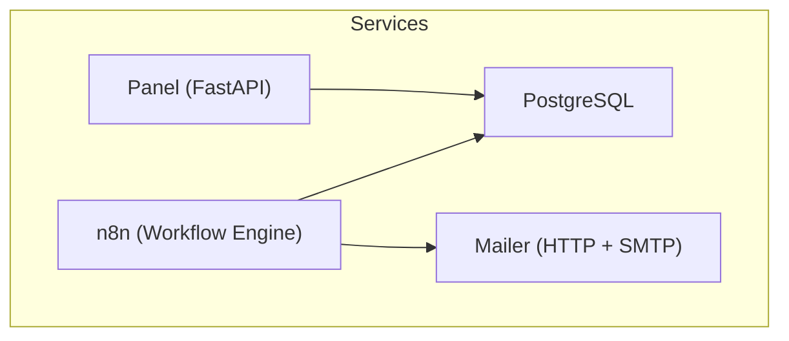
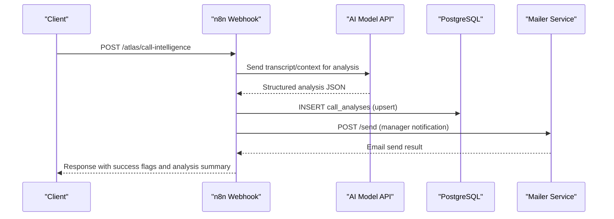
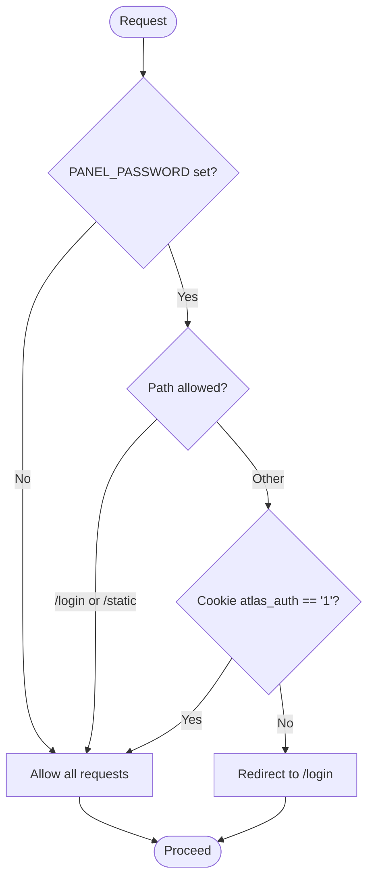
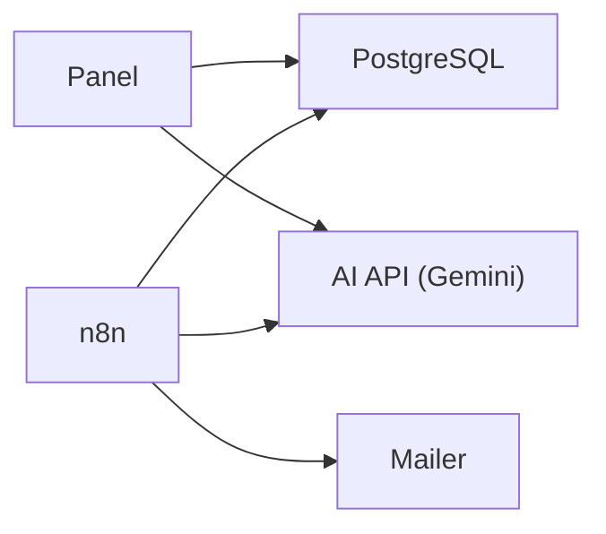

# Component Breakdown

<cite>
**Referenced Files in This Document**
- [docker-compose.yml](file://docker/docker-compose.yml)
- [main.py](file://docker/panel/app/main.py)
- [config.py](file://docker/panel/app/config.py)
- [db.py](file://docker/panel/app/db.py)
- [queries.py](file://docker/panel/app/queries.py)
- [ai.py](file://docker/panel/app/ai.py)
- [mailer.py](file://docker/mailer/mailer.py)
- [send_email.py](file://docker/mailer/send_email.py)
- [001_call_intelligence.sql](file://docker/postgres/init/001_call_intelligence.sql)
- [002_panel_seed.sql](file://docker/postgres/init/002_panel_seed.sql)
- [atlas-call-intelligence-v1.json](file://docker/n8n/workflows/atlas-call-intelligence-v1.json)
</cite>

## Table of Contents
1. Introduction
2. Project Structure
3. Core Components
4. Architecture Overview
5. Detailed Component Analysis
6. Dependency Analysis
7. Performance Considerations
8. Troubleshooting Guide
9. Conclusion

## Introduction
This document provides a detailed component breakdown of the Atlas platform, focusing on:
- FastAPI panel application (dashboard and analytics)
- PostgreSQL database (schema and seed data)
- n8n workflow engine (call intelligence orchestration)
- Mailer service (SMTP-based email notifications)

It explains responsibilities, key modules, configuration options, inter-component dependencies, authentication middleware, database connection management, route handlers, SMTP integration, template usage, workflow orchestration, lifecycle management, error handling strategies, logging approaches, and example interactions through APIs and shared data structures.

## Project Structure
The platform is containerized with Docker Compose and consists of four main services:
- Panel: FastAPI web app serving dashboards and API endpoints
- Postgres: Relational database storing call analyses and monthly reports
- n8n: Workflow engine orchestrating AI analysis, DB writes, and email notifications
- Mailer: Lightweight HTTP server that sends emails via SMTP

**Diagram sources**
- [docker-compose.yml:3-98](file://docker/docker-compose.yml#L3-L98)

**Section sources**
- [docker-compose.yml:3-98](file://docker/docker-compose.yml#L3-L98)

## Core Components
- FastAPI Panel: Serves HTML templates for dashboards, handles authentication via cookie-based middleware, reads from PostgreSQL, and optionally generates executive insights using an external AI API.
- PostgreSQL: Stores per-call AI analysis results and monthly aggregated reports; initialized by SQL scripts.
- n8n: Receives webhook payloads, calls an AI model to analyze transcripts/audio, persists results to Postgres, and triggers email notifications via the mailer service.
- Mailer: Exposes a simple HTTP endpoint to send emails via Yahoo SMTP; used by n8n workflows.

Key configuration is environment-driven across services, enabling deployment flexibility and secure credential management.

**Section sources**
- [config.py:1-14](file://docker/panel/app/config.py#L1-L14)
- [001_call_intelligence.sql:1-45](file://docker/postgres/init/001_call_intelligence.sql#L1-L45)
- [atlas-call-intelligence-v1.json:1-160](file://docker/n8n/workflows/atlas-call-intelligence-v1.json#L1-L160)
- [mailer.py:1-77](file://docker/mailer/mailer.py#L1-L77)

## Architecture Overview
The system integrates real-time call analysis with reporting and notifications:

**Diagram sources**
- [atlas-call-intelligence-v1.json:10-159](file://docker/n8n/workflows/atlas-call-intelligence-v1.json#L10-L159)
- [mailer.py:36-68](file://docker/mailer/mailer.py#L36-L68)
- [001_call_intelligence.sql:4-45](file://docker/postgres/init/001_call_intelligence.sql#L4-L45)

## Detailed Component Analysis

### FastAPI Panel Application
Responsibilities:
- Serve dashboard pages and detail views via Jinja2 templates
- Protect routes with simple password-based cookie authentication
- Query PostgreSQL for metrics, top performers, unhappy customers, staff performance, call durations, satisfaction, successful sales, monthly reports, and recent calls
- Provide an AI insights endpoint that aggregates context and calls an external AI API to generate executive summaries

Key modules:
- main.py: App setup, static files, templates, routes, auth middleware, and API endpoints
- config.py: Environment-based configuration for DB, AI, and panel settings
- db.py: Connection management and query helpers using psycopg2
- queries.py: Report-building functions mapping UI needs to SQL queries
- ai.py: Async client to generate executive insights via Google Gemini

Authentication middleware:
- Optional password protection via PANEL_PASSWORD
- Redirects unauthenticated users to login unless accessing static assets or login page
- Sets a session cookie on successful login

Database connection management:
- DSN built from environment variables
- Context manager ensures connections are closed after use
- RealDictCursor returns rows as dictionaries for easy templating

Route handlers:
- Dashboard and various report pages render templates with data from queries
- Detail pages fetch single records and return 404 when not found
- API endpoints expose stats and AI insights

Error handling:
- HTTPException raised for missing resources (e.g., call detail not found)
- Template rendering relies on safe defaults and optional fields

Logging:
- No explicit logging configured in the panel; rely on framework logs and container stdout

Example interactions:
- GET /api/stats returns overview statistics
- GET /api/ai-insights returns generated insights based on current data context

**Section sources**
- [main.py:16-187](file://docker/panel/app/main.py#L16-L187)
- [config.py:1-14](file://docker/panel/app/config.py#L1-L14)
- [db.py:1-31](file://docker/panel/app/db.py#L1-L31)
- [queries.py:6-260](file://docker/panel/app/queries.py#L6-L260)
- [ai.py:1-37](file://docker/panel/app/ai.py#L1-L37)

#### Authentication Flow

**Diagram sources**
- [main.py:40-65](file://docker/panel/app/main.py#L40-L65)

### PostgreSQL Database
Responsibilities:
- Store per-call AI analysis results and metadata
- Store monthly aggregated reports
- Provide indexes for efficient querying by time, agent, department, and date

Schema highlights:
- call_analyses: stores call_id, timestamps, department, agent info, customer info, duration, audio/transcript references, full analysis JSONB, scores, ticket priority, human review flag, workflow version
- monthly_reports: stores monthly aggregations per department with JSON payload and total counts

Seed data:
- Sample entries populate demo dashboards and enable immediate visualization

Lifecycle:
- Initialized on first run via docker-entrypoint-initdb.d scripts
- Health-checked by Docker Compose before dependent services start

**Section sources**
- [001_call_intelligence.sql:1-45](file://docker/postgres/init/001_call_intelligence.sql#L1-L45)
- [002_panel_seed.sql:1-46](file://docker/postgres/init/002_panel_seed.sql#L1-L46)
- [docker-compose.yml:3-25](file://docker/docker-compose.yml#L3-L25)

### n8n Workflow Engine
Responsibilities:
- Orchestrate end-to-end call analysis pipeline
- Parse incoming webhook payloads
- Build prompts and call AI model to produce structured analysis
- Persist results to PostgreSQL
- Trigger email notifications via the mailer service
- Return consistent responses to callers

Key workflow steps:
- Webhook receives POST at /atlas/call-intelligence
- Parse input to normalize fields and extract metadata
- Prepare prompt with context and schema constraints
- Call AI API using environment-configured URL and model
- Validate and enrich parsed JSON output
- Upsert into call_analyses table
- Optionally send manager notification email
- Build response including success flags and analysis summary

External integrations:
- AI model API via configurable URL and model name
- PostgreSQL credentials stored in n8n workspace
- Mailer service endpoint for notifications

Error handling:
- continueOnFail flags allow non-critical steps (like DB write or email) to fail without halting the entire workflow
- Response includes success indicators and error details for downstream consumers

Configuration:
- Environment variables control API URLs, keys, timezone, and email addresses
- Workflows are persisted under n8n/data and can be imported/exported

**Section sources**
- [atlas-call-intelligence-v1.json:1-160](file://docker/n8n/workflows/atlas-call-intelligence-v1.json#L1-L160)
- [docker-compose.yml:26-61](file://docker/docker-compose.yml#L26-L61)

### Mailer Service
Responsibilities:
- Expose a simple HTTP endpoint to send emails via SMTP
- Accept JSON payloads with recipient, subject, and body
- Use Yahoo SMTP with TLS and credentials from environment
- Provide a CLI script for ad-hoc testing

Key modules:
- mailer.py: HTTP server with BaseHTTPRequestHandler, send_email function, and environment-driven SMTP settings
- send_email.py: Standalone script to send test emails via SMTP

SMTP integration:
- Configurable host, port, user, and password
- Uses STARTTLS and login before sending
- Returns JSON status indicating success or failure

Template system:
- The mailer does not implement a template engine; it sends plain text bodies constructed by n8n workflows

Lifecycle:
- Runs as a long-lived HTTP server listening on a configurable port
- Logs messages to stdout for debugging

Error handling:
- Invalid JSON returns 400
- Missing SMTP_PASS returns failure response
- Exceptions during SMTP operations return 500 with error message

**Section sources**
- [mailer.py:1-77](file://docker/mailer/mailer.py#L1-L77)
- [send_email.py:1-39](file://docker/mailer/send_email.py#L1-L39)

## Dependency Analysis
Inter-component relationships:
- Panel depends on PostgreSQL for data and optionally on an external AI API for insights generation
- n8n depends on PostgreSQL for persistence and on an external AI API for analysis
- n8n depends on the mailer service for email notifications
- All services are orchestrated via Docker Compose with health checks and dependency ordering

**Diagram sources**
- [docker-compose.yml:3-98](file://docker/docker-compose.yml#L3-L98)
- [ai.py:1-37](file://docker/panel/app/ai.py#L1-L37)
- [atlas-call-intelligence-v1.json:47-119](file://docker/n8n/workflows/atlas-call-intelligence-v1.json#L47-L119)

**Section sources**
- [docker-compose.yml:3-98](file://docker/docker-compose.yml#L3-L98)

## Performance Considerations
- Database queries:
  - Queries leverage indexes on analyzed_at, agent_id, department, and call_date for efficient filtering and sorting
  - Aggregations compute averages and counts; consider pagination for large datasets if needed
- Connection management:
  - Short-lived connections per request reduce resource contention
  - Ensure connection pooling is considered if scaling beyond single-process deployments
- External API calls:
  - AI insights endpoint uses async HTTP client with timeout; ensure retries and circuit breakers if integrating in production
  - n8n HTTP requests to AI and mailer should include timeouts and retry policies
- Email delivery:
  - SMTP operations have timeouts; failures are captured and reported without blocking workflow completion
- Container orchestration:
  - Health checks ensure Postgres readiness before starting dependent services

[No sources needed since this section provides general guidance]

## Troubleshooting Guide
Common issues and resolutions:
- Panel shows login loop:
  - Verify PANEL_PASSWORD is set and cookies are accepted by the browser
  - Ensure static assets path is accessible
- Database connection errors:
  - Confirm DB_HOST, DB_PORT, DB_NAME, DB_USER, DB_PASSWORD match Postgres service configuration
  - Check Postgres health and credentials in docker-compose
- n8n workflow fails to save to DB:
  - Verify n8n Postgres credentials and connectivity
  - Inspect workflow execution logs for query errors
- Email not sent:
  - Ensure SMTP_PASS is configured in mailer environment
  - Check ATLAS_MANAGER_EMAIL and SMTP settings
  - Review mailer logs for exceptions
- AI insights not generated:
  - Set AI_API_KEY and AI_MODEL in panel environment
  - Verify network access to the AI provider

**Section sources**
- [main.py:40-65](file://docker/panel/app/main.py#L40-L65)
- [config.py:1-14](file://docker/panel/app/config.py#L1-L14)
- [mailer.py:18-33](file://docker/mailer/mailer.py#L18-L33)
- [atlas-call-intelligence-v1.json:73-119](file://docker/n8n/workflows/atlas-call-intelligence-v1.json#L73-L119)

## Conclusion
Atlas integrates a FastAPI panel, PostgreSQL, n8n workflows, and a mailer service to deliver call intelligence analytics and actionable insights. The panel provides secure access to dashboards and APIs, while n8n orchestrates AI-powered analysis, persistent storage, and notifications. Configuration is environment-driven, supporting flexible deployments. Error handling and logging are implemented at service boundaries to maintain resilience and observability.

[No sources needed since this section summarizes without analyzing specific files]