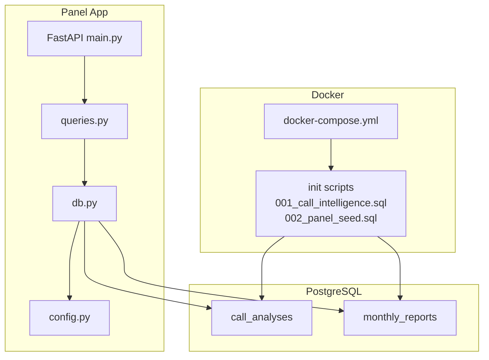
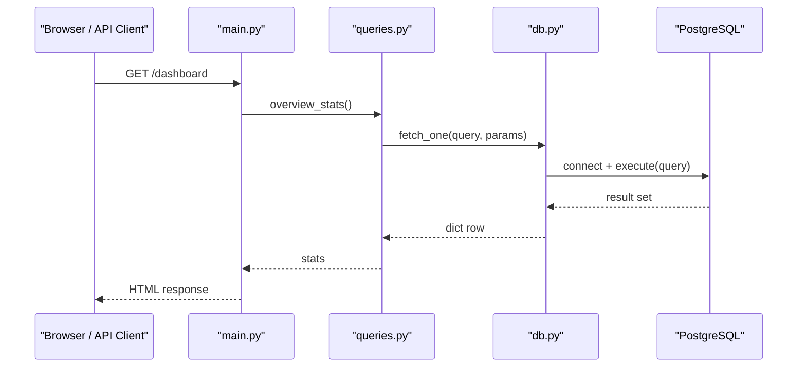
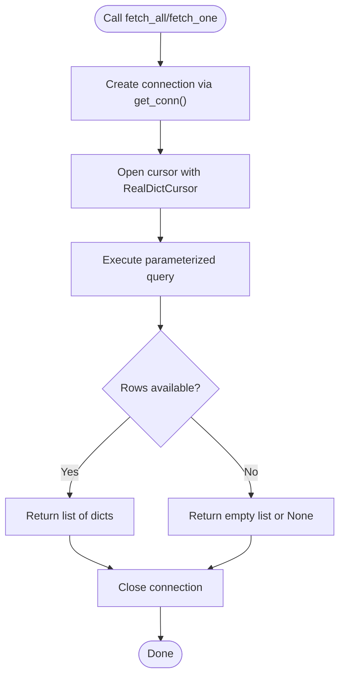
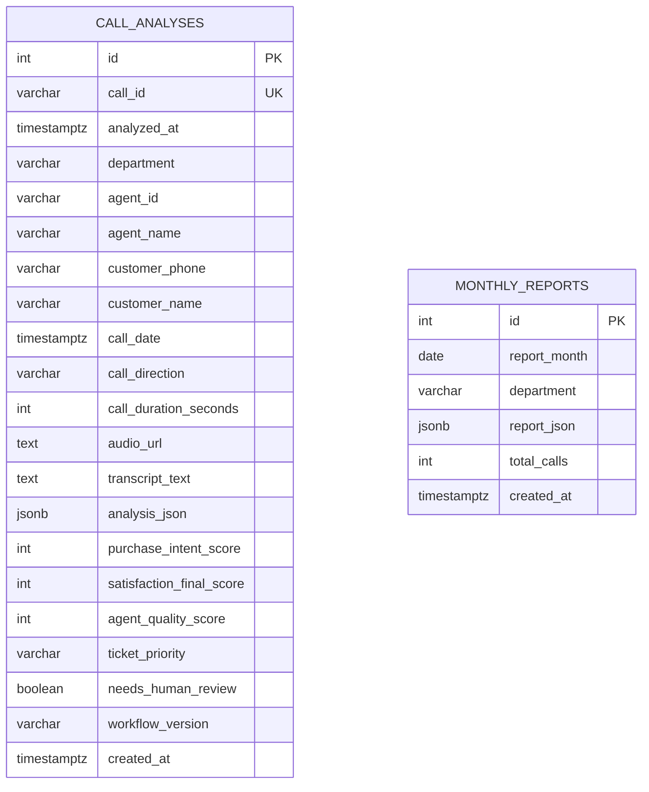
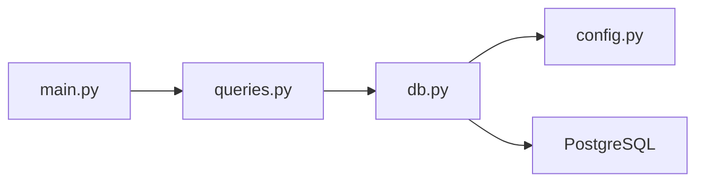

# Database Layer

<cite>
**Referenced Files in This Document**
- [db.py](file://docker/panel/app/db.py)
- [queries.py](file://docker/panel/app/queries.py)
- [config.py](file://docker/panel/app/config.py)
- [main.py](file://docker/panel/app/main.py)
- [001_call_intelligence.sql](file://docker/postgres/init/001_call_intelligence.sql)
- [002_panel_seed.sql](file://docker/postgres/init/002_panel_seed.sql)
- [docker-compose.yml](file://docker/docker-compose.yml)
</cite>

## Table of Contents
1. [Introduction](#introduction)
2. [Project Structure](#project-structure)
3. [Core Components](#core-components)
4. [Architecture Overview](#architecture-overview)
5. [Detailed Component Analysis](#detailed-component-analysis)
6. [Dependency Analysis](#dependency-analysis)
7. [Performance Considerations](#performance-considerations)
8. [Troubleshooting Guide](#troubleshooting-guide)
9. [Conclusion](#conclusion)
10. [Appendices](#appendices)

## Introduction
This document describes the database layer for the Atlas Manager Panel, focusing on PostgreSQL connection management, schema design, SQL initialization scripts, query patterns, and operational guidance. It explains how connections are created and closed safely using context managers, outlines the call_analyses and monthly_reports tables and their relationships, documents parameterized queries used across the application, and provides recommendations for performance optimization, migration strategy, backup procedures, monitoring, and safe schema extension.

## Project Structure
The database layer spans three areas:
- Application code that connects to PostgreSQL and executes queries
- SQL initialization scripts that define the schema and seed data
- Docker configuration that provisions the PostgreSQL service and mounts initialization scripts

**Diagram sources**
- [main.py:85-204](file://docker/panel/app/main.py#L85-L204)
- [queries.py:6-260](file://docker/panel/app/queries.py#L6-L260)
- [db.py:8-31](file://docker/panel/app/db.py#L8-L31)
- [config.py:1-14](file://docker/panel/app/config.py#L1-L14)
- [001_call_intelligence.sql:4-45](file://docker/postgres/init/001_call_intelligence.sql#L4-L45)
- [002_panel_seed.sql:4-46](file://docker/postgres/init/002_panel_seed.sql#L4-L46)
- [docker-compose.yml:1-98](file://docker/docker-compose.yml#L1-L98)

**Section sources**
- [main.py:85-204](file://docker/panel/app/main.py#L85-L204)
- [queries.py:6-260](file://docker/panel/app/queries.py#L6-L260)
- [db.py:8-31](file://docker/panel/app/db.py#L8-L31)
- [config.py:1-14](file://docker/panel/app/config.py#L1-L14)
- [001_call_intelligence.sql:4-45](file://docker/postgres/init/001_call_intelligence.sql#L4-L45)
- [002_panel_seed.sql:4-46](file://docker/postgres/init/002_panel_seed.sql#L4-L46)
- [docker-compose.yml:1-98](file://docker/docker-compose.yml#L1-L98)

## Core Components
- Connection management: A context manager creates a new psycopg2 connection per request scope and ensures it is closed afterward. Cursors use RealDictCursor to return rows as dictionaries.
- Query module: Centralizes all read-only analytics queries with parameterization to prevent injection and optimize execution plans.
- Configuration: Database credentials and host/port are loaded from environment variables.
- Initialization scripts: Define the schema (tables, indexes, constraints) and insert sample data for demonstration.

Key responsibilities:
- db.py: DSN construction, connection lifecycle via context manager, fetch helpers
- queries.py: Parameterized analytical queries for dashboards and reports
- config.py: Environment-driven DB settings
- SQL scripts: Schema definition and seed data

**Section sources**
- [db.py:8-31](file://docker/panel/app/db.py#L8-L31)
- [queries.py:6-260](file://docker/panel/app/queries.py#L6-L260)
- [config.py:1-14](file://docker/panel/app/config.py#L1-L14)
- [001_call_intelligence.sql:4-45](file://docker/postgres/init/001_call_intelligence.sql#L4-L45)
- [002_panel_seed.sql:4-46](file://docker/postgres/init/002_panel_seed.sql#L4-L46)

## Architecture Overview
The panel serves HTTP endpoints that render templates or JSON responses by calling query functions. Each query function uses the shared database helpers to execute parameterized SQL against PostgreSQL. The PostgreSQL container is initialized with schema and seed data at startup.

**Diagram sources**
- [main.py:85-97](file://docker/panel/app/main.py#L85-L97)
- [queries.py:6-23](file://docker/panel/app/queries.py#L6-L23)
- [db.py:21-31](file://docker/panel/app/db.py#L21-L31)
- [docker-compose.yml:3-25](file://docker/docker-compose.yml#L3-L25)

## Detailed Component Analysis

### PostgreSQL Connection Management
- Context manager: Creates a fresh connection per usage block and guarantees closure even if an exception occurs.
- Cursor factory: Uses RealDictCursor so results are returned as Python dicts keyed by column names.
- Fetch helpers:
  - fetch_all returns a list of dicts
  - fetch_one returns a single dict or None
- No explicit transaction boundaries are opened; each helper opens a connection, executes the statement, and closes the connection. For read-only reporting workloads this is acceptable, but consider adding explicit transactions for write paths.

**Diagram sources**
- [db.py:8-31](file://docker/panel/app/db.py#L8-L31)

**Section sources**
- [db.py:8-31](file://docker/panel/app/db.py#L8-L31)

### Database Schema Design
- call_analyses stores per-call AI analysis and metrics. Key fields include identifiers, timestamps, agent and customer metadata, duration, transcript, JSONB analysis payload, scores, ticket priority, review flags, and workflow version. A unique constraint on call_id prevents duplicates.
- monthly_reports stores aggregated monthly summaries per department with a composite unique constraint on report_month and department.
- Indexes:
  - analyzed_at, agent_id, department, call_date on call_analyses
  - report_month on monthly_reports

**Diagram sources**
- [001_call_intelligence.sql:4-45](file://docker/postgres/init/001_call_intelligence.sql#L4-L45)

Relationships:
- There is no foreign key linking monthly_reports to call_analyses. Monthly reports are derived aggregates stored independently. Maintain referential integrity through application logic when generating reports.

**Section sources**
- [001_call_intelligence.sql:4-45](file://docker/postgres/init/001_call_intelligence.sql#L4-L45)

### SQL Initialization Scripts
- 001_call_intelligence.sql: Creates call_analyses and monthly_reports tables, adds indexes, and defines constraints.
- 002_panel_seed.sql: Inserts sample call analyses for demo purposes, using ON CONFLICT to avoid duplicate inserts.

Initialization flow:
- docker-compose mounts init scripts into /docker-entrypoint-initdb.d
- PostgreSQL runs them in order during first boot to create schema and seed data

**Section sources**
- [001_call_intelligence.sql:1-45](file://docker/postgres/init/001_call_intelligence.sql#L1-L45)
- [002_panel_seed.sql:1-46](file://docker/postgres/init/002_panel_seed.sql#L1-L46)
- [docker-compose.yml:16-18](file://docker/docker-compose.yml#L16-L18)

### Query Patterns and Security
- All queries are parameterized using %s placeholders passed as tuples to prevent SQL injection.
- Common patterns:
  - Aggregations with FILTER for conditional counts
  - JSONB path extraction for nested analysis payloads
  - COALESCE to handle NULLs gracefully
  - LIMIT clauses to bound result sets
- Examples of query usage:
  - Overview statistics, top performers, ready-to-buy leads, unhappy customers, staff performance, call duration, satisfaction rates, successful sales, monthly reports listing and detail, recent calls, call detail, department breakdown, and AI context payload assembly.

Security notes:
- Use parameterized queries exclusively
- Avoid string concatenation for SQL
- Validate and sanitize any user-supplied parameters before passing to queries (e.g., limit values)

**Section sources**
- [queries.py:6-260](file://docker/panel/app/queries.py#L6-L260)

### Performance Optimization Techniques
- Indexing:
  - Analytical queries filter/sort on analyzed_at, agent_id, department, call_date, and report_month; indexes exist for these columns.
- Query design:
  - Use LIMIT to reduce result set size
  - Prefer targeted SELECT lists over SELECT * where possible
  - Leverage JSONB operators efficiently
- Connection overhead:
  - Current implementation opens a new connection per query. For high-throughput scenarios, consider a connection pool (e.g., psycopg2.pool or asyncpg) to reuse connections and reduce latency.
- Materialization:
  - For heavy aggregations, consider precomputing and storing results in monthly_reports or summary tables refreshed periodically.

[No sources needed since this section provides general guidance]

### Transaction Handling
- Current behavior:
  - Each fetch helper opens a connection, executes the statement, and closes the connection without explicit transaction control.
- Recommendations:
  - For read-only queries, current approach is fine.
  - For write operations, wrap statements in explicit transactions to ensure atomicity and consistency.
  - Consider adding a context manager that starts a transaction, yields a cursor, and commits or rolls back based on exceptions.

**Section sources**
- [db.py:12-31](file://docker/panel/app/db.py#L12-L31)

### Complex Analytical Queries
Examples of complex queries used in the application:
- Overview stats: Aggregates totals, averages, and filtered counts across call_analyses.
- Top performers: Groups by agent, computes average scores, hot leads, happy customers, and a success score metric.
- Ready to buy: Filters by intent thresholds and extracts nested JSONB fields for next steps and probabilities.
- Unhappy customers: Combines multiple conditions including low satisfaction, human review flags, and retention risk extracted from JSONB.
- Staff performance and satisfaction: Grouped metrics with percentage calculations and filters.
- Successful sales: Filters departments and intent/probability thresholds, extracting stage and probability from JSONB.
- Monthly reports: Lists and retrieves detailed monthly reports.

These queries demonstrate advanced filtering, grouping, JSONB accessors, and aggregation techniques suitable for reporting and analytics.

**Section sources**
- [queries.py:6-260](file://docker/panel/app/queries.py#L6-L260)

## Dependency Analysis
The panel’s web layer depends on the query module, which depends on the database helpers and configuration.

**Diagram sources**
- [main.py:85-204](file://docker/panel/app/main.py#L85-L204)
- [queries.py:1-260](file://docker/panel/app/queries.py#L1-L260)
- [db.py:1-31](file://docker/panel/app/db.py#L1-L31)
- [config.py:1-14](file://docker/panel/app/config.py#L1-L14)

**Section sources**
- [main.py:85-204](file://docker/panel/app/main.py#L85-L204)
- [queries.py:1-260](file://docker/panel/app/queries.py#L1-L260)
- [db.py:1-31](file://docker/panel/app/db.py#L1-L31)
- [config.py:1-14](file://docker/panel/app/config.py#L1-L14)

## Performance Considerations
- Connection pooling: Introduce a connection pool to reduce connection churn under load.
- Query tuning: Ensure appropriate indexes exist for frequently filtered columns; analyze query plans for slow queries.
- Result sizing: Apply LIMIT and pagination to large result sets.
- JSONB indexing: ConsiderGIN indexes on frequently queried JSONB keys if read patterns warrant it.
- Caching: Cache expensive aggregations (e.g., dashboard stats) for short periods to reduce DB pressure.

[No sources needed since this section provides general guidance]

## Troubleshooting Guide
Common issues and resolutions:
- Connection failures:
  - Verify environment variables for DB_HOST, DB_PORT, DB_NAME, DB_USER, DB_PASSWORD match the running PostgreSQL instance.
  - Check network connectivity between panel and postgres containers.
- Authentication errors:
  - Confirm POSTGRES_USER and POSTGRES_PASSWORD in docker-compose match configured credentials.
- Missing tables or seed data:
  - Ensure init scripts are mounted and executed on first run. Re-initialize the database volume if necessary.
- Slow queries:
  - Inspect indexes and query plans; add missing indexes or rewrite queries for efficiency.
- JSONB parsing errors:
  - Validate structure of analysis_json before querying nested fields; use safe casting and COALESCE.

Operational checks:
- Healthcheck: PostgreSQL exposes pg_isready health check in docker-compose.
- Logs: Review panel logs for exceptions raised by query execution.

**Section sources**
- [config.py:1-14](file://docker/panel/app/config.py#L1-L14)
- [docker-compose.yml:3-25](file://docker/docker-compose.yml#L3-L25)
- [001_call_intelligence.sql:4-45](file://docker/postgres/init/001_call_intelligence.sql#L4-L45)
- [002_panel_seed.sql:4-46](file://docker/postgres/init/002_panel_seed.sql#L4-L46)

## Conclusion
The database layer provides a straightforward, secure, and readable interface to PostgreSQL for analytics and reporting. It leverages context-managed connections, parameterized queries, and well-indexed schemas to support dashboard and monthly reporting features. To scale further, introduce connection pooling, explicit transaction handling for writes, and caching strategies. Maintain data integrity by following careful migration practices and validating JSONB structures.

[No sources needed since this section summarizes without analyzing specific files]

## Appendices

### Migration Strategy
- Versioned SQL scripts: Keep incremental migration files (e.g., 001_*, 002_*) and apply them in order.
- Idempotency: Use CREATE TABLE IF NOT EXISTS and UNIQUE constraints to allow re-running migrations safely.
- Rollback plan: Maintain rollback scripts for destructive changes and test them in staging.

**Section sources**
- [001_call_intelligence.sql:4-45](file://docker/postgres/init/001_call_intelligence.sql#L4-L45)
- [002_panel_seed.sql:4-46](file://docker/postgres/init/002_panel_seed.sql#L4-L46)

### Backup Procedures
- Volume-based backups: Back up the PostgreSQL data volume directory used by docker-compose.
- Logical backups: Use pg_dump to export logical backups of the atlas database for portability.
- Scheduled backups: Automate periodic backups and retain versions according to policy.

[No sources needed since this section provides general guidance]

### Monitoring Approaches
- Container health: Use the provided pg_isready healthcheck to monitor PostgreSQL availability.
- Query performance: Monitor slow queries and index usage via PostgreSQL logging and tools like EXPLAIN ANALYZE.
- Application metrics: Track error rates and response times in the panel to detect database-related bottlenecks.

**Section sources**
- [docker-compose.yml:20-25](file://docker/docker-compose.yml#L20-L25)

### Extending the Schema Safely
- Add new columns or tables with migrations; ensure defaults and constraints preserve existing data.
- Update queries gradually; test with representative datasets.
- Preserve backward compatibility by avoiding breaking changes to existing columns used by other services.
- Validate JSONB schema evolution if extending analysis_json structure.

[No sources needed since this section provides general guidance]