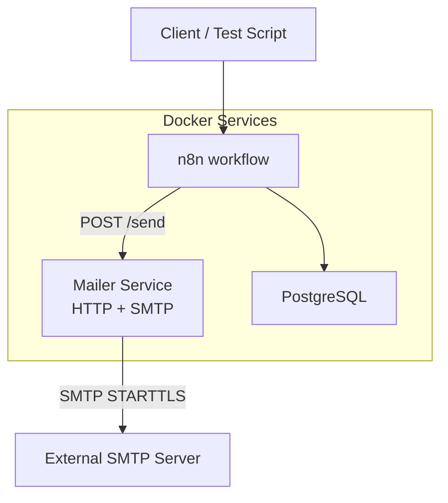
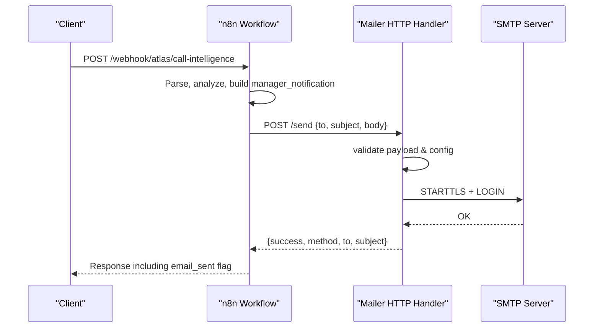
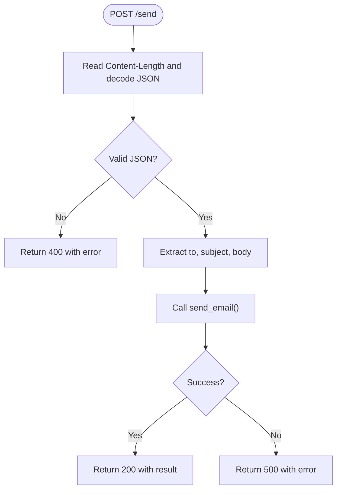
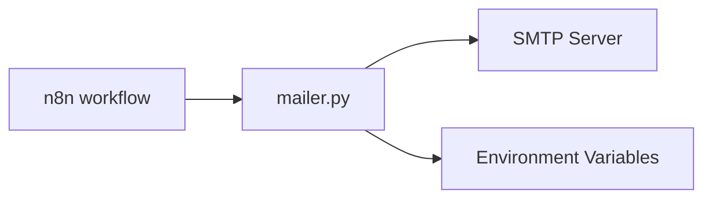

# Mailer Service

<cite>
**Referenced Files in This Document**
- [mailer.py](file://docker/mailer/mailer.py)
- [send_email.py](file://docker/mailer/send_email.py)
- [docker-compose.yml](file://docker/docker-compose.yml)
- [atlas-call-intelligence-v1.json](file://docker/n8n/workflows/atlas-call-intelligence-v1.json)
- [run-test.ps1](file://docker/scripts/run-test.ps1)
- [test-result.json](file://docker/scripts/test-result.json)
</cite>

## Table of Contents
1. [Introduction](#introduction)
2. [Project Structure](#project-structure)
3. [Core Components](#core-components)
4. [Architecture Overview](#architecture-overview)
5. [Detailed Component Analysis](#detailed-component-analysis)
6. [Dependency Analysis](#dependency-analysis)
7. [Performance Considerations](#performance-considerations)
8. [Troubleshooting Guide](#troubleshooting-guide)
9. [Conclusion](#conclusion)
10. [Appendices](#appendices)

## Introduction
This document describes the Mailer Service component that sends SMTP emails on behalf of the Atlas Call Intelligence system. It covers SMTP configuration and authentication, the HTTP endpoint for receiving email requests, content formatting, error handling, security considerations, integration with n8n workflows, testing procedures, and operational guidance for configuring different SMTP providers and monitoring delivery performance.

## Project Structure
The mailer service is implemented as a lightweight Python HTTP server that exposes an endpoint to receive JSON payloads and send emails via SMTP. A companion script provides a command-line interface for sending test emails. The service is containerized and orchestrated alongside other services (Postgres, n8n, panel) using Docker Compose.

**Diagram sources**
- [docker-compose.yml:62-79](file://docker/docker-compose.yml#L62-L79)
- [atlas-call-intelligence-v1.json:105-120](file://docker/n8n/workflows/atlas-call-intelligence-v1.json#L105-L120)
- [mailer.py:36-76](file://docker/mailer/mailer.py#L36-L76)

**Section sources**
- [docker-compose.yml:62-79](file://docker/docker-compose.yml#L62-L79)
- [mailer.py:1-76](file://docker/mailer/mailer.py#L1-L76)
- [send_email.py:1-39](file://docker/mailer/send_email.py#L1-L39)

## Core Components
- HTTP handler: Accepts POST requests at specific paths, parses JSON, extracts fields, and delegates to the email sender.
- Email sender: Builds MIME messages and sends them via SMTP with STARTTLS and login.
- CLI helper: Sends a single email using environment variables and command-line arguments.
- Orchestration: n8n workflow calls the mailer’s HTTP endpoint after processing call data.

Key responsibilities:
- Validate incoming request payload and map fields to email parameters.
- Configure SMTP connection from environment variables.
- Send plain-text emails with UTF-8 encoding.
- Return structured JSON responses indicating success or failure.

**Section sources**
- [mailer.py:18-33](file://docker/mailer/mailer.py#L18-L33)
- [mailer.py:36-71](file://docker/mailer/mailer.py#L36-L71)
- [send_email.py:9-34](file://docker/mailer/send_email.py#L9-L34)
- [atlas-call-intelligence-v1.json:105-120](file://docker/n8n/workflows/atlas-call-intelligence-v1.json#L105-L120)

## Architecture Overview
The mailer service integrates into the Atlas pipeline through n8n. After analysis and enrichment, n8n constructs a manager notification and posts it to the mailer’s HTTP endpoint. The mailer connects to the configured SMTP server, authenticates, and sends the email. Responses are captured by n8n and included in the webhook response.

**Diagram sources**
- [atlas-call-intelligence-v1.json:105-120](file://docker/n8n/workflows/atlas-call-intelligence-v1.json#L105-L120)
- [mailer.py:36-71](file://docker/mailer/mailer.py#L36-L71)
- [mailer.py:18-33](file://docker/mailer/mailer.py#L18-L33)

## Detailed Component Analysis

### HTTP Endpoint and Request Handling
- Endpoints:
  - POST /send
  - POST / (treated equivalently to /send)
- Behavior:
  - Reads Content-Length and decodes the body as UTF-8 JSON.
  - Extracts recipient, subject, and body; applies defaults if missing.
  - Calls the email sender and returns a JSON result with status code 200 on success or 500 on failure.
  - Returns 404 for unsupported paths and 400 for invalid JSON.

Request payload fields:
- to: optional; falls back to default recipient from environment.
- subject: optional; falls back to a default subject.
- body or message: optional; defaults to empty string.

Response fields:
- success: boolean indicating whether the email was sent successfully.
- method: indicates the transport used ("smtp").
- to: recipient address.
- subject: email subject.
- error: present when success is false, containing error details.

**Diagram sources**
- [mailer.py:36-71](file://docker/mailer/mailer.py#L36-L71)
- [mailer.py:18-33](file://docker/mailer/mailer.py#L18-L33)

**Section sources**
- [mailer.py:36-71](file://docker/mailer/mailer.py#L36-L71)

### SMTP Connection and Authentication
- Configuration via environment variables:
  - SMTP_HOST: SMTP server hostname (default Yahoo).
  - SMTP_PORT: SMTP port (default 587).
  - SMTP_USER: Sender username.
  - SMTP_PASS: Sender password or app-specific token.
  - ATLAS_MANAGER_EMAIL: Default recipient if not provided in request.
  - MAILER_PORT: Port the HTTP server listens on (default 8765).
- Connection flow:
  - Establishes SMTP connection with timeout.
  - Upgrades to TLS using STARTTLS.
  - Authenticates with username and password.
  - Sends the constructed message.

Security notes:
- Credentials are read from environment variables only; no secrets are embedded in source code beyond defaults.
- Ensure SMTP_PASS is set in production environments.
- Use provider-specific tokens where required (e.g., app passwords for Yahoo).

**Section sources**
- [mailer.py:10-15](file://docker/mailer/mailer.py#L10-L15)
- [mailer.py:18-33](file://docker/mailer/mailer.py#L18-L33)
- [docker-compose.yml:70-76](file://docker/docker-compose.yml#L70-L76)

### Email Template Handling and Content Formatting
- Current implementation:
  - Plain text emails with UTF-8 encoding.
  - Message built using multipart container with a single text part.
- Extensibility:
  - To support HTML templates, replace the text part with an HTML MIMEText part.
  - To support attachments, add additional parts to the MIMEMultipart message.
- Template strategy recommendations:
  - Store templates externally (files or secret store) and load them at runtime.
  - Render templates with context data (recipient name, call ID, summary, etc.).
  - Provide both HTML and plain-text alternatives for better compatibility.

Note: The current code does not include template rendering or attachment logic; these can be added following the patterns shown below.

**Section sources**
- [mailer.py:22-31](file://docker/mailer/mailer.py#L22-L31)

### Asynchronous Processing and Integration
- Integration point:
  - n8n workflow posts to http://host.docker.internal:8765/send with manager_notification fields.
  - The workflow continues even if email sending fails (continueOnFail enabled), capturing results in the final response.
- Testing and fallback:
  - A PowerShell test script invokes the n8n webhook and, if needed, retries sending via the local mailer.

Operational note:
- The mailer processes each request synchronously within the HTTP thread. For high-throughput scenarios, consider adding a queue (e.g., Redis) and background workers.

**Section sources**
- [atlas-call-intelligence-v1.json:105-120](file://docker/n8n/workflows/atlas-call-intelligence-v1.json#L105-L120)
- [run-test.ps1:26-35](file://docker/scripts/run-test.ps1#L26-L35)

### Error Handling, Retry Mechanisms, and Logging
- Error handling:
  - Invalid JSON returns 400 with an error message.
  - Missing SMTP credentials return 500 with a descriptive error.
  - Exceptions during SMTP operations are caught and returned as 500 with error details.
- Retry mechanisms:
  - No built-in retry; callers (like n8n) should implement retries with exponential backoff for transient failures.
  - The workflow sets continueOnFail to ensure downstream steps still execute.
- Logging:
  - Basic logging prints HTTP request logs to stdout.
  - For production, integrate structured logging (e.g., JSON logs) and metrics collection.

**Section sources**
- [mailer.py:43-68](file://docker/mailer/mailer.py#L43-L68)
- [atlas-call-intelligence-v1.json:105-120](file://docker/n8n/workflows/atlas-call-intelligence-v1.json#L105-L120)

### Security Considerations
- Credential management:
  - All SMTP credentials must be provided via environment variables.
  - Do not hardcode secrets in source files; use secure secret stores in production.
- Input validation:
  - Validate and sanitize recipient addresses and subjects.
  - Enforce maximum sizes for body content to prevent abuse.
- Transport security:
  - Uses STARTTLS to encrypt SMTP traffic.
  - Ensure SMTP servers enforce modern TLS versions.

**Section sources**
- [mailer.py:10-15](file://docker/mailer/mailer.py#L10-L15)
- [mailer.py:18-33](file://docker/mailer/mailer.py#L18-L33)

## Dependency Analysis
The mailer depends on:
- Python standard library modules: json, os, smtplib, email.mime.*
- Environment variables for configuration
- External SMTP server for delivery
- n8n workflow for orchestration and triggering

**Diagram sources**
- [mailer.py:1-8](file://docker/mailer/mailer.py#L1-L8)
- [atlas-call-intelligence-v1.json:105-120](file://docker/n8n/workflows/atlas-call-intelligence-v1.json#L105-L120)

**Section sources**
- [mailer.py:1-8](file://docker/mailer/mailer.py#L1-L8)
- [docker-compose.yml:62-79](file://docker/docker-compose.yml#L62-L79)

## Performance Considerations
- Concurrency:
  - The HTTP server uses a single-threaded model; under load, consider running multiple instances behind a reverse proxy or switching to an async framework.
- Timeouts:
  - SMTP connection timeout is set; tune based on network conditions.
- Payload size:
  - Keep email bodies concise; large payloads increase latency and risk timeouts.
- Caching:
  - Reuse SMTP connections per process if possible; currently each request creates a new connection.
- Observability:
  - Add metrics for request rate, latency, and error rates; log structured events for auditability.

[No sources needed since this section provides general guidance]

## Troubleshooting Guide
Common issues and resolutions:
- SMTP_PASS not configured:
  - Symptom: 500 response with error indicating missing password.
  - Resolution: Set SMTP_PASS in environment variables for the mailer container.
- Invalid JSON payload:
  - Symptom: 400 response with invalid JSON error.
  - Resolution: Ensure the request body is valid JSON with correct fields.
- Network or SMTP errors:
  - Symptom: 500 response with exception details.
  - Resolution: Verify SMTP_HOST, SMTP_PORT, and credentials; check firewall and TLS settings.
- Delivery failures:
  - Symptom: email_sent is false in workflow response.
  - Resolution: Inspect email_error field; retry with backoff; verify recipient addresses and spam filters.

Testing procedures:
- Use the PowerShell test script to invoke the n8n webhook and optionally retry via the local mailer.
- Check test-result.json for outcomes and error details.

**Section sources**
- [test-result.json:1-8](file://docker/scripts/test-result.json#L1-L8)
- [run-test.ps1:26-35](file://docker/scripts/run-test.ps1#L26-L35)

## Conclusion
The Mailer Service provides a simple, configurable HTTP API for sending SMTP emails integrated into the Atlas Call Intelligence workflow via n8n. It supports environment-based configuration, basic input validation, and structured error responses. For production readiness, enhance template rendering, attachment support, concurrency, observability, and robust retry strategies.

[No sources needed since this section summarizes without analyzing specific files]

## Appendices

### SMTP Provider Configuration Examples
- Yahoo (default):
  - SMTP_HOST: smtp.mail.yahoo.com
  - SMTP_PORT: 587
  - SMTP_USER: your-yahoo-address
  - SMTP_PASS: app-specific password
- Gmail:
  - SMTP_HOST: smtp.gmail.com
  - SMTP_PORT: 587
  - SMTP_USER: your-gmail-address
  - SMTP_PASS: app-specific password
- Outlook/Office 365:
  - SMTP_HOST: smtp.office365.com
  - SMTP_PORT: 587
  - SMTP_USER: your-outlook-address
  - SMTP_PASS: app-specific password or OAuth token (requires adapter)

Configure these via environment variables in docker-compose.yml or your deployment platform.

**Section sources**
- [docker-compose.yml:70-76](file://docker/docker-compose.yml#L70-L76)

### Example Requests and Responses
- Request example (JSON):
  - Fields: to, subject, body
- Success response:
  - Fields: success, method, to, subject
- Failure response:
  - Fields: success, error

Use these patterns when integrating with clients or scripts.

**Section sources**
- [mailer.py:43-68](file://docker/mailer/mailer.py#L43-L68)

### Monitoring Email Queue Performance
- Metrics to track:
  - Request volume and latency
  - SMTP connection success/failure rates
  - Email delivery success rate
- Tools:
  - Container logs for request traces
  - Centralized logging for structured events
  - Application-level counters for key operations

[No sources needed since this section provides general guidance]