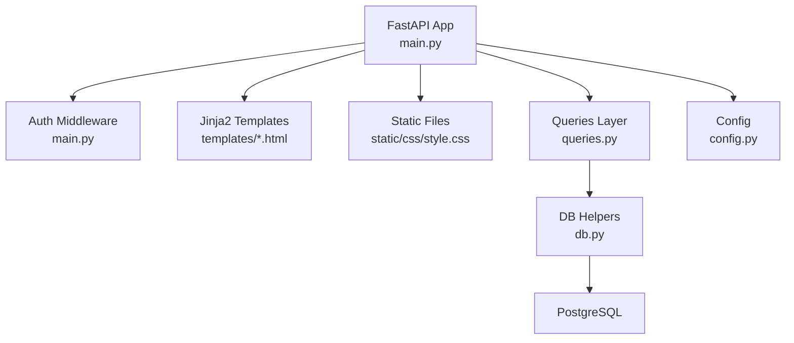
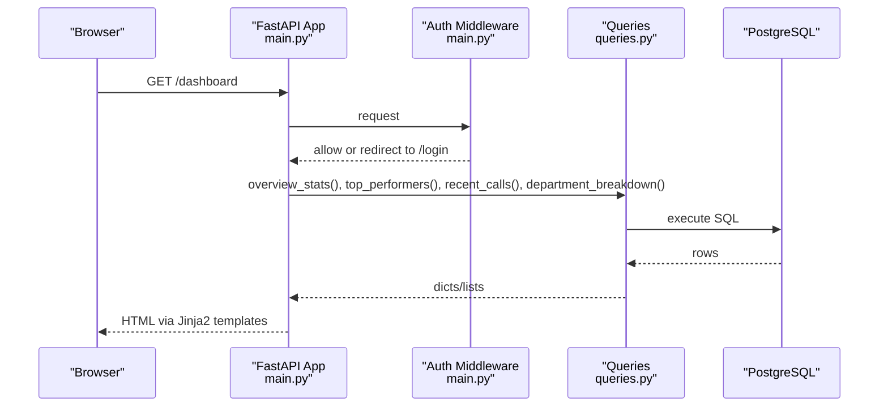
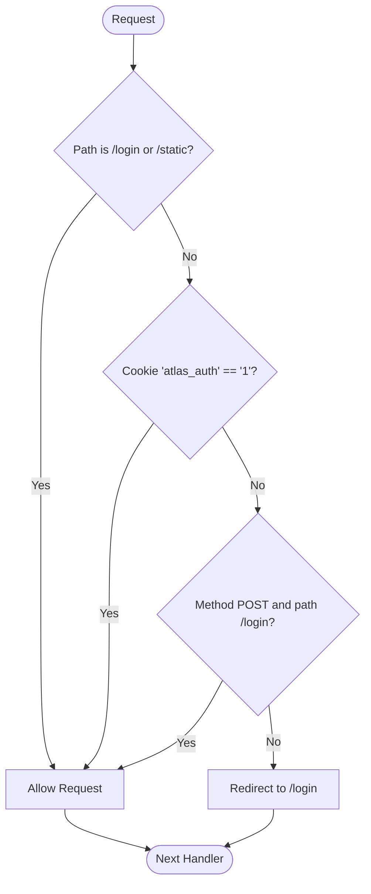
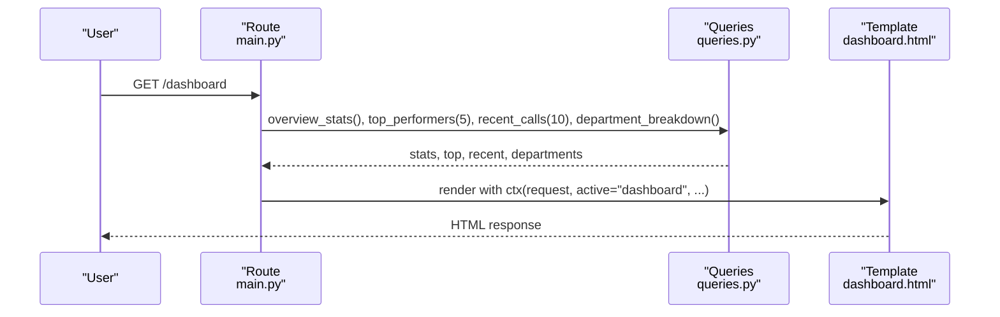
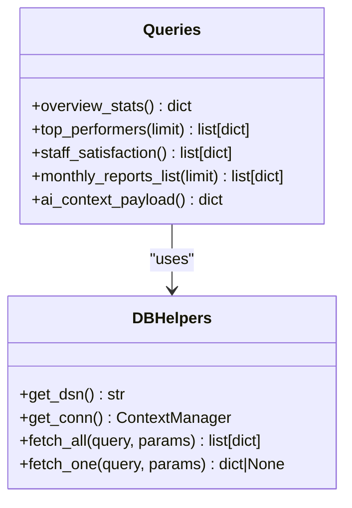
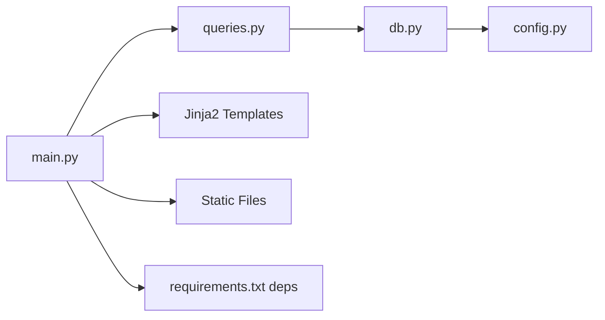

# Panel Service

<cite>
**Referenced Files in This Document**
- [main.py](file://docker/panel/app/main.py)
- [config.py](file://docker/panel/app/config.py)
- [db.py](file://docker/panel/app/db.py)
- [queries.py](file://docker/panel/app/queries.py)
- [base.html](file://docker/panel/templates/base.html)
- [dashboard.html](file://docker/panel/templates/dashboard.html)
- [top_performers.html](file://docker/panel/templates/top_performers.html)
- [call_duration.html](file://docker/panel/templates/call_duration.html)
- [satisfaction.html](file://docker/panel/templates/satisfaction.html)
- [monthly_reports.html](file://docker/panel/templates/monthly_reports.html)
- [login.html](file://docker/panel/templates/login.html)
- [style.css](file://docker/panel/static/css/style.css)
- [requirements.txt](file://docker/panel/requirements.txt)
</cite>

## Table of Contents
1. Introduction
2. Project Structure
3. Core Components
4. Architecture Overview
5. Detailed Component Analysis
6. Dependency Analysis
7. Performance Considerations
8. Troubleshooting Guide
9. Conclusion

## Introduction
This document describes the Panel Service component of the Atlas platform. It is a FastAPI-based management dashboard that provides an overview of call analytics, staff performance, satisfaction metrics, and monthly reports. The service uses session-based authentication via cookies, renders pages with Jinja2 templates, serves static assets, and queries a PostgreSQL database through a dedicated data access layer.

## Project Structure
The Panel Service is organized into clear layers:
- Application entry point and routes: main.py
- Configuration: config.py
- Database connection and helpers: db.py
- Data access (queries): queries.py
- Templates for UI rendering: templates/*.html
- Static assets: static/css/style.css
- Dependencies: requirements.txt

**Diagram sources**
- [main.py:18-21](file://docker/panel/app/main.py#L18-L21)
- [main.py:73-82](file://docker/panel/app/main.py#L73-L82)
- [queries.py:1-10](file://docker/panel/app/queries.py#L1-L10)
- [db.py:1-31](file://docker/panel/app/db.py#L1-L31)
- [config.py:1-14](file://docker/panel/app/config.py#L1-L14)

**Section sources**
- [main.py:1-204](file://docker/panel/app/main.py#L1-L204)
- [config.py:1-14](file://docker/panel/app/config.py#L1-L14)
- [db.py:1-31](file://docker/panel/app/db.py#L1-L31)
- [queries.py:1-260](file://docker/panel/app/queries.py#L1-L260)
- [base.html:1-46](file://docker/panel/templates/base.html#L1-L46)
- [style.css:1-117](file://docker/panel/static/css/style.css#L1-L117)
- [requirements.txt:1-7](file://docker/panel/requirements.txt#L1-L7)

## Core Components
- FastAPI application and routing: defines endpoints for login, dashboard, top performers, call duration, satisfaction, monthly reports, AI insights, and call details.
- Authentication middleware: enforces simple password-based access using a cookie when PANEL_PASSWORD is set.
- Template engine: Jinja2 with custom globals and JSON encoder for safe serialization of Decimal and datetime values.
- Static file serving: mounted at /static for CSS and other assets.
- Database layer: psycopg2 connections with context manager and helper functions to fetch rows as dictionaries.
- Queries module: encapsulates all SQL logic for dashboard widgets and reports.

Key responsibilities by file:
- main.py: app setup, routes, auth middleware, template rendering, static mount, JSON encoder, utility functions.
- config.py: environment-driven configuration for DB, AI, and panel settings.
- db.py: connection string builder, connection context manager, fetch_all/fetch_one helpers.
- queries.py: report queries for overview stats, top performers, ready-to-buy, unhappy customers, staff performance, call duration, satisfaction, successful sales, monthly reports, recent calls, call detail, department breakdown, and AI context payload.

**Section sources**
- [main.py:18-50](file://docker/panel/app/main.py#L18-L50)
- [main.py:57-82](file://docker/panel/app/main.py#L57-L82)
- [db.py:8-31](file://docker/panel/app/db.py#L8-L31)
- [queries.py:6-260](file://docker/panel/app/queries.py#L6-L260)
- [config.py:1-14](file://docker/panel/app/config.py#L1-L14)

## Architecture Overview
The Panel Service follows a layered architecture:
- Presentation: Jinja2 templates render HTML views with data from queries.
- Application: FastAPI routes handle HTTP requests, enforce authentication, and orchestrate data retrieval.
- Data Access: queries.py contains SQL statements; db.py manages connections and returns typed results.
- Storage: PostgreSQL database holds call analyses and monthly reports.

**Diagram sources**
- [main.py:73-82](file://docker/panel/app/main.py#L73-L82)
- [main.py:85-97](file://docker/panel/app/main.py#L85-L97)
- [queries.py:6-23](file://docker/panel/app/queries.py#L6-L23)
- [db.py:21-31](file://docker/panel/app/db.py#L21-L31)

## Detailed Component Analysis

### Authentication and Session Management
- Simple password protection: When PANEL_PASSWORD is configured, all non-login and non-static routes require a cookie named atlas_auth set to "1".
- Login flow:
  - GET /login renders the login page unless PANEL_PASSWORD is empty, in which case it redirects to /.
  - POST /login validates the submitted password against PANEL_PASSWORD and sets a secure httponly cookie with a 7-day max age on success; otherwise redirects back to /login with an error flag.
- Middleware behavior:
  - Skips enforcement for /login and /static paths.
  - Allows POST to /login even without the cookie to process the form submission.
  - Redirects unauthenticated requests to /login.

**Diagram sources**
- [main.py:57-82](file://docker/panel/app/main.py#L57-L82)

**Section sources**
- [main.py:57-82](file://docker/panel/app/main.py#L57-L82)
- [login.html:1-18](file://docker/panel/templates/login.html#L1-L18)

### Dashboard Pages and Route Handlers
- Overview dashboard (/): aggregates statistics, top performers, recent calls, and department breakdown. Renders dashboard.html.
- Top performers (/top-performers): lists agents ranked by a composite success score.
- Call duration (/call-duration): shows total, average, and maximum call durations per agent with a bar chart.
- Satisfaction (/satisfaction): displays satisfaction rates and counts per agent with a line chart.
- Monthly reports (/monthly-reports and /monthly-reports/{report_id}): lists recent monthly reports and shows details for a specific report.
- Additional pages: ready-to-buy, unhappy-customers, staff-performance, successful-sales, ai-insights, and call detail.

Each route:
- Validates authentication via middleware.
- Calls appropriate query functions.
- Passes context to Jinja2 templates via a shared ctx helper.

**Diagram sources**
- [main.py:85-97](file://docker/panel/app/main.py#L85-L97)
- [queries.py:6-23](file://docker/panel/app/queries.py#L6-L23)
- [dashboard.html:1-81](file://docker/panel/templates/dashboard.html#L1-L81)

**Section sources**
- [main.py:85-187](file://docker/panel/app/main.py#L85-L187)
- [dashboard.html:1-81](file://docker/panel/templates/dashboard.html#L1-L81)
- [top_performers.html:1-32](file://docker/panel/templates/top_performers.html#L1-L32)
- [call_duration.html:1-43](file://docker/panel/templates/call_duration.html#L1-L43)
- [satisfaction.html:1-44](file://docker/panel/templates/satisfaction.html#L1-L44)
- [monthly_reports.html:1-23](file://docker/panel/templates/monthly_reports.html#L1-L23)

### Database Layer and Query Patterns
- Connection management: get_conn() uses a context manager to ensure connections are closed after use.
- Fetch helpers:
  - fetch_all(query, params) executes a query and returns a list of dictionaries using RealDictCursor.
  - fetch_one(query, params) returns the first row or None.
- Query examples:
  - Overview stats aggregate totals, averages, and counts across call_analyses.
  - Top performers compute a success score combining quality and satisfaction.
  - Ready-to-buy and unhappy customers filter based on scores and flags.
  - Staff performance and satisfaction provide per-agent metrics.
  - Monthly reports list and detail endpoints read from monthly_reports.

**Diagram sources**
- [db.py:8-31](file://docker/panel/app/db.py#L8-L31)
- [queries.py:6-260](file://docker/panel/app/queries.py#L6-L260)

**Section sources**
- [db.py:1-31](file://docker/panel/app/db.py#L1-L31)
- [queries.py:1-260](file://docker/panel/app/queries.py#L1-L260)

### Template Rendering and Static Assets
- Jinja2 setup: templates directory configured, cache disabled for compatibility, custom JSON encoder registered to serialize Decimal and datetime safely.
- Global template variables: panel_title, fmt_duration, now_fn exposed to all templates.
- Base layout: base.html defines sidebar navigation, header, content block, and includes Chart.js for visualizations.
- Static files: CSS served under /static/css/style.css.

**Section sources**
- [main.py:15-50](file://docker/panel/app/main.py#L15-L50)
- [base.html:1-46](file://docker/panel/templates/base.html#L1-L46)
- [style.css:1-117](file://docker/panel/static/css/style.css#L1-L117)

### Configuration and Environment Variables
Configuration is driven entirely by environment variables:
- Database: DB_HOST, DB_PORT, DB_NAME, DB_USER, DB_PASSWORD
- AI integration: AI_API_KEY, AI_MODEL
- Panel: PANEL_TITLE, PANEL_PASSWORD

These values are consumed by config.py and used throughout the application (e.g., DB connection string, auth gating, and UI title).

**Section sources**
- [config.py:1-14](file://docker/panel/app/config.py#L1-L14)

## Dependency Analysis
Internal dependencies:
- main.py depends on:
  - queries.py for data retrieval
  - db.py indirectly via queries.py
  - config.py for runtime settings
  - Jinja2Templates and StaticFiles for rendering and assets
- queries.py depends on db.py for database access
- db.py depends on config.py for connection parameters

External dependencies:
- FastAPI and Uvicorn for ASGI server and routing
- Jinja2 for templating
- psycopg2-binary for PostgreSQL connectivity
- python-multipart for form parsing
- httpx for external API calls (used elsewhere in the app)

**Diagram sources**
- [main.py:1-21](file://docker/panel/app/main.py#L1-L21)
- [queries.py:1-4](file://docker/panel/app/queries.py#L1-L4)
- [db.py:1-6](file://docker/panel/app/db.py#L1-L6)
- [requirements.txt:1-7](file://docker/panel/requirements.txt#L1-L7)

**Section sources**
- [main.py:1-21](file://docker/panel/app/main.py#L1-L21)
- [queries.py:1-4](file://docker/panel/app/queries.py#L1-L4)
- [db.py:1-6](file://docker/panel/app/db.py#L1-L6)
- [requirements.txt:1-7](file://docker/panel/requirements.txt#L1-L7)

## Performance Considerations
- Minimal queries per page: Routes call only necessary functions to reduce overhead.
- Aggregations in SQL: Heavy computations (averages, counts, filters) are performed in the database to minimize data transfer.
- Connection lifecycle: Each request opens a new connection via a context manager; consider pooling for high concurrency.
- Template caching: Disabled for development compatibility; enable production caching if needed.
- Static assets: CSS is served directly; consider compression and CDN for large deployments.
- JSON serialization: Custom encoder avoids repeated conversions in templates.

[No sources needed since this section provides general guidance]

## Troubleshooting Guide
Common issues and resolutions:
- Unauthenticated access: If PANEL_PASSWORD is set, ensure the login cookie is present. Verify the middleware allows POST to /login and static assets.
- Database connectivity errors: Confirm DB_HOST, DB_PORT, DB_NAME, DB_USER, DB_PASSWORD are correctly set. Validate network reachability to PostgreSQL.
- Empty dashboards: Ensure call_analyses and monthly_reports tables contain data. Check query filters and thresholds.
- Template rendering errors: Verify Jinja2 globals (panel_title, fmt_duration, now_fn) are available and that templates exist in the configured directory.
- Static asset 404: Ensure /static is mounted and files exist under static/.

Error handling patterns:
- 404 responses for missing resources (e.g., monthly report detail not found).
- Redirects for login failures and when PANEL_PASSWORD is not configured.

**Section sources**
- [main.py:57-82](file://docker/panel/app/main.py#L57-L82)
- [main.py:164-172](file://docker/panel/app/main.py#L164-L172)
- [db.py:8-31](file://docker/panel/app/db.py#L8-L31)

## Conclusion
The Panel Service provides a secure, configurable, and extensible management dashboard for Atlas call intelligence. Its layered design separates concerns between presentation, routing, data access, and storage. With environment-driven configuration, robust authentication middleware, and well-structured queries, it supports key operational views such as overview statistics, top performers, call duration analysis, satisfaction metrics, and monthly reports. For production, consider adding connection pooling, template caching, and enhanced security hardening.