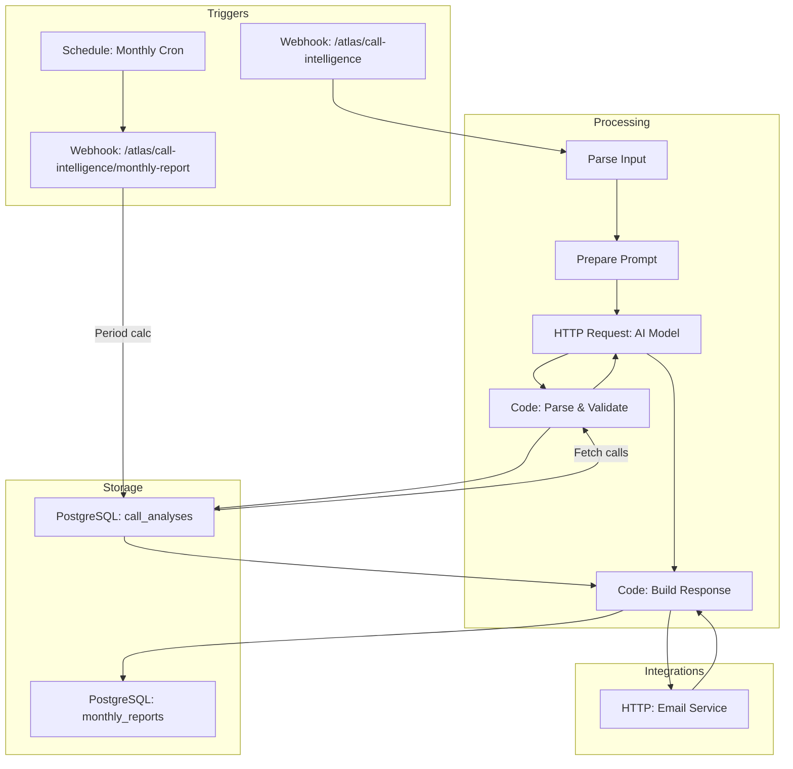
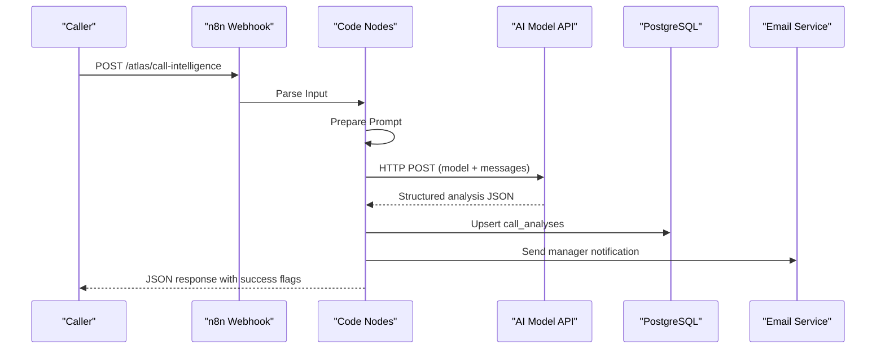
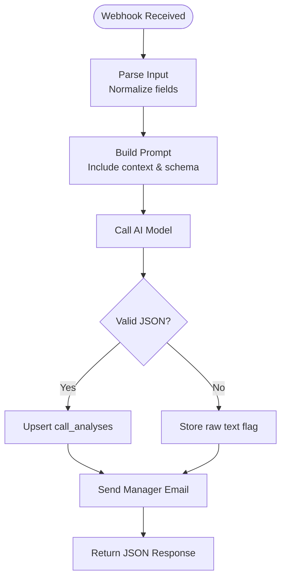
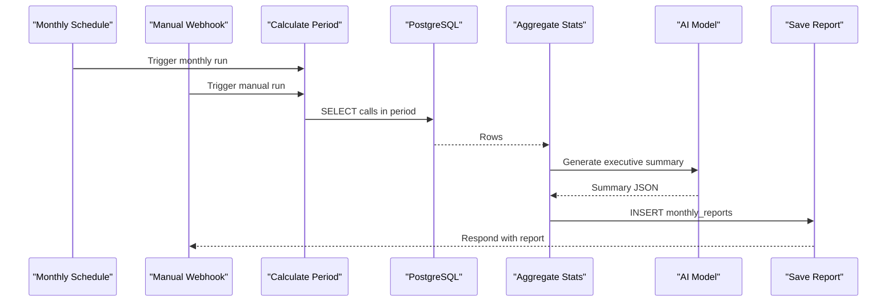
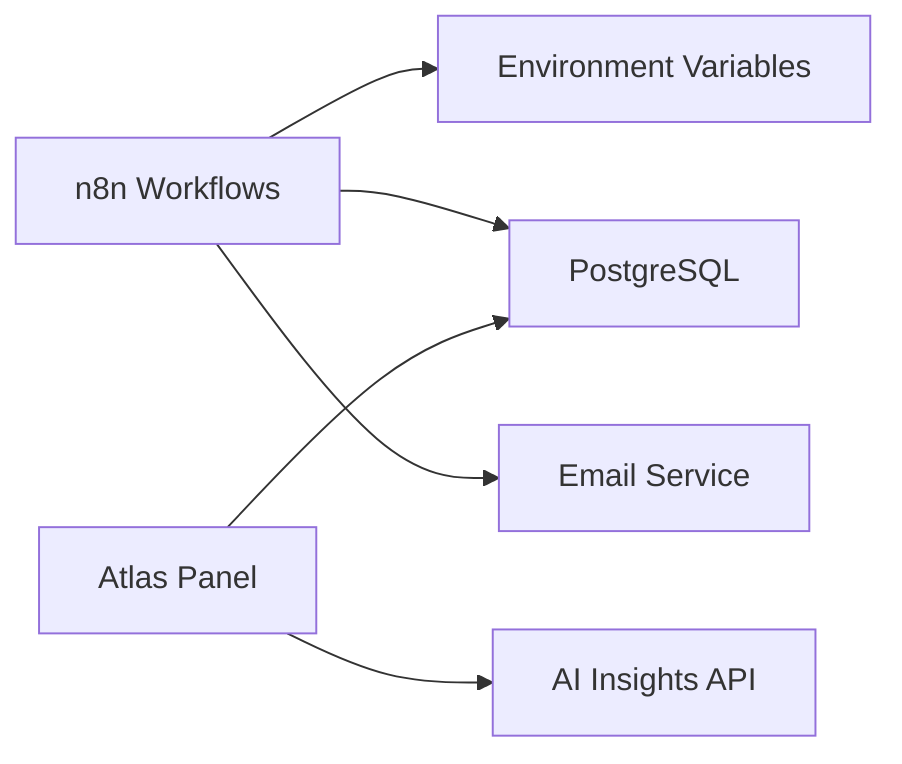

# Workflow Engine

<cite>
**Referenced Files in This Document**
- [atlas-call-intelligence-v1.json](file://docker/n8n/workflows/atlas-call-intelligence-v1.json)
- [audio-analysis-workflow.json](file://docker/n8n/workflows/audio-analysis-workflow.json)
- [atlas-call-intelligence-monthly-report.json](file://docker/n8n/workflows/atlas-call-intelligence-monthly-report.json)
- [double-number-workflow.json](file://docker/n8n/workflows/double-number-workflow.json)
- [postgres.json](file://docker/n8n/credentials/postgres.json)
- [001_call_intelligence.sql](file://docker/postgres/init/001_call_intelligence.sql)
- [main.py](file://docker/panel/app/main.py)
- [queries.py](file://docker/panel/app/queries.py)
- [db.py](file://docker/panel/app/db.py)
- [send-real-call-analysis.py](file://docker/scripts/send-real-call-analysis.py)
- [test-result-final.json](file://docker/scripts/test-result-final.json)
</cite>

## Table of Contents
1. [Introduction](#introduction)
2. [Project Structure](#project-structure)
3. [Core Components](#core-components)
4. [Architecture Overview](#architecture-overview)
5. [Detailed Component Analysis](#detailed-component-analysis)
6. [Dependency Analysis](#dependency-analysis)
7. [Performance Considerations](#performance-considerations)
8. [Troubleshooting Guide](#troubleshooting-guide)
9. [Conclusion](#conclusion)
10. [Appendices](#appendices)

## Introduction
This document explains the n8n-powered Workflow Engine for Atlas Call Intelligence. It covers:
- The main call intelligence workflow that ingests audio or transcripts, performs AI analysis, transforms data, and persists results to PostgreSQL.
- An audio analysis workflow for speech-to-text-based insights and sentiment analysis.
- A monthly report generation workflow that aggregates call analytics and produces executive summaries.
- Integration patterns with external services (AI models via HTTP), email delivery, and the Atlas Panel UI.
- Guidance on debugging, error handling, performance monitoring, custom node development, and scaling.

## Project Structure
The workflow engine is implemented as a set of n8n workflows stored under docker/n8n/workflows. Data persistence is provided by PostgreSQL, initialized via SQL scripts. The Atlas Panel reads from the same database to render dashboards and reports.

**Diagram sources**
- [atlas-call-intelligence-v1.json:10-143](file://docker/n8n/workflows/atlas-call-intelligence-v1.json#L10-L143)
- [atlas-call-intelligence-monthly-report.json:10-133](file://docker/n8n/workflows/atlas-call-intelligence-monthly-report.json#L10-L133)
- [001_call_intelligence.sql:4-44](file://docker/postgres/init/001_call_intelligence.sql#L4-L44)

**Section sources**
- [atlas-call-intelligence-v1.json:10-143](file://docker/n8n/workflows/atlas-call-intelligence-v1.json#L10-L143)
- [atlas-call-intelligence-monthly-report.json:10-133](file://docker/n8n/workflows/atlas-call-intelligence-monthly-report.json#L10-L133)
- [001_call_intelligence.sql:4-44](file://docker/postgres/init/001_call_intelligence.sql#L4-L44)

## Core Components
- Webhook endpoints for real-time call analysis and manual monthly report triggers.
- Code nodes for input parsing, prompt construction, response validation, and enrichment.
- HTTP Request nodes to call an AI model endpoint (configurable via environment variables).
- PostgreSQL nodes to persist per-call analyses and monthly reports.
- Email integration via an internal HTTP mailer service.
- Atlas Panel FastAPI app to visualize results and generate ad-hoc AI insights.

Key configuration:
- Database credentials are defined in the n8n credentials file and used by Postgres nodes.
- AI model URL and model name are read from environment variables within workflow nodes.

**Section sources**
- [postgres.json:1-15](file://docker/n8n/credentials/postgres.json#L1-L15)
- [atlas-call-intelligence-v1.json:47-61](file://docker/n8n/workflows/atlas-call-intelligence-v1.json#L47-L61)
- [atlas-call-intelligence-monthly-report.json:50-69](file://docker/n8n/workflows/atlas-call-intelligence-monthly-report.json#L50-L69)

## Architecture Overview
The system follows a pipeline pattern:
- Ingestion: Webhooks accept payloads containing either audio URLs or transcripts along with metadata.
- Transformation: Code nodes normalize inputs, build prompts, and validate outputs against a strict schema.
- AI Analysis: HTTP requests send prompts to an AI model endpoint; responses are parsed into structured JSON.
- Persistence: Results are upserted into PostgreSQL for later querying and reporting.
- Notifications: Optional email notifications are sent to managers based on analysis outcomes.
- Reporting: A scheduled or webhook-triggered monthly workflow aggregates metrics and generates executive summaries.

**Diagram sources**
- [atlas-call-intelligence-v1.json:10-143](file://docker/n8n/workflows/atlas-call-intelligence-v1.json#L10-L143)

## Detailed Component Analysis

### Main Call Intelligence Workflow
Responsibilities:
- Accepts a POST request with flexible field names for audio URL or transcript and rich metadata (call ID, department, agent, customer, duration, date, direction, product context).
- Builds a deterministic prompt tailored to sales/support/mixed contexts and enforces a strict output schema.
- Calls an AI model endpoint configured via environment variables.
- Parses and validates the AI response, enriching it with metadata and ensuring required fields.
- Persists the analysis to PostgreSQL using an upsert on call_id.
- Sends a manager email summarizing key findings and ticket priority.
- Returns a consistent JSON response indicating success, department, email status, and embedded analysis.

Data flow highlights:
- Input normalization supports multiple naming conventions for robust integrations.
- Prompt engineering includes department hints and product context to improve accuracy.
- Error handling continues execution even if email sending fails, preserving idempotent storage.

**Diagram sources**
- [atlas-call-intelligence-v1.json:10-143](file://docker/n8n/workflows/atlas-call-intelligence-v1.json#L10-L143)

**Section sources**
- [atlas-call-intelligence-v1.json:10-143](file://docker/n8n/workflows/atlas-call-intelligence-v1.json#L10-L143)

### Audio Analysis Workflow
Purpose:
- Provides a simpler, focused workflow for analyzing audio transcripts to extract category, sentiment, pain points, and key takeaways.

Workflow steps:
- Webhook receives payload with transcript and optional audio URL.
- Code node constructs a concise prompt for classification and insight extraction.
- HTTP Request sends the prompt to an AI model endpoint.
- Function node formats the response into a standardized structure.
- Respond node returns the analysis to the caller.

Use cases:
- Quick transcription review and sentiment scoring.
- Preprocessing step before deeper analysis in the main workflow.

**Section sources**
- [audio-analysis-workflow.json:1-139](file://docker/n8n/workflows/audio-analysis-workflow.json#L1-L139)

### Monthly Report Generation Workflow
Purpose:
- Aggregates call analytics for a given month and generates an executive summary using AI.

Triggers:
- Scheduled cron trigger runs monthly at a fixed time.
- Manual webhook allows on-demand report generation.

Processing logic:
- Calculates period boundaries based on current or requested month.
- Fetches all call analyses within the period from PostgreSQL.
- Aggregates metrics by department and agent, computing averages and counts.
- Invokes AI to produce a Persian-language executive summary with recommendations.
- Persists the final report JSON into monthly_reports.
- Optionally responds to the manual webhook with report details.

**Diagram sources**
- [atlas-call-intelligence-monthly-report.json:10-133](file://docker/n8n/workflows/atlas-call-intelligence-monthly-report.json#L10-L133)

**Section sources**
- [atlas-call-intelligence-monthly-report.json:10-133](file://docker/n8n/workflows/atlas-call-intelligence-monthly-report.json#L10-L133)

### Example: Simple Double Number Workflow
Demonstrates basic webhook processing and code transformation:
- Receives a number via query or body.
- Validates input and doubles it.
- Returns the result.

This example is useful for testing webhook connectivity and code node behavior.

**Section sources**
- [double-number-workflow.json:1-80](file://docker/n8n/workflows/double-number-workflow.json#L1-L80)

### Database Schema and Storage Operations
Tables:
- call_analyses: Stores per-call AI analysis, scores, metadata, and timestamps. Includes unique constraint on call_id for idempotent upserts.
- monthly_reports: Stores aggregated monthly reports with JSON payload and total call counts.

Indexes:
- Optimized queries on analyzed_at, agent_id, department, call_date, and report_month.

Integration:
- n8n Postgres nodes use credentials defined in postgres.json.
- Atlas Panel reads from these tables to render dashboards and drill-down views.

**Section sources**
- [001_call_intelligence.sql:4-44](file://docker/postgres/init/001_call_intelligence.sql#L4-L44)
- [postgres.json:1-15](file://docker/n8n/credentials/postgres.json#L1-L15)
- [queries.py:6-23](file://docker/panel/app/queries.py#L6-L23)

### Atlas Panel Integration
The FastAPI panel provides:
- Dashboard pages for overview, top performers, ready-to-buy leads, unhappy customers, staff performance, satisfaction, successful sales, and monthly reports.
- API endpoints to fetch stats and AI-generated insights based on current data.
- Authentication middleware to protect sensitive pages.

Data consumption:
- Queries aggregate call_analyses and monthly_reports to populate UI components.
- AI insights endpoint composes a context payload from multiple queries and calls an AI function to generate narrative insights.

**Section sources**
- [main.py:85-187](file://docker/panel/app/main.py#L85-L187)
- [queries.py:6-260](file://docker/panel/app/queries.py#L6-L260)
- [db.py:1-31](file://docker/panel/app/db.py#L1-L31)

## Dependency Analysis
Component relationships:
- Workflows depend on:
  - Environment variables for AI model URL and model name.
  - PostgreSQL credentials for data persistence.
  - Internal email service via HTTP.
- Panel depends on:
  - PostgreSQL for reading analytics and reports.
  - Optional AI service for generating insights.

External integrations:
- AI model endpoint called via HTTP POST with JSON payloads.
- Email service invoked via HTTP POST with recipient, subject, and body.

Potential coupling:
- Tight coupling between workflow code nodes and expected AI response structures; changes to model output require updates to parsing logic.
- Strong reliance on PostgreSQL schema stability for both workflows and panel queries.

**Diagram sources**
- [atlas-call-intelligence-v1.json:47-61](file://docker/n8n/workflows/atlas-call-intelligence-v1.json#L47-L61)
- [atlas-call-intelligence-monthly-report.json:50-69](file://docker/n8n/workflows/atlas-call-intelligence-monthly-report.json#L50-L69)
- [postgres.json:1-15](file://docker/n8n/credentials/postgres.json#L1-L15)
- [main.py:183-187](file://docker/panel/app/main.py#L183-L187)

**Section sources**
- [atlas-call-intelligence-v1.json:47-61](file://docker/n8n/workflows/atlas-call-intelligence-v1.json#L47-L61)
- [atlas-call-intelligence-monthly-report.json:50-69](file://docker/n8n/workflows/atlas-call-intelligence-monthly-report.json#L50-L69)
- [postgres.json:1-15](file://docker/n8n/credentials/postgres.json#L1-L15)
- [main.py:183-187](file://docker/panel/app/main.py#L183-L187)

## Performance Considerations
- Idempotency: Using call_id as a unique key prevents duplicate storage and reduces reprocessing overhead.
- Batch aggregation: Monthly report aggregates large datasets efficiently using SQL filters and indexes.
- Asynchronous operations: Email sending is decoupled and marked to continue on failure, avoiding blocking the main flow.
- Prompt efficiency: Restricting AI output to structured JSON minimizes post-processing cost and improves reliability.
- Index usage: Ensure queries leverage existing indexes on call_date, analyzed_at, agent_id, department, and report_month.

[No sources needed since this section provides general guidance]

## Troubleshooting Guide
Common issues and strategies:
- Invalid input: Ensure webhook payloads include either transcript or audioUrl; code nodes throw explicit errors when missing.
- AI parse failures: If the model returns non-JSON or malformed content, workflows store a parse_error flag and raw text for inspection.
- Email delivery failures: Workflows continue after attempting to send emails; check logs for timeouts or network errors.
- Database connectivity: Verify credentials in postgres.json and ensure PostgreSQL is reachable from n8n container.
- Panel access: Confirm authentication cookie and password configuration; verify queries return expected rows.

Debugging techniques:
- Use the double-number workflow to validate webhook and code node execution.
- Inspect test-result-final.json to understand how parse errors propagate through the workflow.
- Review panel endpoints to confirm data availability and correctness.

Error handling patterns:
- Continue-on-fail flags on non-critical nodes (e.g., email, report save) maintain workflow resilience.
- Explicit validation and fallbacks in code nodes prevent silent failures.

**Section sources**
- [atlas-call-intelligence-v1.json:73-120](file://docker/n8n/workflows/atlas-call-intelligence-v1.json#L73-L120)
- [atlas-call-intelligence-monthly-report.json:100-133](file://docker/n8n/workflows/atlas-call-intelligence-monthly-report.json#L100-L133)
- [double-number-workflow.json:19-46](file://docker/n8n/workflows/double-number-workflow.json#L19-L46)
- [test-result-final.json:1-17](file://docker/scripts/test-result-final.json#L1-L17)

## Conclusion
The n8n Workflow Engine orchestrates end-to-end call intelligence for Atlas:
- Real-time ingestion and AI-driven analysis with robust validation and persistence.
- Automated monthly reporting with executive summaries and actionable insights.
- Seamless integration with PostgreSQL, email services, and the Atlas Panel.
By following the patterns outlined here—structured prompts, strict schemas, resilient error handling, and efficient aggregation—you can extend workflows, integrate new services, and scale execution reliably.

[No sources needed since this section summarizes without analyzing specific files]

## Appendices

### Creating New Workflows
- Start with a simple webhook and code node to validate inputs and outputs.
- Use environment variables for configurable endpoints and models.
- Add Postgres nodes for persistence and schedule triggers for periodic tasks.
- Test with the double-number workflow as a baseline.

### Reusing Existing Nodes
- Copy proven code snippets for prompt building and response parsing.
- Leverage shared credentials for database connections.
- Mirror successful patterns for email notifications and error handling.

### Scaling Workflow Execution
- Increase n8n worker concurrency to handle higher throughput.
- Offload heavy transformations to background jobs where possible.
- Optimize database queries and ensure proper indexing.
- Monitor AI model latency and implement retries/backoff for transient failures.

### Custom Node Development
- Encapsulate complex logic in reusable functions or microservices.
- Expose stable APIs for n8n HTTP Request nodes to call.
- Version your APIs to avoid breaking changes in workflows.

### Webhook Integrations and External API Calls
- Standardize payload shapes across clients to reduce parsing complexity.
- Use consistent headers and authentication schemes.
- Log request IDs for traceability across systems.

### Integration Patterns with Atlas Components
- Panel consumes PostgreSQL data for visualization and ad-hoc insights.
- Workflows write normalized analysis JSON enabling cross-feature queries.
- Shared environment variables centralize configuration for AI services.

### Example Scripts and Tests
- Python script demonstrates end-to-end analysis and email delivery using an external AI provider.
- Test artifacts show expected outputs and error propagation.

**Section sources**
- [send-real-call-analysis.py:1-219](file://docker/scripts/send-real-call-analysis.py#L1-L219)
- [test-result-final.json:1-17](file://docker/scripts/test-result-final.json#L1-L17)