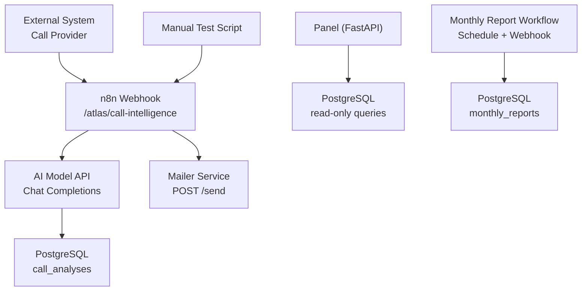
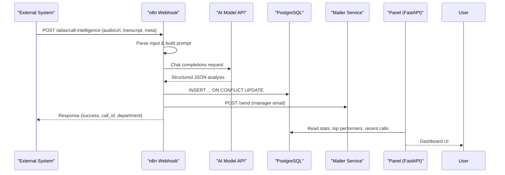
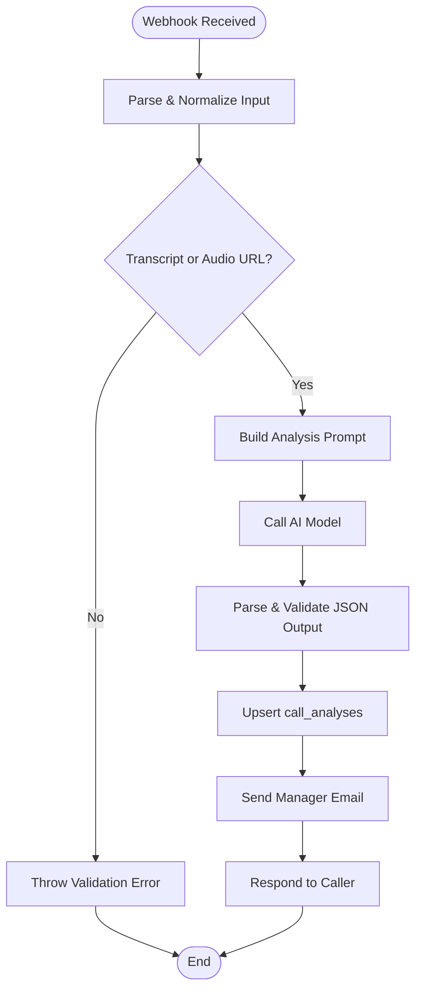
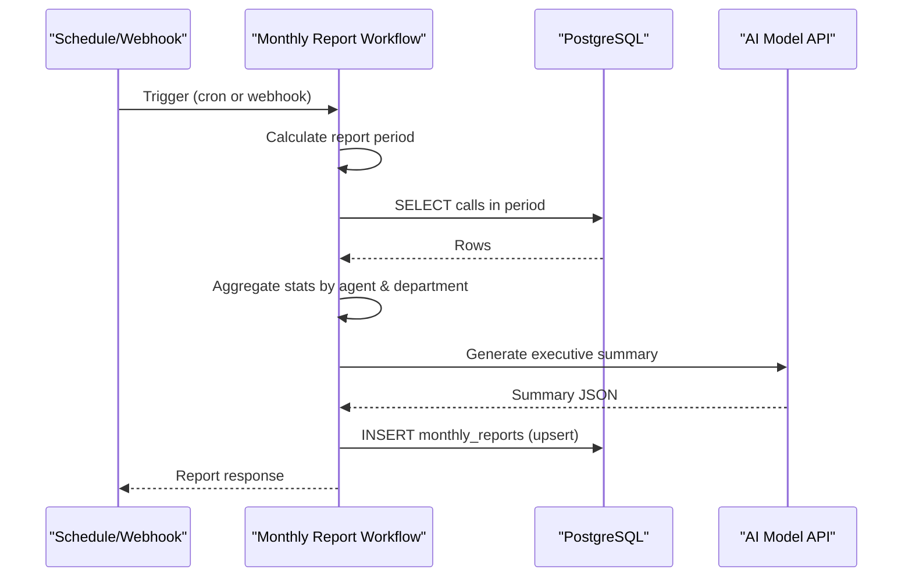
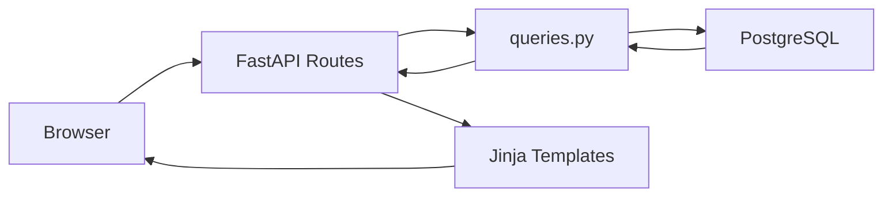
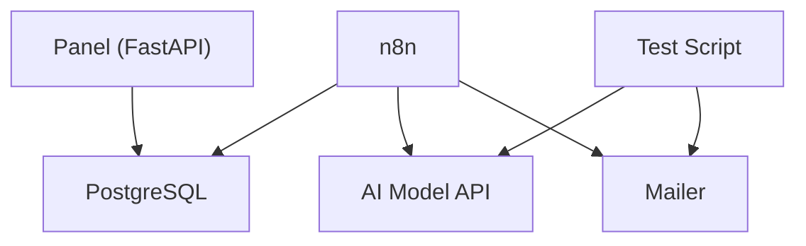
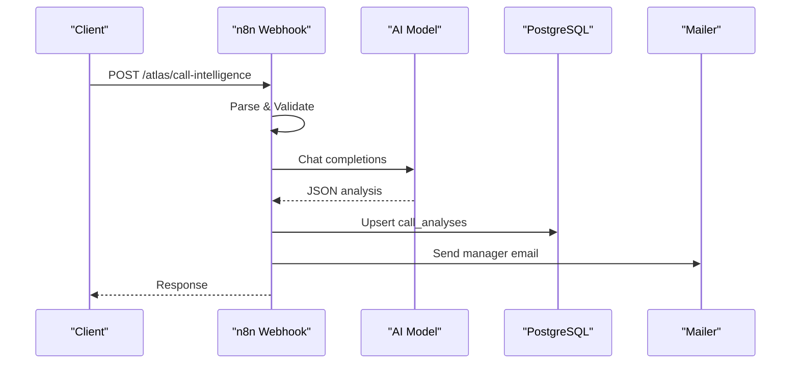
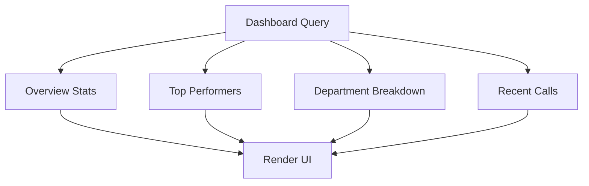
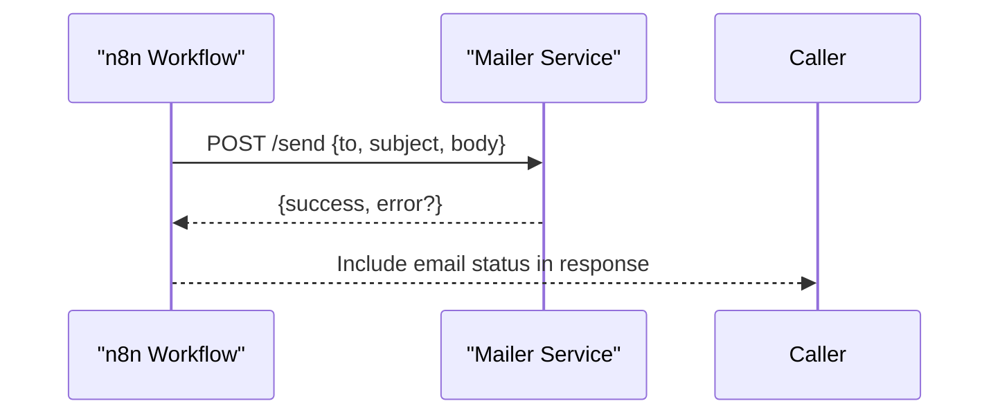

# Data Flow Architecture

<cite>
**Referenced Files in This Document**
- [docker-compose.yml](file://docker/docker-compose.yml)
- [001_call_intelligence.sql](file://docker/postgres/init/001_call_intelligence.sql)
- [atlas-call-intelligence-v1.json](file://docker/n8n/workflows/atlas-call-intelligence-v1.json)
- [audio-analysis-workflow.json](file://docker/n8n/workflows/audio-analysis-workflow.json)
- [atlas-call-intelligence-monthly-report.json](file://docker/n8n/workflows/atlas-call-intelligence-monthly-report.json)
- [main.py](file://docker/panel/app/main.py)
- [queries.py](file://docker/panel/app/queries.py)
- [db.py](file://docker/panel/app/db.py)
- [config.py](file://docker/panel/app/config.py)
- [send-real-call-analysis.py](file://docker/scripts/send-real-call-analysis.py)
</cite>

## Table of Contents
1. Introduction
2. Project Structure
3. Core Components
4. Architecture Overview
5. Detailed Component Analysis
6. Dependency Analysis
7. Performance Considerations
8. Troubleshooting Guide
9. Conclusion
10. Appendices

## Introduction
This document describes the end-to-end data flow architecture of the Atlas platform, from call ingestion to AI analysis and dashboard reporting. It explains how audio files and transcripts are processed through n8n workflows, analyzed by AI models, persisted in PostgreSQL, and surfaced via a web panel for real-time insights and monthly reports. It also covers webhook-based communication, event-driven processing, data transformation and validation rules, error handling, batch processing, aggregation queries, and operational concerns such as consistency, transactions, and backups.

## Project Structure
Atlas is composed of four primary services orchestrated by Docker Compose:
- PostgreSQL: persistent storage for call analyses and monthly reports
- n8n: workflow engine that exposes webhooks, orchestrates AI calls, persists results, and triggers notifications
- Panel (FastAPI): web application serving dashboards and APIs over HTML templates
- Mailer: lightweight HTTP service used to send manager notifications

**Diagram sources**
- [docker-compose.yml:3-98](file://docker/docker-compose.yml#L3-L98)
- [atlas-call-intelligence-v1.json:12-154](file://docker/n8n/workflows/atlas-call-intelligence-v1.json#L12-L154)
- [atlas-call-intelligence-monthly-report.json:11-159](file://docker/n8n/workflows/atlas-call-intelligence-monthly-report.json#L11-L159)
- [main.py:68-186](file://docker/panel/app/main.py#L68-L186)
- [001_call_intelligence.sql:4-45](file://docker/postgres/init/001_call_intelligence.sql#L4-L45)

**Section sources**
- [docker-compose.yml:3-98](file://docker/docker-compose.yml#L3-L98)

## Core Components
- Ingestion and orchestration: n8n workflows expose webhooks to receive call metadata and transcripts or audio URLs, prepare prompts, call AI models, validate outputs, persist results, and trigger notifications.
- Storage: PostgreSQL stores per-call analysis records and monthly aggregated reports with indexes for efficient querying.
- Dashboard: FastAPI panel serves HTML pages and APIs that read from PostgreSQL to render real-time metrics, staff performance, satisfaction, and monthly reports.
- Notifications: A mailer service receives POST requests to send manager emails with summaries and actionable items.

Key responsibilities:
- Data transformation and validation occur in n8n code nodes before persistence.
- Aggregation and reporting logic exist both in n8n (monthly report workflow) and in Panel SQL queries.
- Real-time updates are achieved by refreshing the dashboard after new call analyses arrive; batch processing runs monthly report generation on schedule or via webhook.

**Section sources**
- [atlas-call-intelligence-v1.json:12-154](file://docker/n8n/workflows/atlas-call-intelligence-v1.json#L12-L154)
- [atlas-call-intelligence-monthly-report.json:11-159](file://docker/n8n/workflows/atlas-call-intelligence-monthly-report.json#L11-L159)
- [001_call_intelligence.sql:4-45](file://docker/postgres/init/001_call_intelligence.sql#L4-L45)
- [main.py:68-186](file://docker/panel/app/main.py#L68-L186)
- [queries.py:6-260](file://docker/panel/app/queries.py#L6-L260)

## Architecture Overview
The system follows an event-driven, webhook-first model:
- Call ingestion: External systems POST call metadata and transcript/audio URL to n8n’s main webhook.
- AI analysis: n8n constructs a prompt and calls the configured AI model API.
- Persistence: Validated JSON analysis is inserted into PostgreSQL with upsert semantics to avoid duplicates.
- Notification: Manager email is sent asynchronously; failures do not block response.
- Reporting: Monthly report workflow aggregates recent call data, generates executive summary via AI, and persists the report.
- Dashboard: Panel reads from PostgreSQL to render live dashboards and drill-down views.

**Diagram sources**
- [atlas-call-intelligence-v1.json:12-154](file://docker/n8n/workflows/atlas-call-intelligence-v1.json#L12-L154)
- [main.py:68-186](file://docker/panel/app/main.py#L68-L186)
- [001_call_intelligence.sql:4-45](file://docker/postgres/init/001_call_intelligence.sql#L4-L45)

## Detailed Component Analysis

### Call Ingestion and Analysis Pipeline (n8n)
The main workflow handles:
- Webhook reception at a dedicated path
- Input parsing and normalization of fields like audio URL, transcript, and metadata
- Prompt preparation tailored to department hints and product context
- AI model invocation using environment-configured endpoint and model
- Parsing and validating AI output against a strict schema
- Persisting normalized fields and full JSON analysis to PostgreSQL
- Sending manager notification via mailer
- Responding to the caller with success status and identifiers

Validation and transformation rules include:
- Required inputs: transcript or audio URL must be present
- Department hint mapping and default values
- Enrichment of analysis metadata with call_id, timestamps, language, and workflow version
- Extraction of key scores (purchase intent, satisfaction, agent quality) and ticket priority
- Upsert behavior to ensure idempotent writes per call_id

Error handling:
- Database write node continues on failure to allow downstream steps to proceed
- Email sending node continues on failure so the caller still gets a response
- JSON parse errors are captured and flagged in the stored analysis

**Diagram sources**
- [atlas-call-intelligence-v1.json:12-154](file://docker/n8n/workflows/atlas-call-intelligence-v1.json#L12-L154)

**Section sources**
- [atlas-call-intelligence-v1.json:12-154](file://docker/n8n/workflows/atlas-call-intelligence-v1.json#L12-L154)

### Audio Analysis Workflow (n8n)
A secondary workflow focuses on summarizing audio transcripts:
- Receives audio URL and optional transcript
- Builds a concise prompt requesting structured categories and sentiment
- Calls the AI model and formats the response
- Returns the analysis directly to the caller

This workflow is useful for quick insights without full pipeline persistence.

**Section sources**
- [audio-analysis-workflow.json:4-124](file://docker/n8n/workflows/audio-analysis-workflow.json#L4-L124)

### Monthly Report Generation (n8n)
The monthly report workflow supports both scheduled execution and manual triggering:
- ScheduleTrigger runs on a monthly cron expression
- Manual webhook allows ad-hoc report generation
- Calculates period boundaries based on current month or provided parameters
- Fetches call_analyses within the period
- Aggregates statistics by department and agent, computes averages and counts
- Invokes AI to generate an executive summary in Persian
- Builds a final report JSON and persists it to monthly_reports
- Responds with report details

Aggregation highlights:
- Agent-level metrics: total calls, average purchase intent, satisfaction, agent quality, needs review count, high-priority tickets, success score
- Department-level metrics: total calls, average satisfaction, agent quality, purchase intent, needs review, success rate percentage
- Executive summary includes strengths, critical issues, recommendations, training priorities, and KPI highlights

**Diagram sources**
- [atlas-call-intelligence-monthly-report.json:11-159](file://docker/n8n/workflows/atlas-call-intelligence-monthly-report.json#L11-L159)

**Section sources**
- [atlas-call-intelligence-monthly-report.json:11-159](file://docker/n8n/workflows/atlas-call-intelligence-monthly-report.json#L11-L159)

### Panel and Dashboard (FastAPI)
The Panel provides:
- Authentication middleware and login page
- Dashboard endpoints rendering HTML templates with query results
- Specific pages for top performers, ready-to-buy leads, unhappy customers, staff performance, call duration, satisfaction, successful sales, and monthly reports
- APIs for AI insights and stats

Data access layer:
- db.py manages connections and provides fetch_all/fetch_one helpers
- queries.py contains all SQL queries for dashboards and reports
- main.py wires routes to templates and queries

Real-time updates:
- The dashboard reads fresh data from PostgreSQL on each request
- New call analyses appear immediately after ingestion completes

Batch reporting:
- Monthly reports are generated by n8n and displayed via Panel endpoints

**Diagram sources**
- [main.py:68-186](file://docker/panel/app/main.py#L68-L186)
- [queries.py:6-260](file://docker/panel/app/queries.py#L6-L260)
- [db.py:1-31](file://docker/panel/app/db.py#L1-L31)

**Section sources**
- [main.py:68-186](file://docker/panel/app/main.py#L68-L186)
- [queries.py:6-260](file://docker/panel/app/queries.py#L6-L260)
- [db.py:1-31](file://docker/panel/app/db.py#L1-L31)

### Data Models and Schema
PostgreSQL schema defines two core tables:
- call_analyses: per-call AI analysis with indexed fields for fast filtering and aggregation
- monthly_reports: aggregated monthly reports with unique constraints per month and department

Indexes optimize common queries:
- analyzed_at, agent_id, department, call_date for call_analyses
- report_month for monthly_reports

**Section sources**
- [001_call_intelligence.sql:4-45](file://docker/postgres/init/001_call_intelligence.sql#L4-L45)

### Configuration and Environment
Environment variables control service behavior:
- n8n: AI API URL, model name, manager email, SMTP sender
- Panel: database credentials, AI API key/model, panel title/password
- Mailer: SMTP settings and recipient configuration

These are set in docker-compose and referenced by services at runtime.

**Section sources**
- [docker-compose.yml:34-53](file://docker/docker-compose.yml#L34-L53)
- [docker-compose.yml:86-95](file://docker/docker-compose.yml#L86-L95)
- [config.py:1-14](file://docker/panel/app/config.py#L1-L14)

## Dependency Analysis
Service dependencies and integration points:
- n8n depends on PostgreSQL for persistence and on the AI model API for analysis
- Panel depends on PostgreSQL for reading dashboards and reports
- Mailer is called by n8n for notifications
- Scripts can invoke AI directly and send emails for testing

**Diagram sources**
- [docker-compose.yml:26-98](file://docker/docker-compose.yml#L26-L98)
- [atlas-call-intelligence-v1.json:47-119](file://docker/n8n/workflows/atlas-call-intelligence-v1.json#L47-L119)
- [main.py:68-186](file://docker/panel/app/main.py#L68-L186)
- [send-real-call-analysis.py:17-30](file://docker/scripts/send-real-call-analysis.py#L17-L30)

**Section sources**
- [docker-compose.yml:26-98](file://docker/docker-compose.yml#L26-L98)

## Performance Considerations
- Index usage: Ensure queries leverage existing indexes on analyzed_at, agent_id, department, call_date, and report_month
- Batch vs real-time: Use n8n monthly workflow for heavy aggregations; Panel queries should be optimized for small result sets
- AI latency: Configure timeouts and consider caching or retries for AI calls
- Concurrency: n8n workflows run per item; monitor execution limits and queue backpressure
- Storage growth: Periodic archival of call_analyses and monthly_reports may be needed for long-term retention

[No sources needed since this section provides general guidance]

## Troubleshooting Guide
Common issues and resolutions:
- Invalid input: If transcript and audio URL are missing, the workflow throws a validation error; ensure callers provide at least one
- AI parse errors: Stored analysis flags parse_error; inspect raw_text to debug prompt/response format
- Database write failures: The workflow continues on failure; check logs and connection credentials if analytics are missing
- Email delivery failures: The workflow continues on failure; verify mailer service availability and SMTP settings
- Panel authentication: If PANEL_PASSWORD is set, ensure cookie is set after login; otherwise, bypass auth
- Config mismatches: Verify environment variables for AI model, API URL, and database credentials across services

Operational checks:
- Confirm PostgreSQL health via healthcheck in compose
- Validate n8n credentials for PostgreSQL
- Check mailer port exposure and SMTP configuration
- Inspect template rendering and query results in Panel logs

**Section sources**
- [atlas-call-intelligence-v1.json:26-119](file://docker/n8n/workflows/atlas-call-intelligence-v1.json#L26-L119)
- [atlas-call-intelligence-monthly-report.json:80-119](file://docker/n8n/workflows/atlas-call-intelligence-monthly-report.json#L80-L119)
- [main.py:40-65](file://docker/panel/app/main.py#L40-L65)
- [docker-compose.yml:20-25](file://docker/docker-compose.yml#L20-L25)

## Conclusion
Atlas implements a robust, event-driven data pipeline that ingests call data via webhooks, analyzes it with AI models, persists structured results in PostgreSQL, and surfaces insights through a responsive dashboard. The monthly report workflow provides batch processing capabilities for executive summaries and performance metrics. With clear validation rules, resilient error handling, and well-indexed storage, the system supports both real-time monitoring and periodic reporting. Operational safeguards and configuration management ensure reliability and scalability.

[No sources needed since this section summarizes without analyzing specific files]

## Appendices

### Typical Data Flows

#### Call Analysis Sequence

**Diagram sources**
- [atlas-call-intelligence-v1.json:12-154](file://docker/n8n/workflows/atlas-call-intelligence-v1.json#L12-L154)

#### Performance Metrics Calculation

**Diagram sources**
- [queries.py:6-260](file://docker/panel/app/queries.py#L6-L260)
- [main.py:68-186](file://docker/panel/app/main.py#L68-L186)

#### Notification Generation

**Diagram sources**
- [atlas-call-intelligence-v1.json:106-119](file://docker/n8n/workflows/atlas-call-intelligence-v1.json#L106-L119)

### Data Consistency, Transactions, and Backups
- Consistency: Per-call upsert ensures idempotent writes; unique constraint on call_id prevents duplicates
- Transactions: Each n8n database operation executes as a single statement; complex multi-step transactions are not used in the current workflows
- Backups: PostgreSQL volume is mounted for persistence; configure external backup strategies (e.g., pg_dump schedules) to protect data

**Section sources**
- [001_call_intelligence.sql:4-45](file://docker/postgres/init/001_call_intelligence.sql#L4-L45)
- [docker-compose.yml:16-18](file://docker/docker-compose.yml#L16-L18)