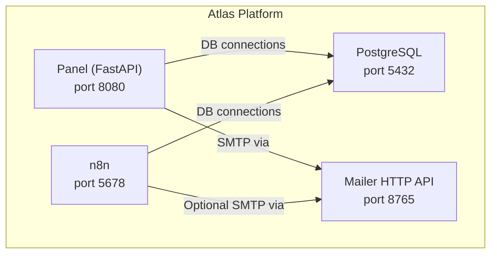
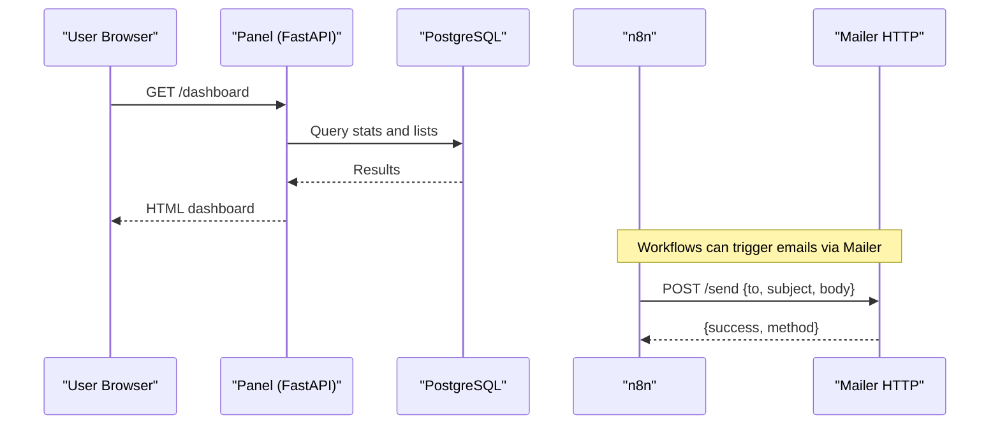
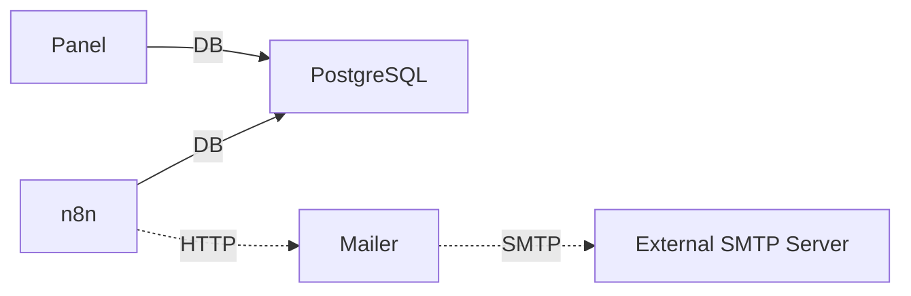

# Deployment Architecture

<cite>
**Referenced Files in This Document**
- [docker-compose.yml](file://docker/docker-compose.yml)
- [Dockerfile](file://docker/panel/Dockerfile)
- [config.py](file://docker/panel/app/config.py)
- [main.py](file://docker/panel/app/main.py)
- [db.py](file://docker/panel/app/db.py)
- [requirements.txt](file://docker/panel/requirements.txt)
- [001_call_intelligence.sql](file://docker/postgres/init/001_call_intelligence.sql)
- [002_panel_seed.sql](file://docker/postgres/init/002_panel_seed.sql)
- [mailer.py](file://docker/mailer/mailer.py)
- [postgres.json](file://docker/n8n/credentials/postgres.json)
</cite>

## Table of Contents
1. [Introduction](#introduction)
2. [Project Structure](#project-structure)
3. [Core Components](#core-components)
4. [Architecture Overview](#architecture-overview)
5. [Detailed Component Analysis](#detailed-component-analysis)
6. [Dependency Analysis](#dependency-analysis)
7. [Performance Considerations](#performance-considerations)
8. [Troubleshooting Guide](#troubleshooting-guide)
9. [Conclusion](#conclusion)
10. [Appendices](#appendices)

## Introduction
This document describes the deployment architecture for the Atlas platform using Docker Compose. It covers service orchestration, networking and volumes, initialization flows (database schema and seed data), environment configuration and secrets handling, production considerations (health checks, logging, monitoring, backups), scaling and high availability strategies, deployment checklists, and troubleshooting guidance. The goal is to enable reliable local development and production deployments with clear operational practices.

## Project Structure
The deployment is defined by a single Docker Compose file that orchestrates four services: PostgreSQL, n8n, mailer, and panel. Each service has specific environment variables, ports, volumes, and dependencies.

**Diagram sources**
- [docker-compose.yml:3-98](file://docker/docker-compose.yml#L3-L98)

**Section sources**
- [docker-compose.yml:1-98](file://docker/docker-compose.yml#L1-L98)

## Core Components
- PostgreSQL: Stores call analyses and monthly reports; initialized with schema and seed data.
- n8n: Workflow automation tool configured to use PostgreSQL and optional AI APIs.
- Mailer: Lightweight Python HTTP server exposing an SMTP-based email sending endpoint.
- Panel: FastAPI web application serving dashboards and analytics over the database.

Key responsibilities:
- Data persistence and initialization via mounted SQL scripts.
- Service discovery through Docker Compose internal DNS.
- Environment-driven configuration for credentials and endpoints.

**Section sources**
- [docker-compose.yml:3-98](file://docker/docker-compose.yml#L3-L98)
- [001_call_intelligence.sql:1-45](file://docker/postgres/init/001_call_intelligence.sql#L1-L45)
- [002_panel_seed.sql:1-46](file://docker/postgres/init/002_panel_seed.sql#L1-L46)
- [mailer.py:1-77](file://docker/mailer/mailer.py#L1-L77)
- [main.py:1-204](file://docker/panel/app/main.py#L1-L204)
- [config.py:1-14](file://docker/panel/app/config.py#L1-L14)
- [db.py:1-31](file://docker/panel/app/db.py#L1-L31)
- [postgres.json:1-15](file://docker/n8n/credentials/postgres.json#L1-L15)

## Architecture Overview
The system follows a multi-service topology with clear separation of concerns:
- Database layer: PostgreSQL with health checks and persistent volumes.
- Automation layer: n8n workflows reading/writing to PostgreSQL and optionally calling external AI APIs.
- Notification layer: Mailer HTTP service wrapping SMTP to send emails.
- Presentation layer: Panel web app rendering dashboards and querying the database.

**Diagram sources**
- [docker-compose.yml:26-61](file://docker/docker-compose.yml#L26-L61)
- [docker-compose.yml:62-79](file://docker/docker-compose.yml#L62-L79)
- [docker-compose.yml:80-98](file://docker/docker-compose.yml#L80-L98)
- [main.py:85-97](file://docker/panel/app/main.py#L85-L97)
- [mailer.py:36-68](file://docker/mailer/mailer.py#L36-L68)

## Detailed Component Analysis

### PostgreSQL
- Image and container name are defined with restart policy.
- Health check uses pg_isready to ensure readiness before dependent services start.
- Volumes:
  - Persistent data directory mapped to host path.
  - Init scripts directory mounted to be executed on first run.
- Ports: Host port 15432 exposed to host for direct access if needed.

Initialization process:
- Schema creation in 001_call_intelligence.sql defines tables and indexes.
- Seed data in 002_panel_seed.sql inserts sample records for demonstration.

Environment variables:
- POSTGRES_USER, POSTGRES_PASSWORD, POSTGRES_DB define the database identity.

Operational notes:
- Ensure the init scripts are present at startup to create schema and seed data.
- Use volume backup procedures to persist data across deployments.

**Section sources**
- [docker-compose.yml:3-25](file://docker/docker-compose.yml#L3-L25)
- [001_call_intelligence.sql:1-45](file://docker/postgres/init/001_call_intelligence.sql#L1-L45)
- [002_panel_seed.sql:1-46](file://docker/postgres/init/002_panel_seed.sql#L1-L46)

### n8n
- Uses official n8n image with persistent data volume under .n8n.
- Configured to connect to PostgreSQL via environment variables.
- Timezone settings applied for consistent scheduling and timestamps.
- Optional integration with AI APIs via environment variables.
- Security flags set for development convenience; adjust for production.

Dependencies:
- Starts after PostgreSQL is healthy.

Credentials:
- Postgres credential preset provided for quick setup.

**Section sources**
- [docker-compose.yml:26-61](file://docker/docker-compose.yml#L26-L61)
- [postgres.json:1-15](file://docker/n8n/credentials/postgres.json#L1-L15)

### Mailer
- Python HTTP server exposing /send and / endpoints.
- Reads SMTP configuration from environment variables.
- Sends emails via SMTP with TLS and authentication.
- Returns JSON responses indicating success or error details.

Configuration:
- SMTP_HOST, SMTP_PORT, SMTP_USER, SMTP_PASS control outbound email.
- ATLAS_MANAGER_EMAIL provides default recipient when not specified.
- MAILER_PORT sets listening port.

Usage:
- Other services (e.g., n8n workflows) can POST JSON payloads to send notifications.

**Section sources**
- [docker-compose.yml:62-79](file://docker/docker-compose.yml#L62-L79)
- [mailer.py:1-77](file://docker/mailer/mailer.py#L1-L77)

### Panel (FastAPI)
- Built from a dedicated Dockerfile that installs dependencies and runs uvicorn.
- Exposes port 8080 and serves static assets and templates.
- Reads database connection parameters from environment variables.
- Provides multiple dashboard routes and an AI insights endpoint.
- Optional simple password protection via PANEL_PASSWORD.

Database access:
- Connection string built from config values and used via psycopg2.
- Queries fetch overview stats, top performers, recent calls, and more.

AI integration:
- Uses AI_API_KEY and AI_MODEL environment variables for insight generation.

**Section sources**
- [Dockerfile:1-11](file://docker/panel/Dockerfile#L1-L11)
- [requirements.txt:1-7](file://docker/panel/requirements.txt#L1-L7)
- [config.py:1-14](file://docker/panel/app/config.py#L1-L14)
- [db.py:1-31](file://docker/panel/app/db.py#L1-L31)
- [main.py:1-204](file://docker/panel/app/main.py#L1-L204)

## Dependency Analysis
Service dependency graph:
- Panel depends on PostgreSQL being healthy.
- n8n depends on PostgreSQL being healthy.
- Mailer has no explicit dependencies but is typically available early.

Networking:
- Services communicate via Docker’s internal network using service names (e.g., postgres).
- Ports are published to the host for external access where necessary.

Volumes:
- PostgreSQL data persisted under ./postgres/data.
- n8n workflow data persisted under ./n8n/data.
- Mailer code mounted under ./mailer for live updates during development.

**Diagram sources**
- [docker-compose.yml:26-98](file://docker/docker-compose.yml#L26-L98)

**Section sources**
- [docker-compose.yml:3-98](file://docker/docker-compose.yml#L3-L98)

## Performance Considerations
- Health checks: PostgreSQL includes a health check; consider adding similar checks for other services in production.
- Resource limits: Define CPU and memory limits per service to prevent resource contention.
- Connection pooling: For high concurrency, consider connection pooling for PostgreSQL (e.g., PgBouncer) and tune pool sizes in applications.
- Logging: Centralize logs from all containers into a log aggregation pipeline (e.g., Loki, ELK) for observability.
- Caching: Introduce caching layers (e.g., Redis) for frequently accessed dashboard queries if needed.
- Static assets: Serve static files via a CDN or reverse proxy in production for better performance.

[No sources needed since this section provides general guidance]

## Troubleshooting Guide
Common issues and resolutions:
- Database not ready:
  - Verify PostgreSQL health check passes before starting dependent services.
  - Check that init scripts are mounted correctly and executed on first run.
- Panel cannot connect to database:
  - Confirm DB_HOST, DB_PORT, DB_NAME, DB_USER, DB_PASSWORD environment variables match PostgreSQL configuration.
  - Validate network connectivity between panel and postgres containers.
- n8n cannot connect to database:
  - Ensure n8n environment variables point to the correct PostgreSQL service and credentials.
  - Review n8n credentials preset for consistency.
- Email sending failures:
  - Verify SMTP_HOST, SMTP_PORT, SMTP_USER, SMTP_PASS are set correctly.
  - Check firewall rules and SMTP provider requirements (TLS, authentication).
- Port conflicts:
  - Ensure host ports (15432, 5678, 8765, 8080) are free or remapped in docker-compose.yml.

Operational tips:
- Inspect container logs for errors and stack traces.
- Use docker exec to run diagnostic commands inside containers (e.g., psql, curl).
- Validate environment variable precedence and defaults.

**Section sources**
- [docker-compose.yml:20-25](file://docker/docker-compose.yml#L20-L25)
- [docker-compose.yml:34-54](file://docker/docker-compose.yml#L34-L54)
- [docker-compose.yml:70-76](file://docker/docker-compose.yml#L70-L76)
- [config.py:1-14](file://docker/panel/app/config.py#L1-L14)
- [mailer.py:10-15](file://docker/mailer/mailer.py#L10-L15)

## Conclusion
The Atlas platform deployment leverages Docker Compose to orchestrate PostgreSQL, n8n, mailer, and panel services with clear separation of concerns and environment-driven configuration. Initialization is automated via mounted SQL scripts, and services depend on PostgreSQL health checks to ensure stable startup. Production hardening should include robust secrets management, centralized logging, monitoring, backups, and scaling strategies tailored to workload demands.

[No sources needed since this section summarizes without analyzing specific files]

## Appendices

### Environment Variables Reference
- PostgreSQL:
  - POSTGRES_USER, POSTGRES_PASSWORD, POSTGRES_DB
- n8n:
  - DB_TYPE, DB_POSTGRESDB_HOST, DB_POSTGRESDB_PORT, DB_POSTGRESDB_DATABASE, DB_POSTGRESDB_USER, DB_POSTGRESDB_PASSWORD
  - GENERIC_TIMEZONE, TZ
  - API_URL, TRANSCRIPTION_API_URL, API_KEY, AI_MODEL, ATLAS_MANAGER_EMAIL, ATLAS_SMTP_FROM
  - N8N_SECURE_COOKIE, N8N_BLOCK_ENV_ACCESS_IN_NODE
- Mailer:
  - SMTP_HOST, SMTP_PORT, SMTP_USER, SMTP_PASS, ATLAS_MANAGER_EMAIL, MAILER_PORT
- Panel:
  - DB_HOST, DB_PORT, DB_NAME, DB_USER, DB_PASSWORD
  - AI_API_KEY, AI_MODEL, PANEL_TITLE, PANEL_PASSWORD

**Section sources**
- [docker-compose.yml:8-12](file://docker/docker-compose.yml#L8-L12)
- [docker-compose.yml:34-54](file://docker/docker-compose.yml#L34-L54)
- [docker-compose.yml:70-76](file://docker/docker-compose.yml#L70-L76)
- [docker-compose.yml:86-95](file://docker/docker-compose.yml#L86-L95)

### Secrets Handling Best Practices
- Avoid committing secrets to version control; use environment files or secret managers.
- In production, inject secrets via orchestration platforms (e.g., Kubernetes Secrets, Docker Swarm secrets).
- Rotate credentials regularly and restrict access to sensitive values.
- Use non-root users and minimal base images to reduce attack surface.

[No sources needed since this section provides general guidance]

### Production Deployment Checklist
- Enable health checks for all services and configure readiness probes.
- Set resource limits and requests per service.
- Configure centralized logging and metrics collection.
- Implement automated backups for PostgreSQL volumes.
- Harden security: disable insecure flags, enforce HTTPS via reverse proxy, restrict exposed ports.
- Validate environment variables and secrets injection.
- Test failover and recovery procedures.

[No sources needed since this section provides general guidance]

### Scaling and High Availability
- Horizontal scaling:
  - Scale stateless services (panel, mailer) behind a load balancer.
  - Use read replicas for PostgreSQL if read-heavy workloads require it.
- Vertical scaling:
  - Increase CPU/memory allocations for database and compute services based on load.
- High availability:
  - Deploy PostgreSQL in a clustered mode or managed service with automatic failover.
  - Use container orchestration (e.g., Kubernetes) for self-healing and rolling updates.
- Load balancing:
  - Place a reverse proxy (e.g., Nginx, Traefik) in front of panel and mailer to distribute traffic.

[No sources needed since this section provides general guidance]

### Backup Strategy
- Schedule regular snapshots of PostgreSQL data volume.
- Export logical backups using pg_dump for point-in-time recovery.
- Store backups offsite with encryption and retention policies.
- Periodically test restore procedures to validate integrity.

[No sources needed since this section provides general guidance]