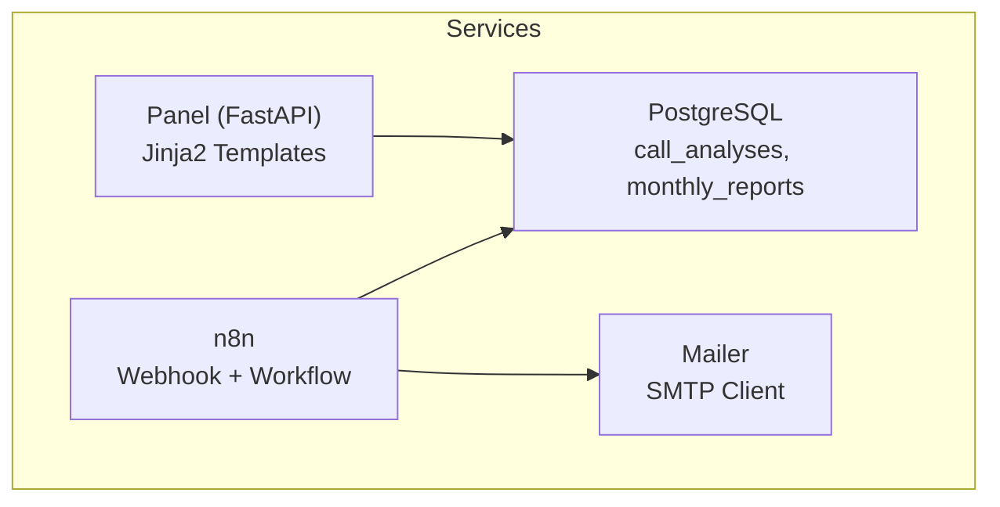
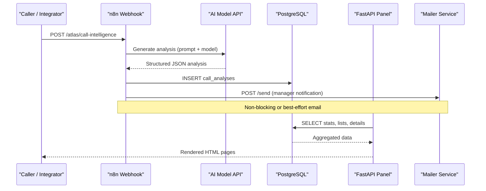
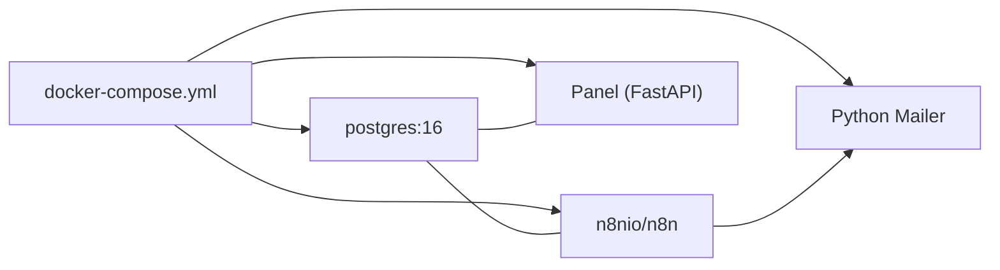
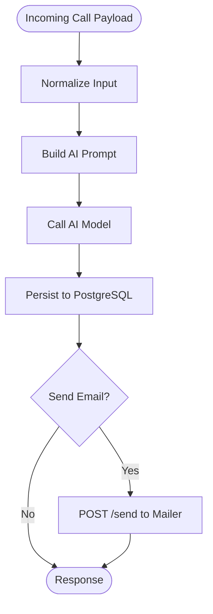
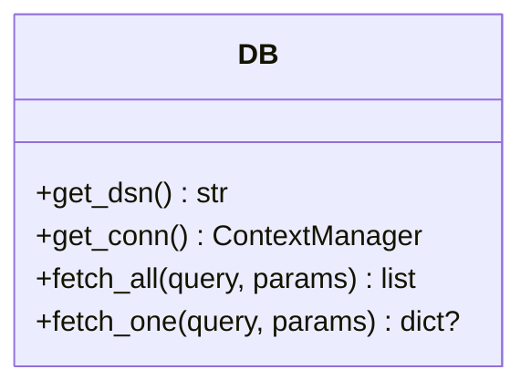
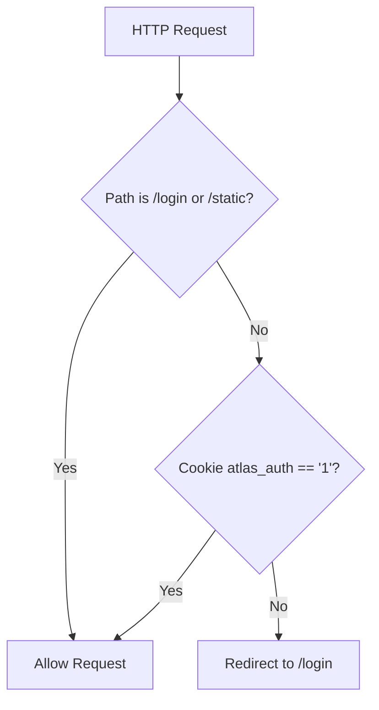
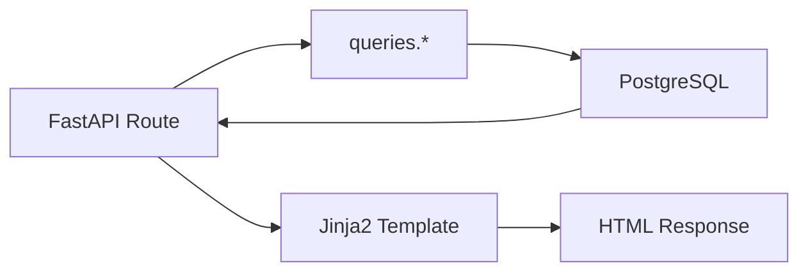
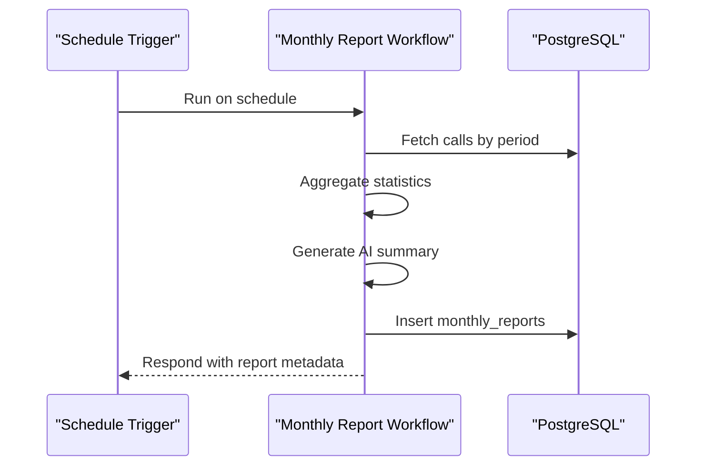
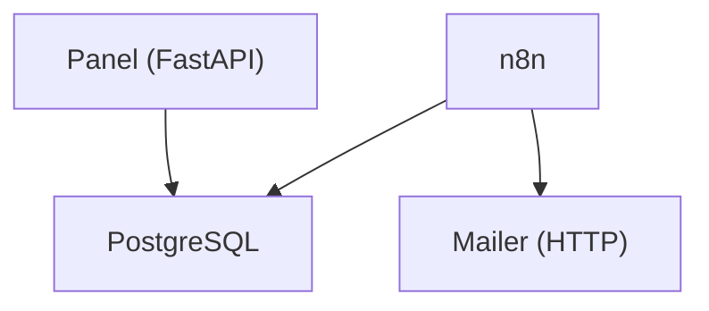

# System Design Principles

<cite>
**Referenced Files in This Document**
- [docker-compose.yml](file://docker/docker-compose.yml)
- [main.py](file://docker/panel/app/main.py)
- [config.py](file://docker/panel/app/config.py)
- [db.py](file://docker/panel/app/db.py)
- [queries.py](file://docker/panel/app/queries.py)
- [mailer.py](file://docker/mailer/mailer.py)
- [001_call_intelligence.sql](file://docker/postgres/init/001_call_intelligence.sql)
- [atlas-call-intelligence-v1.json](file://docker/n8n/workflows/atlas-call-intelligence-v1.json)
- [atlas-call-intelligence-monthly-report.json](file://docker/n8n/workflows/atlas-call-intelligence-monthly-report.json)
</cite>

## Table of Contents
1. Introduction
2. Project Structure
3. Core Components
4. Architecture Overview
5. Detailed Component Analysis
6. Dependency Analysis
7. Performance Considerations
8. Troubleshooting Guide
9. Conclusion

## Introduction
This document explains the system design principles of the Atlas platform, focusing on its microservices architecture, containerization with Docker Compose, service isolation, and event-driven communication between n8n workflows and the FastAPI panel. It also documents separation of concerns across call processing (n8n), data persistence (PostgreSQL), user interface (FastAPI panel), and notifications (mailer service). Key design patterns include context managers for database connections, middleware for authentication, and template rendering for UI. Finally, it addresses scalability, fault tolerance, and monitoring strategies.

## Project Structure
Atlas is composed of four primary services orchestrated by Docker Compose:
- PostgreSQL: persistent relational store for call analyses and monthly reports
- n8n: workflow engine that processes incoming calls via webhooks, performs AI analysis, persists results, and triggers notifications
- Panel (FastAPI): authenticated web dashboard to visualize insights and metrics
- Mailer: lightweight HTTP service that sends email notifications via SMTP

**Diagram sources**
- [docker-compose.yml:3-98](file://docker/docker-compose.yml#L3-L98)

**Section sources**
- [docker-compose.yml:3-98](file://docker/docker-compose.yml#L3-L98)

## Core Components
- Call Processing (n8n): Receives call payloads via webhook, normalizes input, prompts an AI model, parses structured analysis, persists to PostgreSQL, and optionally emails a manager notification.
- Data Persistence (PostgreSQL): Stores per-call analysis and monthly aggregated reports with indexes for efficient querying.
- User Interface (FastAPI Panel): Serves authenticated HTML pages using Jinja2 templates, reads analytics from PostgreSQL, and exposes minimal APIs for dynamic content.
- Notifications (Mailer): Exposes a simple HTTP POST endpoint to send emails via SMTP; invoked by n8n workflows.

Key design patterns:
- Context manager for database connections ensures proper resource cleanup
- Middleware enforces simple cookie-based authentication for the panel
- Template rendering centralizes UI logic and presentation

**Section sources**
- [atlas-call-intelligence-v1.json:12-159](file://docker/n8n/workflows/atlas-call-intelligence-v1.json#L12-L159)
- [001_call_intelligence.sql:4-44](file://docker/postgres/init/001_call_intelligence.sql#L4-L44)
- [main.py:16-65](file://docker/panel/app/main.py#L16-L65)
- [db.py:12-30](file://docker/panel/app/db.py#L12-L30)
- [mailer.py:18-76](file://docker/mailer/mailer.py#L18-L76)

## Architecture Overview
The platform follows a clear separation of responsibilities:
- Inbound events arrive at n8n’s webhook endpoints
- n8n orchestrates AI analysis and writes results to PostgreSQL
- The FastAPI panel reads from PostgreSQL to render dashboards
- n8n can trigger the mailer service to notify stakeholders

**Diagram sources**
- [atlas-call-intelligence-v1.json:12-159](file://docker/n8n/workflows/atlas-call-intelligence-v1.json#L12-L159)
- [atlas-call-intelligence-monthly-report.json:12-172](file://docker/n8n/workflows/atlas-call-intelligence-monthly-report.json#L12-L172)
- [001_call_intelligence.sql:4-44](file://docker/postgres/init/001_call_intelligence.sql#L4-L44)
- [main.py:68-186](file://docker/panel/app/main.py#L68-L186)
- [mailer.py:36-76](file://docker/mailer/mailer.py#L36-L76)

## Detailed Component Analysis

### Microservices and Containerization Strategy
- Services are defined in a single Docker Compose file, each running in isolated containers with explicit environment variables and health checks where applicable.
- n8n depends on PostgreSQL being healthy before starting.
- The panel builds from a local Dockerfile and depends on PostgreSQL health.
- The mailer runs as a Python HTTP server exposing port 8765.

**Diagram sources**
- [docker-compose.yml:3-98](file://docker/docker-compose.yml#L3-L98)

**Section sources**
- [docker-compose.yml:3-98](file://docker/docker-compose.yml#L3-L98)

### Event-Driven Communication Between n8n Workflows and Panel
- n8n exposes a webhook endpoint to receive call data and returns a response after processing.
- The panel does not directly consume n8n events; instead, it reads persisted results from PostgreSQL to render dashboards.
- Monthly reporting is triggered either by a cron schedule or a manual webhook within the same workflow.

**Diagram sources**
- [atlas-call-intelligence-v1.json:12-159](file://docker/n8n/workflows/atlas-call-intelligence-v1.json#L12-L159)

**Section sources**
- [atlas-call-intelligence-v1.json:12-159](file://docker/n8n/workflows/atlas-call-intelligence-v1.json#L12-L159)

### Separation of Concerns
- Call Processing (n8n): Handles ingestion, transformation, AI orchestration, persistence, and notifications.
- Data Persistence (PostgreSQL): Central source of truth for call analyses and monthly reports with appropriate indexing.
- User Interface (FastAPI Panel): Provides authenticated views and templated HTML responses backed by SQL queries.
- Notifications (Mailer): Encapsulates SMTP delivery behind a simple HTTP API.

**Section sources**
- [atlas-call-intelligence-v1.json:12-159](file://docker/n8n/workflows/atlas-call-intelligence-v1.json#L12-L159)
- [001_call_intelligence.sql:4-44](file://docker/postgres/init/001_call_intelligence.sql#L4-L44)
- [main.py:16-65](file://docker/panel/app/main.py#L16-L65)
- [mailer.py:18-76](file://docker/mailer/mailer.py#L18-L76)

### Database Connection Pattern: Context Manager
- The panel uses a context manager to open and close database connections safely, ensuring resources are released even on exceptions.
- Helper functions abstract query execution and return typed results.

**Diagram sources**
- [db.py:8-30](file://docker/panel/app/db.py#L8-L30)

**Section sources**
- [db.py:8-30](file://docker/panel/app/db.py#L8-L30)

### Authentication Middleware
- The panel implements a simple cookie-based authentication middleware that redirects unauthenticated users to login unless they access static assets or the login route itself.
- Configuration allows disabling password protection when no password is set.

**Diagram sources**
- [main.py:40-65](file://docker/panel/app/main.py#L40-L65)

**Section sources**
- [main.py:40-65](file://docker/panel/app/main.py#L40-L65)

### Template Rendering for UI
- The panel mounts static files and configures Jinja2 templates with global helpers and title settings.
- Routes render HTML templates with context data fetched from PostgreSQL via query functions.

**Diagram sources**
- [main.py:16-33](file://docker/panel/app/main.py#L16-L33)
- [queries.py:6-260](file://docker/panel/app/queries.py#L6-L260)

**Section sources**
- [main.py:16-33](file://docker/panel/app/main.py#L16-L33)
- [queries.py:6-260](file://docker/panel/app/queries.py#L6-L260)

### Monthly Reporting Workflow
- A scheduled workflow computes report periods, aggregates call data, generates an AI executive summary, persists the report, and responds to manual triggers.

**Diagram sources**
- [atlas-call-intelligence-monthly-report.json:12-172](file://docker/n8n/workflows/atlas-call-intelligence-monthly-report.json#L12-L172)

**Section sources**
- [atlas-call-intelligence-monthly-report.json:12-172](file://docker/n8n/workflows/atlas-call-intelligence-monthly-report.json#L12-L172)

## Dependency Analysis
Service dependencies and communication protocols:
- n8n depends on PostgreSQL for storage and may call external AI APIs and the mailer service.
- Panel depends on PostgreSQL for reading analytics.
- Mailer depends on SMTP configuration and network connectivity.

**Diagram sources**
- [docker-compose.yml:26-98](file://docker/docker-compose.yml#L26-L98)

**Section sources**
- [docker-compose.yml:26-98](file://docker/docker-compose.yml#L26-L98)

## Performance Considerations
- Database indexing: Primary tables have indexes on frequently filtered columns (e.g., analyzed_at, agent_id, department, call_date) to optimize dashboard queries.
- Query efficiency: Panel queries aggregate and filter efficiently using SQL constructs like FILTER and GROUP BY.
- Isolation: Each service runs in its own container, reducing contention and enabling independent scaling.
- External calls: AI and SMTP calls should be considered for timeouts and retries to avoid blocking workflows.

[No sources needed since this section provides general guidance]

## Troubleshooting Guide
Common issues and mitigations:
- PostgreSQL availability: Use health checks and dependency ordering in Docker Compose to ensure services start only when the database is ready.
- Authentication bypass: Ensure PANEL_PASSWORD is configured; otherwise, the panel will redirect to root without login.
- Email delivery failures: Validate SMTP credentials and network reachability; the mailer logs errors and returns status codes accordingly.
- n8n workflow errors: Inspect node logs for AI API failures or malformed JSON responses; workflows mark non-critical steps as continue-on-fail where appropriate.

**Section sources**
- [docker-compose.yml:20-24](file://docker/docker-compose.yml#L20-L24)
- [main.py:40-65](file://docker/panel/app/main.py#L40-L65)
- [mailer.py:18-76](file://docker/mailer/mailer.py#L18-L76)
- [atlas-call-intelligence-v1.json:74-119](file://docker/n8n/workflows/atlas-call-intelligence-v1.json#L74-L119)

## Conclusion
Atlas employs a clean microservices architecture with clear boundaries: n8n handles event-driven call processing, PostgreSQL stores all analytical data, the FastAPI panel renders authenticated dashboards, and the mailer service encapsulates email notifications. The design leverages practical patterns such as context-managed database connections, middleware-based authentication, and template-driven UI rendering. With containerized deployment via Docker Compose, the system achieves isolation, reproducibility, and straightforward operational management. Scalability can be achieved by horizontally scaling stateless services (n8n workers, panel instances) while keeping PostgreSQL centralized or sharded based on load. Fault tolerance is supported through health checks, graceful error handling, and optional continuation on failure for non-critical steps. Monitoring should focus on service health, database performance metrics, and external API reliability.