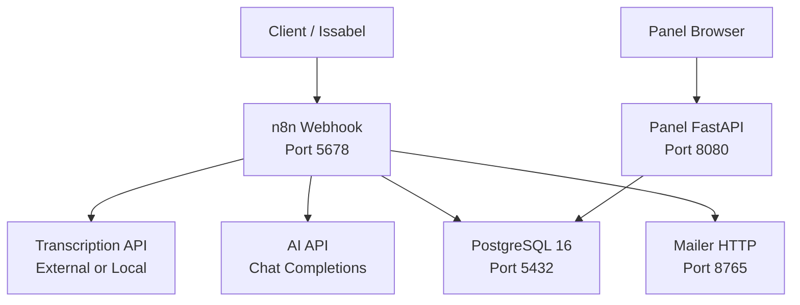
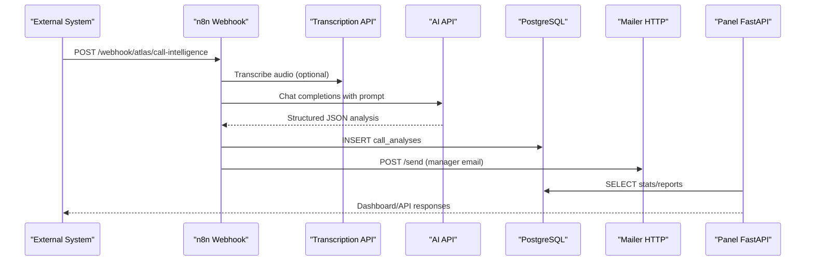
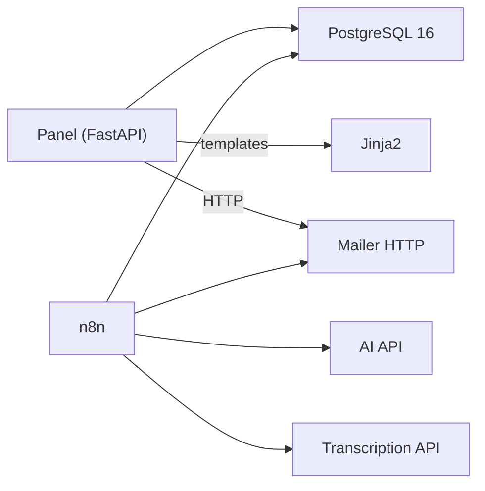

# Technology Stack

<cite>
**Referenced Files in This Document**
- [docker-compose.yml](file://docker/docker-compose.yml)
- [Dockerfile](file://docker/panel/Dockerfile)
- [requirements.txt](file://docker/panel/requirements.txt)
- [main.py](file://docker/panel/app/main.py)
- [config.py](file://docker/panel/app/config.py)
- [db.py](file://docker/panel/app/db.py)
- [queries.py](file://docker/panel/app/queries.py)
- [001_call_intelligence.sql](file://docker/postgres/init/001_call_intelligence.sql)
- [atlas-call-intelligence-v1.json](file://docker/n8n/workflows/atlas-call-intelligence-v1.json)
- [mailer.py](file://docker/mailer/mailer.py)
</cite>

## Table of Contents
1. Introduction
2. Project Structure
3. Core Components
4. Architecture Overview
5. Detailed Component Analysis
6. Dependency Analysis
7. Performance Considerations
8. Troubleshooting Guide
9. Conclusion

## Introduction
This document describes the technology stack powering the Atlas platform, focusing on Python 3.12 with FastAPI for the web panel, PostgreSQL 16 for data persistence, n8n for workflow automation, and Docker for containerization. It explains rationale, version compatibility, deployment considerations, external integrations (AI APIs, SMTP), security posture, performance characteristics, and scaling capabilities.

## Project Structure
Atlas is composed of four primary services orchestrated via Docker Compose:
- PostgreSQL 16: persistent relational store for call analyses and monthly reports
- n8n: workflow engine that orchestrates transcription, AI analysis, database writes, and email notifications
- Panel (FastAPI + Uvicorn): management dashboard serving HTML templates and API endpoints backed by PostgreSQL
- Mailer (Python HTTP server): lightweight SMTP client exposed as an internal HTTP service

**Diagram sources**
- [docker-compose.yml:3-98](file://docker/docker-compose.yml#L3-L98)
- [atlas-call-intelligence-v1.json:10-155](file://docker/n8n/workflows/atlas-call-intelligence-v1.json#L10-L155)
- [main.py:71-189](file://docker/panel/app/main.py#L71-L189)

**Section sources**
- [docker-compose.yml:3-98](file://docker/docker-compose.yml#L3-L98)

## Core Components
- Python 3.12 + FastAPI + Uvicorn: The Panel uses a modern async web framework with synchronous psycopg2 for direct SQL access and Jinja2 for templating.
- PostgreSQL 16: Stores per-call AI analysis and monthly aggregated reports; schema includes JSONB fields for flexible analytics and indexes for common queries.
- n8n: Workflow automation for ingestion, enrichment, AI calls, persistence, and notifications.
- Docker: Containerized services with environment-driven configuration and health checks.

Key Python dependencies (Panel):
- FastAPI, Uvicorn, Jinja2, psycopg2-binary, python-multipart, httpx

Rationale:
- FastAPI provides high-performance routing and easy integration with async workflows while supporting synchronous DB drivers where needed.
- PostgreSQL’s JSONB enables evolving AI outputs without rigid migrations.
- n8n offers visual orchestration and robust integrations for webhooks, HTTP requests, and databases.
- Docker ensures consistent environments and simplified deployment.

**Section sources**
- [requirements.txt:1-7](file://docker/panel/requirements.txt#L1-L7)
- [001_call_intelligence.sql:4-45](file://docker/postgres/init/001_call_intelligence.sql#L4-L45)
- [docker-compose.yml:26-57](file://docker/docker-compose.yml#L26-L57)

## Architecture Overview
The end-to-end flow:
- Ingestion: External systems send audio URLs or transcripts to the n8n webhook.
- Processing: n8n normalizes input, builds prompts, calls AI APIs, parses results, and persists to PostgreSQL.
- Notification: n8n optionally sends manager emails via the internal mailer service.
- Visualization: The Panel serves dashboards and APIs reading from PostgreSQL.

**Diagram sources**
- [atlas-call-intelligence-v1.json:10-155](file://docker/n8n/workflows/atlas-call-intelligence-v1.json#L10-L155)
- [main.py:71-189](file://docker/panel/app/main.py#L71-L189)
- [docker-compose.yml:3-98](file://docker/docker-compose.yml#L3-L98)

## Detailed Component Analysis

### PostgreSQL 16
- Role: Persistent storage for call analyses and monthly reports.
- Schema highlights:
  - call_analyses: stores metadata, transcript text, JSONB analysis, scores, and flags.
  - monthly_reports: aggregates monthly metrics per department.
- Indexes: Optimized for time-based and agent/department queries.
- Initialization: SQL scripts under docker-entrypoint-initdb.d ensure schema availability.

Operational notes:
- Health check configured in compose.
- Data persisted via volume mount.

**Section sources**
- [001_call_intelligence.sql:4-45](file://docker/postgres/init/001_call_intelligence.sql#L4-L45)
- [docker-compose.yml:3-24](file://docker/docker-compose.yml#L3-L24)

### n8n Workflow Automation
- Webhook endpoint receives call intelligence payloads.
- Parses and validates inputs, constructs prompts, and calls AI APIs.
- Persists structured analysis to PostgreSQL and triggers email notifications.
- Timezone set to Asia/Tehran; credentials stored in n8n UI.

Integration points:
- External AI API URL and key via environment variables.
- Optional transcription API URL.
- Manager email via internal mailer service.

**Section sources**
- [atlas-call-intelligence-v1.json:10-155](file://docker/n8n/workflows/atlas-call-intelligence-v1.json#L10-L155)
- [docker-compose.yml:26-57](file://docker/docker-compose.yml#L26-L57)

### Panel (FastAPI + Uvicorn)
- Serves HTML pages using Jinja2 templates and static assets.
- Provides dashboard routes and API endpoints for insights and statistics.
- Uses psycopg2 for direct SQL queries against PostgreSQL.
- Simple cookie-based authentication when PANEL_PASSWORD is set.

Environment configuration:
- Database connection parameters and optional AI model/key.
- Title and password configurable via environment.

**Section sources**
- [main.py:1-189](file://docker/panel/app/main.py#L1-L189)
- [config.py:1-14](file://docker/panel/app/config.py#L1-L14)
- [db.py:1-31](file://docker/panel/app/db.py#L1-L31)
- [queries.py:1-260](file://docker/panel/app/queries.py#L1-L260)

### Mailer Service
- Lightweight Python HTTP server exposing /send to accept JSON payloads.
- Sends emails via SMTP with TLS, configurable host/port/user/password.
- Defaults to Yahoo SMTP if not overridden; supports custom manager email.

Security note:
- Requires SMTP_PASS to be configured; otherwise returns error.

**Section sources**
- [mailer.py:1-77](file://docker/mailer/mailer.py#L1-L77)
- [docker-compose.yml:62-79](file://docker/docker-compose.yml#L62-L79)

### Containerization and Orchestration
- Services defined in docker-compose.yml:
  - postgres:16 with healthcheck and volumes
  - n8n with DB and AI env vars
  - mailer: Python 3.12-slim image
  - panel: built from Dockerfile, exposes port 8080
- Environment variables drive runtime configuration and secrets.

**Section sources**
- [docker-compose.yml:3-98](file://docker/docker-compose.yml#L3-L98)
- [Dockerfile:1-11](file://docker/panel/Dockerfile#L1-L11)

## Dependency Analysis
Runtime dependencies and relationships:
- Panel depends on PostgreSQL via psycopg2 and renders Jinja2 templates.
- n8n depends on PostgreSQL, external AI API, optional transcription API, and mailer.
- Mailer depends on SMTP servers.
- All services are containerized and communicate over Docker network.

**Diagram sources**
- [requirements.txt:1-7](file://docker/panel/requirements.txt#L1-L7)
- [docker-compose.yml:3-98](file://docker/docker-compose.yml#L3-L98)
- [atlas-call-intelligence-v1.json:10-155](file://docker/n8n/workflows/atlas-call-intelligence-v1.json#L10-L155)

**Section sources**
- [requirements.txt:1-7](file://docker/panel/requirements.txt#L1-L7)
- [docker-compose.yml:3-98](file://docker/docker-compose.yml#L3-L98)

## Performance Considerations
- PostgreSQL:
  - Use appropriate indexes (already provided) for frequent filters on analyzed_at, agent_id, department, call_date.
  - Monitor query plans for heavy aggregations; consider materialized views for monthly reports if needed.
- Panel:
  - Queries return summarized datasets; keep limits reasonable to avoid large payloads.
  - Disable template caching only during development; enable in production for performance.
- n8n:
  - Tune concurrency and execution order; use continueOnFail for non-critical steps like email.
  - Batch operations where possible; avoid excessive logging in hot paths.
- Mailer:
  - SMTP timeouts and retries should be tuned; consider queuing for high-volume scenarios.
- General:
  - Ensure adequate CPU/memory for concurrent AI calls and DB connections.
  - Use connection pooling at scale (e.g., PgBouncer) if needed.

[No sources needed since this section provides general guidance]

## Troubleshooting Guide
Common issues and resolutions:
- Panel cannot connect to PostgreSQL:
  - Verify DB_HOST, DB_PORT, DB_NAME, DB_USER, DB_PASSWORD environment variables.
  - Confirm PostgreSQL service is healthy and reachable within the Docker network.
- n8n fails to save to DB:
  - Check n8n Postgres credentials and connectivity; ensure schema exists.
  - Validate query replacement values and types (JSONB casting).
- Email not sent:
  - Ensure SMTP_PASS is configured; verify SMTP_HOST, SMTP_PORT, SMTP_USER.
  - Check mailer service logs for exceptions and response codes.
- AI API errors:
  - Validate AI_API_URL, AI_API_KEY, and AI_MODEL environment variables.
  - Inspect n8n node logs for HTTP status and response bodies.

**Section sources**
- [config.py:1-14](file://docker/panel/app/config.py#L1-L14)
- [db.py:8-18](file://docker/panel/app/db.py#L8-L18)
- [atlas-call-intelligence-v1.json:73-119](file://docker/n8n/workflows/atlas-call-intelligence-v1.json#L73-L119)
- [mailer.py:18-33](file://docker/mailer/mailer.py#L18-L33)

## Conclusion
Atlas leverages a pragmatic, composable stack:
- FastAPI delivers a responsive management interface with minimal overhead.
- PostgreSQL provides robust, flexible storage with JSONB for evolving AI outputs.
- n8n orchestrates complex workflows across external services with clear visibility.
- Docker standardizes deployment and simplifies operations.

For production, prioritize secure secret management, resource sizing based on expected load, monitoring of AI API latency and error rates, and periodic review of database indexes and query performance.

[No sources needed since this section summarizes without analyzing specific files]