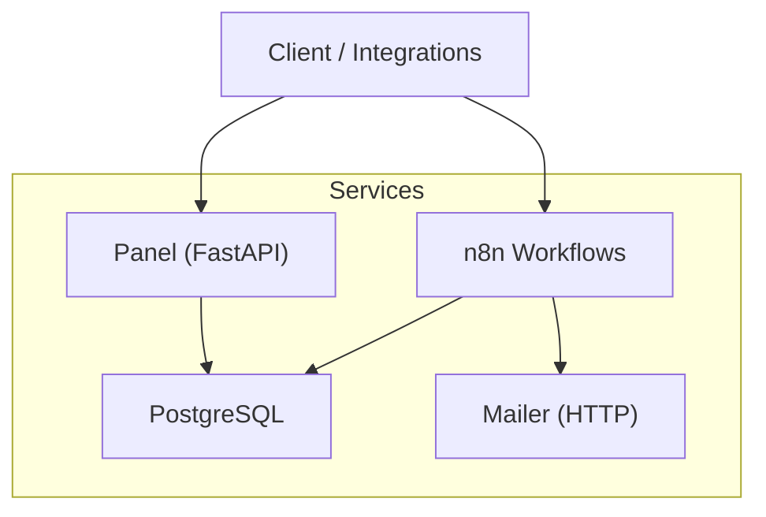
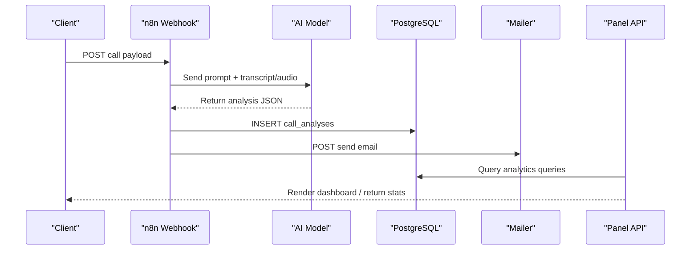
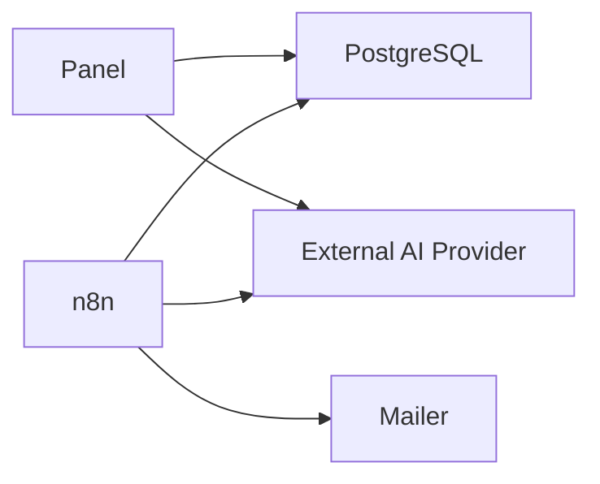
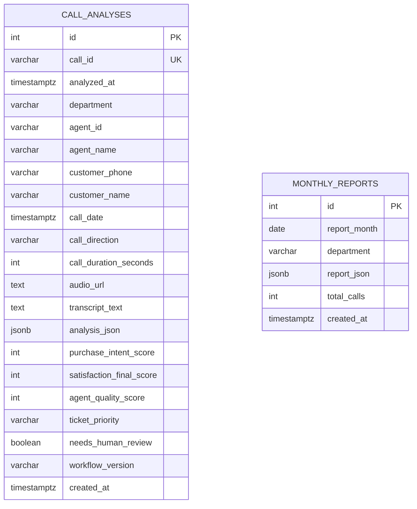

# Core Components

<cite>
**Referenced Files in This Document**
- [docker/panel/app/main.py](file://docker/panel/app/main.py)
- [docker/panel/app/config.py](file://docker/panel/app/config.py)
- [docker/panel/app/db.py](file://docker/panel/app/db.py)
- [docker/panel/app/queries.py](file://docker/panel/app/queries.py)
- [docker/panel/app/ai.py](file://docker/panel/app/ai.py)
- [docker/postgres/init/001_call_intelligence.sql](file://docker/postgres/init/001_call_intelligence.sql)
- [docker/postgres/init/002_panel_seed.sql](file://docker/postgres/init/002_panel_seed.sql)
- [docker/n8n/workflows/atlas-call-intelligence-v1.json](file://docker/n8n/workflows/atlas-call-intelligence-v1.json)
- [docker/n8n/workflows/atlas-call-intelligence-monthly-report.json](file://docker/n8n/workflows/atlas-call-intelligence-monthly-report.json)
- [docker/n8n/credentials/postgres.json](file://docker/n8n/credentials/postgres.json)
- [docker/mailer/mailer.py](file://docker/mailer/mailer.py)
- [docker/docker-compose.yml](file://docker/docker-compose.yml)
- [03_Products/Atlas Call Intelligence/V1/schema.json](file://03_Products/Atlas Call Intelligence/V1/schema.json)
</cite>

## Table of Contents
1. [Introduction](#introduction)
2. [Project Structure](#project-structure)
3. [Core Components](#core-components)
4. [Architecture Overview](#architecture-overview)
5. [Detailed Component Analysis](#detailed-component-analysis)
6. [Dependency Analysis](#dependency-analysis)
7. [Performance Considerations](#performance-considerations)
8. [Troubleshooting Guide](#troubleshooting-guide)
9. [Conclusion](#conclusion)
10. [Appendices](#appendices)

## Introduction
This document explains the core components of the Atlas platform: the FastAPI panel application, the n8n workflow engine for call intelligence and reporting, the PostgreSQL database schema for storing call analytics and monthly reports, and the mailer service that sends manager notifications. It provides conceptual overviews for beginners and technical details (APIs, schemas, integration points) for experienced developers. Terminology such as call intelligence, workflow nodes, and analytics queries is used consistently with the codebase.

## Project Structure
The platform runs as a set of Docker services orchestrated by docker-compose:
- Panel: FastAPI web app serving dashboards and APIs
- n8n: Workflow engine orchestrating call analysis and monthly reporting
- PostgreSQL: Database storing call analyses and monthly reports
- Mailer: Lightweight HTTP service sending emails via SMTP

**Diagram sources**
- [docker/docker-compose.yml:3-98](file://docker/docker-compose.yml#L3-L98)

**Section sources**
- [docker/docker-compose.yml:1-98](file://docker/docker-compose.yml#L1-L98)

## Core Components
- FastAPI Panel Application: Serves dashboards and APIs to visualize call intelligence results and generate executive insights.
- n8n Workflow Engine: Processes incoming calls, performs AI-driven analysis, persists results, and triggers notifications.
- PostgreSQL Schema: Stores per-call analysis and monthly aggregated reports with optimized indexes.
- Mailer Service: Accepts JSON payloads and sends email notifications via SMTP.

**Section sources**
- [docker/panel/app/main.py:16-187](file://docker/panel/app/main.py#L16-L187)
- [docker/n8n/workflows/atlas-call-intelligence-v1.json:1-160](file://docker/n8n/workflows/atlas-call-intelligence-v1.json#L1-L160)
- [docker/postgres/init/001_call_intelligence.sql:1-45](file://docker/postgres/init/001_call_intelligence.sql#L1-L45)
- [docker/mailer/mailer.py:1-77](file://docker/mailer/mailer.py#L1-L77)

## Architecture Overview
End-to-end flow:
- Inbound call data arrives at n8n webhook, is parsed, enriched, and sent to an AI model for call intelligence analysis.
- The resulting analysis is stored in PostgreSQL and optionally emailed to the manager via the mailer service.
- The FastAPI panel reads from PostgreSQL to render dashboards and exposes APIs for stats and AI insights.

**Diagram sources**
- [docker/n8n/workflows/atlas-call-intelligence-v1.json:10-154](file://docker/n8n/workflows/atlas-call-intelligence-v1.json#L10-L154)
- [docker/panel/app/main.py:68-187](file://docker/panel/app/main.py#L68-L187)
- [docker/postgres/init/001_call_intelligence.sql:4-45](file://docker/postgres/init/001_call_intelligence.sql#L4-L45)
- [docker/mailer/mailer.py:36-68](file://docker/mailer/mailer.py#L36-L68)

## Detailed Component Analysis

### FastAPI Panel Application
Purpose:
- Provides a secure web interface to view call intelligence metrics, top performers, ready-to-buy leads, unhappy customers, staff performance, satisfaction, successful sales, monthly reports, and AI-generated executive insights.
- Exposes lightweight APIs for stats and AI insights.

Key implementation details:
- Authentication: Optional password-based login using a cookie; middleware enforces access unless disabled.
- Templates and static assets are mounted and rendered via Jinja2.
- Queries module encapsulates all analytics queries against PostgreSQL.
- AI insights endpoint builds a context payload from multiple analytics queries and calls an external Gemini API to generate Persian executive insights.

Configuration options:
- Database connection parameters loaded from environment variables.
- AI model and API key configured via environment variables.
- Panel title and optional password controlled via environment variables.

Usage patterns:
- Dashboard endpoints render HTML pages with query results.
- API endpoints return JSON for programmatic consumption.
- AI insights page loads asynchronously and fetches generated text via API.

Common integrations:
- Reads from call_analyses and monthly_reports tables.
- Calls external AI provider for executive insights.

Security notes:
- Simple auth can be enabled by setting PANEL_PASSWORD.
- Static assets are accessible without authentication.

**Section sources**
- [docker/panel/app/main.py:16-187](file://docker/panel/app/main.py#L16-L187)
- [docker/panel/app/config.py:1-14](file://docker/panel/app/config.py#L1-L14)
- [docker/panel/app/queries.py:6-260](file://docker/panel/app/queries.py#L6-L260)
- [docker/panel/app/ai.py:7-37](file://docker/panel/app/ai.py#L7-L37)

### n8n Workflow Engine
Purpose:
- Orchestrates call intelligence processing through workflow nodes: webhook ingestion, input parsing, prompt preparation, AI request, result validation, persistence, email notification, and response building.
- Generates monthly reports by aggregating call data, producing AI summaries, and saving structured reports.

Key workflow nodes:
- Webhook: Receives call payloads and manual report triggers.
- Code nodes: Parse inputs, prepare prompts, validate and enrich outputs, build responses.
- HTTP Request node: Invokes AI models for analysis or summary generation.
- Postgres node: Persists call analyses and monthly reports.
- Respond node: Returns standardized responses to clients.

Integration points:
- PostgreSQL credentials configured via n8n credentials file.
- Environment variables control AI model, API URL, and manager email.
- Mailer service invoked to send manager notifications.

Operational modes:
- Real-time call analysis triggered by webhook.
- Scheduled or manual monthly report generation via cron or webhook.

**Section sources**
- [docker/n8n/workflows/atlas-call-intelligence-v1.json:1-160](file://docker/n8n/workflows/atlas-call-intelligence-v1.json#L1-L160)
- [docker/n8n/workflows/atlas-call-intelligence-monthly-report.json:1-172](file://docker/n8n/workflows/atlas-call-intelligence-monthly-report.json#L1-L172)
- [docker/n8n/credentials/postgres.json:1-15](file://docker/n8n/credentials/postgres.json#L1-L15)
- [docker/docker-compose.yml:26-61](file://docker/docker-compose.yml#L26-L61)

### PostgreSQL Database Schema
Purpose:
- Stores per-call AI analysis and metadata for call intelligence.
- Stores monthly aggregated reports for historical tracking and retrieval.

Schema highlights:
- call_analyses table includes fields for call identity, department, agent info, customer info, duration, audio/transcript references, full analysis JSON, scores (purchase intent, satisfaction, agent quality), ticket priority, human review flag, and timestamps.
- monthly_reports table stores report month, department filter, report JSON, total calls, and creation timestamp.
- Indexes optimize queries on analyzed_at, agent_id, department, call_date, and report_month.

Data integrity:
- Unique constraint on call_id prevents duplicates.
- Unique constraint on report_month and department ensures one report per period and department.

Seed data:
- Sample records provided for demo purposes to populate dashboards quickly.

**Section sources**
- [docker/postgres/init/001_call_intelligence.sql:1-45](file://docker/postgres/init/001_call_intelligence.sql#L1-L45)
- [docker/postgres/init/002_panel_seed.sql:1-46](file://docker/postgres/init/002_panel_seed.sql#L1-L46)

### Mailer Service
Purpose:
- Accepts JSON payloads to send email notifications via SMTP.
- Used by n8n workflows to notify managers about call tickets and monthly reports.

Implementation details:
- HTTP server listens on a configurable port and handles POST requests to send emails.
- Supports dynamic recipient, subject, and body; defaults to configured manager email if not provided.
- Uses TLS and SMTP credentials from environment variables.

Error handling:
- Validates JSON input and returns appropriate status codes.
- Wraps SMTP operations in try/catch and returns error messages when failures occur.

Configuration options:
- SMTP host, port, user, and pass via environment variables.
- Manager email default via ATLAS_MANAGER_EMAIL.
- Port exposed via MAILER_PORT.

**Section sources**
- [docker/mailer/mailer.py:1-77](file://docker/mailer/mailer.py#L1-L77)
- [docker/docker-compose.yml:62-79](file://docker/docker-compose.yml#L62-L79)

## Dependency Analysis
Service dependencies and interactions:
- Panel depends on PostgreSQL for analytics queries and optional AI provider for insights.
- n8n depends on PostgreSQL for persistence and optional AI provider for analysis/reporting.
- n8n depends on mailer for email notifications.
- All services are containerized and coordinated via docker-compose.

**Diagram sources**
- [docker/docker-compose.yml:3-98](file://docker/docker-compose.yml#L3-L98)
- [docker/panel/app/ai.py:27-37](file://docker/panel/app/ai.py#L27-L37)
- [docker/n8n/workflows/atlas-call-intelligence-v1.json:48-119](file://docker/n8n/workflows/atlas-call-intelligence-v1.json#L48-L119)

**Section sources**
- [docker/docker-compose.yml:1-98](file://docker/docker-compose.yml#L1-L98)

## Performance Considerations
- Database indexing: Ensure frequent filters use indexed columns (analyzed_at, agent_id, department, call_date, report_month).
- Query efficiency: Use parameterized queries and avoid selecting unnecessary columns.
- Connection management: Reuse connections where possible; current implementation uses context managers to open/close connections per query.
- External API timeouts: Configure reasonable timeouts for AI model calls to prevent blocking requests.
- Email reliability: Implement retries or dead-letter queues for failed email sends in production environments.

[No sources needed since this section provides general guidance]

## Troubleshooting Guide
Common issues and resolutions:
- Panel authentication: If PANEL_PASSWORD is empty, login is bypassed; otherwise ensure correct password and cookie settings.
- Database connectivity: Verify DB_HOST, DB_PORT, DB_NAME, DB_USER, DB_PASSWORD environment variables match the running PostgreSQL instance.
- AI insights missing: Ensure AI_API_KEY and AI_MODEL are set; check network access to the AI provider endpoint.
- n8n workflow errors: Validate webhook payload structure; confirm AI model response parsing; check Postgres credentials and permissions.
- Mailer failures: Confirm SMTP_PASS is configured; verify SMTP_HOST and SMTP_PORT; ensure ATLAS_MANAGER_EMAIL is set if required.

**Section sources**
- [docker/panel/app/main.py:40-65](file://docker/panel/app/main.py#L40-L65)
- [docker/panel/app/config.py:1-14](file://docker/panel/app/config.py#L1-L14)
- [docker/panel/app/ai.py:7-37](file://docker/panel/app/ai.py#L7-L37)
- [docker/n8n/workflows/atlas-call-intelligence-v1.json:10-154](file://docker/n8n/workflows/atlas-call-intelligence-v1.json#L10-L154)
- [docker/mailer/mailer.py:18-68](file://docker/mailer/mailer.py#L18-L68)

## Conclusion
The Atlas platform integrates a FastAPI panel, n8n workflows, PostgreSQL, and a mailer service to deliver comprehensive call intelligence capabilities. The panel visualizes analytics and generates executive insights; n8n automates analysis and reporting; PostgreSQL stores structured call data and reports; and the mailer keeps stakeholders informed. Together, these components provide a scalable foundation for monitoring call performance, identifying opportunities, and driving operational improvements.

[No sources needed since this section summarizes without analyzing specific files]

## Appendices

### Data Models Diagram

**Diagram sources**
- [docker/postgres/init/001_call_intelligence.sql:4-45](file://docker/postgres/init/001_call_intelligence.sql#L4-L45)

### Call Intelligence Output Schema
The standard output schema defines the structure of AI-generated call analysis, including metadata, transcript, customer insights, agent performance, sales/support analysis, ticket details, insights, and quality control flags.

**Section sources**
- [03_Products/Atlas Call Intelligence/V1/schema.json:1-153](file://03_Products/Atlas Call Intelligence/V1/schema.json#L1-L153)