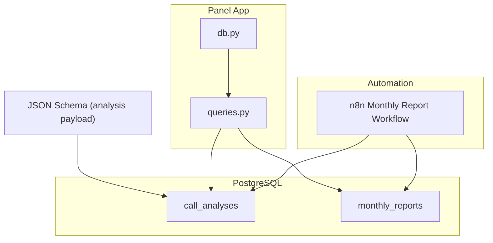
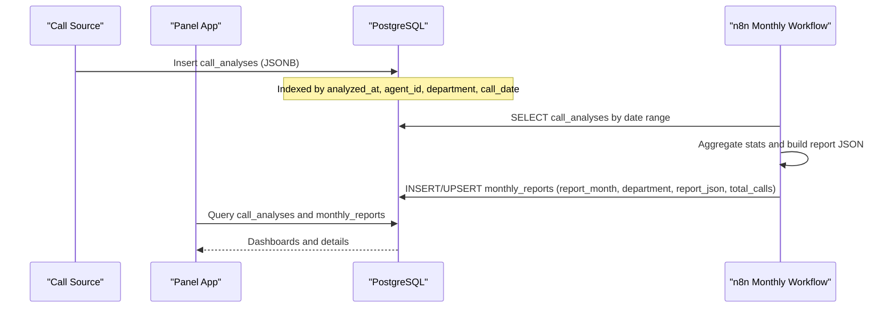
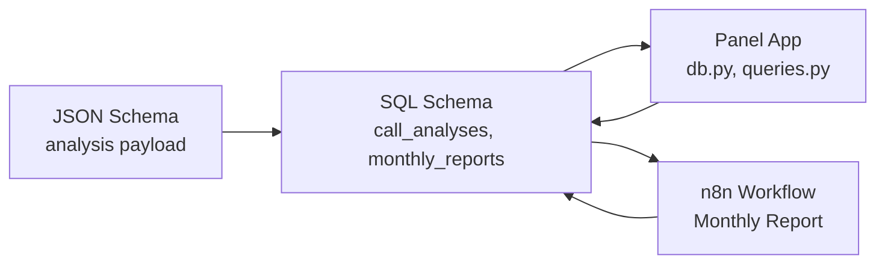

# Database Schema

<cite>
**Referenced Files in This Document**
- [001_call_intelligence.sql](file://docker/postgres/init/001_call_intelligence.sql)
- [002_panel_seed.sql](file://docker/postgres/init/002_panel_seed.sql)
- [schema.json](file://03_Products/Atlas Call Intelligence/V1/schema.json)
- [queries.py](file://docker/panel/app/queries.py)
- [db.py](file://docker/panel/app/db.py)
- [config.py](file://docker/panel/app/config.py)
- [atlas-call-intelligence-monthly-report.json](file://docker/n8n/workflows/atlas-call-intelligence-monthly-report.json)
</cite>

## Table of Contents
1. [Introduction](#introduction)
2. [Project Structure](#project-structure)
3. [Core Components](#core-components)
4. [Architecture Overview](#architecture-overview)
5. [Detailed Component Analysis](#detailed-component-analysis)
6. [Dependency Analysis](#dependency-analysis)
7. [Performance Considerations](#performance-considerations)
8. [Troubleshooting Guide](#troubleshooting-guide)
9. [Conclusion](#conclusion)
10. [Appendices](#appendices)

## Introduction
This document explains the PostgreSQL database design for Atlas Call Intelligence, focusing on the call_analyses and monthly_reports tables, their relationships, constraints, and JSONB fields. It provides both conceptual guidance for beginners and technical details for experienced developers, including indexes, query patterns, and performance considerations. The schema supports per-call AI analysis storage and monthly aggregated reporting with robust querying via a Python panel application and n8n workflows.

## Project Structure
The database schema is defined in SQL initialization scripts and used by:
- Panel application (Python) to read and display insights
- n8n workflow to generate and persist monthly reports
- JSON Schema to validate the structure of analysis payloads stored in JSONB fields

**Diagram sources**
- [001_call_intelligence.sql:4-45](file://docker/postgres/init/001_call_intelligence.sql#L4-L45)
- [queries.py:6-260](file://docker/panel/app/queries.py#L6-L260)
- [db.py:1-31](file://docker/panel/app/db.py#L1-L31)
- [atlas-call-intelligence-monthly-report.json:50-120](file://docker/n8n/workflows/atlas-call-intelligence-monthly-report.json#L50-L120)
- [schema.json:1-153](file://03_Products/Atlas Call Intelligence/V1/schema.json#L1-L153)

**Section sources**
- [001_call_intelligence.sql:1-45](file://docker/postgres/init/001_call_intelligence.sql#L1-L45)
- [queries.py:1-260](file://docker/panel/app/queries.py#L1-L260)
- [db.py:1-31](file://docker/panel/app/db.py#L1-L31)
- [atlas-call-intelligence-monthly-report.json:1-172](file://docker/n8n/workflows/atlas-call-intelligence-monthly-report.json#L1-L172)
- [schema.json:1-153](file://03_Products/Atlas Call Intelligence/V1/schema.json#L1-L153)

## Core Components
- call_analyses: Stores per-call AI analysis results and key metrics. Includes JSONB field analysis_json for flexible, structured analysis data.
- monthly_reports: Stores monthly aggregated reports with report_json as a JSONB payload and total_calls count.

Key characteristics:
- Primary keys and unique constraints ensure identity and uniqueness.
- Indexes optimize frequent queries by time, agent, department, and month.
- JSONB fields enable rich, evolving analysis structures without schema migrations.

**Section sources**
- [001_call_intelligence.sql:4-45](file://docker/postgres/init/001_call_intelligence.sql#L4-L45)

## Architecture Overview
The system captures call analyses into call_analyses, then aggregates them into monthly_reports via an n8n workflow. The panel app reads from both tables to provide dashboards and drill-down views.

**Diagram sources**
- [001_call_intelligence.sql:4-45](file://docker/postgres/init/001_call_intelligence.sql#L4-L45)
- [atlas-call-intelligence-monthly-report.json:50-120](file://docker/n8n/workflows/atlas-call-intelligence-monthly-report.json#L50-L120)
- [queries.py:6-260](file://docker/panel/app/queries.py#L6-L260)

## Detailed Component Analysis

### call_analyses table
Purpose:
- Store each call’s metadata, transcript, and AI-generated analysis.
- Provide fast access for dashboards, filtering by department, agent, and time windows.

Structure highlights:
- Primary key: id (SERIAL)
- Unique constraint: call_id ensures one record per call
- Timestamps: analyzed_at, created_at (TIMESTAMPTZ)
- Dimensions: department, agent_id, agent_name, customer_phone, customer_name, call_direction, call_date
- Metrics: purchase_intent_score, satisfaction_final_score, agent_quality_score, ticket_priority, needs_human_review
- Payloads: audio_url, transcript_text, analysis_json (JSONB)

Indexes:
- idx_call_analyses_analyzed_at
- idx_call_analyses_agent_id
- idx_call_analyses_department
- idx_call_analyses_call_date

Constraints:
- NOT NULL on critical fields
- UNIQUE(call_id) prevents duplicates

Data model alignment:
- analysis_json follows the Atlas Call Intelligence Output JSON Schema, enabling consistent nested structures for meta, input, transcript, customer, agent_performance, sales_analysis, support_analysis, ticket, insights, quality_control.

Common usage patterns:
- Filtering by department and date ranges
- Aggregating scores and counts for KPIs
- Extracting nested JSONB values for next steps, risks, and recommendations

Practical examples (conceptual):
- Recent calls ordered by call_date or analyzed_at
- Top performers by average agent_quality_score and satisfaction
- Ready-to-buy leads where purchase_intent_score meets threshold
- Unhappy customers where satisfaction_final_score is low or needs_human_review is true

**Section sources**
- [001_call_intelligence.sql:4-33](file://docker/postgres/init/001_call_intelligence.sql#L4-L33)
- [schema.json:1-153](file://03_Products/Atlas Call Intelligence/V1/schema.json#L1-L153)
- [queries.py:6-192](file://docker/panel/app/queries.py#L6-L192)

### monthly_reports table
Purpose:
- Persist monthly aggregated reports for historical tracking and retrieval.

Structure highlights:
- Primary key: id (SERIAL)
- report_month (DATE), department (VARCHAR), report_json (JSONB), total_calls (INTEGER)
- Unique constraint: (report_month, department) enables upsert behavior
- created_at timestamp

Indexes:
- idx_monthly_reports_month optimizes queries by month

Usage patterns:
- List recent monthly reports
- Retrieve full report detail by id
- Upsert new reports per month and department

Practical examples (conceptual):
- Fetch last N monthly reports
- Load full report JSON for a given report id

**Section sources**
- [001_call_intelligence.sql:34-45](file://docker/postgres/init/001_call_intelligence.sql#L34-L45)
- [queries.py:195-211](file://docker/panel/app/queries.py#L195-L211)
- [atlas-call-intelligence-monthly-report.json:100-120](file://docker/n8n/workflows/atlas-call-intelligence-monthly-report.json#L100-L120)

### Seed data configuration
Seed script inserts sample call_analyses records demonstrating various departments, agents, and scenarios. It uses ON CONFLICT (call_id) DO NOTHING to avoid duplicates when re-running.

Highlights:
- Demonstrates realistic JSONB payloads with sales and support analysis sections
- Shows varied ticket priorities and human review flags
- Provides baseline data for dashboard visualization

Practical notes:
- Use provided command to load seed data into the Postgres container
- Re-execution is safe due to conflict handling

**Section sources**
- [002_panel_seed.sql:1-46](file://docker/postgres/init/002_panel_seed.sql#L1-L46)

### JSONB fields and schema validation
The analysis_json column stores complex, nested analysis objects. The JSON Schema defines required and optional properties across multiple sections, ensuring consistency and enabling reliable extraction of fields like recommended_next_step, estimated_close_probability_percent, and customer_retention_risk.

Benefits:
- Flexible evolution of analysis outputs without altering relational schema
- Strong typing hints for consumers of the data
- Consistent structure across different call types (sales vs support)

Extraction patterns:
- Use JSONB operators to pull nested values in queries (e.g., analysis_json->'sales_analysis'->>'recommended_next_step')
- Combine numeric thresholds from both flat columns and JSONB fields for robust filtering

**Section sources**
- [schema.json:1-153](file://03_Products/Atlas Call Intelligence/V1/schema.json#L1-L153)
- [queries.py:52-76](file://docker/panel/app/queries.py#L52-L76)
- [queries.py:79-106](file://docker/panel/app/queries.py#L79-L106)

### Panel application integration
The panel app connects to PostgreSQL using psycopg2 and provides helper functions to fetch rows as dictionaries. Queries are centralized in queries.py to implement dashboard logic.

Key behaviors:
- Connection management via context manager ensures proper resource cleanup
- RealDictCursor returns rows as dicts for easy consumption
- Parameterized queries prevent injection and improve readability

Examples:
- overview_stats computes totals and averages across call_analyses
- top_performers groups by agent and ranks by success score
- ready_to_buy filters high intent leads and extracts next steps from JSONB
- unhappy_customers identifies at-risk cases based on satisfaction and flags

**Section sources**
- [db.py:1-31](file://docker/panel/app/db.py#L1-L31)
- [queries.py:6-260](file://docker/panel/app/queries.py#L6-L260)
- [config.py:1-14](file://docker/panel/app/config.py#L1-L14)

### Monthly report workflow
The n8n workflow triggers on schedule or webhook, calculates the reporting period, fetches call_analyses within that window, aggregates statistics, generates an AI executive summary, and persists the final report into monthly_reports.

Flow:
- Compute period_start and period_end
- Query call_analyses by date range
- Aggregate department and agent metrics
- Build report JSON and insert/upsert into monthly_reports with unique key (report_month, department)

Operational notes:
- Uses parameterized queries for safety and performance
- Upsert pattern avoids duplicate reports per month and department

**Section sources**
- [atlas-call-intelligence-monthly-report.json:1-172](file://docker/n8n/workflows/atlas-call-intelligence-monthly-report.json#L1-L172)

## Dependency Analysis
The following diagram shows how components depend on the database schema and each other:

**Diagram sources**
- [001_call_intelligence.sql:4-45](file://docker/postgres/init/001_call_intelligence.sql#L4-L45)
- [db.py:1-31](file://docker/panel/app/db.py#L1-L31)
- [queries.py:6-260](file://docker/panel/app/queries.py#L6-L260)
- [atlas-call-intelligence-monthly-report.json:50-120](file://docker/n8n/workflows/atlas-call-intelligence-monthly-report.json#L50-L120)
- [schema.json:1-153](file://03_Products/Atlas Call Intelligence/V1/schema.json#L1-L153)

**Section sources**
- [001_call_intelligence.sql:4-45](file://docker/postgres/init/001_call_intelligence.sql#L4-L45)
- [queries.py:6-260](file://docker/panel/app/queries.py#L6-L260)
- [atlas-call-intelligence-monthly-report.json:50-120](file://docker/n8n/workflows/atlas-call-intelligence-monthly-report.json#L50-L120)
- [schema.json:1-153](file://03_Products/Atlas Call Intelligence/V1/schema.json#L1-L153)

## Performance Considerations
- Index utilization:
  - Filter by analyzed_at or call_date leverages idx_call_analyses_analyzed_at and idx_call_analyses_call_date
  - Agent-level analytics benefit from idx_call_analyses_agent_id
  - Department filters use idx_call_analyses_department
  - Monthly report listing uses idx_monthly_reports_month
- Query optimization tips:
  - Prefer parameterized queries to reduce parsing overhead
  - Limit result sets with LIMIT for dashboards
  - Use JSONB operators efficiently; avoid unnecessary casts
- Upsert strategy:
  - monthly_reports uses unique (report_month, department) to safely update existing reports
- Data volume growth:
  - Monitor index bloat and consider periodic maintenance
  - Archive older call_analyses if needed while keeping monthly_reports for long-term trends

[No sources needed since this section provides general guidance]

## Troubleshooting Guide
Common issues and resolutions:
- Duplicate call_id errors:
  - Ensure upstream systems generate unique call_id values
  - Seed script uses ON CONFLICT to avoid duplicates during re-runs
- Missing JSONB fields:
  - Validate payloads against the JSON Schema before insertion
  - Use defensive queries that handle nulls and missing keys
- Slow queries:
  - Verify indexes exist and are used (check execution plans)
  - Add composite indexes if frequent multi-column filters emerge
- Connection failures:
  - Confirm environment variables in config.py match your Postgres setup
  - Ensure db.py connection parameters resolve correctly

**Section sources**
- [002_panel_seed.sql:44-46](file://docker/postgres/init/002_panel_seed.sql#L44-L46)
- [config.py:1-14](file://docker/panel/app/config.py#L1-L14)
- [db.py:8-18](file://docker/panel/app/db.py#L8-L18)

## Conclusion
The Atlas Call Intelligence database schema centers around two core tables—call_analyses and monthly_reports—designed for scalability, flexibility, and performance. JSONB fields capture rich analysis payloads aligned with a strict JSON Schema, while indexes and constraints support efficient querying and data integrity. The panel application and n8n workflow integrate seamlessly to power dashboards and automated monthly reporting.

[No sources needed since this section summarizes without analyzing specific files]

## Appendices

### Practical query patterns (conceptual)
- Recent calls:
  - Select recent entries ordered by call_date or analyzed_at
- Top performers:
  - Group by agent, compute averages of agent_quality_score and satisfaction_final_score, rank by combined success score
- Ready to buy:
  - Filter by purchase_intent_score or derived JSONB fields, extract next steps and probabilities
- Unhappy customers:
  - Filter by low satisfaction or human review flags, include retention risk from JSONB
- Monthly reports:
  - List recent reports and retrieve full JSON for a given id

[No sources needed since this section provides general guidance]