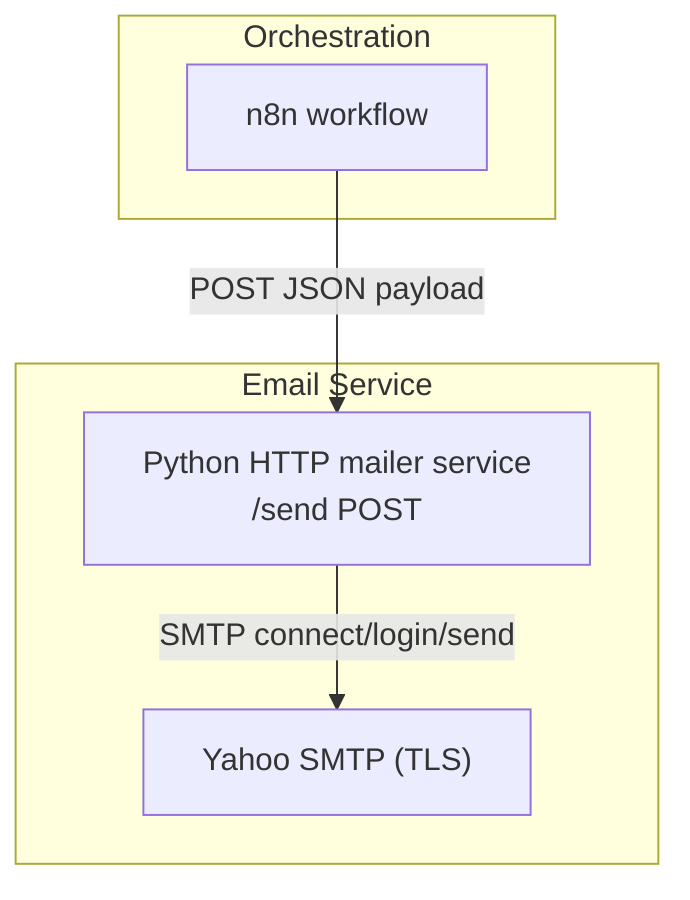
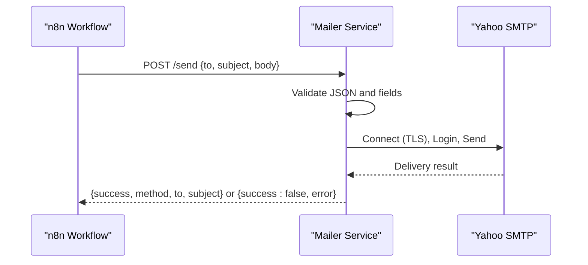
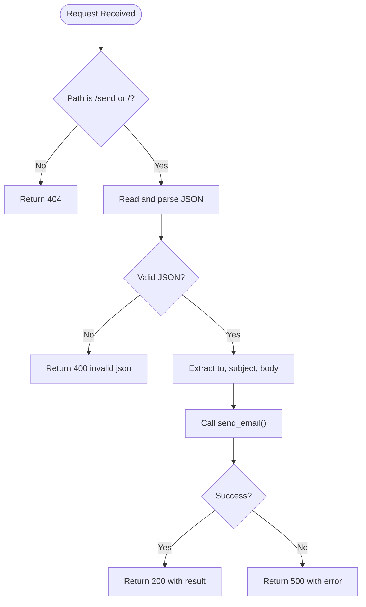
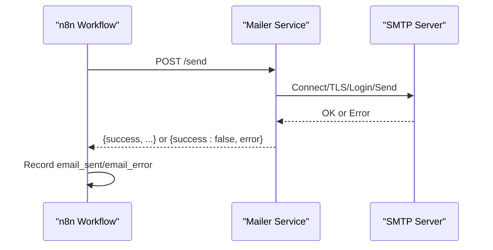
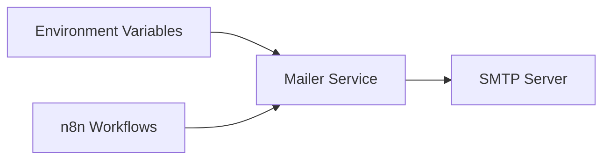

# Email Service

<cite>
**Referenced Files in This Document**
- [mailer.py](file://docker/mailer/mailer.py)
- [send_email.py](file://docker/mailer/send_email.py)
- [atlas-call-intelligence-v1.json](file://docker/n8n/workflows/atlas-call-intelligence-v1.json)
- [atlas-call-intelligence-monthly-report.json](file://docker/n8n/workflows/atlas-call-intelligence-monthly-report.json)
- [run-test.ps1](file://docker/scripts/run-test.ps1)
- [test-result.json](file://docker/scripts/test-result.json)
</cite>

## Table of Contents
1. Introduction
2. Project Structure
3. Core Components
4. Architecture Overview
5. Detailed Component Analysis
6. Dependency Analysis
7. Performance Considerations
8. Troubleshooting Guide
9. Conclusion

## Introduction
This document explains the Email Service component that provides SMTP-based email notifications for Atlas Call Intelligence. It covers the mailer service architecture, how email templates are constructed and sent, delivery mechanisms via Yahoo SMTP, HTTP endpoints used by workflows, error handling strategies, and practical examples for sending emails, customizing templates, and troubleshooting common delivery issues. The terminology aligns with the codebase: mailer service, SMTP configuration, and email templates.

## Project Structure
The email notification system spans three areas:
- Mailer service: a lightweight Python HTTP server exposing an endpoint to send emails via SMTP.
- Workflow orchestration: n8n workflows that build email templates and call the mailer service.
- Scripts and tests: utilities to test end-to-end flows and capture results.

**Diagram sources**
- [atlas-call-intelligence-v1.json:105-120](file://docker/n8n/workflows/atlas-call-intelligence-v1.json#L105-L120)
- [mailer.py:36-68](file://docker/mailer/mailer.py#L36-L68)
- [mailer.py:18-33](file://docker/mailer/mailer.py#L18-L33)

**Section sources**
- [mailer.py:1-76](file://docker/mailer/mailer.py#L1-L76)
- [atlas-call-intelligence-v1.json:60-160](file://docker/n8n/workflows/atlas-call-intelligence-v1.json#L60-L160)
- [atlas-call-intelligence-monthly-report.json:85-172](file://docker/n8n/workflows/atlas-call-intelligence-monthly-report.json#L85-L172)

## Core Components
- Mailer service: An HTTP server that accepts POST requests with JSON payloads containing recipient, subject, and body. It connects to the configured SMTP server using TLS, authenticates, and sends the message.
- SMTP configuration: Host, port, user, password, default recipient, and mailer port are loaded from environment variables.
- Email templates: Built within n8n workflows as plain text bodies composed from analysis results and metadata. These are passed to the mailer service via the HTTP endpoint.
- Orchestration integration: n8n workflows construct manager_notification objects (to, subject, body) and call the mailer service after saving analysis data.

Key responsibilities:
- Validate incoming request payloads and map fields to email headers/body.
- Enforce SMTP configuration requirements before attempting delivery.
- Provide consistent JSON responses indicating success or failure.

**Section sources**
- [mailer.py:10-15](file://docker/mailer/mailer.py#L10-L15)
- [mailer.py:18-33](file://docker/mailer/mailer.py#L18-L33)
- [mailer.py:36-68](file://docker/mailer/mailer.py#L36-L68)
- [atlas-call-intelligence-v1.json:60-120](file://docker/n8n/workflows/atlas-call-intelligence-v1.json#L60-L120)
- [atlas-call-intelligence-monthly-report.json:90-130](file://docker/n8n/workflows/atlas-call-intelligence-monthly-report.json#L90-L130)

## Architecture Overview
The system follows a simple request-response pattern:
- n8n workflows generate structured email content (templates) and issue an HTTP POST to the mailer service.
- The mailer service validates input, configures SMTP, and delivers the email.
- Responses include success flags and optional error details for observability.

**Diagram sources**
- [atlas-call-intelligence-v1.json:105-120](file://docker/n8n/workflows/atlas-call-intelligence-v1.json#L105-L120)
- [mailer.py:36-68](file://docker/mailer/mailer.py#L36-L68)
- [mailer.py:18-33](file://docker/mailer/mailer.py#L18-L33)

## Detailed Component Analysis

### Mailer Service (HTTP + SMTP)
Responsibilities:
- Expose POST endpoints at /send and /.
- Parse JSON payloads; accept to, subject, and body/message fields.
- Build MIME messages and send via SMTP with TLS.
- Return standardized JSON responses with success indicators and errors.

Error handling:
- Invalid JSON returns 400 with an error message.
- Missing SMTP credentials return 500 with a descriptive error.
- Network or SMTP errors are caught and returned as 500 with error details.

**Diagram sources**
- [mailer.py:36-68](file://docker/mailer/mailer.py#L36-L68)
- [mailer.py:18-33](file://docker/mailer/mailer.py#L18-L33)

**Section sources**
- [mailer.py:10-15](file://docker/mailer/mailer.py#L10-L15)
- [mailer.py:18-33](file://docker/mailer/mailer.py#L18-L33)
- [mailer.py:36-68](file://docker/mailer/mailer.py#L36-L68)

### SMTP Configuration
Configuration is environment-driven:
- SMTP_HOST, SMTP_PORT, SMTP_USER, SMTP_PASS define connection and authentication.
- ATLAS_MANAGER_EMAIL sets a default recipient when not provided in the request.
- MAILER_PORT controls the HTTP server binding.

Behavior:
- If SMTP_PASS is missing, the service returns a clear error without attempting network calls.
- TLS is enforced via starttls before login and sendmail.

**Section sources**
- [mailer.py:10-15](file://docker/mailer/mailer.py#L10-L15)
- [mailer.py:18-33](file://docker/mailer/mailer.py#L18-L33)

### Email Templates
Templates are built inside n8n workflows as plain text strings assembled from analysis results and metadata. Two primary workflows demonstrate this:
- Call intelligence workflow: constructs a manager_notification object with to, subject, and body based on parsed AI output and call context.
- Monthly report workflow: builds a monthly summary email body including executive insights, department stats, top performers, and recommendations.

These templates are then sent via the mailer service’s HTTP endpoint.

**Section sources**
- [atlas-call-intelligence-v1.json:60-120](file://docker/n8n/workflows/atlas-call-intelligence-v1.json#L60-L120)
- [atlas-call-intelligence-monthly-report.json:90-130](file://docker/n8n/workflows/atlas-call-intelligence-monthly-report.json#L90-L130)

### Delivery Mechanisms
- Synchronous HTTP POST from n8n to the mailer service.
- The mailer service performs synchronous SMTP operations with a timeout.
- Workflows continue regardless of email delivery failures (continueOnFail enabled), capturing email_sent and email_error in the final response.

**Diagram sources**
- [atlas-call-intelligence-v1.json:105-120](file://docker/n8n/workflows/atlas-call-intelligence-v1.json#L105-L120)
- [mailer.py:36-68](file://docker/mailer/mailer.py#L36-L68)

**Section sources**
- [atlas-call-intelligence-v1.json:105-120](file://docker/n8n/workflows/atlas-call-intelligence-v1.json#L105-L120)
- [mailer.py:36-68](file://docker/mailer/mailer.py#L36-L68)

### Practical Examples

- Sending an email via the mailer service:
  - Use a POST to the mailer endpoint with a JSON payload containing to, subject, and body.
  - Reference: [atlas-call-intelligence-v1.json:105-120](file://docker/n8n/workflows/atlas-call-intelligence-v1.json#L105-L120)

- Customizing email templates:
  - Modify the template-building logic in the workflow to adjust subject lines and body sections.
  - Reference: [atlas-call-intelligence-v1.json:60-120](file://docker/n8n/workflows/atlas-call-intelligence-v1.json#L60-L120)
  - Reference: [atlas-call-intelligence-monthly-report.json:90-130](file://docker/n8n/workflows/atlas-call-intelligence-monthly-report.json#L90-L130)

- Testing end-to-end flow:
  - Run the PowerShell script to trigger the workflow and optionally retry email delivery via the local mailer if needed.
  - Reference: [run-test.ps1:1-37](file://docker/scripts/run-test.ps1#L1-L37)

**Section sources**
- [atlas-call-intelligence-v1.json:60-120](file://docker/n8n/workflows/atlas-call-intelligence-v1.json#L60-L120)
- [atlas-call-intelligence-v1.json:105-120](file://docker/n8n/workflows/atlas-call-intelligence-v1.json#L105-L120)
- [atlas-call-intelligence-monthly-report.json:90-130](file://docker/n8n/workflows/atlas-call-intelligence-monthly-report.json#L90-L130)
- [run-test.ps1:1-37](file://docker/scripts/run-test.ps1#L1-L37)

## Dependency Analysis
The mailer service depends on environment variables for SMTP settings and exposes a minimal HTTP API consumed by n8n workflows. Workflows depend on the mailer service being reachable and correctly configured.

**Diagram sources**
- [mailer.py:10-15](file://docker/mailer/mailer.py#L10-L15)
- [atlas-call-intelligence-v1.json:105-120](file://docker/n8n/workflows/atlas-call-intelligence-v1.json#L105-L120)

**Section sources**
- [mailer.py:10-15](file://docker/mailer/mailer.py#L10-L15)
- [atlas-call-intelligence-v1.json:105-120](file://docker/n8n/workflows/atlas-call-intelligence-v1.json#L105-L120)

## Performance Considerations
- SMTP connections are created per request; consider pooling or background queuing for high throughput scenarios.
- Timeouts are set on SMTP connections; ensure appropriate values for your environment.
- Template construction occurs in workflows; keep payloads concise to reduce network overhead.
- Use retries at the workflow layer for transient failures while preserving idempotency where possible.

[No sources needed since this section provides general guidance]

## Troubleshooting Guide
Common issues and resolutions:
- Missing SMTP credentials:
  - Symptom: 500 response with error indicating SMTP_PASS not configured.
  - Resolution: Set SMTP_PASS and other required environment variables.
  - Reference: [mailer.py:18-21](file://docker/mailer/mailer.py#L18-L21)

- Invalid JSON payload:
  - Symptom: 400 response with invalid json error.
  - Resolution: Ensure the request body is valid JSON with expected fields.
  - Reference: [mailer.py:43-51](file://docker/mailer/mailer.py#L43-L51)

- Workflow-level failures:
  - Symptom: email_sent false and email_error present in workflow response.
  - Resolution: Inspect the error message and retry via local mailer if necessary.
  - Reference: [test-result.json:1-19](file://docker/scripts/test-result.json#L1-L19)
  - Reference: [run-test.ps1:26-35](file://docker/scripts/run-test.ps1#L26-L35)

- CLI testing:
  - Use the standalone script to verify SMTP connectivity and basic sending outside the workflow.
  - Reference: [send_email.py:9-34](file://docker/mailer/send_email.py#L9-L34)

**Section sources**
- [mailer.py:18-21](file://docker/mailer/mailer.py#L18-L21)
- [mailer.py:43-51](file://docker/mailer/mailer.py#L43-L51)
- [test-result.json:1-19](file://docker/scripts/test-result.json#L1-L19)
- [run-test.ps1:26-35](file://docker/scripts/run-test.ps1#L26-L35)
- [send_email.py:9-34](file://docker/mailer/send_email.py#L9-L34)

## Conclusion
The Email Service integrates tightly with n8n workflows to deliver timely, templated notifications via Yahoo SMTP. Its design emphasizes simplicity and reliability: environment-driven SMTP configuration, robust error handling, and clear JSON responses. For production use, consider enhancing template rendering, adding retry logic, and introducing asynchronous delivery patterns to improve resilience and scalability.

[No sources needed since this section summarizes without analyzing specific files]