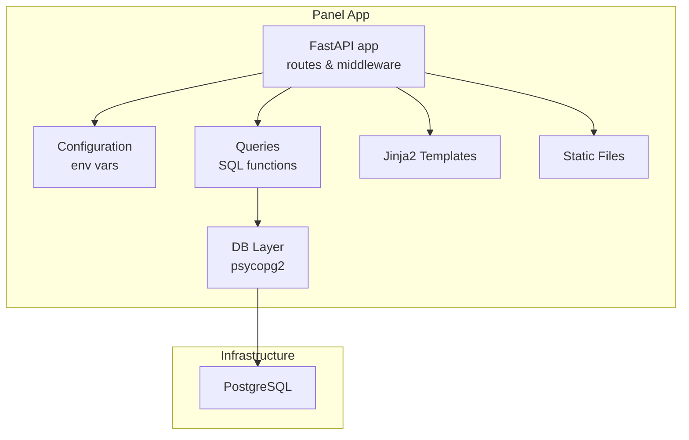
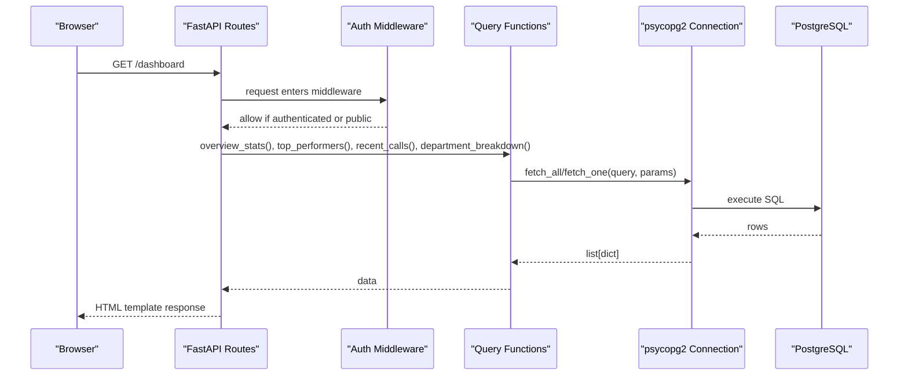
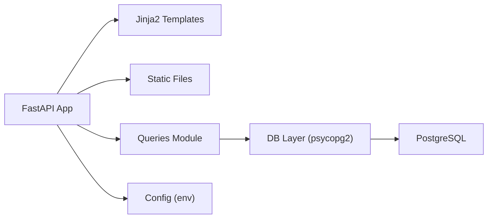

# Panel Application

<cite>
**Referenced Files in This Document**
- [main.py](file://docker/panel/app/main.py)
- [config.py](file://docker/panel/app/config.py)
- [db.py](file://docker/panel/app/db.py)
- [queries.py](file://docker/panel/app/queries.py)
- [requirements.txt](file://docker/panel/requirements.txt)
- [Dockerfile](file://docker/panel/Dockerfile)
- [docker-compose.yml](file://docker/docker-compose.yml)
</cite>

## Table of Contents
1. [Introduction](#introduction)
2. [Project Structure](#project-structure)
3. [Core Components](#core-components)
4. [Architecture Overview](#architecture-overview)
5. [Detailed Component Analysis](#detailed-component-analysis)
6. [Dependency Analysis](#dependency-analysis)
7. [Performance Considerations](#performance-considerations)
8. [Troubleshooting Guide](#troubleshooting-guide)
9. [Conclusion](#conclusion)
10. [Appendices](#appendices)

## Introduction
This document explains the FastAPI-based web dashboard for the Atlas Manager Panel. It covers the application architecture, authentication middleware, FastAPI routes, database integration patterns, configuration management, and query execution methods. The goal is to help both beginners understand the framework structure and experienced developers implement or extend endpoints, middleware, and database operations confidently.

## Project Structure
The Panel Application is a small FastAPI service that serves HTML pages via Jinja2 templates, protects routes with simple cookie-based authentication, and reads analytics data from PostgreSQL using direct SQL queries.

**Diagram sources**
- [main.py:16-17](file://docker/panel/app/main.py#L16-L17)
- [main.py:31-33](file://docker/panel/app/main.py#L31-L33)
- [main.py:56-65](file://docker/panel/app/main.py#L56-L65)
- [queries.py:6-23](file://docker/panel/app/queries.py#L6-L23)
- [db.py:8-30](file://docker/panel/app/db.py#L8-L30)
- [config.py:1-14](file://docker/panel/app/config.py#L1-L14)

**Section sources**
- [main.py:16-18](file://docker/panel/app/main.py#L16-L18)
- [Dockerfile:1-11](file://docker/panel/Dockerfile#L1-L11)
- [docker-compose.yml:80-98](file://docker/docker-compose.yml#L80-L98)

## Core Components
- FastAPI application and static assets mounting
- Authentication middleware protecting routes via a session cookie
- Route handlers rendering Jinja2 templates and returning JSON APIs
- Configuration loaded from environment variables
- Database connection handling and query helpers
- Query module encapsulating all SQL logic

Key responsibilities:
- main.py: defines the FastAPI app, mounts static files, registers routes, implements authentication middleware, and renders templates
- config.py: centralizes environment-driven settings (database, AI, panel title/password)
- db.py: provides connection context manager and fetch helpers using psycopg2
- queries.py: contains all report queries as Python functions returning typed results

**Section sources**
- [main.py:16-18](file://docker/panel/app/main.py#L16-L18)
- [main.py:56-65](file://docker/panel/app/main.py#L56-L65)
- [config.py:1-14](file://docker/panel/app/config.py#L1-L14)
- [db.py:8-30](file://docker/panel/app/db.py#L8-L30)
- [queries.py:6-23](file://docker/panel/app/queries.py#L6-L23)

## Architecture Overview
The Panel Application follows a layered approach:
- Presentation layer: FastAPI routes render Jinja2 templates and serve static assets
- Business layer: query functions encapsulate domain-specific SQL
- Data access layer: db.py manages connections and executes parameterized queries
- External dependencies: PostgreSQL for data; optional AI insights endpoint calls an external service

**Diagram sources**
- [main.py:68-80](file://docker/panel/app/main.py#L68-L80)
- [main.py:56-65](file://docker/panel/app/main.py#L56-L65)
- [queries.py:6-23](file://docker/panel/app/queries.py#L6-L23)
- [db.py:21-30](file://docker/panel/app/db.py#L21-L30)

## Detailed Component Analysis

### FastAPI Application and Static Assets
- Creates the FastAPI instance and mounts a static file server under /static for CSS/JS assets
- Configures Jinja2 templates directory and injects global template variables such as panel title, time helper, and current time function

Practical notes:
- Ensure templates and static directories are present at runtime
- Use the provided ctx helper to pass request context and active page flags into templates

**Section sources**
- [main.py:13-17](file://docker/panel/app/main.py#L13-L17)
- [main.py:31-33](file://docker/panel/app/main.py#L31-L33)

### Authentication Middleware
- Protects all routes except /login and /static when PANEL_PASSWORD is set
- Uses a secure httponly cookie named atlas_auth to track login state
- Allows POST /login without redirecting to avoid blocking form submission

Behavior summary:
- If no password is configured, authentication is bypassed
- Unauthenticated requests to protected routes are redirected to /login

**Section sources**
- [main.py:40-53](file://docker/panel/app/main.py#L40-L53)
- [main.py:56-65](file://docker/panel/app/main.py#L56-L65)

### Route Handlers and Template Rendering
- Dashboard and feature pages render Jinja2 templates with data fetched from queries
- API endpoints return JSON payloads for programmatic consumption
- Parameterized routes support dynamic content (e.g., monthly reports by ID, call details by call_id)

Common examples:
- Dashboard aggregates overview stats, top performers, recent calls, and department breakdown
- Monthly reports list and detail views
- Call detail view by call_id with 404 handling when not found

**Section sources**
- [main.py:68-80](file://docker/panel/app/main.py#L68-L80)
- [main.py:139-155](file://docker/panel/app/main.py#L139-L155)
- [main.py:173-181](file://docker/panel/app/main.py#L173-L181)
- [main.py:184-187](file://docker/panel/app/main.py#L184-L187)

### Configuration Management
- All runtime settings are loaded from environment variables with sensible defaults
- Database credentials and host/port are read from env and used to build the connection string
- Optional AI model and key are available for insights generation
- Panel title and password can be customized per deployment

Typical usage:
- Set PANEL_PASSWORD to enable simple auth
- Configure DB_* variables to match your PostgreSQL deployment
- Override PANEL_TITLE to customize branding

**Section sources**
- [config.py:1-14](file://docker/panel/app/config.py#L1-L14)
- [docker-compose.yml:86-95](file://docker/docker-compose.yml#L86-L95)

### Database Connection Handling
- Builds a DSN from configuration values
- Provides a context manager to safely open and close connections
- Exposes fetch_all and fetch_one helpers that return dictionaries using RealDictCursor

Best practices:
- Always use parameterized queries to prevent SQL injection
- Keep connections short-lived within request scope

**Section sources**
- [db.py:8-18](file://docker/panel/app/db.py#L8-L18)
- [db.py:21-30](file://docker/panel/app/db.py#L21-L30)

### Query Execution Methods
- Each report is implemented as a dedicated function returning typed results
- Aggregations, filters, and joins are expressed directly in SQL
- Common patterns include COUNT/FILTER, AVG rounding, and JSON field extraction

Examples:
- Overview stats compute totals and averages across call_analyses
- Top performers rank agents by composite success score
- Ready-to-buy and unhappy customers filter based on scores and JSON fields
- Staff performance and satisfaction provide per-agent metrics
- Monthly reports list and detail queries operate on monthly_reports table

**Section sources**
- [queries.py:6-23](file://docker/panel/app/queries.py#L6-L23)
- [queries.py:26-49](file://docker/panel/app/queries.py#L26-L49)
- [queries.py:52-76](file://docker/panel/app/queries.py#L52-L76)
- [queries.py:79-106](file://docker/panel/app/queries.py#L79-L106)
- [queries.py:109-165](file://docker/panel/app/queries.py#L109-L165)
- [queries.py:168-192](file://docker/panel/app/queries.py#L168-L192)
- [queries.py:195-211](file://docker/panel/app/queries.py#L195-L211)
- [queries.py:214-232](file://docker/panel/app/queries.py#L214-L232)
- [queries.py:235-247](file://docker/panel/app/queries.py#L235-L247)
- [queries.py:250-259](file://docker/panel/app/queries.py#L250-L259)

### AI Insights Endpoint
- Renders a page that loads insights asynchronously
- An API endpoint builds a context payload from multiple queries and calls an external AI generator to produce executive insights

Integration note:
- Requires AI_API_KEY and AI_MODEL environment variables to be set
- The actual AI provider call is delegated to a separate module

**Section sources**
- [main.py:158-170](file://docker/panel/app/main.py#L158-L170)
- [config.py:9-10](file://docker/panel/app/config.py#L9-L10)

## Dependency Analysis
The Panel Application depends on:
- FastAPI and Uvicorn for HTTP serving
- Jinja2 for templating
- psycopg2-binary for PostgreSQL connectivity
- python-multipart for form parsing
- httpx for HTTP client usage (likely in AI module)

Runtime setup:
- Dockerfile installs requirements and runs uvicorn
- docker-compose provisions PostgreSQL and passes environment variables to the panel service

**Diagram sources**
- [requirements.txt:1-7](file://docker/panel/requirements.txt#L1-L7)
- [Dockerfile:3-10](file://docker/panel/Dockerfile#L3-L10)
- [docker-compose.yml:80-98](file://docker/docker-compose.yml#L80-L98)

**Section sources**
- [requirements.txt:1-7](file://docker/panel/requirements.txt#L1-L7)
- [Dockerfile:1-11](file://docker/panel/Dockerfile#L1-L11)
- [docker-compose.yml:80-98](file://docker/docker-compose.yml#L80-L98)

## Performance Considerations
- Prefer parameterized queries to avoid overhead and ensure safety
- Limit result sets with LIMIT clauses where appropriate (already applied in many queries)
- Cache expensive aggregations if needed (e.g., materialized views or Redis)
- Keep database connections short-lived; the context manager ensures proper cleanup
- Use indexes on frequently filtered columns (e.g., call_date, department, purchase_intent_score)

[No sources needed since this section provides general guidance]

## Troubleshooting Guide
Common issues and resolutions:
- Missing PANEL_PASSWORD: When empty, authentication is disabled and users are redirected to the dashboard automatically
- Login loop or redirects: Ensure the cookie is accepted by the browser and the /login POST route is allowed through middleware
- Database connection errors: Verify DB_HOST, DB_PORT, DB_NAME, DB_USER, DB_PASSWORD are correct and reachable
- 404 on monthly report or call detail: Indicates missing records; handle gracefully in templates or add default states
- Static assets not loading: Confirm /static mount path and that files exist under the static directory

Operational checks:
- Validate environment variables in docker-compose
- Confirm PostgreSQL health check passes before starting the panel
- Inspect logs for connection failures or template rendering errors

**Section sources**
- [main.py:40-53](file://docker/panel/app/main.py#L40-L53)
- [main.py:56-65](file://docker/panel/app/main.py#L56-L65)
- [main.py:147-155](file://docker/panel/app/main.py#L147-L155)
- [main.py:173-181](file://docker/panel/app/main.py#L173-L181)
- [docker-compose.yml:20-24](file://docker/docker-compose.yml#L20-L24)
- [docker-compose.yml:86-95](file://docker/docker-compose.yml#L86-L95)

## Conclusion
The Panel Application provides a clear, maintainable FastAPI dashboard with straightforward authentication, robust database access, and well-structured query modules. By following the documented patterns—environment-driven configuration, parameterized queries, and clean separation between routes, queries, and data access—you can extend features, add new endpoints, and integrate additional services like AI insights with confidence.

[No sources needed since this section summarizes without analyzing specific files]

## Appendices

### Environment Variables Reference
- DB_HOST, DB_PORT, DB_NAME, DB_USER, DB_PASSWORD: PostgreSQL connection parameters
- AI_API_KEY, AI_MODEL: Settings for AI insights generation
- PANEL_TITLE, PANEL_PASSWORD: UI branding and simple authentication toggle

**Section sources**
- [config.py:1-14](file://docker/panel/app/config.py#L1-L14)
- [docker-compose.yml:86-95](file://docker/docker-compose.yml#L86-L95)

### Example Endpoints Summary
- GET /: Dashboard with aggregated stats and lists
- GET /top-performers: Ranked agent performance
- GET /ready-to-buy: High-intent leads
- GET /unhappy-customers: Low satisfaction cases
- GET /staff-performance: Per-agent metrics
- GET /call-duration: Duration analytics by agent
- GET /satisfaction: Satisfaction rates
- GET /successful-sales: Likely closed deals
- GET /monthly-reports: List of monthly reports
- GET /monthly-reports/{report_id}: Report detail
- GET /calls/{call_id}: Call detail
- GET /api/stats: JSON overview statistics
- GET /ai-insights: Page to load AI insights
- GET /api/ai-insights: JSON payload for AI insights

**Section sources**
- [main.py:68-187](file://docker/panel/app/main.py#L68-L187)