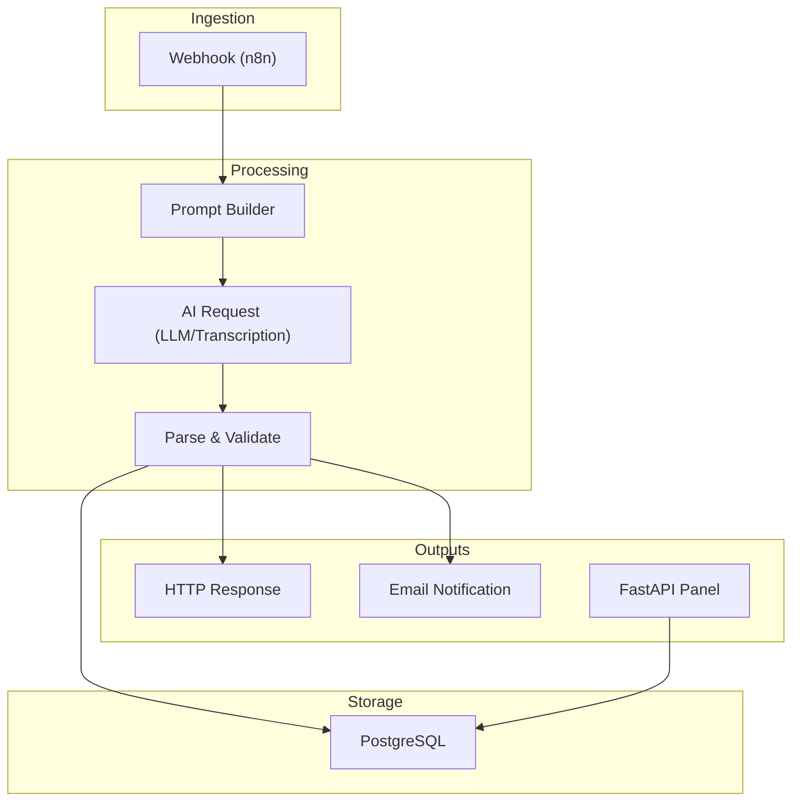
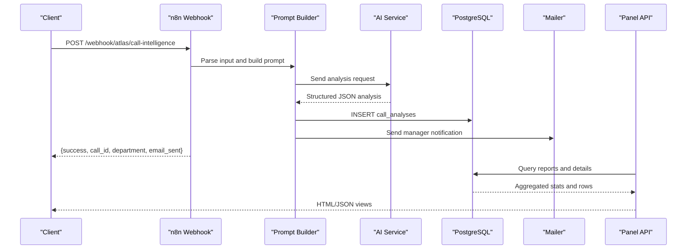
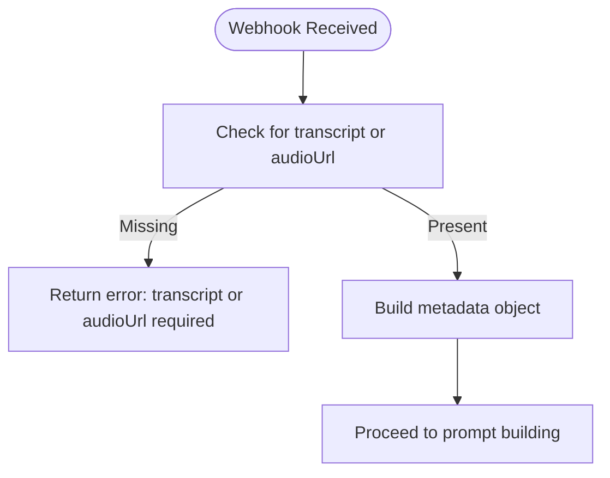
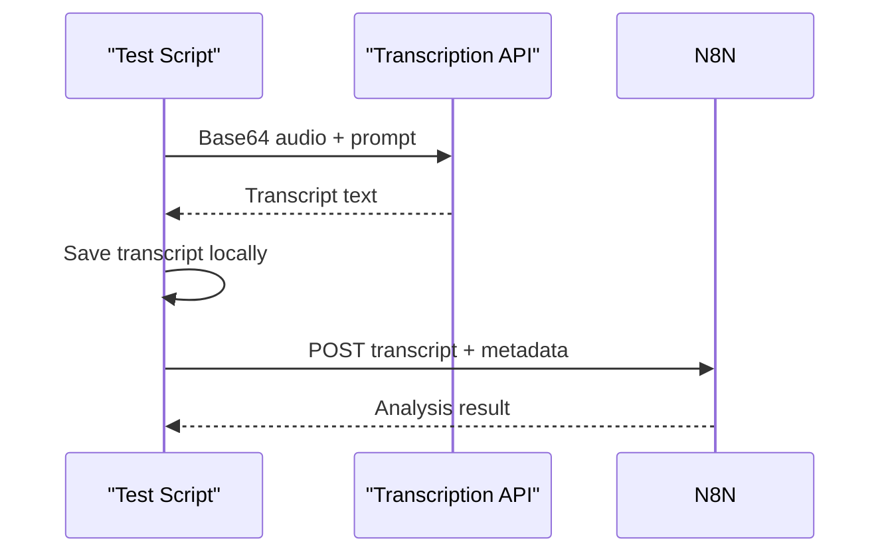
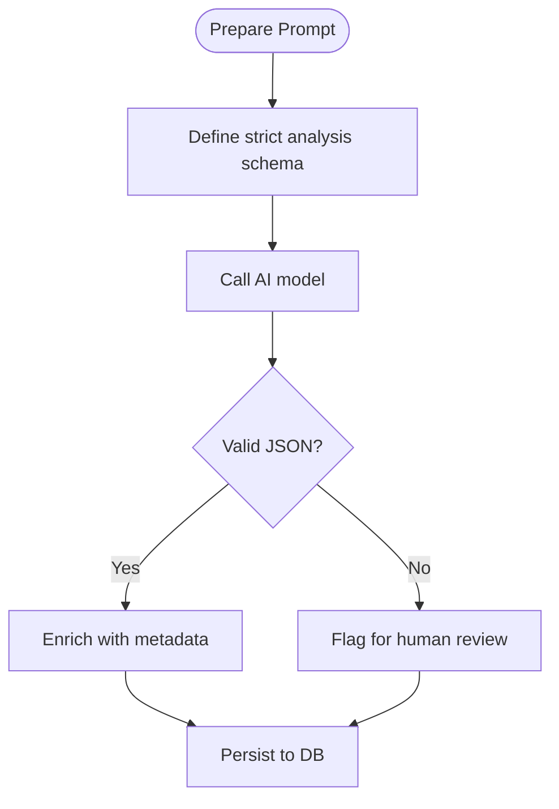
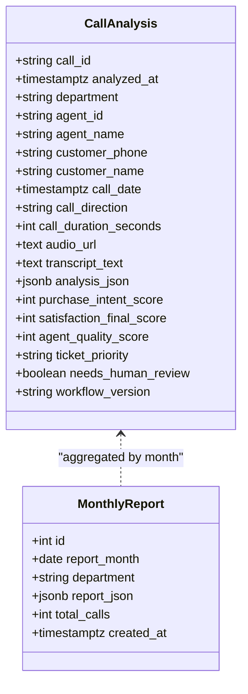
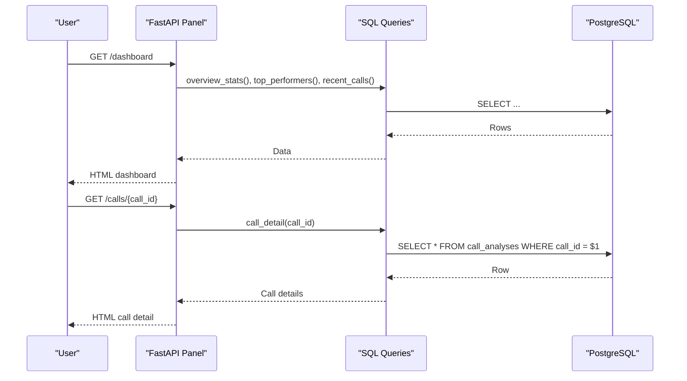
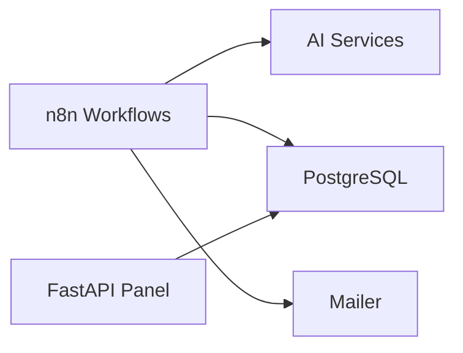

# Audio Analysis Workflow

<cite>
**Referenced Files in This Document**
- [audio-analysis-workflow.json](file://docker/n8n/workflows/audio-analysis-workflow.json)
- [atlas-call-intelligence-v1.json](file://docker/n8n/workflows/atlas-call-intelligence-v1.json)
- [run-real-voice-test.py](file://docker/scripts/run-real-voice-test.py)
- [send-real-call-analysis.py](file://docker/scripts/send-real-call-analysis.py)
- [main.py](file://docker/panel/app/main.py)
- [queries.py](file://docker/panel/app/queries.py)
- [db.py](file://docker/panel/app/db.py)
- [config.py](file://docker/panel/app/config.py)
- [001_call_intelligence.sql](file://docker/postgres/init/001_call_intelligence.sql)
- [docker-compose.yml](file://docker/docker-compose.yml)
</cite>

## Table of Contents
1. [Introduction](#introduction)
2. [Project Structure](#project-structure)
3. [Core Components](#core-components)
4. [Architecture Overview](#architecture-overview)
5. [Detailed Component Analysis](#detailed-component-analysis)
6. [Dependency Analysis](#dependency-analysis)
7. [Performance Considerations](#performance-considerations)
8. [Troubleshooting Guide](#troubleshooting-guide)
9. [Conclusion](#conclusion)
10. [Appendices](#appendices)

## Introduction
This document describes the end-to-end Audio Analysis Workflow used to ingest raw audio, transcribe it, analyze call content with AI services, persist results, and expose them via a management panel. It covers ingestion, transcription integration, analysis pipelines, quality assessment, metadata extraction, format handling, configuration options, performance tuning, external service integrations, upload examples, status tracking, result retrieval patterns, and common challenges with solutions.

## Project Structure
The workflow is orchestrated by n8n workflows that receive webhooks, prepare prompts for AI models, call external speech recognition or LLM endpoints, parse and validate responses, store results in PostgreSQL, and optionally send notifications. A FastAPI panel reads from the database to display dashboards and call details. Python scripts demonstrate transcription and end-to-end testing.

**Diagram sources**
- [audio-analysis-workflow.json:1-139](file://docker/n8n/workflows/audio-analysis-workflow.json#L1-L139)
- [atlas-call-intelligence-v1.json:1-160](file://docker/n8n/workflows/atlas-call-intelligence-v1.json#L1-L160)
- [001_call_intelligence.sql:1-45](file://docker/postgres/init/001_call_intelligence.sql#L1-L45)
- [main.py:85-204](file://docker/panel/app/main.py#L85-L204)

**Section sources**
- [docker-compose.yml:1-98](file://docker/docker-compose.yml#L1-L98)
- [audio-analysis-workflow.json:1-139](file://docker/n8n/workflows/audio-analysis-workflow.json#L1-L139)
- [atlas-call-intelligence-v1.json:1-160](file://docker/n8n/workflows/atlas-call-intelligence-v1.json#L1-L160)

## Core Components
- Webhook ingestion: Accepts JSON payloads containing either an audio URL or transcript text, plus optional metadata like call_id, department hints, agent info, and duration.
- Prompt preparation: Builds structured prompts for AI models to extract call insights, sentiment, sales/support classification, satisfaction scores, ticketing fields, and quality metrics.
- AI integration: Calls configured endpoints for transcription or analysis; supports environment-driven model selection and API keys.
- Validation and enrichment: Parses AI output into a strict schema, enriches with metadata, and flags items needing human review.
- Persistence: Inserts records into PostgreSQL with indexes for efficient querying and reporting.
- Notifications: Sends manager emails summarizing key outcomes.
- Panel: FastAPI app serves dashboards and detail pages backed by SQL queries.

**Section sources**
- [atlas-call-intelligence-v1.json:12-159](file://docker/n8n/workflows/atlas-call-intelligence-v1.json#L12-L159)
- [001_call_intelligence.sql:4-45](file://docker/postgres/init/001_call_intelligence.sql#L4-L45)
- [main.py:85-204](file://docker/panel/app/main.py#L85-L204)
- [queries.py:6-260](file://docker/panel/app/queries.py#L6-L260)

## Architecture Overview
The system uses two primary n8n workflows:
- Audio Analysis Workflow: A minimal flow that prepares a prompt and calls an AI endpoint to analyze transcripts.
- Atlas Call Intelligence v1: A comprehensive flow that parses inputs, builds prompts, calls AI, validates outputs, persists to PostgreSQL, sends email notifications, and returns structured responses.

**Diagram sources**
- [atlas-call-intelligence-v1.json:12-159](file://docker/n8n/workflows/atlas-call-intelligence-v1.json#L12-L159)
- [001_call_intelligence.sql:4-45](file://docker/postgres/init/001_call_intelligence.sql#L4-L45)
- [main.py:85-204](file://docker/panel/app/main.py#L85-L204)

## Detailed Component Analysis

### Ingestion and Input Handling
- The webhook accepts flexible fields for audio references and transcripts, enabling both URL-based and inline transcript processing.
- Metadata includes call identifiers, department hints, agent and customer details, direction, duration, and product context.
- Validation ensures at least one of transcript or audio URL is provided.

**Diagram sources**
- [atlas-call-intelligence-v1.json:25-35](file://docker/n8n/workflows/atlas-call-intelligence-v1.json#L25-L35)

**Section sources**
- [atlas-call-intelligence-v1.json:25-35](file://docker/n8n/workflows/atlas-call-intelligence-v1.json#L25-L35)

### Transcription Services Integration
- The test script demonstrates base64-encoded audio submission to a transcription-capable model, supporting common audio formats such as m4a/mp4 and mp3.
- The script sets MIME types based on file extension and requests word-level transcription with speaker labels.
- Environment variables allow switching models and endpoints without code changes.

**Diagram sources**
- [run-real-voice-test.py:16-43](file://docker/scripts/run-real-voice-test.py#L16-L43)
- [run-real-voice-test.py:45-85](file://docker/scripts/run-real-voice-test.py#L45-L85)

**Section sources**
- [run-real-voice-test.py:1-90](file://docker/scripts/run-real-voice-test.py#L1-L90)

### Analysis Pipeline and Quality Assessment
- The prompt builder constructs a detailed schema-driven request for the AI model, covering customer needs, pain points, satisfaction, agent performance, sales/support analysis, ticketing, and risk/opportunity insights.
- The parser validates JSON output, enriches metadata, and normalizes fields for storage.
- Quality control flags indicate when human review is needed.

**Diagram sources**
- [atlas-call-intelligence-v1.json:37-46](file://docker/n8n/workflows/atlas-call-intelligence-v1.json#L37-L46)
- [atlas-call-intelligence-v1.json:63-72](file://docker/n8n/workflows/atlas-call-intelligence-v1.json#L63-L72)

**Section sources**
- [atlas-call-intelligence-v1.json:37-72](file://docker/n8n/workflows/atlas-call-intelligence-v1.json#L37-L72)

### Metadata Extraction Capabilities
- Extracted fields include:
  - Department classification (sales/support/mixed/unknown)
  - Customer request summary, needs, pain points, products mentioned
  - Sentiment and satisfaction scores (initial/final)
  - Agent performance metrics (quality, communication, empathy, adherence)
  - Sales analysis (intent score, stage, objections, discount estimates, next steps)
  - Support analysis (issue category, resolution status, retention risk)
  - Ticketing fields (title, priority, description, follow-up)
  - Insights (key takeaways, risks, opportunities, compliance notes)
  - Quality control flags and confidence measures

These fields are persisted in a JSONB column and surfaced via SQL queries for dashboards.

**Section sources**
- [atlas-call-intelligence-v1.json:37-46](file://docker/n8n/workflows/atlas-call-intelligence-v1.json#L37-L46)
- [queries.py:6-260](file://docker/panel/app/queries.py#L6-L260)
- [001_call_intelligence.sql:4-45](file://docker/postgres/init/001_call_intelligence.sql#L4-L45)

### Storage and Reporting
- PostgreSQL stores per-call analyses with indexed columns for fast filtering by date, department, agent, and call date.
- Monthly reports table aggregates data over time.
- Panel queries compute overview stats, top performers, ready-to-buy leads, unhappy customers, staff performance, call durations, successful sales, and recent calls.

**Diagram sources**
- [001_call_intelligence.sql:4-45](file://docker/postgres/init/001_call_intelligence.sql#L4-L45)

**Section sources**
- [001_call_intelligence.sql:4-45](file://docker/postgres/init/001_call_intelligence.sql#L4-L45)
- [queries.py:6-260](file://docker/panel/app/queries.py#L6-L260)

### Panel and Result Retrieval
- FastAPI endpoints serve dashboards and detail pages, rendering templates with query results.
- An AI insights endpoint composes a context payload from multiple queries and calls an AI generator to produce executive insights.
- Authentication middleware protects routes when a password is configured.

**Diagram sources**
- [main.py:85-204](file://docker/panel/app/main.py#L85-L204)
- [queries.py:6-260](file://docker/panel/app/queries.py#L6-L260)
- [db.py:1-31](file://docker/panel/app/db.py#L1-L31)

**Section sources**
- [main.py:85-204](file://docker/panel/app/main.py#L85-L204)
- [queries.py:6-260](file://docker/panel/app/queries.py#L6-L260)
- [db.py:1-31](file://docker/panel/app/db.py#L1-L31)

### Configuration Options and External Integrations
- Environment variables configure:
  - Database connection (host, port, name, user, password)
  - AI API URL, model, and key
  - Manager email and SMTP settings for notifications
  - Panel title and optional password
- Docker Compose wires services together and exposes ports for local development.

**Section sources**
- [config.py:1-14](file://docker/panel/app/config.py#L1-L14)
- [docker-compose.yml:1-98](file://docker/docker-compose.yml#L1-L98)

### Examples: Upload, Status Tracking, and Results
- Upload example:
  - Use the test payload JSON to submit a transcript and metadata to the n8n webhook endpoint.
- Status tracking:
  - The response includes success flag, call_id, department, and email_sent status.
  - For asynchronous flows, poll the panel’s call detail endpoint using call_id to retrieve processed results.
- Result retrieval:
  - Query the panel’s call detail page or API endpoints to view full analysis and metrics.

**Section sources**
- [test-payload.json:1-12](file://docker/scripts/test-payload.json#L1-L12)
- [atlas-call-intelligence-v1.json:121-159](file://docker/n8n/workflows/atlas-call-intelligence-v1.json#L121-L159)
- [main.py:190-204](file://docker/panel/app/main.py#L190-L204)

## Dependency Analysis
The workflow depends on:
- n8n orchestration layer for webhook handling and node execution
- External AI services for transcription and analysis
- PostgreSQL for persistent storage and reporting
- Mailer service for email notifications
- FastAPI panel for visualization and access to stored results

**Diagram sources**
- [docker-compose.yml:1-98](file://docker/docker-compose.yml#L1-L98)
- [atlas-call-intelligence-v1.json:12-159](file://docker/n8n/workflows/atlas-call-intelligence-v1.json#L12-L159)
- [main.py:85-204](file://docker/panel/app/main.py#L85-L204)

**Section sources**
- [docker-compose.yml:1-98](file://docker/docker-compose.yml#L1-L98)
- [atlas-call-intelligence-v1.json:12-159](file://docker/n8n/workflows/atlas-call-intelligence-v1.json#L12-L159)

## Performance Considerations
- Model selection and temperature:
  - Lower temperature values reduce variability and improve consistency for structured outputs.
- Timeouts and retries:
  - Increase timeouts for large audio files during transcription; implement retries for transient network errors.
- Database indexing:
  - Existing indexes on analyzed_at, agent_id, department, and call_date support efficient reporting and filtering.
- Batch processing:
  - For high-volume ingestion, consider batching webhook payloads and processing asynchronously.
- Caching and deduplication:
  - Deduplicate by call_id to avoid redundant processing and storage.

[No sources needed since this section provides general guidance]

## Troubleshooting Guide
Common issues and resolutions:
- Missing inputs:
  - Ensure transcript or audioUrl is present; otherwise, the workflow returns an error.
- AI parsing failures:
  - If the model returns non-JSON or malformed output, the parser flags the record for human review and preserves raw text for debugging.
- Email delivery failures:
  - Verify mailer service availability and SMTP configuration; the workflow continues even if email sending fails.
- Database connectivity:
  - Confirm Postgres credentials and service health; use health checks in docker-compose to ensure readiness.
- Panel authentication:
  - If PANEL_PASSWORD is set, ensure proper cookie/session handling to access protected routes.

**Section sources**
- [atlas-call-intelligence-v1.json:25-35](file://docker/n8n/workflows/atlas-call-intelligence-v1.json#L25-L35)
- [atlas-call-intelligence-v1.json:63-72](file://docker/n8n/workflows/atlas-call-intelligence-v1.json#L63-L72)
- [atlas-call-intelligence-v1.json:105-120](file://docker/n8n/workflows/atlas-call-intelligence-v1.json#L105-L120)
- [docker-compose.yml:1-98](file://docker/docker-compose.yml#L1-L98)
- [main.py:57-82](file://docker/panel/app/main.py#L57-L82)

## Conclusion
The Audio Analysis Workflow provides a robust pipeline for ingesting audio or transcripts, integrating with external AI services for transcription and analysis, extracting rich metadata, assessing quality, and presenting actionable insights through a management panel. With configurable environments, resilient error handling, and efficient storage, it supports scalable call intelligence operations across diverse audio formats and processing needs.

[No sources needed since this section summarizes without analyzing specific files]

## Appendices

### Supported Audio Formats and Handling
- The test script handles m4a/mp4 and mp3 formats by setting appropriate MIME types before transcription.
- For other formats, convert to supported types prior to submission or extend MIME detection logic.

**Section sources**
- [run-real-voice-test.py:16-43](file://docker/scripts/run-real-voice-test.py#L16-L43)

### Noise Reduction Techniques
- While not implemented in the current scripts, noise reduction can be applied upstream before transcription:
  - Pre-process audio with tools like librosa or ffmpeg filters to reduce background noise.
  - Normalize volume levels and trim silence to improve transcription accuracy.

[No sources needed since this section provides general guidance]

### Speaker Identification Features
- The transcription prompt requests speaker labels (“agent” vs “customer”) to structure the transcript.
- For advanced diarization, integrate a dedicated speaker identification service or enhance prompts to enforce labeled segments.

**Section sources**
- [run-real-voice-test.py:16-43](file://docker/scripts/run-real-voice-test.py#L16-L43)