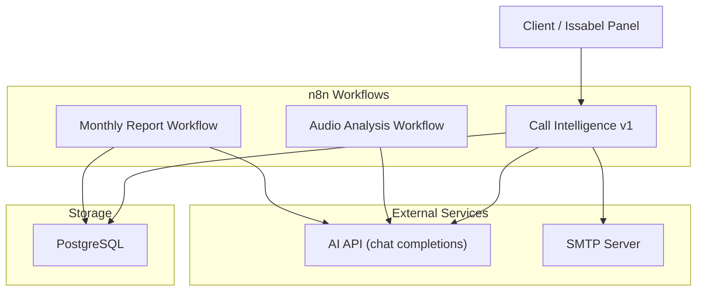
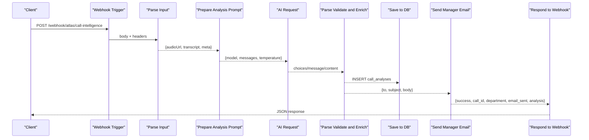
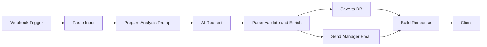

# Call Intelligence Workflow

<cite>
**Referenced Files in This Document**
- [atlas-call-intelligence-v1.json](file://docker/n8n/workflows/atlas-call-intelligence-v1.json)
- [audio-analysis-workflow.json](file://docker/n8n/workflows/audio-analysis-workflow.json)
- [README.md](file://03_Products/Atlas Call Intelligence/V1/README.md)
- [schema.json](file://03_Products/Atlas Call Intelligence/V1/schema.json)
- [001_call_intelligence.sql](file://docker/postgres/init/001_call_intelligence.sql)
- [send_email.py](file://docker/mailer/send_email.py)
- [run-real-voice-test.py](file://docker/scripts/run-real-voice-test.py)
- [real-call-result.json](file://docker/scripts/real-call-result.json)
</cite>

## Table of Contents
1. [Introduction](#introduction)
2. [Project Structure](#project-structure)
3. [Core Components](#core-components)
4. [Architecture Overview](#architecture-overview)
5. [Detailed Component Analysis](#detailed-component-analysis)
6. [Dependency Analysis](#dependency-analysis)
7. [Performance Considerations](#performance-considerations)
8. [Troubleshooting Guide](#troubleshooting-guide)
9. [Conclusion](#conclusion)
10. [Appendices](#appendices)

## Introduction
This document explains the Call Intelligence Workflow that processes call transcripts and audio files via n8n. It covers webhook triggers, input parsing logic, AI prompt preparation, analysis pipeline, database storage, email notifications, and end-to-end data flow from webhook reception to final response. It also provides node-by-node execution details, error handling strategies, debugging techniques, practical examples of webhook payloads and expected responses, and common troubleshooting scenarios using terminology consistent with the codebase such as webhook triggers, AI requests, database operations, and email notifications.

## Project Structure
The Call Intelligence system is composed of:
- n8n workflows for real-time call analysis and monthly reporting
- PostgreSQL schema for storing per-call analyses and monthly reports
- Email notification utilities
- Test scripts to transcribe audio and invoke the workflow

**Diagram sources**
- [atlas-call-intelligence-v1.json:10-143](file://docker/n8n/workflows/atlas-call-intelligence-v1.json#L10-L143)
- [audio-analysis-workflow.json:3-78](file://docker/n8n/workflows/audio-analysis-workflow.json#L3-L78)
- [atlas-call-intelligence-monthly-report.json:10-169](file://docker/n8n/workflows/atlas-call-intelligence-monthly-report.json#L10-L169)
- [001_call_intelligence.sql:4-44](file://docker/postgres/init/001_call_intelligence.sql#L4-L44)

**Section sources**
- [README.md:16-28](file://03_Products/Atlas Call Intelligence/V1/README.md#L16-L28)
- [atlas-call-intelligence-v1.json:10-143](file://docker/n8n/workflows/atlas-call-intelligence-v1.json#L10-L143)
- [audio-analysis-workflow.json:3-78](file://docker/n8n/workflows/audio-analysis-workflow.json#L3-L78)
- [atlas-call-intelligence-monthly-report.json:10-169](file://docker/n8n/workflows/atlas-call-intelligence-monthly-report.json#L10-L169)
- [001_call_intelligence.sql:4-44](file://docker/postgres/init/001_call_intelligence.sql#L4-L44)

## Core Components
- Webhook triggers: Accept POST requests with call metadata and either an audio URL or transcript text.
- Input parsing: Normalize various field names into a canonical structure and validate required inputs.
- AI prompt preparation: Build a structured prompt including context, department hint, and metadata; enforce JSON output schema.
- AI requests: Call external AI API to analyze the transcript and return structured insights.
- Parse and validate: Clean AI output, enrich with metadata, build manager notification payload.
- Database operations: Persist call analysis results and derived metrics to PostgreSQL.
- Email notifications: Send manager emails summarizing tickets and key insights.
- Response building: Return a consistent JSON response to the caller indicating success, department, and analysis summary.

**Section sources**
- [atlas-call-intelligence-v1.json:10-143](file://docker/n8n/workflows/atlas-call-intelligence-v1.json#L10-L143)
- [schema.json:1-153](file://03_Products/Atlas Call Intelligence/V1/schema.json#L1-L153)
- [001_call_intelligence.sql:4-44](file://docker/postgres/init/001_call_intelligence.sql#L4-L44)
- [send_email.py:1-39](file://docker/mailer/send_email.py#L1-L39)

## Architecture Overview
End-to-end flow for a call analysis request:

**Diagram sources**
- [atlas-call-intelligence-v1.json:10-143](file://docker/n8n/workflows/atlas-call-intelligence-v1.json#L10-L143)
- [001_call_intelligence.sql:4-44](file://docker/postgres/init/001_call_intelligence.sql#L4-L44)

## Detailed Component Analysis

### Webhook Trigger
- Endpoint: POST /webhook/atlas/call-intelligence
- Method: POST
- Response mode: responseNode (returns final node’s JSON)
- Purpose: Entry point for call analysis requests

**Section sources**
- [atlas-call-intelligence-v1.json:10-24](file://docker/n8n/workflows/atlas-call-intelligence-v1.json#L10-L24)

### Input Parsing Logic
- Normalizes multiple field variants for audio URL and transcript
- Extracts metadata: call_id, department, agent_name, agent_id, customer_phone, customer_name, call_direction, call_duration_seconds, call_date, product_context
- Validates that at least one of transcript or audioUrl is provided; throws error otherwise

**Section sources**
- [atlas-call-intelligence-v1.json:25-35](file://docker/n8n/workflows/atlas-call-intelligence-v1.json#L25-L35)

### AI Prompt Preparation
- Builds a prompt instructing the AI to act as Atlas Call Intelligence for Iranian accounting companies
- Includes context (product_context), department hint (sales/support/auto), and metadata
- Enforces strict JSON output matching the defined schema
- Passes model and temperature via environment variables

**Section sources**
- [atlas-call-intelligence-v1.json:36-61](file://docker/n8n/workflows/atlas-call-intelligence-v1.json#L36-L61)
- [schema.json:1-153](file://03_Products/Atlas Call Intelligence/V1/schema.json#L1-L153)

### AI Requests
- Sends HTTP POST to configured AI API endpoint
- Body includes model name, messages array with user role and prepared prompt, and temperature
- Environment-driven configuration allows switching models and endpoints

**Section sources**
- [atlas-call-intelligence-v1.json:47-61](file://docker/n8n/workflows/atlas-call-intelligence-v1.json#L47-L61)

### Parse, Validate, and Enrich
- Extracts AI response content, strips markdown fences if present
- Attempts JSON parse; on failure, marks parse_error and preserves raw_text
- Enriches analysis with metadata: call_id, analyzed_at, workflow_version, language
- Ensures transcript full_text is preserved and input fields are populated
- Computes department label and builds manager notification payload with ticket info and scores

**Section sources**
- [atlas-call-intelligence-v1.json:62-72](file://docker/n8n/workflows/atlas-call-intelligence-v1.json#L62-L72)

### Database Operations
- Inserts or updates call_analyses row using ON CONFLICT (call_id) DO UPDATE
- Persists: department, agent identifiers, customer info, call metadata, transcript_text, analysis_json, and derived scores (purchase_intent_score, satisfaction_final_score, agent_quality_score, ticket_priority, needs_human_review)
- Uses PostgreSQL credentials configured in n8n

**Section sources**
- [atlas-call-intelligence-v1.json:73-93](file://docker/n8n/workflows/atlas-call-intelligence-v1.json#L73-L93)
- [001_call_intelligence.sql:4-27](file://docker/postgres/init/001_call_intelligence.sql#L4-L27)

### Email Notifications
- Constructs manager email with ticket title, priority, description, and key scores
- Sends via HTTP POST to local mailer service endpoint
- continueOnFail enabled so email failures do not block workflow completion

**Section sources**
- [atlas-call-intelligence-v1.json:94-120](file://docker/n8n/workflows/atlas-call-intelligence-v1.json#L94-L120)
- [send_email.py:1-39](file://docker/mailer/send_email.py#L1-L39)

### Response Building
- Merges validation result and email send status into final response
- Returns success flag, call_id, department, email_sent, email_error, analysis, and manager_notification

**Section sources**
- [atlas-call-intelligence-v1.json:121-143](file://docker/n8n/workflows/atlas-call-intelligence-v1.json#L121-L143)

### Audio Analysis Workflow (Alternative Path)
- Simpler flow: webhook trigger -> prepare prompt -> AI request -> format response -> respond
- Useful for quick transcription-based summaries when detailed analysis is not required

**Section sources**
- [audio-analysis-workflow.json:3-78](file://docker/n8n/workflows/audio-analysis-workflow.json#L3-L78)

### Monthly Reporting Workflow
- Scheduled and manual webhook triggers compute report period
- Fetches call_analyses within date range, aggregates statistics by department and agent
- Calls AI to generate executive summary in Persian
- Saves report to monthly_reports table and responds with structured report

**Section sources**
- [atlas-call-intelligence-monthly-report.json:10-169](file://docker/n8n/workflows/atlas-call-intelligence-monthly-report.json#L10-L169)
- [001_call_intelligence.sql:34-44](file://docker/postgres/init/001_call_intelligence.sql#L34-L44)

## Dependency Analysis
Key dependencies and relationships:
- n8n workflows depend on:
  - External AI API for chat completions
  - PostgreSQL for persistent storage
  - Local mailer service for sending emails
- Data flows:
  - Webhook triggers receive payloads and pass normalized data through parsing and prompting nodes
  - AI requests consume prompts and return structured analysis
  - Database operations persist both raw analysis and derived metrics
  - Email notifications summarize actionable items for managers

**Diagram sources**
- [atlas-call-intelligence-v1.json:10-143](file://docker/n8n/workflows/atlas-call-intelligence-v1.json#L10-L143)

**Section sources**
- [atlas-call-intelligence-v1.json:10-143](file://docker/n8n/workflows/atlas-call-intelligence-v1.json#L10-L143)
- [001_call_intelligence.sql:4-44](file://docker/postgres/init/001_call_intelligence.sql#L4-L44)

## Performance Considerations
- Use minimal temperature for deterministic outputs to reduce variability in analysis quality
- Ensure transcript length is reasonable; very long transcripts may increase AI processing time and token usage
- Enable database indexes already defined for efficient querying by analyzed_at, agent_id, department, and call_date
- Batch or throttle incoming webhook requests during peak loads to avoid AI API rate limits
- Cache frequent prompts or reuse static parts of prompts to reduce overhead

[No sources needed since this section provides general guidance]

## Troubleshooting Guide
Common issues and debugging steps:

- Invalid input: If neither transcript nor audioUrl is provided, the workflow throws an error during parsing. Verify the webhook payload contains at least one of these fields.
- AI parse errors: If the AI returns non-JSON or malformed content, the workflow marks parse_error and preserves raw_text. Check the AI model settings and prompt constraints.
- Database write failures: The Save to DB node has continueOnFail enabled; inspect logs for credential or connection issues. Confirm PostgreSQL credentials and schema initialization.
- Email delivery failures: The Send Manager Email node has continueOnFail enabled; verify the mailer service endpoint and SMTP configuration. Use the test script to validate SMTP connectivity.
- Real-world test results: The run-real-voice-test.py script demonstrates end-to-end transcription and analysis; review real-call-result.json for observed behavior and error states.

Practical examples:
- Webhook payload example: See README for sample POST body including audioUrl or transcript and optional metadata fields.
- Expected response: Success flag, call_id, department, email_sent, and analysis summary are returned.

Debugging techniques:
- Inspect n8n execution logs for each node’s input/output
- Validate environment variables for AI_API_URL, AI_MODEL, ATLAS_MANAGER_EMAIL
- Test SMTP independently using send_email.py with appropriate environment variables
- Re-run the real voice test script to reproduce issues with actual audio files

**Section sources**
- [atlas-call-intelligence-v1.json:25-35](file://docker/n8n/workflows/atlas-call-intelligence-v1.json#L25-L35)
- [atlas-call-intelligence-v1.json:62-72](file://docker/n8n/workflows/atlas-call-intelligence-v1.json#L62-L72)
- [atlas-call-intelligence-v1.json:73-93](file://docker/n8n/workflows/atlas-call-intelligence-v1.json#L73-L93)
- [atlas-call-intelligence-v1.json:94-120](file://docker/n8n/workflows/atlas-call-intelligence-v1.json#L94-L120)
- [send_email.py:1-39](file://docker/mailer/send_email.py#L1-L39)
- [run-real-voice-test.py:1-90](file://docker/scripts/run-real-voice-test.py#L1-L90)
- [real-call-result.json:1-16](file://docker/scripts/real-call-result.json#L1-L16)
- [README.md:71-142](file://03_Products/Atlas Call Intelligence/V1/README.md#L71-L142)

## Conclusion
The Call Intelligence Workflow provides a robust, extensible pipeline for analyzing call transcripts and audio files. It standardizes input, prepares precise AI prompts, persists comprehensive analyses, and notifies managers via email. With clear error handling and debugging support, it enables reliable operation in production environments and supports monthly reporting for performance insights.

[No sources needed since this section summarizes without analyzing specific files]

## Appendices

### Webhook Payload Examples
- Sample POST body with audioUrl and metadata: see README for complete field list and example.
- Alternative payload with transcript instead of audioUrl is supported.

**Section sources**
- [README.md:71-142](file://03_Products/Atlas Call Intelligence/V1/README.md#L71-L142)

### Output Schema Reference
- The AI output must conform to the defined schema covering meta, input, transcript, customer, agent_performance, sales_analysis, support_analysis, ticket, insights, and quality_control.

**Section sources**
- [schema.json:1-153](file://03_Products/Atlas Call Intelligence/V1/schema.json#L1-L153)

### Database Schema Summary
- call_analyses stores per-call analysis and derived metrics with unique call_id constraint and indexes for efficient queries.
- monthly_reports stores aggregated monthly reports with unique constraints on report_month and department.

**Section sources**
- [001_call_intelligence.sql:4-44](file://docker/postgres/init/001_call_intelligence.sql#L4-L44)

### End-to-End Test Flow
- Transcribe audio using Gemini, then send transcript to n8n webhook for analysis and email notification.
- Review real-call-result.json to understand typical outcomes and error conditions.

**Section sources**
- [run-real-voice-test.py:1-90](file://docker/scripts/run-real-voice-test.py#L1-L90)
- [real-call-result.json:1-16](file://docker/scripts/real-call-result.json#L1-L16)