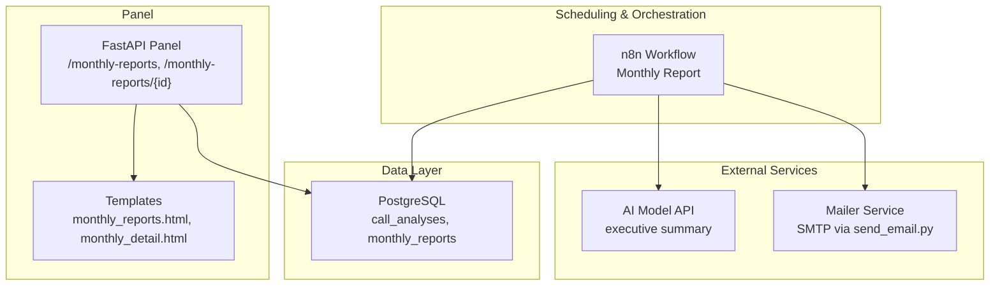
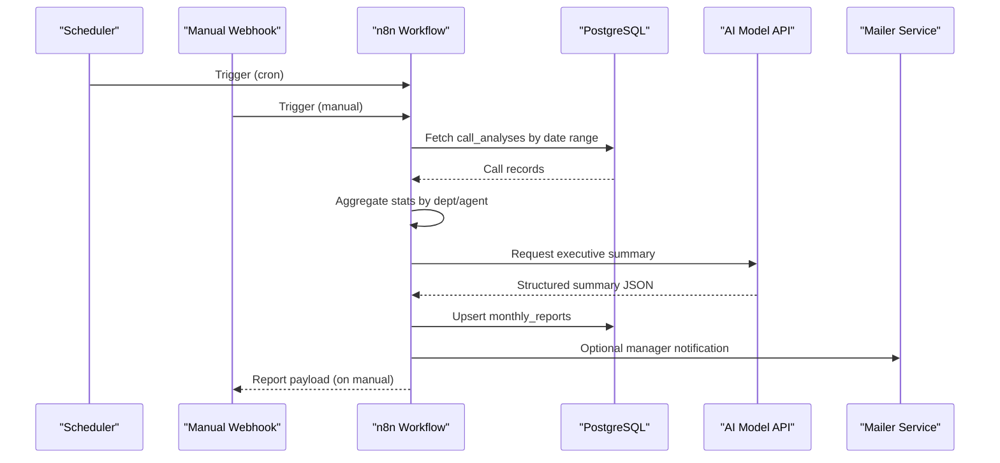
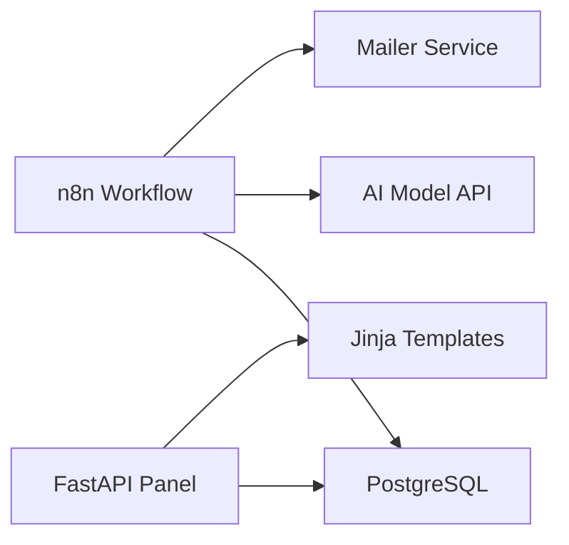

# Monthly Report Workflow

<cite>
**Referenced Files in This Document**
- [atlas-call-intelligence-monthly-report.json](file://docker/n8n/workflows/atlas-call-intelligence-monthly-report.json)
- [atlas-call-intelligence-v1.json](file://docker/n8n/workflows/atlas-call-intelligence-v1.json)
- [main.py](file://docker/panel/app/main.py)
- [queries.py](file://docker/panel/app/queries.py)
- [monthly_reports.html](file://docker/panel/templates/monthly_reports.html)
- [monthly_detail.html](file://docker/panel/templates/monthly_detail.html)
- [001_call_intelligence.sql](file://docker/postgres/init/001_call_intelligence.sql)
- [docker-compose.yml](file://docker/docker-compose.yml)
- [send_email.py](file://docker/mailer/send_email.py)
</cite>

## Table of Contents
1. Introduction
2. Project Structure
3. Core Components
4. Architecture Overview
5. Detailed Component Analysis
6. Dependency Analysis
7. Performance Considerations
8. Troubleshooting Guide
9. Conclusion
10. Appendices

## Introduction
This document explains the Monthly Report Workflow that automatically generates comprehensive analytics reports from call intelligence data. It covers how the system aggregates call metrics, computes performance statistics, produces AI-powered executive summaries, schedules report generation, and stores results for viewing in a management panel. It also documents configuration options for scheduling, recipients, and delivery integrations, as well as customization and filtering capabilities.

## Project Structure
The monthly reporting system spans several services:
- n8n workflow orchestrates scheduled or manual report generation, data aggregation, AI summary creation, and persistence.
- PostgreSQL stores per-call analyses and monthly report artifacts.
- A FastAPI panel exposes UI pages to list and view monthly reports.
- A mailer service provides email delivery used by related workflows.

**Diagram sources**
- [atlas-call-intelligence-monthly-report.json:1-172](file://docker/n8n/workflows/atlas-call-intelligence-monthly-report.json#L1-L172)
- [001_call_intelligence.sql:1-45](file://docker/postgres/init/001_call_intelligence.sql#L1-L45)
- [main.py:156-172](file://docker/panel/app/main.py#L156-L172)
- [monthly_reports.html:1-23](file://docker/panel/templates/monthly_reports.html#L1-L23)
- [monthly_detail.html:1-8](file://docker/panel/templates/monthly_detail.html#L1-L8)
- [docker-compose.yml:26-57](file://docker/docker-compose.yml#L26-L57)
- [send_email.py:1-39](file://docker/mailer/send_email.py#L1-L39)

**Section sources**
- [atlas-call-intelligence-monthly-report.json:1-172](file://docker/n8n/workflows/atlas-call-intelligence-monthly-report.json#L1-L172)
- [001_call_intelligence.sql:1-45](file://docker/postgres/init/001_call_intelligence.sql#L1-L45)
- [main.py:156-172](file://docker/panel/app/main.py#L156-L172)
- [monthly_reports.html:1-23](file://docker/panel/templates/monthly_reports.html#L1-L23)
- [monthly_detail.html:1-8](file://docker/panel/templates/monthly_detail.html#L1-L8)
- [docker-compose.yml:26-57](file://docker/docker-compose.yml#L26-L57)
- [send_email.py:1-39](file://docker/mailer/send_email.py#L1-L39)

## Core Components
- Scheduling and triggers:
  - Cron-based schedule to run on the first day of each month at a configured hour.
  - Manual webhook trigger to generate a report on demand with optional year/month parameters.
- Data aggregation:
  - Queries call_analyses within the computed period and aggregates metrics by department and agent.
  - Computes averages and counts for satisfaction, quality, purchase intent, high-priority tickets, and coaching needs.
- AI executive summary:
  - Sends aggregated data to an AI model endpoint to produce a structured Persian-language executive summary and recommendations.
- Report assembly and storage:
  - Builds a final JSON report including metadata, department stats, agent rankings, top performers, coaching flags, and AI insights.
  - Persists the report into monthly_reports with upsert semantics.
- Panel integration:
  - FastAPI endpoints serve a list and detail view of monthly reports using Jinja templates.

**Section sources**
- [atlas-call-intelligence-monthly-report.json:11-133](file://docker/n8n/workflows/atlas-call-intelligence-monthly-report.json#L11-L133)
- [queries.py:195-211](file://docker/panel/app/queries.py#L195-L211)
- [main.py:156-172](file://docker/panel/app/main.py#L156-L172)

## Architecture Overview
The workflow is event-driven with two entry points:
- Scheduled execution (cron)
- Manual execution (webhook)

Both flows compute the reporting period, fetch relevant calls, aggregate statistics, request an AI summary, build the report, persist it, and optionally notify managers.

**Diagram sources**
- [atlas-call-intelligence-monthly-report.json:11-133](file://docker/n8n/workflows/atlas-call-intelligence-monthly-report.json#L11-L133)
- [001_call_intelligence.sql:34-45](file://docker/postgres/init/001_call_intelligence.sql#L34-L45)
- [docker-compose.yml:62-79](file://docker/docker-compose.yml#L62-L79)

## Detailed Component Analysis

### Scheduling and Triggers
- Cron expression defines monthly execution timing.
- Manual webhook accepts optional year and month; defaults to previous month if not provided.
- The workflow returns a consistent payload for both triggers.

Configuration highlights:
- Cron interval set to monthly execution.
- Webhook path exposed for manual invocation.
- Environment variables control AI model and API URL.

**Section sources**
- [atlas-call-intelligence-monthly-report.json:11-49](file://docker/n8n/workflows/atlas-call-intelligence-monthly-report.json#L11-L49)
- [docker-compose.yml:34-51](file://docker/docker-compose.yml#L34-L51)

### Data Aggregation Process
- Period calculation:
  - Determines start and end dates based on selected or default month.
- Data retrieval:
  - Selects call records within the period ordered by call date.
- Aggregation logic:
  - Groups by agent and department.
  - Computes per-agent metrics: total calls, average scores, review flags, high-priority ticket counts, success score.
  - Computes per-department metrics: totals, averages, success rate percentage, review counts.
  - Derives top performers and agents needing coaching based on thresholds.

Complexity considerations:
- Aggregation runs in O(N) over fetched rows.
- Sorting and slicing are bounded by small constants (top N).

**Section sources**
- [atlas-call-intelligence-monthly-report.json:50-79](file://docker/n8n/workflows/atlas-call-intelligence-monthly-report.json#L50-L79)

### AI Executive Summary
- Constructs a prompt with aggregated data and instructions to return a structured JSON containing executive summary, department insights, strengths, issues, recommendations, training priorities, and KPI highlights.
- Calls an external AI endpoint with configurable model and authentication.
- Normalizes response formats and parses JSON output; falls back gracefully when parsing fails.

Error handling:
- If no calls exist, short-circuits to an empty report message.
- Graceful fallback for AI response parsing errors.

**Section sources**
- [atlas-call-intelligence-monthly-report.json:80-99](file://docker/n8n/workflows/atlas-call-intelligence-monthly-report.json#L80-L99)

### Report Assembly and Storage
- Assembles final report JSON including metadata (month, generated timestamp, version), department stats, agent rankings, top performers, coaching flags, and AI executive section.
- Persists report to monthly_reports with upsert behavior to avoid duplicates per month and department.
- On manual trigger, responds with the full report payload.

Idempotency:
- Upsert ensures repeated runs overwrite the latest report for the same month/department.

**Section sources**
- [atlas-call-intelligence-monthly-report.json:100-133](file://docker/n8n/workflows/atlas-call-intelligence-monthly-report.json#L100-L133)

### Panel Integration and Viewing
- FastAPI routes:
  - Lists recent monthly reports with pagination limit.
  - Displays detailed JSON for a specific report ID.
- Templates:
  - Renders a table of reports with links to details.
  - Shows formatted JSON for inspection.

Authentication:
- Optional simple password protection via cookie-based middleware.

**Section sources**
- [main.py:156-172](file://docker/panel/app/main.py#L156-L172)
- [monthly_reports.html:1-23](file://docker/panel/templates/monthly_reports.html#L1-L23)
- [monthly_detail.html:1-8](file://docker/panel/templates/monthly_detail.html#L1-L8)

### Email Distribution and Notifications
- The monthly workflow builds a manager notification object with recipient, subject, and body text.
- The related call analysis workflow demonstrates sending emails via the mailer service.
- The mailer service uses SMTP settings from environment variables to send messages.

Notes:
- Monthly workflow currently prepares notifications but does not include a dedicated email node in the shown flow; extend the workflow to call the mailer service if automatic email delivery is desired.

**Section sources**
- [atlas-call-intelligence-monthly-report.json:90-99](file://docker/n8n/workflows/atlas-call-intelligence-monthly-report.json#L90-L99)
- [atlas-call-intelligence-v1.json:105-120](file://docker/n8n/workflows/atlas-call-intelligence-v1.json#L105-L120)
- [send_email.py:1-39](file://docker/mailer/send_email.py#L1-L39)
- [docker-compose.yml:62-79](file://docker/docker-compose.yml#L62-L79)

### Database Schema and Historical Data
- call_analyses stores per-call AI outputs and key metrics with indexes for efficient querying by date, agent, and department.
- monthly_reports stores generated reports with unique constraints per month and department.

Historical analysis:
- Panel queries support listing multiple months and drilling into any stored report.
- Indexes optimize time-range scans and department/agent filters.

**Section sources**
- [001_call_intelligence.sql:1-45](file://docker/postgres/init/001_call_intelligence.sql#L1-L45)
- [queries.py:195-211](file://docker/panel/app/queries.py#L195-L211)

## Dependency Analysis
- n8n workflow depends on:
  - PostgreSQL for reading call_analyses and writing monthly_reports.
  - External AI API for generating executive summaries.
  - Optional mailer service for email distribution.
- Panel depends on:
  - PostgreSQL for retrieving monthly reports.
  - Jinja templates for rendering views.
- Docker Compose wires services together and injects environment variables for configuration.

**Diagram sources**
- [atlas-call-intelligence-monthly-report.json:11-133](file://docker/n8n/workflows/atlas-call-intelligence-monthly-report.json#L11-L133)
- [docker-compose.yml:26-98](file://docker/docker-compose.yml#L26-L98)

**Section sources**
- [docker-compose.yml:26-98](file://docker/docker-compose.yml#L26-L98)

## Performance Considerations
- Query efficiency:
  - Use date-range filters and existing indexes on call_date, department, and agent_id to minimize scan times.
- Aggregation scale:
  - Aggregation is linear in number of calls; consider partitioning or archiving older data if volumes grow significantly.
- AI latency:
  - Executive summary generation adds network latency; consider caching or batching if needed.
- Idempotent writes:
  - Upsert prevents duplicate reports and reduces storage growth.

[No sources needed since this section provides general guidance]

## Troubleshooting Guide
Common issues and resolutions:
- No calls found for the period:
  - The workflow returns an empty report message; verify call ingestion and date ranges.
- AI parsing failures:
  - The workflow handles malformed responses by falling back to raw text; ensure the model returns valid JSON structure.
- Email delivery failures:
  - Ensure SMTP credentials are configured and the mailer service is reachable; check error logs from the mailer.
- Panel access:
  - If password protection is enabled, ensure the correct cookie is set after login.

Operational checks:
- Verify cron expression and timezone settings in n8n environment.
- Confirm database connectivity and credentials.
- Validate AI API URL and keys.

**Section sources**
- [atlas-call-intelligence-monthly-report.json:70-99](file://docker/n8n/workflows/atlas-call-intelligence-monthly-report.json#L70-L99)
- [atlas-call-intelligence-v1.json:105-120](file://docker/n8n/workflows/atlas-call-intelligence-v1.json#L105-L120)
- [send_email.py:1-39](file://docker/mailer/send_email.py#L1-L39)
- [docker-compose.yml:34-51](file://docker/docker-compose.yml#L34-L51)

## Conclusion
The Monthly Report Workflow provides a robust, automated pipeline for generating comprehensive analytics from call intelligence data. It combines deterministic aggregation with AI-generated insights, persists results for historical analysis, and integrates with a management panel for easy consumption. With configurable scheduling, flexible triggers, and extensible email distribution, it supports both operational and strategic reporting needs.

[No sources needed since this section summarizes without analyzing specific files]

## Appendices

### Configuration Options
- Scheduling:
  - Cron expression for monthly execution.
  - Timezone settings in n8n environment.
- AI integration:
  - API URL and model name via environment variables.
- Email:
  - SMTP host, port, user, and password for the mailer service.
  - Manager email address for notifications.
- Panel:
  - Title and optional password for basic authentication.

**Section sources**
- [docker-compose.yml:34-51](file://docker/docker-compose.yml#L34-L51)
- [docker-compose.yml:80-98](file://docker/docker-compose.yml#L80-L98)
- [send_email.py:1-39](file://docker/mailer/send_email.py#L1-L39)

### Example Triggers and Custom Configurations
- Manual trigger:
  - Invoke the monthly report webhook with optional year and month to generate a report for a specific period.
- Custom report configurations:
  - Adjust cron expression to change frequency.
  - Modify department filters or thresholds in aggregation logic to tailor insights.
- Integration with reporting services:
  - Extend the workflow to call external reporting APIs or push results to dashboards.

**Section sources**
- [atlas-call-intelligence-monthly-report.json:28-49](file://docker/n8n/workflows/atlas-call-intelligence-monthly-report.json#L28-L49)
- [atlas-call-intelligence-monthly-report.json:50-79](file://docker/n8n/workflows/atlas-call-intelligence-monthly-report.json#L50-L79)

### Data Filtering Capabilities
- Date range filtering:
  - Reports are scoped to the calculated period based on month/year inputs.
- Department and agent filters:
  - Aggregation groups by department and agent; additional filters can be added to narrow scope.
- Historical analysis:
  - Panel lists multiple months; drill into any report for detailed JSON inspection.

**Section sources**
- [atlas-call-intelligence-monthly-report.json:40-79](file://docker/n8n/workflows/atlas-call-intelligence-monthly-report.json#L40-L79)
- [queries.py:195-211](file://docker/panel/app/queries.py#L195-L211)