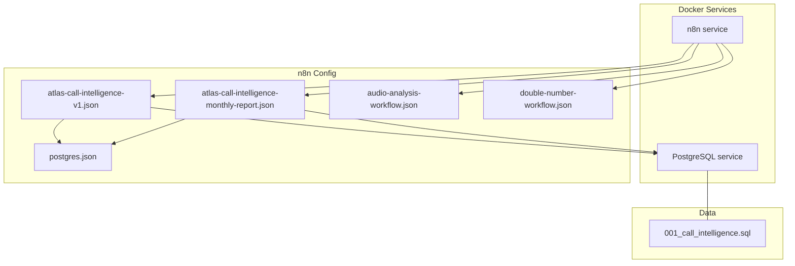
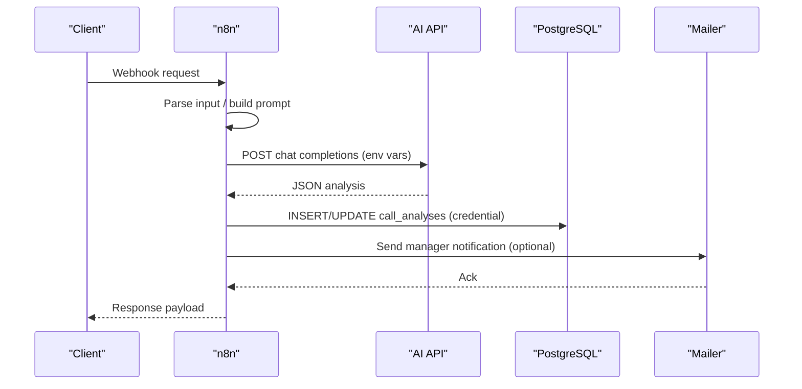
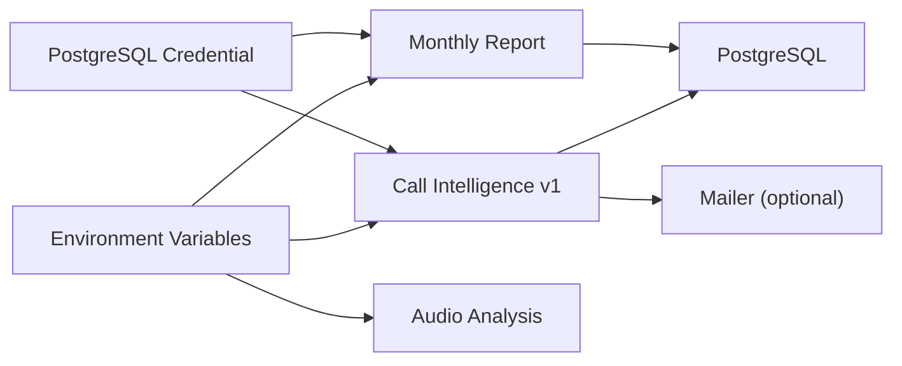

# Workflow Configuration

<cite>
**Referenced Files in This Document**
- [docker-compose.yml](file://docker/docker-compose.yml)
- [postgres.json](file://docker/n8n/credentials/postgres.json)
- [atlas-call-intelligence-v1.json](file://docker/n8n/workflows/atlas-call-intelligence-v1.json)
- [atlas-call-intelligence-monthly-report.json](file://docker/n8n/workflows/atlas-call-intelligence-monthly-report.json)
- [audio-analysis-workflow.json](file://docker/n8n/workflows/audio-analysis-workflow.json)
- [double-number-workflow.json](file://docker/n8n/workflows/double-number-workflow.json)
- [001_call_intelligence.sql](file://docker/postgres/init/001_call_intelligence.sql)
- [README.md (Atlas Call Intelligence v1)](file://03_Products/Atlas Call Intelligence/V1/README.md)
</cite>

## Table of Contents
1. [Introduction](#introduction)
2. [Project Structure](#project-structure)
3. [Core Components](#core-components)
4. [Architecture Overview](#architecture-overview)
5. [Detailed Component Analysis](#detailed-component-analysis)
6. [Dependency Analysis](#dependency-analysis)
7. [Performance Considerations](#performance-considerations)
8. [Troubleshooting Guide](#troubleshooting-guide)
9. [Conclusion](#conclusion)
10. [Appendices](#appendices)

## Introduction
This document explains how workflow configuration is managed across the n8n workflows in this project, focusing on environment variables, credentials, and workflow settings. It covers the configuration structure, environment-specific settings, credential management, activation controls, setup procedures for new workflows, validation practices, deployment considerations, versioning, backup procedures, best practices, security, and performance optimization tips.

## Project Structure
The n8n-related configuration and workflows are organized under docker/n8n:
- Workflows: JSON definitions for each automation flow
- Credentials: Local credential files used by workflows
- Docker Compose: Service definitions and environment variables for n8n and Postgres
- Database schema: SQL to initialize tables used by workflows

**Diagram sources**
- [docker-compose.yml:26-61](file://docker/docker-compose.yml#L26-L61)
- [atlas-call-intelligence-v1.json:1-160](file://docker/n8n/workflows/atlas-call-intelligence-v1.json#L1-L160)
- [atlas-call-intelligence-monthly-report.json:1-172](file://docker/n8n/workflows/atlas-call-intelligence-monthly-report.json#L1-L172)
- [audio-analysis-workflow.json:1-139](file://docker/n8n/workflows/audio-analysis-workflow.json#L1-L139)
- [double-number-workflow.json:1-80](file://docker/n8n/workflows/double-number-workflow.json#L1-L80)
- [postgres.json:1-15](file://docker/n8n/credentials/postgres.json#L1-L15)
- [001_call_intelligence.sql:1-45](file://docker/postgres/init/001_call_intelligence.sql#L1-L45)

**Section sources**
- [docker-compose.yml:26-61](file://docker/docker-compose.yml#L26-L61)
- [atlas-call-intelligence-v1.json:1-160](file://docker/n8n/workflows/atlas-call-intelligence-v1.json#L1-L160)
- [atlas-call-intelligence-monthly-report.json:1-172](file://docker/n8n/workflows/atlas-call-intelligence-monthly-report.json#L1-L172)
- [audio-analysis-workflow.json:1-139](file://docker/n8n/workflows/audio-analysis-workflow.json#L1-L139)
- [double-number-workflow.json:1-80](file://docker/n8n/workflows/double-number-workflow.json#L1-L80)
- [postgres.json:1-15](file://docker/n8n/credentials/postgres.json#L1-L15)
- [001_call_intelligence.sql:1-45](file://docker/postgres/init/001_call_intelligence.sql#L1-L45)

## Core Components
- Environment variables for n8n and integrations are defined in the compose file. They include database connection details, AI API endpoints and keys, model selection, email recipients, and feature toggles.
- Credentials for PostgreSQL are stored as a local JSON file and referenced by workflow nodes.
- Workflows define triggers (webhook/schedule), processing logic (code/function/http), data persistence (PostgreSQL), and notifications (email via HTTP).
- Database schema defines tables for call analyses and monthly reports with indexes for query performance.

Key environment variables exposed to n8n:
- DB_TYPE, DB_POSTGRESDB_HOST, DB_POSTGRESDB_PORT, DB_POSTGRESDB_DATABASE, DB_POSTGRESDB_USER, DB_POSTGRESDB_PASSWORD
- GENERIC_TIMEZONE, TZ
- API_URL, TRANSCRIPTION_API_URL, API_KEY, AI_MODEL
- ATLAS_MANAGER_EMAIL, ATLAS_SMTP_FROM
- N8N_SECURE_COOKIE, N8N_BLOCK_ENV_ACCESS_IN_NODE

**Section sources**
- [docker-compose.yml:34-54](file://docker/docker-compose.yml#L34-L54)
- [postgres.json:1-15](file://docker/n8n/credentials/postgres.json#L1-L15)
- [atlas-call-intelligence-v1.json:47-61](file://docker/n8n/workflows/atlas-call-intelligence-v1.json#L47-L61)
- [atlas-call-intelligence-monthly-report.json:50-69](file://docker/n8n/workflows/atlas-call-intelligence-monthly-report.json#L50-L69)
- [001_call_intelligence.sql:4-45](file://docker/postgres/init/001_call_intelligence.sql#L4-L45)

## Architecture Overview
The system runs n8n alongside PostgreSQL. Workflows consume environment variables for external services (AI APIs, transcription) and use credentials to connect to the database. Some workflows send emails via an internal mailer service.

**Diagram sources**
- [atlas-call-intelligence-v1.json:10-143](file://docker/n8n/workflows/atlas-call-intelligence-v1.json#L10-L143)
- [docker-compose.yml:62-79](file://docker/docker-compose.yml#L62-L79)
- [001_call_intelligence.sql:4-27](file://docker/postgres/init/001_call_intelligence.sql#L4-L27)

## Detailed Component Analysis

### Environment Variables and Secrets Management
- Centralized in docker-compose.yml under the n8n service.
- Sensitive values (API keys, SMTP passwords) should be provided via host .env or secrets; avoid hardcoding.
- Timezone is set to Asia/Tehran for consistent scheduling.
- Feature flags control cookie security and environment access within nodes.

Environment variable usage in workflows:
- AI endpoint and key: API_URL, API_KEY, AI_MODEL
- Email recipient: ATLAS_MANAGER_EMAIL
- Optional SMTP sender: ATLAS_SMTP_FROM

Validation guidance:
- Ensure AI_API_URL points to a reachable endpoint.
- Confirm AI_MODEL matches provider expectations.
- Verify ATLAS_MANAGER_EMAIL is set when email notifications are required.

**Section sources**
- [docker-compose.yml:34-54](file://docker/docker-compose.yml#L34-L54)
- [atlas-call-intelligence-v1.json:47-61](file://docker/n8n/workflows/atlas-call-intelligence-v1.json#L47-L61)
- [atlas-call-intelligence-monthly-report.json:80-93](file://docker/n8n/workflows/atlas-call-intelligence-monthly-report.json#L80-L93)

### Credential Management
- PostgreSQL credentials are defined in postgres.json and referenced by name/id in workflow nodes.
- The same credential object is reused across multiple workflows that write to call_analyses and monthly_reports.

Best practices:
- Keep postgres.json out of version control in production; mount it at runtime or use n8n’s credential UI.
- Rotate database passwords regularly and update both compose and credential files.
- Use least-privilege database users for n8n.

**Section sources**
- [postgres.json:1-15](file://docker/n8n/credentials/postgres.json#L1-L15)
- [atlas-call-intelligence-v1.json:73-93](file://docker/n8n/workflows/atlas-call-intelligence-v1.json#L73-L93)
- [atlas-call-intelligence-monthly-report.json:100-120](file://docker/n8n/workflows/atlas-call-intelligence-monthly-report.json#L100-L120)

### Workflow Activation Controls
- Each workflow has an active flag controlling whether it executes automatically.
- Monthly report workflow includes both a schedule trigger and a manual webhook trigger.

Activation checklist:
- Set active to true only after validating environment variables and credentials.
- For scheduled workflows, verify cron expressions and timezone settings.
- Test webhooks before enabling them in production.

**Section sources**
- [atlas-call-intelligence-v1.json:1-10](file://docker/n8n/workflows/atlas-call-intelligence-v1.json#L1-L10)
- [atlas-call-intelligence-monthly-report.json:1-10](file://docker/n8n/workflows/atlas-call-intelligence-monthly-report.json#L1-L10)

### Data Persistence and Schema
- call_analyses stores per-call AI outputs and metadata.
- monthly_reports stores aggregated monthly reports.
- Indexes improve query performance for time-based and agent-based queries.

Operational notes:
- Ensure schema is applied before running workflows.
- Monitor table growth and consider archival strategies for long-term storage.

**Section sources**
- [001_call_intelligence.sql:4-45](file://docker/postgres/init/001_call_intelligence.sql#L4-L45)

### Workflow Parameter Customization
- Workflows read parameters from environment variables and node inputs.
- Example patterns:
  - AI endpoint/model via $env.API_URL and $env.AI_MODEL
  - Email recipient via $env.ATLAS_MANAGER_EMAIL
  - Static overrides via staticData where applicable

Customization steps:
- Update environment variables in docker-compose or host .env.
- Adjust node parameters for timeouts, retries, and payloads.
- Pin versions of models or endpoints if stability is critical.

**Section sources**
- [atlas-call-intelligence-v1.json:47-61](file://docker/n8n/workflows/atlas-call-intelligence-v1.json#L47-L61)
- [atlas-call-intelligence-monthly-report.json:80-93](file://docker/n8n/workflows/atlas-call-intelligence-monthly-report.json#L80-L93)
- [audio-analysis-workflow.json:32-45](file://docker/n8n/workflows/audio-analysis-workflow.json#L32-L45)

### Setup Process for New Workflows
Recommended steps:
1. Define environment variables in docker-compose or .env.
2. Create or update credentials in postgres.json or n8n UI.
3. Add workflow JSON to docker/n8n/workflows.
4. Import into n8n and configure nodes to reference env vars and credentials.
5. Validate connections to AI API and PostgreSQL.
6. Activate triggers (webhook/schedule) after testing.
7. Tag and document the workflow for discoverability.

Reference example:
- See Atlas Call Intelligence v1 setup instructions and environment variables.

**Section sources**
- [README.md (Atlas Call Intelligence v1):30-69](file://03_Products/Atlas Call Intelligence/V1/README.md#L30-L69)
- [docker-compose.yml:34-54](file://docker/docker-compose.yml#L34-L54)
- [postgres.json:1-15](file://docker/n8n/credentials/postgres.json#L1-L15)

### Configuration Validation
- Validate AI connectivity by sending a test request using API_URL and API_KEY.
- Validate database connectivity by executing a simple query through a test node.
- Validate email delivery by triggering a sample notification.
- Enforce timeouts and retries on external calls to prevent hangs.

**Section sources**
- [atlas-call-intelligence-v1.json:47-61](file://docker/n8n/workflows/atlas-call-intelligence-v1.json#L47-L61)
- [atlas-call-intelligence-v1.json:105-120](file://docker/n8n/workflows/atlas-call-intelligence-v1.json#L105-L120)

### Deployment Considerations
- Use separate .env files per environment (dev/staging/prod).
- Mount persistent volumes for n8n data and Postgres data.
- Pin container images to specific versions for reproducibility.
- Configure health checks and restart policies.
- Secure cookies and restrict environment access in production.

**Section sources**
- [docker-compose.yml:26-61](file://docker/docker-compose.yml#L26-L61)
- [docker-compose.yml:52-54](file://docker/docker-compose.yml#L52-L54)

### Workflow Versioning and Backup
- Workflows include metadata such as createdAt, updatedAt, id, and tags.
- Maintain workflow JSON in version control to track changes.
- Back up n8n data volume and Postgres data volume regularly.
- Export workflows from n8n UI as part of disaster recovery.

**Section sources**
- [atlas-call-intelligence-v1.json:1-10](file://docker/n8n/workflows/atlas-call-intelligence-v1.json#L1-L10)
- [atlas-call-intelligence-monthly-report.json:1-10](file://docker/n8n/workflows/atlas-call-intelligence-monthly-report.json#L1-L10)
- [docker-compose.yml:55-61](file://docker/docker-compose.yml#L55-L61)

### Security Considerations
- Do not commit secrets to repositories; use environment variables or secret managers.
- Restrict N8N_BLOCK_ENV_ACCESS_IN_NODE to true in production to prevent accidental exposure.
- Use HTTPS for external endpoints and validate certificates.
- Limit webhook paths and authenticate callers where possible.
- Apply least privilege to database users.

**Section sources**
- [docker-compose.yml:52-54](file://docker/docker-compose.yml#L52-L54)
- [atlas-call-intelligence-v1.json:47-61](file://docker/n8n/workflows/atlas-call-intelligence-v1.json#L47-L61)

### Performance Optimization Tips
- Use appropriate AI_MODEL for latency vs. quality trade-offs.
- Set reasonable timeouts for HTTP requests to external services.
- Leverage database indexes already present for efficient queries.
- Batch operations where possible and avoid unnecessary loops.
- Monitor execution times and optimize code nodes for large datasets.

**Section sources**
- [docker-compose.yml:45-49](file://docker/docker-compose.yml#L45-L49)
- [atlas-call-intelligence-v1.json:105-120](file://docker/n8n/workflows/atlas-call-intelligence-v1.json#L105-L120)
- [001_call_intelligence.sql:29-32](file://docker/postgres/init/001_call_intelligence.sql#L29-L32)

## Dependency Analysis
Workflows depend on:
- Environment variables for external services
- PostgreSQL credentials for data persistence
- Optional mailer service for notifications

**Diagram sources**
- [docker-compose.yml:34-54](file://docker/docker-compose.yml#L34-L54)
- [postgres.json:1-15](file://docker/n8n/credentials/postgres.json#L1-L15)
- [atlas-call-intelligence-v1.json:47-93](file://docker/n8n/workflows/atlas-call-intelligence-v1.json#L47-L93)
- [atlas-call-intelligence-monthly-report.json:50-120](file://docker/n8n/workflows/atlas-call-intelligence-monthly-report.json#L50-L120)

**Section sources**
- [docker-compose.yml:34-54](file://docker/docker-compose.yml#L34-L54)
- [postgres.json:1-15](file://docker/n8n/credentials/postgres.json#L1-L15)
- [atlas-call-intelligence-v1.json:47-93](file://docker/n8n/workflows/atlas-call-intelligence-v1.json#L47-L93)
- [atlas-call-intelligence-monthly-report.json:50-120](file://docker/n8n/workflows/atlas-call-intelligence-monthly-report.json#L50-L120)

## Performance Considerations
- Choose lightweight AI models for high-throughput scenarios.
- Tune timeouts and concurrency limits in HTTP nodes.
- Use database indexes to speed up reporting queries.
- Avoid heavy computations inside tight loops; precompute where possible.
- Cache repeated lookups if supported by your stack.

[No sources needed since this section provides general guidance]

## Troubleshooting Guide
Common issues and resolutions:
- AI API unreachable: Check API_URL and network reachability; verify API_KEY format.
- Database connection failures: Validate credentials and ensure Postgres is healthy; confirm schema is initialized.
- Email not sent: Verify ATLAS_MANAGER_EMAIL and mailer service availability; check timeouts.
- Cron not firing: Confirm timezone settings and cron expression correctness.
- Webhook errors: Validate path and method; inspect request payload structure.

Diagnostic steps:
- Inspect n8n execution logs for error messages.
- Test endpoints independently outside n8n.
- Run minimal workflows to isolate issues.

**Section sources**
- [atlas-call-intelligence-v1.json:47-61](file://docker/n8n/workflows/atlas-call-intelligence-v1.json#L47-L61)
- [atlas-call-intelligence-v1.json:105-120](file://docker/n8n/workflows/atlas-call-intelligence-v1.json#L105-L120)
- [atlas-call-intelligence-monthly-report.json:10-27](file://docker/n8n/workflows/atlas-call-intelligence-monthly-report.json#L10-L27)

## Conclusion
This project centralizes workflow configuration through environment variables and credentials, enabling flexible, secure, and maintainable automation. By following the outlined setup, validation, versioning, and operational practices, teams can reliably deploy and operate n8n workflows across environments while ensuring security and performance.

[No sources needed since this section summarizes without analyzing specific files]

## Appendices

### Appendix A: Environment Variable Reference
- DB_*: Database connection settings for n8n
- API_URL, TRANSCRIPTION_API_URL: External service endpoints
- API_KEY: Authentication token for AI services
- AI_MODEL: Model identifier for AI responses
- ATLAS_MANAGER_EMAIL: Recipient for manager notifications
- ATLAS_SMTP_FROM: Sender address for emails
- N8N_SECURE_COOKIE, N8N_BLOCK_ENV_ACCESS_IN_NODE: Security toggles

**Section sources**
- [docker-compose.yml:34-54](file://docker/docker-compose.yml#L34-L54)

### Appendix B: Workflow Examples and Triggers
- Call Intelligence v1: Webhook-triggered analysis pipeline
- Monthly Report: Schedule + webhook triggers for periodic reporting
- Audio Analysis: Simple webhook-to-AI summarization
- Double Number: Minimal webhook code example

**Section sources**
- [atlas-call-intelligence-v1.json:10-143](file://docker/n8n/workflows/atlas-call-intelligence-v1.json#L10-L143)
- [atlas-call-intelligence-monthly-report.json:10-133](file://docker/n8n/workflows/atlas-call-intelligence-monthly-report.json#L10-L133)
- [audio-analysis-workflow.json:3-79](file://docker/n8n/workflows/audio-analysis-workflow.json#L3-L79)
- [double-number-workflow.json:3-47](file://docker/n8n/workflows/double-number-workflow.json#L3-L47)

### Appendix C: Database Schema Summary
- call_analyses: Stores per-call analysis results and metadata
- monthly_reports: Stores aggregated monthly reports
- Indexes: Support efficient querying by date, department, and agent

**Section sources**
- [001_call_intelligence.sql:4-45](file://docker/postgres/init/001_call_intelligence.sql#L4-L45)