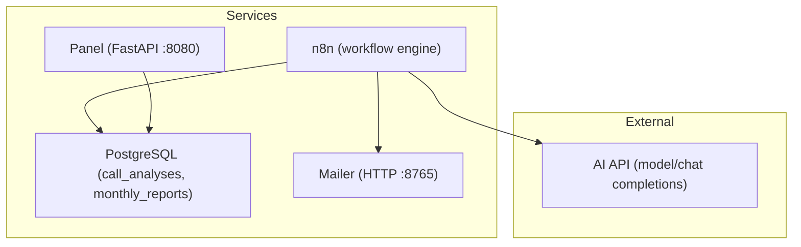
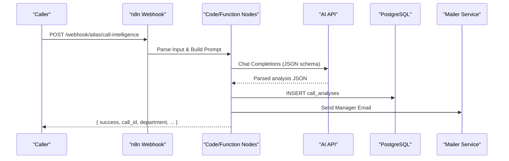
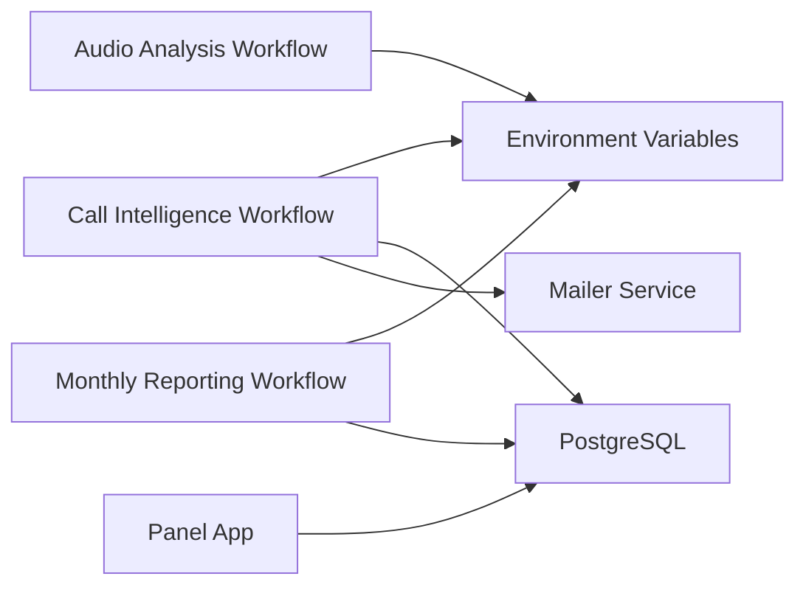
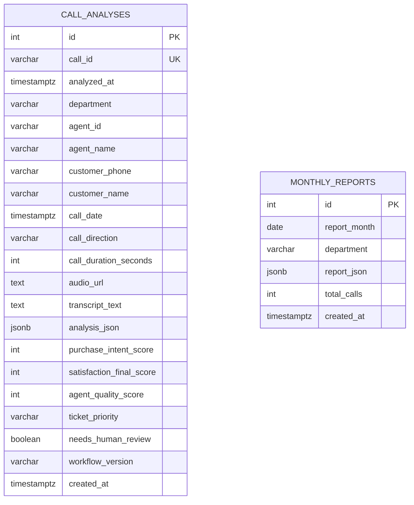

# Workflow Engine

<cite>
**Referenced Files in This Document**
- [atlas-call-intelligence-v1.json](file://docker/n8n/workflows/atlas-call-intelligence-v1.json)
- [audio-analysis-workflow.json](file://docker/n8n/workflows/audio-analysis-workflow.json)
- [atlas-call-intelligence-monthly-report.json](file://docker/n8n/workflows/atlas-call-intelligence-monthly-report.json)
- [double-number-workflow.json](file://docker/n8n/workflows/double-number-workflow.json)
- [docker-compose.yml](file://docker/docker-compose.yml)
- [001_call_intelligence.sql](file://docker/postgres/init/001_call_intelligence.sql)
- [main.py](file://docker/panel/app/main.py)
- [README.md](file://03_Products/Atlas Call Intelligence/V1/README.md)
</cite>

## Table of Contents
1. Introduction
2. Project Structure
3. Core Components
4. Architecture Overview
5. Detailed Component Analysis
6. Dependency Analysis
7. Performance Considerations
8. Troubleshooting Guide
9. Conclusion
10. Appendices

## Introduction
This document explains the n8n-based Workflow Engine that powers Atlas Call Intelligence. It covers workflow architecture, node types, trigger mechanisms, and data flow patterns across three primary workflows:
- Call intelligence workflow (real-time call analysis)
- Audio analysis workflow (lightweight transcript summarization)
- Monthly reporting workflow (scheduled and manual report generation)

It also provides conceptual overviews for beginners and technical details for developers on node configuration, webhook triggers, and data transformations.

## Project Structure
The system is containerized with Docker Compose and includes:
- n8n orchestrating workflows via webhooks, schedules, HTTP requests, code nodes, and database operations
- PostgreSQL storing call analyses and monthly reports
- A Python mailer service for sending manager notifications
- A FastAPI panel for viewing dashboards and reports

**Diagram sources**
- [docker-compose.yml:26-61](file://docker/docker-compose.yml#L26-L61)
- [docker-compose.yml:62-79](file://docker/docker-compose.yml#L62-L79)
- [docker-compose.yml:80-98](file://docker/docker-compose.yml#L80-L98)

**Section sources**
- [docker-compose.yml:1-98](file://docker/docker-compose.yml#L1-L98)

## Core Components
- Webhook triggers: Accept incoming payloads to start workflows (e.g., call analysis, monthly report).
- Code/Function nodes: Perform input parsing, prompt building, data aggregation, and response formatting.
- HTTP Request nodes: Call external AI APIs or internal services (mailer).
- Database nodes: Persist results into PostgreSQL tables.
- ScheduleTrigger: Runs monthly report generation automatically.
- RespondToWebhook: Returns structured JSON responses to callers.

Key environment variables used by workflows include API_URL, AI_MODEL, ATLAS_MANAGER_EMAIL, and others configured in the n8n service.

**Section sources**
- [docker-compose.yml:34-54](file://docker/docker-compose.yml#L34-L54)
- [atlas-call-intelligence-v1.json:12-24](file://docker/n8n/workflows/atlas-call-intelligence-v1.json#L12-L24)
- [atlas-call-intelligence-monthly-report.json:12-27](file://docker/n8n/workflows/atlas-call-intelligence-monthly-report.json#L12-L27)

## Architecture Overview
High-level flow:
- External systems send audio URLs or transcripts to n8n webhooks.
- n8n builds prompts, calls AI models, parses results, persists them, and optionally notifies managers.
- Monthly reports aggregate stored analyses and generate executive summaries.

**Diagram sources**
- [atlas-call-intelligence-v1.json:12-24](file://docker/n8n/workflows/atlas-call-intelligence-v1.json#L12-L24)
- [atlas-call-intelligence-v1.json:26-46](file://docker/n8n/workflows/atlas-call-intelligence-v1.json#L26-L46)
- [atlas-call-intelligence-v1.json:48-61](file://docker/n8n/workflows/atlas-call-intelligence-v1.json#L48-L61)
- [atlas-call-intelligence-v1.json:63-93](file://docker/n8n/workflows/atlas-call-intelligence-v1.json#L63-L93)
- [atlas-call-intelligence-v1.json:95-120](file://docker/n8n/workflows/atlas-call-intelligence-v1.json#L95-L120)
- [atlas-call-intelligence-v1.json:122-143](file://docker/n8n/workflows/atlas-call-intelligence-v1.json#L122-L143)

## Detailed Component Analysis

### Call Intelligence Workflow
Purpose:
- Ingest call metadata and either an audio URL or a transcript.
- Build a structured prompt for AI analysis.
- Store normalized results and notify managers.

Node types and roles:
- Webhook trigger: Exposes endpoint /webhook/atlas/call-intelligence.
- Code node (Parse Input): Normalizes various field names and validates required inputs.
- Code node (Prepare Analysis Prompt): Constructs a strict JSON schema prompt with context and hints.
- HTTP Request node: Calls AI model using environment-configured API_URL and model.
- Code node (Parse Validate and Enrich): Parses AI output, enriches metadata, prepares email payload.
- Postgres node: Inserts or upserts call analysis records.
- Code node (Forward Data): Passes enriched result downstream.
- HTTP Request node: Sends manager notification to local mailer service.
- Code node (Build Response): Assembles final response including email status.
- RespondToWebhook: Returns JSON to caller.

Data transformation highlights:
- Flexible input mapping from multiple possible keys.
- Strict JSON schema enforcement for AI outputs.
- Aggregation of scores and flags for downstream analytics.

Error handling:
- Validation errors thrown early if transcript/audio missing.
- Non-fatal DB and email failures are tolerated to still return a response.

Practical example:
- Endpoint: POST http://localhost:5678/webhook/atlas/call-intelligence
- Body fields include audioUrl or transcript plus optional metadata like call_id, department, agent_name, customer_phone, call_direction, call_duration_seconds, call_date, product_context.
- Response includes success flag, call_id, department, analysis object, and manager_notification details.

**Section sources**
- [atlas-call-intelligence-v1.json:12-24](file://docker/n8n/workflows/atlas-call-intelligence-v1.json#L12-L24)
- [atlas-call-intelligence-v1.json:26-46](file://docker/n8n/workflows/atlas-call-intelligence-v1.json#L26-L46)
- [atlas-call-intelligence-v1.json:48-61](file://docker/n8n/workflows/atlas-call-intelligence-v1.json#L48-L61)
- [atlas-call-intelligence-v1.json:63-93](file://docker/n8n/workflows/atlas-call-intelligence-v1.json#L63-L93)
- [atlas-call-intelligence-v1.json:95-120](file://docker/n8n/workflows/atlas-call-intelligence-v1.json#L95-L120)
- [atlas-call-intelligence-v1.json:122-143](file://docker/n8n/workflows/atlas-call-intelligence-v1.json#L122-L143)
- [README.md:71-142](file://03_Products/Atlas Call Intelligence/V1/README.md#L71-L142)

### Audio Analysis Workflow
Purpose:
- Lightweight workflow to summarize a transcript and extract key insights such as category, customer request, pain points, sales rep behavior, sentiment, and takeaways.

Node types and roles:
- Webhook trigger: Exposes endpoint /webhook/audio-analysis.
- Function node (Prepare Prompt): Builds a concise prompt for summarization.
- HTTP Request node: Calls AI API with a simple chat completion payload.
- Function node (Format AI Response): Extracts the relevant text or message from varied AI response formats.
- RespondToWebhook: Returns analysis and raw response.

Data transformation highlights:
- Minimal normalization; focuses on extracting core fields from diverse AI outputs.
- Uses environment/static data for API URL fallback.

Practical example:
- Endpoint: POST http://localhost:5678/webhook/audio-analysis
- Body should include transcript (and optionally audioUrl).
- Response includes analysis object and raw AI response for debugging.

**Section sources**
- [audio-analysis-workflow.json:5-18](file://docker/n8n/workflows/audio-analysis-workflow.json#L5-L18)
- [audio-analysis-workflow.json:20-31](file://docker/n8n/workflows/audio-analysis-workflow.json#L20-L31)
- [audio-analysis-workflow.json:33-50](file://docker/n8n/workflows/audio-analysis-workflow.json#L33-L50)
- [audio-analysis-workflow.json:52-63](file://docker/n8n/workflows/audio-analysis-workflow.json#L52-L63)
- [audio-analysis-workflow.json:65-78](file://docker/n8n/workflows/audio-analysis-workflow.json#L65-L78)

### Monthly Reporting Workflow
Purpose:
- Generate monthly performance reports based on stored call analyses.
- Supports both scheduled execution (cron) and manual invocation via webhook.

Node types and roles:
- ScheduleTrigger: Runs at 08:00 on the first day of each month.
- Webhook (Manual Report): Allows on-demand report generation with optional year/month parameters.
- Function node (Calculate Report Period): Determines period boundaries and filters.
- Postgres node: Fetches call_analyses within the period.
- Function node (Aggregate Statistics): Computes per-department and per-agent metrics, rankings, and flags.
- Function node (AI Executive Summary): Generates Persian-language executive summary and recommendations.
- Function node (Build Monthly Report): Structures final report JSON and email body.
- Postgres node: Saves report to monthly_reports table.
- RespondToWebhook: Returns report details for manual triggers.

Data transformation highlights:
- Robust aggregation logic computing averages, counts, and derived success scores.
- AI prompt uses aggregated data to produce actionable insights.
- Report includes meta, department stats, agent rankings, top performers, coaching needs, and sample IDs.

Practical example:
- Scheduled: Automatically runs monthly.
- Manual: POST http://localhost:5678/webhook/atlas/call-intelligence/monthly-report with optional { year, month }.
- Response includes report JSON, total_calls, and metadata.

**Section sources**
- [atlas-call-intelligence-monthly-report.json:12-27](file://docker/n8n/workflows/atlas-call-intelligence-monthly-report.json#L12-L27)
- [atlas-call-intelligence-monthly-report.json:29-49](file://docker/n8n/workflows/atlas-call-intelligence-monthly-report.json#L29-L49)
- [atlas-call-intelligence-monthly-report.json:51-69](file://docker/n8n/workflows/atlas-call-intelligence-monthly-report.json#L51-L69)
- [atlas-call-intelligence-monthly-report.json:71-79](file://docker/n8n/workflows/atlas-call-intelligence-monthly-report.json#L71-L79)
- [atlas-call-intelligence-monthly-report.json:81-89](file://docker/n8n/workflows/atlas-call-intelligence-monthly-report.json#L81-L89)
- [atlas-call-intelligence-monthly-report.json:91-99](file://docker/n8n/workflows/atlas-call-intelligence-monthly-report.json#L91-L99)
- [atlas-call-intelligence-monthly-report.json:101-120](file://docker/n8n/workflows/atlas-call-intelligence-monthly-report.json#L101-L120)
- [atlas-call-intelligence-monthly-report.json:122-133](file://docker/n8n/workflows/atlas-call-intelligence-monthly-report.json#L122-L133)
- [README.md:144-161](file://03_Products/Atlas Call Intelligence/V1/README.md#L144-L161)

### Example: Simple Double Number Workflow
A minimal workflow demonstrates basic webhook-to-code-to-response pattern:
- Webhook accepts a number.
- Code doubles it.
- Respond returns original and result.

Useful for testing webhook connectivity and n8n runtime before integrating complex workflows.

**Section sources**
- [double-number-workflow.json:5-18](file://docker/n8n/workflows/double-number-workflow.json#L5-L18)
- [double-number-workflow.json:20-31](file://docker/n8n/workflows/double-number-workflow.json#L20-L31)
- [double-number-workflow.json:33-46](file://docker/n8n/workflows/double-number-workflow.json#L33-L46)

## Dependency Analysis
Workflows depend on:
- Environment variables for AI API endpoints and credentials.
- PostgreSQL for persistence.
- Optional mailer service for notifications.
- Panel application for visualization and querying stored data.

**Diagram sources**
- [docker-compose.yml:34-54](file://docker/docker-compose.yml#L34-L54)
- [docker-compose.yml:62-79](file://docker/docker-compose.yml#L62-L79)
- [docker-compose.yml:80-98](file://docker/docker-compose.yml#L80-L98)
- [atlas-call-intelligence-v1.json:48-61](file://docker/n8n/workflows/atlas-call-intelligence-v1.json#L48-L61)
- [atlas-call-intelligence-v1.json:74-93](file://docker/n8n/workflows/atlas-call-intelligence-v1.json#L74-L93)
- [atlas-call-intelligence-monthly-report.json:51-69](file://docker/n8n/workflows/atlas-call-intelligence-monthly-report.json#L51-L69)
- [atlas-call-intelligence-monthly-report.json:101-120](file://docker/n8n/workflows/atlas-call-intelligence-monthly-report.json#L101-L120)

**Section sources**
- [docker-compose.yml:1-98](file://docker/docker-compose.yml#L1-L98)
- [001_call_intelligence.sql:4-45](file://docker/postgres/init/001_call_intelligence.sql#L4-L45)

## Performance Considerations
- Use minimal, focused prompts to reduce token usage and latency in AI calls.
- Batch processing: The monthly workflow aggregates efficiently by computing averages and counts in memory after fetching rows.
- Error resilience: Non-critical steps (DB insert, email send) continue on failure to ensure responsiveness.
- Timeouts: Email HTTP request sets a timeout to avoid blocking long-running workflows.
- Indexing: PostgreSQL indexes on analyzed_at, agent_id, department, and call_date improve query performance for reporting.

[No sources needed since this section provides general guidance]

## Troubleshooting Guide
Common issues and resolutions:
- Missing transcript/audio: Ensure at least one of transcript or audioUrl is provided in the call intelligence payload.
- AI API unreachable: Verify API_URL and AI_MODEL environment variables; confirm network access from n8n container.
- Database connection errors: Check PostgreSQL credentials and service health; ensure schema initialization has run.
- Email delivery failures: Confirm mailer service is reachable at host.docker.internal:8765 and ATLAS_MANAGER_EMAIL is set.
- Monthly report empty: If no calls exist for the period, the workflow returns an empty report message; verify call dates and timezone settings.

Debugging techniques:
- Inspect webhook responses for success flags and error messages.
- Review stored analysis_json in call_analyses to validate AI output structure.
- Use the panel dashboard to view recent calls, top performers, and monthly reports.

**Section sources**
- [atlas-call-intelligence-v1.json:26-46](file://docker/n8n/workflows/atlas-call-intelligence-v1.json#L26-L46)
- [atlas-call-intelligence-v1.json:74-93](file://docker/n8n/workflows/atlas-call-intelligence-v1.json#L74-L93)
- [atlas-call-intelligence-v1.json:95-120](file://docker/n8n/workflows/atlas-call-intelligence-v1.json#L95-L120)
- [atlas-call-intelligence-monthly-report.json:71-79](file://docker/n8n/workflows/atlas-call-intelligence-monthly-report.json#L71-L79)
- [main.py:68-80](file://docker/panel/app/main.py#L68-L80)
- [main.py:139-155](file://docker/panel/app/main.py#L139-L155)

## Conclusion
The n8n-based Workflow Engine provides a robust automation backbone for call intelligence and reporting:
- Real-time call analysis with structured outputs and manager notifications.
- Lightweight audio analysis for quick insights.
- Automated monthly reporting with AI-generated executive summaries.
By leveraging webhooks, code/function nodes, HTTP integrations, and database operations, the system scales to handle high-volume call data while maintaining clarity and reliability.

[No sources needed since this section summarizes without analyzing specific files]

## Appendices

### Workflow Node Types Reference
- Webhook: Triggered by HTTP requests; exposes endpoints for inbound events.
- Code/Function: Executes JavaScript/TypeScript to transform data and build prompts.
- HTTP Request: Integrates with external APIs (AI models, mailer).
- Postgres: Reads/writes to PostgreSQL for persistence and queries.
- ScheduleTrigger: Cron-based scheduling for periodic tasks.
- RespondToWebhook: Returns structured JSON responses to callers.

**Section sources**
- [atlas-call-intelligence-v1.json:12-24](file://docker/n8n/workflows/atlas-call-intelligence-v1.json#L12-L24)
- [atlas-call-intelligence-v1.json:26-46](file://docker/n8n/workflows/atlas-call-intelligence-v1.json#L26-L46)
- [atlas-call-intelligence-v1.json:48-61](file://docker/n8n/workflows/atlas-call-intelligence-v1.json#L48-L61)
- [atlas-call-intelligence-v1.json:74-93](file://docker/n8n/workflows/atlas-call-intelligence-v1.json#L74-L93)
- [atlas-call-intelligence-monthly-report.json:12-27](file://docker/n8n/workflows/atlas-call-intelligence-monthly-report.json#L12-L27)
- [atlas-call-intelligence-monthly-report.json:51-69](file://docker/n8n/workflows/atlas-call-intelligence-monthly-report.json#L51-L69)

### Data Models

**Diagram sources**
- [001_call_intelligence.sql:4-45](file://docker/postgres/init/001_call_intelligence.sql#L4-L45)