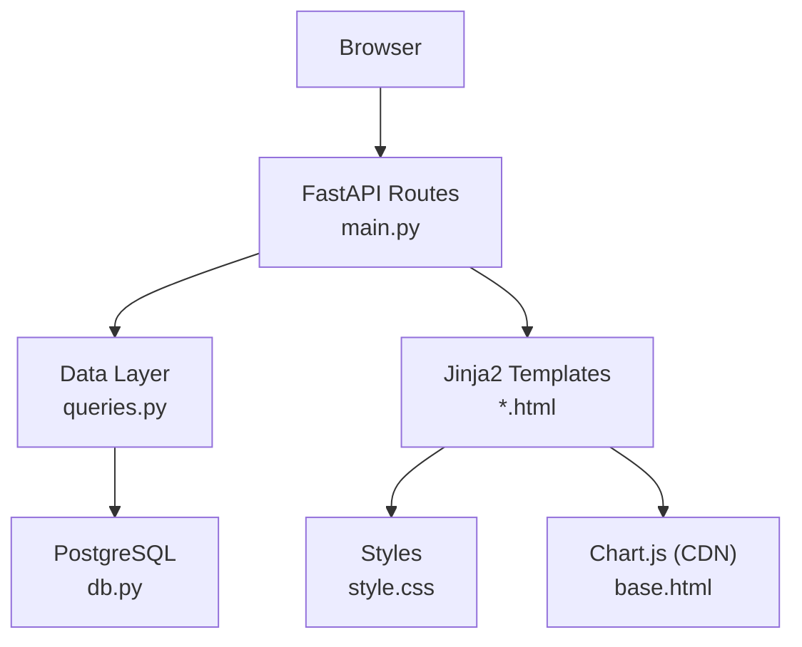
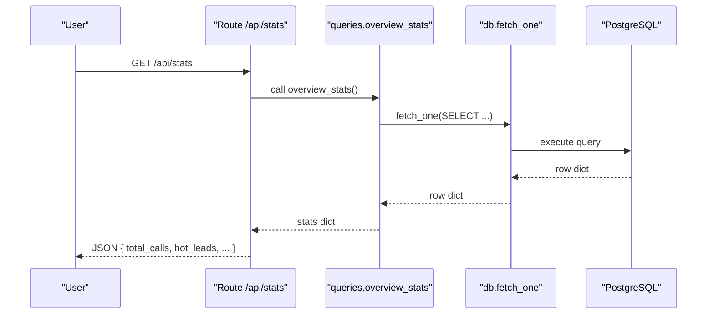
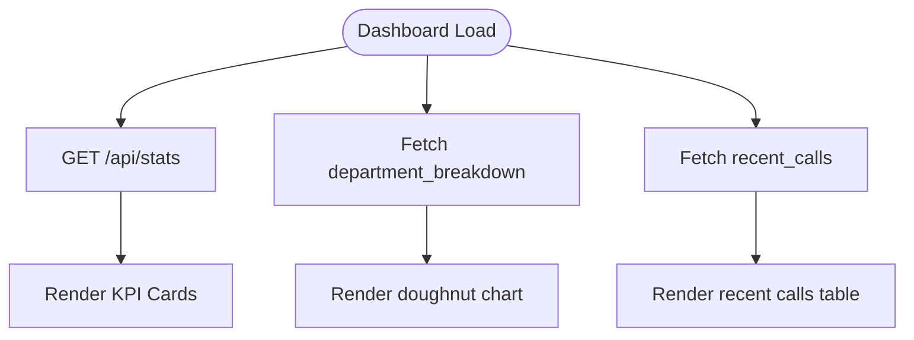
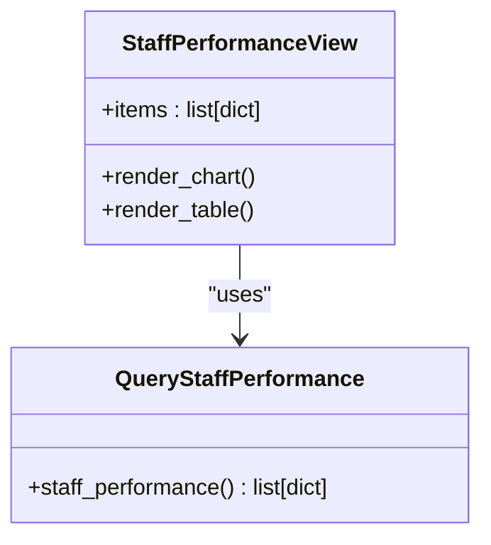
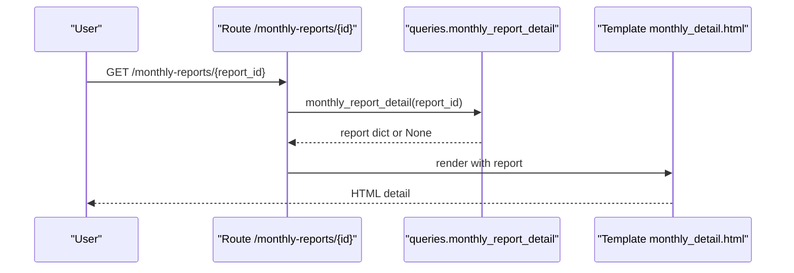
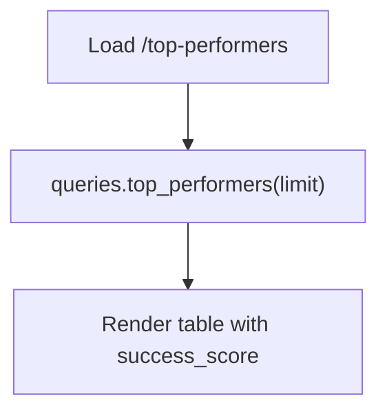
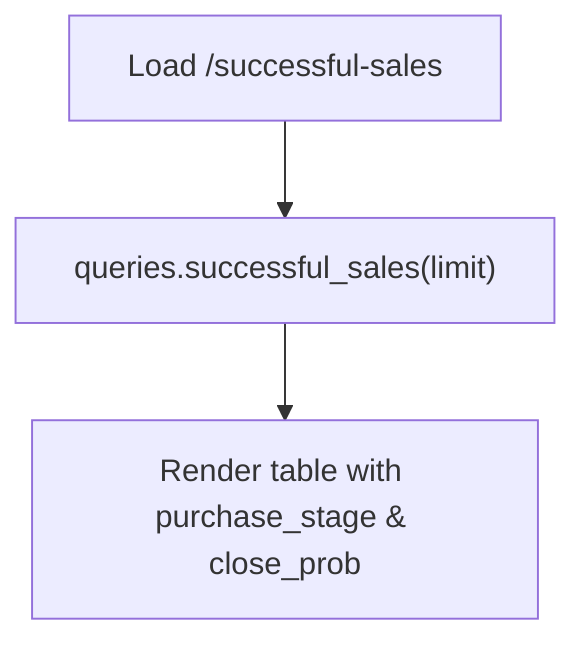
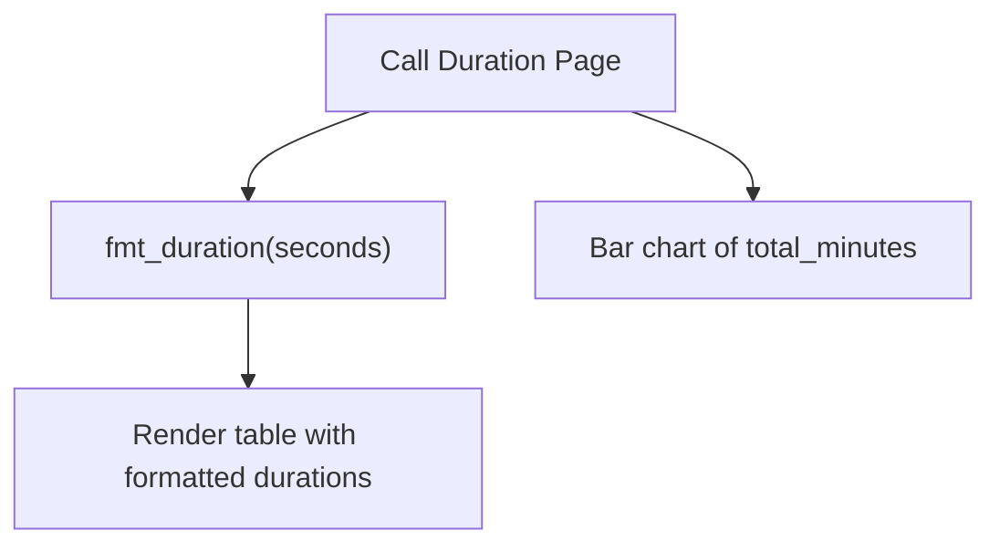
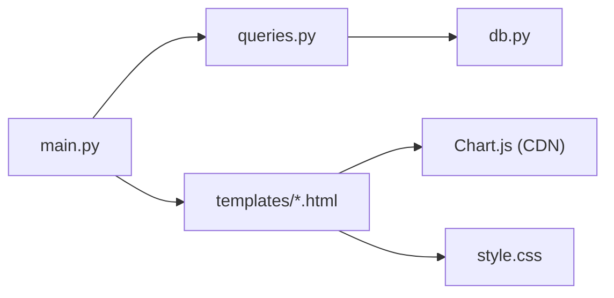

# Analytics Views

<cite>
**Referenced Files in This Document**
- [main.py](file://docker/panel/app/main.py)
- [queries.py](file://docker/panel/app/queries.py)
- [db.py](file://docker/panel/app/db.py)
- [config.py](file://docker/panel/app/config.py)
- [base.html](file://docker/panel/templates/base.html)
- [dashboard.html](file://docker/panel/templates/dashboard.html)
- [staff_performance.html](file://docker/panel/templates/staff_performance.html)
- [monthly_reports.html](file://docker/panel/templates/monthly_reports.html)
- [top_performers.html](file://docker/panel/templates/top_performers.html)
- [successful_sales.html](file://docker/panel/templates/successful_sales.html)
- [call_duration.html](file://docker/panel/templates/call_duration.html)
- [satisfaction.html](file://docker/panel/templates/satisfaction.html)
- [style.css](file://docker/panel/static/css/style.css)
</cite>

## Table of Contents
1. Introduction
2. Project Structure
3. Core Components
4. Architecture Overview
5. Detailed Component Analysis
6. Dependency Analysis
7. Performance Considerations
8. Troubleshooting Guide
9. Conclusion
10. Appendices

## Introduction
This document explains the analytics visualization views for the Atlas Manager Panel, focusing on data presentation and user interaction patterns. It covers the dashboard overview, staff performance metrics, monthly reports, top performers, and sales analysis. You will learn how data is bound to templates, how charts are rendered with Chart.js, and how real-time updates can be implemented via API endpoints. It also includes guidance for adding new views, customizing visualizations, optimizing performance for large datasets, and implementing filtering, sorting, and export features.

## Project Structure
The panel is a FastAPI application that serves Jinja2 templates and static assets. Routes fetch aggregated data from PostgreSQL using parameterized queries and pass context to templates. Templates render KPI cards, tables, and charts. A shared base template provides layout, navigation, and global resources (Chart.js).

**Diagram sources**
- [main.py:68-186](file://docker/panel/app/main.py#L68-L186)
- [queries.py:6-260](file://docker/panel/app/queries.py#L6-L260)
- [db.py:8-31](file://docker/panel/app/db.py#L8-L31)
- [base.html:1-46](file://docker/panel/templates/base.html#L1-L46)
- [style.css:1-117](file://docker/panel/static/css/style.css#L1-L117)

**Section sources**
- [main.py:1-186](file://docker/panel/app/main.py#L1-L186)
- [base.html:1-46](file://docker/panel/templates/base.html#L1-L46)
- [style.css:1-117](file://docker/panel/static/css/style.css#L1-L117)

## Core Components
- Application entrypoint and routes: define pages and an API endpoint for stats.
- Data layer: parameterized SQL queries returning dictionaries/lists for templates.
- Database connector: connection management and helpers for fetching rows.
- Templates: responsive layouts, KPI cards, tables, and Chart.js-based charts.
- Styling: dark theme, grid layouts, badges, and responsive behavior.

Key responsibilities:
- main.py: route handlers, authentication middleware, template context, duration formatter, AI insights endpoint.
- queries.py: report definitions for dashboards, staff metrics, monthly reports, top performers, and sales.
- db.py: DSN construction, connection context manager, fetch helpers.
- config.py: environment-driven database and panel settings.
- Templates: data binding via Jinja2, chart initialization in script blocks, and consistent UI components.

**Section sources**
- [main.py:20-33](file://docker/panel/app/main.py#L20-L33)
- [main.py:68-186](file://docker/panel/app/main.py#L68-L186)
- [queries.py:6-260](file://docker/panel/app/queries.py#L6-L260)
- [db.py:8-31](file://docker/panel/app/db.py#L8-L31)
- [config.py:1-14](file://docker/panel/app/config.py#L1-L14)

## Architecture Overview
The system follows a simple MVC-like pattern:
- Controllers: FastAPI routes map URLs to template responses or JSON APIs.
- Model: PostgreSQL via psycopg2; queries encapsulate business logic for aggregations.
- View: Jinja2 templates render HTML with embedded Chart.js scripts.

**Diagram sources**
- [main.py:184-186](file://docker/panel/app/main.py#L184-L186)
- [queries.py:6-23](file://docker/panel/app/queries.py#L6-L23)
- [db.py:21-30](file://docker/panel/app/db.py#L21-L30)

**Section sources**
- [main.py:68-186](file://docker/panel/app/main.py#L68-L186)
- [queries.py:6-260](file://docker/panel/app/queries.py#L6-L260)
- [db.py:8-31](file://docker/panel/app/db.py#L8-L31)

## Detailed Component Analysis

### Dashboard Overview
- Purpose: High-level KPIs, department distribution chart, top performers table, and recent calls list.
- Data binding:
  - KPIs: stats from overview_stats.
  - Department chart: departments array passed to Chart.js.
  - Recent calls: recent_calls limited to N rows.
- Chart rendering:
  - Doughnut chart for department breakdown using Chart.js.
- Real-time updates:
  - Polling via GET /api/stats returns current stats JSON for dynamic refresh.

**Diagram sources**
- [main.py:68-80](file://docker/panel/app/main.py#L68-L80)
- [main.py:184-186](file://docker/panel/app/main.py#L184-L186)
- [queries.py:6-23](file://docker/panel/app/queries.py#L6-L23)
- [queries.py:214-225](file://docker/panel/app/queries.py#L214-L225)
- [queries.py:235-247](file://docker/panel/app/queries.py#L235-L247)
- [dashboard.html:4-81](file://docker/panel/templates/dashboard.html#L4-L81)

**Section sources**
- [dashboard.html:4-81](file://docker/panel/templates/dashboard.html#L4-L81)
- [main.py:68-80](file://docker/panel/app/main.py#L68-L80)
- [queries.py:6-23](file://docker/panel/app/queries.py#L6-L23)
- [queries.py:214-225](file://docker/panel/app/queries.py#L214-L225)
- [queries.py:235-247](file://docker/panel/app/queries.py#L235-L247)

### Staff Performance Metrics
- Purpose: Compare agent quality and satisfaction across departments.
- Data binding: items from staff_performance.
- Chart rendering: bar chart comparing avg_quality and avg_satisfaction per agent.
- Table: shows total calls, quality, satisfaction, sales/support counts, and review count.

**Diagram sources**
- [staff_performance.html:1-52](file://docker/panel/templates/staff_performance.html#L1-L52)
- [queries.py:109-127](file://docker/panel/app/queries.py#L109-L127)

**Section sources**
- [staff_performance.html:1-52](file://docker/panel/templates/staff_performance.html#L1-L52)
- [queries.py:109-127](file://docker/panel/app/queries.py#L109-L127)

### Monthly Reports
- Purpose: List monthly reports and navigate to detail view.
- Data binding: items from monthly_reports_list; detail via monthly_report_detail.
- Interaction: click “مشاهده” to open monthly detail page.

**Diagram sources**
- [main.py:139-155](file://docker/panel/app/main.py#L139-L155)
- [queries.py:195-211](file://docker/panel/app/queries.py#L195-L211)
- [monthly_reports.html:1-23](file://docker/panel/templates/monthly_reports.html#L1-L23)

**Section sources**
- [monthly_reports.html:1-23](file://docker/panel/templates/monthly_reports.html#L1-L23)
- [main.py:139-155](file://docker/panel/app/main.py#L139-L155)
- [queries.py:195-211](file://docker/panel/app/queries.py#L195-L211)

### Top Performers
- Purpose: Rank agents by success score derived from quality and satisfaction.
- Data binding: items from top_performers(limit).
- Table: highlights success_score, quality, satisfaction, intent, and hot leads.

**Diagram sources**
- [main.py:83-88](file://docker/panel/app/main.py#L83-L88)
- [queries.py:26-49](file://docker/panel/app/queries.py#L26-L49)
- [top_performers.html:1-32](file://docker/panel/templates/top_performers.html#L1-L32)

**Section sources**
- [top_performers.html:1-32](file://docker/panel/templates/top_performers.html#L1-L32)
- [main.py:83-88](file://docker/panel/app/main.py#L83-L88)
- [queries.py:26-49](file://docker/panel/app/queries.py#L26-L49)

### Sales Analysis
- Purpose: Identify high-probability sales opportunities and track purchase stages.
- Data binding: items from successful_sales(limit).
- Table: displays customer info, agent, intent score, satisfaction, stage, close probability, and link to call detail.

**Diagram sources**
- [main.py:131-136](file://docker/panel/app/main.py#L131-L136)
- [queries.py:168-192](file://docker/panel/app/queries.py#L168-L192)
- [successful_sales.html:1-28](file://docker/panel/templates/successful_sales.html#L1-L28)

**Section sources**
- [successful_sales.html:1-28](file://docker/panel/templates/successful_sales.html#L1-L28)
- [main.py:131-136](file://docker/panel/app/main.py#L131-L136)
- [queries.py:168-192](file://docker/panel/app/queries.py#L168-L192)

### Call Duration and Satisfaction Views
- Call Duration:
  - Uses fmt_duration to format seconds into human-readable time.
  - Horizontal bar chart showing total minutes per agent.
- Satisfaction:
  - Shows satisfaction rate percentage and counts of satisfied/unhappy.
  - Line chart of satisfaction_rate_percent per agent.

**Diagram sources**
- [main.py:20-28](file://docker/panel/app/main.py#L20-L28)
- [call_duration.html:1-43](file://docker/panel/templates/call_duration.html#L1-L43)
- [queries.py:130-144](file://docker/panel/app/queries.py#L130-L144)

**Section sources**
- [call_duration.html:1-43](file://docker/panel/templates/call_duration.html#L1-L43)
- [satisfaction.html:1-44](file://docker/panel/templates/satisfaction.html#L1-L44)
- [main.py:20-28](file://docker/panel/app/main.py#L20-L28)
- [queries.py:130-144](file://docker/panel/app/queries.py#L130-L144)

## Dependency Analysis
- Route-to-query coupling: each route depends on one or more query functions.
- Query-to-db coupling: all queries use db.fetch_all/fetch_one with parameterized SQL.
- Template dependencies: templates depend on provided context keys and global helpers (fmt_duration, now).
- External dependencies: Chart.js loaded via CDN in base.html; psycopg2 for Postgres.

**Diagram sources**
- [main.py:68-186](file://docker/panel/app/main.py#L68-L186)
- [queries.py:6-260](file://docker/panel/app/queries.py#L6-L260)
- [db.py:8-31](file://docker/panel/app/db.py#L8-L31)
- [base.html:1-46](file://docker/panel/templates/base.html#L1-L46)
- [style.css:1-117](file://docker/panel/static/css/style.css#L1-L117)

**Section sources**
- [main.py:68-186](file://docker/panel/app/main.py#L68-L186)
- [queries.py:6-260](file://docker/panel/app/queries.py#L6-L260)
- [db.py:8-31](file://docker/panel/app/db.py#L8-L31)
- [base.html:1-46](file://docker/panel/templates/base.html#L1-L46)
- [style.css:1-117](file://docker/panel/static/css/style.css#L1-L117)

## Performance Considerations
- Limit result sets: most queries accept limits (e.g., top_performers, ready_to_buy, successful_sales, recent_calls). Use small limits for initial loads and implement pagination for large datasets.
- Indexing: ensure indexes on frequently filtered columns such as department, purchase_intent_score, satisfaction_final_score, call_date, and agent identifiers.
- Aggregation at DB level: leverage SQL aggregates and FILTER clauses to minimize client-side processing.
- Avoid heavy JSON extraction in loops: precompute fields in queries where possible (as done for next_step, discount_pct, etc.).
- Chart performance: keep dataset sizes reasonable; consider server-side aggregation for very large lists before sending to clients.
- Connection reuse: consider pooling connections if traffic increases significantly.

[No sources needed since this section provides general guidance]

## Troubleshooting Guide
- Authentication bypass: if PANEL_PASSWORD is empty, login is skipped; otherwise, access requires a valid cookie set by POST /login.
- Missing data: templates show empty states when no records exist; verify that workflows populate call_analyses and monthly_reports.
- Chart not rendering: ensure Chart.js is loaded (base.html) and canvas IDs match script references.
- Duration formatting: fmt_duration returns "-" for null/None values; confirm input types are numeric seconds.
- 404 on monthly detail: monthly_report_detail returns None for missing IDs; route raises HTTPException(404).

**Section sources**
- [main.py:40-65](file://docker/panel/app/main.py#L40-L65)
- [main.py:147-155](file://docker/panel/app/main.py#L147-L155)
- [call_duration.html:13-20](file://docker/panel/templates/call_duration.html#L13-L20)
- [dashboard.html:16-64](file://docker/panel/templates/dashboard.html#L16-L64)

## Conclusion
The analytics views provide a cohesive dashboard experience with clear KPIs, actionable tables, and interactive charts. The architecture cleanly separates routing, data retrieval, and presentation, enabling easy extension. To add new views, follow the established pattern: create a route, implement a query, bind data in a template, and initialize a Chart.js visualization. For large datasets, apply server-side limits, indexing, and aggregation strategies. Real-time updates can be achieved by polling the /api/stats endpoint and refreshing the UI accordingly.

[No sources needed since this section summarizes without analyzing specific files]

## Appendices

### Adding a New Analytics View
Steps:
1. Define a query in queries.py that returns a list/dict suitable for the view.
2. Add a route in main.py that renders a new template with context.
3. Create a template extending base.html with KPIs, tables, and optional charts.
4. Wire navigation in base.html sidebar.
5. Test with sample data and validate empty states.

**Section sources**
- [queries.py:6-260](file://docker/panel/app/queries.py#L6-L260)
- [main.py:68-186](file://docker/panel/app/main.py#L68-L186)
- [base.html:22-33](file://docker/panel/templates/base.html#L22-L33)

### Customizing Existing Visualizations
- Change chart type: modify Chart.js configuration in the template’s script block (e.g., bar to line).
- Adjust colors and scales: update datasets and options in the same script block.
- Responsive behavior: rely on Chart.js responsive option already enabled in several views.

**Section sources**
- [staff_performance.html:34-51](file://docker/panel/templates/staff_performance.html#L34-L51)
- [call_duration.html:28-42](file://docker/panel/templates/call_duration.html#L28-L42)
- [satisfaction.html:29-43](file://docker/panel/templates/satisfaction.html#L29-L43)
- [dashboard.html:66-80](file://docker/panel/templates/dashboard.html#L66-L80)

### Implementing Filtering, Sorting, and Export
- Filtering and sorting:
  - Extend routes to accept query parameters (e.g., department, date range).
  - Update corresponding queries to include WHERE clauses and ORDER BY based on parameters.
  - Add form controls in templates to submit filters.
- Export functionality:
  - Add a route that serializes query results to CSV/Excel and returns as a file response.
  - Reuse existing query functions to avoid duplication.

[No sources needed since this section provides general guidance]

### Real-Time Updates
- Polling approach:
  - Use setInterval to call GET /api/stats and update KPI elements in the DOM.
  - Debounce requests to avoid excessive network load.
- WebSocket approach (optional):
  - Introduce a WebSocket endpoint to push updates when new analyses arrive.

**Section sources**
- [main.py:184-186](file://docker/panel/app/main.py#L184-L186)