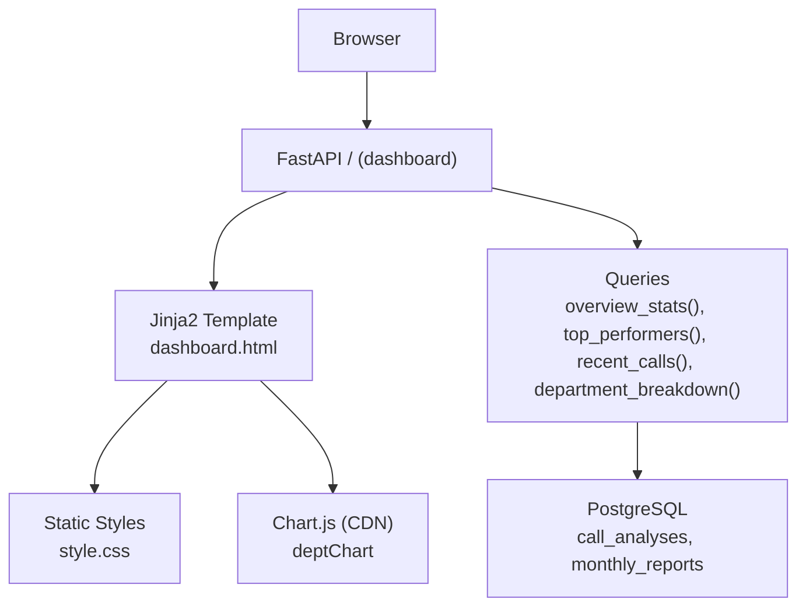
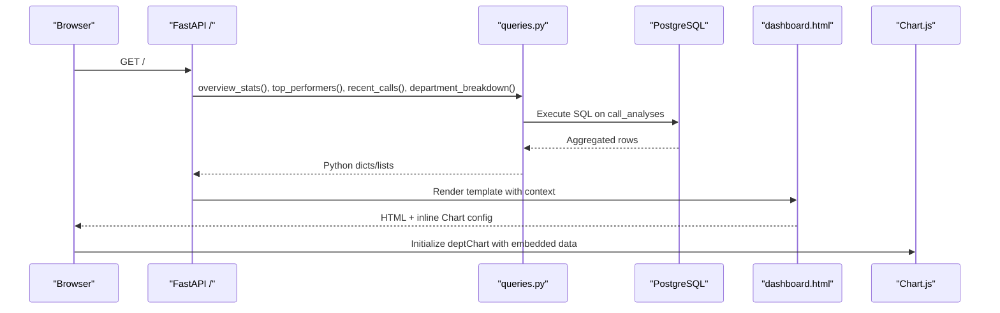
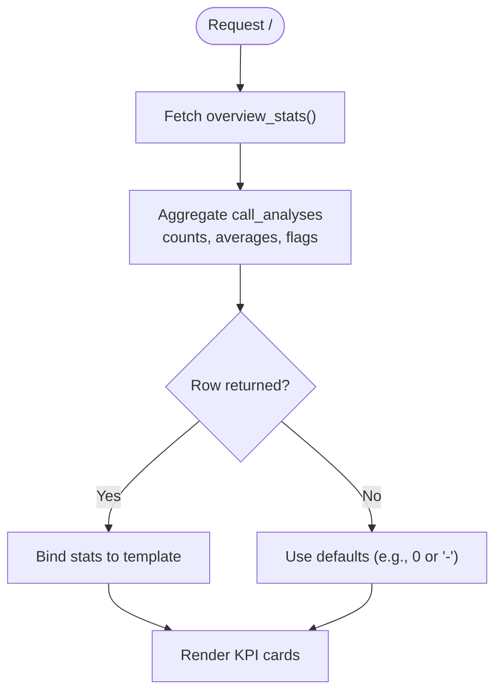
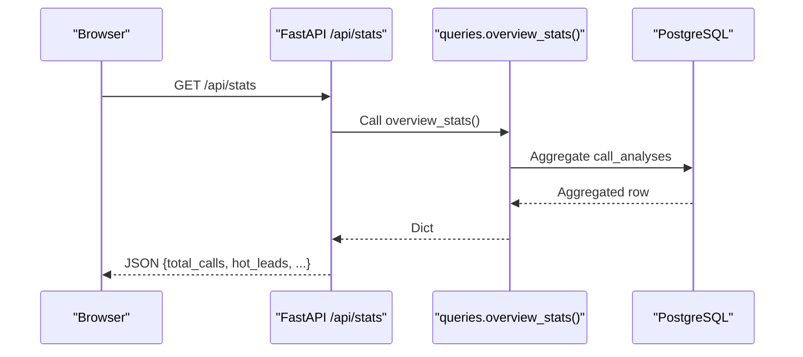
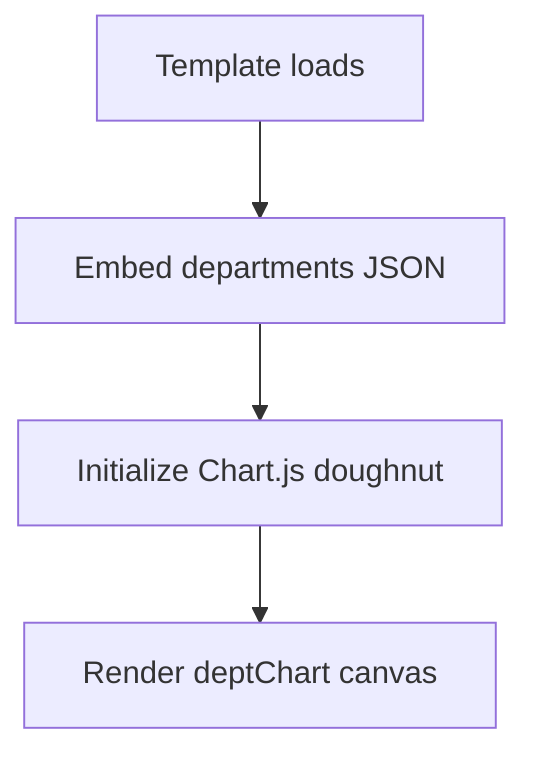
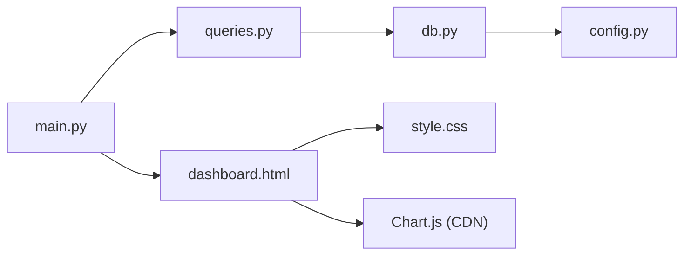

# Dashboard Overview

<cite>
**Referenced Files in This Document**
- [dashboard.html](file://docker/panel/templates/dashboard.html)
- [base.html](file://docker/panel/templates/base.html)
- [main.py](file://docker/panel/app/main.py)
- [queries.py](file://docker/panel/app/queries.py)
- [db.py](file://docker/panel/app/db.py)
- [config.py](file://docker/panel/app/config.py)
- [style.css](file://docker/panel/static/css/style.css)
</cite>

## Table of Contents
1. [Introduction](#introduction)
2. [Project Structure](#project-structure)
3. [Core Components](#core-components)
4. [Architecture Overview](#architecture-overview)
5. [Detailed Component Analysis](#detailed-component-analysis)
6. [Dependency Analysis](#dependency-analysis)
7. [Performance Considerations](#performance-considerations)
8. [Troubleshooting Guide](#troubleshooting-guide)
9. [Conclusion](#conclusion)
10. [Appendices](#appendices)

## Introduction
This document explains the main dashboard overview view that presents key performance indicators (KPIs) and high-level analytics for call intelligence data. It covers how KPIs are computed, how they are bound to the UI via Jinja2 templates, how charts integrate with Chart.js, and how the responsive grid layout renders across devices. It also provides guidelines for customizing KPI cards, adding new metrics, and optimizing dashboard performance for large datasets.

## Project Structure
The dashboard is implemented as a FastAPI application serving Jinja2 HTML templates backed by PostgreSQL queries. The main entry point renders the dashboard template with aggregated statistics, top performers, recent calls, and department distribution data.

**Diagram sources**
- [main.py:85-97](file://docker/panel/app/main.py#L85-L97)
- [dashboard.html:1-81](file://docker/panel/templates/dashboard.html#L1-L81)
- [queries.py:6-23](file://docker/panel/app/queries.py#L6-L23)
- [queries.py:26-49](file://docker/panel/app/queries.py#L26-L49)
- [queries.py:214-225](file://docker/panel/app/queries.py#L214-L225)
- [queries.py:235-247](file://docker/panel/app/queries.py#L235-L247)
- [db.py:21-30](file://docker/panel/app/db.py#L21-L30)
- [style.css:41-61](file://docker/panel/static/css/style.css#L41-L61)

**Section sources**
- [main.py:85-97](file://docker/panel/app/main.py#L85-L97)
- [dashboard.html:1-81](file://docker/panel/templates/dashboard.html#L1-L81)
- [queries.py:6-23](file://docker/panel/app/queries.py#L6-L23)
- [queries.py:235-247](file://docker/panel/app/queries.py#L235-L247)
- [db.py:21-30](file://docker/panel/app/db.py#L21-L30)
- [style.css:41-61](file://docker/panel/static/css/style.css#L41-L61)

## Core Components
- KPI Cards: Display total calls, hot leads, unhappy customers, average satisfaction, average agent quality, and review requirements.
- Top Performers Table: Shows best agents by composite success score and related metrics.
- Department Distribution Chart: A doughnut chart visualizing call volume by department.
- Recent Calls Table: Lists the most recent calls with key attributes and links to details.

Data binding patterns:
- Server-side rendering via Jinja2: The FastAPI route passes stats, top, recent, and departments into the template.
- Real-time-like updates: An API endpoint returns current stats as JSON for potential client-side polling or refresh.
- Responsive layout: CSS Grid adapts KPI cards and two-column sections to smaller screens.

**Section sources**
- [dashboard.html:4-11](file://docker/panel/templates/dashboard.html#L4-L11)
- [dashboard.html:13-64](file://docker/panel/templates/dashboard.html#L13-L64)
- [dashboard.html:66-80](file://docker/panel/templates/dashboard.html#L66-L80)
- [main.py:85-97](file://docker/panel/app/main.py#L85-L97)
- [main.py:201-203](file://docker/panel/app/main.py#L201-L203)
- [style.css:48-61](file://docker/panel/static/css/style.css#L48-L61)

## Architecture Overview
The dashboard request flow:
1. Browser requests /.
2. FastAPI middleware handles optional authentication.
3. Route handler fetches overview stats, top performers, recent calls, and department breakdown from PostgreSQL.
4. Jinja2 template renders KPIs, tables, and embeds Chart.js configuration using server-provided data.
5. Static assets (CSS, Chart.js CDN) load to style and visualize data.

**Diagram sources**
- [main.py:73-82](file://docker/panel/app/main.py#L73-L82)
- [main.py:85-97](file://docker/panel/app/main.py#L85-L97)
- [queries.py:6-23](file://docker/panel/app/queries.py#L6-L23)
- [queries.py:26-49](file://docker/panel/app/queries.py#L26-L49)
- [queries.py:214-225](file://docker/panel/app/queries.py#L214-L225)
- [queries.py:235-247](file://docker/panel/app/queries.py#L235-L247)
- [dashboard.html:66-80](file://docker/panel/templates/dashboard.html#L66-L80)

## Detailed Component Analysis

### KPI Cards and Metrics
- Total Calls: Count of all records in the analysis table.
- Hot Leads: Records where purchase intent meets a threshold.
- Unhappy Customers: Records where satisfaction falls below a threshold.
- Average Satisfaction: Mean of satisfaction scores.
- Average Agent Quality: Mean of agent quality scores.
- Needs Review: Count flagged for human review.

These values are computed in a single aggregation query and passed to the template as stats.

**Diagram sources**
- [queries.py:6-23](file://docker/panel/app/queries.py#L6-L23)
- [dashboard.html:4-11](file://docker/panel/templates/dashboard.html#L4-L11)

**Section sources**
- [queries.py:6-23](file://docker/panel/app/queries.py#L6-L23)
- [dashboard.html:4-11](file://docker/panel/templates/dashboard.html#L4-L11)

### Data Binding Patterns (Jinja2)
- Server context: The route builds a context dict with stats, top, recent, and departments.
- Template variables: KPI values and lists are rendered directly in the template using Jinja2 syntax.
- JSON serialization: Decimal and datetime types are safely serialized to JSON for client-side use.

Examples of binding:
- KPI values bound via template variables.
- Top performers looped into a table.
- Recent calls looped into a table with formatted dates.
- Department distribution passed as JSON to Chart.js.

**Section sources**
- [main.py:85-97](file://docker/panel/app/main.py#L85-L97)
- [main.py:25-34](file://docker/panel/app/main.py#L25-L34)
- [dashboard.html:19-30](file://docker/panel/templates/dashboard.html#L19-L30)
- [dashboard.html:47-63](file://docker/panel/templates/dashboard.html#L47-L63)
- [dashboard.html:66-80](file://docker/panel/templates/dashboard.html#L66-L80)

### Real-Time Statistics Updates
- A dedicated API endpoint returns current overview stats as JSON.
- Frontend can poll this endpoint periodically to update KPIs without full page reloads.
- Use browser timers or WebSockets to push updates if needed.

**Diagram sources**
- [main.py:201-203](file://docker/panel/app/main.py#L201-L203)
- [queries.py:6-23](file://docker/panel/app/queries.py#L6-L23)

**Section sources**
- [main.py:201-203](file://docker/panel/app/main.py#L201-L203)
- [queries.py:6-23](file://docker/panel/app/queries.py#L6-L23)

### Responsive Grid Layout
- KPI grid uses CSS Grid with auto-fit columns to adapt to screen width.
- Two-column section collapses to single column on smaller screens.
- Sidebar becomes static and full-width on mobile.

Key behaviors:
- Auto-adjusting KPI card widths.
- Media queries reflow content for readability on small devices.

**Section sources**
- [style.css:48-61](file://docker/panel/static/css/style.css#L48-L61)

### Chart Integration with Chart.js
- The template includes Chart.js via CDN.
- Department distribution data is embedded as JSON and used to initialize a doughnut chart.
- Legend is positioned at the bottom and aligned right-to-left for RTL support.

**Diagram sources**
- [base.html:10](file://docker/panel/templates/base.html#L10)
- [dashboard.html:66-80](file://docker/panel/templates/dashboard.html#L66-L80)
- [queries.py:235-247](file://docker/panel/app/queries.py#L235-L247)

**Section sources**
- [base.html:10](file://docker/panel/templates/base.html#L10)
- [dashboard.html:66-80](file://docker/panel/templates/dashboard.html#L66-L80)
- [queries.py:235-247](file://docker/panel/app/queries.py#L235-L247)

### Guidelines for Customizing KPI Cards
To add or modify KPIs:
- Extend the aggregation query to compute the new metric.
- Add a corresponding field in the stats context.
- Insert a new KPI card in the template grid.
- Optionally apply accent colors for emphasis.

Steps:
1. Update the aggregation query to include the new metric.
2. Ensure the template binds the new variable.
3. Style the new card using existing classes or extend CSS variables.

**Section sources**
- [queries.py:6-23](file://docker/panel/app/queries.py#L6-L23)
- [dashboard.html:4-11](file://docker/panel/templates/dashboard.html#L4-L11)
- [style.css:48-53](file://docker/panel/static/css/style.css#L48-L53)

### Adding New Metrics
For new dashboards or views:
- Create a new query function returning relevant aggregates or lists.
- Expose a route that renders a template with the new context.
- Follow the same pattern for embedding data into charts or tables.

**Section sources**
- [main.py:100-161](file://docker/panel/app/main.py#L100-L161)
- [queries.py:26-49](file://docker/panel/app/queries.py#L26-L49)
- [queries.py:214-225](file://docker/panel/app/queries.py#L214-L225)

### Optimizing Dashboard Performance for Large Datasets
Recommendations:
- Index frequently filtered/aggregated columns (e.g., department, satisfaction_final_score, purchase_intent_score, needs_human_review).
- Use materialized views or summary tables for heavy aggregations if needed.
- Limit result sets in queries (as done for top performers and recent calls).
- Cache repeated computations at the application layer if appropriate.
- Offload real-time updates to an API endpoint and let the frontend poll selectively.

[No sources needed since this section provides general guidance]

## Dependency Analysis
The dashboard depends on:
- FastAPI routes for request handling and template rendering.
- Query module for database interactions.
- Database connector for PostgreSQL access.
- Configuration for connection parameters and panel settings.
- Templates and static assets for presentation.

**Diagram sources**
- [main.py:85-97](file://docker/panel/app/main.py#L85-L97)
- [queries.py:6-23](file://docker/panel/app/queries.py#L6-L23)
- [db.py:21-30](file://docker/panel/app/db.py#L21-L30)
- [config.py:1-14](file://docker/panel/app/config.py#L1-L14)
- [dashboard.html:1-81](file://docker/panel/templates/dashboard.html#L1-L81)
- [style.css:1-117](file://docker/panel/static/css/style.css#L1-L117)

**Section sources**
- [main.py:85-97](file://docker/panel/app/main.py#L85-L97)
- [queries.py:6-23](file://docker/panel/app/queries.py#L6-L23)
- [db.py:21-30](file://docker/panel/app/db.py#L21-L30)
- [config.py:1-14](file://docker/panel/app/config.py#L1-L14)
- [dashboard.html:1-81](file://docker/panel/templates/dashboard.html#L1-L81)
- [style.css:1-117](file://docker/panel/static/css/style.css#L1-L117)

## Performance Considerations
- Prefer aggregated queries over multiple round-trips.
- Use LIMIT clauses for list views to reduce payload size.
- Avoid heavy computations in templates; precompute in queries.
- Consider caching strategies for frequently accessed aggregates.
- Monitor database query plans and add indexes where necessary.

[No sources needed since this section provides general guidance]

## Troubleshooting Guide
Common issues and checks:
- Authentication redirect loops: Verify cookie and password configuration.
- Empty KPIs or tables: Confirm database connectivity and presence of data.
- Chart not rendering: Ensure Chart.js CDN loads and departments data is non-empty.
- Decimal/datetime serialization errors: Confirm encoder setup for JSON responses.

Verification steps:
- Check environment variables for database credentials.
- Test the /api/stats endpoint to validate data availability.
- Inspect network tab for failed asset loads.

**Section sources**
- [main.py:57-82](file://docker/panel/app/main.py#L57-L82)
- [main.py:201-203](file://docker/panel/app/main.py#L201-L203)
- [config.py:1-14](file://docker/panel/app/config.py#L1-L14)
- [dashboard.html:66-80](file://docker/panel/templates/dashboard.html#L66-L80)

## Conclusion
The dashboard provides a clear, responsive overview of call intelligence metrics through well-structured KPIs, tables, and charts. Its architecture separates concerns between routing, querying, templating, and styling, enabling easy customization and extension. By following the provided guidelines, you can add new metrics, enhance interactivity, and optimize performance for large datasets.

## Appendices

### KPI Definitions Reference
- Total Calls: Count of all analyzed calls.
- Hot Leads: Calls with high purchase intent.
- Unhappy Customers: Calls with low satisfaction.
- Average Satisfaction: Mean satisfaction score.
- Average Agent Quality: Mean agent quality score.
- Needs Review: Calls flagged for human review.

**Section sources**
- [queries.py:6-23](file://docker/panel/app/queries.py#L6-L23)
- [dashboard.html:4-11](file://docker/panel/templates/dashboard.html#L4-L11)