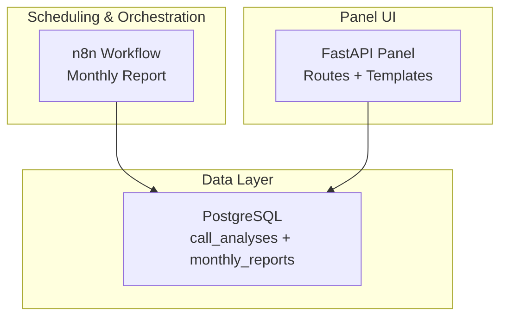
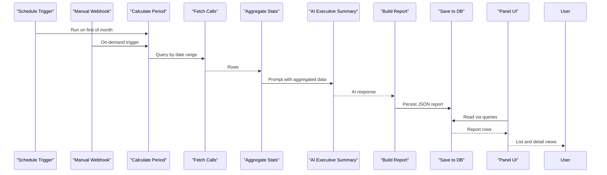
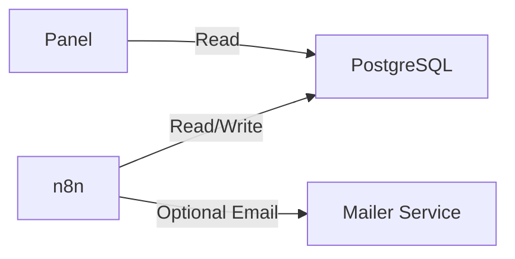

# Monthly Reports

<cite>
**Referenced Files in This Document**
- [atlas-call-intelligence-monthly-report.json](file://docker/n8n/workflows/atlas-call-intelligence-monthly-report.json)
- [atlas-call-intelligence-v1.json](file://docker/n8n/workflows/atlas-call-intelligence-v1.json)
- [main.py](file://docker/panel/app/main.py)
- [queries.py](file://docker/panel/app/queries.py)
- [monthly_reports.html](file://docker/panel/templates/monthly_reports.html)
- [monthly_detail.html](file://docker/panel/templates/monthly_detail.html)
- [001_call_intelligence.sql](file://docker/postgres/init/001_call_intelligence.sql)
- [docker-compose.yml](file://docker/docker-compose.yml)
</cite>

## Table of Contents
1. [Introduction](#introduction)
2. [Project Structure](#project-structure)
3. [Core Components](#core-components)
4. [Architecture Overview](#architecture-overview)
5. [Detailed Component Analysis](#detailed-component-analysis)
6. [Dependency Analysis](#dependency-analysis)
7. [Performance Considerations](#performance-considerations)
8. [Troubleshooting Guide](#troubleshooting-guide)
9. [Conclusion](#conclusion)
10. [Appendices](#appendices)

## Introduction
This document explains the monthly reporting functionality for aggregated analytics and automated report generation. It covers how call volumes, satisfaction trends, sales performance, and operational metrics are computed, how n8n orchestrates scheduled and on-demand report generation, how reports are persisted and viewed in the panel, and how to customize, filter, schedule, and extend the system.

## Project Structure
The monthly reporting feature spans several services:
- n8n workflows that trigger, aggregate data, generate AI insights, build reports, persist them, and optionally notify managers via email.
- A PostgreSQL database that stores per-call analyses and monthly report summaries.
- A FastAPI panel that lists and displays monthly reports and related analytics.

**Diagram sources**
- [atlas-call-intelligence-monthly-report.json:1-172](file://docker/n8n/workflows/atlas-call-intelligence-monthly-report.json#L1-L172)
- [001_call_intelligence.sql:1-45](file://docker/postgres/init/001_call_intelligence.sql#L1-L45)
- [main.py:156-172](file://docker/panel/app/main.py#L156-L172)

**Section sources**
- [docker-compose.yml:1-98](file://docker/docker-compose.yml#L1-L98)
- [001_call_intelligence.sql:1-45](file://docker/postgres/init/001_call_intelligence.sql#L1-L45)

## Core Components
- n8n monthly report workflow: schedules or triggers report generation, aggregates call data, calls an AI model for executive summary, builds a structured report, persists it, and can send notifications.
- Database schema: stores raw call analyses and monthly report JSON payloads with metadata.
- Panel routes and templates: list recent monthly reports and render their JSON content for inspection.

Key responsibilities:
- Data aggregation across departments and agents.
- KPI computation (call volumes, satisfaction, purchase intent, agent quality).
- AI-generated executive insights.
- Persistence and retrieval of monthly reports.
- Optional email notification to managers.

**Section sources**
- [atlas-call-intelligence-monthly-report.json:10-172](file://docker/n8n/workflows/atlas-call-intelligence-monthly-report.json#L10-L172)
- [001_call_intelligence.sql:34-45](file://docker/postgres/init/001_call_intelligence.sql#L34-L45)
- [main.py:156-172](file://docker/panel/app/main.py#L156-L172)
- [monthly_reports.html:1-23](file://docker/panel/templates/monthly_reports.html#L1-L23)
- [monthly_detail.html:1-8](file://docker/panel/templates/monthly_detail.html#L1-L8)

## Architecture Overview
End-to-end flow from scheduling to viewing reports:

**Diagram sources**
- [atlas-call-intelligence-monthly-report.json:10-172](file://docker/n8n/workflows/atlas-call-intelligence-monthly-report.json#L10-L172)
- [main.py:156-172](file://docker/panel/app/main.py#L156-L172)
- [queries.py:195-211](file://docker/panel/app/queries.py#L195-L211)

## Detailed Component Analysis

### n8n Monthly Report Workflow
- Triggers:
  - Scheduled on the first day of each month at a configured hour.
  - Manual webhook endpoint for on-demand execution.
- Processing steps:
  - Calculate period based on current month or request parameters.
  - Fetch call records within the period from PostgreSQL.
  - Aggregate statistics by department and agent, including:
    - Call counts
    - Average satisfaction scores
    - Average agent quality scores
    - Average purchase intent scores
    - Needs human review counts
    - High-priority ticket counts
    - Success score derived from quality and satisfaction
  - Generate AI executive summary using a prompt built from aggregated data.
  - Build final report structure with metadata, department stats, agent rankings, top performers, coaching needs, and AI insights.
  - Persist report JSON into monthly_reports table.
  - Optionally prepare manager notification payload.

Report structure includes:
- Meta: report month, generated timestamp, workflow version, total calls, period boundaries.
- Department stats: call volume, average satisfaction, average agent quality, average purchase intent, needs review count, success rate percentage.
- Agent rankings: per-agent metrics and success score.
- Top performers and coaching needs.
- AI executive summary: Persian-language insights, strengths, issues, recommendations, training priorities, and KPI highlights.

Filtering and customization:
- The workflow supports optional department filtering via request body when triggered manually.
- Date range is automatically calculated unless overridden by year/month in the request.

Scheduling configuration:
- Cron expression runs on the first of every month at a specific hour.
- Timezone is set in the environment for consistent scheduling.

Email notifications:
- The workflow constructs a manager notification object with recipient, subject, and body.
- Actual sending is not implemented in this workflow; integration points exist for external mailer services.

PDF export:
- No PDF generation is present in the workflow or panel. To add PDF export, integrate a PDF rendering step after building the report and before saving or notifying.

**Section sources**
- [atlas-call-intelligence-monthly-report.json:10-172](file://docker/n8n/workflows/atlas-call-intelligence-monthly-report.json#L10-L172)

### Database Schema and Storage
- call_analyses: stores per-call AI analysis results, including scores and flags used for aggregation.
- monthly_reports: stores generated monthly reports as JSONB along with metadata such as report_month, department, total_calls, and created_at.

Indexes optimize queries by analyzed_at, agent_id, department, call_date, and report_month.

**Section sources**
- [001_call_intelligence.sql:1-45](file://docker/postgres/init/001_call_intelligence.sql#L1-L45)

### Panel: Listing and Viewing Monthly Reports
- Routes:
  - /monthly-reports: lists recent monthly reports with month, department, total calls, creation date, and a link to view details.
  - /monthly-reports/{report_id}: renders the full JSON report for inspection.
- Queries:
  - monthly_reports_list: retrieves recent entries ordered by report_month.
  - monthly_report_detail: fetches a single report by id.
- Templates:
  - monthly_reports.html: displays a simple table of reports.
  - monthly_detail.html: renders the stored report JSON with indentation.

**Section sources**
- [main.py:156-172](file://docker/panel/app/main.py#L156-L172)
- [queries.py:195-211](file://docker/panel/app/queries.py#L195-L211)
- [monthly_reports.html:1-23](file://docker/panel/templates/monthly_reports.html#L1-L23)
- [monthly_detail.html:1-8](file://docker/panel/templates/monthly_detail.html#L1-L8)

### Related Workflow: Call Intelligence v1
While not part of monthly reporting directly, this workflow ingests call audio/transcripts, analyzes them via AI, saves results to call_analyses, and can send manager emails. It provides the underlying data that monthly reports aggregate.

**Section sources**
- [atlas-call-intelligence-v1.json:1-160](file://docker/n8n/workflows/atlas-call-intelligence-v1.json#L1-L160)

## Dependency Analysis
Service dependencies and integrations:
- n8n depends on PostgreSQL for reading call_analyses and writing monthly_reports.
- Panel depends on PostgreSQL for listing and retrieving monthly reports.
- Environment variables configure AI endpoints, credentials, timezone, and email settings.

**Diagram sources**
- [docker-compose.yml:26-79](file://docker/docker-compose.yml#L26-L79)
- [atlas-call-intelligence-monthly-report.json:50-120](file://docker/n8n/workflows/atlas-call-intelligence-monthly-report.json#L50-L120)

**Section sources**
- [docker-compose.yml:1-98](file://docker/docker-compose.yml#L1-L98)

## Performance Considerations
- Aggregation occurs in memory within n8n function nodes; ensure the dataset size per month is manageable. For very large datasets, consider pre-aggregating in SQL or partitioning by month.
- Database indexes on call_date and report_month improve query performance for both aggregation and report listing.
- Avoid unnecessary AI calls by caching or reusing prompts when possible.
- Use pagination or limits in panel queries to prevent heavy responses.

[No sources needed since this section provides general guidance]

## Troubleshooting Guide
Common issues and checks:
- No reports appearing in the panel:
  - Ensure the monthly report workflow is active and has run successfully.
  - Verify PostgreSQL connectivity and that monthly_reports contains entries.
  - Confirm the panel’s database credentials and that queries return rows.
- Empty reports:
  - Check if call_analyses has data for the target month.
  - Validate the period calculation logic and filters.
- AI summary missing or malformed:
  - Verify API_URL, API_KEY, and AI_MODEL environment variables.
  - Inspect the AI response handling and JSON parsing in the workflow.
- Email notifications not sent:
  - The monthly workflow prepares a notification payload but does not send email directly. Integrate with an external mailer or extend the workflow to call the mailer service.
- Scheduling not triggering:
  - Confirm cron expression and timezone settings in n8n environment.
  - Ensure the workflow is enabled and the schedule node is configured.

Operational references:
- Workflow persistence and error handling use continueOnFail for non-critical steps like saving reports and responding to webhooks.
- Panel routes raise HTTP 404 when a requested report is not found.

**Section sources**
- [atlas-call-intelligence-monthly-report.json:100-133](file://docker/n8n/workflows/atlas-call-intelligence-monthly-report.json#L100-L133)
- [main.py:164-172](file://docker/panel/app/main.py#L164-L172)

## Conclusion
The monthly reporting system combines scheduled and on-demand orchestration via n8n with robust data aggregation, AI-powered insights, and a simple panel for viewing reports. It captures key metrics across call volumes, satisfaction trends, sales performance, and operational indicators. Extensibility points include adding new sections to the report, integrating PDF export, and connecting email notifications through external services.

[No sources needed since this section summarizes without analyzing specific files]

## Appendices

### Adding New Report Sections
- Extend the aggregation function in the monthly workflow to compute additional metrics from call_analyses fields.
- Update the prompt to include new data so the AI summary reflects the changes.
- Adjust the report builder to include new sections in the final JSON.
- Add corresponding panel views or filters if needed.

**Section sources**
- [atlas-call-intelligence-monthly-report.json:70-99](file://docker/n8n/workflows/atlas-call-intelligence-monthly-report.json#L70-L99)

### Modifying Report Templates
- The panel currently renders the stored report JSON. To create custom visual templates:
  - Create new Jinja2 templates under the panel templates directory.
  - Add routes to render those templates with report data.
  - Pass structured fields from the report JSON to the template for display.

**Section sources**
- [monthly_detail.html:1-8](file://docker/panel/templates/monthly_detail.html#L1-L8)
- [main.py:156-172](file://docker/panel/app/main.py#L156-L172)

### Integrating with External Reporting Systems
- After building the report, add HTTP requests to push JSON or formatted content to external systems (e.g., BI tools, dashboards).
- Use environment variables to configure endpoints and authentication.
- Implement retry and error handling for resilience.

**Section sources**
- [atlas-call-intelligence-monthly-report.json:90-133](file://docker/n8n/workflows/atlas-call-intelligence-monthly-report.json#L90-L133)

### Filtering Options and Scheduling Configurations
- Manual trigger supports optional department filtering via request body.
- Date range defaults to previous month unless year/month are provided.
- Schedule runs on the first of each month; adjust cron expression and timezone as needed.

**Section sources**
- [atlas-call-intelligence-monthly-report.json:10-49](file://docker/n8n/workflows/atlas-call-intelligence-monthly-report.json#L10-L49)
- [docker-compose.yml:34-51](file://docker/docker-compose.yml#L34-L51)