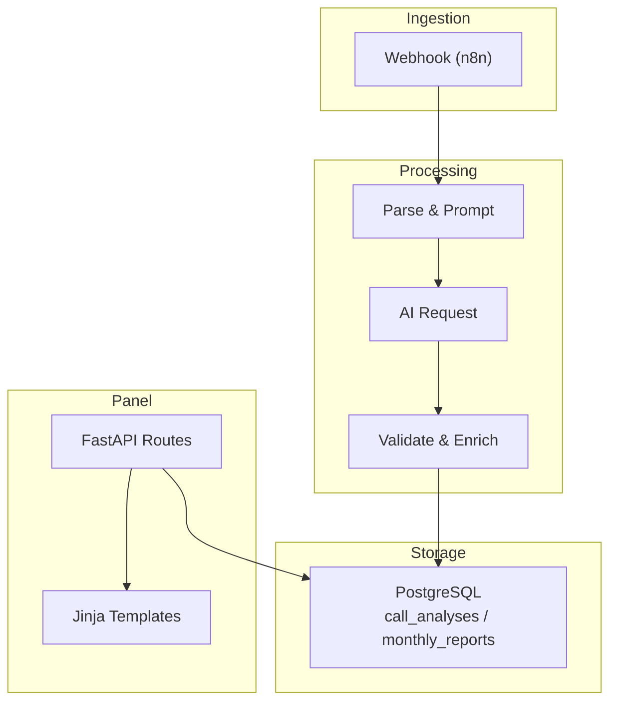
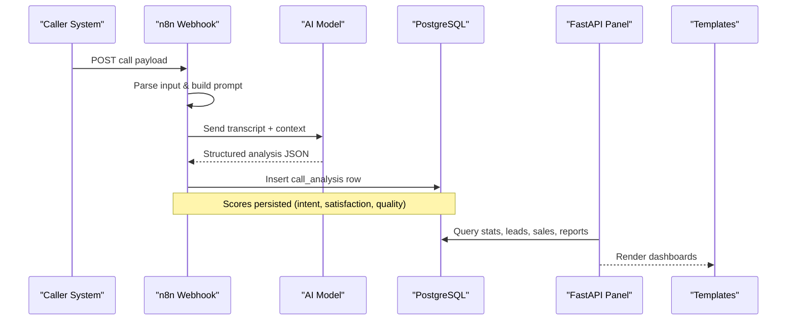
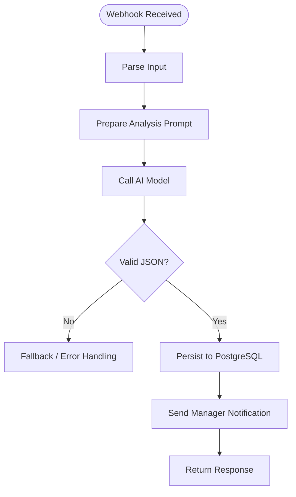
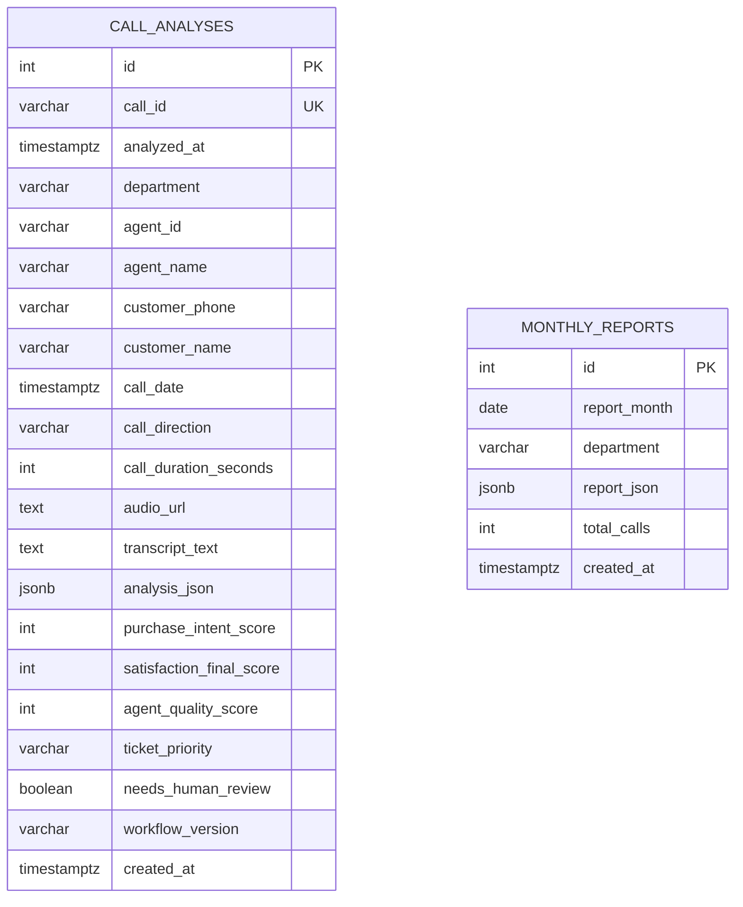
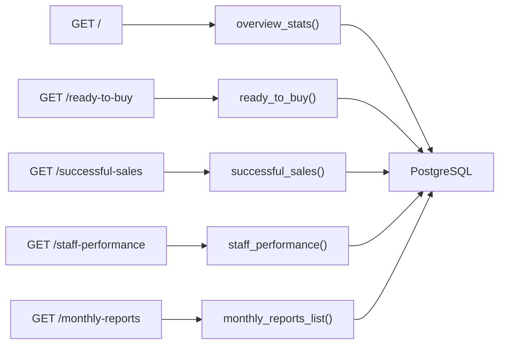
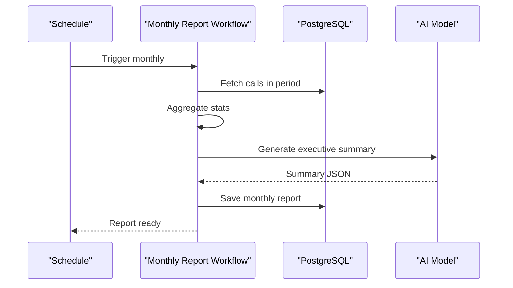
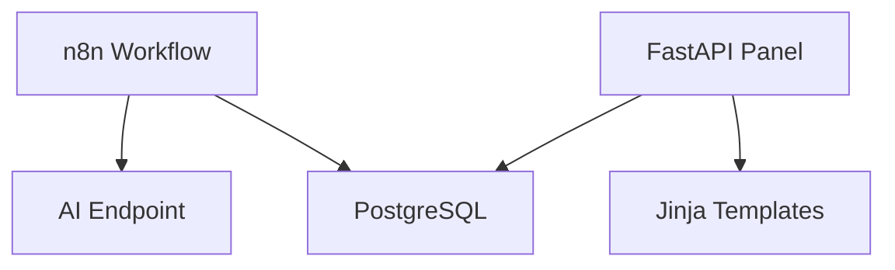

# Sales Pipeline Analytics

<cite>
**Referenced Files in This Document**
- [README.md](file://03_Products/Atlas Call Intelligence/V1/README.md)
- [schema.json](file://03_Products/Atlas Call Intelligence/V1/schema.json)
- [atlas-call-intelligence-v1.json](file://docker/n8n/workflows/atlas-call-intelligence-v1.json)
- [atlas-call-intelligence-monthly-report.json](file://docker/n8n/workflows/atlas-call-intelligence-monthly-report.json)
- [main.py](file://docker/panel/app/main.py)
- [queries.py](file://docker/panel/app/queries.py)
- [001_call_intelligence.sql](file://docker/postgres/init/001_call_intelligence.sql)
- [dashboard.html](file://docker/panel/templates/dashboard.html)
- [ready_to_buy.html](file://docker/panel/templates/ready_to_buy.html)
- [successful_sales.html](file://docker/panel/templates/successful_sales.html)
- [monthly_reports.html](file://docker/panel/templates/monthly_reports.html)
- [top_performers.html](file://docker/panel/templates/top_performers.html)
- [staff_performance.html](file://docker/panel/templates/staff_performance.html)
</cite>

## Table of Contents
1. Introduction
2. Project Structure
3. Core Components
4. Architecture Overview
5. Detailed Component Analysis
6. Dependency Analysis
7. Performance Considerations
8. Troubleshooting Guide
9. Conclusion
10. Appendices

## Introduction
This document explains how the system captures, analyzes, and visualizes sales pipeline analytics using call intelligence data. It focuses on conversion tracking, revenue optimization, funnel visualization, deal progression, lead qualification scoring, and forecasting. It also provides guidelines for customizing sales stages, adding new conversion metrics, and integrating with CRM systems to enhance sales analytics.

## Project Structure
The solution is composed of:
- A FastAPI panel that renders dashboards and exposes APIs for insights and stats
- PostgreSQL tables storing per-call analysis and monthly reports
- n8n workflows that receive call data, run AI analysis, persist results, and generate monthly reports
- Templates that visualize KPIs, hot leads, successful sales, staff performance, and monthly reports

**Diagram sources**
- [atlas-call-intelligence-v1.json:10-155](file://docker/n8n/workflows/atlas-call-intelligence-v1.json#L10-L155)
- [001_call_intelligence.sql:4-45](file://docker/postgres/init/001_call_intelligence.sql#L4-L45)
- [main.py:85-203](file://docker/panel/app/main.py#L85-L203)

**Section sources**
- [README.md:16-28](file://03_Products/Atlas Call Intelligence/V1/README.md#L16-L28)
- [001_call_intelligence.sql:4-45](file://docker/postgres/init/001_call_intelligence.sql#L4-L45)
- [main.py:85-203](file://docker/panel/app/main.py#L85-L203)

## Core Components
- Call ingestion and AI analysis via n8n webhook workflow
- Persistent storage of structured call analysis and derived scores
- Panel routes and templates for dashboard, hot leads, successful sales, staff performance, and monthly reports
- Monthly reporting workflow aggregating department and agent metrics and generating executive summaries

Key capabilities relevant to sales pipeline analytics:
- Purchase intent scoring and close probability estimation
- Lead qualification and “ready-to-buy” identification
- Deal stage extraction from call transcripts
- Satisfaction and quality metrics to inform conversion rates
- Monthly aggregated insights for forecasting and coaching

**Section sources**
- [atlas-call-intelligence-v1.json:10-155](file://docker/n8n/workflows/atlas-call-intelligence-v1.json#L10-L155)
- [queries.py:6-23](file://docker/panel/app/queries.py#L6-L23)
- [queries.py:52-76](file://docker/panel/app/queries.py#L52-L76)
- [queries.py:168-192](file://docker/panel/app/queries.py#L168-L192)
- [atlas-call-intelligence-monthly-report.json:50-109](file://docker/n8n/workflows/atlas-call-intelligence-monthly-report.json#L50-L109)

## Architecture Overview
End-to-end flow from call ingestion to analytics visualization:

**Diagram sources**
- [atlas-call-intelligence-v1.json:10-155](file://docker/n8n/workflows/atlas-call-intelligence-v1.json#L10-L155)
- [001_call_intelligence.sql:4-45](file://docker/postgres/init/001_call_intelligence.sql#L4-L45)
- [main.py:85-203](file://docker/panel/app/main.py#L85-L203)

## Detailed Component Analysis

### Call Ingestion and AI Analysis (n8n Workflow)
- Accepts audio URL or transcript along with metadata (agent, customer, direction, duration)
- Builds a strict schema-constrained prompt for the AI model
- Parses and validates output, enriches meta fields, and persists to PostgreSQL
- Sends manager notifications and returns a standardized response

**Diagram sources**
- [atlas-call-intelligence-v1.json:10-155](file://docker/n8n/workflows/atlas-call-intelligence-v1.json#L10-L155)

**Section sources**
- [atlas-call-intelligence-v1.json:10-155](file://docker/n8n/workflows/atlas-call-intelligence-v1.json#L10-L155)
- [schema.json:1-153](file://03_Products/Atlas Call Intelligence/V1/schema.json#L1-L153)

### Data Model and Storage
- Per-call table stores enriched fields and JSONB analysis
- Monthly reports table stores aggregated report JSON and totals
- Indexes optimize queries by date, agent, department, and month

**Diagram sources**
- [001_call_intelligence.sql:4-45](file://docker/postgres/init/001_call_intelligence.sql#L4-L45)

**Section sources**
- [001_call_intelligence.sql:4-45](file://docker/postgres/init/001_call_intelligence.sql#L4-L45)

### Panel Routes and Dashboards
- Dashboard shows overview KPIs, top performers, department distribution, and recent calls
- Ready-to-buy page lists high-intent leads with recommended next steps and discount estimates
- Successful sales page highlights deals with high close probability and purchase stage
- Staff performance and satisfaction pages provide agent-level metrics
- Monthly reports list and detail views show aggregated insights

**Diagram sources**
- [main.py:85-172](file://docker/panel/app/main.py#L85-L172)
- [queries.py:6-23](file://docker/panel/app/queries.py#L6-L23)
- [queries.py:52-76](file://docker/panel/app/queries.py#L52-L76)
- [queries.py:168-192](file://docker/panel/app/queries.py#L168-L192)
- [queries.py:109-127](file://docker/panel/app/queries.py#L109-L127)
- [queries.py:195-211](file://docker/panel/app/queries.py#L195-L211)

**Section sources**
- [main.py:85-203](file://docker/panel/app/main.py#L85-L203)
- [dashboard.html:1-81](file://docker/panel/templates/dashboard.html#L1-L81)
- [ready_to_buy.html:1-32](file://docker/panel/templates/ready_to_buy.html#L1-L32)
- [successful_sales.html:1-28](file://docker/panel/templates/successful_sales.html#L1-L28)
- [staff_performance.html:1-52](file://docker/panel/templates/staff_performance.html#L1-L52)
- [monthly_reports.html:1-23](file://docker/panel/templates/monthly_reports.html#L1-L23)

### Monthly Reporting and Forecasting
- Scheduled and manual triggers compute period boundaries
- Aggregates department and agent statistics
- Calls AI to produce an executive summary and recommendations
- Persists report JSON and total calls; exposes details via panel

**Diagram sources**
- [atlas-call-intelligence-monthly-report.json:10-109](file://docker/n8n/workflows/atlas-call-intelligence-monthly-report.json#L10-L109)

**Section sources**
- [atlas-call-intelligence-monthly-report.json:10-109](file://docker/n8n/workflows/atlas-call-intelligence-monthly-report.json#L10-L109)
- [monthly_reports.html:1-23](file://docker/panel/templates/monthly_reports.html#L1-L23)

## Dependency Analysis
- n8n workflow depends on:
  - HTTP request to AI model endpoint
  - PostgreSQL credentials and connection
  - Optional email service for manager notifications
- Panel depends on:
  - PostgreSQL for all metrics and reports
  - Jinja templates for rendering
  - Optional AI insights endpoint for executive summaries

**Diagram sources**
- [atlas-call-intelligence-v1.json:48-119](file://docker/n8n/workflows/atlas-call-intelligence-v1.json#L48-L119)
- [main.py:85-203](file://docker/panel/app/main.py#L85-L203)

**Section sources**
- [atlas-call-intelligence-v1.json:48-119](file://docker/n8n/workflows/atlas-call-intelligence-v1.json#L48-L119)
- [main.py:85-203](file://docker/panel/app/main.py#L85-L203)

## Performance Considerations
- Use indexes on call_date, agent_id, department, and report_month to speed up queries
- Limit result sets in templates and queries to reduce rendering overhead
- Cache frequent aggregates if traffic increases
- Ensure AI model timeouts are configured to avoid blocking pipelines
- Batch operations where possible in monthly aggregation

[No sources needed since this section provides general guidance]

## Troubleshooting Guide
Common issues and resolutions:
- Invalid or missing input (no transcript/audio): The workflow enforces required inputs and throws an error when absent
- AI parse errors: The workflow handles malformed responses and records parse errors for review
- Database write failures: The save step continues on failure; check logs and credentials
- Email delivery failures: The send-email step continues on failure; verify SMTP configuration
- Missing monthly data: Ensure the monthly workflow runs and that call_date values are within the selected period

**Section sources**
- [atlas-call-intelligence-v1.json:25-39](file://docker/n8n/workflows/atlas-call-intelligence-v1.json#L25-L39)
- [atlas-call-intelligence-v1.json:62-79](file://docker/n8n/workflows/atlas-call-intelligence-v1.json#L62-L79)
- [atlas-call-intelligence-v1.json:106-119](file://docker/n8n/workflows/atlas-call-intelligence-v1.json#L106-L119)
- [atlas-call-intelligence-monthly-report.json:50-109](file://docker/n8n/workflows/atlas-call-intelligence-monthly-report.json#L50-L109)

## Conclusion
The system transforms raw call interactions into actionable sales pipeline analytics. By capturing purchase intent, deal stages, and satisfaction signals, it enables conversion tracking, lead qualification, and forecasting. The panel surfaces key metrics and opportunities, while monthly reports provide strategic insights and coaching priorities. Extending stages, metrics, and CRM integrations can further enhance revenue optimization.

[No sources needed since this section summarizes without analyzing specific files]

## Appendices

### Sales Funnel Visualization and Conversion Tracking
- Funnel stages can be mapped to the extracted purchase_stage field and thresholds on purchase_intent_score and estimated_close_probability_percent
- Conversion rate between stages can be computed by grouping calls by stage and counting transitions over time
- Hot leads are surfaced via the ready-to-buy view, prioritized by intent and satisfaction

**Section sources**
- [queries.py:52-76](file://docker/panel/app/queries.py#L52-L76)
- [queries.py:168-192](file://docker/panel/app/queries.py#L168-L192)
- [ready_to_buy.html:1-32](file://docker/panel/templates/ready_to_buy.html#L1-L32)
- [successful_sales.html:1-28](file://docker/panel/templates/successful_sales.html#L1-L28)

### Integration with Call Intelligence for Opportunity Identification and Lead Scoring
- The schema defines fields for purchase_intent_score, purchase_stage, main_objections, price_sensitivity, estimated_discount_to_close_percent, and estimated_close_probability_percent
- These fields feed directly into lead qualification and opportunity scoring logic in the panel

**Section sources**
- [schema.json:93-106](file://03_Products/Atlas Call Intelligence/V1/schema.json#L93-L106)
- [atlas-call-intelligence-v1.json:62-79](file://docker/n8n/workflows/atlas-call-intelligence-v1.json#L62-L79)

### Examples of Sales Performance Metrics
- Overview KPIs include total calls, hot leads count, unhappy customers, average satisfaction, average agent quality, and total talk time
- Top performers ranked by success score combining quality and satisfaction
- Department breakdowns and recent calls for operational visibility

**Section sources**
- [queries.py:6-23](file://docker/panel/app/queries.py#L6-L23)
- [queries.py:26-49](file://docker/panel/app/queries.py#L26-L49)
- [dashboard.html:1-81](file://docker/panel/templates/dashboard.html#L1-L81)
- [top_performers.html:1-32](file://docker/panel/templates/top_performers.html#L1-L32)

### Pipeline Stage Analysis and Forecasting
- Stage analysis uses purchase_stage and close probability to segment deals
- Monthly reports aggregate department and agent metrics and include executive summaries for forecasting and coaching

**Section sources**
- [queries.py:168-192](file://docker/panel/app/queries.py#L168-L192)
- [atlas-call-intelligence-monthly-report.json:50-109](file://docker/n8n/workflows/atlas-call-intelligence-monthly-report.json#L50-L109)

### Customizing Sales Stages and Adding New Conversion Metrics
- Extend the AI prompt to recognize additional stages and emit them in purchase_stage
- Add new fields to the schema and ensure the workflow maps them into analysis_json
- Update panel queries to compute new conversion metrics (e.g., stage-to-stage conversion rates)
- Refresh templates to display new metrics

**Section sources**
- [schema.json:1-153](file://03_Products/Atlas Call Intelligence/V1/schema.json#L1-L153)
- [atlas-call-intelligence-v1.json:25-39](file://docker/n8n/workflows/atlas-call-intelligence-v1.json#L25-L39)
- [queries.py:52-76](file://docker/panel/app/queries.py#L52-L76)

### CRM Integration Guidelines
- Replace or augment the manager notification step with CRM API calls to create tickets or update opportunities
- Map analysis fields (title, priority, description, tags) to CRM entities
- Use call_id as a unique identifier to link CRM records back to call analyses
- Implement retry and error handling for CRM endpoints

**Section sources**
- [atlas-call-intelligence-v1.json:106-119](file://docker/n8n/workflows/atlas-call-intelligence-v1.json#L106-L119)
- [schema.json:119-131](file://03_Products/Atlas Call Intelligence/V1/schema.json#L119-L131)