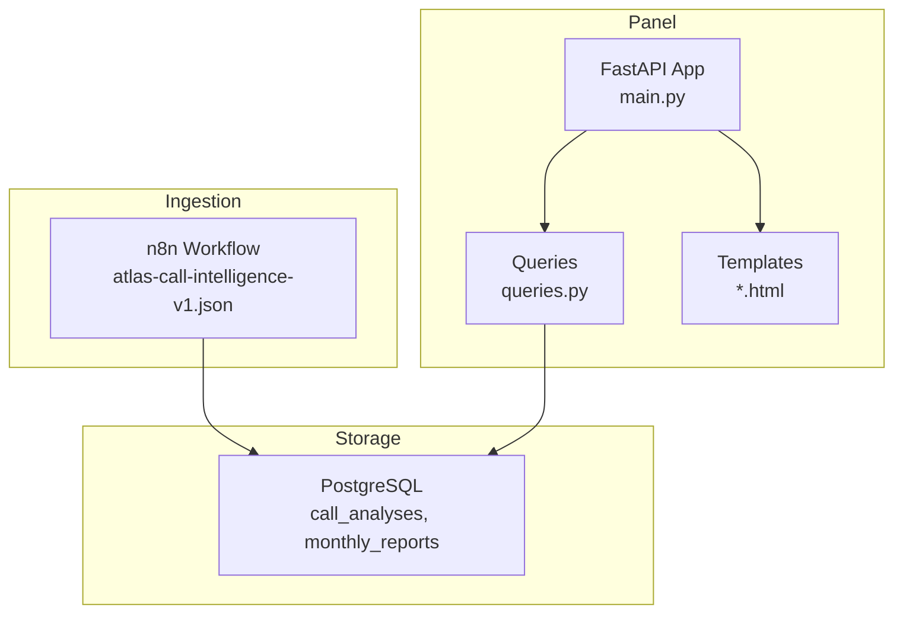
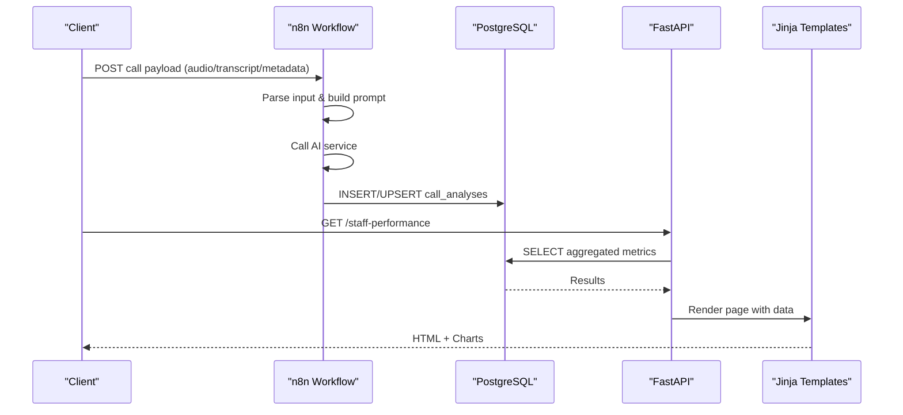
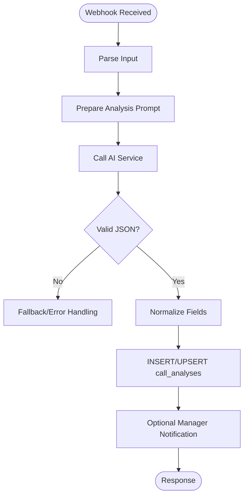
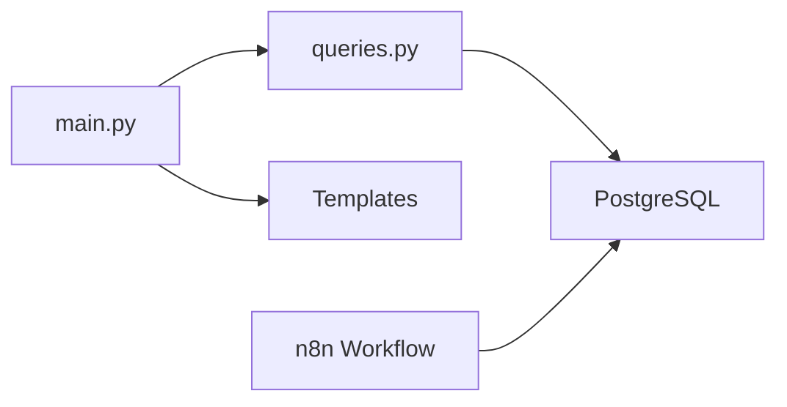
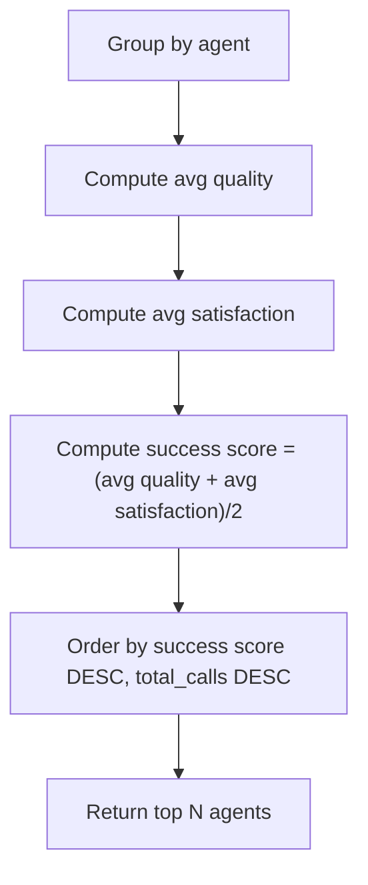
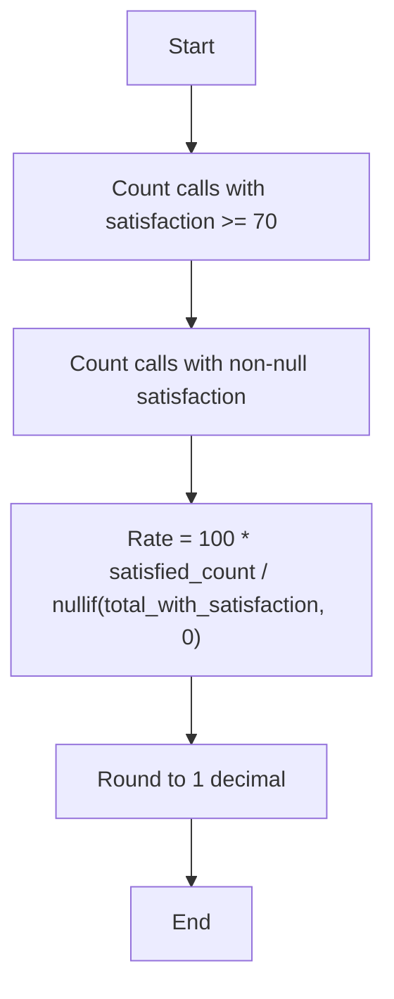

# Staff Performance Metrics

<cite>
**Referenced Files in This Document**
- [main.py](file://docker/panel/app/main.py)
- [queries.py](file://docker/panel/app/queries.py)
- [001_call_intelligence.sql](file://docker/postgres/init/001_call_intelligence.sql)
- [002_panel_seed.sql](file://docker/postgres/init/002_panel_seed.sql)
- [staff_performance.html](file://docker/panel/templates/staff_performance.html)
- [top_performers.html](file://docker/panel/templates/top_performers.html)
- [satisfaction.html](file://docker/panel/templates/satisfaction.html)
- [dashboard.html](file://docker/panel/templates/dashboard.html)
- [atlas-call-intelligence-v1.json](file://docker/n8n/workflows/atlas-call-intelligence-v1.json)
</cite>

## Table of Contents
1. [Introduction](#introduction)
2. [Project Structure](#project-structure)
3. [Core Components](#core-components)
4. [Architecture Overview](#architecture-overview)
5. [Detailed Component Analysis](#detailed-component-analysis)
6. [Dependency Analysis](#dependency-analysis)
7. [Performance Considerations](#performance-considerations)
8. [Troubleshooting Guide](#troubleshooting-guide)
9. [Conclusion](#conclusion)
10. [Appendices](#appendices)

## Introduction
This document explains the staff performance analytics system for agent evaluation and team management. It covers how call volume, customer satisfaction, and quality assessment are measured; how individual and team metrics are aggregated; and how to visualize trends and generate reports. It also provides guidance on filtering by date ranges, departments, and thresholds, as well as customizing metrics and adding new evaluation criteria.

## Project Structure
The system is composed of:
- A FastAPI panel that serves dashboards and report pages
- PostgreSQL tables storing per-call AI analysis and monthly reports
- n8n workflow that ingests call data, runs AI analysis, and persists results
- Jinja templates rendering charts and tables for performance views

**Diagram sources**
- [atlas-call-intelligence-v1.json:1-160](file://docker/n8n/workflows/atlas-call-intelligence-v1.json#L1-L160)
- [001_call_intelligence.sql:4-45](file://docker/postgres/init/001_call_intelligence.sql#L4-L45)
- [main.py:85-187](file://docker/panel/app/main.py#L85-L187)
- [queries.py:6-260](file://docker/panel/app/queries.py#L6-L260)

**Section sources**
- [main.py:85-187](file://docker/panel/app/main.py#L85-L187)
- [queries.py:6-260](file://docker/panel/app/queries.py#L6-L260)
- [001_call_intelligence.sql:4-45](file://docker/postgres/init/001_call_intelligence.sql#L4-L45)
- [atlas-call-intelligence-v1.json:1-160](file://docker/n8n/workflows/atlas-call-intelligence-v1.json#L1-L160)

## Core Components
- Data model: Per-call records with scores and metadata, plus monthly aggregates.
- Ingestion pipeline: Webhook-driven workflow parses inputs, calls AI, validates output, and writes normalized fields into the database.
- Reporting layer: FastAPI endpoints fetch aggregated metrics via SQL queries and render them in HTML templates with charts.

Key metrics used across the system:
- Call volume: total_calls per agent or department
- Customer satisfaction: satisfaction_final_score and derived satisfaction_rate_percent
- Quality assessment: agent_quality_score
- Sales intent: purchase_intent_score and derived hot_leads counts
- Operational flags: needs_human_review, ticket_priority

**Section sources**
- [001_call_intelligence.sql:4-45](file://docker/postgres/init/001_call_intelligence.sql#L4-L45)
- [atlas-call-intelligence-v1.json:26-80](file://docker/n8n/workflows/atlas-call-intelligence-v1.json#L26-L80)
- [queries.py:6-260](file://docker/panel/app/queries.py#L6-L260)

## Architecture Overview
End-to-end flow from call ingestion to performance reporting:

**Diagram sources**
- [atlas-call-intelligence-v1.json:26-80](file://docker/n8n/workflows/atlas-call-intelligence-v1.json#L26-L80)
- [main.py:124-145](file://docker/panel/app/main.py#L124-L145)
- [queries.py:109-165](file://docker/panel/app/queries.py#L109-L165)

## Detailed Component Analysis

### Data Model and Scoring Fields
- call_analyses stores per-call metrics including:
  - agent_id, agent_name, department
  - call_duration_seconds, call_date, call_direction
  - purchase_intent_score, satisfaction_final_score, agent_quality_score
  - needs_human_review, ticket_priority
  - analysis_json (full AI output), transcript_text
- monthly_reports stores monthly summaries per department

These fields enable:
- Agent-level aggregation (quality, satisfaction, sales intent)
- Department-level breakdowns
- Time-based trend analysis using call_date or analyzed_at

**Section sources**
- [001_call_intelligence.sql:4-45](file://docker/postgres/init/001_call_intelligence.sql#L4-L45)

### Ingestion and Normalization (AI Pipeline)
- The workflow accepts a webhook with audio/transcript and metadata
- It constructs an analysis prompt and calls an AI endpoint
- It parses the JSON response, extracts key fields, and persists normalized values into call_analyses
- It can send manager notifications and return a structured response

**Diagram sources**
- [atlas-call-intelligence-v1.json:26-80](file://docker/n8n/workflows/atlas-call-intelligence-v1.json#L26-L80)

**Section sources**
- [atlas-call-intelligence-v1.json:26-80](file://docker/n8n/workflows/atlas-call-intelligence-v1.json#L26-L80)

### Performance Scoring Algorithms
- Success score (ranking): average of agent_quality_score and satisfaction_final_score
- Satisfaction rate percent: percentage of calls where satisfaction_final_score >= 70
- Hot leads: count of calls where purchase_intent_score >= 70
- Unhappy customers: calls with satisfaction_final_score < 60 or flagged for human review or high retention risk

These formulas are implemented directly in SQL aggregations for efficiency and consistency.

**Section sources**
- [queries.py:26-49](file://docker/panel/app/queries.py#L26-L49)
- [queries.py:79-106](file://docker/panel/app/queries.py#L79-L106)
- [queries.py:147-165](file://docker/panel/app/queries.py#L147-L165)

### Call Volume Tracking
- Total calls per agent and per department are computed via COUNT(*)
- Duration metrics include sum, average, and max call durations per agent
- Recent calls list supports time-based sorting using call_date or analyzed_at

**Section sources**
- [queries.py:109-144](file://docker/panel/app/queries.py#L109-L144)
- [queries.py:214-225](file://docker/panel/app/queries.py#L214-L225)

### Customer Satisfaction Metrics
- Average satisfaction per agent
- Satisfied/unhappy counts based on thresholds
- Satisfaction rate percent for comparative analysis

**Section sources**
- [queries.py:147-165](file://docker/panel/app/queries.py#L147-L165)
- [satisfaction.html:1-44](file://docker/panel/templates/satisfaction.html#L1-L44)

### Quality Assessment Criteria
- agent_quality_score reflects AI-derived quality of agent responses
- Used in success score and top performers ranking
- Human review flag helps identify calls needing manual QA

**Section sources**
- [queries.py:26-49](file://docker/panel/app/queries.py#L26-L49)
- [queries.py:109-127](file://docker/panel/app/queries.py#L109-L127)

### Data Aggregation Patterns
- Grouping by agent_name/agent_id and department
- Conditional aggregation using FILTER clauses for counts and rates
- Ordering by composite scores and volumes to highlight top performers

**Section sources**
- [queries.py:26-49](file://docker/panel/app/queries.py#L26-L49)
- [queries.py:109-165](file://docker/panel/app/queries.py#L109-L165)

### Comparative Analysis Between Team Members
- Top performers page ranks agents by success score and total calls
- Department breakdown shows relative performance across teams
- Satisfaction and quality comparisons are available via dedicated pages

**Section sources**
- [top_performers.html:1-32](file://docker/panel/templates/top_performers.html#L1-L32)
- [queries.py:26-49](file://docker/panel/app/queries.py#L26-L49)
- [queries.py:235-247](file://docker/panel/app/queries.py#L235-L247)

### Performance Trend Visualization
- Bar chart comparing quality vs satisfaction per agent
- Line chart showing satisfaction rate percent across agents
- Dashboard includes KPI cards and department distribution chart

**Section sources**
- [staff_performance.html:35-51](file://docker/panel/templates/staff_performance.html#L35-L51)
- [satisfaction.html:29-43](file://docker/panel/templates/satisfaction.html#L29-L43)
- [dashboard.html:4-11](file://docker/panel/templates/dashboard.html#L4-L11)
- [dashboard.html:66-80](file://docker/panel/templates/dashboard.html#L66-L80)

### Filtering Examples
- Date range filters: Use WHERE conditions on call_date or analyzed_at in queries to limit to specific periods
- Department filters: Add department = 'sales' or 'support' to groupings and counts
- Threshold filters: Apply conditions like satisfaction_final_score >= 70 or purchase_intent_score >= 70 for targeted lists

Implementation references:
- Existing threshold-based filters are used for hot leads, unhappy customers, and successful sales
- Date-based ordering and recent calls demonstrate time-aware queries

**Section sources**
- [queries.py:52-76](file://docker/panel/app/queries.py#L52-L76)
- [queries.py:79-106](file://docker/panel/app/queries.py#L79-L106)
- [queries.py:168-192](file://docker/panel/app/queries.py#L168-L192)
- [queries.py:214-225](file://docker/panel/app/queries.py#L214-L225)

### Guidelines for Customizing Metrics and Adding New Criteria
- Extend scoring: Add new numeric fields to call_analyses and compute averages/rates in queries
- Introduce thresholds: Define business rules (e.g., “high risk” retention) and add FILTER conditions
- Update UI: Modify templates to display new metrics and charts
- Maintain consistency: Ensure ingestion pipeline maps AI outputs to normalized fields

References:
- Schema defines extensible JSONB field for detailed analysis
- Queries show patterns for computing averages, counts, and percentages
- Templates illustrate how to render new metrics

**Section sources**
- [001_call_intelligence.sql:4-45](file://docker/postgres/init/001_call_intelligence.sql#L4-L45)
- [queries.py:6-260](file://docker/panel/app/queries.py#L6-L260)
- [staff_performance.html:1-52](file://docker/panel/templates/staff_performance.html#L1-L52)

### Generating Performance Reports
- Monthly reports table stores aggregated summaries per month and department
- Panel exposes endpoints to list and view monthly report details
- Use existing queries to pull report metadata and content

**Section sources**
- [001_call_intelligence.sql:34-45](file://docker/postgres/init/001_call_intelligence.sql#L34-L45)
- [queries.py:195-211](file://docker/panel/app/queries.py#L195-L211)
- [main.py:156-172](file://docker/panel/app/main.py#L156-L172)

## Dependency Analysis
The panel depends on:
- Database schema for consistent metric storage
- Queries module for all aggregation logic
- Templates for rendering visualizations
- n8n workflow for data ingestion and normalization

**Diagram sources**
- [main.py:85-187](file://docker/panel/app/main.py#L85-L187)
- [queries.py:6-260](file://docker/panel/app/queries.py#L6-L260)
- [atlas-call-intelligence-v1.json:1-160](file://docker/n8n/workflows/atlas-call-intelligence-v1.json#L1-L160)
- [001_call_intelligence.sql:4-45](file://docker/postgres/init/001_call_intelligence.sql#L4-L45)

**Section sources**
- [main.py:85-187](file://docker/panel/app/main.py#L85-L187)
- [queries.py:6-260](file://docker/panel/app/queries.py#L6-L260)
- [atlas-call-intelligence-v1.json:1-160](file://docker/n8n/workflows/atlas-call-intelligence-v1.json#L1-L160)
- [001_call_intelligence.sql:4-45](file://docker/postgres/init/001_call_intelligence.sql#L4-L45)

## Performance Considerations
- Use indexes on frequently filtered columns (analyzed_at, agent_id, department, call_date) to speed up queries
- Prefer server-side aggregation in SQL rather than client-side processing
- Limit result sets with LIMIT and pagination for large datasets
- Cache dashboard stats if needed to reduce repeated heavy queries

[No sources needed since this section provides general guidance]

## Troubleshooting Guide
Common issues and resolutions:
- Missing agent names: Queries use COALESCE to fallback to agent_id; ensure ingestion populates agent identifiers
- Empty charts: Verify data exists for selected filters; check thresholds and date ranges
- High human review counts: Investigate needs_human_review flags and associated reasons in analysis_json
- Incorrect scores: Validate AI output mapping and ensure normalized fields are populated correctly

Operational checks:
- Confirm database connectivity and credentials
- Validate n8n workflow execution logs for parse errors or failed inserts
- Review recent calls to ensure timely updates

**Section sources**
- [queries.py:26-49](file://docker/panel/app/queries.py#L26-L49)
- [queries.py:214-232](file://docker/panel/app/queries.py#L214-L232)
- [atlas-call-intelligence-v1.json:63-80](file://docker/n8n/workflows/atlas-call-intelligence-v1.json#L63-L80)

## Conclusion
The staff performance analytics system provides robust measurement of agent quality, customer satisfaction, and sales intent through a clear ingestion pipeline, normalized data model, and efficient SQL aggregations. Dashboards and charts support comparative analysis and trend visualization, while monthly reports enable historical tracking. Extensibility is built-in via JSONB and modular queries, allowing teams to customize metrics and thresholds to fit evolving business needs.

[No sources needed since this section summarizes without analyzing specific files]

## Appendices

### Example: Top Performers Ranking Logic

**Diagram sources**
- [queries.py:26-49](file://docker/panel/app/queries.py#L26-L49)

**Section sources**
- [queries.py:26-49](file://docker/panel/app/queries.py#L26-L49)

### Example: Satisfaction Rate Calculation

**Diagram sources**
- [queries.py:147-165](file://docker/panel/app/queries.py#L147-L165)

**Section sources**
- [queries.py:147-165](file://docker/panel/app/queries.py#L147-L165)