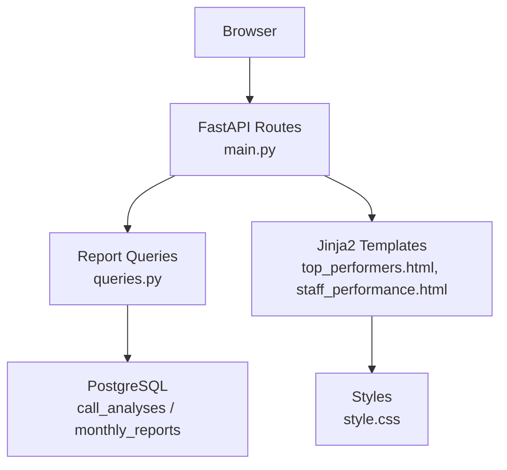
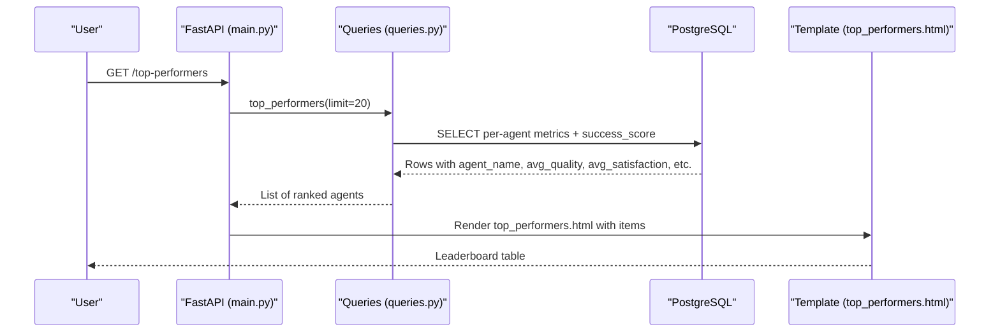
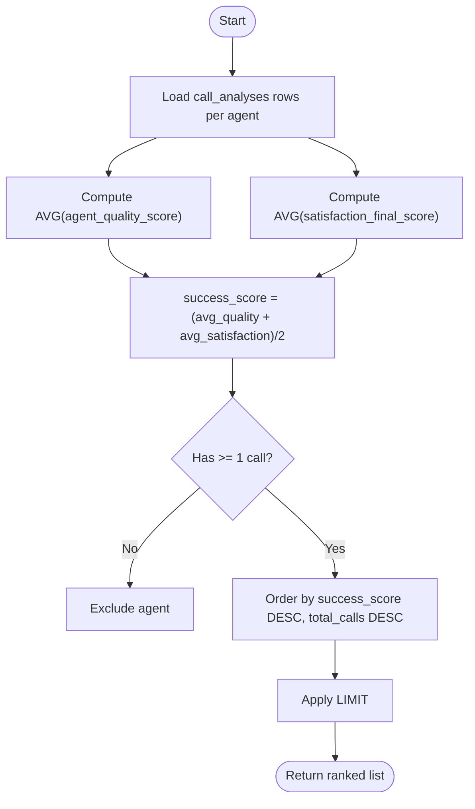
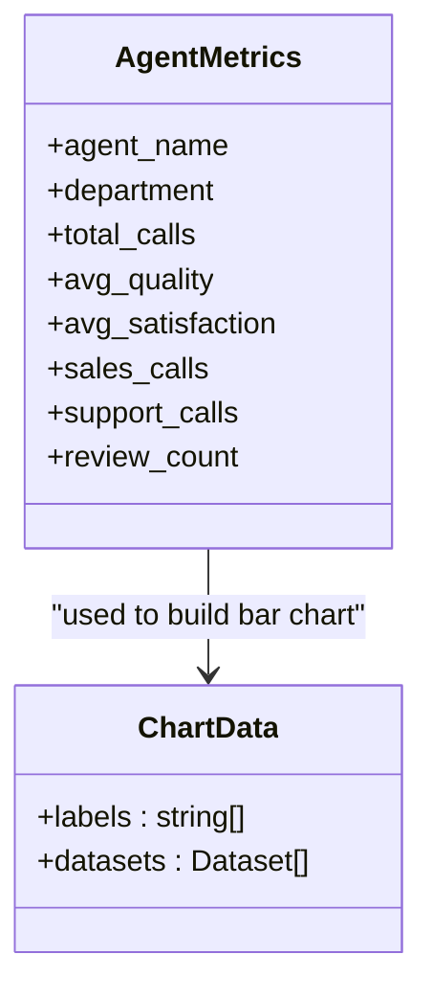
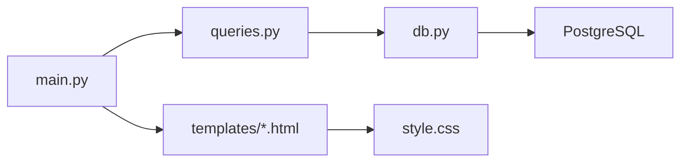

# Top Performers Analysis

<cite>
**Referenced Files in This Document**
- [main.py](file://docker/panel/app/main.py)
- [queries.py](file://docker/panel/app/queries.py)
- [db.py](file://docker/panel/app/db.py)
- [config.py](file://docker/panel/app/config.py)
- [top_performers.html](file://docker/panel/templates/top_performers.html)
- [staff_performance.html](file://docker/panel/templates/staff_performance.html)
- [base.html](file://docker/panel/templates/base.html)
- [style.css](file://docker/panel/static/css/style.css)
- [001_call_intelligence.sql](file://docker/postgres/init/001_call_intelligence.sql)
</cite>

## Table of Contents
1. [Introduction](#introduction)
2. [Project Structure](#project-structure)
3. [Core Components](#core-components)
4. [Architecture Overview](#architecture-overview)
5. [Detailed Component Analysis](#detailed-component-analysis)
6. [Dependency Analysis](#dependency-analysis)
7. [Performance Considerations](#performance-considerations)
8. [Troubleshooting Guide](#troubleshooting-guide)
9. [Conclusion](#conclusion)
10. [Appendices](#appendices)

## Introduction
This document explains how the Atlas Manager Panel identifies and analyzes top-performing agents and teams. It covers ranking algorithms, performance criteria weighting, comparative analysis features, data visualization patterns for leaderboards and achievement tracking, and guidance for filtering by time periods, departments, and performance categories. It also provides guidelines to customize ranking criteria, add new performance indicators, and implement automated recognition workflows.

## Project Structure
The panel is a FastAPI application that serves HTML templates and renders analytics from PostgreSQL. The key parts relevant to top performers are:
- API routes that load pages and pass query results to templates
- Query module that computes metrics and rankings from call analysis records
- Database schema defining call-level metrics and monthly reports
- Templates that render tables and charts for performance leaderboards

**Diagram sources**
- [main.py:85-105](file://docker/panel/app/main.py#L85-L105)
- [queries.py:26-49](file://docker/panel/app/queries.py#L26-L49)
- [001_call_intelligence.sql:4-44](file://docker/postgres/init/001_call_intelligence.sql#L4-L44)
- [top_performers.html:1-31](file://docker/panel/templates/top_performers.html#L1-L31)
- [staff_performance.html:1-52](file://docker/panel/templates/staff_performance.html#L1-L52)
- [style.css:1-117](file://docker/panel/static/css/style.css#L1-L117)

**Section sources**
- [main.py:85-105](file://docker/panel/app/main.py#L85-L105)
- [001_call_intelligence.sql:4-44](file://docker/postgres/init/001_call_intelligence.sql#L4-L44)

## Core Components
- Ranking algorithm: A composite success score computed per agent as the average of quality and satisfaction scores, used to rank agents on the top performers leaderboard.
- Performance criteria: Quality, satisfaction, purchase intent, hot leads, happy customers, total calls, and department-specific call counts.
- Comparative analysis: Staff performance view aggregates metrics by agent and department, with a bar chart comparing quality and satisfaction.
- Data visualization: Tables for leaderboards; Chart.js bar chart for side-by-side metric comparison; badges for highlighting key values.

Key implementation references:
- Success score computation and ranking: [queries.py:26-49](file://docker/panel/app/queries.py#L26-L49)
- Staff performance aggregation and chart data: [queries.py:109-127](file://docker/panel/app/queries.py#L109-L127), [staff_performance.html:35-51](file://docker/panel/templates/staff_performance.html#L35-L51)
- Leaderboard rendering: [top_performers.html:4-30](file://docker/panel/templates/top_performers.html#L4-L30)

**Section sources**
- [queries.py:26-49](file://docker/panel/app/queries.py#L26-L49)
- [queries.py:109-127](file://docker/panel/app/queries.py#L109-L127)
- [top_performers.html:4-30](file://docker/panel/templates/top_performers.html#L4-L30)
- [staff_performance.html:35-51](file://docker/panel/templates/staff_performance.html#L35-L51)

## Architecture Overview
The request flow for the top performers page:
1. User navigates to /top-performers.
2. FastAPI route loads the template and fetches top performers via queries.top_performers(limit).
3. The query computes per-agent averages and a success score, then orders by descending success score and total calls.
4. Template renders a table with agent name, call count, success score, quality, satisfaction, intent, and hot leads.

**Diagram sources**
- [main.py:100-105](file://docker/panel/app/main.py#L100-L105)
- [queries.py:26-49](file://docker/panel/app/queries.py#L26-L49)
- [top_performers.html:4-30](file://docker/panel/templates/top_performers.html#L4-L30)

## Detailed Component Analysis

### Ranking Algorithm and Criteria Weighting
- Success score formula: Average of agent quality score and satisfaction final score.
- Ranking order: Primary by success score descending, secondary by total calls descending.
- Minimum activity filter: Agents must have at least one recorded call.
- Department-aware views: Staff performance groups by agent and department to compare across teams.

Implementation details:
- Success score calculation and ordering: [queries.py:26-49](file://docker/panel/app/queries.py#L26-L49)
- Department grouping and additional metrics: [queries.py:109-127](file://docker/panel/app/queries.py#L109-L127)

**Diagram sources**
- [queries.py:26-49](file://docker/panel/app/queries.py#L26-L49)

**Section sources**
- [queries.py:26-49](file://docker/panel/app/queries.py#L26-L49)

### Comparative Analysis Features
- Staff performance view aggregates per agent: total calls, average quality, average satisfaction, average intent, sales/support call counts, and review count.
- Visualization: Bar chart compares quality vs satisfaction per agent using Chart.js.

Implementation details:
- Aggregation query: [queries.py:109-127](file://docker/panel/app/queries.py#L109-L127)
- Chart rendering: [staff_performance.html:35-51](file://docker/panel/templates/staff_performance.html#L35-L51)

**Diagram sources**
- [queries.py:109-127](file://docker/panel/app/queries.py#L109-L127)
- [staff_performance.html:35-51](file://docker/panel/templates/staff_performance.html#L35-L51)

**Section sources**
- [queries.py:109-127](file://docker/panel/app/queries.py#L109-L127)
- [staff_performance.html:35-51](file://docker/panel/templates/staff_performance.html#L35-L51)

### Data Visualization Patterns
- Leaderboard table: Columns include agent name, call volume, success score (highlighted with a gold badge), quality, satisfaction, intent, and hot leads.
- Achievement tracking: Hot leads and happy customer counts indicate high-performing outcomes.
- Recognition metrics: Satisfaction rate and review counts help identify coaching needs or recognition opportunities.

Implementation details:
- Leaderboard columns and badges: [top_performers.html:4-30](file://docker/panel/templates/top_performers.html#L4-L30)
- Styling for badges and cards: [style.css:41-77](file://docker/panel/static/css/style.css#L41-L77)

**Section sources**
- [top_performers.html:4-30](file://docker/panel/templates/top_performers.html#L4-L30)
- [style.css:41-77](file://docker/panel/static/css/style.css#L41-L77)

### Filtering by Time Periods, Departments, and Categories
- Current state: Queries do not apply date filters or department filters in the top performers endpoint.
- To add time-based filtering:
  - Add WHERE clauses on analyzed_at or call_date in the top performers query.
  - Expose parameters in the route and pass them into the query function.
- To add department/category filtering:
  - Add WHERE department IN (...) or other category filters to the query.
  - Extend the route to accept department/category parameters.

References for extending:
- Route definition: [main.py:100-105](file://docker/panel/app/main.py#L100-L105)
- Query structure to modify: [queries.py:26-49](file://docker/panel/app/queries.py#L26-L49)

**Section sources**
- [main.py:100-105](file://docker/panel/app/main.py#L100-L105)
- [queries.py:26-49](file://docker/panel/app/queries.py#L26-L49)

### Customizing Ranking Criteria and Adding New Indicators
- Adjust weights: Modify the success_score formula to incorporate additional metrics (e.g., weighted average of quality, satisfaction, and intent).
- Add new indicators: Include new fields from call_analyses (e.g., conversion rate, retention risk) in the SELECT and ORDER BY clauses.
- Update UI: Extend the leaderboard table and charts to display new metrics.

Guidance:
- Edit ranking logic in: [queries.py:26-49](file://docker/panel/app/queries.py#L26-L49)
- Extend template columns in: [top_performers.html:4-30](file://docker/panel/templates/top_performers.html#L4-L30)
- Ensure new fields exist in schema or JSONB extraction: [001_call_intelligence.sql:4-44](file://docker/postgres/init/001_call_intelligence.sql#L4-L44)

**Section sources**
- [queries.py:26-49](file://docker/panel/app/queries.py#L26-L49)
- [top_performers.html:4-30](file://docker/panel/templates/top_performers.html#L4-L30)
- [001_call_intelligence.sql:4-44](file://docker/postgres/init/001_call_intelligence.sql#L4-L44)

### Automated Recognition Workflows
- Trigger points: Use thresholds such as success_score above a target, hot_leads above a threshold, or satisfaction_rate_percent exceeding a benchmark.
- Actions: Send notifications, update recognition flags, or generate awards based on periodic runs.
- Integration points:
  - Schedule jobs to run queries like staff_satisfaction and top_performers.
  - Use AI insights context payload to enrich recognition decisions.

References:
- Satisfaction rate and counts: [queries.py:147-165](file://docker/panel/app/queries.py#L147-L165)
- AI context payload combining multiple metrics: [queries.py:250-259](file://docker/panel/app/queries.py#L250-L259)

**Section sources**
- [queries.py:147-165](file://docker/panel/app/queries.py#L147-L165)
- [queries.py:250-259](file://docker/panel/app/queries.py#L250-L259)

## Dependency Analysis
- FastAPI app mounts static assets and uses Jinja2 templates.
- Authentication middleware protects routes when PANEL_PASSWORD is set.
- Database access is centralized in db.py with connection management and cursor handling.
- Queries depend on the call_analyses table schema and indexes for performance.

**Diagram sources**
- [main.py:1-23](file://docker/panel/app/main.py#L1-L23)
- [db.py:1-31](file://docker/panel/app/db.py#L1-L31)
- [001_call_intelligence.sql:4-44](file://docker/postgres/init/001_call_intelligence.sql#L4-L44)

**Section sources**
- [main.py:1-23](file://docker/panel/app/main.py#L1-L23)
- [db.py:1-31](file://docker/panel/app/db.py#L1-L31)
- [001_call_intelligence.sql:4-44](file://docker/postgres/init/001_call_intelligence.sql#L4-L44)

## Performance Considerations
- Indexes: The schema includes indexes on analyzed_at, agent_id, department, and call_date to support efficient filtering and grouping.
- Aggregations: GROUP BY on agent fields and COUNT FILTER reduce client-side processing.
- Limits: Queries use LIMIT to control result set size for responsive UI rendering.
- Caching: Template cache disabled for development compatibility; consider enabling caching in production for performance.

Recommendations:
- Add composite indexes if frequent filters combine department and date ranges.
- Precompute monthly rollups in monthly_reports for historical comparisons.
- Use pagination for large datasets beyond current LIMIT usage.

**Section sources**
- [001_call_intelligence.sql:29-44](file://docker/postgres/init/001_call_intelligence.sql#L29-L44)
- [queries.py:26-49](file://docker/panel/app/queries.py#L26-L49)
- [main.py:21-22](file://docker/panel/app/main.py#L21-L22)

## Troubleshooting Guide
- Authentication issues: If PANEL_PASSWORD is set, ensure the login cookie is present; otherwise, redirects will occur.
- Empty leaderboards: Verify that call_analyses has records with agent identifiers and non-null scores; check HAVING clause requirements.
- Chart not rendering: Ensure Chart.js is loaded and data array is non-empty; inspect console errors.
- Database connectivity: Validate environment variables for DB_HOST, DB_PORT, DB_NAME, DB_USER, DB_PASSWORD.

References:
- Auth middleware and login: [main.py:57-82](file://docker/panel/app/main.py#L57-L82)
- Environment configuration: [config.py:1-14](file://docker/panel/app/config.py#L1-L14)
- Database helpers: [db.py:8-31](file://docker/panel/app/db.py#L8-L31)

**Section sources**
- [main.py:57-82](file://docker/panel/app/main.py#L57-L82)
- [config.py:1-14](file://docker/panel/app/config.py#L1-L14)
- [db.py:8-31](file://docker/panel/app/db.py#L8-L31)

## Conclusion
The Atlas Manager Panel provides a clear, extensible framework for identifying top performers through a transparent success score derived from quality and satisfaction. The system supports comparative analysis via aggregated staff metrics and visualizations. While current endpoints do not filter by time or department, the modular design allows straightforward extension to add these capabilities. Customization of ranking criteria and integration of automated recognition workflows can be implemented by adjusting queries and leveraging existing metrics and AI context payloads.

## Appendices

### Example: Extending Filters and Metrics
- Add date range filters to top_performers:
  - Modify query to include WHERE analyzed_at BETWEEN ... AND ...
  - Update route to accept start_date and end_date parameters.
- Add department/category filters:
  - Add WHERE department IN ('sales', 'support') to query.
  - Update route to accept department parameter.
- Introduce new indicator:
  - Add field to SELECT and ORDER BY in query.
  - Update template to display new column.

References:
- Route and query modification points: [main.py:100-105](file://docker/panel/app/main.py#L100-L105), [queries.py:26-49](file://docker/panel/app/queries.py#L26-L49)

**Section sources**
- [main.py:100-105](file://docker/panel/app/main.py#L100-L105)
- [queries.py:26-49](file://docker/panel/app/queries.py#L26-L49)