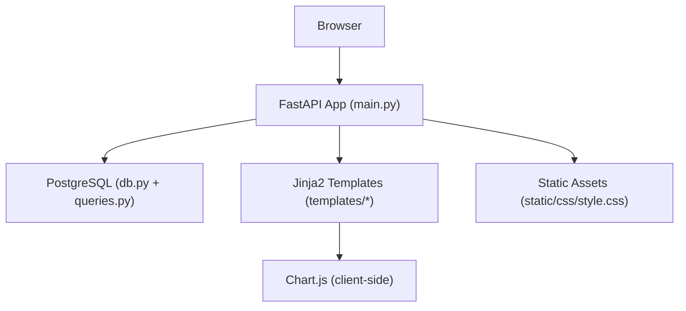
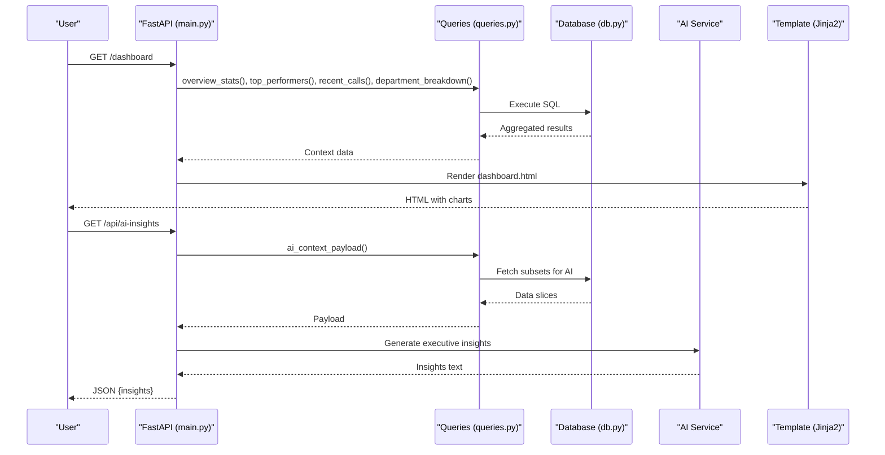
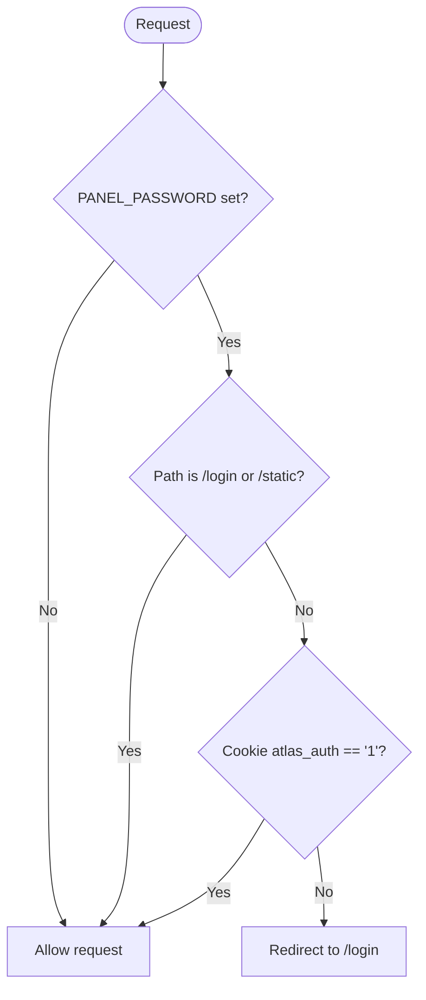
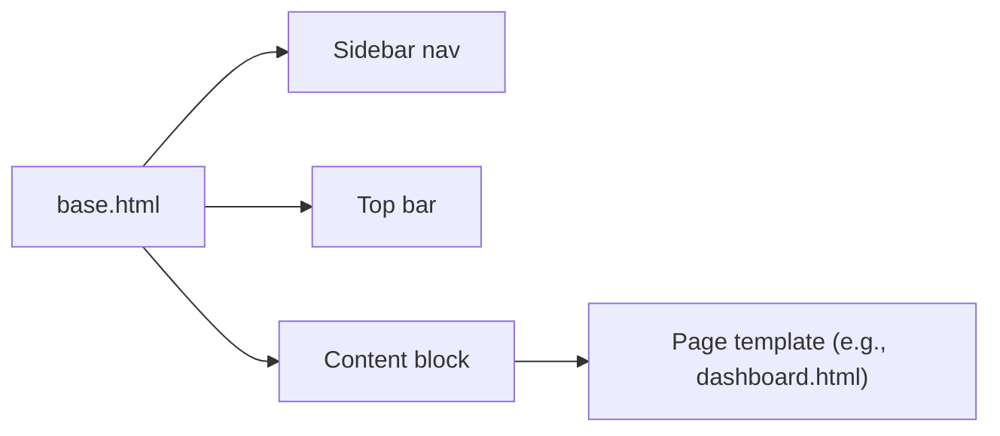
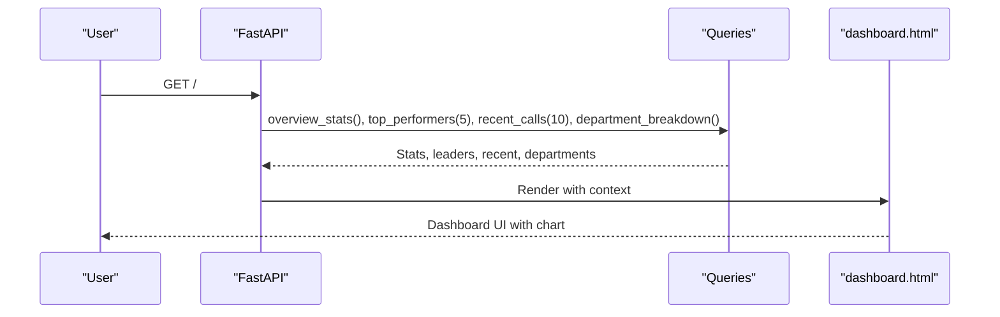
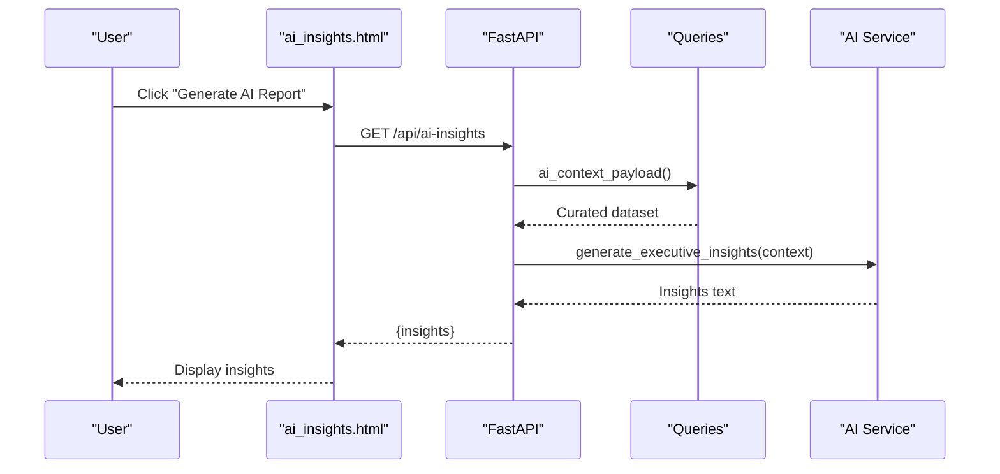
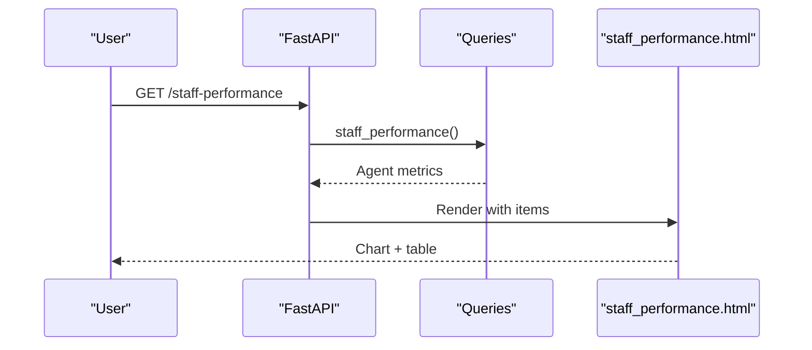
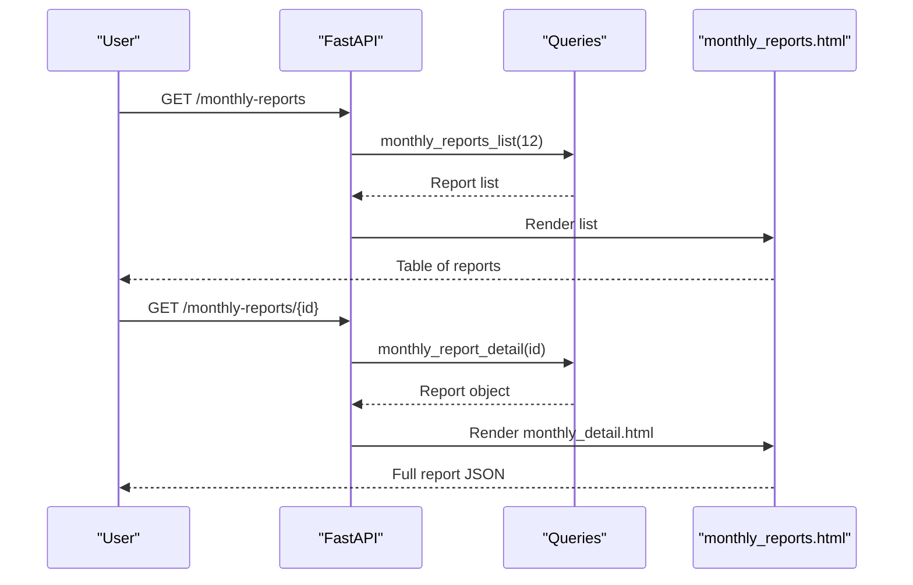
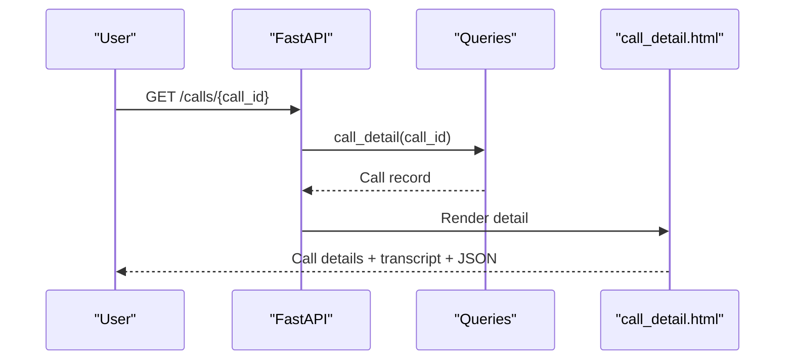
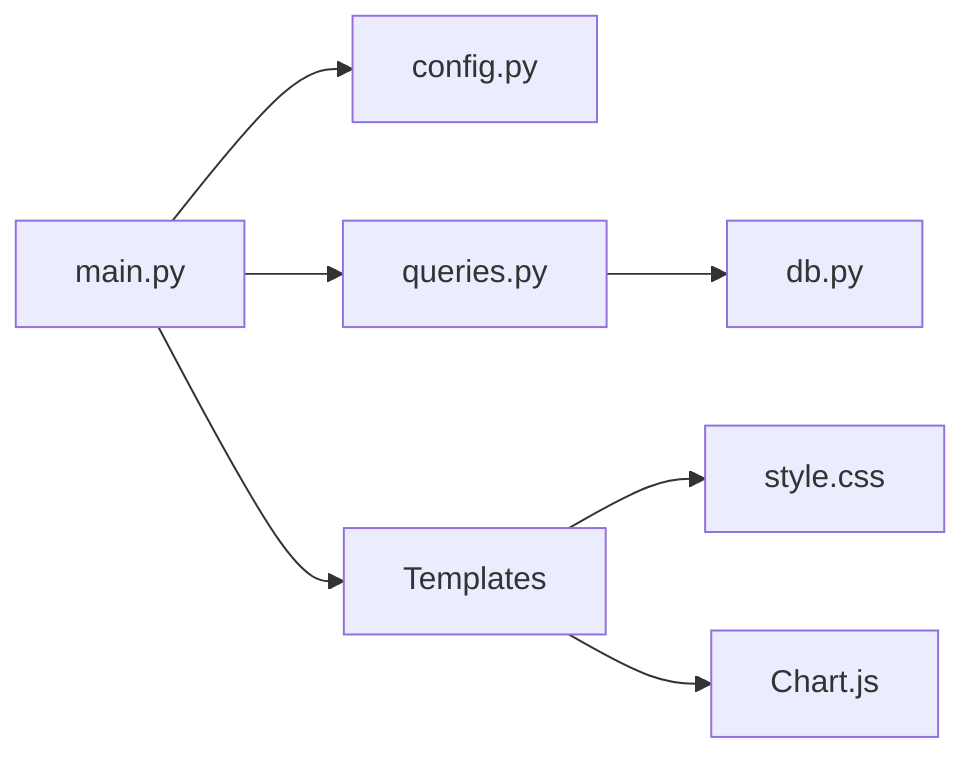

# Dashboard Interface

<cite>
**Referenced Files in This Document**
- [main.py](file://docker/panel/app/main.py)
- [config.py](file://docker/panel/app/config.py)
- [db.py](file://docker/panel/app/db.py)
- [queries.py](file://docker/panel/app/queries.py)
- [base.html](file://docker/panel/templates/base.html)
- [dashboard.html](file://docker/panel/templates/dashboard.html)
- [ai_insights.html](file://docker/panel/templates/ai_insights.html)
- [staff_performance.html](file://docker/panel/templates/staff_performance.html)
- [monthly_reports.html](file://docker/panel/templates/monthly_reports.html)
- [call_detail.html](file://docker/panel/templates/call_detail.html)
- [monthly_detail.html](file://docker/panel/templates/monthly_detail.html)
- [login.html](file://docker/panel/templates/login.html)
- [style.css](file://docker/panel/static/css/style.css)
</cite>

## Table of Contents
1. Introduction
2. Project Structure
3. Core Components
4. Architecture Overview
5. Detailed Component Analysis
6. Dependency Analysis
7. Performance Considerations
8. Troubleshooting Guide
9. Conclusion
10. Appendices

## Introduction
This document describes the management dashboard interface for call intelligence analytics. It focuses on user interaction patterns, navigation structure, and workflows for accessing insights such as AI-generated executive summaries, staff performance metrics, and monthly reports. It also covers template customization, responsive design, accessibility considerations, authentication flow, session management, permissions, and strategies for handling large datasets and real-time updates.

## Project Structure
The dashboard is a FastAPI application with server-side rendered Jinja2 templates and static assets. The main entry point defines routes, middleware for authentication, and context injection into templates. Templates extend a shared base layout that includes a sidebar navigation and top bar. Data is retrieved via PostgreSQL through a small database helper and query module. Charts are rendered client-side using Chart.js.

**Diagram sources**
- [main.py:16-17](file://docker/panel/app/main.py#L16-L17)
- [db.py:8-30](file://docker/panel/app/db.py#L8-L30)
- [queries.py:6-260](file://docker/panel/app/queries.py#L6-L260)
- [base.html:1-46](file://docker/panel/templates/base.html#L1-L46)
- [style.css:1-117](file://docker/panel/static/css/style.css#L1-L117)

**Section sources**
- [main.py:16-187](file://docker/panel/app/main.py#L16-L187)
- [base.html:1-46](file://docker/panel/templates/base.html#L1-L46)
- [style.css:1-117](file://docker/panel/static/css/style.css#L1-L117)

## Core Components
- Application routing and middleware: Centralized endpoints for dashboard pages, detail views, and APIs; HTTP middleware enforces simple password-based access when configured.
- Data layer: A lightweight PostgreSQL connector and a query module providing aggregated metrics, leaderboards, and report lists.
- Presentation layer: Shared base template with sidebar navigation and content blocks; page-specific templates render KPIs, tables, and charts.
- AI insights: An endpoint fetches an AI-generated summary based on a curated data payload from the database.

Key responsibilities:
- main.py: Defines routes, mounts static files, injects global template helpers, and handles authentication redirect logic.
- config.py: Loads environment variables for database credentials, AI settings, panel title, and optional password protection.
- db.py: Provides connection management and generic fetch utilities returning dictionaries.
- queries.py: Encapsulates all SQL logic for dashboards, including overview stats, top performers, satisfaction, monthly reports, and AI context payload.
- Templates: Render structured layouts, interactive charts, and detail views.

**Section sources**
- [main.py:36-187](file://docker/panel/app/main.py#L36-L187)
- [config.py:1-14](file://docker/panel/app/config.py#L1-L14)
- [db.py:8-30](file://docker/panel/app/db.py#L8-L30)
- [queries.py:6-260](file://docker/panel/app/queries.py#L6-L260)
- [base.html:13-41](file://docker/panel/templates/base.html#L13-L41)

## Architecture Overview
The dashboard follows a classic web app architecture:
- Browser requests a route.
- FastAPI handler loads data via queries.py and renders a Jinja2 template.
- Template uses Chart.js to visualize data.
- Optional AI insights are generated by calling an external AI service with a curated dataset.

**Diagram sources**
- [main.py:68-170](file://docker/panel/app/main.py#L68-L170)
- [queries.py:6-260](file://docker/panel/app/queries.py#L6-L260)
- [db.py:8-30](file://docker/panel/app/db.py#L8-L30)

## Detailed Component Analysis

### Authentication and Session Management
- Simple password protection: When PANEL_PASSWORD is set, all non-login and non-static routes require a cookie indicating successful login.
- Login flow:
  - GET /login renders the login form unless PANEL_PASSWORD is disabled.
  - POST /login validates the password and sets an httponly cookie with a one-week expiry.
  - Middleware redirects unauthenticated users to /login.
- Permissions: Single shared password; no per-user roles or scopes.

**Diagram sources**
- [main.py:40-65](file://docker/panel/app/main.py#L40-L65)
- [config.py:12-13](file://docker/panel/app/config.py#L12-L13)

**Section sources**
- [main.py:40-65](file://docker/panel/app/main.py#L40-L65)
- [login.html:1-18](file://docker/panel/templates/login.html#L1-L18)
- [config.py:12-13](file://docker/panel/app/config.py#L12-L13)

### Navigation and Layout
- Base template provides a fixed right-aligned sidebar (RTL layout) with links to all dashboard sections.
- Active state is controlled by passing an active key in context.
- Top bar displays page title and current timestamp.
- Content area renders page-specific blocks.

**Diagram sources**
- [base.html:13-41](file://docker/panel/templates/base.html#L13-L41)

**Section sources**
- [base.html:13-41](file://docker/panel/templates/base.html#L13-L41)

### Dashboard Home
- Displays KPI cards for total calls, hot leads, unhappy count, average satisfaction, average quality, and review needs.
- Shows top performers table and a department distribution chart.
- Lists recent calls with links to detail view.

**Diagram sources**
- [main.py:68-80](file://docker/panel/app/main.py#L68-L80)
- [queries.py:6-49](file://docker/panel/app/queries.py#L6-L49)
- [dashboard.html:4-81](file://docker/panel/templates/dashboard.html#L4-L81)

**Section sources**
- [main.py:68-80](file://docker/panel/app/main.py#L68-L80)
- [queries.py:6-49](file://docker/panel/app/queries.py#L6-L49)
- [dashboard.html:4-81](file://docker/panel/templates/dashboard.html#L4-L81)

### AI Insights
- The AI Insights page shows a button to generate an executive summary.
- On click, the browser calls /api/ai-insights, which builds a context payload from multiple queries and sends it to an AI service to produce insights.
- Results are displayed inline.

**Diagram sources**
- [ai_insights.html:10-24](file://docker/panel/templates/ai_insights.html#L10-L24)
- [main.py:158-170](file://docker/panel/app/main.py#L158-L170)
- [queries.py:250-260](file://docker/panel/app/queries.py#L250-L260)

**Section sources**
- [ai_insights.html:1-25](file://docker/panel/templates/ai_insights.html#L1-L25)
- [main.py:158-170](file://docker/panel/app/main.py#L158-L170)
- [queries.py:250-260](file://docker/panel/app/queries.py#L250-L260)

### Staff Performance Metrics
- Presents a bar chart comparing agent quality and satisfaction.
- Includes a detailed table with call counts, quality, satisfaction, sales/support splits, and review counts.

**Diagram sources**
- [main.py:107-112](file://docker/panel/app/main.py#L107-L112)
- [queries.py:109-127](file://docker/panel/app/queries.py#L109-L127)
- [staff_performance.html:1-52](file://docker/panel/templates/staff_performance.html#L1-L52)

**Section sources**
- [main.py:107-112](file://docker/panel/app/main.py#L107-L112)
- [queries.py:109-127](file://docker/panel/app/queries.py#L109-L127)
- [staff_performance.html:1-52](file://docker/panel/templates/staff_performance.html#L1-L52)

### Monthly Reports
- Lists recent monthly reports with month, department, call count, and creation date.
- Each row links to a detail view showing the full report JSON.

**Diagram sources**
- [main.py:139-155](file://docker/panel/app/main.py#L139-L155)
- [queries.py:195-211](file://docker/panel/app/queries.py#L195-L211)
- [monthly_reports.html:1-23](file://docker/panel/templates/monthly_reports.html#L1-L23)
- [monthly_detail.html:1-8](file://docker/panel/templates/monthly_detail.html#L1-L8)

**Section sources**
- [main.py:139-155](file://docker/panel/app/main.py#L139-L155)
- [queries.py:195-211](file://docker/panel/app/queries.py#L195-L211)
- [monthly_reports.html:1-23](file://docker/panel/templates/monthly_reports.html#L1-L23)
- [monthly_detail.html:1-8](file://docker/panel/templates/monthly_detail.html#L1-L8)

### Call Detail View
- Displays call metadata, duration formatting, scores, transcript, and analysis JSON.
- Accessed from recent calls table or direct link.

**Diagram sources**
- [main.py:173-181](file://docker/panel/app/main.py#L173-L181)
- [queries.py:228-232](file://docker/panel/app/queries.py#L228-L232)
- [call_detail.html:1-29](file://docker/panel/templates/call_detail.html#L1-L29)

**Section sources**
- [main.py:173-181](file://docker/panel/app/main.py#L173-L181)
- [queries.py:228-232](file://docker/panel/app/queries.py#L228-L232)
- [call_detail.html:1-29](file://docker/panel/templates/call_detail.html#L1-L29)

## Dependency Analysis
- main.py depends on:
  - config.py for environment-driven settings
  - db.py for database connectivity
  - queries.py for data retrieval
  - Jinja2 templates for rendering
  - Static assets for styling
- queries.py depends on db.py for fetching rows
- Templates depend on Chart.js for visualizations and style.css for layout

**Diagram sources**
- [main.py:1-17](file://docker/panel/app/main.py#L1-L17)
- [queries.py:1-3](file://docker/panel/app/queries.py#L1-L3)
- [db.py:1-6](file://docker/panel/app/db.py#L1-L6)
- [base.html:7-10](file://docker/panel/templates/base.html#L7-L10)
- [style.css:1-14](file://docker/panel/static/css/style.css#L1-L14)

**Section sources**
- [main.py:1-17](file://docker/panel/app/main.py#L1-L17)
- [queries.py:1-3](file://docker/panel/app/queries.py#L1-L3)
- [db.py:1-6](file://docker/panel/app/db.py#L1-L6)
- [base.html:7-10](file://docker/panel/templates/base.html#L7-L10)
- [style.css:1-14](file://docker/panel/static/css/style.css#L1-L14)

## Performance Considerations
- Database queries:
  - Use LIMIT clauses to cap result sizes for lists (e.g., top performers, recent calls).
  - Aggregate at the database level where possible to reduce payload size.
- Rendering:
  - Keep template payloads minimal; avoid embedding large JSON blobs directly in templates.
  - Use pagination for large tables if needed.
- Real-time updates:
  - For live dashboards, consider adding Server-Sent Events or polling endpoints to refresh KPIs without full page reloads.
  - Cache expensive computations (e.g., AI insights) with short TTLs if appropriate.
- Chart performance:
  - Limit number of data points per chart; aggregate or sample for very large datasets.
  - Debounce resize events and use responsive options provided by Chart.js.

[No sources needed since this section provides general guidance]

## Troubleshooting Guide
- Authentication issues:
  - If PANEL_PASSWORD is set but you cannot log in, ensure the correct password is submitted and cookies are enabled.
  - Verify middleware allows /login and /static paths.
- Missing data:
  - Empty tables indicate no matching records; check database schema and seed data.
  - For monthly reports, ensure the workflow generating reports has run successfully.
- AI insights errors:
  - Ensure AI_API_KEY and AI_MODEL are configured.
  - Validate network access to the AI service and inspect error messages returned by the API.
- Database connectivity:
  - Confirm DB_HOST, DB_PORT, DB_NAME, DB_USER, DB_PASSWORD are correctly set.
  - Test connectivity outside the app to isolate environment issues.

**Section sources**
- [main.py:40-65](file://docker/panel/app/main.py#L40-L65)
- [config.py:1-14](file://docker/panel/app/config.py#L1-L14)
- [monthly_reports.html:16-18](file://docker/panel/templates/monthly_reports.html#L16-L18)
- [ai_insights.html:12-22](file://docker/panel/templates/ai_insights.html#L12-L22)

## Conclusion
The dashboard provides a cohesive, RTL-oriented interface for exploring call intelligence data. It combines server-rendered pages with client-side charts and an AI-powered insights feature. Authentication is simple and configurable via environment variables. The modular separation between routes, queries, and templates makes it straightforward to add new views, customize existing ones, and integrate additional analytics visualizations.

[No sources needed since this section summarizes without analyzing specific files]

## Appendices

### Adding a New Dashboard View
Steps:
- Define a route in main.py that fetches data via queries.py and renders a new template with context.
- Create a new template extending base.html, defining page_title and content blocks.
- Add a navigation link in base.html’s sidebar and set the active state via context.
- Optionally add a corresponding API endpoint for dynamic loading.

**Section sources**
- [main.py:68-187](file://docker/panel/app/main.py#L68-L187)
- [base.html:22-33](file://docker/panel/templates/base.html#L22-L33)

### Customizing Existing Templates
- Override page_title and content blocks in each template.
- Use Chart.js to visualize data passed via context.
- Leverage style.css classes for consistent layout and theming.

**Section sources**
- [base.html:13-41](file://docker/panel/templates/base.html#L13-L41)
- [style.css:1-117](file://docker/panel/static/css/style.css#L1-L117)

### Integrating Additional Analytics Visualizations
- Extend query functions to compute new metrics.
- Pass arrays of labels and values to Chart.js in the template scripts block.
- Use responsive options and limit data points for performance.

**Section sources**
- [queries.py:6-260](file://docker/panel/app/queries.py#L6-L260)
- [dashboard.html:67-81](file://docker/panel/templates/dashboard.html#L67-L81)
- [staff_performance.html:35-52](file://docker/panel/templates/staff_performance.html#L35-L52)

### Accessibility Notes
- The site uses RTL direction and a readable font stack; ensure contrast ratios meet standards.
- Provide meaningful headings and labels for screen readers.
- Avoid relying solely on color to convey status; include text or icons.

[No sources needed since this section provides general guidance]