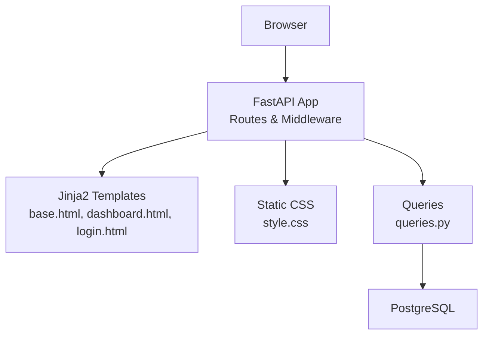
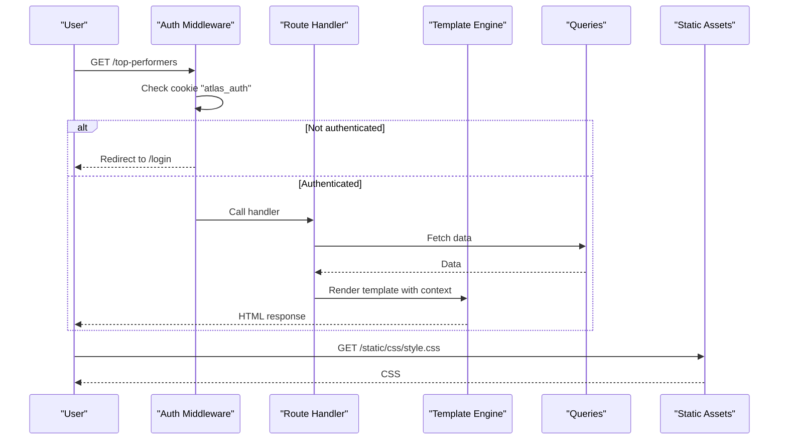
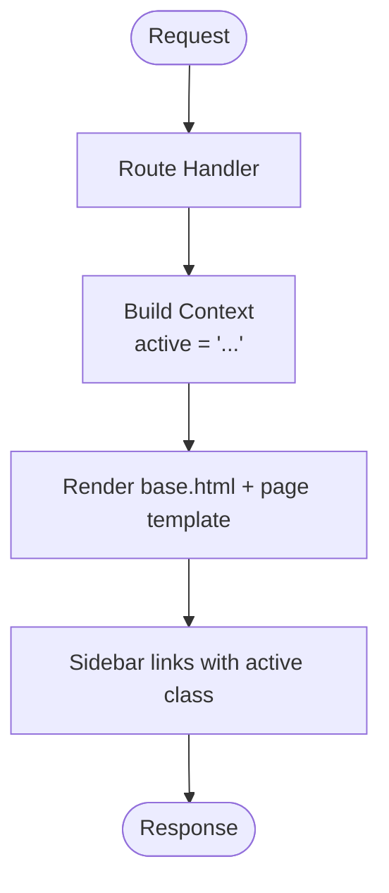
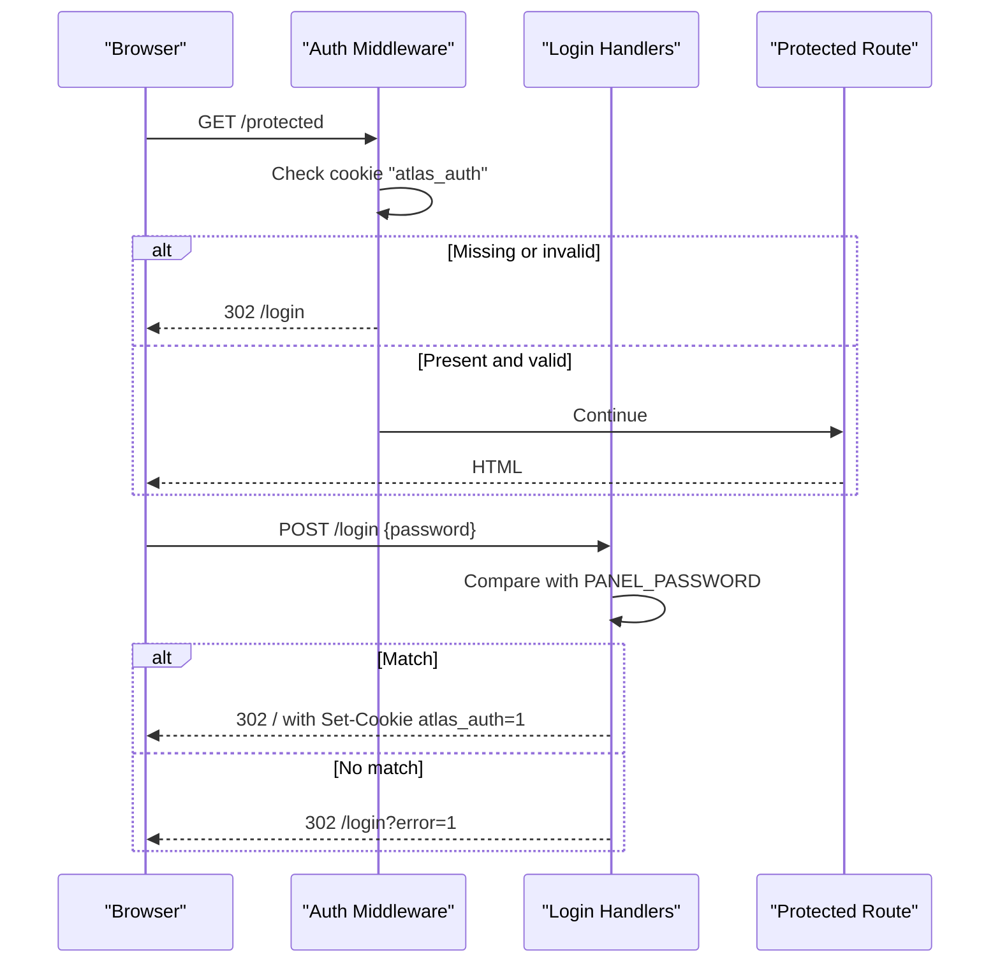
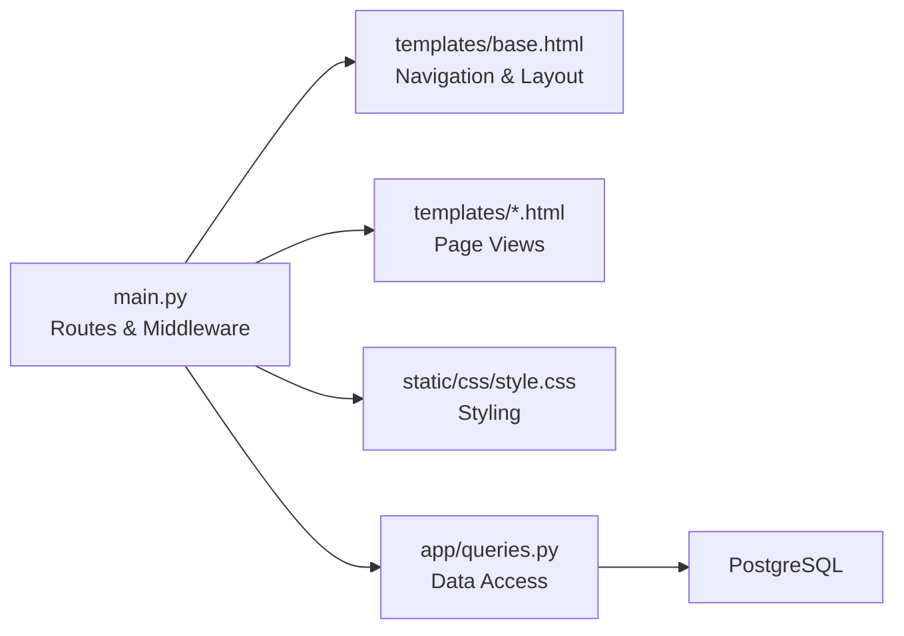

# Dashboard Navigation

<cite>
**Referenced Files in This Document**
- [main.py](file://docker/panel/app/main.py)
- [config.py](file://docker/panel/app/config.py)
- [queries.py](file://docker/panel/app/queries.py)
- [base.html](file://docker/panel/templates/base.html)
- [dashboard.html](file://docker/panel/templates/dashboard.html)
- [login.html](file://docker/panel/templates/login.html)
- [style.css](file://docker/panel/static/css/style.css)
</cite>

## Table of Contents
1. [Introduction](#introduction)
2. [Project Structure](#project-structure)
3. [Core Components](#core-components)
4. [Architecture Overview](#architecture-overview)
5. [Detailed Component Analysis](#detailed-component-analysis)
6. [Dependency Analysis](#dependency-analysis)
7. [Performance Considerations](#performance-considerations)
8. [Troubleshooting Guide](#troubleshooting-guide)
9. [Conclusion](#conclusion)
10. [Appendices](#appendices)

## Introduction
This document explains the dashboard navigation system for the Atlas Manager Panel, focusing on user interface structure and routing. It covers the main navigation menu, page routing patterns, active state management, authentication middleware that protects routes, session handling via cookies, responsive design patterns for mobile adaptation, security considerations (password protection and route access control), and how to add new pages with URL patterns and template context management.

## Project Structure
The panel is a FastAPI application with server-side rendered templates and static assets:
- Application entry point and routes are defined in the main module.
- Templates define the layout, navigation, and page content.
- CSS provides styling and responsive behavior.
- Configuration holds environment-driven settings including optional password protection.
- Queries module encapsulates database interactions used by routes.

**Diagram sources**
- [main.py:16-17](file://docker/panel/app/main.py#L16-L17)
- [main.py:40-187](file://docker/panel/app/main.py#L40-L187)
- [base.html:13-43](file://docker/panel/templates/base.html#L13-L43)
- [style.css:19-61](file://docker/panel/static/css/style.css#L19-L61)
- [queries.py:6-260](file://docker/panel/app/queries.py#L6-L260)

**Section sources**
- [main.py:16-17](file://docker/panel/app/main.py#L16-L17)
- [base.html:13-43](file://docker/panel/templates/base.html#L13-L43)
- [style.css:19-61](file://docker/panel/static/css/style.css#L19-L61)
- [queries.py:6-260](file://docker/panel/app/queries.py#L6-L260)

## Core Components
- Routing and context: The main module defines all dashboard routes, sets up Jinja2 templates, and injects shared context variables such as current active menu item and data payloads.
- Authentication middleware: A global HTTP middleware enforces cookie-based authentication for protected routes when a password is configured.
- Template base: The base template renders the sidebar navigation, topbar, and content area, and applies active states based on the passed context.
- Styling: CSS defines the fixed sidebar layout, grid-based content, and responsive breakpoints for mobile devices.
- Data layer: The queries module provides functions to fetch dashboard metrics and lists used by routes and templates.

Key responsibilities:
- Route handlers return templates with context, including an active key to highlight the current menu item.
- Middleware intercepts requests to enforce authentication unless the request targets login or static assets.
- Base template uses the active key to apply the active class to the corresponding nav link.
- CSS ensures the sidebar collapses into a horizontal bar on small screens.

**Section sources**
- [main.py:36-65](file://docker/panel/app/main.py#L36-L65)
- [main.py:68-187](file://docker/panel/app/main.py#L68-L187)
- [base.html:22-33](file://docker/panel/templates/base.html#L22-L33)
- [style.css:21-35](file://docker/panel/static/css/style.css#L21-L35)
- [style.css:56-61](file://docker/panel/static/css/style.css#L56-L61)
- [queries.py:6-260](file://docker/panel/app/queries.py#L6-L260)

## Architecture Overview
The dashboard follows a simple server-rendered architecture:
- FastAPI serves HTML templates and JSON APIs.
- Jinja2 templates render UI with dynamic data from queries.
- Middleware protects routes using a session cookie.
- Static assets are served under /static.

**Diagram sources**
- [main.py:56-65](file://docker/panel/app/main.py#L56-L65)
- [main.py:83-88](file://docker/panel/app/main.py#L83-L88)
- [base.html:22-33](file://docker/panel/templates/base.html#L22-L33)
- [style.css:19-35](file://docker/panel/static/css/style.css#L19-L35)

## Detailed Component Analysis

### Navigation Menu and Active State Management
- The sidebar navigation is defined in the base template. Each link corresponds to a route path and includes a conditional class to mark the active item.
- Routes pass an active key via a shared context helper so the correct link is highlighted.
- Example mapping:
  - Dashboard: "/" with active "dashboard"
  - Top performers: "/top-performers" with active "top"
  - Ready to buy: "/ready-to-buy" with active "ready"
  - Unhappy customers: "/unhappy-customers" with active "unhappy"
  - Staff performance: "/staff-performance" with active "staff"
  - Call duration: "/call-duration" with active "duration"
  - Satisfaction: "/satisfaction" with active "satisfaction"
  - Successful sales: "/successful-sales" with active "sales"
  - Monthly reports: "/monthly-reports" with active "monthly"
  - AI insights: "/ai-insights" with active "ai"
  - Call detail: "/calls/{call_id}" with active "calls"

**Diagram sources**
- [main.py:36-38](file://docker/panel/app/main.py#L36-L38)
- [main.py:68-187](file://docker/panel/app/main.py#L68-L187)
- [base.html:22-33](file://docker/panel/templates/base.html#L22-L33)

**Section sources**
- [base.html:22-33](file://docker/panel/templates/base.html#L22-L33)
- [main.py:68-187](file://docker/panel/app/main.py#L68-L187)

### Page Routing Patterns
- All pages are registered as GET endpoints returning HTML responses.
- Parameterized routes include:
  - "/monthly-reports/{report_id}" for monthly report details
  - "/calls/{call_id}" for call detail view
- Each handler loads data via queries and passes it to the template through the context helper.

Examples of route-to-template mappings:
- "/" -> "dashboard.html"
- "/top-performers" -> "top_performers.html"
- "/ready-to-buy" -> "ready_to_buy.html"
- "/unhappy-customers" -> "unhappy_customers.html"
- "/staff-performance" -> "staff_performance.html"
- "/call-duration" -> "call_duration.html"
- "/satisfaction" -> "satisfaction.html"
- "/successful-sales" -> "successful_sales.html"
- "/monthly-reports" -> "monthly_reports.html"
- "/monthly-reports/{report_id}" -> "monthly_detail.html"
- "/ai-insights" -> "ai_insights.html"
- "/calls/{call_id}" -> "call_detail.html"

**Section sources**
- [main.py:68-187](file://docker/panel/app/main.py#L68-L187)

### Authentication Middleware and Session Handling
- When PANEL_PASSWORD is set, all non-login and non-static routes require a cookie named "atlas_auth" with value "1".
- Login POST validates the submitted password against PANEL_PASSWORD; on success, it sets the cookie with a one-week max age and redirects to "/".
- On failure, it redirects back to "/login?error=1".
- The middleware allows POST to "/login" even if not authenticated to support the login form submission flow.

**Diagram sources**
- [main.py:40-65](file://docker/panel/app/main.py#L40-L65)
- [config.py:12-13](file://docker/panel/app/config.py#L12-L13)

**Section sources**
- [main.py:40-65](file://docker/panel/app/main.py#L40-L65)
- [config.py:12-13](file://docker/panel/app/config.py#L12-L13)

### Template Context Management
- A shared context helper injects the request object and the active menu identifier into every template response.
- Routes extend this context with page-specific data (e.g., stats, items, reports).
- Global template globals include the panel title, a duration formatter, and a current time function.

Usage pattern:
- For each route, call the context helper with the appropriate active key and payload.
- In templates, use blocks to override titles and content while inheriting the base layout.

**Section sources**
- [main.py:31-38](file://docker/panel/app/main.py#L31-L38)
- [main.py:68-187](file://docker/panel/app/main.py#L68-L187)
- [dashboard.html:1-81](file://docker/panel/templates/dashboard.html#L1-L81)

### Responsive Design and Mobile Adaptation
- Desktop layout uses a fixed right sidebar with a flexible content area.
- At a breakpoint around 900px, the sidebar becomes static and full-width, stacking above the content.
- Grid layouts collapse to single-column on smaller screens.
- The login page centers a card vertically and horizontally.

Key behaviors:
- Sidebar switches from fixed positioning to static at narrow widths.
- Content margin-right is removed on mobile to avoid overflow.
- Two-column grids become single-column.

**Section sources**
- [style.css:19-35](file://docker/panel/static/css/style.css#L19-L35)
- [style.css:56-61](file://docker/panel/static/css/style.css#L56-L61)
- [style.css:105-117](file://docker/panel/static/css/style.css#L105-L117)

### Adding a New Page to the Navigation
To add a new page:
1. Define a new route in the main module:
   - Choose a URL path (e.g., "/new-page").
   - Return a template response using the context helper with a unique active key (e.g., active="newpage").
   - Load any required data via queries and pass it in the context.
2. Add a navigation link in the base template:
   - Insert an anchor tag pointing to the new URL.
   - Apply the same active condition used in the route context.
3. Create a new template file extending the base template:
   - Override the page title block and content block.
   - Use the provided context variables to render data.
4. If needed, add a corresponding query function in the queries module.

Example steps mapped to files:
- Route definition: [main.py:68-187](file://docker/panel/app/main.py#L68-L187)
- Navigation link: [base.html:22-33](file://docker/panel/templates/base.html#L22-L33)
- Template extension: [dashboard.html:1-81](file://docker/panel/templates/dashboard.html#L1-L81)
- Query usage: [queries.py:6-260](file://docker/panel/app/queries.py#L6-L260)

**Section sources**
- [main.py:68-187](file://docker/panel/app/main.py#L68-L187)
- [base.html:22-33](file://docker/panel/templates/base.html#L22-L33)
- [dashboard.html:1-81](file://docker/panel/templates/dashboard.html#L1-L81)
- [queries.py:6-260](file://docker/panel/app/queries.py#L6-L260)

### URL Pattern Definitions
- Simple paths: "/", "/top-performers", "/ready-to-buy", "/unhappy-customers", "/staff-performance", "/call-duration", "/satisfaction", "/successful-sales", "/monthly-reports", "/ai-insights"
- Parameterized paths: "/monthly-reports/{report_id}", "/calls/{call_id}"
- API endpoints: "/api/ai-insights", "/api/stats"

These patterns are implemented as FastAPI GET routes returning HTML or JSON responses.

**Section sources**
- [main.py:68-187](file://docker/panel/app/main.py#L68-L187)

### Security Considerations
- Password protection:
  - Optional simple auth controlled by PANEL_PASSWORD.
  - When enabled, all non-login and non-static routes require the "atlas_auth" cookie.
- Cookie security:
  - The authentication cookie is marked httponly to prevent client-side script access.
  - Max age is set to one week for convenience.
- Route access control:
  - Middleware bypasses static assets and the login endpoint to ensure proper functionality.
  - Unauthenticated requests are redirected to the login page.
- Best practices:
  - Store PANEL_PASSWORD securely via environment variables.
  - Consider upgrading to more robust session/auth mechanisms for production environments.
  - Validate and sanitize inputs where applicable.

**Section sources**
- [main.py:40-65](file://docker/panel/app/main.py#L40-L65)
- [config.py:12-13](file://docker/panel/app/config.py#L12-L13)

## Dependency Analysis
The following diagram shows how components depend on each other during a typical request:

**Diagram sources**
- [main.py:16-17](file://docker/panel/app/main.py#L16-L17)
- [main.py:68-187](file://docker/panel/app/main.py#L68-L187)
- [base.html:13-43](file://docker/panel/templates/base.html#L13-L43)
- [style.css:19-61](file://docker/panel/static/css/style.css#L19-L61)
- [queries.py:6-260](file://docker/panel/app/queries.py#L6-L260)

**Section sources**
- [main.py:16-17](file://docker/panel/app/main.py#L16-L17)
- [main.py:68-187](file://docker/panel/app/main.py#L68-L187)
- [base.html:13-43](file://docker/panel/templates/base.html#L13-L43)
- [style.css:19-61](file://docker/panel/static/css/style.css#L19-L61)
- [queries.py:6-260](file://docker/panel/app/queries.py#L6-L260)

## Performance Considerations
- Server-rendered templates reduce client-side complexity but can be optimized by:
  - Limiting query result sizes (e.g., limits in queries).
  - Using efficient SQL filters and aggregations already present in queries.
  - Avoiding heavy computations in route handlers; delegate to queries.
- Static assets are served directly by FastAPI’s static mount for efficiency.
- Consider caching frequently accessed aggregates if traffic increases.

[No sources needed since this section provides general guidance]

## Troubleshooting Guide
Common issues and resolutions:
- Redirect loop to login:
  - Ensure PANEL_PASSWORD is set appropriately.
  - Verify the login POST succeeds and sets the cookie.
  - Confirm middleware allows POST to "/login" before authentication.
- Navigation not highlighting active page:
  - Ensure each route passes the correct active key via the context helper.
  - Verify the base template conditions match the active keys used in routes.
- Styles not applied:
  - Confirm static files are mounted and accessible at "/static".
  - Check browser network tab for 404 errors on CSS.
- Data not loading:
  - Validate database connectivity and credentials.
  - Inspect query results returned by the queries module.

**Section sources**
- [main.py:40-65](file://docker/panel/app/main.py#L40-L65)
- [main.py:68-187](file://docker/panel/app/main.py#L68-L187)
- [base.html:22-33](file://docker/panel/templates/base.html#L22-L33)
- [queries.py:6-260](file://docker/panel/app/queries.py#L6-L260)

## Conclusion
The dashboard navigation system combines a clean server-rendered architecture with straightforward routing, consistent active state management, and optional password protection via cookies. The base template centralizes navigation and layout, while CSS provides a responsive experience across devices. Adding new pages is systematic: define a route, update navigation, create a template, and wire up data via queries. Security is enforced centrally in middleware, making it easy to protect all dashboard routes consistently.

[No sources needed since this section summarizes without analyzing specific files]

## Appendices

### Appendix A: Route-to-Template Mapping Reference
- "/" -> "dashboard.html"
- "/top-performers" -> "top_performers.html"
- "/ready-to-buy" -> "ready_to_buy.html"
- "/unhappy-customers" -> "unhappy_customers.html"
- "/staff-performance" -> "staff_performance.html"
- "/call-duration" -> "call_duration.html"
- "/satisfaction" -> "satisfaction.html"
- "/successful-sales" -> "successful_sales.html"
- "/monthly-reports" -> "monthly_reports.html"
- "/monthly-reports/{report_id}" -> "monthly_detail.html"
- "/ai-insights" -> "ai_insights.html"
- "/calls/{call_id}" -> "call_detail.html"

**Section sources**
- [main.py:68-187](file://docker/panel/app/main.py#L68-L187)

### Appendix B: Environment Variables
- PANEL_TITLE: Sets the panel title shown in templates.
- PANEL_PASSWORD: Enables optional password protection for dashboard routes.
- Database and AI settings are also configurable via environment variables.

**Section sources**
- [config.py:1-14](file://docker/panel/app/config.py#L1-L14)