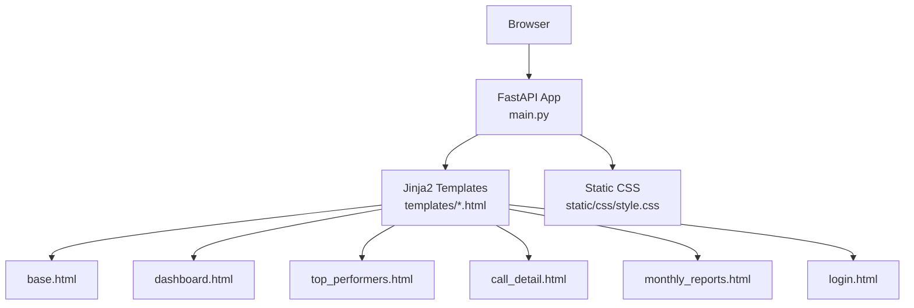
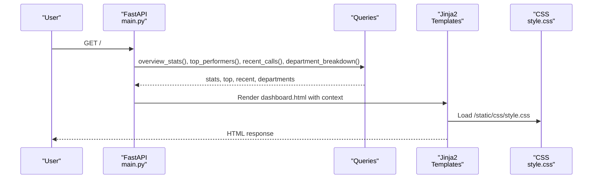
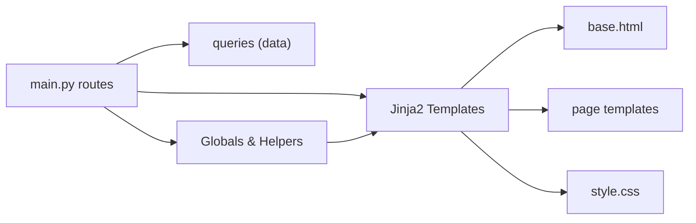

# Template Customization

<cite>
**Referenced Files in This Document**
- [base.html](file://docker/panel/templates/base.html)
- [dashboard.html](file://docker/panel/templates/dashboard.html)
- [top_performers.html](file://docker/panel/templates/top_performers.html)
- [call_detail.html](file://docker/panel/templates/call_detail.html)
- [monthly_reports.html](file://docker/panel/templates/monthly_reports.html)
- [login.html](file://docker/panel/templates/login.html)
- [style.css](file://docker/panel/static/css/style.css)
- [main.py](file://docker/panel/app/main.py)
- [config.py](file://docker/panel/app/config.py)
</cite>

## Table of Contents
1. [Introduction](#introduction)
2. [Project Structure](#project-structure)
3. [Core Components](#core-components)
4. [Architecture Overview](#architecture-overview)
5. [Detailed Component Analysis](#detailed-component-analysis)
6. [Dependency Analysis](#dependency-analysis)
7. [Performance Considerations](#performance-considerations)
8. [Troubleshooting Guide](#troubleshooting-guide)
9. [Conclusion](#conclusion)
10. [Appendices](#appendices)

## Introduction
This document explains how to customize the panel’s Jinja2 templates for styling, layout modification, and theme configuration. It covers base template inheritance, CSS organization, available customization points (panel title, global variables, helper functions), examples for modifying dashboard layout and adding custom styles, creating reusable components, and guidelines for responsive design, accessibility, cross-browser compatibility, debugging, and performance optimization.

## Project Structure
The panel is a FastAPI application that serves HTML pages via Jinja2 templates and static assets. The base layout defines the shell (sidebar, topbar, content area), while individual pages extend it and fill specific blocks. CSS is centralized under static/css and uses CSS variables for theming.

**Diagram sources**
- [main.py:13-17](file://docker/panel/app/main.py#L13-L17)
- [base.html:1-46](file://docker/panel/templates/base.html#L1-L46)
- [dashboard.html:1-81](file://docker/panel/templates/dashboard.html#L1-L81)
- [style.css:1-117](file://docker/panel/static/css/style.css#L1-L117)

**Section sources**
- [main.py:13-17](file://docker/panel/app/main.py#L13-L17)
- [base.html:1-46](file://docker/panel/templates/base.html#L1-L46)
- [style.css:1-117](file://docker/panel/static/css/style.css#L1-L117)

## Core Components
- Base template: Defines the page shell, sidebar navigation, topbar, and block slots for titles, content, and scripts.
- Page templates: Extend base.html and implement page_title, content, and optional scripts blocks.
- CSS theme: Centralized CSS variables for colors, typography, spacing, and component styles; includes responsive rules.
- Application context: Global variables and helper functions are registered into the template environment for reuse across templates.

Key customization points:
- Panel title: Configurable via environment variable and exposed as a global variable.
- Global variables: Exposed through template globals for use in any template.
- Helper functions: Formatted duration and current time function are available globally.

**Section sources**
- [base.html:1-46](file://docker/panel/templates/base.html#L1-L46)
- [style.css:1-117](file://docker/panel/static/css/style.css#L1-L117)
- [main.py:22-39](file://docker/panel/app/main.py#L22-L39)
- [config.py:12-13](file://docker/panel/app/config.py#L12-L13)

## Architecture Overview
The request flow renders templates with data provided by route handlers. The base template provides consistent layout and theming, while child templates focus on page-specific content and charts.

**Diagram sources**
- [main.py:70-82](file://docker/panel/app/main.py#L70-L82)
- [dashboard.html:1-81](file://docker/panel/templates/dashboard.html#L1-L81)
- [style.css:1-117](file://docker/panel/static/css/style.css#L1-L117)

## Detailed Component Analysis

### Base Template Inheritance and Blocks
- Inherits: Child templates use extends to inherit the base layout.
- Blocks:
  - page_title: Overrides the topbar heading per page.
  - content: Main page body injected into the layout.
  - scripts: Optional inline scripts (e.g., chart initialization).
- Global title: Uses a global variable for the panel title in the document title.

Customization tips:
- Add new blocks in base.html if you need additional injection points (e.g., header actions).
- Keep page-specific logic in child templates; keep shared structure in base.html.

**Section sources**
- [base.html:1-46](file://docker/panel/templates/base.html#L1-L46)
- [dashboard.html:1-81](file://docker/panel/templates/dashboard.html#L1-L81)
- [top_performers.html:1-32](file://docker/panel/templates/top_performers.html#L1-L32)
- [call_detail.html:1-29](file://docker/panel/templates/call_detail.html#L1-L29)
- [monthly_reports.html:1-23](file://docker/panel/templates/monthly_reports.html#L1-L23)

### CSS Organization and Theme Configuration
- CSS Variables: Define palette, typography, spacing, and radii at :root for easy theme overrides.
- Layout: Flexbox-based layout with fixed sidebar and scrollable content; responsive breakpoints collapse sidebar and stack grids.
- Components: Cards, KPI grid, tables, badges, buttons, login card, JSON/transcript viewers.

How to customize:
- Change theme colors by overriding :root variables.
- Adjust layout widths or breakpoints in media queries.
- Extend component classes or add new utility classes in style.css.

Accessibility and responsiveness:
- Ensure sufficient color contrast when overriding accent/text colors.
- Use semantic HTML elements (headings, lists, tables) already present in templates.
- Verify keyboard navigation and screen reader labels for interactive elements.

Cross-browser compatibility:
- Modern CSS features used (variables, flexbox, grid); test on target browsers.
- Chart.js loaded from CDN; ensure network access or host locally if needed.

**Section sources**
- [style.css:1-117](file://docker/panel/static/css/style.css#L1-L117)

### Global Variables and Helper Functions
- Panel title: Read from environment and set as a global variable for use in templates.
- Helpers:
  - fmt_duration: Formats seconds into human-readable durations.
  - now_fn: Returns current datetime for display in the topbar.

Adding new globals:
- Register additional variables or functions in the template environment to make them available in all templates.

Usage examples:
- Display formatted durations in call detail views.
- Show current date/time in the topbar.

**Section sources**
- [main.py:22-39](file://docker/panel/app/main.py#L22-L39)
- [config.py:12-13](file://docker/panel/app/config.py#L12-L13)
- [call_detail.html:13-13](file://docker/panel/templates/call_detail.html#L13-L13)
- [base.html:38-38](file://docker/panel/templates/base.html#L38-L38)

### Dashboard Layout and Charts
- KPI Grid: Responsive grid of key metrics using card and kpi classes.
- Two-column grid: Sections like “Top performers” and “Department distribution”.
- Chart integration: Initializes a doughnut chart with data passed from the route handler.

Modifying the dashboard:
- Reorder or add KPI cards within the grid container.
- Replace or augment charts by updating the script block and canvas element.
- Adjust grid behavior via CSS variables and media queries.

**Section sources**
- [dashboard.html:1-81](file://docker/panel/templates/dashboard.html#L1-L81)
- [main.py:70-82](file://docker/panel/app/main.py#L70-L82)
- [style.css:48-61](file://docker/panel/static/css/style.css#L48-L61)

### Creating Reusable Template Components
Patterns in use:
- Card wrapper class for consistent panels.
- Badge classes for status indicators.
- Tables with empty state handling.
- Detail list (dl/dt/dd) for key-value displays.

Guidelines:
- Encapsulate repeated UI patterns into small, composable blocks.
- Prefer passing structured data from routes rather than complex logic in templates.
- Keep presentation logic minimal; move heavy processing to helpers or backend.

**Section sources**
- [top_performers.html:1-32](file://docker/panel/templates/top_performers.html#L1-L32)
- [call_detail.html:1-29](file://docker/panel/templates/call_detail.html#L1-L29)
- [style.css:41-98](file://docker/panel/static/css/style.css#L41-L98)

### Login Page (Non-Inherited)
- Standalone HTML page with its own head and body, reusing the same CSS file for visual consistency.
- Simple password form posting to /login.

Customization:
- Update branding text and placeholder strings.
- Adjust layout via existing login-card styles or add new ones.

**Section sources**
- [login.html:1-18](file://docker/panel/templates/login.html#L1-L18)
- [style.css:105-117](file://docker/panel/static/css/style.css#L105-L117)

## Dependency Analysis
- Routes depend on query functions to provide data for templates.
- Templates depend on CSS for styling and Chart.js for visualization.
- Globals and helpers are injected once at app startup and consumed by all templates.

**Diagram sources**
- [main.py:70-189](file://docker/panel/app/main.py#L70-L189)
- [base.html:1-46](file://docker/panel/templates/base.html#L1-L46)
- [style.css:1-117](file://docker/panel/static/css/style.css#L1-L117)

**Section sources**
- [main.py:70-189](file://docker/panel/app/main.py#L70-L189)

## Performance Considerations
- Template caching: Disabled in development for quick iteration; consider enabling in production for performance.
- Data loading: Fetch only necessary data per route; avoid large payloads in context.
- Charts: Initialize only when data exists; keep datasets small.
- Static assets: Host CSS and JS via static files; leverage browser caching.
- Minification: Consider minifying CSS/JS for production delivery.

[No sources needed since this section provides general guidance]

## Troubleshooting Guide
Common issues and resolutions:
- Missing template variables: Ensure routes pass required context keys; check for None values and provide defaults in templates.
- Chart not rendering: Verify canvas ID matches script selector and data array is non-empty before initialization.
- Styles not applied: Confirm static files are mounted and paths are correct; clear browser cache if needed.
- Authentication redirects: If PANEL_PASSWORD is set, unauthenticated requests redirect to /login; verify cookie presence after successful login.
- Time formatting errors: Ensure duration fields are numeric; handle missing values gracefully.

Debugging techniques:
- Inspect rendered HTML in browser dev tools to confirm blocks and variables.
- Log context dictionaries in route handlers to validate data shapes.
- Temporarily disable template caching during development to see changes immediately.

**Section sources**
- [main.py:42-67](file://docker/panel/app/main.py#L42-L67)
- [dashboard.html:67-80](file://docker/panel/templates/dashboard.html#L67-L80)
- [call_detail.html:13-13](file://docker/panel/templates/call_detail.html#L13-L13)

## Conclusion
The panel’s template system is built around a clean base layout, modular page templates, and a centralized CSS theme. Customize by overriding CSS variables, extending blocks, and registering new globals or helpers. Follow the provided patterns for responsive design, accessibility, and maintainability. Use the troubleshooting strategies to diagnose issues quickly and optimize performance for production deployments.

## Appendices

### Quick Customization Checklist
- Change theme colors: Edit :root variables in style.css.
- Modify layout: Adjust sidebar width, grid breakpoints, and spacing in style.css.
- Update panel title: Set environment variable for PANEL_TITLE.
- Add global variable: Register in main.py template globals.
- Create new page: Add route in main.py, create template extending base.html, and populate blocks.

[No sources needed since this section provides general guidance]