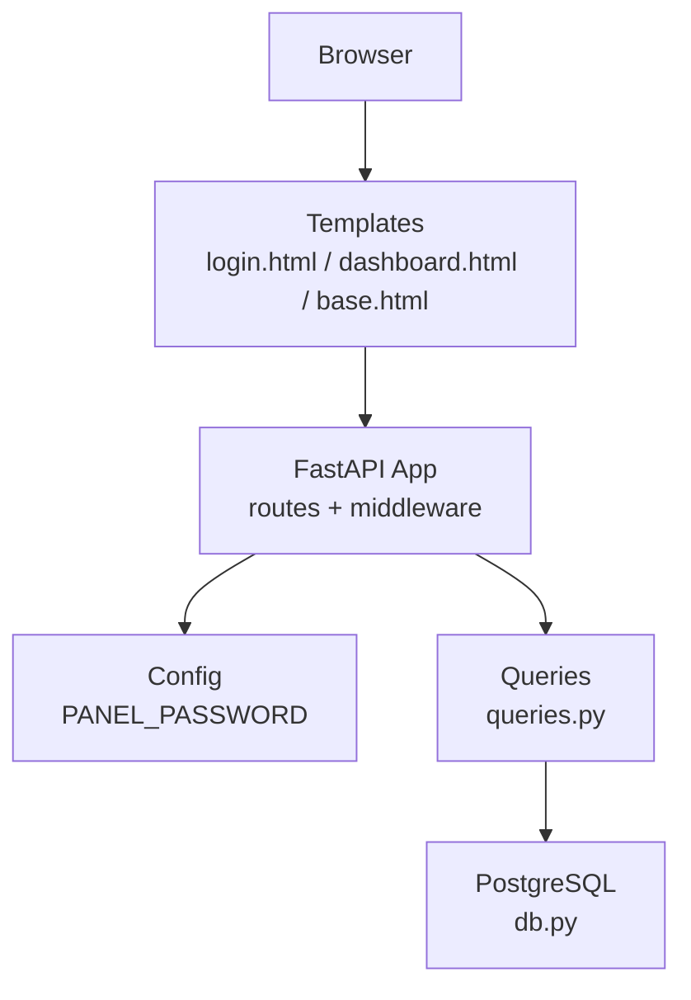
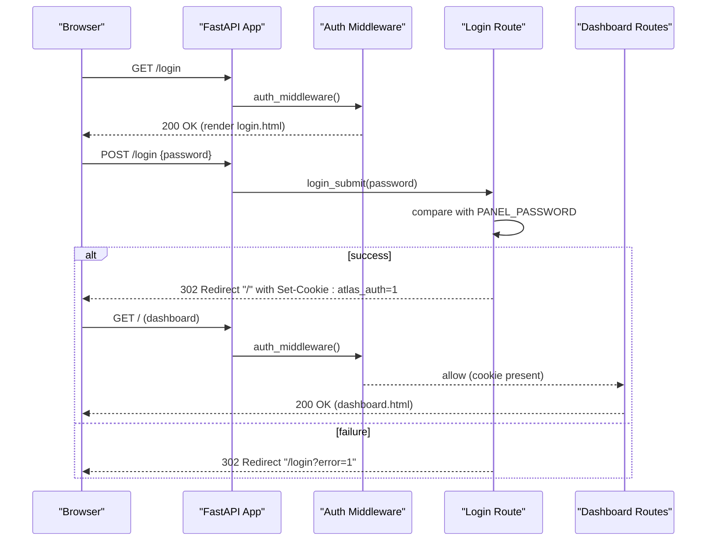
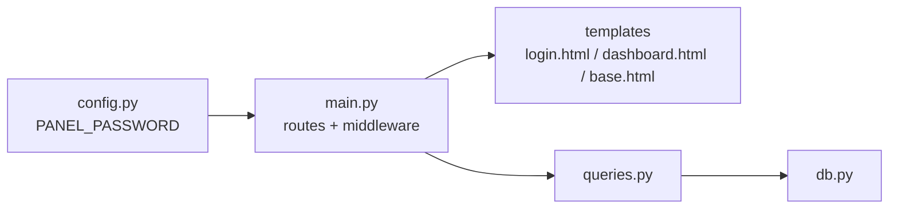
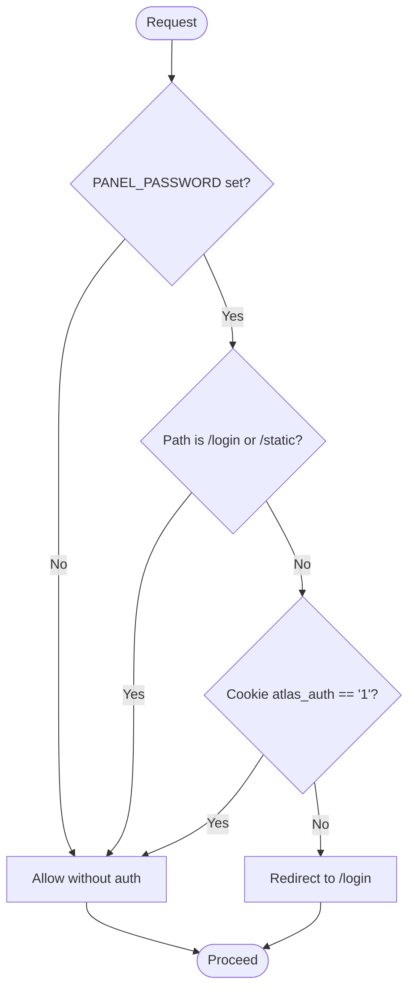

# User Management

<cite>
**Referenced Files in This Document**
- [main.py](file://docker/panel/app/main.py)
- [config.py](file://docker/panel/app/config.py)
- [login.html](file://docker/panel/templates/login.html)
- [dashboard.html](file://docker/panel/templates/dashboard.html)
- [base.html](file://docker/panel/templates/base.html)
- [queries.py](file://docker/panel/app/queries.py)
- [db.py](file://docker/panel/app/db.py)
</cite>

## Table of Contents
1. [Introduction](#introduction)
2. [Project Structure](#project-structure)
3. [Core Components](#core-components)
4. [Architecture Overview](#architecture-overview)
5. [Detailed Component Analysis](#detailed-component-analysis)
6. [Dependency Analysis](#dependency-analysis)
7. [Performance Considerations](#performance-considerations)
8. [Troubleshooting Guide](#troubleshooting-guide)
9. [Conclusion](#conclusion)
10. [Appendices](#appendices)

## Introduction
This document explains the user management and access control for the Atlas Manager Panel. It focuses on the login mechanism, password-based authentication, session management via HTTP cookies, and the middleware that protects dashboard routes. It also provides guidance for configuring panel passwords, implementing custom authentication providers, extending permissions, securing the dashboard, implementing logout, and handling authentication errors. Security best practices are included to help you harden cookie settings and improve password storage.

## Project Structure
The panel is a FastAPI application with:
- A simple password gate using an environment variable
- An HTTP-only cookie to maintain authenticated sessions
- Middleware that enforces authentication for protected routes
- Jinja2 templates for UI and static assets

**Diagram sources**
- [main.py:43-68](file://docker/panel/app/main.py#L43-L68)
- [config.py:12-13](file://docker/panel/app/config.py#L12-L13)
- [queries.py:1-260](file://docker/panel/app/queries.py#L1-L260)
- [db.py:1-31](file://docker/panel/app/db.py#L1-L31)

**Section sources**
- [main.py:1-190](file://docker/panel/app/main.py#L1-L190)
- [config.py:1-14](file://docker/panel/app/config.py#L1-L14)
- [login.html:1-18](file://docker/panel/templates/login.html#L1-L18)
- [dashboard.html:1-81](file://docker/panel/templates/dashboard.html#L1-L81)
- [base.html:1-46](file://docker/panel/templates/base.html#L1-L46)

## Core Components
- Authentication configuration: PANEL_PASSWORD is read from environment variables and used as the single credential for the panel.
- Login flow: A POST to /login validates the submitted password against PANEL_PASSWORD and sets an HTTP-only cookie named atlas_auth when successful.
- Session persistence: The cookie is set with httponly=True and a fixed max age (one week).
- Access control: An HTTP middleware checks for the presence of the valid cookie before allowing access to protected routes.
- Protected routes: All non-login and non-static routes require authentication when PANEL_PASSWORD is configured.

Key implementation references:
- Configuration: [config.py:12-13](file://docker/panel/app/config.py#L12-L13)
- Login page and submission: [main.py:43-56](file://docker/panel/app/main.py#L43-L56), [login.html:11-15](file://docker/panel/templates/login.html#L11-L15)
- Cookie setting: [main.py:52-55](file://docker/panel/app/main.py#L52-L55)
- Auth middleware: [main.py:59-68](file://docker/panel/app/main.py#L59-L68)
- Protected endpoints: [main.py:71-189](file://docker/panel/app/main.py#L71-L189)

**Section sources**
- [config.py:12-13](file://docker/panel/app/config.py#L12-L13)
- [main.py:43-68](file://docker/panel/app/main.py#L43-L68)
- [login.html:11-15](file://docker/panel/templates/login.html#L11-L15)

## Architecture Overview
The authentication architecture uses a simple password gate and cookie-based session. When PANEL_PASSWORD is set, all dashboard routes are protected by middleware that requires a valid cookie.

**Diagram sources**
- [main.py:43-68](file://docker/panel/app/main.py#L43-L68)
- [main.py:71-83](file://docker/panel/app/main.py#L71-L83)

## Detailed Component Analysis

### Login Mechanism and Password-Based Authentication
- The login form posts a password field to /login.
- On successful validation against PANEL_PASSWORD, the server responds with a redirect to the root path and sets an HTTP-only cookie named atlas_auth with a one-week lifetime.
- If the password is incorrect, the client is redirected back to /login with an error query parameter.

References:
- Form action and fields: [login.html:11-15](file://docker/panel/templates/login.html#L11-L15)
- Validation and cookie setting: [main.py:50-56](file://docker/panel/app/main.py#L50-L56)

Security notes:
- The cookie is HTTP-only, reducing exposure to client-side scripts.
- No HTTPS or Secure flag is enforced in code; ensure deployment uses HTTPS and configure Secure if needed at the reverse proxy level.

**Section sources**
- [login.html:11-15](file://docker/panel/templates/login.html#L11-L15)
- [main.py:50-56](file://docker/panel/app/main.py#L50-L56)

### Session Management Using HTTP Cookies
- Session state is represented by the atlas_auth cookie value equal to "1".
- The cookie has a fixed expiration time (one week) and is HTTP-only.
- There is no server-side session store; the cookie alone grants access.

References:
- Cookie creation: [main.py:52-55](file://docker/panel/app/main.py#L52-L55)
- Cookie check in middleware: [main.py:64-67](file://docker/panel/app/main.py#L64-L67)

Operational considerations:
- To implement logout, clear the cookie on the client side or provide a server endpoint that redirects after clearing it.
- For multi-device isolation or revocation, consider adding a server-side session store or token blacklist.

**Section sources**
- [main.py:52-55](file://docker/panel/app/main.py#L52-L55)
- [main.py:64-67](file://docker/panel/app/main.py#L64-L67)

### Authentication Middleware Protecting Dashboard Routes
- The middleware runs for every request.
- When PANEL_PASSWORD is configured, it allows:
  - /login and /static paths without authentication
  - Any other path only if the atlas_auth cookie equals "1"
- Unauthorized requests are redirected to /login.

References:
- Middleware logic: [main.py:59-68](file://docker/panel/app/main.py#L59-L68)

Behavioral notes:
- POST to /login is explicitly allowed even without a cookie to support the login form submission.
- Static assets under /static are always served without authentication.

**Section sources**
- [main.py:59-68](file://docker/panel/app/main.py#L59-L68)

### Protected Endpoints and Data Flow
- Protected routes include dashboard and report pages. They render templates and fetch data via queries.py which use db.py to connect to PostgreSQL.
- These routes are only accessible when the middleware permits them based on the cookie.

References:
- Protected route examples: [main.py:71-189](file://docker/panel/app/main.py#L71-L189)
- Data access layer: [queries.py:1-260](file://docker/panel/app/queries.py#L1-L260), [db.py:1-31](file://docker/panel/app/db.py#L1-L31)

**Section sources**
- [main.py:71-189](file://docker/panel/app/main.py#L71-L189)
- [queries.py:1-260](file://docker/panel/app/queries.py#L1-L260)
- [db.py:1-31](file://docker/panel/app/db.py#L1-L31)

### Configuring Panel Passwords
- Set the PANEL_PASSWORD environment variable to enable password protection.
- If PANEL_PASSWORD is empty, authentication is bypassed and users are redirected directly to the dashboard.

References:
- Environment variable usage: [config.py:12-13](file://docker/panel/app/config.py#L12-L13)
- Behavior when disabled: [main.py:43-47](file://docker/panel/app/main.py#L43-L47)

**Section sources**
- [config.py:12-13](file://docker/panel/app/config.py#L12-L13)
- [main.py:43-47](file://docker/panel/app/main.py#L43-L47)

### Implementing Custom Authentication Providers
Current implementation compares the submitted password directly with PANEL_PASSWORD. To integrate a custom provider:
- Replace the comparison in the login handler with a call to your provider (e.g., LDAP, OAuth, database-backed user store).
- On success, continue to set the same atlas_auth cookie to preserve session behavior.
- Optionally add rate limiting and account lockout around the login endpoint.

References:
- Login handler to extend: [main.py:50-56](file://docker/panel/app/main.py#L50-L56)

**Section sources**
- [main.py:50-56](file://docker/panel/app/main.py#L50-L56)

### Extending User Permissions
Currently, there is no per-user role model; access is binary (authenticated vs unauthenticated). To add roles:
- Store user roles in a persistent store and issue a signed token or session record containing the role.
- Extend the middleware to inspect the session/token and enforce route-level authorization.
- Add decorators or route guards to restrict sensitive endpoints by role.

[No sources needed since this section proposes extensions beyond current code]

### Securing the Dashboard
Recommendations:
- Enforce HTTPS in front of the app and set the Secure flag on the session cookie.
- Use SameSite=Lax or Strict on the cookie to mitigate CSRF risks.
- Restrict CORS and ensure static assets are not exposed unnecessarily.
- Log failed login attempts and consider IP-based rate limiting.
- Rotate PANEL_PASSWORD regularly and manage it via secrets management.

[No sources needed since this section provides general guidance]

### Implementing Logout Functionality
- Provide a GET /logout route that clears the atlas_auth cookie and redirects to /login.
- Alternatively, instruct clients to delete the cookie and navigate to /login.

[No sources needed since this section provides general guidance]

### Handling Authentication Errors
- On invalid credentials, the server redirects to /login with an error query parameter.
- Templates can display user-friendly messages based on the error parameter.
- Consider adding standardized error responses for API endpoints behind authentication.

References:
- Error redirect: [main.py:56](file://docker/panel/app/main.py#L56)

**Section sources**
- [main.py:56](file://docker/panel/app/main.py#L56)

## Dependency Analysis
The authentication subsystem depends on configuration and template rendering, while protected routes depend on the data layer.

**Diagram sources**
- [config.py:12-13](file://docker/panel/app/config.py#L12-L13)
- [main.py:43-68](file://docker/panel/app/main.py#L43-L68)
- [queries.py:1-260](file://docker/panel/app/queries.py#L1-L260)
- [db.py:1-31](file://docker/panel/app/db.py#L1-L31)

**Section sources**
- [main.py:43-68](file://docker/panel/app/main.py#L43-L68)
- [config.py:12-13](file://docker/panel/app/config.py#L12-L13)
- [queries.py:1-260](file://docker/panel/app/queries.py#L1-L260)
- [db.py:1-31](file://docker/panel/app/db.py#L1-L31)

## Performance Considerations
- Authentication is lightweight: a single cookie check per request.
- Avoid heavy operations in the middleware to keep latency low.
- Database queries are executed only after authentication succeeds.

[No sources needed since this section provides general guidance]

## Troubleshooting Guide
Common issues and resolutions:
- Cannot access dashboard: Ensure PANEL_PASSWORD is set and the atlas_auth cookie exists and equals "1".
- Infinite redirect loop: Verify that /login and /static are excluded from authentication checks.
- Login fails: Confirm the submitted password matches PANEL_PASSWORD and that the form posts to /login.
- Cookie not sent: Check browser settings and ensure the domain/path match the deployment.

References:
- Middleware exclusions and redirect logic: [main.py:59-68](file://docker/panel/app/main.py#L59-L68)
- Login submission and error redirect: [main.py:50-56](file://docker/panel/app/main.py#L50-L56)

**Section sources**
- [main.py:50-56](file://docker/panel/app/main.py#L50-L56)
- [main.py:59-68](file://docker/panel/app/main.py#L59-L68)

## Conclusion
The Atlas Manager Panel implements a simple, effective authentication model using an environment-based password and an HTTP-only cookie. The middleware ensures that dashboard routes are protected unless explicitly allowed. While minimal, this design is easy to understand and extend. For production, enhance security by enforcing HTTPS, tightening cookie flags, adding rate limiting, and considering a more robust identity provider and role-based access control.

[No sources needed since this section summarizes without analyzing specific files]

## Appendices

### Appendix A: Authentication Flow Diagram

**Diagram sources**
- [main.py:59-68](file://docker/panel/app/main.py#L59-L68)

### Appendix B: Data Layer References
- Queries and database helpers used by protected routes:
  - [queries.py:1-260](file://docker/panel/app/queries.py#L1-L260)
  - [db.py:1-31](file://docker/panel/app/db.py#L1-L31)

**Section sources**
- [queries.py:1-260](file://docker/panel/app/queries.py#L1-L260)
- [db.py:1-31](file://docker/panel/app/db.py#L1-L31)