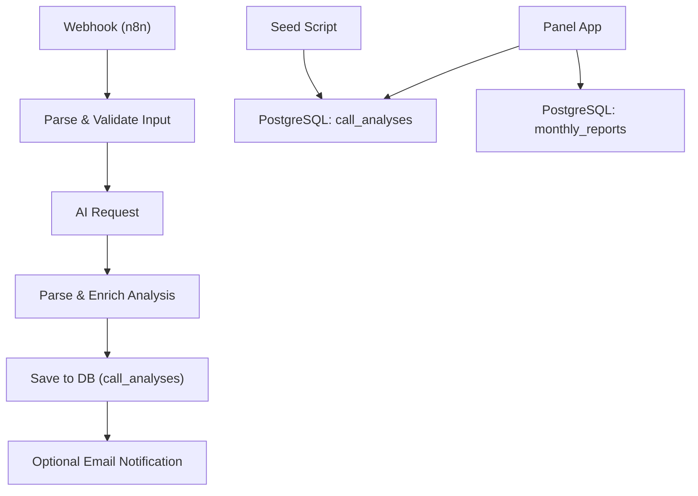
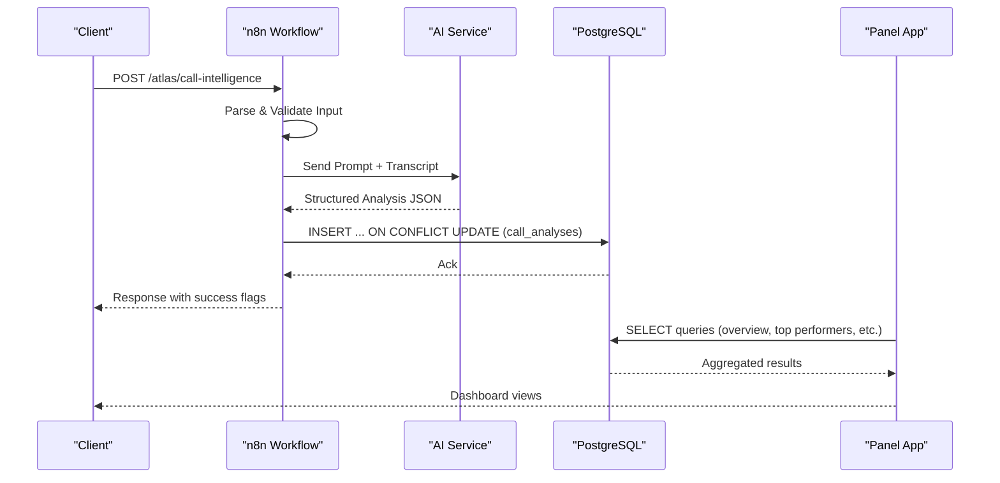
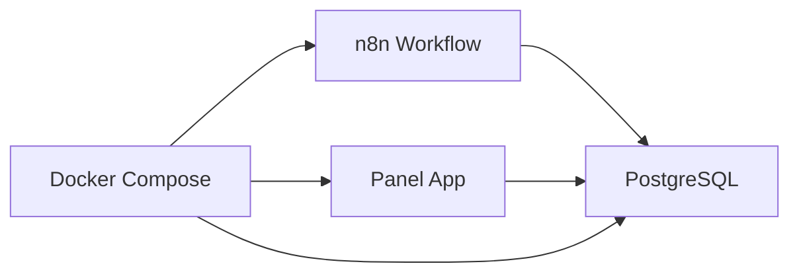

# Data Management

<cite>
**Referenced Files in This Document**
- [001_call_intelligence.sql](file://docker/postgres/init/001_call_intelligence.sql)
- [002_panel_seed.sql](file://docker/postgres/init/002_panel_seed.sql)
- [db.py](file://docker/panel/app/db.py)
- [queries.py](file://docker/panel/app/queries.py)
- [config.py](file://docker/panel/app/config.py)
- [docker-compose.yml](file://docker/docker-compose.yml)
- [atlas-call-intelligence-v1.json](file://docker/n8n/workflows/atlas-call-intelligence-v1.json)
</cite>

## Table of Contents
1. Introduction
2. Project Structure
3. Core Components
4. Architecture Overview
5. Detailed Component Analysis
6. Dependency Analysis
7. Performance Considerations
8. Troubleshooting Guide
9. Conclusion
10. Appendices

## Introduction
This document describes the data management practices for the Atlas database, focusing on call analysis data lifecycle, retention and archiving strategies, seed data initialization, backup and migration procedures, schema versioning, validation rules, data quality assurance, operational monitoring, storage optimization, and efficient handling of large datasets. It is intended for both technical and non-technical stakeholders who need to understand how call intelligence data is stored, processed, and maintained over time.

## Project Structure
The Atlas system uses PostgreSQL as the primary datastore, with a Python-based panel for reporting and an n8n workflow for ingesting and processing call analysis results. The database schema and seed data are defined as SQL files under the Postgres init directory. The panel connects to the database using environment-driven configuration and executes parameterized queries to render dashboards and reports.

**Diagram sources**
- [atlas-call-intelligence-v1.json:13-154](file://docker/n8n/workflows/atlas-call-intelligence-v1.json#L13-L154)
- [001_call_intelligence.sql:4-44](file://docker/postgres/init/001_call_intelligence.sql#L4-L44)
- [002_panel_seed.sql:4-45](file://docker/postgres/init/002_panel_seed.sql#L4-L45)
- [queries.py:6-260](file://docker/panel/app/queries.py#L6-L260)

**Section sources**
- [docker-compose.yml:3-25](file://docker/docker-compose.yml#L3-L25)
- [001_call_intelligence.sql:1-45](file://docker/postgres/init/001_call_intelligence.sql#L1-L45)
- [002_panel_seed.sql:1-46](file://docker/postgres/init/002_panel_seed.sql#L1-L46)
- [db.py:1-31](file://docker/panel/app/db.py#L1-L31)
- [queries.py:1-260](file://docker/panel/app/queries.py#L1-L260)
- [config.py:1-14](file://docker/panel/app/config.py#L1-L14)
- [atlas-call-intelligence-v1.json:1-160](file://docker/n8n/workflows/atlas-call-intelligence-v1.json#L1-L160)

## Core Components
- Database schema: Defines tables for per-call AI analysis and monthly aggregated reports, including constraints, indexes, and unique keys.
- Seed data: Provides sample records to initialize the dashboard for demonstration purposes.
- Panel application: Reads from the database to compute overview statistics, top performers, ready-to-buy leads, unhappy customers, staff performance, satisfaction metrics, successful sales, department breakdowns, recent calls, and monthly report listings.
- Workflow ingestion: An n8n workflow parses incoming payloads, calls an AI service, validates output, and persists structured analysis into the database.

Key responsibilities:
- Schema enforces data integrity via NOT NULL, UNIQUE, and JSONB structure expectations.
- Indexes optimize query performance across common filters such as analyzed_at, agent_id, department, and call_date.
- Seed data ensures the panel renders meaningful content immediately after deployment.
- Queries implement business logic for KPIs and filtering thresholds used by dashboards.

**Section sources**
- [001_call_intelligence.sql:4-44](file://docker/postgres/init/001_call_intelligence.sql#L4-L44)
- [002_panel_seed.sql:4-45](file://docker/postgres/init/002_panel_seed.sql#L4-L45)
- [queries.py:6-260](file://docker/panel/app/queries.py#L6-L260)
- [atlas-call-intelligence-v1.json:73-93](file://docker/n8n/workflows/atlas-call-intelligence-v1.json#L73-L93)

## Architecture Overview
The data architecture centers around PostgreSQL with two core tables:
- call_analyses: Stores per-call AI analysis, metadata, scores, and flags.
- monthly_reports: Stores aggregated monthly summaries per department.

Data flows:
- Ingestion: n8n receives webhook payloads, performs parsing and validation, invokes AI, then inserts or updates call_analyses using upsert semantics keyed by call_id.
- Reporting: The panel reads from call_analyses and monthly_reports to generate dashboards and reports.
- Initialization: Seed script populates call_analyses with sample data for immediate dashboard visibility.

**Diagram sources**
- [atlas-call-intelligence-v1.json:13-154](file://docker/n8n/workflows/atlas-call-intelligence-v1.json#L13-L154)
- [001_call_intelligence.sql:4-44](file://docker/postgres/init/001_call_intelligence.sql#L4-L44)
- [queries.py:6-260](file://docker/panel/app/queries.py#L6-L260)

## Detailed Component Analysis

### Database Schema and Constraints
- call_analyses table:
  - Primary key: id (auto-increment).
  - Unique constraint: call_id ensures one record per call.
  - Timestamps: analyzed_at defaults to current time; created_at tracks insertion time.
  - JSONB field: analysis_json stores rich analysis payload.
  - Numeric scores: purchase_intent_score, satisfaction_final_score, agent_quality_score.
  - Flags and priorities: needs_human_review boolean; ticket_priority varchar.
  - Indexes: optimized for analyzed_at, agent_id, department, call_date.
- monthly_reports table:
  - Unique composite key: (report_month, department) prevents duplicate monthly summaries.
  - JSONB field: report_json stores detailed monthly aggregation.
  - Index: report_month supports time-based queries.

Operational implications:
- Upsert behavior during ingestion avoids duplicates while allowing updates when reprocessing occurs.
- Indexes support fast filtering and sorting for dashboard queries.
- JSONB enables flexible analysis structures without rigid schema changes.

**Section sources**
- [001_call_intelligence.sql:4-44](file://docker/postgres/init/001_call_intelligence.sql#L4-L44)

### Seed Data and Dashboard Initialization
- The seed script inserts representative call analyses across departments (sales, support), with varied scores and flags to demonstrate dashboard capabilities.
- Uses ON CONFLICT DO NOTHING to avoid duplicating existing records by call_id.
- Ensures that initial dashboards show realistic distributions for hot leads, unhappy customers, and staff performance.

Role in lifecycle:
- Provides baseline data for development and demo environments.
- Can be rerun safely due to conflict handling.

**Section sources**
- [002_panel_seed.sql:4-45](file://docker/postgres/init/002_panel_seed.sql#L4-L45)

### Ingestion Pipeline and Data Validation
- Input parsing validates presence of transcript or audio URL and normalizes metadata fields.
- AI request constructs a prompt with context and returns structured JSON matching a strict schema.
- Parsing step handles malformed responses gracefully and enriches analysis with meta information.
- Database write uses parameterized queries and upsert semantics keyed by call_id.

Validation rules enforced:
- Required input fields at workflow level.
- Strict JSON schema for AI output.
- Database-level NOT NULL constraints on critical fields like analysis_json.
- Unique constraint on call_id prevents duplicate entries.

Error handling:
- Workflow nodes marked continueOnFail allow partial pipeline resilience.
- Panel queries handle empty results gracefully.

**Section sources**
- [atlas-call-intelligence-v1.json:26-39](file://docker/n8n/workflows/atlas-call-intelligence-v1.json#L26-L39)
- [atlas-call-intelligence-v1.json:63-79](file://docker/n8n/workflows/atlas-call-intelligence-v1.json#L63-L79)
- [atlas-call-intelligence-v1.json:73-93](file://docker/n8n/workflows/atlas-call-intelligence-v1.json#L73-L93)
- [001_call_intelligence.sql:4-27](file://docker/postgres/init/001_call_intelligence.sql#L4-L27)

### Reporting Queries and Business Logic
- Overview stats aggregate total calls, department splits, average scores, review counts, hot leads, unhappy counts, and talk time.
- Top performers rank agents by composite success score derived from quality and satisfaction averages.
- Ready-to-buy identifies high-intent leads based on numeric thresholds and JSONB fields.
- Unhappy customers filter low satisfaction, human review flags, and high retention risk indicators.
- Staff performance and satisfaction provide per-agent metrics and rates.
- Successful sales focuses on sales-related departments and probability thresholds.
- Monthly reports list and detail endpoints retrieve aggregated summaries.
- Recent calls and call detail enable drill-down views.
- Department breakdown aggregates metrics by department.

Performance considerations:
- Parameterized queries reduce injection risks and improve plan reuse.
- Filters leverage indexes on analyzed_at, call_date, agent_id, department.
- LIMIT clauses prevent excessive result sets.

**Section sources**
- [queries.py:6-260](file://docker/panel/app/queries.py#L6-L260)

### Configuration and Connectivity
- Database connection parameters are read from environment variables, enabling secure and flexible configuration across environments.
- Connection manager provides context-managed connections and cursor factories for dict-like rows.
- Helper functions fetch_all and fetch_one standardize query execution and result mapping.

Best practices:
- Use environment variables for sensitive credentials.
- Centralize connection management to ensure proper resource cleanup.

**Section sources**
- [config.py:1-14](file://docker/panel/app/config.py#L1-L14)
- [db.py:1-31](file://docker/panel/app/db.py#L1-L31)

## Dependency Analysis
The system components depend on each other as follows:
- n8n workflow depends on PostgreSQL for persistence and optional mailer for notifications.
- Panel app depends on PostgreSQL for reading analytics and reports.
- Docker Compose orchestrates services and defines health checks for PostgreSQL readiness.

**Diagram sources**
- [docker-compose.yml:3-25](file://docker/docker-compose.yml#L3-L25)
- [docker-compose.yml:26-61](file://docker/docker-compose.yml#L26-L61)
- [docker-compose.yml:80-98](file://docker/docker-compose.yml#L80-L98)
- [atlas-call-intelligence-v1.json:73-93](file://docker/n8n/workflows/atlas-call-intelligence-v1.json#L73-L93)
- [queries.py:6-260](file://docker/panel/app/queries.py#L6-L260)

**Section sources**
- [docker-compose.yml:3-98](file://docker/docker-compose.yml#L3-L98)
- [atlas-call-intelligence-v1.json:73-93](file://docker/n8n/workflows/atlas-call-intelligence-v1.json#L73-L93)
- [queries.py:6-260](file://docker/panel/app/queries.py#L6-L260)

## Performance Considerations
- Index usage: Ensure queries filter on indexed columns (analyzed_at, call_date, agent_id, department) to minimize full table scans.
- Query design: Use parameterized queries and LIMIT clauses to control result sizes and improve caching.
- JSONB operations: Leverage PostgreSQL JSONB operators for efficient extraction and filtering within analysis_json.
- Monitoring: Use PostgreSQL built-in tools and Docker health checks to monitor availability and performance.
- Storage growth: Plan for periodic archival of older call_analyses records to maintain query performance and manage disk usage.

[No sources needed since this section provides general guidance]

## Troubleshooting Guide
Common issues and resolutions:
- Duplicate call_id conflicts:
  - Expected behavior due to UNIQUE constraint; ingestion uses upsert to update existing records.
  - Verify call_id uniqueness in upstream systems to avoid unintended overwrites.
- Missing required fields:
  - Workflow validation rejects inputs lacking transcript or audio URL; ensure clients send valid payloads.
- AI response parsing errors:
  - Non-JSON or malformed responses are handled; check logs and adjust prompts or model settings if parse failures persist.
- Panel connectivity issues:
  - Confirm environment variables for DB_HOST, DB_PORT, DB_NAME, DB_USER, DB_PASSWORD match Docker Compose configuration.
- Health checks:
  - Docker healthcheck uses pg_isready; if failing, verify PostgreSQL container status and credentials.

**Section sources**
- [atlas-call-intelligence-v1.json:26-39](file://docker/n8n/workflows/atlas-call-intelligence-v1.json#L26-L39)
- [atlas-call-intelligence-v1.json:63-79](file://docker/n8n/workflows/atlas-call-intelligence-v1.json#L63-L79)
- [config.py:1-14](file://docker/panel/app/config.py#L1-L14)
- [docker-compose.yml:3-25](file://docker/docker-compose.yml#L3-L25)

## Conclusion
The Atlas database provides a robust foundation for storing and analyzing call intelligence data. The schema enforces integrity through constraints and indexes, while the ingestion pipeline ensures validated, structured data persistence. The panel offers comprehensive reporting capabilities driven by well-designed queries. Operational practices include environment-driven configuration, Docker orchestration, and health checks. For long-term sustainability, adopt retention policies, regular backups, and periodic maintenance to optimize performance and manage storage efficiently.

[No sources needed since this section summarizes without analyzing specific files]

## Appendices

### Data Lifecycle and Retention Policies
Lifecycle stages:
- Ingestion: Webhook receives call data, validates input, calls AI, and persists analysis.
- Processing: AI generates structured insights; workflow enriches and writes to database.
- Reporting: Panel queries aggregate and present metrics for dashboards.
- Archival: Implement scheduled jobs to move older call_analyses records to archive tables or external storage based on retention policy.

Retention recommendations:
- Keep recent records (e.g., last 12–24 months) in the primary table for performance.
- Archive older records to separate tables or cold storage to reduce query overhead.
- Maintain monthly_reports as summarized snapshots for long-term trend analysis.

[No sources needed since this section provides general guidance]

### Backup Strategies
- Logical backups: Use pg_dump to export schemas and data periodically; store dumps securely offsite.
- Physical backups: Rely on volume snapshots for PostgreSQL data directory managed by Docker volumes.
- Frequency: Schedule daily logical backups and weekly physical snapshots; retain according to compliance requirements.
- Restore testing: Periodically test restore procedures to ensure data recoverability.

[No sources needed since this section provides general guidance]

### Migration Procedures and Version Management
- Schema migrations: Treat SQL files as versioned migrations; prefix with numbers to enforce ordering.
- Idempotency: Use CREATE TABLE IF NOT EXISTS and index creation guards to allow repeated runs.
- Rollback strategy: Maintain reverse scripts for destructive changes; test in staging before production.
- Deployment: Apply migrations before starting dependent services; use Docker entrypoint to auto-run init scripts.

**Section sources**
- [001_call_intelligence.sql:1-45](file://docker/postgres/init/001_call_intelligence.sql#L1-L45)
- [docker-compose.yml:16-18](file://docker/docker-compose.yml#L16-L18)

### Data Validation Rules and Constraint Violations Handling
- Database-level constraints:
  - NOT NULL on critical fields ensures essential data presence.
  - UNIQUE on call_id prevents duplicates; upsert handles reprocessing.
  - JSONB structure validated at workflow level; database accepts any JSONB but relies on application logic for semantics.
- Handling violations:
  - Duplicate call_id: Upsert updates existing record; verify upstream deduplication.
  - Missing fields: Workflow rejects invalid inputs; log and alert on failures.
  - Type mismatches: Ensure numeric fields receive integers; cast or validate in workflow.

**Section sources**
- [001_call_intelligence.sql:4-27](file://docker/postgres/init/001_call_intelligence.sql#L4-L27)
- [atlas-call-intelligence-v1.json:26-39](file://docker/n8n/workflows/atlas-call-intelligence-v1.json#L26-L39)

### Data Quality Assurance Processes
- Input validation: Enforce required fields and types in the workflow.
- Output validation: Validate AI response against expected schema; handle parse errors gracefully.
- Monitoring: Track error rates, parse failures, and email notification outcomes.
- Auditing: Log ingestion events and database writes for traceability.
- Reconciliation: Compare counts between source systems and database to detect discrepancies.

**Section sources**
- [atlas-call-intelligence-v1.json:63-79](file://docker/n8n/workflows/atlas-call-intelligence-v1.json#L63-L79)
- [atlas-call-intelligence-v1.json:105-120](file://docker/n8n/workflows/atlas-call-intelligence-v1.json#L105-L120)

### Operational Procedures for Monitoring Database Health
- Health checks: Docker healthcheck verifies PostgreSQL readiness; integrate with orchestration tools.
- Metrics: Monitor query latency, connection counts, and disk usage via PostgreSQL extensions and OS tools.
- Alerts: Set alerts for failed health checks, high disk usage, and slow queries.
- Maintenance: Regularly analyze and vacuum tables to reclaim space and update statistics.

**Section sources**
- [docker-compose.yml:20-24](file://docker/docker-compose.yml#L20-L24)

### Optimizing Storage Space and Managing Large Datasets
- Index optimization: Review index usage and remove unused indexes; add targeted indexes for frequent filters.
- Partitioning: Consider partitioning call_analyses by date ranges to improve query performance and simplify archival.
- Archival: Move historical data to archive tables or external storage; keep only recent data in the main table.
- Compression: Enable compression for JSONB fields where appropriate; evaluate storage trade-offs.
- Cleanup: Remove temporary or debug records; ensure seed data does not interfere with production datasets.

[No sources needed since this section provides general guidance]