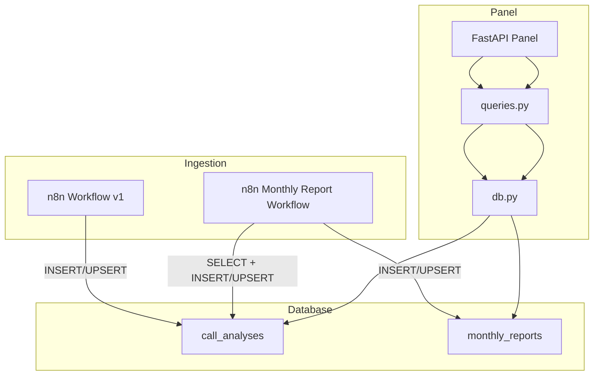
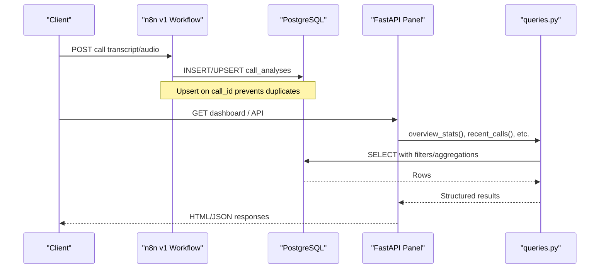
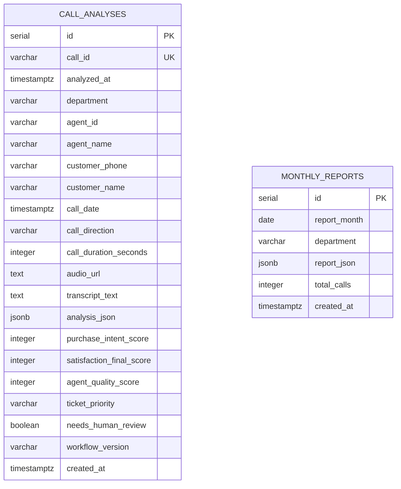
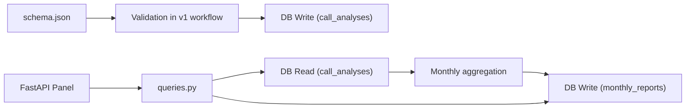

# Database Design

<cite>
**Referenced Files in This Document**
- [schema.json](file://03_Products/Atlas Call Intelligence/V1/schema.json)
- [001_call_intelligence.sql](file://docker/postgres/init/001_call_intelligence.sql)
- [002_panel_seed.sql](file://docker/postgres/init/002_panel_seed.sql)
- [queries.py](file://docker/panel/app/queries.py)
- [db.py](file://docker/panel/app/db.py)
- [main.py](file://docker/panel/app/main.py)
- [atlas-call-intelligence-v1.json](file://docker/n8n/workflows/atlas-call-intelligence-v1.json)
- [atlas-call-intelligence-monthly-report.json](file://docker/n8n/workflows/atlas-call-intelligence-monthly-report.json)
</cite>

## Table of Contents
1. [Introduction](#introduction)
2. [Project Structure](#project-structure)
3. [Core Components](#core-components)
4. [Architecture Overview](#architecture-overview)
5. [Detailed Component Analysis](#detailed-component-analysis)
6. [Dependency Analysis](#dependency-analysis)
7. [Performance Considerations](#performance-considerations)
8. [Troubleshooting Guide](#troubleshooting-guide)
9. [Conclusion](#conclusion)
10. [Appendices](#appendices)

## Introduction
This document describes the database design for Atlas Call Intelligence, focusing on how call analysis and monthly reporting data are stored, accessed, and optimized. It covers entity relationships, field definitions, constraints, indexes, validation rules enforced at the database level, data access patterns via queries, caching considerations, performance implications, and lifecycle management including retention and archival strategies.

## Project Structure
The call intelligence system is composed of:
- PostgreSQL schema defining core tables for per-call analyses and monthly reports
- n8n workflows that ingest calls, run AI analysis, and persist results to the database
- A FastAPI panel that serves dashboards and APIs using read-only queries against the same schema
- JSON Schema used to validate incoming analysis payloads before persistence

**Diagram sources**
- [atlas-call-intelligence-v1.json:74-86](file://docker/n8n/workflows/atlas-call-intelligence-v1.json#L74-L86)
- [atlas-call-intelligence-monthly-report.json:51-68](file://docker/n8n/workflows/atlas-call-intelligence-monthly-report.json#L51-L68)
- [atlas-call-intelligence-monthly-report.json:101-119](file://docker/n8n/workflows/atlas-call-intelligence-monthly-report.json#L101-L119)
- [queries.py:6-23](file://docker/panel/app/queries.py#L6-L23)
- [queries.py:195-211](file://docker/panel/app/queries.py#L195-L211)
- [db.py:21-30](file://docker/panel/app/db.py#L21-L30)

**Section sources**
- [001_call_intelligence.sql:4-45](file://docker/postgres/init/001_call_intelligence.sql#L4-L45)
- [atlas-call-intelligence-v1.json:74-86](file://docker/n8n/workflows/atlas-call-intelligence-v1.json#L74-L86)
- [atlas-call-intelligence-monthly-report.json:51-68](file://docker/n8n/workflows/atlas-call-intelligence-monthly-report.json#L51-L68)
- [queries.py:6-23](file://docker/panel/app/queries.py#L6-L23)
- [queries.py:195-211](file://docker/panel/app/queries.py#L195-L211)
- [db.py:21-30](file://docker/panel/app/db.py#L21-L30)

## Core Components
- call_analyses: Stores each call’s metadata, transcript, and a rich JSONB payload with AI-derived insights. Includes denormalized numeric fields for fast analytics (purchase intent, satisfaction, agent quality).
- monthly_reports: Stores aggregated monthly summaries per department with a JSONB report payload and total_calls count.

Key characteristics:
- Primary keys: SERIAL id columns for both tables
- Unique constraints: call_analyses.call_id; monthly_reports(report_month, department)
- Indexes: Analyzed timestamps, agent_id, department, call_date for call_analyses; report_month for monthly_reports
- Data types: TIMESTAMPTZ for time fields; INTEGER for scores; VARCHAR for categorization; JSONB for flexible nested analysis data

**Section sources**
- [001_call_intelligence.sql:4-45](file://docker/postgres/init/001_call_intelligence.sql#L4-L45)

## Architecture Overview
Data flows from ingestion to storage and then to reporting:
- Ingestion workflow parses inputs, calls an AI model, validates output against a JSON Schema, and persists normalized fields plus full JSONB into call_analyses
- Monthly workflow aggregates call_analyses by month, optionally generates AI executive summary, and stores results in monthly_reports
- Panel reads from call_analyses and monthly_reports via parameterized SQL queries to render dashboards and APIs

**Diagram sources**
- [atlas-call-intelligence-v1.json:74-86](file://docker/n8n/workflows/atlas-call-intelligence-v1.json#L74-L86)
- [queries.py:6-23](file://docker/panel/app/queries.py#L6-L23)
- [queries.py:214-232](file://docker/panel/app/queries.py#L214-L232)
- [db.py:21-30](file://docker/panel/app/db.py#L21-L30)

## Detailed Component Analysis

### Entity Relationship Model
- call_analyses holds per-call records with denormalized metrics for efficient querying.
- monthly_reports summarizes call_analyses by month and department. There is no explicit foreign key constraint between them; logical linkage is through report_month and department filtering during aggregation.

**Diagram sources**
- [001_call_intelligence.sql:4-45](file://docker/postgres/init/001_call_intelligence.sql#L4-L45)

**Section sources**
- [001_call_intelligence.sql:4-45](file://docker/postgres/init/001_call_intelligence.sql#L4-L45)

### Field Definitions and Types
- call_analyses
  - id: SERIAL PRIMARY KEY
  - call_id: VARCHAR(255) NOT NULL UNIQUE
  - analyzed_at: TIMESTAMPTZ DEFAULT NOW()
  - department: VARCHAR(50)
  - agent_id: VARCHAR(100)
  - agent_name: VARCHAR(255)
  - customer_phone: VARCHAR(50)
  - customer_name: VARCHAR(255)
  - call_date: TIMESTAMPTZ
  - call_direction: VARCHAR(20)
  - call_duration_seconds: INTEGER
  - audio_url: TEXT
  - transcript_text: TEXT
  - analysis_json: JSONB NOT NULL
  - purchase_intent_score: INTEGER
  - satisfaction_final_score: INTEGER
  - agent_quality_score: INTEGER
  - ticket_priority: VARCHAR(20)
  - needs_human_review: BOOLEAN DEFAULT FALSE
  - workflow_version: VARCHAR(20) DEFAULT '1.0.0'
  - created_at: TIMESTAMPTZ NOT NULL DEFAULT NOW()
- monthly_reports
  - id: SERIAL PRIMARY KEY
  - report_month: DATE NOT NULL
  - department: VARCHAR(50) NOT NULL DEFAULT 'all'
  - report_json: JSONB NOT NULL
  - total_calls: INTEGER DEFAULT 0
  - created_at: TIMESTAMPTZ NOT NULL DEFAULT NOW()

**Section sources**
- [001_call_intelligence.sql:4-45](file://docker/postgres/init/001_call_intelligence.sql#L4-L45)

### Constraints, Keys, and Indexes
- Primary keys: call_analyses.id, monthly_reports.id
- Unique constraints:
  - call_analyses(call_id)
  - monthly_reports(report_month, department)
- Indexes:
  - call_analyses(analyzed_at)
  - call_analyses(agent_id)
  - call_analyses(department)
  - call_analyses(call_date)
  - monthly_reports(report_month)

These indexes support common query patterns such as time-range scans, agent-level aggregations, department filters, and monthly report retrieval.

**Section sources**
- [001_call_intelligence.sql:29-45](file://docker/postgres/init/001_call_intelligence.sql#L29-L45)

### Validation Rules and Business Logic at Database Level
- Uniqueness:
  - call_analyses ensures one record per call_id
  - monthly_reports enforces one report per (report_month, department)
- Defaults:
  - Timestamps default to current time
  - workflow_version defaults to '1.0.0'
  - needs_human_review defaults to FALSE
  - monthly_reports.department defaults to 'all'
- Denormalized metrics:
  - purchase_intent_score, satisfaction_final_score, agent_quality_score enable fast KPI calculations without parsing JSONB on every query
- Data integrity:
  - No explicit foreign keys between call_analyses and monthly_reports; referential integrity is maintained logically by the monthly workflow aggregating by month and department

Note: Additional business rules (e.g., thresholds for hot leads or unhappy customers) are enforced in application queries rather than at the database level.

**Section sources**
- [001_call_intelligence.sql:4-45](file://docker/postgres/init/001_call_intelligence.sql#L4-L45)
- [queries.py:52-76](file://docker/panel/app/queries.py#L52-L76)
- [queries.py:79-106](file://docker/panel/app/queries.py#L79-L106)

### Data Access Patterns via Queries Module
- Overview stats: Aggregates counts, averages, and totals across call_analyses
- Top performers: Groups by agent, computes success score combining quality and satisfaction
- Ready to buy: Filters high purchase intent using both denormalized and JSONB fields
- Unhappy customers: Flags low satisfaction, human review, or high retention risk
- Staff performance/duration/satisfaction: Agent-level rollups
- Successful sales: Filters departments and thresholds for close probability
- Monthly reports: Lists and retrieves monthly report entries
- Recent calls and call detail: Time-sorted retrieval and lookup by call_id

All queries use parameterized inputs to prevent injection and optimize execution plans.

**Section sources**
- [queries.py:6-23](file://docker/panel/app/queries.py#L6-L23)
- [queries.py:26-49](file://docker/panel/app/queries.py#L26-L49)
- [queries.py:52-76](file://docker/panel/app/queries.py#L52-L76)
- [queries.py:79-106](file://docker/panel/app/queries.py#L79-L106)
- [queries.py:109-165](file://docker/panel/app/queries.py#L109-L165)
- [queries.py:168-192](file://docker/panel/app/queries.py#L168-L192)
- [queries.py:195-211](file://docker/panel/app/queries.py#L195-L211)
- [queries.py:214-232](file://docker/panel/app/queries.py#L214-L232)
- [queries.py:235-247](file://docker/panel/app/queries.py#L235-L247)

### Caching Strategies
- Current implementation uses direct database connections per request via db.py context manager; there is no in-memory cache layer in the panel codebase.
- Potential improvements:
  - Add Redis-based caching for dashboard aggregates (overview_stats, top_performers) with short TTLs to reduce load during peak traffic
  - Cache monthly report details after generation to avoid recomputation
  - Use connection pooling (e.g., psycopg2 pool or asyncpg pool) to reduce connection overhead

[No sources needed since this section provides general guidance]

### Performance Considerations
- Index usage:
  - Time-based queries benefit from idx_call_analyses_analyzed_at and idx_call_analyses_call_date
  - Agent and department filters leverage idx_call_analyses_agent_id and idx_call_analyses_department
  - Monthly report listing benefits from idx_monthly_reports_month
- Denormalization:
  - Numeric KPIs stored directly reduce JSONB parsing costs
- Query optimization:
  - Parameterized queries help plan reuse
  - LIMIT clauses constrain result sets for UI responsiveness
- Storage:
  - JSONB allows flexible schema evolution while still enabling indexed path queries if needed in future

**Section sources**
- [001_call_intelligence.sql:29-45](file://docker/postgres/init/001_call_intelligence.sql#L29-L45)
- [queries.py:6-23](file://docker/panel/app/queries.py#L6-L23)
- [queries.py:214-232](file://docker/panel/app/queries.py#L214-L232)

### Data Lifecycle Management, Retention, and Archival
- Ingestion:
  - n8n v1 workflow inserts or updates call_analyses on conflict by call_id, ensuring idempotent writes
- Reporting:
  - Monthly workflow aggregates call_analyses within a period, optionally generates AI insights, and upserts monthly_reports by (report_month, department)
- Retention policy:
  - Not explicitly defined in schema; consider implementing periodic cleanup jobs to archive or purge old call_analyses beyond a retention window (e.g., move to archive table or object storage)
- Archival procedures:
  - Create an archive table or partitioned structure for historical call_analyses
  - Export monthly_reports JSONB snapshots to long-term storage for compliance
  - Implement scheduled tasks to delete or anonymize PII after retention expiry

**Section sources**
- [atlas-call-intelligence-v1.json:74-86](file://docker/n8n/workflows/atlas-call-intelligence-v1.json#L74-L86)
- [atlas-call-intelligence-monthly-report.json:51-68](file://docker/n8n/workflows/atlas-call-intelligence-monthly-report.json#L51-L68)
- [atlas-call-intelligence-monthly-report.json:101-119](file://docker/n8n/workflows/atlas-call-intelligence-monthly-report.json#L101-L119)

### Sample Data Structures
- Seed data demonstrates realistic entries for call_analyses with various departments, priorities, and scores. These illustrate expected value ranges and structures for quick verification and demo purposes.

**Section sources**
- [002_panel_seed.sql:4-45](file://docker/postgres/init/002_panel_seed.sql#L4-L45)

## Dependency Analysis
- Ingestion pipeline depends on:
  - JSON Schema validation for analysis payloads
  - PostgreSQL write operations with upsert semantics
- Reporting pipeline depends on:
  - Read access to call_analyses for aggregation
  - Write access to monthly_reports for persisted summaries
- Panel depends on:
  - Read-only queries against call_analyses and monthly_reports
  - Optional AI insights endpoint consuming aggregated context

**Diagram sources**
- [schema.json:1-153](file://03_Products/Atlas Call Intelligence/V1/schema.json#L1-L153)
- [atlas-call-intelligence-v1.json:74-86](file://docker/n8n/workflows/atlas-call-intelligence-v1.json#L74-L86)
- [atlas-call-intelligence-monthly-report.json:51-68](file://docker/n8n/workflows/atlas-call-intelligence-monthly-report.json#L51-L68)
- [atlas-call-intelligence-monthly-report.json:101-119](file://docker/n8n/workflows/atlas-call-intelligence-monthly-report.json#L101-L119)
- [queries.py:6-23](file://docker/panel/app/queries.py#L6-L23)
- [queries.py:195-211](file://docker/panel/app/queries.py#L195-L211)

**Section sources**
- [schema.json:1-153](file://03_Products/Atlas Call Intelligence/V1/schema.json#L1-L153)
- [atlas-call-intelligence-v1.json:74-86](file://docker/n8n/workflows/atlas-call-intelligence-v1.json#L74-L86)
- [atlas-call-intelligence-monthly-report.json:51-68](file://docker/n8n/workflows/atlas-call-intelligence-monthly-report.json#L51-L68)
- [queries.py:6-23](file://docker/panel/app/queries.py#L6-L23)
- [queries.py:195-211](file://docker/panel/app/queries.py#L195-L211)

## Performance Considerations
- Prefer queries that leverage existing indexes:
  - Filter by analyzed_at or call_date ranges
  - Group by agent_id or department when appropriate
- Avoid heavy JSONB parsing in hot paths; use denormalized fields where possible
- Consider adding composite indexes for frequent filter combinations (e.g., (department, call_date))
- Monitor slow queries and add targeted indexes based on actual workload patterns

[No sources needed since this section provides general guidance]

## Troubleshooting Guide
- Duplicate call_id errors:
  - The unique constraint on call_analyses(call_id) prevents duplicates; ensure upstream systems generate stable IDs or rely on upsert behavior
- Missing monthly reports:
  - Verify monthly workflow runs and that call_analyses have valid call_date values within the target period
- Dashboard performance issues:
  - Check index usage for time-based and agent-based queries; consider adding composite indexes if necessary
- Data inconsistencies:
  - Ensure analysis_json contains required fields; seed data shows expected structures for reference

**Section sources**
- [001_call_intelligence.sql:4-45](file://docker/postgres/init/001_call_intelligence.sql#L4-L45)
- [002_panel_seed.sql:4-45](file://docker/postgres/init/002_panel_seed.sql#L4-L45)
- [queries.py:6-23](file://docker/panel/app/queries.py#L6-L23)

## Conclusion
The Atlas Call Intelligence database design centers around two core tables: call_analyses for granular per-call insights and monthly_reports for summarized monthly performance. The schema balances flexibility (via JSONB) with performance (via denormalized numeric fields and strategic indexes). Workflows handle ingestion and reporting, while the panel provides read access for dashboards and APIs. To enhance scalability and compliance, consider implementing retention policies, archival procedures, and optional caching layers.

## Appendices

### JSON Schema Reference for Analysis Payload
- Defines required and optional fields for call analysis outputs, including meta, input, transcript, customer, agent_performance, sales/support analysis, ticket, insights, and quality_control. This schema guides validation before persistence.

**Section sources**
- [schema.json:1-153](file://03_Products/Atlas Call Intelligence/V1/schema.json#L1-L153)

### Panel Endpoints and Query Mapping
- Dashboard endpoints map to specific queries for overview stats, top performers, ready-to-buy lists, unhappy customers, staff metrics, successful sales, and monthly reports. Each endpoint leverages parameterized SQL for safety and performance.

**Section sources**
- [main.py:68-187](file://docker/panel/app/main.py#L68-L187)
- [queries.py:6-247](file://docker/panel/app/queries.py#L6-L247)