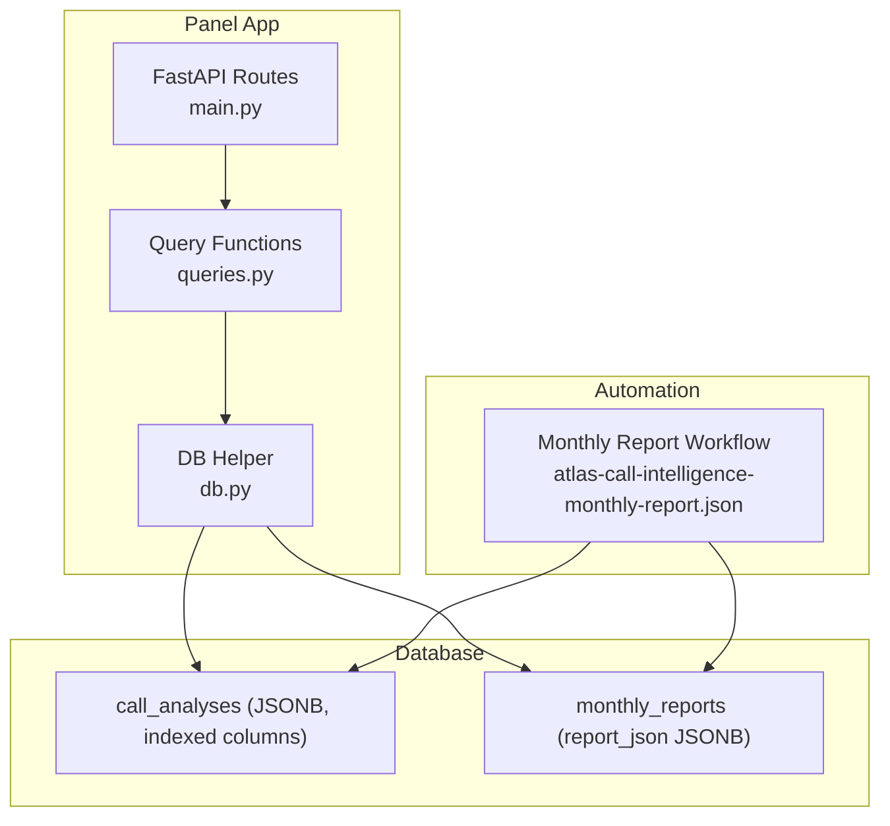
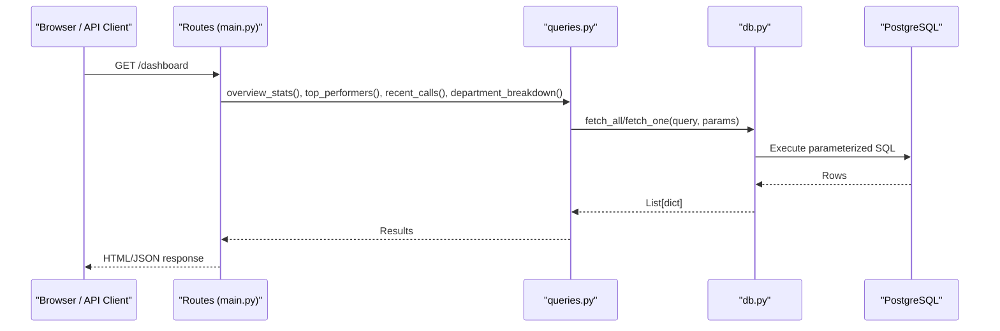
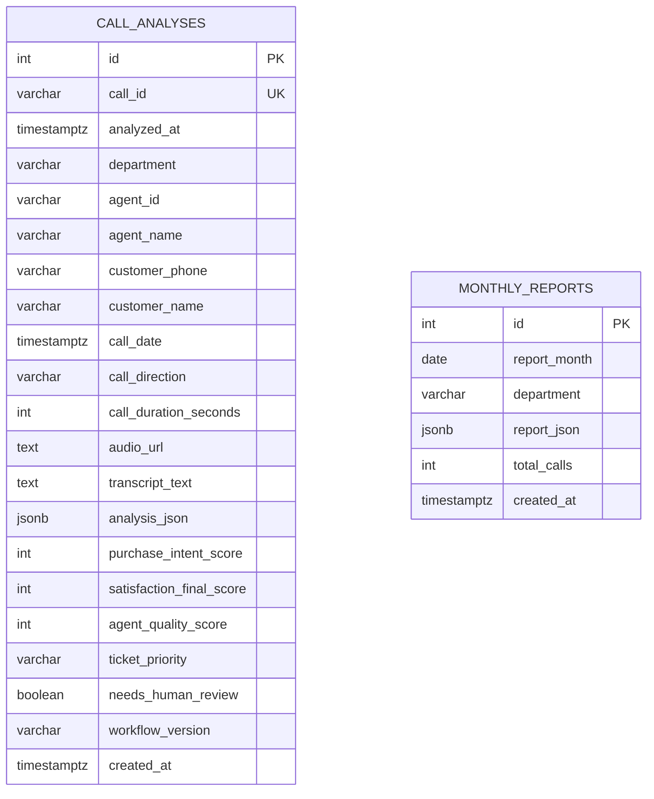
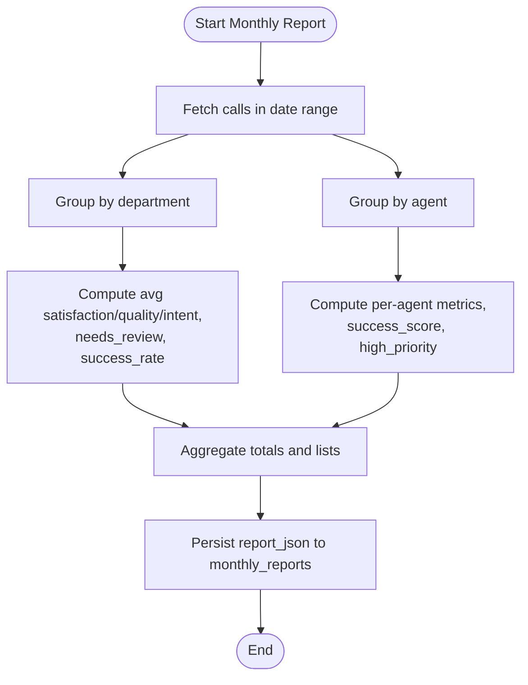
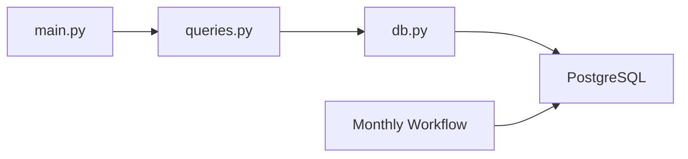

# Query Patterns

<cite>
**Referenced Files in This Document**
- [queries.py](file://docker/panel/app/queries.py)
- [db.py](file://docker/panel/app/db.py)
- [001_call_intelligence.sql](file://docker/postgres/init/001_call_intelligence.sql)
- [atlas-call-intelligence-monthly-report.json](file://docker/n8n/workflows/atlas-call-intelligence-monthly-report.json)
- [main.py](file://docker/panel/app/main.py)
</cite>

## Table of Contents
1. [Introduction](#introduction)
2. [Project Structure](#project-structure)
3. [Core Components](#core-components)
4. [Architecture Overview](#architecture-overview)
5. [Detailed Component Analysis](#detailed-component-analysis)
6. [Dependency Analysis](#dependency-analysis)
7. [Performance Considerations](#performance-considerations)
8. [Troubleshooting Guide](#troubleshooting-guide)
9. [Conclusion](#conclusion)

## Introduction
This document explains the query patterns used by the Atlas Manager Panel to access call analysis data and monthly reports from the Atlas PostgreSQL database. It focuses on SELECT statements for retrieving call analyses by date ranges, departments, and agents; aggregation queries for monthly reports, performance metrics, and satisfaction scores; complex JSONB field access for analysis results; filtering by purchase intent scores; parameterized queries for security; and how indexes are leveraged for optimal performance. It also provides troubleshooting guidance and optimization techniques.

## Project Structure
The query layer is implemented in a dedicated module that uses a small database helper to execute parameterized SQL against PostgreSQL. The schema defines two primary tables: per-call analyses and monthly aggregated reports. An n8n workflow generates monthly reports by querying call data, aggregating statistics, optionally generating AI insights, and persisting the report back into the database.

**Diagram sources**
- [main.py:68-186](file://docker/panel/app/main.py#L68-L186)
- [queries.py:6-259](file://docker/panel/app/queries.py#L6-L259)
- [db.py:21-30](file://docker/panel/app/db.py#L21-L30)
- [001_call_intelligence.sql:4-44](file://docker/postgres/init/001_call_intelligence.sql#L4-L44)
- [atlas-call-intelligence-monthly-report.json:51-119](file://docker/n8n/workflows/atlas-call-intelligence-monthly-report.json#L51-L119)

**Section sources**
- [main.py:68-186](file://docker/panel/app/main.py#L68-L186)
- [queries.py:6-259](file://docker/panel/app/queries.py#L6-L259)
- [db.py:21-30](file://docker/panel/app/db.py#L21-L30)
- [001_call_intelligence.sql:4-44](file://docker/postgres/init/001_call_intelligence.sql#L4-L44)
- [atlas-call-intelligence-monthly-report.json:51-119](file://docker/n8n/workflows/atlas-call-intelligence-monthly-report.json#L51-L119)

## Core Components
- Database helper: Provides parameterized execution with dictionary rows via a context-managed connection.
- Query functions: Encapsulate all SELECTs and simple reads for dashboards, agent performance, satisfaction, ready-to-buy leads, unhappy customers, recent calls, department breakdowns, and monthly reports.
- Schema: Defines call_analyses and monthly_reports with appropriate indexes for common filters and joins.

Key responsibilities:
- Parameterization: All user-supplied values are passed as parameters to prevent injection and ensure type safety.
- Aggregation: COUNT FILTER, AVG, SUM, ROUND, and GROUP BY are used to compute metrics efficiently at the database level.
- JSONB access: Path operators extract nested fields from analysis_json for sales/support insights without denormalizing data.

**Section sources**
- [db.py:21-30](file://docker/panel/app/db.py#L21-L30)
- [queries.py:6-259](file://docker/panel/app/queries.py#L6-L259)
- [001_call_intelligence.sql:4-44](file://docker/postgres/init/001_call_intelligence.sql#L4-L44)

## Architecture Overview
The panel routes request handlers to query functions, which execute parameterized SQL through the DB helper. Monthly reports are generated by an n8n workflow that queries call_analyses within a time window, aggregates metrics, optionally invokes AI for executive summaries, and persists the result to monthly_reports.

**Diagram sources**
- [main.py:68-80](file://docker/panel/app/main.py#L68-L80)
- [queries.py:6-23](file://docker/panel/app/queries.py#L6-L23)
- [db.py:21-30](file://docker/panel/app/db.py#L21-L30)

## Detailed Component Analysis

### Data Model and Indexes
- call_analyses stores per-call AI analysis and derived scores. Columns include identifiers, timestamps, department, agent info, durations, transcript/audio links, JSONB analysis, numeric scores, ticket priority, review flags, and versioning. A unique constraint ensures one row per call_id.
- monthly_reports stores monthly aggregated reports with a composite unique key on report_month and department.
- Indexes exist on analyzed_at, agent_id, department, call_date, and report_month to support common filters and sorting.

**Diagram sources**
- [001_call_intelligence.sql:4-44](file://docker/postgres/init/001_call_intelligence.sql#L4-L44)

**Section sources**
- [001_call_intelligence.sql:4-44](file://docker/postgres/init/001_call_intelligence.sql#L4-L44)

### SELECT Patterns: Retrieving Call Analyses
- Date range retrieval: Used in the monthly report workflow to fetch calls between period_start and period_end using parameterized placeholders and explicit casting to timestamptz. This leverages the index on call_date for efficient range scans.
- Department-based retrieval: Several queries filter or group by department to produce department-level metrics and breakdowns.
- Agent-based retrieval: Queries group by agent_name and agent_id to compute per-agent metrics such as average quality, satisfaction, intent, and counts of hot leads or satisfied customers.

Examples of where these patterns appear:
- Date range query in monthly report workflow.
- Department grouping and filtering in overview stats, staff performance, and department breakdown.
- Agent grouping and ordering in top performers and staff metrics.

**Section sources**
- [atlas-call-intelligence-monthly-report.json:51-69](file://docker/n8n/workflows/atlas-call-intelligence-monthly-report.json#L51-L69)
- [queries.py:6-23](file://docker/panel/app/queries.py#L6-L23)
- [queries.py:26-49](file://docker/panel/app/queries.py#L26-L49)
- [queries.py:109-127](file://docker/panel/app/queries.py#L109-L127)
- [queries.py:235-247](file://docker/panel/app/queries.py#L235-L247)

### Aggregation Queries: Monthly Reports, Performance Metrics, Satisfaction Scores
- Monthly reports: The workflow computes totals and averages across the selected month, groups by department and agent, and persists a JSONB report. The panel can list and retrieve saved reports.
- Performance metrics: Top performers and staff performance aggregate quality, satisfaction, intent, and derive a success score. Filters and HAVING clauses ensure meaningful subsets.
- Satisfaction scores: Staff satisfaction computes rates and counts above/below thresholds, including percentage calculations with safe division.

**Diagram sources**
- [atlas-call-intelligence-monthly-report.json:51-119](file://docker/n8n/workflows/atlas-call-intelligence-monthly-report.json#L51-L119)
- [queries.py:195-211](file://docker/panel/app/queries.py#L195-L211)

**Section sources**
- [atlas-call-intelligence-monthly-report.json:51-119](file://docker/n8n/workflows/atlas-call-intelligence-monthly-report.json#L51-L119)
- [queries.py:26-49](file://docker/panel/app/queries.py#L26-L49)
- [queries.py:109-165](file://docker/panel/app/queries.py#L109-L165)
- [queries.py:195-211](file://docker/panel/app/queries.py#L195-L211)

### Complex JSONB Field Access for Analysis Results
- Sales insights: Extract recommended next step, estimated discount, close probability, purchase stage, and request summary from analysis_json using path operators.
- Support insights: Extract resolution status, retention risk, and ticket description.
- Customer sentiment: Check nested satisfaction flags to identify unhappy customers.

These patterns enable rich reporting without denormalizing the JSONB payload.

**Section sources**
- [queries.py:52-76](file://docker/panel/app/queries.py#L52-L76)
- [queries.py:79-106](file://docker/panel/app/queries.py#L79-L106)
- [queries.py:168-192](file://docker/panel/app/queries.py#L168-L192)

### Filtering by Purchase Intent Scores
- Ready-to-buy leads: Filter by purchase_intent_score threshold or by a JSONB-derived score, ordered by intent and recency.
- Successful sales: Combine department filters with intent or JSONB-derived close probability thresholds.

These filters help prioritize follow-ups and coaching opportunities.

**Section sources**
- [queries.py:52-76](file://docker/panel/app/queries.py#L52-L76)
- [queries.py:168-192](file://docker/panel/app/queries.py#L168-L192)

### Calculating Agent Performance Metrics
- Success score: Average of agent quality and satisfaction for each agent.
- Counts: Hot leads, happy customers, needs human review, high-priority tickets.
- Rates: Satisfaction rate percent computed with safe division to avoid divide-by-zero.

These metrics drive leaderboards and coaching workflows.

**Section sources**
- [queries.py:26-49](file://docker/panel/app/queries.py#L26-L49)
- [queries.py:109-165](file://docker/panel/app/queries.py#L109-L165)

### Parameterized Queries for Security Best Practices
All user inputs are passed as parameters to the database driver, preventing SQL injection and ensuring correct type handling. Examples include:
- Limiting top performers and recent calls with integer parameters.
- Fetching monthly calls with timestamp parameters cast to timestamptz.
- Retrieving a single call detail by call_id.

This approach is enforced by the DB helper’s parameterized execution pattern.

**Section sources**
- [queries.py:26-49](file://docker/panel/app/queries.py#L26-L49)
- [queries.py:214-232](file://docker/panel/app/queries.py#L214-L232)
- [atlas-call-intelligence-monthly-report.json:51-69](file://docker/n8n/workflows/atlas-call-intelligence-monthly-report.json#L51-L69)
- [db.py:21-30](file://docker/panel/app/db.py#L21-L30)

### Leveraging Database Indexes for Optimal Performance
Indexes defined in the schema support common access patterns:
- analyzed_at: Efficient sorting and time-bounded queries.
- agent_id: Agent grouping and filtering.
- department: Department-based filters and grouping.
- call_date: Range scans for monthly reports and recent calls.
- report_month: Monthly report listing and retrieval.

When writing new queries, prefer predicates that align with these indexes to minimize full table scans.

**Section sources**
- [001_call_intelligence.sql:29-44](file://docker/postgres/init/001_call_intelligence.sql#L29-L44)

## Dependency Analysis
The panel routes depend on query functions, which depend on the DB helper. The monthly report workflow depends on the same database schema but executes its own SQL directly.

**Diagram sources**
- [main.py:68-186](file://docker/panel/app/main.py#L68-L186)
- [queries.py:6-259](file://docker/panel/app/queries.py#L6-L259)
- [db.py:21-30](file://docker/panel/app/db.py#L21-L30)
- [atlas-call-intelligence-monthly-report.json:51-119](file://docker/n8n/workflows/atlas-call-intelligence-monthly-report.json#L51-L119)

**Section sources**
- [main.py:68-186](file://docker/panel/app/main.py#L68-L186)
- [queries.py:6-259](file://docker/panel/app/queries.py#L6-L259)
- [db.py:21-30](file://docker/panel/app/db.py#L21-L30)
- [atlas-call-intelligence-monthly-report.json:51-119](file://docker/n8n/workflows/atlas-call-intelligence-monthly-report.json#L51-L119)

## Performance Considerations
- Prefer indexed predicates: Use WHERE clauses on call_date, department, agent_id, and analyzed_at to leverage existing indexes.
- Avoid unnecessary JSONB traversal: Only extract needed keys from analysis_json to reduce processing overhead.
- Use LIMIT appropriately: Many endpoints cap results to improve responsiveness.
- Batch operations: For large datasets, consider pagination or materialized views if read patterns become heavy.
- Monitor query plans: Use EXPLAIN ANALYZE to verify index usage when adding new filters or joins.

[No sources needed since this section provides general guidance]

## Troubleshooting Guide
Common issues and resolutions:
- Missing or incorrect dates: Ensure parameters are valid timestamps and cast to timestamptz when querying call_date ranges.
- Empty results: Verify filters match existing data; check department values and JSONB paths.
- JSONB extraction errors: Confirm keys exist in analysis_json; use safe extraction patterns and handle nulls gracefully.
- Slow queries: Validate that WHERE clauses align with indexes; avoid functions on indexed columns that prevent index usage.
- Monthly report gaps: Confirm the workflow runs and inserts into monthly_reports; check unique constraints on report_month and department.

**Section sources**
- [atlas-call-intelligence-monthly-report.json:51-119](file://docker/n8n/workflows/atlas-call-intelligence-monthly-report.json#L51-L119)
- [queries.py:52-106](file://docker/panel/app/queries.py#L52-L106)
- [001_call_intelligence.sql:29-44](file://docker/postgres/init/001_call_intelligence.sql#L29-L44)

## Conclusion
The Atlas query layer combines well-indexed schemas, parameterized SQL, and targeted JSONB access to deliver robust dashboards and automated monthly reporting. By aligning new queries with existing indexes and following parameterization best practices, you can maintain performance and security while extending analytics capabilities.

[No sources needed since this section summarizes without analyzing specific files]