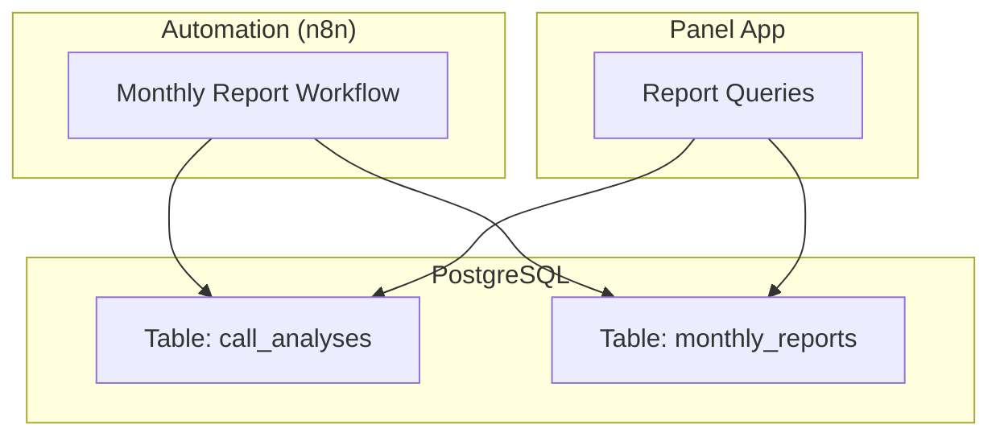
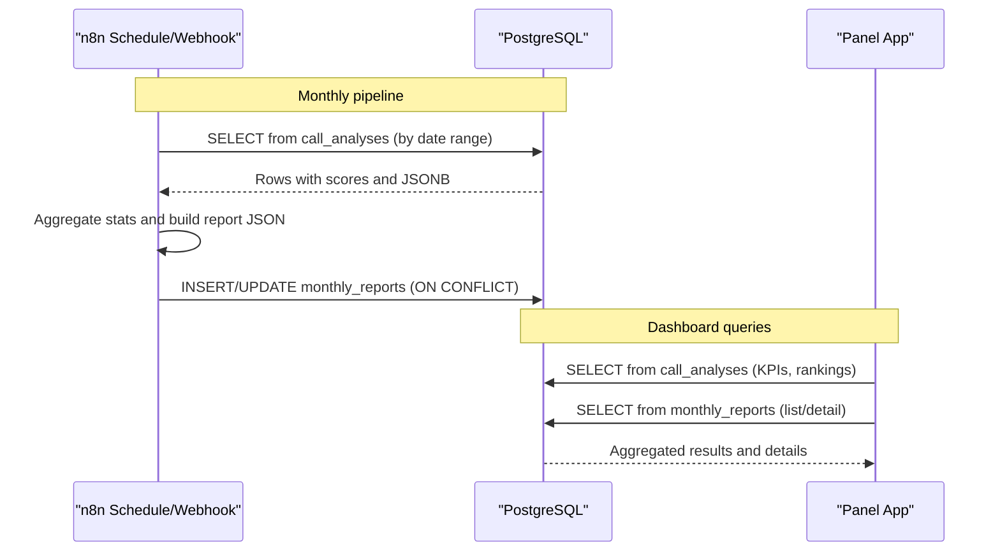
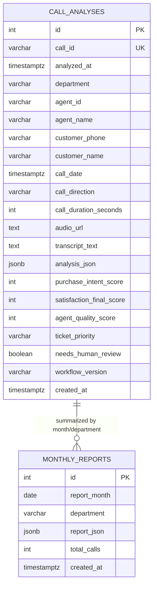
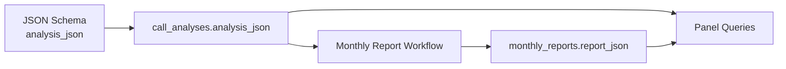

# Schema Overview

<cite>
**Referenced Files in This Document**
- [001_call_intelligence.sql](file://docker/postgres/init/001_call_intelligence.sql)
- [schema.json](file://03_Products/Atlas Call Intelligence/V1/schema.json)
- [atlas-call-intelligence-monthly-report.json](file://docker/n8n/workflows/atlas-call-intelligence-monthly-report.json)
- [queries.py](file://docker/panel/app/queries.py)
</cite>

## Table of Contents
1. [Introduction](#introduction)
2. [Project Structure](#project-structure)
3. [Core Components](#core-components)
4. [Architecture Overview](#architecture-overview)
5. [Detailed Component Analysis](#detailed-component-analysis)
6. [Dependency Analysis](#dependency-analysis)
7. [Performance Considerations](#performance-considerations)
8. [Troubleshooting Guide](#troubleshooting-guide)
9. [Conclusion](#conclusion)

## Introduction
This document provides a comprehensive schema overview for the Atlas Call Intelligence database, focusing on how individual call analyses and aggregated monthly reports are stored and used. It explains the two core tables—call_analyses and monthly_reports—their purposes, key characteristics, data types, constraints, defaults, and how they work together to support reporting and analytics.

## Project Structure
The relevant schema and usage are defined across:
- PostgreSQL initialization script that creates the tables and indexes
- A JSON schema describing the structure of per-call analysis payloads
- An n8n workflow that aggregates monthly reports from call_analyses and persists them into monthly_reports
- Panel queries that read both tables to power dashboards and reports

**Diagram sources**
- [001_call_intelligence.sql:4-45](file://docker/postgres/init/001_call_intelligence.sql#L4-L45)
- [atlas-call-intelligence-monthly-report.json:51-119](file://docker/n8n/workflows/atlas-call-intelligence-monthly-report.json#L51-L119)
- [queries.py:6-26](file://docker/panel/app/queries.py#L6-L26)

**Section sources**
- [001_call_intelligence.sql:4-45](file://docker/postgres/init/001_call_intelligence.sql#L4-L45)
- [atlas-call-intelligence-monthly-report.json:51-119](file://docker/n8n/workflows/atlas-call-intelligence-monthly-report.json#L51-L119)
- [queries.py:6-26](file://docker/panel/app/queries.py#L6-L26)

## Core Components
- call_analyses: Stores one row per analyzed call with metadata, agent/customer info, durations, and a rich JSONB payload containing the full AI analysis. It also includes denormalized numeric fields for common KPIs to optimize query performance.
- monthly_reports: Stores one aggregated report per month per department (default “all”), including a JSONB report payload and total_calls count. Uniqueness is enforced by (report_month, department).

Key design choices:
- JSONB for flexible, evolving analysis payloads while keeping frequently queried metrics as native columns for fast aggregation.
- TIMESTAMPTZ for time-aware timestamps to handle timezone correctly.
- SERIAL primary keys for simple auto-incrementing identifiers.
- UNIQUE constraints to prevent duplicate calls or duplicate monthly reports.
- DEFAULT values to ensure consistent state when optional fields are omitted.

**Section sources**
- [001_call_intelligence.sql:4-45](file://docker/postgres/init/001_call_intelligence.sql#L4-L45)

## Architecture Overview
The system captures per-call AI outputs into call_analyses. Periodically, an automation workflow reads recent calls, computes aggregated statistics, optionally generates an executive summary via an AI service, and writes a consolidated monthly report into monthly_reports. The panel app then reads from both tables to render dashboards and detailed views.

**Diagram sources**
- [atlas-call-intelligence-monthly-report.json:51-119](file://docker/n8n/workflows/atlas-call-intelligence-monthly-report.json#L51-L119)
- [queries.py:6-26](file://docker/panel/app/queries.py#L6-L26)
- [queries.py:195-211](file://docker/panel/app/queries.py#L195-L211)

## Detailed Component Analysis

### Table: call_analyses
Purpose:
- One record per analyzed call, capturing structured metadata and a comprehensive JSONB payload of the AI analysis. Denormalized numeric fields enable efficient dashboard queries without parsing JSON repeatedly.

Primary key and uniqueness:
- id: SERIAL PRIMARY KEY
- call_id: VARCHAR(255) NOT NULL with UNIQUE constraint to ensure each call is recorded once.

Key columns and rationale:
- analyzed_at: TIMESTAMPTZ NOT NULL DEFAULT NOW() — records when analysis was performed; default ensures automatic timestamping.
- call_date: TIMESTAMPTZ — represents the actual call time; used for period-based filtering and indexing.
- department: VARCHAR(50) — categorizes the call context (e.g., sales/support/mixed/unknown).
- agent_id, agent_name: VARCHAR — identify the agent for performance tracking.
- customer_phone, customer_name: VARCHAR — basic customer identifiers.
- call_direction: VARCHAR(20) — inbound/outbound classification.
- call_duration_seconds: INTEGER — duration for time-based metrics.
- audio_url: TEXT — optional link to audio asset.
- transcript_text: TEXT — optional raw transcript text.
- analysis_json: JSONB NOT NULL — stores the full structured analysis output conforming to the product’s schema.
- purchase_intent_score, satisfaction_final_score, agent_quality_score: INTEGER — denormalized KPIs for fast aggregation.
- ticket_priority: VARCHAR(20) — derived priority for follow-up actions.
- needs_human_review: BOOLEAN DEFAULT FALSE — flag for manual review.
- workflow_version: VARCHAR(20) DEFAULT '1.0.0' — tracks version of the analysis pipeline.

Indexes:
- idx_call_analyses_analyzed_at, idx_call_analyses_agent_id, idx_call_analyses_department, idx_call_analyses_call_date — optimize common filters and joins.

Data integrity:
- NOT NULL constraints on critical fields.
- UNIQUE(call_id) prevents duplicates.
- Defaults on timestamps and flags ensure consistent baseline state.

Typical usage patterns:
- Inserted by ingestion pipelines after AI analysis completes.
- Read extensively by panel queries for KPIs, rankings, and detail views.

**Section sources**
- [001_call_intelligence.sql:4-32](file://docker/postgres/init/001_call_intelligence.sql#L4-L32)
- [queries.py:6-26](file://docker/panel/app/queries.py#L6-L26)
- [queries.py:26-49](file://docker/panel/app/queries.py#L26-L49)
- [queries.py:52-76](file://docker/panel/app/queries.py#L52-L76)
- [queries.py:79-106](file://docker/panel/app/queries.py#L79-L106)
- [queries.py:109-165](file://docker/panel/app/queries.py#L109-L165)
- [queries.py:168-192](file://docker/panel/app/queries.py#L168-L192)
- [queries.py:214-232](file://docker/panel/app/queries.py#L214-L232)

### Table: monthly_reports
Purpose:
- Stores one aggregated report per month per department (default “all”). Includes a JSONB report payload and total_calls count for quick reference.

Primary key and uniqueness:
- id: SERIAL PRIMARY KEY
- UNIQUE(report_month, department) — ensures one report per month per department.

Key columns and rationale:
- report_month: DATE NOT NULL — identifies the reporting month.
- department: VARCHAR(50) NOT NULL DEFAULT 'all' — scope of the report.
- report_json: JSONB NOT NULL — contains the full monthly report, including department stats, agent rankings, top performers, coaching needs, and executive summary.
- total_calls: INTEGER DEFAULT 0 — precomputed count for quick display.
- created_at: TIMESTAMPTZ NOT NULL DEFAULT NOW() — when the report was generated/saved.

Indexes:
- idx_monthly_reports_month — optimizes listing and filtering by month.

Typical usage patterns:
- Written by the monthly report workflow using upsert semantics (INSERT … ON CONFLICT DO UPDATE) to refresh the latest report per month/department.
- Read by the panel to list and display monthly reports.

**Section sources**
- [001_call_intelligence.sql:34-45](file://docker/postgres/init/001_call_intelligence.sql#L34-L45)
- [atlas-call-intelligence-monthly-report.json:101-119](file://docker/n8n/workflows/atlas-call-intelligence-monthly-report.json#L101-L119)
- [queries.py:195-211](file://docker/panel/app/queries.py#L195-L211)

### Data Types and Rationale
- VARCHAR(n): Used for short-to-medium strings such as identifiers, names, departments, and directions. Lengths are sized to expected maximums to balance storage and readability.
- INTEGER: Used for counts and scores (e.g., call_duration_seconds, KPIs like purchase_intent_score, satisfaction_final_score, agent_quality_score, total_calls). Enables efficient aggregation and comparisons.
- JSONB: Used for complex, nested payloads (analysis_json, report_json). Provides storage efficiency and powerful querying capabilities while allowing schema evolution without migrations.
- TIMESTAMPTZ: Used for time-aware timestamps (analyzed_at, call_date, created_at). Ensures correct handling across timezones and reliable period-based filtering.
- BOOLEAN: Used for flags such as needs_human_review.
- DATE: Used for report_month to represent calendar months consistently.

Defaults and constraints:
- DEFAULT NOW() on timestamps ensures automatic creation times.
- DEFAULT FALSE on boolean flags ensures explicit intent only when needed.
- DEFAULT '1.0.0' on workflow_version standardizes versioning.
- UNIQUE constraints on call_id and (report_month, department) enforce business rules at the database level.

**Section sources**
- [001_call_intelligence.sql:4-45](file://docker/postgres/init/001_call_intelligence.sql#L4-L45)

### Relationship Between Tables
- call_analyses is the source of truth for individual call events and their AI-derived metrics.
- monthly_reports is derived from call_analyses, aggregating metrics per month and department into a single JSONB report plus a total_calls count.
- The relationship is logical rather than enforced via foreign keys: monthly_reports summarizes call_analyses for a given month and department.

**Diagram sources**
- [001_call_intelligence.sql:4-45](file://docker/postgres/init/001_call_intelligence.sql#L4-L45)

## Dependency Analysis
- The monthly report workflow depends on call_analyses to compute aggregates and on monthly_reports to persist the final report.
- The panel app depends on both tables to serve dashboards and detailed views.
- The product’s JSON schema defines the expected structure of analysis_json, ensuring consistency between ingestion and downstream consumers.

**Diagram sources**
- [schema.json:1-153](file://03_Products/Atlas Call Intelligence/V1/schema.json#L1-L153)
- [atlas-call-intelligence-monthly-report.json:51-119](file://docker/n8n/workflows/atlas-call-intelligence-monthly-report.json#L51-L119)
- [queries.py:6-26](file://docker/panel/app/queries.py#L6-L26)
- [queries.py:195-211](file://docker/panel/app/queries.py#L195-L211)

**Section sources**
- [schema.json:1-153](file://03_Products/Atlas Call Intelligence/V1/schema.json#L1-L153)
- [atlas-call-intelligence-monthly-report.json:51-119](file://docker/n8n/workflows/atlas-call-intelligence-monthly-report.json#L51-L119)
- [queries.py:6-26](file://docker/panel/app/queries.py#L6-L26)
- [queries.py:195-211](file://docker/panel/app/queries.py#L195-L211)

## Performance Considerations
- Indexes on analyzed_at, agent_id, department, and call_date accelerate common filters and aggregations.
- Denormalized KPI columns (purchase_intent_score, satisfaction_final_score, agent_quality_score) reduce JSONB parsing overhead in hot paths.
- Using TIMESTAMPTZ avoids costly timezone conversions in application code and ensures correct period boundaries.
- The monthly report uses an upsert pattern to avoid duplicate rows and minimize write conflicts.

[No sources needed since this section provides general guidance]

## Troubleshooting Guide
Common issues and checks:
- Duplicate call_id: If inserts fail due to UNIQUE violation, verify upstream deduplication logic before writing to call_analyses.
- Missing timestamps: Ensure analyzed_at and created_at have defaults; if manually inserting, provide TIMESTAMPTZ values.
- Empty monthly reports: Confirm the workflow’s date range calculation matches call_date values and that call_analyses has data for the target month.
- JSONB schema drift: Validate analysis_json against the product schema to avoid missing fields that downstream queries expect.

Operational tips:
- Use the panel queries to validate data availability and correctness before relying on automated reports.
- Inspect monthly_reports.created_at to confirm when reports were last updated.

**Section sources**
- [001_call_intelligence.sql:4-45](file://docker/postgres/init/001_call_intelligence.sql#L4-L45)
- [atlas-call-intelligence-monthly-report.json:101-119](file://docker/n8n/workflows/atlas-call-intelligence-monthly-report.json#L101-L119)
- [queries.py:195-211](file://docker/panel/app/queries.py#L195-L211)

## Conclusion
The Atlas Call Intelligence schema centers around two complementary tables:
- call_analyses captures granular, per-call insights with robust constraints and indexes for high-performance analytics.
- monthly_reports consolidates those insights into actionable monthly summaries, enabling leadership reporting and coaching workflows.

Together, they provide a scalable foundation for call intelligence analytics, balancing flexibility (JSONB) with performance (denormalized KPIs and indexes), while enforcing integrity through constraints and defaults.

[No sources needed since this section summarizes without analyzing specific files]