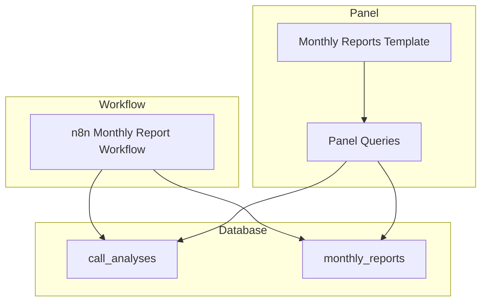
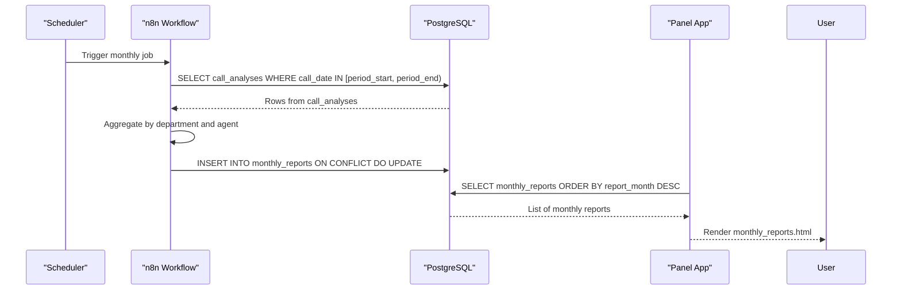
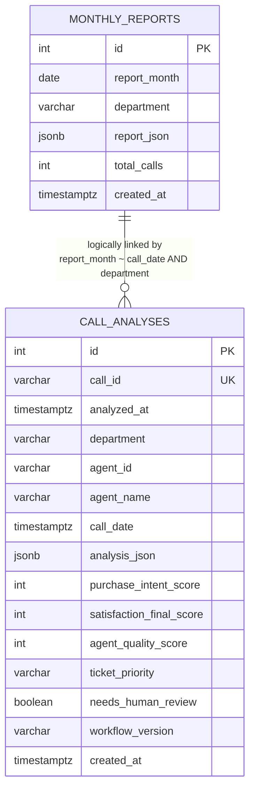
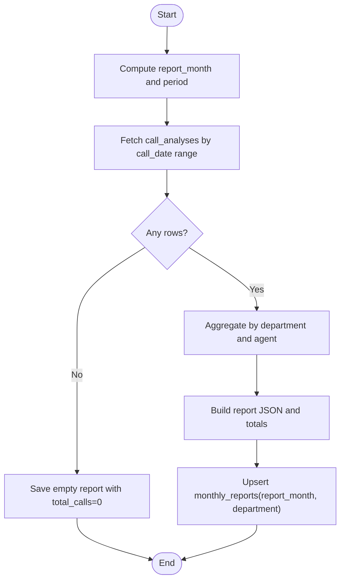
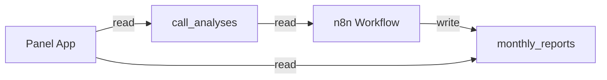

# Table Relationships

<cite>
**Referenced Files in This Document**
- [001_call_intelligence.sql](file://docker/postgres/init/001_call_intelligence.sql)
- [atlas-call-intelligence-monthly-report.json](file://docker/n8n/workflows/atlas-call-intelligence-monthly-report.json)
- [queries.py](file://docker/panel/app/queries.py)
- [monthly_reports.html](file://docker/panel/templates/monthly_reports.html)
</cite>

## Table of Contents
1. [Introduction](#introduction)
2. [Project Structure](#project-structure)
3. [Core Components](#core-components)
4. [Architecture Overview](#architecture-overview)
5. [Detailed Component Analysis](#detailed-component-analysis)
6. [Dependency Analysis](#dependency-analysis)
7. [Performance Considerations](#performance-considerations)
8. [Troubleshooting Guide](#troubleshooting-guide)
9. [Conclusion](#conclusion)

## Introduction
This document explains the table relationships and data flow between call_analyses and monthly_reports in the Atlas database schema. It focuses on how individual call records are aggregated by department and time to produce monthly reports, clarifies foreign key relationships (or lack thereof), and details the indexing strategy that optimizes common query patterns. It also provides example JOIN and aggregation queries that demonstrate how granular call data connects to summarized monthly insights.

## Project Structure
The relevant pieces for this documentation are:
- Database schema defining tables and indexes
- A scheduled workflow that aggregates call_analyses into monthly_reports
- Panel queries used to list and display monthly reports and related metrics
- Templates rendering monthly report listings

**Diagram sources**
- [001_call_intelligence.sql:4-44](file://docker/postgres/init/001_call_intelligence.sql#L4-L44)
- [atlas-call-intelligence-monthly-report.json:51-107](file://docker/n8n/workflows/atlas-call-intelligence-monthly-report.json#L51-L107)
- [queries.py:195-211](file://docker/panel/app/queries.py#L195-L211)
- [monthly_reports.html:1-23](file://docker/panel/templates/monthly_reports.html#L1-L23)

**Section sources**
- [001_call_intelligence.sql:4-44](file://docker/postgres/init/001_call_intelligence.sql#L4-L44)
- [atlas-call-intelligence-monthly-report.json:51-107](file://docker/n8n/workflows/atlas-call-intelligence-monthly-report.json#L51-L107)
- [queries.py:195-211](file://docker/panel/app/queries.py#L195-L211)
- [monthly_reports.html:1-23](file://docker/panel/templates/monthly_reports.html#L1-L23)

## Core Components
- call_analyses: Stores per-call AI analysis with fields such as call_id, analyzed_at, department, agent_id, agent_name, call_date, scores, and a JSONB payload.
- monthly_reports: Stores monthly aggregated reports keyed by report_month and department, including total_calls and a JSONB report payload.

Key constraints and indexes:
- call_analyses has a unique constraint on call_id.
- monthly_reports has a unique constraint on (report_month, department).
- Indexes exist on analyzed_at, agent_id, department, call_date for call_analyses, and on report_month for monthly_reports.

These structures enable efficient time-based and department-based aggregations from call-level data into monthly summaries.

**Section sources**
- [001_call_intelligence.sql:4-44](file://docker/postgres/init/001_call_intelligence.sql#L4-L44)

## Architecture Overview
Data flows from individual call analyses into monthly reports via an n8n workflow that:
1. Computes the reporting period (previous month by default).
2. Reads call_analyses within that period using date filters.
3. Aggregates metrics by department and agent.
4. Optionally generates an AI executive summary.
5. Persists the final report into monthly_reports with upsert semantics.

**Diagram sources**
- [atlas-call-intelligence-monthly-report.json:51-107](file://docker/n8n/workflows/atlas-call-intelligence-monthly-report.json#L51-L107)
- [queries.py:195-211](file://docker/panel/app/queries.py#L195-L211)
- [monthly_reports.html:1-23](file://docker/panel/templates/monthly_reports.html#L1-L23)

## Detailed Component Analysis

### Schema and Relationship Model
- call_analyses contains one row per analyzed call with denormalized dimensions (department, agent_id, agent_name) and time attributes (analyzed_at, call_date).
- monthly_reports stores precomputed summaries per month and department. There is no explicit foreign key from monthly_reports to call_analyses; instead, they are logically linked by time and department through the workflow’s aggregation process.

**Diagram sources**
- [001_call_intelligence.sql:4-44](file://docker/postgres/init/001_call_intelligence.sql#L4-L44)

**Section sources**
- [001_call_intelligence.sql:4-44](file://docker/postgres/init/001_call_intelligence.sql#L4-L44)

### Data Flow: From Calls to Monthly Reports
The monthly report generation pipeline performs:
- Period calculation based on current or provided year/month.
- Filtering call_analyses by call_date range.
- Grouping and computing metrics by department and agent.
- Persisting a single monthly report per (report_month, department) with upsert behavior.

**Diagram sources**
- [atlas-call-intelligence-monthly-report.json:41-107](file://docker/n8n/workflows/atlas-call-intelligence-monthly-report.json#L41-L107)

**Section sources**
- [atlas-call-intelligence-monthly-report.json:41-107](file://docker/n8n/workflows/atlas-call-intelligence-monthly-report.json#L41-L107)

### Indexing Strategy and Query Optimization
Indexes defined:
- idx_call_analyses_analyzed_at: Optimizes queries filtering or sorting by analyzed_at (e.g., recent calls, time-windowed scans).
- idx_call_analyses_agent_id: Optimizes agent-centric queries (e.g., staff performance, top performers).
- idx_call_analyses_department: Optimizes department-scoped queries (e.g., department breakdowns).
- idx_call_analyses_call_date: Optimizes time-range scans for monthly aggregation (critical for monthly report generation).
- idx_monthly_reports_month: Optimizes listing and ordering monthly reports by report_month.

How each index supports specific patterns:
- Time-based aggregation: The monthly workflow filters call_analyses by call_date range; idx_call_analyses_call_date accelerates these scans.
- Department filtering: Department breakdowns and department-scoped analytics benefit from idx_call_analyses_department.
- Agent analytics: Staff performance and top performer lists leverage idx_call_analyses_agent_id.
- Recent activity views: Sorting by analyzed_at uses idx_call_analyses_analyzed_at.
- Monthly report listing: Ordering monthly_reports by report_month uses idx_monthly_reports_month.

**Section sources**
- [001_call_intelligence.sql:29-44](file://docker/postgres/init/001_call_intelligence.sql#L29-L44)
- [queries.py:26-49](file://docker/panel/app/queries.py#L26-L49)
- [queries.py:109-127](file://docker/panel/app/queries.py#L109-L127)
- [queries.py:147-165](file://docker/panel/app/queries.py#L147-L165)
- [queries.py:235-247](file://docker/panel/app/queries.py#L235-L247)

### Example Queries Demonstrating Relationships
Below are representative queries that illustrate how granular call data relates to monthly summaries. These examples align with existing usage in the codebase.

- Department breakdown from call_analyses:
  - Groups by department and computes counts and averages for satisfaction and intent.
  - Uses idx_call_analyses_department for efficient grouping/filtering.

- Monthly report listing:
  - Lists recent monthly reports ordered by report_month.
  - Uses idx_monthly_reports_month for fast ordering.

- Recent calls view:
  - Orders by COALESCE(call_date, analyzed_at) to show most recent activity.
  - Benefits from both date-related indexes depending on data presence.

Note: The monthly report itself is generated by the n8n workflow rather than a direct SQL join; it reads call_analyses by date range and writes a summarized row into monthly_reports.

**Section sources**
- [queries.py:235-247](file://docker/panel/app/queries.py#L235-L247)
- [queries.py:195-211](file://docker/panel/app/queries.py#L195-L211)
- [queries.py:214-225](file://docker/panel/app/queries.py#L214-L225)
- [atlas-call-intelligence-monthly-report.json:51-107](file://docker/n8n/workflows/atlas-call-intelligence-monthly-report.json#L51-L107)

## Dependency Analysis
- The monthly report workflow depends on call_analyses for raw data and writes to monthly_reports.
- The panel UI depends on monthly_reports for listing and drill-down, and on call_analyses for detailed analytics and dashboards.
- There is no enforced referential integrity (foreign keys) between monthly_reports and call_analyses; logical linkage is maintained by matching report_month to call_date ranges and department values during aggregation.

**Diagram sources**
- [atlas-call-intelligence-monthly-report.json:51-107](file://docker/n8n/workflows/atlas-call-intelligence-monthly-report.json#L51-L107)
- [queries.py:195-211](file://docker/panel/app/queries.py#L195-L211)

**Section sources**
- [atlas-call-intelligence-monthly-report.json:51-107](file://docker/n8n/workflows/atlas-call-intelligence-monthly-report.json#L51-L107)
- [queries.py:195-211](file://docker/panel/app/queries.py#L195-L211)

## Performance Considerations
- Prefer filtering call_analyses by call_date ranges when generating monthly reports; idx_call_analyses_call_date ensures efficient range scans.
- Use department filters where applicable to leverage idx_call_analyses_department for faster groupings.
- For agent-focused analytics, filter or group by agent_id to utilize idx_call_analyses_agent_id.
- When displaying recent activity, rely on analyzed_at ordering to benefit from idx_call_analyses_analyzed_at.
- Monthly report listing benefits from idx_monthly_reports_month for fast ordering and pagination.

[No sources needed since this section provides general guidance]

## Troubleshooting Guide
Common issues and resolutions:
- Missing monthly reports: Ensure the n8n workflow runs successfully and inserts into monthly_reports. Check the “Save Report to DB” step and confirm the upsert logic executes without errors.
- Empty reports: If no call_analyses exist for the selected period, the workflow saves a minimal report with total_calls=0. Verify call_date values in call_analyses fall within the expected range.
- Slow dashboard queries: Confirm appropriate indexes exist and are being used. Validate that queries filter by indexed columns (call_date, department, agent_id, analyzed_at) and avoid unnecessary full-table scans.
- Inconsistent department values: Normalize department values at ingestion time to ensure consistent grouping and accurate monthly rollups.

**Section sources**
- [atlas-call-intelligence-monthly-report.json:101-107](file://docker/n8n/workflows/atlas-call-intelligence-monthly-report.json#L101-L107)
- [queries.py:195-211](file://docker/panel/app/queries.py#L195-L211)

## Conclusion
The Atlas schema separates operational call-level data (call_analyses) from summarized monthly insights (monthly_reports). While there are no foreign keys enforcing relationships, the logical connection is established through time and department during aggregation. The defined indexes target the most frequent access patterns—time windows, department filters, agent analytics, and monthly listing—ensuring efficient query performance. The n8n workflow orchestrates the transformation from granular calls to concise monthly reports, which the panel then surfaces to users.