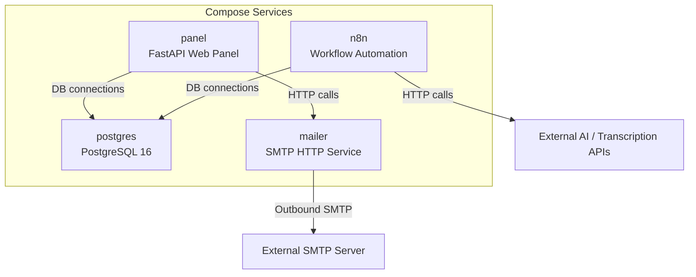
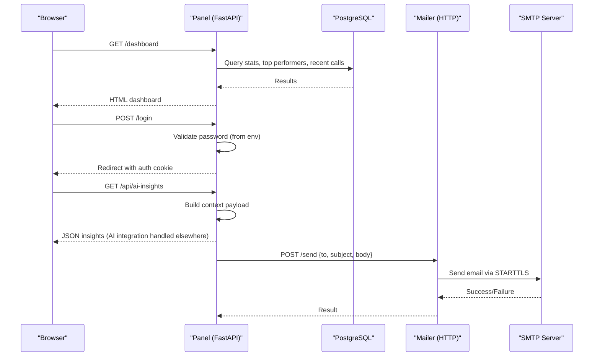
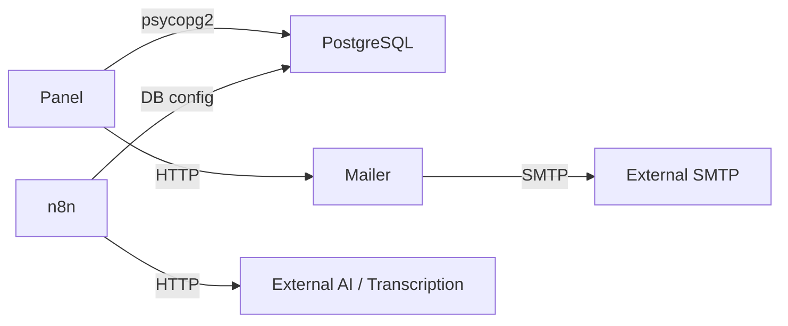

# Container Orchestration

<cite>
**Referenced Files in This Document**
- [docker-compose.yml](file://docker/docker-compose.yml)
- [Dockerfile](file://docker/panel/Dockerfile)
- [main.py](file://docker/panel/app/main.py)
- [config.py](file://docker/panel/app/config.py)
- [db.py](file://docker/panel/app/db.py)
- [mailer.py](file://docker/mailer/mailer.py)
- [requirements.txt](file://docker/panel/requirements.txt)
- [001_call_intelligence.sql](file://docker/postgres/init/001_call_intelligence.sql)
- [002_panel_seed.sql](file://docker/postgres/init/002_panel_seed.sql)
</cite>

## Table of Contents
1. [Introduction](#introduction)
2. [Project Structure](#project-structure)
3. [Core Components](#core-components)
4. [Architecture Overview](#architecture-overview)
5. [Detailed Component Analysis](#detailed-component-analysis)
6. [Dependency Analysis](#dependency-analysis)
7. [Performance Considerations](#performance-considerations)
8. [Troubleshooting Guide](#troubleshooting-guide)
9. [Conclusion](#conclusion)
10. [Appendices](#appendices)

## Introduction
This document explains how the project orchestrates containers using Docker Compose. It covers the service architecture (PostgreSQL, n8n, panel, mailer), container networking and volumes, inter-service communication, lifecycle management with health checks and dependency ordering, scaling strategies, resource limits, optimization tips, security best practices, environment isolation, and data persistence.

Note: Redis is not currently defined as a service in the active compose configuration. If needed, it can be added following the guidance provided later in this document.

## Project Structure
The orchestration is defined under docker/. The key entry point is docker-compose.yml, which defines four services: postgres, n8n, mailer, and panel. Each service has specific ports, environment variables, volumes, and dependencies.

**Diagram sources**
- [docker-compose.yml:3-98](file://docker/docker-compose.yml#L3-L98)

**Section sources**
- [docker-compose.yml:1-98](file://docker/docker-compose.yml#L1-L98)

## Core Components
- PostgreSQL: Primary relational database for call analytics and panel data. Initialized via SQL scripts and persisted to a host volume.
- n8n: Workflow automation tool configured to use PostgreSQL for storage and external AI/transcription endpoints.
- Panel: FastAPI-based web application that renders dashboards and exposes API endpoints; connects to PostgreSQL and optionally calls an AI provider.
- Mailer: Lightweight Python HTTP server exposing an endpoint to send emails via SMTP.

Key characteristics:
- Networking: All services share a default Compose network; services resolve each other by service name (e.g., postgres).
- Volumes: PostgreSQL data and initialization scripts are mounted from the host; n8n workflows and state are persisted.
- Health checks: PostgreSQL includes a health check used by depends_on to ensure readiness before dependent services start.
- Environment variables: Secrets and configuration are passed via environment variables; some values are sourced from .env files.

**Section sources**
- [docker-compose.yml:3-98](file://docker/docker-compose.yml#L3-L98)
- [001_call_intelligence.sql:1-45](file://docker/postgres/init/001_call_intelligence.sql#L1-L45)
- [002_panel_seed.sql:1-46](file://docker/postgres/init/002_panel_seed.sql#L1-L46)
- [Dockerfile:1-11](file://docker/panel/Dockerfile#L1-L11)
- [main.py:1-187](file://docker/panel/app/main.py#L1-L187)
- [config.py:1-14](file://docker/panel/app/config.py#L1-L14)
- [db.py:1-31](file://docker/panel/app/db.py#L1-L31)
- [mailer.py:1-77](file://docker/mailer/mailer.py#L1-L77)

## Architecture Overview
The system follows a layered architecture:
- Data layer: PostgreSQL stores structured analytics and reports.
- Application layer: Panel provides UI and APIs; n8n orchestrates workflows and integrations.
- Integration layer: Mailer sends notifications via SMTP; external AI/transcription APIs are called by n8n and optionally by the panel.

**Diagram sources**
- [main.py:40-187](file://docker/panel/app/main.py#L40-L187)
- [db.py:8-31](file://docker/panel/app/db.py#L8-L31)
- [mailer.py:18-77](file://docker/mailer/mailer.py#L18-L77)
- [docker-compose.yml:3-98](file://docker/docker-compose.yml#L3-L98)

## Detailed Component Analysis

### PostgreSQL
- Purpose: Relational store for call analyses and monthly reports; seeded with sample data.
- Initialization: SQL scripts in docker/postgres/init are executed on first run.
- Persistence: Host volume at ./postgres/data maps to /var/lib/postgresql/data.
- Health check: Uses pg_isready to verify readiness; interval, timeout, and retries are configured.
- Network exposure: Port 5432 mapped to host; internal access via service name postgres.

Operational notes:
- Ensure credentials match across services.
- Use separate databases or schemas for multi-tenant environments if needed.
- Back up the data volume regularly.

**Section sources**
- [docker-compose.yml:3-25](file://docker/docker-compose.yml#L3-L25)
- [001_call_intelligence.sql:1-45](file://docker/postgres/init/001_call_intelligence.sql#L1-L45)
- [002_panel_seed.sql:1-46](file://docker/postgres/init/002_panel_seed.sql#L1-L46)

### n8n
- Purpose: Workflow automation platform integrating with PostgreSQL and external AI/transcription APIs.
- Configuration: Database connection parameters set via environment variables; timezone configured; optional manager email and SMTP sender fields present.
- Persistence: Workflows and state stored under ./n8n/data.
- Dependencies: Starts after PostgreSQL is healthy.

Operational notes:
- Secure external API keys via environment variables or secret management.
- Consider enabling secure cookies and restricting environment access in production.

**Section sources**
- [docker-compose.yml:26-61](file://docker/docker-compose.yml#L26-L61)

### Panel (FastAPI)
- Purpose: Web dashboard and API for call intelligence analytics.
- Build: Custom image built from Dockerfile; installs dependencies and runs Uvicorn.
- Routes: Login, dashboard, various analytics pages, and API endpoints for stats and AI insights.
- Database: Connects to PostgreSQL using DSN constructed from environment variables.
- Security: Optional simple password protection via PANEL_PASSWORD; sets httponly cookie for session.

Operational notes:
- Set PANEL_PASSWORD for basic authentication in non-production or when behind a reverse proxy.
- Keep dependencies updated; pin versions in requirements.txt.

**Section sources**
- [Dockerfile:1-11](file://docker/panel/Dockerfile#L1-L11)
- [requirements.txt:1-7](file://docker/panel/requirements.txt#L1-L7)
- [main.py:1-187](file://docker/panel/app/main.py#L1-L187)
- [config.py:1-14](file://docker/panel/app/config.py#L1-L14)
- [db.py:1-31](file://docker/panel/app/db.py#L1-L31)

### Mailer
- Purpose: HTTP endpoint to send emails via SMTP.
- Interface: Accepts POST /send with JSON payload containing to, subject, body.
- SMTP: Uses STARTTLS; requires SMTP_PASS to be configured.
- Ports: Exposes port 8765 internally; mapped to host for testing or proxying.

Operational notes:
- Do not expose port 8765 directly to the internet; place behind a reverse proxy with TLS and auth if needed.
- Validate inputs and enforce rate limiting at the proxy layer.

**Section sources**
- [mailer.py:1-77](file://docker/mailer/mailer.py#L1-L77)
- [docker-compose.yml:62-79](file://docker/docker-compose.yml#L62-L79)

### Redis
- Current status: No Redis service is defined in docker-compose.yml.
- Guidance: If caching or session storage is required, add a Redis service and connect relevant components via environment variables and client libraries.

[No sources needed since this section does not analyze specific files]

## Dependency Analysis
Service dependencies and communication patterns:
- Panel depends on PostgreSQL for data; uses service name resolution over the Compose network.
- n8n depends on PostgreSQL for workflow storage and metadata.
- Mailer is independent but may be invoked by Panel or n8n via HTTP.
- External services: AI/transcription APIs and SMTP servers are accessed outbound.

**Diagram sources**
- [docker-compose.yml:3-98](file://docker/docker-compose.yml#L3-L98)
- [db.py:8-31](file://docker/panel/app/db.py#L8-L31)
- [mailer.py:18-77](file://docker/mailer/mailer.py#L18-L77)

**Section sources**
- [docker-compose.yml:3-98](file://docker/docker-compose.yml#L3-L98)

## Performance Considerations
- Resource limits: Add CPU/memory limits per service in docker-compose.yml to prevent noisy neighbor issues and protect host stability.
- Connection pooling: For high concurrency, consider adding a connection pooler (e.g., PgBouncer) in front of PostgreSQL.
- Caching: Introduce Redis for caching frequent queries or sessions to reduce database load.
- Image size: Use slim base images and multi-stage builds where applicable; the Panel already uses python:3.12-slim.
- I/O: Place frequently written volumes on fast storage; monitor disk usage for PostgreSQL and n8n data directories.
- Timezone: Ensure consistent timezone settings across services to avoid timestamp discrepancies.

[No sources needed since this section provides general guidance]

## Troubleshooting Guide
Common issues and resolutions:
- PostgreSQL not ready: depends_on waits for healthcheck; verify pg_isready and credentials. Check logs for init script errors.
- Panel cannot connect to DB: Confirm DB_HOST, DB_PORT, DB_NAME, DB_USER, DB_PASSWORD match PostgreSQL configuration.
- n8n startup failures: Verify DB_TYPE and DB_* environment variables; ensure PostgreSQL is reachable and initialized.
- Mailer fails to send: Ensure SMTP_PASS is set; validate SMTP_HOST, SMTP_PORT, and firewall rules; check logs for exceptions.
- Port conflicts: Ensure host ports 5432, 5678, 8080, 8765 are free or remapped.
- Volume permissions: On Linux/macOS, ensure Docker has write access to ./postgres/data and ./n8n/data.

**Section sources**
- [docker-compose.yml:3-98](file://docker/docker-compose.yml#L3-L98)
- [main.py:40-66](file://docker/panel/app/main.py#L40-L66)
- [mailer.py:18-77](file://docker/mailer/mailer.py#L18-L77)

## Conclusion
The current Docker Compose setup provides a robust foundation for Atlas Call Intelligence with PostgreSQL, n8n, Panel, and Mailer services. Inter-service communication relies on Docker networking and environment-driven configuration. Health checks and dependency ordering improve reliability. To enhance resilience and performance, consider adding Redis, enforcing resource limits, securing external endpoints, and implementing backups and monitoring.

[No sources needed since this section summarizes without analyzing specific files]

## Appendices

### Container Lifecycle Management
- Start: docker compose up -d
- Stop: docker compose down
- Restart: docker compose restart <service>
- Logs: docker compose logs -f <service>
- Health: docker compose ps to inspect status; PostgreSQL healthcheck ensures dependents start only after readiness.

**Section sources**
- [docker-compose.yml:20-25](file://docker/docker-compose.yml#L20-L25)
- [docker-compose.yml:58-61](file://docker/docker-compose.yml#L58-L61)
- [docker-compose.yml:96-98](file://docker/docker-compose.yml#L96-L98)

### Scaling Individual Services
- Horizontal scaling: Scale stateless services like Panel and Mailer using docker compose up --scale panel=2. Ensure sticky sessions or shared state if needed.
- Vertical scaling: Increase CPU/memory limits for compute-bound services.
- Database scaling: Prefer read replicas and connection pooling rather than sharding for this workload.

[No sources needed since this section provides general guidance]

### Resource Limits and Optimization
- Add deploy.resources.limits and reservations per service in docker-compose.yml.
- Use minimal base images and prune unused layers during builds.
- Enable compression at the reverse proxy layer for static assets served by Panel.

[No sources needed since this section provides general guidance]

### Security Best Practices
- Secrets: Store sensitive values (DB passwords, API keys, SMTP credentials) in .env files excluded from version control; never hardcode secrets in compose files.
- Least privilege: Run services with non-root users where supported; restrict exposed ports to localhost or through a reverse proxy.
- TLS: Terminate TLS at a reverse proxy; do not expose services directly to the internet.
- Input validation: Validate and sanitize inputs at the API boundary; implement rate limiting and IP allowlisting at the proxy.
- Cookie security: Use httponly and secure flags for cookies; enable HTTPS-only cookies in production.

**Section sources**
- [docker-compose.yml:8-11](file://docker/docker-compose.yml#L8-L11)
- [docker-compose.yml:34-53](file://docker/docker-compose.yml#L34-L53)
- [docker-compose.yml:70-76](file://docker/docker-compose.yml#L70-L76)
- [main.py:47-65](file://docker/panel/app/main.py#L47-L65)

### Environment Isolation
- Use separate .env files per environment (dev, staging, prod).
- Prefix environment variables per service to avoid collisions.
- Validate required variables at startup; fail fast if critical configs are missing.

**Section sources**
- [docker-compose.yml:8-11](file://docker/docker-compose.yml#L8-L11)
- [docker-compose.yml:34-53](file://docker/docker-compose.yml#L34-L53)
- [docker-compose.yml:70-76](file://docker/docker-compose.yml#L70-L76)
- [config.py:1-14](file://docker/panel/app/config.py#L1-L14)

### Data Persistence Strategies
- PostgreSQL: Persist to ./postgres/data; back up regularly using pg_dump or volume snapshots.
- n8n: Persist workflows and state under ./n8n/data; include in backup strategy.
- Mailer: Stateless; no persistent data.
- Panel: Stateless; state resides in browser cookies or backend storage.

**Section sources**
- [docker-compose.yml:16-18](file://docker/docker-compose.yml#L16-L18)
- [docker-compose.yml:55-57](file://docker/docker-compose.yml#L55-L57)

### Adding Redis (Optional)
If you need Redis for caching or sessions:
- Add a redis service with a dedicated volume.
- Configure services to connect via environment variables (e.g., REDIS_HOST, REDIS_PORT).
- Update application code to use a Redis client library.

[No sources needed since this section provides conceptual guidance]