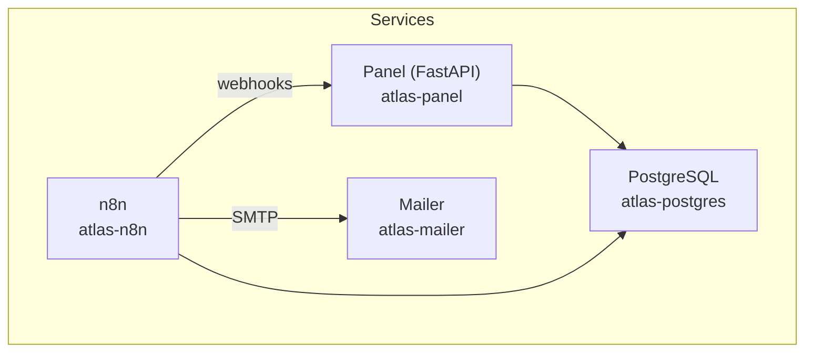
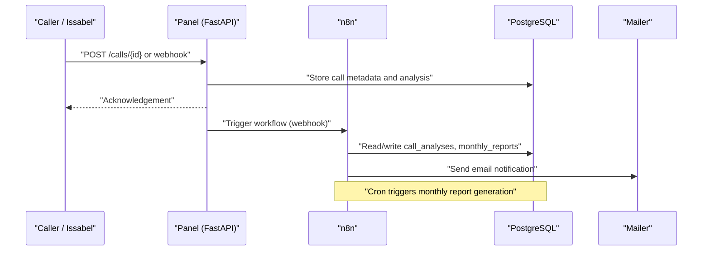
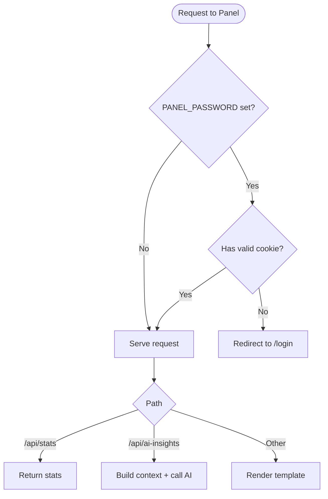
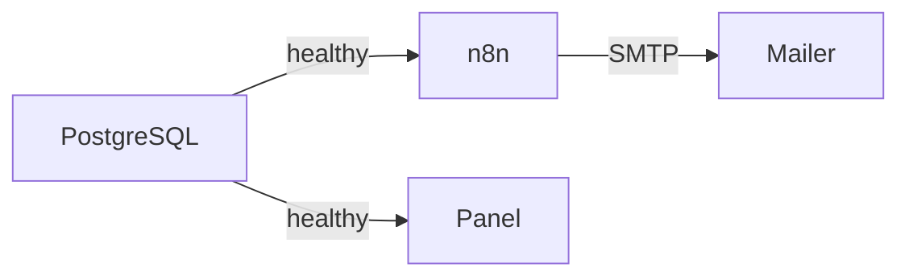

# Deployment Guide

<cite>
**Referenced Files in This Document**
- [docker-compose.yml](file://docker/docker-compose.yml)
- [Dockerfile](file://docker/panel/Dockerfile)
- [config.py](file://docker/panel/app/config.py)
- [main.py](file://docker/panel/app/main.py)
- [db.py](file://docker/panel/app/db.py)
- [queries.py](file://docker/panel/app/queries.py)
- [mailer.py](file://docker/mailer/mailer.py)
- [001_call_intelligence.sql](file://docker/postgres/init/001_call_intelligence.sql)
- [002_panel_seed.sql](file://docker/postgres/init/002_panel_seed.sql)
- [postgres.json](file://docker/n8n/credentials/postgres.json)
- [README.md (Atlas Call Intelligence v1)](file://03_Products/Atlas Call Intelligence/V1/README.md)
- [.gitignore](file://.gitignore)
</cite>

## Table of Contents
1. Introduction
2. Project Structure
3. Core Components
4. Architecture Overview
5. Detailed Component Analysis
6. Dependency Analysis
7. Performance Considerations
8. Troubleshooting Guide
9. Conclusion
10. Appendices

## Introduction
This guide provides production-ready deployment instructions for the Atlas platform, focusing on Docker container orchestration, environment configuration, service dependencies, scaling, monitoring, backups, disaster recovery, security hardening, and operational best practices. It is designed to help operators deploy Atlas across development, staging, and production environments with confidence.

## Project Structure
The platform is composed of four primary services orchestrated via Docker Compose:
- PostgreSQL database with initialization scripts and persistent data volume
- n8n workflow automation engine connected to PostgreSQL
- Python-based mailer HTTP service exposing SMTP sending capabilities
- FastAPI-based Panel application serving dashboards and APIs, backed by PostgreSQL

**Diagram sources**
- [docker-compose.yml:3-98](file://docker/docker-compose.yml#L3-L98)

**Section sources**
- [docker-compose.yml:1-98](file://docker/docker-compose.yml#L1-L98)

## Core Components
- Database layer: PostgreSQL schema for call analyses and monthly reports, plus seed data for demo usage.
- Automation layer: n8n workflows that process call intelligence and generate reports; credentials stored under n8n/data.
- Notification layer: Lightweight HTTP mailer using SMTP to send alerts and notifications.
- Presentation layer: FastAPI Panel providing dashboards, reporting views, and an AI insights API endpoint.

Key runtime behaviors:
- Health checks ensure PostgreSQL readiness before dependent services start.
- Environment variables drive external integrations (AI APIs, SMTP, panel auth).
- Persistent volumes protect data across restarts.

**Section sources**
- [docker-compose.yml:3-98](file://docker/docker-compose.yml#L3-L98)
- [001_call_intelligence.sql:1-45](file://docker/postgres/init/001_call_intelligence.sql#L1-L45)
- [002_panel_seed.sql:1-46](file://docker/postgres/init/002_panel_seed.sql#L1-L46)
- [postgres.json:1-15](file://docker/n8n/credentials/postgres.json#L1-L15)
- [mailer.py:1-77](file://docker/mailer/mailer.py#L1-L77)
- [main.py:1-187](file://docker/panel/app/main.py#L1-L187)

## Architecture Overview
End-to-end flow from call ingestion to insights and reporting:

**Diagram sources**
- [docker-compose.yml:26-61](file://docker/docker-compose.yml#L26-L61)
- [main.py:166-170](file://docker/panel/app/main.py#L166-L170)
- [001_call_intelligence.sql:4-45](file://docker/postgres/init/001_call_intelligence.sql#L4-L45)
- [mailer.py:36-77](file://docker/mailer/mailer.py#L36-L77)

## Detailed Component Analysis

### PostgreSQL Service
- Purpose: Primary datastore for call analyses and monthly reports.
- Initialization: Scripts under postgres/init are executed on first run; includes schema and optional seed data.
- Persistence: Data mounted to host path for durability.
- Health check: Uses pg_isready to signal readiness.

Operational notes:
- Ensure secrets are not committed; use environment files or secret managers.
- Back up the data volume regularly.

**Section sources**
- [docker-compose.yml:3-25](file://docker/docker-compose.yml#L3-L25)
- [001_call_intelligence.sql:1-45](file://docker/postgres/init/001_call_intelligence.sql#L1-L45)
- [002_panel_seed.sql:1-46](file://docker/postgres/init/002_panel_seed.sql#L1-L46)

### n8n Service
- Purpose: Workflow automation for call intelligence processing and monthly reporting.
- Configuration: Connects to PostgreSQL; timezone set; exposes webhooks for integration.
- Credentials: Stored in n8n/data; example credential file provided.

Operational notes:
- Import required workflows into n8n UI.
- Secure cookie and environment access flags are present; adjust for production.

**Section sources**
- [docker-compose.yml:26-61](file://docker/docker-compose.yml#L26-L61)
- [postgres.json:1-15](file://docker/n8n/credentials/postgres.json#L1-L15)
- [README.md (Atlas Call Intelligence v1):30-59](file://03_Products/Atlas Call Intelligence/V1/README.md#L30-L59)

### Mailer Service
- Purpose: Exposes a simple HTTP endpoint to send emails via SMTP.
- Endpoints: POST /send or / with JSON payload {to, subject, body}.
- Configuration: SMTP host/port/user/password and default recipient via environment variables.

Operational notes:
- Validate SMTP credentials and TLS settings.
- Rate-limit and monitor outbound traffic in production.

**Section sources**
- [docker-compose.yml:62-79](file://docker/docker-compose.yml#L62-L79)
- [mailer.py:1-77](file://docker/mailer/mailer.py#L1-L77)

### Panel Service (FastAPI)
- Purpose: Web dashboard and APIs for call analytics, staff performance, satisfaction metrics, and AI insights.
- Build: Custom image built from Dockerfile; serves static assets and templates.
- Auth: Optional password-based protection via PANEL_PASSWORD; sets secure cookie on login.
- APIs:
  - GET /api/stats returns overview statistics.
  - GET /api/ai-insights returns AI-generated executive insights based on current context.
- Templates: Jinja2 templates render HTML pages for dashboards.

Operational notes:
- Set PANEL_PASSWORD for basic authentication in non-dev environments.
- Configure AI model and API key for insights feature.

**Diagram sources**
- [main.py:40-66](file://docker/panel/app/main.py#L40-L66)
- [main.py:166-170](file://docker/panel/app/main.py#L166-L170)
- [main.py:184-187](file://docker/panel/app/main.py#L184-L187)

**Section sources**
- [Dockerfile:1-11](file://docker/panel/Dockerfile#L1-L11)
- [config.py:1-14](file://docker/panel/app/config.py#L1-L14)
- [main.py:1-187](file://docker/panel/app/main.py#L1-L187)
- [db.py:1-31](file://docker/panel/app/db.py#L1-L31)
- [queries.py:1-260](file://docker/panel/app/queries.py#L1-L260)

## Dependency Analysis
Service startup order and health-based dependencies:
- PostgreSQL starts first and exposes a healthcheck.
- n8n and Panel depend on PostgreSQL being healthy.
- Mailer is independent but used by n8n for notifications.

**Diagram sources**
- [docker-compose.yml:20-25](file://docker/docker-compose.yml#L20-L25)
- [docker-compose.yml:58-61](file://docker/docker-compose.yml#L58-L61)
- [docker-compose.yml:96-98](file://docker/docker-compose.yml#L96-L98)

**Section sources**
- [docker-compose.yml:3-98](file://docker/docker-compose.yml#L3-L98)

## Performance Considerations
- Database:
  - Use persistent volumes for data durability and consider dedicated storage class in production.
  - Tune connection pooling at the application level if needed; Panel uses direct connections per request.
- Panel:
  - Run behind a reverse proxy (e.g., Nginx/Traefik) for concurrency, buffering, and SSL termination.
  - Enable Gunicorn workers in front of Uvicorn for production throughput.
- n8n:
  - Scale horizontally if workflows are CPU-bound; ensure shared filesystem or externalized credentials for multi-instance setups.
- Mailer:
  - Add retry logic and circuit breakers around SMTP calls; consider queuing for high-volume scenarios.

[No sources needed since this section provides general guidance]

## Troubleshooting Guide
Common issues and resolutions:
- PostgreSQL not ready:
  - Verify healthcheck passes; ensure init scripts exist and have correct permissions.
  - Confirm ports and network reachability between containers.
- Panel cannot connect to database:
  - Check DB_HOST, DB_PORT, DB_NAME, DB_USER, DB_PASSWORD environment variables.
  - Validate credentials match PostgreSQL configuration.
- n8n cannot connect to PostgreSQL:
  - Ensure credentials in n8n match DB settings; verify network connectivity.
  - Re-import workflows and credentials after DB changes.
- Mailer fails to send email:
  - Validate SMTP_HOST, SMTP_PORT, SMTP_USER, SMTP_PASS.
  - Confirm TLS/SSL requirements and firewall rules.
- Authentication bypass:
  - If PANEL_PASSWORD is empty, Panel disables login requirement; set a strong password in production.

**Section sources**
- [docker-compose.yml:8-25](file://docker/docker-compose.yml#L8-L25)
- [config.py:1-14](file://docker/panel/app/config.py#L1-L14)
- [db.py:1-31](file://docker/panel/app/db.py#L1-L31)
- [mailer.py:10-15](file://docker/mailer/mailer.py#L10-L15)
- [main.py:40-66](file://docker/panel/app/main.py#L40-L66)

## Conclusion
Atlas is a modular, containerized platform with clear separation of concerns: database persistence, workflow automation, notifications, and a presentation layer. With proper environment configuration, health checks, and persistent storage, it can be deployed reliably across environments. For production, add reverse proxy, SSL, secrets management, monitoring, backups, and scaling strategies as outlined in the appendices.

[No sources needed since this section summarizes without analyzing specific files]

## Appendices

### Environment-Specific Configuration
- Development:
  - Use local .env with test values; enable debug features cautiously.
  - Keep PANEL_PASSWORD unset or weak for convenience only.
- Staging:
  - Mirror production configuration with isolated credentials.
  - Enable logging and alerting; validate workflows against realistic data.
- Production:
  - Enforce strong PANEL_PASSWORD.
  - Use secret managers for all sensitive variables (DB passwords, API keys, SMTP credentials).
  - Pin versions for images and dependencies; avoid latest tags.

Environment variables summary:
- PostgreSQL: POSTGRES_USER, POSTGRES_PASSWORD, POSTGRES_DB
- n8n: DB_* variables, API_URL, TRANSCRIPTION_API_URL, API_KEY, AI_MODEL, ATLAS_MANAGER_EMAIL, ATLAS_SMTP_FROM, timezones
- Mailer: SMTP_HOST, SMTP_PORT, SMTP_USER, SMTP_PASS, ATLAS_MANAGER_EMAIL, MAILER_PORT
- Panel: DB_HOST, DB_PORT, DB_NAME, DB_USER, DB_PASSWORD, AI_API_KEY, AI_MODEL, PANEL_TITLE, PANEL_PASSWORD

**Section sources**
- [docker-compose.yml:8-98](file://docker/docker-compose.yml#L8-L98)
- [config.py:1-14](file://docker/panel/app/config.py#L1-L14)
- [mailer.py:10-15](file://docker/mailer/mailer.py#L10-L15)
- [README.md (Atlas Call Intelligence v1):60-69](file://03_Products/Atlas Call Intelligence/V1/README.md#L60-L69)

### Security Hardening
- Secrets management:
  - Do not commit .env or secrets; use Docker secrets or external vaults.
  - Rotate credentials regularly.
- Network security:
  - Expose only necessary ports through a reverse proxy.
  - Restrict internal service communication to Docker networks.
- Application security:
  - Enable HTTPS at the reverse proxy; enforce HSTS.
  - Set PANEL_PASSWORD for basic authentication.
  - Review n8n security flags for production use.
- Data protection:
  - Encrypt volumes at rest where supported.
  - Limit database user privileges to minimum required.

**Section sources**
- [docker-compose.yml:52-53](file://docker/docker-compose.yml#L52-L53)
- [main.py:47-66](file://docker/panel/app/main.py#L47-L66)
- [postgres.json:1-15](file://docker/n8n/credentials/postgres.json#L1-L15)
- [.gitignore:1-4](file://.gitignore#L1-L4)

### Monitoring and Logging
- Container logs:
  - Centralize logs from all services (PostgreSQL, n8n, Panel, Mailer) using a log aggregator.
- Health endpoints:
  - Panel exposes /api/stats for lightweight health/status checks.
  - PostgreSQL healthcheck is configured in compose.
- Metrics:
  - Integrate Prometheus exporters for PostgreSQL and application metrics where available.
- Alerts:
  - Alert on failed health checks, SMTP errors, and high error rates.

**Section sources**
- [docker-compose.yml:20-25](file://docker/docker-compose.yml#L20-L25)
- [main.py:184-187](file://docker/panel/app/main.py#L184-L187)

### Backup Procedures
- Database backups:
  - Schedule regular pg_dump or logical backups for the atlas database.
  - Store backups offsite with encryption and retention policies.
- Volume backups:
  - Back up postgres/data and n8n/data directories to preserve state.
- Verification:
  - Periodically restore backups to a staging environment to validate integrity.

**Section sources**
- [docker-compose.yml:16-18](file://docker/docker-compose.yml#L16-L18)
- [docker-compose.yml:55-57](file://docker/docker-compose.yml#L55-L57)

### Disaster Recovery Plan
- RTO/RPO:
  - Define acceptable recovery time and point objectives aligned with business needs.
- Failover:
  - Maintain hot standby or read replicas for PostgreSQL if required.
  - Keep n8n workflows and credentials versioned and reproducible.
- Rollback:
  - Pin service versions; maintain rollback procedures for config and code changes.
- Communication:
  - Establish incident response playbooks and escalation paths.

[No sources needed since this section provides general guidance]

### Scaling Considerations
- Horizontal scaling:
  - Panel: Run multiple instances behind a reverse proxy with session affinity if needed.
  - n8n: Scale workers; externalize credentials and use shared storage or cloud-backed stores.
- Vertical scaling:
  - Increase CPU/memory for PostgreSQL based on workload; tune connection limits.
- Caching:
  - Introduce caching layers for frequently accessed queries if latency becomes critical.

[No sources needed since this section provides general guidance]

### Health Check Endpoints and Service Discovery
- Health checks:
  - PostgreSQL: Built-in healthcheck via pg_isready.
  - Panel: GET /api/stats returns status-like data suitable for probes.
- Service discovery:
  - In Docker Compose, services discover each other via service names (e.g., postgres).
  - For orchestrators (Kubernetes), expose services via Services and use DNS-based discovery.

**Section sources**
- [docker-compose.yml:20-25](file://docker/docker-compose.yml#L20-L25)
- [main.py:184-187](file://docker/panel/app/main.py#L184-L187)

### Load Balancing Approaches
- Reverse proxy:
  - Place Nginx/Traefik in front of Panel for load distribution, SSL termination, and rate limiting.
- Session handling:
  - If using cookies for auth, configure sticky sessions or move session state to a shared store.
- n8n:
  - Use external queue/backends for job distribution when scaling horizontally.

[No sources needed since this section provides general guidance]

### Operational Checklist
- Pre-deployment:
  - Validate environment variables and secrets.
  - Import n8n workflows and credentials.
  - Run init scripts if needed.
- Post-deployment:
  - Verify health checks pass.
  - Test Panel login and dashboards.
  - Trigger a sample call analysis and confirm storage and notifications.
- Maintenance:
  - Monitor logs and metrics.
  - Rotate secrets and update dependencies regularly.

**Section sources**
- [docker-compose.yml:3-98](file://docker/docker-compose.yml#L3-L98)
- [README.md (Atlas Call Intelligence v1):30-59](file://03_Products/Atlas Call Intelligence/V1/README.md#L30-L59)