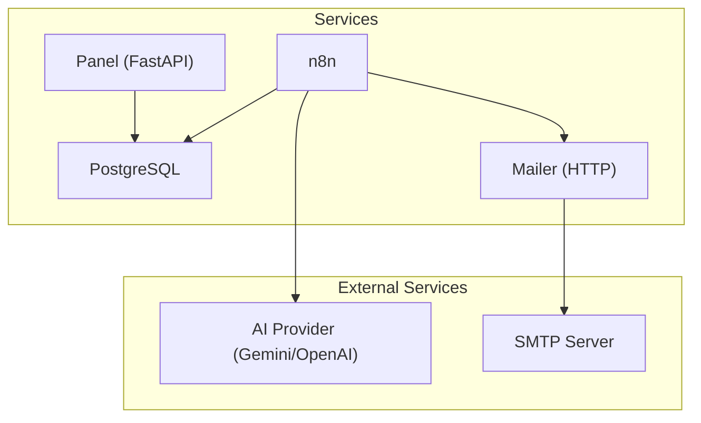
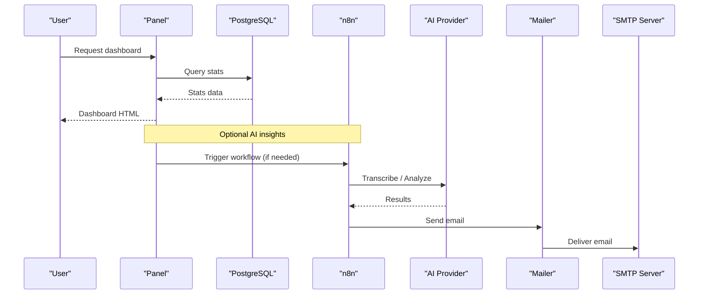
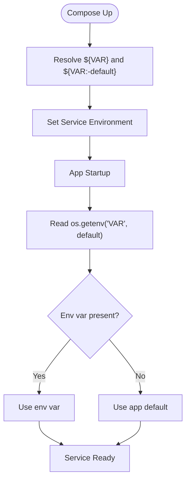

# Environment Configuration

<cite>
**Referenced Files in This Document**
- [docker-compose.yml](file://docker/docker-compose.yml)
- [config.py](file://docker/panel/app/config.py)
- [db.py](file://docker/panel/app/db.py)
- [main.py](file://docker/panel/app/main.py)
- [mailer.py](file://docker/mailer/mailer.py)
- [send_email.py](file://docker/mailer/send_email.py)
- [postgres.json](file://docker/n8n/credentials/postgres.json)
- [run-real-voice-test.py](file://docker/scripts/run-real-voice-test.py)
- [Dockerfile](file://docker/panel/Dockerfile)
- [.gitignore](file://.gitignore)
</cite>

## Table of Contents
1. [Introduction](#introduction)
2. [Project Structure](#project-structure)
3. [Core Components](#core-components)
4. [Architecture Overview](#architecture-overview)
5. [Detailed Component Analysis](#detailed-component-analysis)
6. [Dependency Analysis](#dependency-analysis)
7. [Performance Considerations](#performance-considerations)
8. [Troubleshooting Guide](#troubleshooting-guide)
9. [Conclusion](#conclusion)
10. [Appendices](#appendices)

## Introduction
This document provides comprehensive environment configuration guidance for all deployment environments in the Atlas project. It covers environment variables for database connections, API keys, SMTP settings, and AI service configurations. It also explains environment-specific overrides, secrets management, credential handling, configuration validation, default values, migration between environments, precedence rules, and troubleshooting common issues.

## Project Structure
The system is containerized with Docker Compose and consists of:
- PostgreSQL database
- n8n workflow automation
- Panel (FastAPI web app)
- Mailer (HTTP mail service)
- Scripts for testing and integration

**Diagram sources**
- [docker-compose.yml:3-98](file://docker/docker-compose.yml#L3-L98)

**Section sources**
- [docker-compose.yml:3-98](file://docker/docker-compose.yml#L3-L98)

## Core Components
- Database: PostgreSQL with connection details configured via environment variables and used by both the Panel and n8n.
- Panel: FastAPI application that reads DB and AI configuration from environment variables and serves a dashboard.
- Mailer: HTTP service that sends emails via SMTP using environment variables.
- n8n: Workflow engine configured to connect to PostgreSQL and call external APIs (transcription/AI).
- Scripts: Utility scripts that use environment variables to interact with AI providers and n8n.

**Section sources**
- [config.py:3-13](file://docker/panel/app/config.py#L3-L13)
- [db.py:8-14](file://docker/panel/app/db.py#L8-L14)
- [mailer.py:10-15](file://docker/mailer/mailer.py#L10-L15)
- [docker-compose.yml:26-98](file://docker/docker-compose.yml#L26-L98)

## Architecture Overview
Environment variables flow from Docker Compose into each service at runtime. The Panel reads DB and AI settings from its config module. The Mailer uses SMTP settings to send email. n8n connects to PostgreSQL and calls AI services based on its environment.

**Diagram sources**
- [docker-compose.yml:26-98](file://docker/docker-compose.yml#L26-L98)
- [config.py:3-13](file://docker/panel/app/config.py#L3-L13)
- [db.py:8-14](file://docker/panel/app/db.py#L8-L14)
- [mailer.py:18-33](file://docker/mailer/mailer.py#L18-L33)

## Detailed Component Analysis

### PostgreSQL Configuration
- Variables set in the compose file define user, password, database name, port mapping, and initialization scripts.
- Health checks ensure readiness before dependent services start.

Key points:
- Default credentials are embedded in compose; override via environment or compose overrides for non-development environments.
- Data persistence is mounted to a local volume.

**Section sources**
- [docker-compose.yml:3-24](file://docker/docker-compose.yml#L3-L24)

### Panel (FastAPI) Configuration
- Reads DB host, port, name, user, password from environment variables with defaults suitable for Docker networking.
- AI API key and model are read from environment variables.
- Optional panel title and password for simple authentication.

Behavior:
- If PANEL_PASSWORD is empty, login is bypassed; otherwise, a cookie-based auth middleware protects routes.
- DB connection string is built dynamically from config values.

**Section sources**
- [config.py:3-13](file://docker/panel/app/config.py#L3-L13)
- [db.py:8-14](file://docker/panel/app/db.py#L8-L14)
- [main.py:40-65](file://docker/panel/app/main.py#L40-L65)

### Mailer (SMTP) Configuration
- SMTP host, port, user, and password are read from environment variables with sensible defaults for development.
- Default recipient can be overridden via ATLAS_MANAGER_EMAIL.
- The service exposes an HTTP endpoint to send emails.

Validation:
- If SMTP_PASS is not set, sending fails early with a clear error response.

**Section sources**
- [mailer.py:10-15](file://docker/mailer/mailer.py#L10-L15)
- [mailer.py:18-33](file://docker/mailer/mailer.py#L18-L33)
- [docker-compose.yml:62-78](file://docker/docker-compose.yml#L62-L78)

### n8n Configuration
- Connects to PostgreSQL using environment variables.
- Configures timezone and security-related flags.
- Exposes API URLs and keys for transcription and AI services via environment variables.

Notes:
- Credentials for PostgreSQL are also stored in a JSON file for n8n usage; ensure this matches runtime environment when migrating.

**Section sources**
- [docker-compose.yml:26-60](file://docker/docker-compose.yml#L26-L60)
- [postgres.json:1-14](file://docker/n8n/credentials/postgres.json#L1-L14)

### Scripts and Utilities
- Test scripts read AI API keys and models from environment variables and call n8n webhooks.
- Useful for local testing and CI pipelines.

**Section sources**
- [run-real-voice-test.py:10-13](file://docker/scripts/run-real-voice-test.py#L10-L13)
- [send_email.py:14-20](file://docker/mailer/send_email.py#L14-L20)

## Dependency Analysis
Environment variable precedence and propagation:
- Docker Compose environment blocks provide explicit values or reference shell variables with ${VAR} syntax.
- When a value is provided via ${VAR:-default}, the default applies only if the shell variable is unset or empty.
- Container processes read their environment at startup; there is no dynamic reload.

Precedence summary:
1. Explicit values in docker-compose environment blocks take highest priority for that service.
2. Shell environment variables referenced via ${VAR} or ${VAR:-default} are substituted at compose time.
3. Application-level defaults (e.g., in Python code) apply only if no environment variable is set.

**Diagram sources**
- [docker-compose.yml:34-95](file://docker/docker-compose.yml#L34-L95)
- [config.py:3-13](file://docker/panel/app/config.py#L3-L13)
- [mailer.py:10-15](file://docker/mailer/mailer.py#L10-L15)

**Section sources**
- [docker-compose.yml:34-95](file://docker/docker-compose.yml#L34-L95)
- [config.py:3-13](file://docker/panel/app/config.py#L3-L13)
- [mailer.py:10-15](file://docker/mailer/mailer.py#L10-L15)

## Performance Considerations
- Keep sensitive credentials out of source control; rely on environment injection.
- Avoid frequent restarts to change environment; prefer orchestration tools or secret managers.
- Ensure DB connection pooling is considered at scale; current implementation opens connections per request context.

[No sources needed since this section provides general guidance]

## Troubleshooting Guide

Common issues and resolutions:
- Database connection failures:
  - Verify DB_HOST, DB_PORT, DB_NAME, DB_USER, DB_PASSWORD match the running PostgreSQL instance.
  - Confirm network reachability and ports are exposed correctly.
  - Check health status of the PostgreSQL service before starting dependents.

- Panel authentication unexpected behavior:
  - If PANEL_PASSWORD is empty, login is bypassed; set a strong password for production.
  - Ensure cookies are allowed by clients; the panel sets an httponly cookie.

- Email sending errors:
  - SMTP_PASS must be set; otherwise, sending fails with a clear error.
  - Validate SMTP_HOST, SMTP_PORT, and SMTP_USER for your provider.
  - Ensure TLS is supported and firewall allows outbound SMTP.

- n8n connectivity:
  - Ensure DB_POSTGRESDB_* variables point to the correct PostgreSQL service.
  - Update postgres.json credentials if you change DB credentials outside of compose.

- AI service configuration:
  - Provide AI_API_KEY and appropriate AI_MODEL for both Panel and n8n.
  - For scripts, set GEMINI_MODEL and N8N_WEBHOOK_URL as needed.

Environment variable precedence tips:
- Use .env files alongside docker-compose to avoid hardcoding secrets in compose files.
- Remember that .env is ignored by git; do not commit secrets.

**Section sources**
- [config.py:3-13](file://docker/panel/app/config.py#L3-L13)
- [db.py:8-14](file://docker/panel/app/db.py#L8-L14)
- [mailer.py:18-33](file://docker/mailer/mailer.py#L18-L33)
- [docker-compose.yml:34-95](file://docker/docker-compose.yml#L34-L95)
- [postgres.json:1-14](file://docker/n8n/credentials/postgres.json#L1-L14)
- [run-real-voice-test.py:10-13](file://docker/scripts/run-real-voice-test.py#L10-L13)
- [.gitignore:1-4](file://.gitignore#L1-L4)

## Conclusion
Atlas’s environment configuration relies on Docker Compose to inject variables into each service at runtime. Sensitive values should be managed through environment variables or secret stores, never committed to version control. Follow the precedence rules and defaults documented here to migrate safely across environments and troubleshoot common configuration issues.

[No sources needed since this section summarizes without analyzing specific files]

## Appendices

### Environment Variables Reference

- PostgreSQL (service):
  - POSTGRES_USER, POSTGRES_PASSWORD, POSTGRES_DB
  - Port mapping: 15432:5443 (host:container)

- n8n:
  - DB_TYPE, DB_POSTGRESDB_HOST, DB_POSTGRESDB_PORT, DB_POSTGRESDB_DATABASE, DB_POSTGRESDB_USER, DB_POSTGRESDB_PASSWORD
  - GENERIC_TIMEZONE, TZ
  - API_URL, TRANSCRIPTION_API_URL, API_KEY, AI_MODEL
  - ATLAS_MANAGER_EMAIL, ATLAS_SMTP_FROM
  - N8N_SECURE_COOKIE, N8N_BLOCK_ENV_ACCESS_IN_NODE

- Panel:
  - DB_HOST, DB_PORT, DB_NAME, DB_USER, DB_PASSWORD
  - AI_API_KEY, AI_MODEL
  - PANEL_TITLE, PANEL_PASSWORD

- Mailer:
  - SMTP_HOST, SMTP_PORT, SMTP_USER, SMTP_PASS
  - ATLAS_MANAGER_EMAIL
  - MAILER_PORT

- Scripts:
  - AI_API_KEY, GEMINI_MODEL, N8N_WEBHOOK_URL

**Section sources**
- [docker-compose.yml:8-11](file://docker/docker-compose.yml#L8-L11)
- [docker-compose.yml:34-53](file://docker/docker-compose.yml#L34-L53)
- [docker-compose.yml:70-76](file://docker/docker-compose.yml#L70-L76)
- [docker-compose.yml:86-95](file://docker/docker-compose.yml#L86-L95)
- [config.py:3-13](file://docker/panel/app/config.py#L3-L13)
- [mailer.py:10-15](file://docker/mailer/mailer.py#L10-L15)
- [run-real-voice-test.py:10-13](file://docker/scripts/run-real-voice-test.py#L10-L13)

### Secrets Management Best Practices
- Do not commit secrets to repository; .gitignore excludes .env and docker/.env.
- Use environment files or orchestrator secret management to inject values at runtime.
- Rotate credentials regularly and validate them in CI before deployment.

**Section sources**
- [.gitignore:1-4](file://.gitignore#L1-L4)

### Migration Between Environments
- Development:
  - Use defaults in compose and code; minimal setup required.
- Staging/Production:
  - Override compose environment variables with secure values.
  - Update n8n credentials file to match runtime DB credentials.
  - Configure SMTP and AI provider keys securely.
  - Enable strict security flags where applicable.

**Section sources**
- [docker-compose.yml:34-95](file://docker/docker-compose.yml#L34-L95)
- [postgres.json:1-14](file://docker/n8n/credentials/postgres.json#L1-L14)