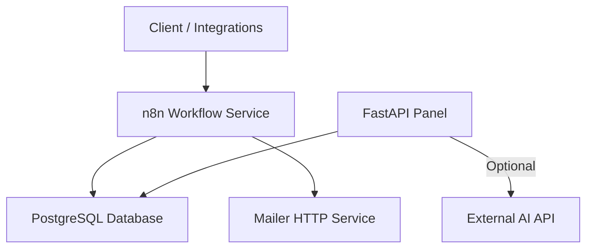
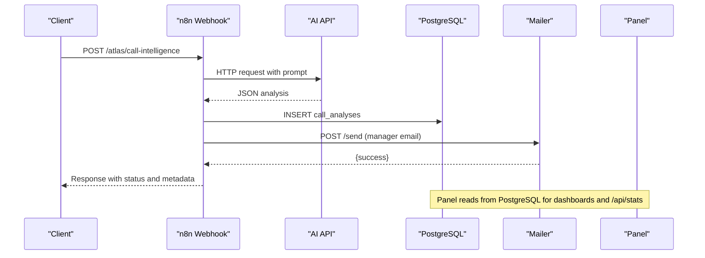
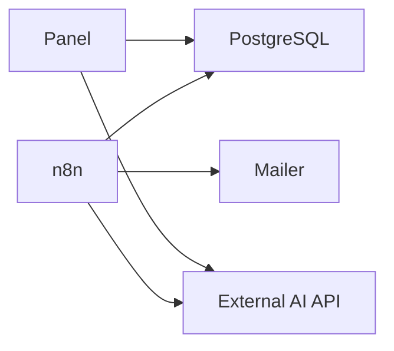

# Monitoring & Maintenance

<cite>
**Referenced Files in This Document**
- [docker-compose.yml](file://docker/docker-compose.yml)
- [main.py](file://docker/panel/app/main.py)
- [config.py](file://docker/panel/app/config.py)
- [db.py](file://docker/panel/app/db.py)
- [queries.py](file://docker/panel/app/queries.py)
- [mailer.py](file://docker/mailer/mailer.py)
- [001_call_intelligence.sql](file://docker/postgres/init/001_call_intelligence.sql)
- [atlas-call-intelligence-v1.json](file://docker/n8n/workflows/atlas-call-intelligence-v1.json)
</cite>

## Table of Contents
1. [Introduction](#introduction)
2. [Project Structure](#project-structure)
3. [Core Components](#core-components)
4. [Architecture Overview](#architecture-overview)
5. [Detailed Component Analysis](#detailed-component-analysis)
6. [Dependency Analysis](#dependency-analysis)
7. [Performance Considerations](#performance-considerations)
8. [Troubleshooting Guide](#troubleshooting-guide)
9. [Conclusion](#conclusion)
10. [Appendices](#appendices)

## Introduction
This document provides operational monitoring and maintenance guidance for the Atlas Call Intelligence system. It covers logging strategies, log aggregation, rotation policies, health checks, service monitoring, alerting, performance metrics collection, bottleneck identification, optimization techniques, routine maintenance tasks (database, cache, cleanup), troubleshooting workflows, and incident response procedures. The guidance is grounded in the repository’s Docker services, FastAPI panel, PostgreSQL schema, n8n workflow, and mailer service.

## Project Structure
The system runs as a set of Docker services:
- PostgreSQL database with initialization scripts and indexes
- n8n workflow orchestrator that ingests call data, calls an AI endpoint, persists analysis to PostgreSQL, and triggers email notifications
- A Python-based HTTP mailer service exposing SMTP sending via HTTP
- A FastAPI-based management panel serving dashboards and API endpoints over PostgreSQL data

**Diagram sources**
- [docker-compose.yml:3-98](file://docker/docker-compose.yml#L3-L98)
- [atlas-call-intelligence-v1.json:10-155](file://docker/n8n/workflows/atlas-call-intelligence-v1.json#L10-L155)
- [main.py:18-203](file://docker/panel/app/main.py#L18-L203)

**Section sources**
- [docker-compose.yml:3-98](file://docker/docker-compose.yml#L3-L98)

## Core Components
- PostgreSQL: Stores call analyses and monthly reports; includes health check configuration and indexes for query performance.
- n8n Workflow: Ingests call payloads, constructs prompts, calls external AI, parses results, persists to DB, and sends manager emails.
- Mailer Service: Simple HTTP server on port 8765 that sends emails via SMTP using environment variables.
- Panel (FastAPI): Serves HTML dashboards and JSON APIs backed by PostgreSQL queries; includes simple cookie-based authentication when configured.

Key operational surfaces:
- Health checks: PostgreSQL has a built-in healthcheck; other services rely on container restart policies and logs.
- Endpoints: Panel exposes dashboard pages and an API stats endpoint; n8n exposes a webhook path for ingestion; mailer exposes /send.
- Configuration: Environment-driven settings for DB, AI, SMTP, and panel credentials.

**Section sources**
- [docker-compose.yml:3-98](file://docker/docker-compose.yml#L3-L98)
- [001_call_intelligence.sql:4-45](file://docker/postgres/init/001_call_intelligence.sql#L4-L45)
- [atlas-call-intelligence-v1.json:10-155](file://docker/n8n/workflows/atlas-call-intelligence-v1.json#L10-L155)
- [mailer.py:1-77](file://docker/mailer/mailer.py#L1-L77)
- [main.py:18-203](file://docker/panel/app/main.py#L18-L203)

## Architecture Overview
End-to-end flow for call analysis and reporting:

**Diagram sources**
- [atlas-call-intelligence-v1.json:10-155](file://docker/n8n/workflows/atlas-call-intelligence-v1.json#L10-L155)
- [001_call_intelligence.sql:4-45](file://docker/postgres/init/001_call_intelligence.sql#L4-L45)
- [mailer.py:36-77](file://docker/mailer/mailer.py#L36-L77)
- [main.py:85-203](file://docker/panel/app/main.py#L85-L203)

## Detailed Component Analysis

### PostgreSQL Service
- Health check: Uses pg_isready to verify readiness with interval, timeout, and retries.
- Data model: call_analyses stores per-call AI outputs and scores; monthly_reports aggregates monthly metrics.
- Indexes: Analyzed_at, agent_id, department, call_date, and report_month support common queries.

Operational notes:
- Ensure backups are taken regularly from the mounted volume.
- Monitor disk usage for the data directory.
- Validate index usage and consider additional indexes if new query patterns emerge.

**Section sources**
- [docker-compose.yml:3-25](file://docker/docker-compose.yml#L3-L25)
- [001_call_intelligence.sql:4-45](file://docker/postgres/init/001_call_intelligence.sql#L4-L45)

### n8n Workflow Service
- Ingestion: Webhook node accepts POST requests at a custom path.
- Processing: Parses input, builds a structured prompt, calls an external AI endpoint, validates and enriches output.
- Persistence: Inserts or updates call_analyses with upsert semantics.
- Notifications: Sends manager emails via the mailer service.
- Resilience: Some nodes continue on failure to avoid blocking the entire flow.

Operational notes:
- Configure timeouts for external AI and mailer calls to prevent hangs.
- Enable execution logs in n8n and centralize them for observability.
- Version control workflows and pin versions for reproducibility.

**Section sources**
- [atlas-call-intelligence-v1.json:10-155](file://docker/n8n/workflows/atlas-call-intelligence-v1.json#L10-L155)

### Mailer Service
- HTTP interface: Exposes /send to accept JSON payloads with to, subject, body.
- SMTP integration: Uses environment variables for host, port, user, password, and default recipient.
- Logging: Prints request logs to stdout; errors return appropriate HTTP status codes.

Operational notes:
- Secure SMTP credentials via environment variables only.
- Add rate limiting and input validation in production.
- Centralize logs to a log aggregator for retention and alerting.

**Section sources**
- [mailer.py:1-77](file://docker/mailer/mailer.py#L1-L77)

### Panel (FastAPI)
- Authentication: Optional cookie-based auth controlled by PANEL_PASSWORD; middleware enforces login for protected routes.
- Pages: Dashboard, top performers, ready-to-buy, unhappy customers, staff performance, call duration, satisfaction, successful sales, monthly reports, call detail, AI insights.
- API: /api/stats returns overview statistics; /api/ai-insights generates executive insights using context from queries.
- Templates: Jinja2 templates served from static assets.

Operational notes:
- Set PANEL_PASSWORD in production to enable access control.
- Monitor template rendering performance and disable caching where needed.
- Expose structured metrics (e.g., request latency, error rates) via a dedicated metrics endpoint if required.

**Section sources**
- [main.py:18-203](file://docker/panel/app/main.py#L18-L203)
- [config.py:1-14](file://docker/panel/app/config.py#L1-L14)

### Database Queries and Metrics
- Overview stats aggregate counts, averages, and totals across call_analyses.
- Reports include top performers, hot leads, unhappy customers, staff performance, call durations, satisfaction rates, successful sales, and monthly reports.
- Context payload for AI insights composes multiple query results into a single structure.

Operational notes:
- Use EXPLAIN ANALYZE on frequent queries to validate index usage.
- Consider materialized views for heavy aggregations if read load increases.
- Archive old records periodically to maintain performance.

**Section sources**
- [queries.py:6-260](file://docker/panel/app/queries.py#L6-L260)
- [001_call_intelligence.sql:4-45](file://docker/postgres/init/001_call_intelligence.sql#L4-L45)

## Dependency Analysis
Service dependencies and runtime coupling:
- n8n depends on PostgreSQL and external AI API; optionally depends on mailer for notifications.
- Panel depends on PostgreSQL and optional external AI API for insights.
- Mailer depends on SMTP provider.

**Diagram sources**
- [docker-compose.yml:26-98](file://docker/docker-compose.yml#L26-L98)
- [atlas-call-intelligence-v1.json:47-119](file://docker/n8n/workflows/atlas-call-intelligence-v1.json#L47-L119)
- [main.py:182-187](file://docker/panel/app/main.py#L182-L187)

**Section sources**
- [docker-compose.yml:26-98](file://docker/docker-compose.yml#L26-L98)

## Performance Considerations
- Database indexing: Existing indexes cover analyzed_at, agent_id, department, call_date, and report_month. Validate usage under load and add composite indexes if needed.
- Query optimization: Use parameterized queries and limit result sets; leverage existing filters like satisfaction thresholds and departments.
- Connection handling: Ensure connection pooling is configured for high concurrency (e.g., PgBouncer) if traffic grows.
- External API latency: Implement timeouts and retries with exponential backoff in n8n for AI calls.
- Email delivery: Add retry logic and dead-letter queues for failed SMTP sends.
- Caching: Introduce application-level caching for dashboard aggregates if read-heavy patterns emerge.
- Resource limits: Set CPU/memory limits for containers to prevent noisy neighbor issues.

[No sources needed since this section provides general guidance]

## Troubleshooting Guide

### Common Issues and Workflows

- PostgreSQL not healthy
  - Symptom: Services depending on DB fail to start or throw connection errors.
  - Actions: Check container logs; verify pg_isready; inspect volumes and permissions; review environment variables.
  - Validation: Re-run healthcheck command inside the container.

- n8n webhook not receiving data
  - Symptom: No entries in call_analyses after sending test payloads.
  - Actions: Verify webhook URL and method; check n8n execution logs; confirm parse and prompt steps; ensure AI API responds; validate DB insert step.
  - Validation: Inspect last executions and error nodes.

- Manager emails not sent
  - Symptom: Email notification failures in n8n responses.
  - Actions: Confirm SMTP_HOST, SMTP_PORT, SMTP_USER, SMTP_PASS; check mailer service availability on port 8765; validate JSON payload format.
  - Validation: Send a test POST to /send and observe response.

- Panel shows empty dashboard
  - Symptom: Stats and lists are missing or zero.
  - Actions: Verify DB connectivity; run overview stats query; check indexes; ensure call_analyses has data.
  - Validation: Hit /api/stats and compare with DB counts.

- Authentication bypass or lockout
  - Symptom: Unexpected redirects to login or inability to access panel.
  - Actions: Ensure PANEL_PASSWORD is set; clear cookies; verify middleware behavior.
  - Validation: Test login flow and cookie setting.

**Section sources**
- [docker-compose.yml:20-25](file://docker/docker-compose.yml#L20-L25)
- [atlas-call-intelligence-v1.json:74-119](file://docker/n8n/workflows/atlas-call-intelligence-v1.json#L74-L119)
- [mailer.py:36-77](file://docker/mailer/mailer.py#L36-L77)
- [main.py:57-82](file://docker/panel/app/main.py#L57-L82)
- [queries.py:6-23](file://docker/panel/app/queries.py#L6-L23)

### Incident Response Procedures
- Detection:
  - Use container healthchecks and centralized logs to detect outages.
  - Alert on repeated 5xx responses from n8n webhooks or mailer.
  - Monitor PostgreSQL disk space and connection counts.

- Containment:
  - Isolate failing services by stopping/restarting containers.
  - Temporarily disable non-critical integrations (e.g., email) to preserve core ingestion.

- Resolution:
  - Fix configuration drift (env vars, credentials).
  - Apply schema changes carefully and roll back if necessary.
  - Scale resources or optimize queries based on observed bottlenecks.

- Recovery:
  - Restore from backups if data corruption is detected.
  - Replay missed events if possible; otherwise notify stakeholders.

- Postmortem:
  - Document root cause, timeline, impact, and corrective actions.
  - Update runbooks and alerts to prevent recurrence.

[No sources needed since this section provides general guidance]

## Conclusion
The Atlas system comprises well-defined services with clear responsibilities. Operational maturity can be improved by adding robust logging, centralized log aggregation, rotation policies, health endpoints for all services, metrics collection, alerting rules, and automated maintenance routines. The existing PostgreSQL healthcheck and container restart policies provide a foundation; extending these across all components will enhance reliability and observability.

[No sources needed since this section summarizes without analyzing specific files]

## Appendices

### Logging Strategy
- Application logs:
  - Panel: Capture request logs, template rendering errors, and DB exceptions.
  - n8n: Enable execution logs and export to a central collector.
  - Mailer: Log SMTP interactions and errors.
- Log aggregation:
  - Ship container stdout/stderr to a centralized system (e.g., Elasticsearch, Loki).
  - Tag logs by service and environment for filtering.
- Rotation policies:
  - Rotate logs daily with retention of 30 days minimum.
  - Compress rotated logs and archive older ones to cold storage.

[No sources needed since this section provides general guidance]

### Health Check Endpoints and Service Monitoring
- PostgreSQL: Built-in healthcheck via pg_isready; monitor container status.
- n8n: Expose a lightweight /health endpoint returning service status and dependency checks.
- Mailer: Add /health returning SMTP connectivity status.
- Panel: Add /health returning DB connectivity and version info.
- Monitoring:
  - Track uptime, error rates, and latency for each service.
  - Alert on healthcheck failures and high error rates.

[No sources needed since this section provides general guidance]

### Performance Metrics Collection and Optimization Techniques
- Metrics:
  - Request count, latency percentiles, error rates per endpoint.
  - DB query latency and slow query logs.
  - External API latency and failure rates.
- Bottleneck identification:
  - Profile n8n executions to find slow nodes.
  - Use EXPLAIN ANALYZE to identify inefficient queries.
  - Monitor mailer SMTP handshake and send times.
- Optimization techniques:
  - Add indexes for frequent filters and joins.
  - Cache expensive dashboard aggregates.
  - Implement retries and timeouts for external calls.

[No sources needed since this section provides general guidance]

### Routine Maintenance Tasks
- Database maintenance:
  - Vacuum and analyze tables periodically.
  - Review and rebuild indexes if fragmentation occurs.
  - Archive old call_analyses and monthly_reports to reduce table size.
- Cache management:
  - If caching is introduced, implement TTLs and invalidation strategies.
  - Monitor cache hit ratios and evictions.
- Cleanup procedures:
  - Remove temporary files and large attachments if stored locally.
  - Purge n8n execution history beyond retention policy.
  - Rotate and compress logs per policy.

[No sources needed since this section provides general guidance]

### Security and Access Control
- Panel authentication:
  - Set PANEL_PASSWORD to enforce login; use secure cookies.
- Secrets management:
  - Store SMTP and DB credentials in environment variables or secret managers.
  - Avoid hardcoding secrets in code or configs.
- Network exposure:
  - Restrict ports to internal networks where possible.
  - Use reverse proxy with TLS termination for public endpoints.

**Section sources**
- [config.py:1-14](file://docker/panel/app/config.py#L1-L14)
- [mailer.py:10-15](file://docker/mailer/mailer.py#L10-L15)
- [docker-compose.yml:8-95](file://docker/docker-compose.yml#L8-L95)