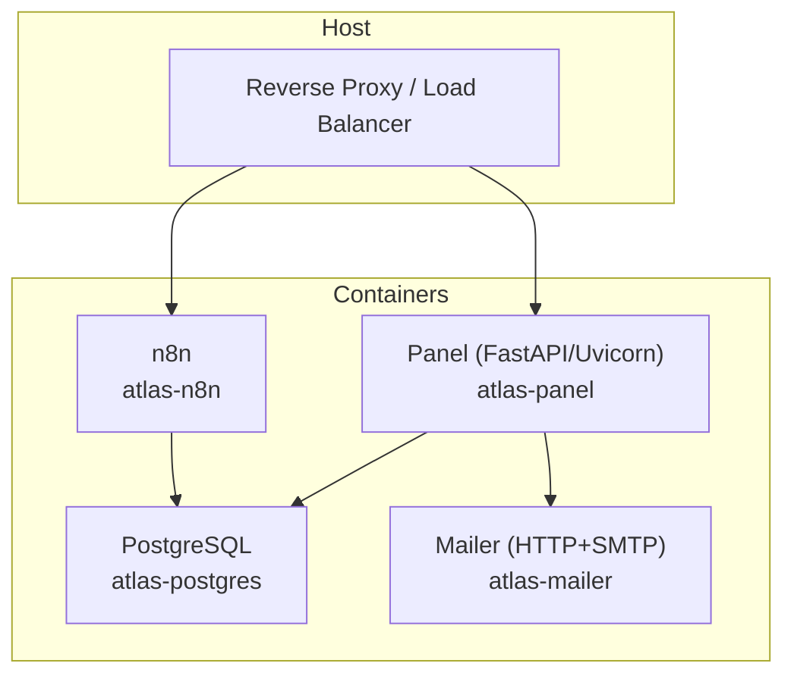
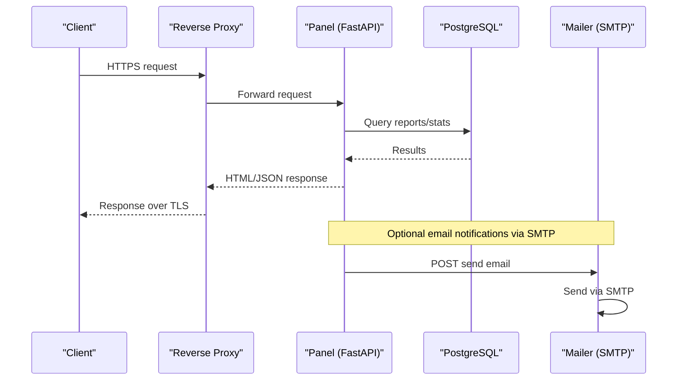
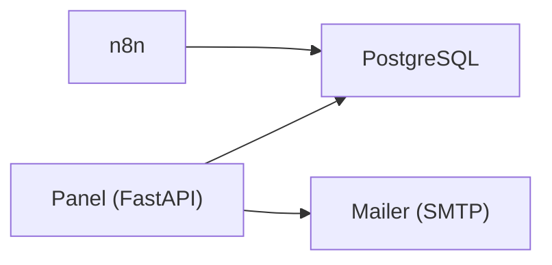

# Production Setup

<cite>
**Referenced Files in This Document**
- [docker-compose.yml](file://docker/docker-compose.yml)
- [Dockerfile](file://docker/panel/Dockerfile)
- [main.py](file://docker/panel/app/main.py)
- [config.py](file://docker/panel/app/config.py)
- [db.py](file://docker/panel/app/db.py)
- [queries.py](file://docker/panel/app/queries.py)
- [001_call_intelligence.sql](file://docker/postgres/init/001_call_intelligence.sql)
- [002_panel_seed.sql](file://docker/postgres/init/002_panel_seed.sql)
- [mailer.py](file://docker/mailer/mailer.py)
- [postgres.json](file://docker/n8n/credentials/postgres.json)
- [.gitignore](file://.gitignore)
</cite>

## Table of Contents
1. Introduction
2. Project Structure
3. Core Components
4. Architecture Overview
5. Detailed Component Analysis
6. Dependency Analysis
7. Performance Considerations
8. Troubleshooting Guide
9. Conclusion
10. Appendices

## Introduction
This document provides production deployment guidance for the Atlas Call Intelligence system, focusing on enterprise-grade setup procedures. It covers SSL/TLS configuration, reverse proxy hardening, network security, performance tuning, resource allocation, capacity planning, backup and disaster recovery, monitoring and alerting, load balancing, horizontal scaling, high availability, and security audit checklists with compliance considerations. The guidance is grounded in the repository’s Docker Compose services (PostgreSQL, n8n, Panel, Mailer), application code, and database schema.

## Project Structure
The production stack is defined by a single Docker Compose file that orchestrates:
- PostgreSQL database with initialization scripts and persistent volumes
- n8n workflow automation service connected to PostgreSQL
- FastAPI-based Panel web application served via Uvicorn
- Python HTTP mailer service for SMTP notifications

**Diagram sources**
- [docker-compose.yml:3-98](file://docker/docker-compose.yml#L3-L98)

**Section sources**
- [docker-compose.yml:3-98](file://docker/docker-compose.yml#L3-L98)

## Core Components
- PostgreSQL: Primary data store with health checks, persistent volume, and init scripts for schema and seed data.
- n8n: Workflow automation tool configured to use PostgreSQL; credentials stored in a JSON file.
- Panel: FastAPI application exposing HTML pages and APIs, with optional password protection and Jinja2 templates.
- Mailer: Lightweight HTTP server that sends emails via SMTP using environment variables.

Key runtime characteristics:
- Services are containerized and managed via Docker Compose.
- Environment-driven configuration for secrets and endpoints.
- Health checks ensure dependency readiness.

**Section sources**
- [docker-compose.yml:3-98](file://docker/docker-compose.yml#L3-L98)
- [Dockerfile:1-11](file://docker/panel/Dockerfile#L1-L11)
- [main.py:16-68](file://docker/panel/app/main.py#L16-L68)
- [config.py:1-14](file://docker/panel/app/config.py#L1-L14)
- [db.py:1-31](file://docker/panel/app/db.py#L1-L31)
- [queries.py:1-260](file://docker/panel/app/queries.py#L1-L260)
- [001_call_intelligence.sql:1-45](file://docker/postgres/init/001_call_intelligence.sql#L1-L45)
- [002_panel_seed.sql:1-46](file://docker/postgres/init/002_panel_seed.sql#L1-L46)
- [mailer.py:1-77](file://docker/mailer/mailer.py#L1-L77)
- [postgres.json:1-14](file://docker/n8n/credentials/postgres.json#L1-L14)

## Architecture Overview
The system exposes the Panel and n8n through a reverse proxy or load balancer. All outbound traffic from containers uses internal networking. Sensitive values are injected via environment variables. Database state persists to host-mounted volumes.

**Diagram sources**
- [docker-compose.yml:26-98](file://docker/docker-compose.yml#L26-L98)
- [main.py:71-189](file://docker/panel/app/main.py#L71-L189)
- [db.py:8-31](file://docker/panel/app/db.py#L8-L31)
- [mailer.py:18-33](file://docker/mailer/mailer.py#L18-L33)

## Detailed Component Analysis

### Reverse Proxy and SSL/TLS Configuration
- Terminate TLS at the reverse proxy (e.g., Nginx, Traefik, Caddy). Do not expose Panel or n8n directly to the internet.
- Enforce modern TLS settings (TLS 1.2+, strong ciphers, HSTS, OCSP stapling).
- Route paths:
  - /panel -> Panel service (container port 8080)
  - /n8n -> n8n service (container port 5678)
  - Optionally isolate admin endpoints behind IP allow-lists or additional auth.
- Ensure cookies set by Panel are secure and httponly; configure SameSite appropriately.

Operational notes:
- Keep internal ports bound only to localhost or Docker network where possible.
- Use separate domains or path-based routing per service.
- Validate upstream headers and timeouts for long-running requests.

[No sources needed since this section provides general guidance]

### Network Security Hardening
- Restrict exposed ports:
  - PostgreSQL should not be exposed to the public internet; if required, bind to localhost and use SSH tunnels or VPN.
  - Panel and n8n should only be reachable via the reverse proxy.
- Use least-privilege service accounts and minimal capabilities inside containers.
- Pin images and versions; scan images regularly for vulnerabilities.
- Store secrets in environment files or secret managers; never commit secrets to version control.
- Enable firewall rules to limit inbound access to the reverse proxy only.

**Section sources**
- [docker-compose.yml:13-14](file://docker/docker-compose.yml#L13-L14)
- [docker-compose.yml:31-32](file://docker/docker-compose.yml#L31-L32)
- [docker-compose.yml:68-69](file://docker/docker-compose.yml#L68-L69)
- [docker-compose.yml:84-85](file://docker/docker-compose.yml#L84-L85)
- [.gitignore:1-4](file://.gitignore#L1-L4)

### Performance Tuning Parameters
PostgreSQL:
- Tune shared_buffers, work_mem, maintenance_work_mem, effective_cache_size based on available RAM.
- Configure max_connections to match expected concurrency.
- Enable WAL archiving and tune checkpoint settings for write-heavy workloads.
- Use appropriate indexes; the schema includes several indexes for common queries.

Panel (Uvicorn):
- Run multiple worker processes aligned with CPU cores.
- Set appropriate request timeouts and keep-alive settings.
- Disable template caching in development; enable in production.

n8n:
- Allocate sufficient memory and CPU; consider process isolation for heavy workflows.
- Use external storage for large payloads if needed.

Mailer:
- Ensure SMTP timeout and retry logic are adequate for production loads.

**Section sources**
- [Dockerfile:8-10](file://docker/panel/Dockerfile#L8-L10)
- [001_call_intelligence.sql:29-45](file://docker/postgres/init/001_call_intelligence.sql#L29-L45)

### Resource Allocation Strategies
- Start with conservative allocations and monitor utilization:
  - PostgreSQL: 2–4 vCPUs, 4–8 GB RAM for small-to-medium deployments.
  - Panel: 1–2 vCPUs, 512 MB–1 GB RAM.
  - n8n: 2–4 vCPUs, 2–4 GB RAM depending on workflow complexity.
  - Mailer: minimal resources unless high throughput.
- Use container resource limits and requests to prevent noisy neighbor issues.
- Monitor disk I/O and database connection pools under load.

[No sources needed since this section provides general guidance]

### Capacity Planning Guidelines
- Estimate calls per minute/hour and average analysis payload size to size storage and bandwidth.
- Plan for growth in call_analyses table; consider partitioning by time if necessary.
- Size backups and retention policies according to compliance requirements.
- Plan for peak traffic spikes during campaigns or events; design auto-scaling around Panel and n8n.

[No sources needed since this section provides general guidance]

### Backup and Disaster Recovery
- Back up PostgreSQL continuously:
  - Use pg_basebackup or logical backups (pg_dump) scheduled frequently.
  - Archive WAL segments for point-in-time recovery.
- Persist volumes:
  - Postgres data directory must be backed up reliably.
  - n8n data directory contains workflows and credentials; back it up securely.
- Test restore procedures regularly and document RTO/RPO targets.
- Encrypt backups at rest and in transit; restrict access to backup storage.

**Section sources**
- [docker-compose.yml:16-18](file://docker/docker-compose.yml#L16-L18)
- [docker-compose.yml:55-56](file://docker/docker-compose.yml#L55-L56)

### Monitoring Setup and Alerting
- Container orchestration metrics:
  - Collect CPU, memory, disk, and network usage for each service.
- Application metrics:
  - Expose health endpoints and custom metrics from Panel and n8n.
- Database metrics:
  - Track connections, query latency, lock waits, and replication lag.
- Logging:
  - Centralize logs from all services; retain per retention policy.
- Alerting:
  - Define alerts for service down, high error rates, slow queries, disk full, and failed backups.

[No sources needed since this section provides general guidance]

### Load Balancing, Horizontal Scaling, and High Availability
- Panel:
  - Scale horizontally by running multiple instances behind a load balancer.
  - Ensure session affinity if needed; avoid sticky sessions when possible.
- n8n:
  - For high throughput, run multiple workers and distribute queues; consider external queue/backends if supported.
- PostgreSQL:
  - Use read replicas for read-heavy dashboards; route Panel reads to replicas where feasible.
  - Implement failover and automated switchover for primary.
- Reverse proxy:
  - Configure health checks and graceful failover across upstreams.

[No sources needed since this section provides general guidance]

### Security Audit Checklist and Compliance Considerations
- Secrets management:
  - Remove hardcoded passwords; use environment variables or secret stores.
  - Rotate API keys and SMTP credentials regularly.
- Access control:
  - Enforce authentication for Panel; consider stronger mechanisms beyond simple password.
  - Restrict n8n admin access and enforce role-based permissions.
- Data protection:
  - Enable TLS everywhere; enforce HTTPS-only.
  - Encrypt sensitive fields in the database if required by policy.
- Compliance:
  - Align with GDPR or local regulations for personal data handling.
  - Maintain audit logs for access and changes to sensitive data.
  - Perform regular vulnerability scans and penetration tests.

**Section sources**
- [config.py:3-13](file://docker/panel/app/config.py#L3-L13)
- [docker-compose.yml:8-11](file://docker/docker-compose.yml#L8-L11)
- [docker-compose.yml:34-53](file://docker/docker-compose.yml#L34-L53)
- [mailer.py:10-15](file://docker/mailer/mailer.py#L10-L15)
- [postgres.json:1-14](file://docker/n8n/credentials/postgres.json#L1-L14)
- [.gitignore:1-4](file://.gitignore#L1-L4)

## Dependency Analysis
The Panel depends on PostgreSQL for data and optionally on the Mailer for notifications. n8n depends on PostgreSQL for persistence. The Mailer depends on SMTP servers.

**Diagram sources**
- [docker-compose.yml:26-98](file://docker/docker-compose.yml#L26-L98)
- [db.py:1-31](file://docker/panel/app/db.py#L1-L31)
- [mailer.py:1-77](file://docker/mailer/mailer.py#L1-L77)

**Section sources**
- [docker-compose.yml:26-98](file://docker/docker-compose.yml#L26-L98)
- [db.py:1-31](file://docker/panel/app/db.py#L1-L31)
- [mailer.py:1-77](file://docker/mailer/mailer.py#L1-L77)

## Performance Considerations
- Prefer connection pooling for PostgreSQL in production (e.g., PgBouncer) to reduce overhead.
- Cache frequent dashboard queries at the application layer if appropriate.
- Optimize heavy SQL queries and add missing indexes based on observed access patterns.
- Tune Uvicorn workers and threads to match workload characteristics.
- Monitor n8n execution times and optimize workflows to minimize resource consumption.

[No sources needed since this section provides general guidance]

## Troubleshooting Guide
Common issues and resolutions:
- Panel login redirects unexpectedly:
  - If no panel password is set, the app redirects to root; set a strong password via environment variable.
- Authentication bypass risk:
  - The current middleware allows static assets without auth; ensure reverse proxy enforces TLS and access controls.
- Database connectivity failures:
  - Verify environment variables for DB_HOST, DB_PORT, DB_NAME, DB_USER, DB_PASSWORD.
  - Check PostgreSQL health and logs.
- Email sending failures:
  - Ensure SMTP_PASS is configured; verify SMTP_HOST, SMTP_PORT, and network egress.
- n8n cannot connect to PostgreSQL:
  - Confirm credentials in n8n config and that PostgreSQL is healthy and reachable.

**Section sources**
- [main.py:43-68](file://docker/panel/app/main.py#L43-L68)
- [config.py:3-13](file://docker/panel/app/config.py#L3-L13)
- [db.py:8-18](file://docker/panel/app/db.py#L8-L18)
- [mailer.py:18-33](file://docker/mailer/mailer.py#L18-L33)
- [docker-compose.yml:20-24](file://docker/docker-compose.yml#L20-L24)

## Conclusion
This production setup leverages Docker Compose to orchestrate PostgreSQL, n8n, Panel, and a Mailer service. For enterprise-grade operations, terminate TLS at a reverse proxy, harden network exposure, implement robust backups and monitoring, plan capacity and scaling strategies, and follow strict security practices. Regular audits and compliance checks will help maintain a secure and reliable production environment.

[No sources needed since this section summarizes without analyzing specific files]

## Appendices

### Appendix A: Service Endpoints and Ports
- Panel: HTTP 8080 (exposed via reverse proxy)
- n8n: HTTP 5678 (exposed via reverse proxy)
- PostgreSQL: Internal 5432 (not exposed publicly)
- Mailer: HTTP 8765 (internal or proxied)

**Section sources**
- [docker-compose.yml:13-14](file://docker/docker-compose.yml#L13-L14)
- [docker-compose.yml:31-32](file://docker/docker-compose.yml#L31-L32)
- [docker-compose.yml:68-69](file://docker/docker-compose.yml#L68-L69)
- [docker-compose.yml:84-85](file://docker/docker-compose.yml#L84-L85)

### Appendix B: Database Schema Highlights
- call_analyses: Stores per-call AI analysis with indexed columns for efficient reporting.
- monthly_reports: Aggregated monthly metrics with unique constraints per month and department.

**Section sources**
- [001_call_intelligence.sql:4-45](file://docker/postgres/init/001_call_intelligence.sql#L4-L45)

### Appendix C: Seed Data
- Sample records for demo purposes can be loaded into PostgreSQL using the provided seed script.

**Section sources**
- [002_panel_seed.sql:1-46](file://docker/postgres/init/002_panel_seed.sql#L1-L46)