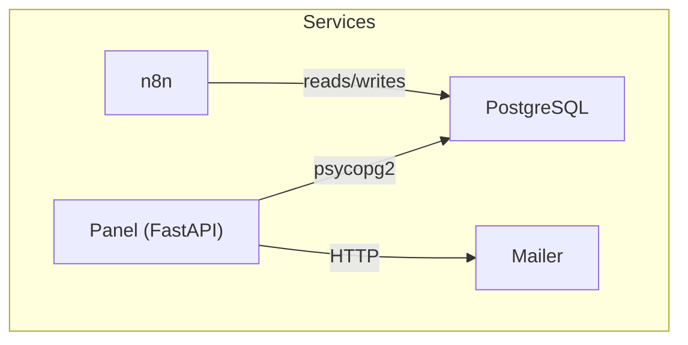
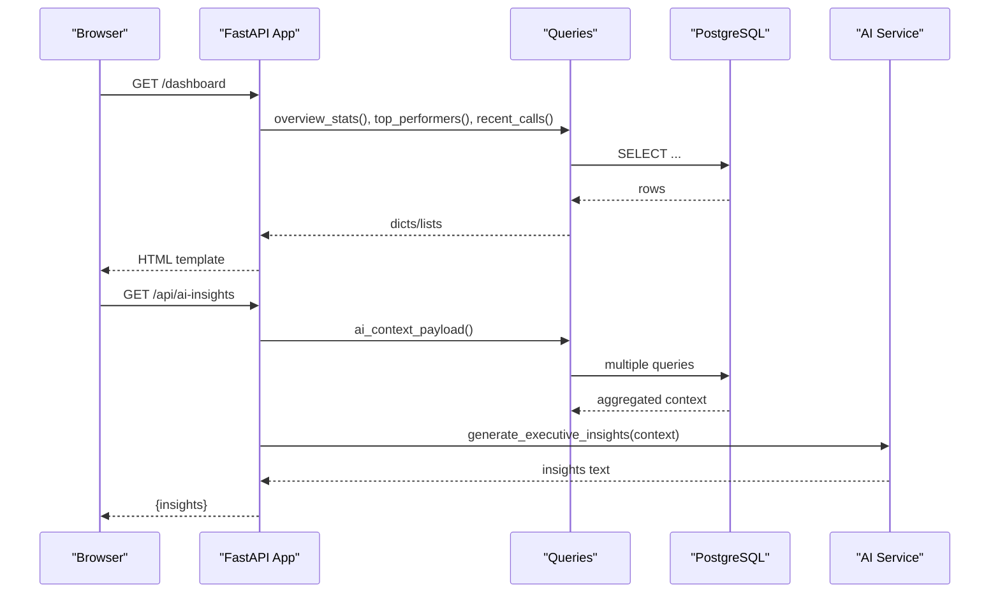
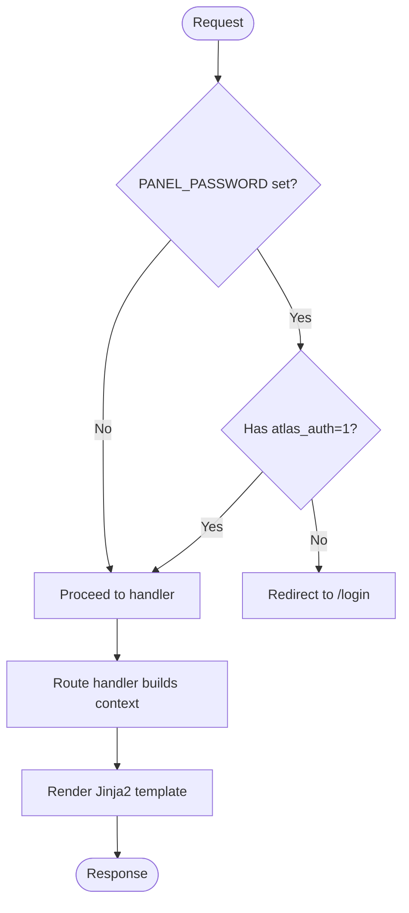
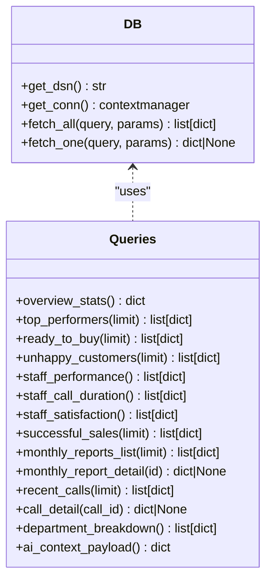
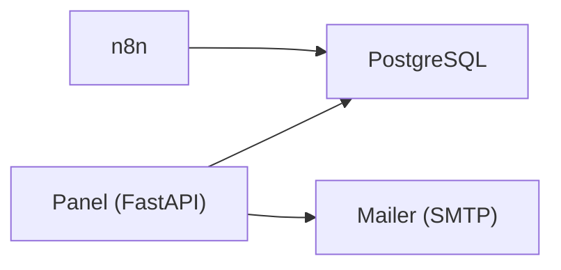

# Development Guide

<cite>
**Referenced Files in This Document**
- [README.md](file://README.md)
- [docker-compose.yml](file://docker/docker-compose.yml)
- [main.py](file://docker/panel/app/main.py)
- [config.py](file://docker/panel/app/config.py)
- [db.py](file://docker/panel/app/db.py)
- [queries.py](file://docker/panel/app/queries.py)
- [001_call_intelligence.sql](file://docker/postgres/init/001_call_intelligence.sql)
- [002_panel_seed.sql](file://docker/postgres/init/002_panel_seed.sql)
- [Dockerfile](file://docker/panel/Dockerfile)
- [requirements.txt](file://docker/panel/requirements.txt)
- [mailer.py](file://docker/mailer/mailer.py)
</cite>

## Table of Contents
1. [Introduction](#introduction)
2. [Project Structure](#project-structure)
3. [Core Components](#core-components)
4. [Architecture Overview](#architecture-overview)
5. [Detailed Component Analysis](#detailed-component-analysis)
6. [Dependency Analysis](#dependency-analysis)
7. [Performance Considerations](#performance-considerations)
8. [Troubleshooting Guide](#troubleshooting-guide)
9. [Conclusion](#conclusion)
10. [Appendices](#appendices)

## Introduction
This guide explains how to set up and contribute to the Atlas platform for local development. It covers environment configuration, code organization, testing approaches, debugging techniques, and guidelines for extending functionality such as adding workflow nodes or custom dashboard views. The panel is a FastAPI application that serves HTML templates backed by PostgreSQL, with optional integrations like n8n workflows and an email service.

## Project Structure
The repository organizes services under docker/:
- postgres: database image with initialization scripts
- panel: FastAPI web app (templates, static assets, Python package)
- mailer: simple HTTP SMTP sender
- n8n: workflow automation server (optional)
- scripts: helper scripts for tests and demos

Key entry points:
- docker-compose.yml orchestrates services
- panel app main module defines routes and middleware
- SQL init scripts define schema and seed data

**Diagram sources**
- [docker-compose.yml:1-98](file://docker/docker-compose.yml#L1-L98)
- [main.py:1-187](file://docker/panel/app/main.py#L1-L187)
- [db.py:1-31](file://docker/panel/app/db.py#L1-L31)
- [mailer.py:1-77](file://docker/mailer/mailer.py#L1-L77)

**Section sources**
- [docker-compose.yml:1-98](file://docker/docker-compose.yml#L1-L98)
- [README.md:1-7](file://README.md#L1-L7)

## Core Components
- Panel API and UI: FastAPI app serving Jinja2 templates and JSON APIs
- Database layer: psycopg2 connection manager and query helpers
- Queries: report functions over call_analyses and monthly_reports
- Mailer: HTTP endpoint to send emails via SMTP
- Orchestration: Docker Compose configures Postgres, n8n, mailer, and panel

Development setup highlights:
- Start all services with Docker Compose
- Configure environment variables for DB, AI, and panel auth
- Access panel at port 8080, Postgres at 5432, n8n at 5678, mailer at 8765

**Section sources**
- [docker-compose.yml:1-98](file://docker/docker-compose.yml#L1-L98)
- [main.py:1-187](file://docker/panel/app/main.py#L1-L187)
- [db.py:1-31](file://docker/panel/app/db.py#L1-L31)
- [queries.py:1-260](file://docker/panel/app/queries.py#L1-L260)
- [mailer.py:1-77](file://docker/mailer/mailer.py#L1-L77)

## Architecture Overview
The panel exposes endpoints for dashboards and details, renders templates, and fetches data from PostgreSQL. Optional AI insights are generated via an external service using configured keys and model names.

**Diagram sources**
- [main.py:68-187](file://docker/panel/app/main.py#L68-L187)
- [queries.py:6-260](file://docker/panel/app/queries.py#L6-L260)
- [db.py:12-31](file://docker/panel/app/db.py#L12-L31)

## Detailed Component Analysis

### Panel Application (FastAPI)
Responsibilities:
- Define routes for dashboards and detail pages
- Apply authentication middleware when PANEL_PASSWORD is set
- Mount static files and configure Jinja2 globals
- Expose JSON endpoints for stats and AI insights

Authentication flow:
- If PANEL_PASSWORD is set, requests must include a session cookie; otherwise redirect to login
- Login POST validates password and sets a secure cookie

Template rendering:
- Each route returns a TemplateResponse with context built from queries

API endpoints:
- GET /api/stats returns overview statistics
- GET /api/ai-insights returns AI-generated insights based on current data context

**Diagram sources**
- [main.py:40-66](file://docker/panel/app/main.py#L40-L66)
- [main.py:68-187](file://docker/panel/app/main.py#L68-L187)

**Section sources**
- [main.py:1-187](file://docker/panel/app/main.py#L1-L187)

### Configuration and Environment
Environment-driven settings:
- Database host, port, name, user, password
- AI API key and model
- Panel title and optional password

Best practices:
- Use .env or compose env overrides for secrets
- Avoid hardcoding credentials in code

**Section sources**
- [config.py:1-14](file://docker/panel/app/config.py#L1-L14)
- [docker-compose.yml:80-98](file://docker/docker-compose.yml#L80-L98)

### Database Layer and Schema
Database access:
- Connection string built from config
- Context manager ensures connections are closed
- Helpers return lists/dicts for easy templating

Schema:
- call_analyses stores per-call AI analysis and metrics
- monthly_reports stores aggregated reports
- Seed script provides sample data for demo

Migrations:
- Place new migration scripts under docker/postgres/init with numeric prefixes to ensure ordering
- Ensure idempotency with IF NOT EXISTS and ON CONFLICT clauses

**Diagram sources**
- [db.py:1-31](file://docker/panel/app/db.py#L1-L31)
- [queries.py:1-260](file://docker/panel/app/queries.py#L1-L260)

**Section sources**
- [db.py:1-31](file://docker/panel/app/db.py#L1-L31)
- [queries.py:1-260](file://docker/panel/app/queries.py#L1-L260)
- [001_call_intelligence.sql:1-45](file://docker/postgres/init/001_call_intelligence.sql#L1-L45)
- [002_panel_seed.sql:1-46](file://docker/postgres/init/002_panel_seed.sql#L1-L46)

### Email Service (Mailer)
Purpose:
- HTTP endpoint to send emails via SMTP
- Accepts JSON payload with recipient, subject, body

Usage:
- POST /send or / with JSON body
- Configured via environment variables

Error handling:
- Returns appropriate status codes and error messages for invalid input or SMTP failures

**Section sources**
- [mailer.py:1-77](file://docker/mailer/mailer.py#L1-L77)

### Templates and Static Assets
- Templates live under docker/panel/templates
- Static assets under docker/panel/static
- Extend base template for consistent layout
- Add new views by creating a template and corresponding route

Guidelines:
- Keep templates focused on presentation
- Move business logic to queries and handlers
- Use Jinja2 globals for shared utilities

**Section sources**
- [main.py:13-33](file://docker/panel/app/main.py#L13-L33)

## Dependency Analysis
Service dependencies:
- Panel depends on PostgreSQL and optionally on AI service and mailer
- n8n depends on PostgreSQL
- Mailer depends on SMTP provider

Runtime coupling:
- Panel uses psycopg2 for direct DB access
- Queries encapsulate SQL to improve cohesion
- Middleware centralizes auth behavior

**Diagram sources**
- [docker-compose.yml:1-98](file://docker/docker-compose.yml#L1-L98)
- [main.py:1-187](file://docker/panel/app/main.py#L1-L187)
- [db.py:1-31](file://docker/panel/app/db.py#L1-L31)
- [mailer.py:1-77](file://docker/mailer/mailer.py#L1-L77)

**Section sources**
- [docker-compose.yml:1-98](file://docker/docker-compose.yml#L1-L98)

## Performance Considerations
- Prefer parameterized queries to avoid injection and leverage plan caching
- Index usage: schema includes indexes on frequently filtered columns
- Limit result sets in queries to reduce memory and render time
- Cache expensive computations if needed (e.g., AI insights)
- Monitor Postgres performance and adjust indexes as queries evolve

[No sources needed since this section provides general guidance]

## Troubleshooting Guide
Common issues and resolutions:
- Cannot connect to database: verify DB_HOST, DB_PORT, DB_NAME, DB_USER, DB_PASSWORD and that Postgres is healthy
- Panel redirects to login unexpectedly: ensure PANEL_PASSWORD is set appropriately or clear cookies
- Missing data in dashboards: run seed script to populate sample data
- Mailer not sending: check SMTP_HOST, SMTP_PORT, SMTP_USER, SMTP_PASS, and network connectivity

Debugging tips:
- Inspect container logs for each service
- Validate environment variables in docker-compose
- Test queries directly against Postgres using psql
- Use browser dev tools to inspect network responses for JSON endpoints

**Section sources**
- [docker-compose.yml:1-98](file://docker/docker-compose.yml#L1-L98)
- [002_panel_seed.sql:1-46](file://docker/postgres/init/002_panel_seed.sql#L1-L46)
- [mailer.py:18-68](file://docker/mailer/mailer.py#L18-L68)

## Conclusion
Atlas’s panel provides a straightforward FastAPI-based dashboard with robust reporting over call analyses. The modular structure separates concerns across routing, queries, and database access, making it easier to extend features, add new views, and integrate additional services. Follow the guidelines here to develop locally, test changes, and maintain quality.

[No sources needed since this section summarizes without analyzing specific files]

## Appendices

### Local Development Setup
Steps:
- Ensure Docker and Docker Compose are installed
- Copy or create environment variables for DB, AI, and panel settings
- Start services: docker compose up -d
- Access:
  - Panel: http://localhost:8080
  - Postgres: localhost:5432
  - n8n: http://localhost:5678
  - Mailer: http://localhost:8765

Seeding data:
- Run the seed script against Postgres to populate demo data

**Section sources**
- [docker-compose.yml:1-98](file://docker/docker-compose.yml#L1-L98)
- [002_panel_seed.sql:1-46](file://docker/postgres/init/002_panel_seed.sql#L1-L46)

### Adding a New Dashboard View
To add a new page:
- Create a new template under docker/panel/templates
- Add a route in the main module returning a TemplateResponse with context from queries
- Optionally add a new query function in queries.py
- Link from the base template navigation

Example references:
- Route pattern and context building
- Query functions returning lists/dicts for templates

**Section sources**
- [main.py:68-187](file://docker/panel/app/main.py#L68-L187)
- [queries.py:6-260](file://docker/panel/app/queries.py#L6-L260)

### Creating a Custom API Endpoint
To expose a new JSON endpoint:
- Add a route in the main module
- Implement or reuse query functions to fetch data
- Return a dict or list as response

References:
- Existing JSON endpoints for stats and AI insights

**Section sources**
- [main.py:166-187](file://docker/panel/app/main.py#L166-L187)
- [queries.py:6-260](file://docker/panel/app/queries.py#L6-L260)

### Database Migrations
Guidelines:
- Place new SQL files under docker/postgres/init with numeric prefixes
- Use IF NOT EXISTS and ON CONFLICT for idempotent migrations
- Test migrations locally before pushing

References:
- Existing schema and seed scripts

**Section sources**
- [001_call_intelligence.sql:1-45](file://docker/postgres/init/001_call_intelligence.sql#L1-L45)
- [002_panel_seed.sql:1-46](file://docker/postgres/init/002_panel_seed.sql#L1-L46)

### Testing Procedures
Approach:
- Unit tests: validate query results against known datasets
- Integration tests: start containers, run migrations, execute queries, assert outputs
- E2E tests: hit panel endpoints and assert rendered content or JSON payloads

Tools:
- Use pytest for Python tests
- Use httpx or requests for HTTP calls to panel and mailer
- Use subprocess or testcontainers to manage Postgres during tests

[No sources needed since this section provides general guidance]

### Code Review Checklist
- Routes are thin; logic resides in queries and services
- All DB interactions use parameterized queries
- Error handling returns appropriate status codes and messages
- Templates do not contain business logic
- Environment variables are used for secrets
- Changes are backward compatible with existing schemas

[No sources needed since this section provides general guidance]

### Extending Workflow Nodes (n8n)
Guidelines:
- Place custom node definitions under docker/n8n/data/nodes
- Package and register nodes following n8n conventions
- Ensure credentials and secrets are passed via environment variables

References:
- n8n service configuration and volumes

**Section sources**
- [docker-compose.yml:26-61](file://docker/docker-compose.yml#L26-L61)

### Building and Running Locally Without Docker
For local development outside containers:
- Install Python 3.12+ and required packages
- Set environment variables for DB and panel
- Run uvicorn pointing to the main module

References:
- Dependencies and command in Dockerfile

**Section sources**
- [requirements.txt:1-7](file://docker/panel/requirements.txt#L1-L7)
- [Dockerfile:1-11](file://docker/panel/Dockerfile#L1-L11)