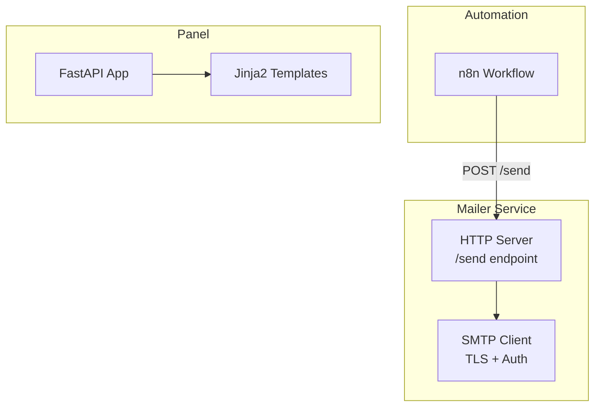
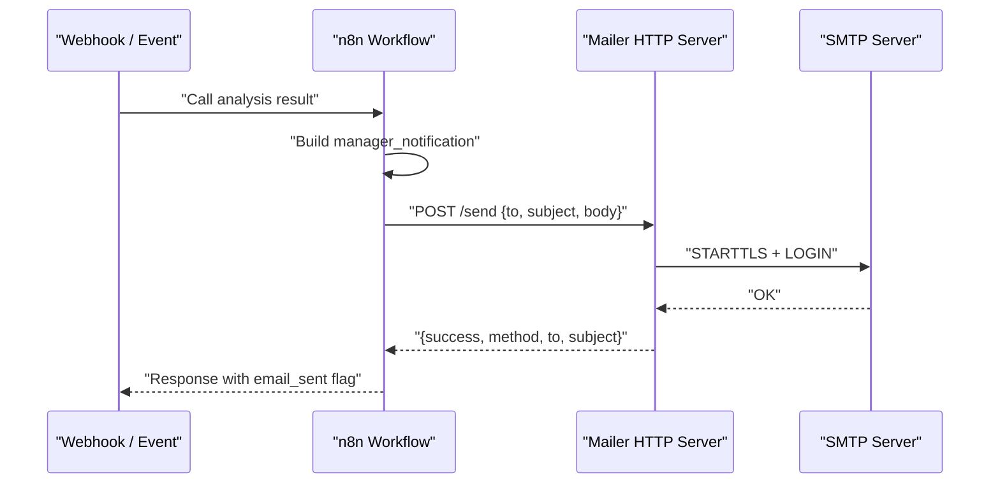
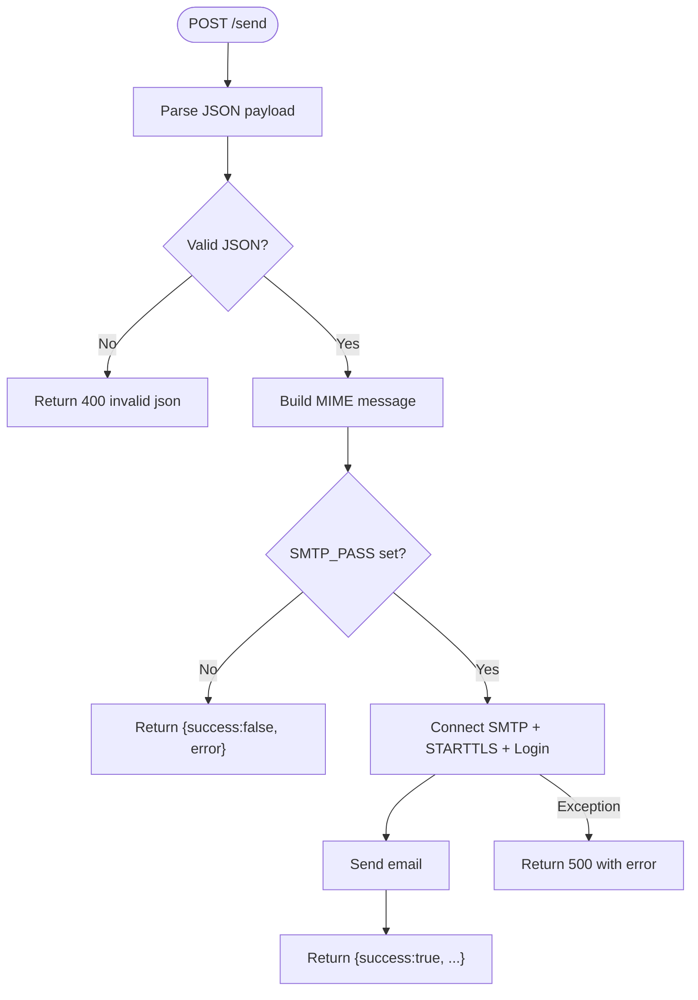
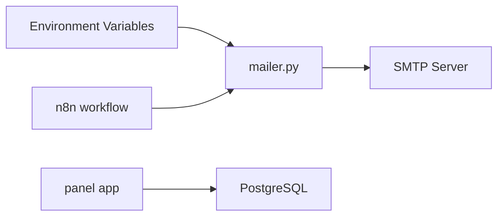

# Email Notification System

<cite>
**Referenced Files in This Document**
- [mailer.py](file://docker/mailer/mailer.py)
- [send_email.py](file://docker/mailer/send_email.py)
- [docker-compose.yml](file://docker/docker-compose.yml)
- [atlas-call-intelligence-v1.json](file://docker/n8n/workflows/atlas-call-intelligence-v1.json)
- [base.html](file://docker/panel/templates/base.html)
- [dashboard.html](file://docker/panel/templates/dashboard.html)
- [monthly_reports.html](file://docker/panel/templates/monthly_reports.html)
- [call_detail.html](file://docker/panel/templates/call_detail.html)
- [config.py](file://docker/panel/app/config.py)
- [main.py](file://docker/panel/app/main.py)
</cite>

## Table of Contents
1. [Introduction](#introduction)
2. [Project Structure](#project-structure)
3. [Core Components](#core-components)
4. [Architecture Overview](#architecture-overview)
5. [Detailed Component Analysis](#detailed-component-analysis)
6. [Dependency Analysis](#dependency-analysis)
7. [Performance Considerations](#performance-considerations)
8. [Troubleshooting Guide](#troubleshooting-guide)
9. [Conclusion](#conclusion)
10. [Appendices](#appendices)

## Introduction
This document explains the email notification system used by Atlas Call Intelligence. It covers SMTP configuration, template management for the web panel, automated alerting via n8n workflows, and best practices for sending, testing, and troubleshooting emails. The system uses a lightweight HTTP mailer service that sends plain-text emails over SMTP (TLS), triggered by workflow automation when call analysis results or system events occur.

## Project Structure
The email-related components are organized as follows:
- Mailer service: Python HTTP server exposing an endpoint to send emails via SMTP.
- Workflow automation: n8n workflow that triggers email sending after call analysis.
- Panel templates: Jinja2 HTML templates used by the web panel (not directly used by the mailer).
- Docker Compose: Service definitions and environment variables for SMTP and mailer configuration.

**Diagram sources**
- [docker-compose.yml:62-79](file://docker/docker-compose.yml#L62-L79)
- [atlas-call-intelligence-v1.json:106-119](file://docker/n8n/workflows/atlas-call-intelligence-v1.json#L106-L119)
- [mailer.py:36-68](file://docker/mailer/mailer.py#L36-L68)
- [main.py:13-17](file://docker/panel/app/main.py#L13-L17)

**Section sources**
- [docker-compose.yml:62-79](file://docker/docker-compose.yml#L62-L79)
- [atlas-call-intelligence-v1.json:106-119](file://docker/n8n/workflows/atlas-call-intelligence-v1.json#L106-L119)
- [mailer.py:36-68](file://docker/mailer/mailer.py#L36-L68)
- [main.py:13-17](file://docker/panel/app/main.py#L13-L17)

## Core Components
- Mailer HTTP service: Exposes a POST endpoint to accept JSON payloads with recipient, subject, and body. It connects to an SMTP server using TLS and authentication configured via environment variables.
- CLI helper: A standalone script to send test emails via SMTP using environment variables.
- n8n workflow integration: After call analysis is saved, the workflow calls the mailer’s /send endpoint to notify managers based on computed fields.
- Panel templates: Jinja2-based HTML templates for the management panel; they demonstrate dynamic content rendering patterns applicable to future email templates if needed.

Key responsibilities:
- SMTP configuration and connection lifecycle
- Request parsing and validation
- Error handling and status codes
- Environment-driven configuration

**Section sources**
- [mailer.py:10-33](file://docker/mailer/mailer.py#L10-L33)
- [send_email.py:9-34](file://docker/mailer/send_email.py#L9-L34)
- [atlas-call-intelligence-v1.json:106-119](file://docker/n8n/workflows/atlas-call-intelligence-v1.json#L106-L119)
- [main.py:13-17](file://docker/panel/app/main.py#L13-L17)

## Architecture Overview
The system integrates three layers:
- Automation layer (n8n): Orchestrates data processing and decides when to send notifications.
- Mailer service: Stateless HTTP API that sends emails via SMTP.
- Data and UI layer: Panel renders dashboards and details from the database using Jinja2 templates.

**Diagram sources**
- [atlas-call-intelligence-v1.json:106-119](file://docker/n8n/workflows/atlas-call-intelligence-v1.json#L106-L119)
- [mailer.py:36-68](file://docker/mailer/mailer.py#L36-L68)
- [mailer.py:18-33](file://docker/mailer/mailer.py#L18-L33)

## Detailed Component Analysis

### Mailer HTTP Service
Responsibilities:
- Accepts JSON requests at /send with fields to, subject, and body (or message).
- Validates required credentials (SMTP_PASS must be set).
- Builds MIME messages and sends via SMTP with TLS.
- Returns structured JSON responses with success/failure and error details.

Configuration:
- SMTP_HOST, SMTP_PORT, SMTP_USER, SMTP_PASS, ATLAS_MANAGER_EMAIL, MAILER_PORT are read from environment variables.
- Default recipient falls back to ATLAS_MANAGER_EMAIL if not provided.

Error handling:
- Invalid JSON returns 400.
- Missing SMTP_PASS returns failure response without attempting SMTP.
- Exceptions during SMTP operations return 500 with error details.

**Diagram sources**
- [mailer.py:36-68](file://docker/mailer/mailer.py#L36-L68)
- [mailer.py:18-33](file://docker/mailer/mailer.py#L18-L33)

**Section sources**
- [mailer.py:10-33](file://docker/mailer/mailer.py#L10-L33)
- [mailer.py:36-68](file://docker/mailer/mailer.py#L36-L68)

### CLI Test Script
Purpose:
- Quick way to send a test email via SMTP using command-line arguments or environment variables.
- Useful for validating SMTP connectivity and credentials outside the HTTP service.

Behavior:
- Reads recipient, subject, and optional body file path from arguments or environment.
- Requires SMTP_PASS to be set; otherwise exits with an error.
- Uses SMTP with TLS and prints confirmation on success.

**Section sources**
- [send_email.py:9-34](file://docker/mailer/send_email.py#L9-L34)

### n8n Workflow Integration
Integration points:
- After saving analysis results, the workflow constructs a manager_notification object containing to, subject, and body.
- An HTTP request node posts this payload to http://host.docker.internal:8765/send.
- The workflow continues even if email sending fails (continueOnFail enabled), capturing email_sent and email_error in the final response.

Best practices observed:
- Use continueOnFail to avoid breaking the main flow due to transient email issues.
- Capture email delivery status for observability and downstream actions.

**Section sources**
- [atlas-call-intelligence-v1.json:106-119](file://docker/n8n/workflows/atlas-call-intelligence-v1.json#L106-L119)
- [atlas-call-intelligence-v1.json:122-129](file://docker/n8n/workflows/atlas-call-intelligence-v1.json#L122-L129)

### Panel Template System (Jinja2)
While the mailer currently sends plain text, the panel demonstrates robust template usage:
- Base template defines layout, navigation, and global helpers.
- Pages extend base and inject dynamic data (e.g., stats, recent calls).
- Global functions and variables are registered for consistent rendering.

Relevance to email templates:
- If HTML emails are introduced later, similar templating principles can apply: shared layouts, reusable blocks, and context-driven content.

**Section sources**
- [main.py:13-17](file://docker/panel/app/main.py#L13-L17)
- [base.html:1-46](file://docker/panel/templates/base.html#L1-L46)
- [dashboard.html:1-81](file://docker/panel/templates/dashboard.html#L1-L81)
- [monthly_reports.html:1-23](file://docker/panel/templates/monthly_reports.html#L1-L23)
- [call_detail.html:1-29](file://docker/panel/templates/call_detail.html#L1-L29)

## Dependency Analysis
Service dependencies and runtime configuration:
- Mailer depends on environment variables for SMTP settings and listens on a configurable port.
- n8n workflow depends on network reachability to the mailer service within Docker.
- Panel app depends on PostgreSQL and optionally a password for simple auth.

**Diagram sources**
- [docker-compose.yml:62-79](file://docker/docker-compose.yml#L62-L79)
- [docker-compose.yml:80-98](file://docker/docker-compose.yml#L80-L98)
- [mailer.py:10-15](file://docker/mailer/mailer.py#L10-L15)

**Section sources**
- [docker-compose.yml:62-79](file://docker/docker-compose.yml#L62-L79)
- [docker-compose.yml:80-98](file://docker/docker-compose.yml#L80-L98)
- [config.py:1-14](file://docker/panel/app/config.py#L1-L14)

## Performance Considerations
- SMTP connection reuse: The current implementation opens a new SMTP connection per email. For high volume, consider connection pooling or batching to reduce handshake overhead.
- Timeouts: SMTP timeout is set; ensure it aligns with expected network conditions.
- Payload size: Current implementation sends plain text only; large bodies may impact performance. Consider chunking or external storage links for large content.
- Concurrency: The HTTP server is single-process; under load, consider running multiple workers or scaling horizontally behind a reverse proxy.

[No sources needed since this section provides general guidance]

## Troubleshooting Guide
Common issues and resolutions:
- SMTP_PASS not configured:
  - Symptom: Mailer returns failure indicating missing password.
  - Resolution: Set SMTP_PASS in environment variables for the mailer service.
- Invalid JSON payload:
  - Symptom: 400 response with error message.
  - Resolution: Ensure the request body contains valid JSON with at least one of to, subject, and body/message.
- SMTP connection failures:
  - Symptom: 500 response with exception details.
  - Resolution: Verify SMTP_HOST, SMTP_PORT, SMTP_USER, and SMTP_PASS; check firewall and TLS requirements.
- Network reachability from n8n:
  - Symptom: Workflow cannot reach mailer endpoint.
  - Resolution: Confirm host.docker.internal resolves correctly and port 8765 is exposed and accessible.

Operational checks:
- Use the CLI script to validate SMTP connectivity independently of the HTTP service.
- Inspect mailer logs for request and error details.
- In n8n, review execution logs to confirm manager_notification construction and HTTP request outcomes.

**Section sources**
- [mailer.py:18-33](file://docker/mailer/mailer.py#L18-L33)
- [mailer.py:36-68](file://docker/mailer/mailer.py#L36-L68)
- [send_email.py:9-34](file://docker/mailer/send_email.py#L9-L34)
- [atlas-call-intelligence-v1.json:106-119](file://docker/n8n/workflows/atlas-call-intelligence-v1.json#L106-L119)

## Conclusion
The email notification system provides a simple, reliable mechanism to send alerts based on call analysis results. It separates concerns between automation (n8n), delivery (mailer), and presentation (panel templates). With environment-driven SMTP configuration and clear error signaling, it supports operational monitoring and iterative improvements such as adding HTML templates, attachments, and retry logic.

[No sources needed since this section summarizes without analyzing specific files]

## Appendices

### SMTP Configuration Reference
- SMTP_HOST: SMTP server hostname (default Yahoo SMTP).
- SMTP_PORT: SMTP port (default 587).
- SMTP_USER: Sender address.
- SMTP_PASS: Password or app-specific token for authentication.
- ATLAS_MANAGER_EMAIL: Fallback recipient if none provided in request.
- MAILER_PORT: Port the mailer HTTP server listens on (default 8765).

These variables are consumed by both the mailer service and the CLI script.

**Section sources**
- [mailer.py:10-15](file://docker/mailer/mailer.py#L10-L15)
- [send_email.py:14-17](file://docker/mailer/send_email.py#L14-L17)
- [docker-compose.yml:70-76](file://docker/docker-compose.yml#L70-L76)

### Email Sending Patterns
- Plain text emails: Current implementation sends UTF-8 plain text.
- Dynamic content: Constructed in the workflow before calling the mailer; include key metrics, call IDs, and links to details in the panel.
- Attachments: Not implemented in the current mailer; would require extending MIME multipart handling and adjusting the HTTP API to support file uploads or references.

**Section sources**
- [mailer.py:18-33](file://docker/mailer/mailer.py#L18-L33)
- [atlas-call-intelligence-v1.json:106-119](file://docker/n8n/workflows/atlas-call-intelligence-v1.json#L106-L119)

### Creating Custom Email Templates
- For plain text: Compose strings in the workflow with placeholders for dynamic values (e.g., call_id, scores, links).
- For HTML (future enhancement): Extend the mailer to render Jinja2 templates similarly to the panel, passing context objects to produce formatted HTML emails.

**Section sources**
- [main.py:13-17](file://docker/panel/app/main.py#L13-L17)
- [base.html:1-46](file://docker/panel/templates/base.html#L1-L46)

### Testing Procedures
- End-to-end: Trigger the n8n workflow with sample call data and verify email receipt.
- SMTP-only: Run the CLI script to isolate SMTP connectivity and authentication.
- HTTP-only: Send a POST to /send with minimal payload to validate the mailer service behavior.

**Section sources**
- [send_email.py:9-34](file://docker/mailer/send_email.py#L9-L34)
- [mailer.py:36-68](file://docker/mailer/mailer.py#L36-L68)
- [atlas-call-intelligence-v1.json:106-119](file://docker/n8n/workflows/atlas-call-intelligence-v1.json#L106-L119)

### Delivery Monitoring and Logging
- Mailer logs: Requests and errors are printed to stdout; inspect container logs for detailed traces.
- Workflow logs: Review n8n execution history to see manager_notification contents and HTTP response from the mailer.
- Response flags: Use email_sent and email_error fields returned by the workflow to drive follow-up actions or alerts.

**Section sources**
- [mailer.py:70-71](file://docker/mailer/mailer.py#L70-L71)
- [atlas-call-intelligence-v1.json:122-129](file://docker/n8n/workflows/atlas-call-intelligence-v1.json#L122-L129)