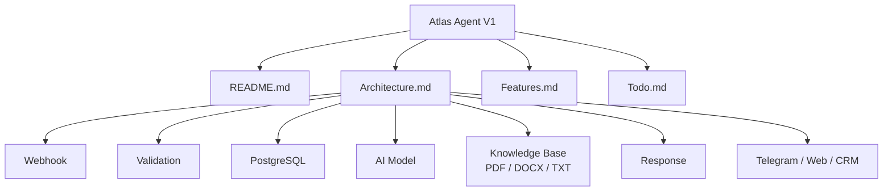
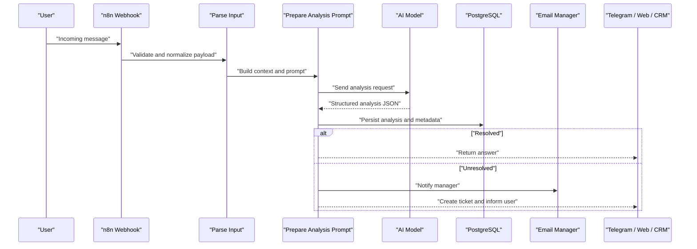
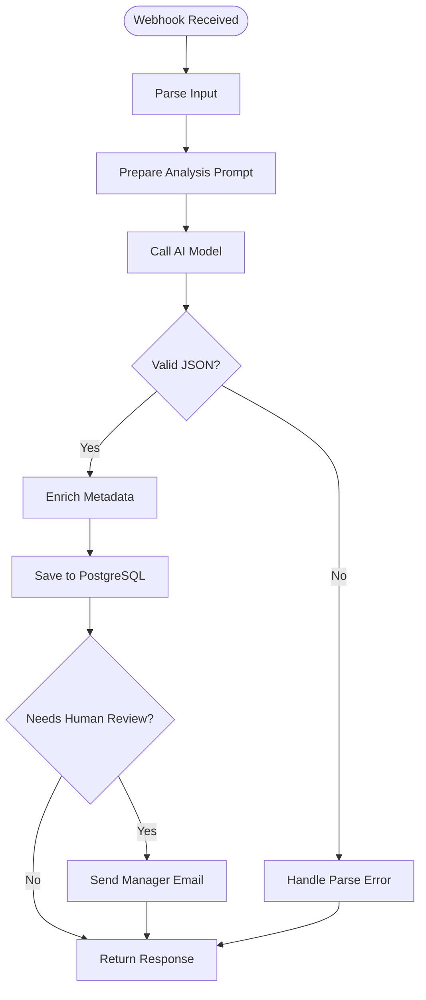
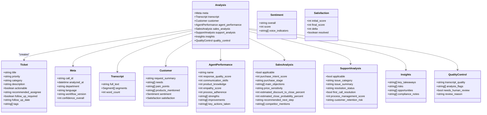
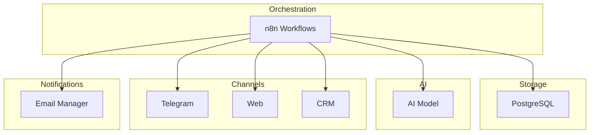

# Atlas Agent

<cite>
**Referenced Files in This Document**
- [README.md](file://03_Products/Atlas Agent/V1/README.md)
- [Architecture.md](file://03_Products/Atlas Agent/V1/Architecture.md)
- [Features.md](file://03_Products/Atlas Agent/V1/Features.md)
- [Todo.md](file://03_Products/Atlas Agent/V1/Todo.md)
- [atlas-call-intelligence-v1.json](file://docker/n8n/workflows/atlas-call-intelligence-v1.json)
- [schema.json](file://03_Products/Atlas Call Intelligence/V1/schema.json)
- [Mission.md](file://00_Company/Mission.md)
- [Services.md](file://00_Company/Services.md)
</cite>

## Table of Contents
1. [Introduction](#introduction)
2. [Project Structure](#project-structure)
3. [Core Components](#core-components)
4. [Architecture Overview](#architecture-overview)
5. [Detailed Component Analysis](#detailed-component-analysis)
6. [Dependency Analysis](#dependency-analysis)
7. [Performance Considerations](#performance-considerations)
8. [Troubleshooting Guide](#troubleshooting-guide)
9. [Conclusion](#conclusion)
10. [Appendices](#appendices)

## Introduction
Atlas Agent is an AI-powered customer support automation product designed to answer user questions from company documentation and create tickets when answers are not found. It targets software companies and accounting firms, aiming to reduce repetitive support workload and improve response quality. The MVP focuses on responding from PDF, Word, and text sources, with Telegram connectivity as a channel.

The agent’s purpose aligns with the company mission to eliminate repetitive work using AI and automation, and it fits within the broader service portfolio including AI agents, chatbots, workflow automation, CRM automation, and customer support automation.

**Section sources**
- [README.md:1-79](file://03_Products/Atlas Agent/V1/README.md#L1-L79)
- [Mission.md:1-23](file://00_Company/Mission.md#L1-L23)
- [Services.md:1-17](file://00_Company/Services.md#L1-L17)

## Project Structure
The Atlas Agent V1 documentation is organized into four core files that define purpose, architecture, features, and tasks:
- README: Product goal, problem statement, solution approach, MVP scope, and status
- Architecture: Data flow, services, and integration points
- Features: Versioned feature roadmap across 0.1 to 1.0
- Todo: Sprint tasks for setup, n8n workflows, webhooks, AI, and document connectors

**Diagram sources**
- [Architecture.md:17-64](file://03_Products/Atlas Agent/V1/Architecture.md#L17-L64)

**Section sources**
- [README.md:1-79](file://03_Products/Atlas Agent/V1/README.md#L1-L79)
- [Architecture.md:1-97](file://03_Products/Atlas Agent/V1/Architecture.md#L1-L97)
- [Features.md:1-67](file://03_Products/Atlas Agent/V1/Features.md#L1-L67)
- [Todo.md:1-25](file://03_Products/Atlas Agent/V1/Todo.md#L1-L25)

## Core Components
- Agent configuration: Defines how the agent ingests knowledge (PDF/DOCX/TXT), connects to channels (Telegram/Web/CRM), and routes responses or escalations.
- Response handling: Validates input, queries knowledge base via AI model, and returns contextual answers; if unresolved, triggers ticket creation.
- Ticket management: Creates structured tickets with priority, category, description, and follow-up flags; integrates with email or CRM systems.
- Integration patterns: Uses n8n workflows to orchestrate webhooks, AI calls, database persistence, and notifications.

These components are implemented through:
- n8n workflow nodes for webhook ingestion, parsing, prompt preparation, AI request, validation, DB storage, and email notification
- PostgreSQL for storing call analyses and metadata used by reporting and escalation logic
- JSON schema to enforce consistent output structure for downstream systems

**Section sources**
- [Architecture.md:71-84](file://03_Products/Atlas Agent/V1/Architecture.md#L71-L84)
- [atlas-call-intelligence-v1.json:1-160](file://docker/n8n/workflows/atlas-call-intelligence-v1.json#L1-L160)
- [schema.json:1-153](file://03_Products/Atlas Call Intelligence/V1/schema.json#L1-L153)

## Architecture Overview
The agent processes incoming requests through a webhook, validates inputs, persists messages to PostgreSQL, consults an AI model with a knowledge base, and returns responses to channels such as Telegram, web, or CRM. When the AI cannot resolve the query, the system creates a ticket and optionally notifies managers.

**Diagram sources**
- [Architecture.md:17-64](file://03_Products/Atlas Agent/V1/Architecture.md#L17-L64)
- [atlas-call-intelligence-v1.json:1-160](file://docker/n8n/workflows/atlas-call-intelligence-v1.json#L1-L160)

## Detailed Component Analysis

### Agent Configuration
Agent configuration centers on:
- Knowledge sources: PDF, DOCX, TXT documents that the AI uses to generate answers
- Channels: Telegram, web, CRM endpoints for receiving and delivering messages
- Services: n8n for orchestration, PostgreSQL for persistence, optional Qdrant/Redis/OpenRouter in later phases
- Environment variables: API URLs, keys, models, and manager email for notifications

Configuration steps include installing Docker, setting up n8n and PostgreSQL, creating the first workflow, connecting webhooks, testing flows, integrating AI, and adding document connectors.

**Section sources**
- [Architecture.md:71-84](file://03_Products/Atlas Agent/V1/Architecture.md#L71-L84)
- [Todo.md:5-25](file://03_Products/Atlas Agent/V1/Todo.md#L5-L25)

### Response Handling
Response handling follows a clear pipeline:
- Ingest via webhook
- Parse and validate input fields
- Prepare a prompt with context and constraints
- Call AI model with strict JSON schema expectations
- Validate and enrich the AI response
- Persist results to PostgreSQL
- Notify manager via email if needed
- Return structured response to the caller

This pattern ensures consistent outputs and reliable downstream processing.

**Diagram sources**
- [atlas-call-intelligence-v1.json:1-160](file://docker/n8n/workflows/atlas-call-intelligence-v1.json#L1-L160)

**Section sources**
- [atlas-call-intelligence-v1.json:1-160](file://docker/n8n/workflows/atlas-call-intelligence-v1.json#L1-L160)

### Ticket Management
Ticket management is driven by the AI analysis output and includes:
- Title, priority, category, description
- Actionability and recommended assignee
- Follow-up requirements and dates
- Tags for categorization and filtering

Tickets can be created automatically when the AI determines the issue is unresolved or requires human intervention. Notifications are sent to managers via email, and future phases plan direct CRM API integration.

**Diagram sources**
- [schema.json:1-153](file://03_Products/Atlas Call Intelligence/V1/schema.json#L1-L153)

**Section sources**
- [schema.json:119-131](file://03_Products/Atlas Call Intelligence/V1/schema.json#L119-L131)
- [atlas-call-intelligence-v1.json:66-120](file://docker/n8n/workflows/atlas-call-intelligence-v1.json#L66-L120)

### Conversation Flow Design
Conversation flows are orchestrated via n8n workflows:
- Webhook receives messages or call data
- Parsing normalizes various input formats
- Prompt preparation injects context, constraints, and schema
- AI model returns structured analysis
- Validation ensures correctness and completeness
- Persistence stores results for reporting and escalation
- Notification sends manager emails when required
- Response node returns standardized output

This design supports both text-based chat and call intelligence scenarios, enabling consistent handling across channels.

**Section sources**
- [atlas-call-intelligence-v1.json:1-160](file://docker/n8n/workflows/atlas-call-intelligence-v1.json#L1-L160)

### Escalation Mechanisms
Escalation occurs when:
- The AI cannot resolve the query
- Quality control flags require human review
- Priority or risk indicators suggest urgent attention

Mechanisms include:
- Creating tickets with appropriate priority and tags
- Sending manager notifications via email
- Storing analysis metadata for audit and reporting
- Future plans to integrate directly with CRM APIs for automated ticket creation

**Section sources**
- [atlas-call-intelligence-v1.json:66-120](file://docker/n8n/workflows/atlas-call-intelligence-v1.json#L66-L120)
- [schema.json:142-150](file://03_Products/Atlas Call Intelligence/V1/schema.json#L142-L150)

### Practical Examples
- Accounting firm scenario: A client asks about tax filing deadlines. The agent searches PDF/DOCX knowledge base, returns a precise answer, and logs the interaction. If the question involves a unique case, it creates a ticket with high priority and notifies the accountant.
- Software company scenario: A user reports an integration error. The agent retrieves troubleshooting steps from documentation, guides the user through resolution, and if unresolved, opens a support ticket with tags for the relevant module and schedules follow-up.

These examples demonstrate response handling and ticket management in real-world contexts.

[No sources needed since this section provides conceptual examples]

## Dependency Analysis
Atlas Agent depends on:
- n8n for workflow orchestration and integrations
- PostgreSQL for persistent storage of analyses and metadata
- AI model endpoints for generating responses and analysis
- Optional services (Qdrant, Redis, OpenRouter) planned for Phase 2
- Email manager for notifications

**Diagram sources**
- [Architecture.md:71-84](file://03_Products/Atlas Agent/V1/Architecture.md#L71-L84)
- [atlas-call-intelligence-v1.json:1-160](file://docker/n8n/workflows/atlas-call-intelligence-v1.json#L1-L160)

**Section sources**
- [Architecture.md:71-84](file://03_Products/Atlas Agent/V1/Architecture.md#L71-L84)
- [atlas-call-intelligence-v1.json:1-160](file://docker/n8n/workflows/atlas-call-intelligence-v1.json#L1-L160)

## Performance Considerations
- Use efficient prompts and strict JSON schemas to reduce retries and parsing errors
- Cache frequent knowledge lookups where possible (planned with Qdrant/Redis in Phase 2)
- Monitor AI model latency and set timeouts appropriately
- Batch operations for reporting and analytics to minimize database load
- Ensure robust error handling to avoid blocking conversation flows

[No sources needed since this section provides general guidance]

## Troubleshooting Guide
Common issues and resolutions:
- Invalid input payloads: Ensure required fields like transcript or audioUrl are provided; the workflow validates and throws errors otherwise
- AI parse failures: Normalize raw text by stripping markdown fences before parsing; handle parse errors gracefully and log raw content
- Database write failures: Use continue-on-fail for non-critical steps and verify credentials and schema alignment
- Email delivery issues: Check SMTP configuration and recipient addresses; mark email_sent status in responses for observability

Operational checks:
- Verify environment variables for API URLs, keys, and models
- Confirm PostgreSQL connection and table schema match expected fields
- Inspect workflow execution logs in n8n for node-level errors

**Section sources**
- [atlas-call-intelligence-v1.json:26-40](file://docker/n8n/workflows/atlas-call-intelligence-v1.json#L26-L40)
- [atlas-call-intelligence-v1.json:66-120](file://docker/n8n/workflows/atlas-call-intelligence-v1.json#L66-L120)

## Conclusion
Atlas Agent provides a structured, scalable foundation for AI-powered customer support automation. Its architecture leverages n8n workflows, PostgreSQL persistence, and strict JSON schemas to ensure reliable response handling and ticket management. With clear configuration steps, defined conversation flows, and robust escalation mechanisms, the agent can serve both accounting firms and software companies effectively. Future phases will enhance capabilities with vector search, caching, and CRM integrations.

[No sources needed since this section summarizes without analyzing specific files]

## Appendices

### Feature Roadmap Summary
- Version 0.1: Message receive, store in PostgreSQL, send to AI, return response
- Version 0.2: Connect Telegram, integrate PDF and DOCX sources
- Version 0.3: Ticket creation, chat history, logging
- Version 1.0: Multi-user support, authentication, dashboard, search

**Section sources**
- [Features.md:5-67](file://03_Products/Atlas Agent/V1/Features.md#L5-L67)