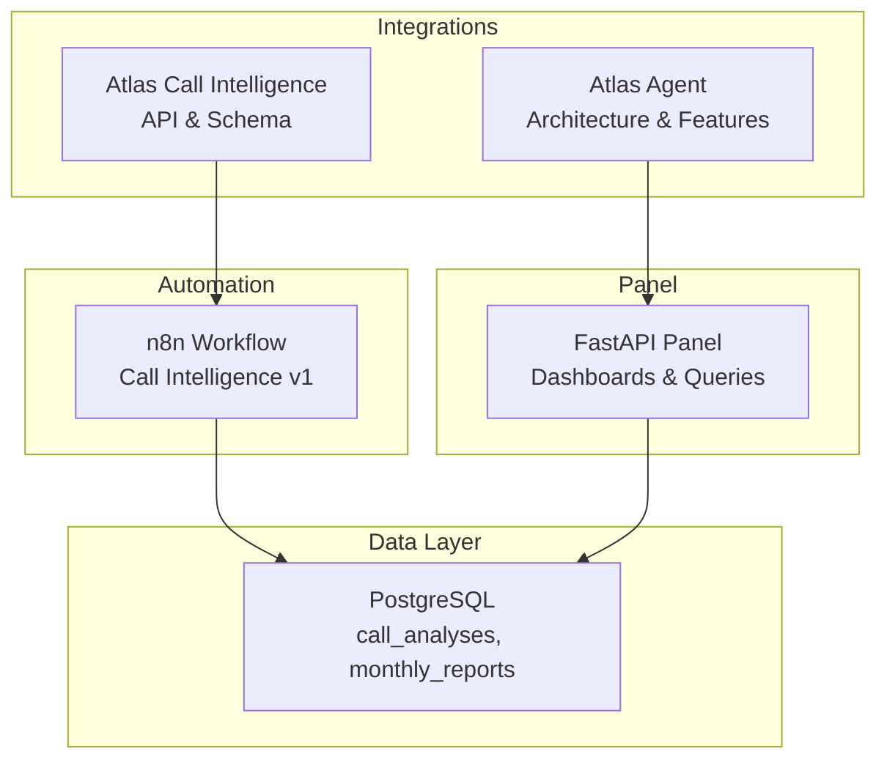
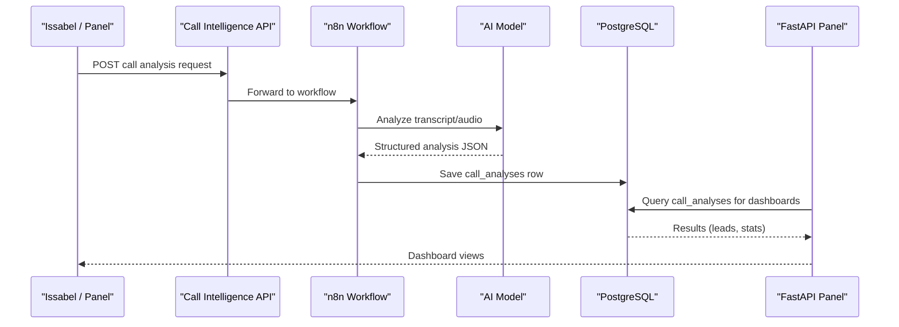
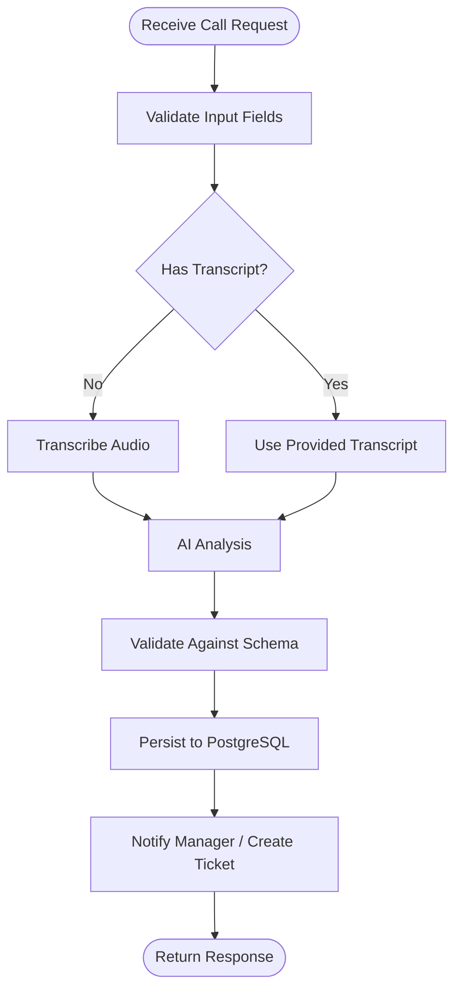
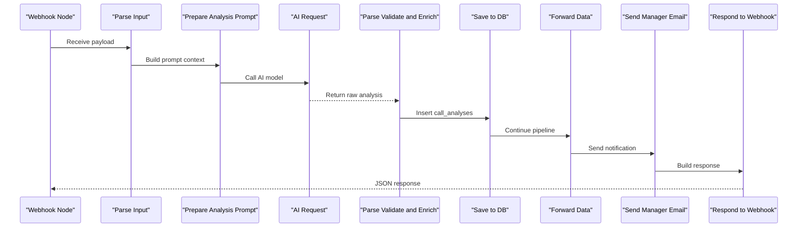
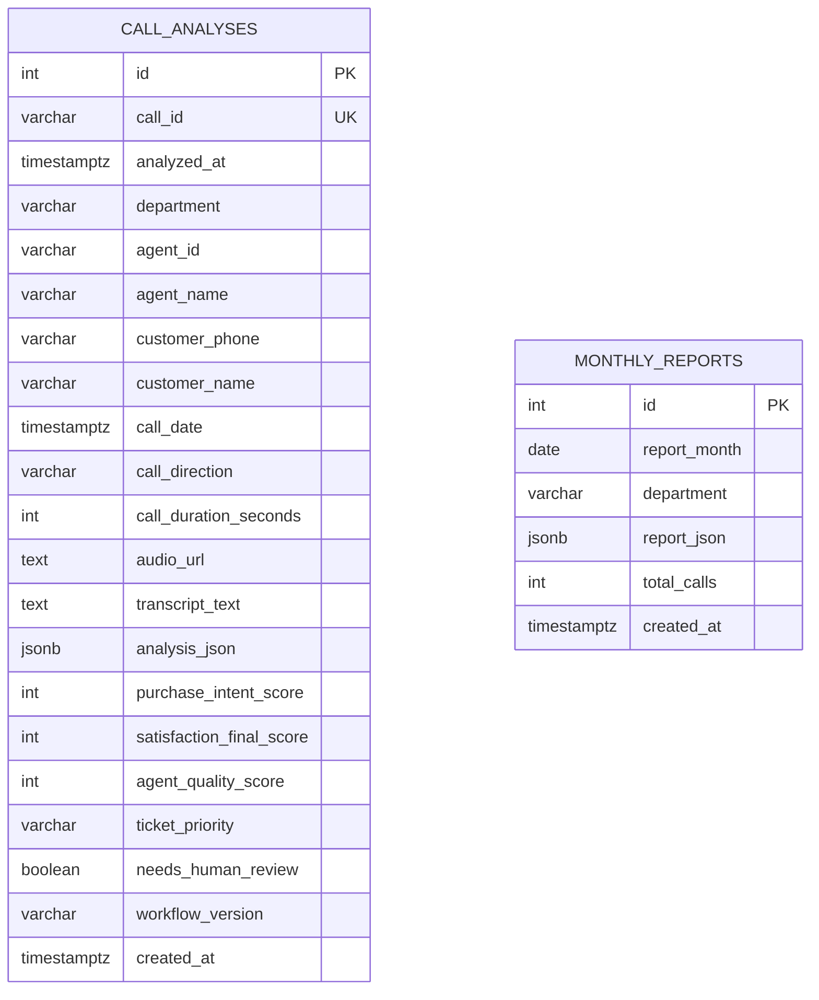
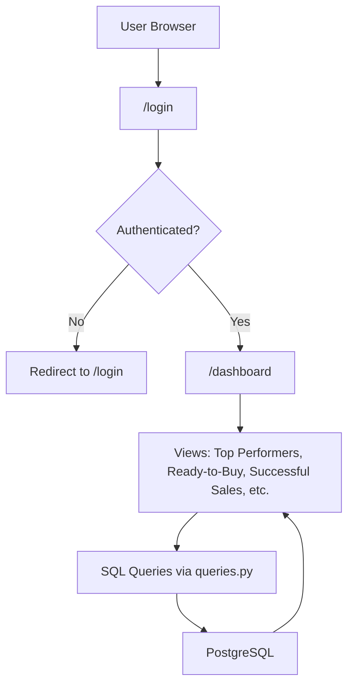
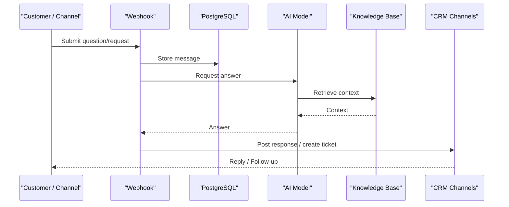
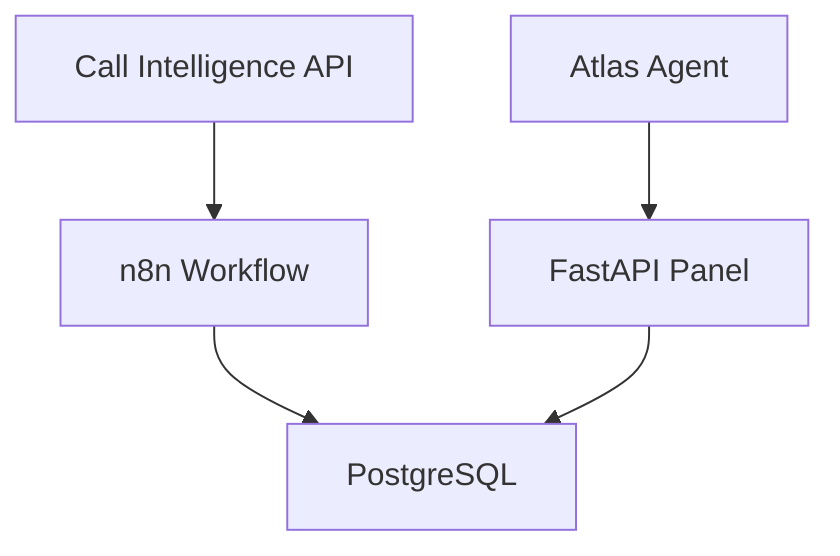

# Atlas CRM

<cite>
**Referenced Files in This Document**
- [README.md](file://03_Products/Atlas Call Intelligence/V1/README.md)
- [schema.json](file://03_Products/Atlas Call Intelligence/V1/schema.json)
- [atlas-call-intelligence-v1.json](file://docker/n8n/workflows/atlas-call-intelligence-v1.json)
- [001_call_intelligence.sql](file://docker/postgres/init/001_call_intelligence.sql)
- [002_panel_seed.sql](file://docker/postgres/init/002_panel_seed.sql)
- [main.py](file://docker/panel/app/main.py)
- [queries.py](file://docker/panel/app/queries.py)
- [db.py](file://docker/panel/app/db.py)
- [config.py](file://docker/panel/app/config.py)
- [Architecture.md](file://03_Products/Atlas Agent/V1/Architecture.md)
- [Features.md](file://03_Products/Atlas Agent/V1/Features.md)
</cite>

## Table of Contents
1. Introduction
2. Project Structure
3. Core Components
4. Architecture Overview
5. Detailed Component Analysis
6. Dependency Analysis
7. Performance Considerations
8. Troubleshooting Guide
9. Conclusion
10. Appendices

## Introduction
Atlas CRM is a customer relationship management and sales pipeline automation system designed for accounting firms and software companies. It centralizes contact management, lead tracking, and sales funnel optimization by ingesting call intelligence data, enriching it with AI-driven insights, and surfacing actionable opportunities through dashboards and reports. The CRM integrates with Atlas Agent for intelligent support workflows and with Atlas Call Intelligence to transform voice interactions into structured CRM records, enabling seamless customer data flow across systems.

Key benefits:
- Contact management: capture and organize customer identities, phone numbers, and interaction history from calls.
- Lead tracking: score purchase intent, classify stages, and prioritize follow-ups based on call analysis.
- Sales pipeline optimization: identify hot leads, estimate close probability, and recommend next steps to accelerate conversions.
- Integration patterns: connect Atlas Agent and Atlas Call Intelligence via webhooks and shared PostgreSQL storage for end-to-end automation.

## Project Structure
The repository organizes product documentation under 03_Products and operational components under docker. For Atlas CRM, the relevant pieces include:
- Product documentation for Call Intelligence (API, schema, installation).
- n8n workflow that orchestrates transcription, AI analysis, database persistence, and notifications.
- PostgreSQL schema storing per-call analyses and monthly reports.
- A FastAPI panel that exposes dashboards and queries for CRM insights.
- Atlas Agent architecture and features for knowledge-based support and ticket creation.

**Diagram sources**
- [atlas-call-intelligence-v1.json:126-159](file://docker/n8n/workflows/atlas-call-intelligence-v1.json#L126-L159)
- [001_call_intelligence.sql:1-45](file://docker/postgres/init/001_call_intelligence.sql#L1-L45)
- [main.py:71-189](file://docker/panel/app/main.py#L71-L189)
- [README.md:16-28](file://03_Products/Atlas Call Intelligence/V1/README.md#L16-L28)
- [Architecture.md:17-64](file://03_Products/Atlas Agent/V1/Architecture.md#L17-L64)

**Section sources**
- [README.md:16-28](file://03_Products/Atlas Call Intelligence/V1/README.md#L16-L28)
- [atlas-call-intelligence-v1.json:126-159](file://docker/n8n/workflows/atlas-call-intelligence-v1.json#L126-L159)
- [001_call_intelligence.sql:1-45](file://docker/postgres/init/001_call_intelligence.sql#L1-L45)
- [main.py:71-189](file://docker/panel/app/main.py#L71-L189)
- [Architecture.md:17-64](file://03_Products/Atlas Agent/V1/Architecture.md#L17-L64)

## Core Components
- Call Intelligence API and schema define standardized inputs and outputs for call analysis, including department classification, satisfaction scoring, agent performance metrics, and sales analysis fields used for lead tracking.
- n8n workflow orchestrates the ingestion of audio or transcripts, triggers AI analysis, persists results to PostgreSQL, and forwards data for notifications or CRM updates.
- PostgreSQL stores per-call analyses and monthly aggregated reports, providing a single source of truth for CRM dashboards and analytics.
- FastAPI panel provides authenticated dashboards for ready-to-buy leads, successful sales, staff performance, satisfaction, and call details, driven by SQL queries against call_analyses.
- Atlas Agent architecture outlines a webhook-driven flow that can create tickets and integrate with CRM channels, enabling automated support and follow-up actions.

Practical examples for accounting firms:
- Capture inbound calls about bookkeeping or tax software, analyze intent, and auto-create CRM contacts with purchase intent scores.
- Track follow-ups for clients needing multi-year compliance solutions using recommended next steps from call analysis.
- Monitor staff performance and satisfaction to improve client retention and upsell opportunities.

**Section sources**
- [README.md:71-142](file://03_Products/Atlas Call Intelligence/V1/README.md#L71-L142)
- [schema.json:1-153](file://03_Products/Atlas Call Intelligence/V1/schema.json#L1-L153)
- [atlas-call-intelligence-v1.json:126-159](file://docker/n8n/workflows/atlas-call-intelligence-v1.json#L126-L159)
- [001_call_intelligence.sql:1-45](file://docker/postgres/init/001_call_intelligence.sql#L1-L45)
- [main.py:71-189](file://docker/panel/app/main.py#L71-L189)
- [queries.py:31-198](file://docker/panel/app/queries.py#L31-L198)
- [Architecture.md:17-64](file://03_Products/Atlas Agent/V1/Architecture.md#L17-L64)

## Architecture Overview
The CRM architecture connects call intake, AI analysis, data persistence, and dashboard visualization:
- Call recordings or transcripts are sent to the Call Intelligence API.
- n8n processes input, calls AI models, validates output against schema, saves to PostgreSQL, and optionally notifies managers or creates CRM tickets.
- The panel reads from PostgreSQL to present CRM views such as hot leads, successful sales, and staff performance.
- Atlas Agent can integrate via webhooks to create tickets and feed CRM channels, closing the loop between support and sales.

**Diagram sources**
- [README.md:71-142](file://03_Products/Atlas Call Intelligence/V1/README.md#L71-L142)
- [atlas-call-intelligence-v1.json:126-159](file://docker/n8n/workflows/atlas-call-intelligence-v1.json#L126-L159)
- [001_call_intelligence.sql:1-45](file://docker/postgres/init/001_call_intelligence.sql#L1-L45)
- [main.py:71-189](file://docker/panel/app/main.py#L71-L189)

## Detailed Component Analysis

### Call Intelligence API and Schema
- Input fields include audio URL or transcript, call metadata (direction, duration, date), and optional context like product domain.
- Output schema standardizes meta, transcript, customer sentiment/satisfaction, agent performance, sales analysis, support analysis, ticket generation, insights, and quality control flags.
- This structure enables consistent lead tracking and contact enrichment across CRM surfaces.

**Diagram sources**
- [README.md:71-142](file://03_Products/Atlas Call Intelligence/V1/README.md#L71-L142)
- [schema.json:1-153](file://03_Products/Atlas Call Intelligence/V1/schema.json#L1-L153)
- [atlas-call-intelligence-v1.json:126-159](file://docker/n8n/workflows/atlas-call-intelligence-v1.json#L126-L159)

**Section sources**
- [README.md:71-142](file://03_Products/Atlas Call Intelligence/V1/README.md#L71-L142)
- [schema.json:1-153](file://03_Products/Atlas Call Intelligence/V1/schema.json#L1-L153)

### n8n Workflow Orchestration
- The workflow defines nodes for parsing input, preparing prompts, invoking AI, validating/enriching output, saving to DB, forwarding data, sending manager emails, and responding to webhooks.
- Connections ensure sequential processing and error handling paths for robust CRM data ingestion.

**Diagram sources**
- [atlas-call-intelligence-v1.json:126-159](file://docker/n8n/workflows/atlas-call-intelligence-v1.json#L126-L159)

**Section sources**
- [atlas-call-intelligence-v1.json:126-159](file://docker/n8n/workflows/atlas-call-intelligence-v1.json#L126-L159)

### PostgreSQL Data Model for CRM
- call_analyses table stores per-call metadata, transcript text, analysis JSON, and derived scores (purchase intent, satisfaction, agent quality).
- monthly_reports table aggregates performance and insights by month and department.
- Indexes optimize queries for time-based reporting, agent performance, and department filtering.

**Diagram sources**
- [001_call_intelligence.sql:1-45](file://docker/postgres/init/001_call_intelligence.sql#L1-L45)

**Section sources**
- [001_call_intelligence.sql:1-45](file://docker/postgres/init/001_call_intelligence.sql#L1-L45)

### FastAPI Panel and CRM Dashboards
- Routes expose dashboards for overview, top performers, ready-to-buy leads, unhappy customers, staff performance, call duration, satisfaction, successful sales, monthly reports, and call detail pages.
- Authentication middleware protects routes when a password is configured; static assets are served separately.
- Queries fetch CRM-relevant metrics such as hot leads, success scores, and satisfaction rates.

**Diagram sources**
- [main.py:43-189](file://docker/panel/app/main.py#L43-L189)
- [queries.py:31-198](file://docker/panel/app/queries.py#L31-L198)
- [001_call_intelligence.sql:1-45](file://docker/postgres/init/001_call_intelligence.sql#L1-L45)

**Section sources**
- [main.py:43-189](file://docker/panel/app/main.py#L43-L189)
- [queries.py:31-198](file://docker/panel/app/queries.py#L31-L198)

### Atlas Agent Integration Patterns
- Architecture describes a webhook-driven flow that validates input, interacts with a database, calls an AI model, consults a knowledge base, and returns responses to channels including CRM.
- Features include message receipt, storage, AI response, and future ticket creation and chat history—enabling CRM integration for support and follow-up automation.

**Diagram sources**
- [Architecture.md:17-64](file://03_Products/Atlas Agent/V1/Architecture.md#L17-L64)
- [Features.md:1-67](file://03_Products/Atlas Agent/V1/Features.md#L1-L67)

**Section sources**
- [Architecture.md:17-64](file://03_Products/Atlas Agent/V1/Architecture.md#L17-L64)
- [Features.md:1-67](file://03_Products/Atlas Agent/V1/Features.md#L1-L67)

## Dependency Analysis
- n8n workflow depends on AI services and PostgreSQL; it writes call analyses consumed by the panel.
- Panel depends on PostgreSQL and configuration variables for DB credentials and optional auth.
- Call Intelligence API depends on transcription and AI endpoints; its schema ensures consistent CRM data structures.
- Atlas Agent can depend on webhooks and databases to integrate with CRM channels.

**Diagram sources**
- [atlas-call-intelligence-v1.json:126-159](file://docker/n8n/workflows/atlas-call-intelligence-v1.json#L126-L159)
- [main.py:71-189](file://docker/panel/app/main.py#L71-L189)
- [config.py:1-14](file://docker/panel/app/config.py#L1-L14)
- [README.md:16-28](file://03_Products/Atlas Call Intelligence/V1/README.md#L16-L28)

**Section sources**
- [atlas-call-intelligence-v1.json:126-159](file://docker/n8n/workflows/atlas-call-intelligence-v1.json#L126-L159)
- [main.py:71-189](file://docker/panel/app/main.py#L71-L189)
- [config.py:1-14](file://docker/panel/app/config.py#L1-L14)
- [README.md:16-28](file://03_Products/Atlas Call Intelligence/V1/README.md#L16-L28)

## Performance Considerations
- Database indexing on analyzed_at, agent_id, department, and call_date improves query performance for dashboards and reports.
- Using JSONB for analysis_json allows flexible enrichment without schema migrations while maintaining queryability via operators.
- n8n workflow should batch operations where possible and handle retries for AI and email services to reduce latency spikes.
- Panel queries limit result sets (e.g., top performers, recent calls) to keep UI responsive.

[No sources needed since this section provides general guidance]

## Troubleshooting Guide
- Authentication issues: Ensure PANEL_PASSWORD is set if protecting the panel; verify cookie and redirect behavior on login.
- Database connectivity: Confirm DB_HOST, DB_PORT, DB_NAME, DB_USER, DB_PASSWORD environment variables match the running PostgreSQL instance.
- Missing data: Verify n8n workflow saved rows to call_analyses; check indexes and unique constraints on call_id.
- Schema mismatches: Validate AI output against schema.json to avoid parse errors during persistence.
- Seed data: Use seed script to populate sample call_analyses for demo dashboards.

**Section sources**
- [main.py:43-68](file://docker/panel/app/main.py#L43-L68)
- [config.py:1-14](file://docker/panel/app/config.py#L1-L14)
- [001_call_intelligence.sql:1-45](file://docker/postgres/init/001_call_intelligence.sql#L1-L45)
- [schema.json:1-153](file://03_Products/Atlas Call Intelligence/V1/schema.json#L1-L153)
- [002_panel_seed.sql:1-20](file://docker/postgres/init/002_panel_seed.sql#L1-L20)

## Conclusion
Atlas CRM leverages Atlas Call Intelligence and Atlas Agent to automate contact management, lead tracking, and sales pipeline optimization. By standardizing call analysis outputs, persisting them in PostgreSQL, and exposing actionable dashboards, accounting firms can efficiently manage client relationships, prioritize high-intent leads, and improve conversion rates. Integrating support workflows via Atlas Agent further closes the loop between customer service and sales, ensuring seamless data flow and continuous improvement.

[No sources needed since this section summarizes without analyzing specific files]

## Appendices

### Practical Examples for Accounting Firms
- Inbound call about bookkeeping software:
  - Capture customer name and phone, analyze intent, assign purchase stage, and schedule follow-up based on recommended next step.
- Multi-year tax compliance inquiry:
  - Identify pain points and needs, tag as high-value opportunity, and route to senior sales rep with estimated close probability.
- Support call escalation:
  - Detect unresolved issues and churn risk; create CRM ticket and notify account manager for proactive outreach.

[No sources needed since this section provides conceptual examples]